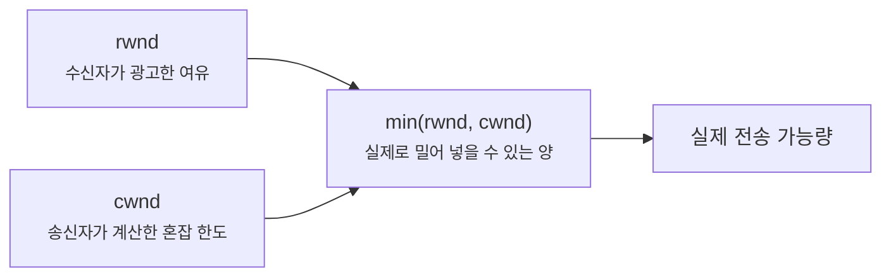
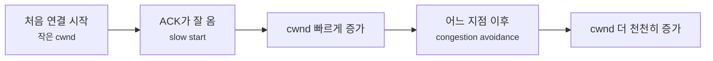
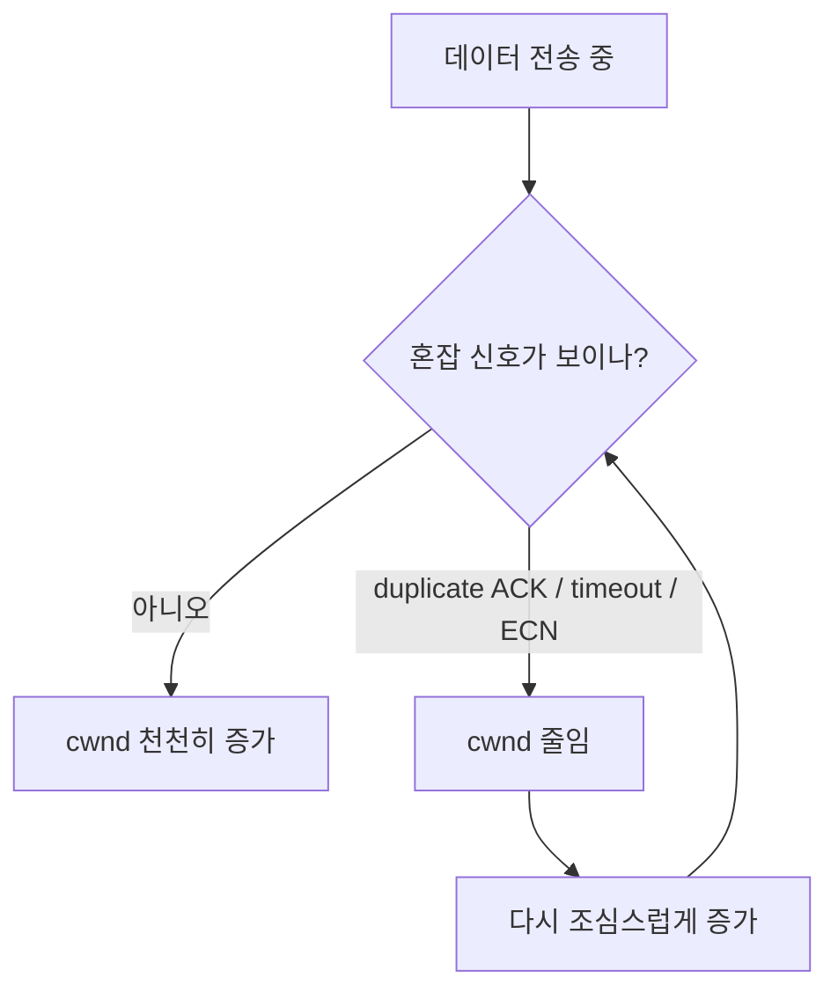

# TCP 혼잡 제어는 왜 흐름 제어와 따로 봐야 할까요?

> 느려졌다고 해서 항상 패킷이 사라진 건 아니에요. **TCP는 가끔 스스로 "지금은 길이 붐비는 것 같으니 조금만 보낼게요" 하고 물러서요.**

[TCP 재전송과 신뢰성](../basic/22-tcp-retransmission-and-reliability.md){ data-preview }에서는 TCP가 **빠진 조각을 다시 보내는 법**을 먼저 봤고, [TCP 윈도우와 흐름 제어는 왜 같이 읽어야 할까요?](./tcp-window-and-flow-control.md#flow-control-over-time){ data-preview }에서는 **받는 쪽이 지금 얼마나 더 받아둘 수 있는지**를 광고하는 Window도 봤어요.

근데 여기서 이런 질문이 생기죠.

> *"좋아요, 받는 쪽 여유는 알겠어요. 근데 받는 쪽은 멀쩡한데도 왜 TCP가 갑자기 더 조심스럽게 보내는 것처럼 보일 때가 있죠?"*

이 글이 필요한 이유는, 느림의 원인을 자꾸 **수신자 버퍼 문제**랑 **길이 막힌 문제**로 섞어 읽기 쉽기 때문이에요.

- 받는 쪽은 멀쩡한데 송신자가 왜 **스스로 속도를 줄이는지**
- `win` 값은 괜찮아 보이는데 왜 여전히 **천천히 가는지**
- duplicate ACK, timeout, `ECE/CWR` 같은 신호가 왜 **길 사정** 이야기인지

오늘은 **수신자 버퍼 여유를 보는 흐름 제어**와, **네트워크 길 자체가 붐비는지 보며 송신 속도를 조절하는 혼잡 제어**를 나눠서 보고, `cwnd`, slow start, congestion avoidance, duplicate ACK 같은 말을 초심자 눈높이에서 같이 정리해볼게요.

!!! note "이 글의 범위"
    여기서는 **혼잡 제어의 큰 원리**에 집중해요. 수신자 버퍼 여유를 광고하는 `Window` 와 `rwnd` 쪽은 [TCP 윈도우와 흐름 제어는 왜 같이 읽어야 할까요?](./tcp-window-and-flow-control.md#flow-control-over-time){ data-preview }에서 이미 봤어요. 이번 글은 [RFC 5681](https://www.rfc-editor.org/rfc/rfc5681.txt) 기준의 **Reno 계열 혼잡 제어 감각**을 뼈대로 설명할 거예요. 다만 실제 운영체제는 CUBIC 같은 다른 알고리즘을 쓸 수도 있으니, 여기서는 **모든 구현의 세부 차이**까지 다 외우기보다 **송신자가 왜 스스로 속도를 줄이게 되는지**에 집중하면 충분해요.

---

## 그래서 혼잡 제어는 한마디로 뭐예요?

혼잡 제어는 **받는 쪽이 아니라, 네트워크 길 전체가 지금 얼마나 감당할 수 있는지 보고 송신자가 스스로 속도를 조절하는 규칙**이에요.

TCP도 비슷해요. **흐름 제어**는 *"상대 창고가 안 넘치게"*, **혼잡 제어**는 *"길 자체가 안 막히게"* 조절한다고 보면 감이 와요.

| 기본편에서 잡은 감각 | 비유에서는 | 실제로는 |
|---|---|---|
| 흐름 제어 | 받는 창고 선반이 꽉 차지 않게 조절 | `rwnd` / advertised window |
| 혼잡 제어 | 도로가 막히면 출차 속도를 줄임 | `cwnd` / congestion window |
| 재전송 | 중간에 빠진 상자를 다시 보냄 | timeout, fast retransmit |
| duplicate ACK | "그 앞자리 상자가 아직 안 왔어요"라는 반복 연락 | 손실 가능성을 알려주는 신호 |
| slow start | 처음엔 길 상태를 몰라서 조심스럽게 탐색 | 작은 `cwnd`에서 시작해 빠르게 증가 |

즉, **흐름 제어는 받는 쪽 사정**, **혼잡 제어는 길 사정**이에요.

---

## 흐름 제어와 혼잡 제어는 뭐가 다를까요? { #flow-vs-congestion }

이 둘은 초심자 때 정말 자주 섞여요. 근데 여기서 한 번 선명하게 나눠두면 뒤 장면이 훨씬 덜 헷갈려요.

| 질문 | 흐름 제어 | 혼잡 제어 |
|---|---|---|
| 무엇을 보호하나 | **수신자 버퍼** | **네트워크 경로 전체** |
| 누가 기준을 말하나 | 받는 쪽이 `Window` 로 광고 | 보내는 쪽이 `cwnd` 를 내부적으로 계산 |
| 왜 줄이나 | 상대가 더 못 받을 것 같아서 | 길이 막히거나 손실/혼잡 신호가 보여서 |
| 대표 단서 | `rwnd`, `win 0`, shrinking window | timeout, duplicate ACK, `ECE` / `CWR` |
| 질문으로 바꾸면 | "상대가 더 받아둘 수 있나?" | "길이 지금 감당할 수 있나?" |

여기서 중요한 한 줄만 뽑으면 이거예요.

> 흐름 제어는 **받는 쪽이 괜찮냐**를 보고, 혼잡 제어는 **길이 괜찮냐**를 봐요.

---

## 실제 송신 한도는 어떻게 정해질까요? { #send-limit }

그럼 실제로는 뭐가 최종 속도를 정할까요?



이 그림이 핵심이에요. 실제로 보내는 쪽은 보통 **`rwnd` 와 `cwnd` 중 더 작은 쪽**에 맞춰 움직여요.

- `rwnd` 가 더 작으면 → **상대가 더 못 받는 상황**
- `cwnd` 가 더 작으면 → **길이 더 못 버틸 것 같은 상황**

그래서 *"받는 쪽 여유는 충분한데도 왜 못 보내지?"* 싶을 때는, `rwnd` 문제가 아니라 **`cwnd` 쪽이 더 작은 상황**일 수 있어요.

여기서는 한 줄만 먼저 분리할게요.

> `cwnd` 는 보통 **TCP 헤더 안에 그대로 실려서 보이는 값이 아니에요.** `rwnd` 는 캡처 줄의 `win` 같은 힌트로 더 직접 보일 수 있지만, `cwnd` 는 송신자 내부 계산에 더 가까워요.

---

## TCP 헤더에서는 어떤 신호가 보일까요? { #header-signals }

혼잡 제어가 전부 TCP 헤더 안에 한 칸으로 들어 있는 건 아니에요. 이게 초심자에게 가장 헷갈리는 부분이죠.

<div style="margin: 1.5rem 0; border: 2px solid var(--md-default-fg-color--lighter); border-radius: 0.75rem; overflow: hidden; background: color-mix(in srgb, var(--md-default-bg-color) 95%, var(--md-default-fg-color) 5%);">
  <div style="display: grid; grid-template-columns: repeat(24, 1fr); padding: 0.4rem 0.6rem; gap: 0; background: color-mix(in srgb, var(--md-primary-fg-color) 8%, var(--md-default-bg-color)); border-bottom: 1px solid var(--md-default-fg-color--lightest); font-size: 0.65rem; color: var(--md-default-fg-color--light); text-align: center;">
    <span style="grid-column: span 8;">Flags</span>
    <span style="grid-column: span 16;">Window</span>
  </div>
  <div style="display: grid; grid-template-columns: repeat(24, 1fr); gap: 2px; padding: 0.6rem; background: var(--md-default-fg-color--lightest);">
    <div style="grid-column: span 1; padding: 0.45rem 0.1rem; background: color-mix(in srgb, #ef4444 18%, var(--md-default-bg-color)); text-align: center; font-size: 0.7rem; border-radius: 0.25rem;"><strong>CWR</strong></div>
    <div style="grid-column: span 1; padding: 0.45rem 0.1rem; background: color-mix(in srgb, #f97316 18%, var(--md-default-bg-color)); text-align: center; font-size: 0.7rem; border-radius: 0.25rem;"><strong>ECE</strong></div>
    <div style="grid-column: span 6; padding: 0.45rem 0.1rem; background: color-mix(in srgb, #0ea5e9 12%, var(--md-default-bg-color)); text-align: center; font-size: 0.7rem; border-radius: 0.25rem;"><strong>기타 Flags</strong></div>
    <div style="grid-column: span 16; padding: 0.45rem 0.1rem; background: color-mix(in srgb, #6366f1 18%, var(--md-default-bg-color)); text-align: center; font-size: 0.78rem; border-radius: 0.25rem;"><strong>Window (rwnd)</strong><br/><small>수신자 광고값</small></div>
  </div>
</div>

이 그림에서 읽어야 할 건 이거예요.

1. `Window` 는 **수신자 쪽 제한**을 더 직접 보여줘요.
2. `ECE`, `CWR` 는 **ECN 혼잡 신호**와 관련된 비트예요.
3. 하지만 `cwnd` 자체는 보통 **송신자 내부 상태**라서, 캡처 줄에 그대로 `cwnd=...` 식으로 찍히는 게 아니에요.

| 신호/값 | 어디서 주로 보나 | 무슨 뜻인가 | 주의할 점 |
|---|---|---|---|
| `Window` / `win` | TCP 헤더, 캡처 줄 | 수신자가 더 받아둘 수 있는 양 | 혼잡 제어 값이 아님 |
| `ECE` | TCP Flags | ECN 혼잡 신호 반사 | 항상 "이미 망했다"는 뜻은 아님 |
| `CWR` | TCP Flags | 혼잡 윈도우를 줄였다는 응답 | ECN 맥락에서 읽어야 함 |
| duplicate ACK | 캡처/분석 도구 | 빠진 조각 가능성 알림 | 재정렬 때문에 생길 수도 있음 |
| `cwnd` | 송신자 내부 상태 | 현재 길 사정을 반영한 송신 한도 | 캡처에 직접 안 보일 수 있음 |

즉, **혼잡 제어는 TCP 헤더 안의 한 칸으로 끝나는 주제가 아니라**, 헤더 신호 + ACK 패턴 + 송신자 내부 계산이 같이 움직이는 주제예요.

---

## 보내는 쪽은 왜 처음엔 천천히 시작할까요? { #slow-start-and-growth }

처음 연결이 열렸다고 해서, 송신자가 바로 *"좋아, 한꺼번에 엄청 보내자"* 하면 위험하겠죠. 아직 길 상태를 모르니까요.

그래서 혼잡 제어는 보통 **작은 `cwnd` 에서 시작**해요.



이 흐름에서 핵심은 두 단계예요.

- **slow start** — 처음엔 아직 길을 잘 모르니, ACK가 올 때마다 꽤 빠르게 늘려봐요.
- **congestion avoidance** — 어느 정도 올라간 뒤에는, 계속 같은 속도로 키우지 않고 더 조심스럽게 늘려요.

[RFC 5681](https://www.rfc-editor.org/rfc/rfc5681.txt) 기준으로 이 두 단계는 아주 기본적인 혼잡 제어 뼈대예요. 초심자 입장에서는 수식보다 **"처음엔 탐색, 그다음엔 조심"** 이라는 감각이 먼저 중요해요.

---

## 길이 붐빈다고 판단하면 어떻게 줄일까요? { #backoff-signals }

그럼 TCP는 언제 *"아, 지금은 좀 줄여야겠다"* 고 느낄까요?

대표적으로는 이런 신호들이 있어요.

1. **timeout** — 너무 오래 ACK가 안 와요.
2. **duplicate ACK가 여러 번 반복됨** — 중간 조각이 비었을 가능성이 보여요.
3. **ECN 관련 신호** — 꼭 손실까지 나기 전에 길이 붐빈다는 힌트가 와요.



여기서는 가지를 한 번만 좁혀둘게요.

> duplicate ACK는 **손실 가능성**을 알려주는 강한 힌트예요. 하지만 **패킷 재정렬** 때문에도 비슷하게 보일 수 있으니, 무조건 손실 확정이라고 읽지는 않아요.

---

## 실제 캡처에서는 무엇을 읽어야 할까요? { #capture-signals }

혼잡 제어는 `cwnd` 가 바로 보이지 않는다고 했죠. 그래서 캡처에서는 **직접 숫자 하나**보다 **증상 묶음**을 더 봐야 해요. 즉 여기서 우리가 보는 건 `cwnd` 자체가 아니라, **송신자가 그렇게 판단했을 것 같은 패턴**이에요.

```text
14:32:01.123456 Out IP ... Flags [P.], seq 1001:2449, ack 5001, win 502, length 1448
14:32:01.158204 In  IP ... Flags [.], ack 1001, win 64240, length 0
14:32:01.165901 In  IP ... Flags [.], ack 1001, win 64240, length 0
14:32:01.172488 In  IP ... Flags [.], ack 1001, win 64240, length 0
14:32:01.179010 Out IP ... Flags [P.], seq 1001:2449, ack 5001, win 502, length 1448
```

이 장면에서 먼저 읽어야 할 신호 네 가지는 이거예요.

1. **같은 ACK가 반복되는지**
2. **같은 seq 범위의 재전송이 뒤따르는지**
3. **수신자 `win` 은 넉넉한데도 송신 패턴이 움츠러드는지**
4. **`ECE` / `CWR` 같은 ECN 비트가 보이는지**

즉, 혼잡 제어는 이런 식으로 읽어요.

- `win 0` 이다 → 수신자 여유 문제 쪽
- duplicate ACK + 같은 seq 범위 재전송이 보인다 → 손실 / 혼잡 신호 쪽
- `win` 은 멀쩡한데 송신 패턴이 작아진다 → `cwnd` 쪽 제한을 의심

이런 식으로 **수신자 문제**와 **길 문제**를 분리해서 보는 감각이 중요해요.

---

## 근데 왜? 재전송 글 다음에 이걸 알아야 할까요? { #why-it-matters }

재전송만 알고 있으면 *"느려졌다 = 잃어버렸다"* 쪽으로 자꾸 생각이 기울어요. 근데 실제로는 **유실 복구**와 **혼잡 회피**가 같이 돌아가요.

### 1. 느림의 원인을 더 정확히 나눌 수 있어요

받는 쪽 여유 부족인지, 길 붐빔인지, 진짜 손실인지가 전부 같은 말은 아니거든요.

### 2. duplicate ACK의 의미가 더 또렷해져요

[TCP 재전송과 신뢰성](../basic/22-tcp-retransmission-and-reliability.md#retransmission-symptoms){ data-preview }에서 duplicate ACK는 빠진 조각의 힌트였죠. 오늘 한 걸음 더 들어가면, 그건 동시에 **혼잡 제어가 몸을 사리기 시작하는 계기**가 되기도 해요.

### 3. 흐름 제어 글과 같이 읽어야 전체 그림이 닫혀요

[TCP 윈도우와 흐름 제어](./tcp-window-and-flow-control.md#flow-control-over-time){ data-preview }가 **받는 쪽 한도**, 오늘 글이 **길 한도**를 맡아요. 이 둘을 같이 봐야 *"지금 왜 이만큼밖에 못 보내지?"* 라는 질문에 훨씬 정확히 답할 수 있어요.

---

## 잘못 읽기 쉬운 함정 다섯 가지 { #pitfalls }

**하나, `Window` 가 작으면 곧바로 혼잡 제어 문제라고 생각하기.**  
`Window` 는 먼저 **수신자 여유** 쪽 신호예요.

**둘, 느려지면 무조건 패킷 손실이라고 단정하기.**  
손실 없이도 혼잡 제어 때문에 송신자가 더 조심스러워질 수 있어요.

**셋, duplicate ACK가 보이면 손실이 100% 확정이라고 읽기.**  
강한 힌트는 맞지만, 재정렬 같은 다른 원인도 가능해요.

**넷, `cwnd` 도 캡처 줄에 `win` 처럼 바로 보인다고 생각하기.**  
보통 `cwnd` 는 송신자 내부 상태에 더 가까워요.

**다섯, RFC 5681 설명이 모든 운영체제의 유일한 모습이라고 믿기.**  
실제 구현은 CUBIC 같은 다른 알고리즘을 쓸 수 있어요. 오늘 글은 **가장 기본적인 혼잡 제어 감각**을 잡는 데 초점을 맞춘 거예요.

---

## 자, 정리해볼까요?

!!! abstract "오늘 우리가 본 것"
    - 흐름 제어는 **받는 쪽 버퍼 여유**를 보고, 혼잡 제어는 **네트워크 길 사정**을 봐요.
    - 실제 전송량은 보통 **`rwnd` 와 `cwnd` 중 더 작은 쪽**의 영향을 받아요.
    - `cwnd` 는 송신자 내부에서 계산되는 값이라, `Window` 처럼 캡처 줄에 그대로 보이지 않을 수 있어요.
    - 혼잡 제어는 보통 **slow start → congestion avoidance → 혼잡 신호 시 감소** 흐름으로 읽을 수 있어요.
    - duplicate ACK, timeout, ECN 관련 비트는 모두 혼잡을 읽는 실마리가 될 수 있어요.

결국 혼잡 제어를 이해한다는 건, TCP가 단순히 *"빠진 걸 다시 보내는 친구"* 를 넘어서, **길이 붐비면 스스로 발을 떼는 친구**라는 걸 보는 일이에요.

---

## 이어서 보면 좋은 글

- 재전송과 duplicate ACK를 먼저 기본편 흐름으로 다시 보고 싶다면 — [TCP 재전송과 신뢰성](../basic/22-tcp-retransmission-and-reliability.md#retransmission-symptoms){ data-preview }
- 받는 쪽 한도와 길 한도를 구분해서 다시 보고 싶다면 — [TCP 윈도우와 흐름 제어는 왜 같이 읽어야 할까요?](./tcp-window-and-flow-control.md#flow-control-over-time){ data-preview }
- `Window`, `ECE`, `CWR` 같은 신호가 TCP 헤더 어디에 있는지 다시 보고 싶다면 — [TCP 헤더는 왜 이렇게 칸이 많을까요?](./tcp-header-anatomy.md#flags){ data-preview }
- `ECE`, `CWR` 비트를 플래그 관점에서 먼저 가볍게 읽고 싶다면 — [TCP 플래그는 어떻게 읽어야 할까요?](./tcp-flags-cheatsheet.md#flag-meanings){ data-preview }
- 이런 신호가 실제 tcpdump 줄에서는 어떻게 섞여 보이는지 먼저 감을 잡고 싶다면 — [tcpdump 한 줄은 어떻게 읽어야 할까요?](./tcpdump-first-look.md#one-line-anatomy){ data-preview }
