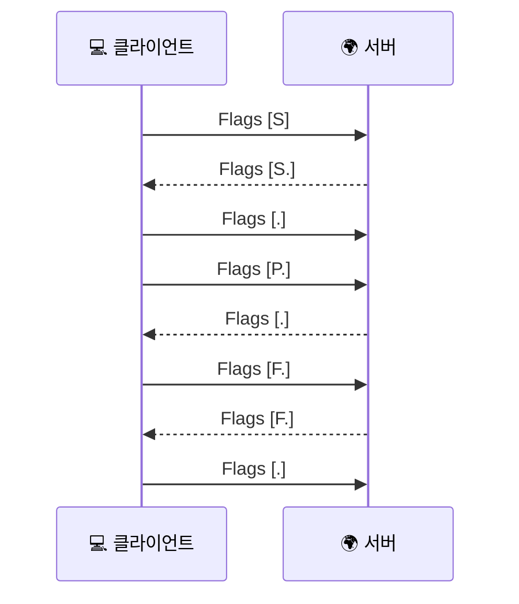

# TCP 플래그는 어떻게 읽어야 할까요?

> `Flags [S.]` 같은 짧은 표시는 작아 보이죠? **근데 연결의 분위기는 그 몇 비트 안에 거의 다 들어 있어요.**

[TCP 3-way handshake](../basic/09-tcp-3-way-handshake.md#handshake-signals){ data-preview }에서는 `SYN`, `SYN-ACK`, `ACK` 가 연결을 여는 신호라는 걸 먼저 봤고, [TCP 헤더는 왜 이렇게 칸이 많을까요?](./tcp-header-anatomy.md#flags){ data-preview }에서는 그 신호들이 TCP 헤더의 `Flags` 칸 안에 1비트씩 들어간다는 것도 펼쳐봤어요.

근데 막상 캡처 화면을 보면 또 이런 생각이 들어요.

> *"좋아요, `SYN` 이니 `ACK` 니 하는 말은 알겠어요. 근데 `Flags [S]`, `Flags [S.]`, `Flags [F.]`, `Flags [R]` 는 그때그때 어떤 분위기로 읽어야 하죠?"*

바로 그 질문에 답하는 글이에요. 오늘은 TCP 플래그를 **헤더의 8비트 깃발 칸**으로 다시 보고, tcpdump나 Wireshark에서 자주 만나는 조합을 **한 줄씩 해석하는 치트시트**처럼 정리해볼게요. 기본 의미는 [RFC 9293 3.1절](https://www.rfc-editor.org/rfc/rfc9293.html#name-header-format) 을 뼈대로 보고, `ECE` / `CWR` 같은 ECN 관련 비트는 [RFC 3168](https://www.rfc-editor.org/rfc/rfc3168) 쪽 감각만 가볍게 덧붙일게요.

!!! note "이 글의 범위"
    여기서는 **TCP 플래그를 읽는 감각**에 집중해요. sequence 번호와 ACK 번호가 헤더의 어느 줄에 들어가는지, window나 옵션이 전체 헤더에서 어떻게 보이는지는 [TCP 헤더는 왜 이렇게 칸이 많을까요?](./tcp-header-anatomy.md){ data-preview }에서 이미 펼쳐놨어요. 오늘은 그중에서도 **Flags 칸만 확대해서, 캡처에서 어떻게 읽을지**를 선명하게 만드는 편이라고 생각하면 돼요.

---

## 일단 비유로 시작해볼게요

이번에는 택배 상자에 붙는 **작은 상태 스티커**를 떠올려볼까요?

- `SYN` 은 **"지금 새 연결 시작해요"** 라는 시작 스티커,
- `ACK` 는 **"방금까지 받은 자리 확인했어요"** 라는 확인 스티커,
- `FIN` 은 **"이제 더 보낼 짐은 없어요"** 라는 마감 스티커,
- `RST` 는 **"이 상자는 잘못 왔어요. 지금 대화는 바로 접을게요"** 같은 급정지 스티커예요.

그러니까 TCP 플래그는 그냥 장식용 표시가 아니라, **지금 이 세그먼트가 연결에서 어떤 역할을 하는지**를 짧게 찍어두는 칸이라고 보면 돼요.

| 기본편에서 잡은 감각 | 비유에서는 | 실제로는 |
|---|---|---|
| 연결 시작 | 문을 열기 전에 거는 시작 표식 | `SYN` |
| 받았다는 확인 | 방금 본 번호를 확인하는 표시 | `ACK` |
| 연결 종료 | 더 보낼 게 없다는 마감 표시 | `FIN` |
| 비정상 중단 | 지금 대화를 즉시 접는 표시 | `RST` |
| 바로 넘겨달라는 힌트 | 이 메모는 버퍼에 오래 묵히지 말아달라는 표시 | `PSH` |

---

## 플래그 칸 전체 그림 { #flags-bits }

TCP 헤더의 `Flags` 는 **8비트**예요. 길이는 짧지만, 캡처를 읽을 때는 엄청 자주 등장해요.

<div style="margin: 1.5rem 0; border: 2px solid var(--md-default-fg-color--lighter); border-radius: 0.75rem; overflow: hidden; background: color-mix(in srgb, var(--md-default-bg-color) 95%, var(--md-default-fg-color) 5%);">
  <div style="display: grid; grid-template-columns: repeat(8, 1fr); padding: 0.4rem 0.6rem; gap: 0; background: color-mix(in srgb, var(--md-primary-fg-color) 8%, var(--md-default-bg-color)); border-bottom: 1px solid var(--md-default-fg-color--lightest); font-size: 0.65rem; color: var(--md-default-fg-color--light); text-align: center;">
    <span>0</span>
    <span>1</span>
    <span>2</span>
    <span>3</span>
    <span>4</span>
    <span>5</span>
    <span>6</span>
    <span>7</span>
  </div>
  <div style="display: grid; grid-template-columns: repeat(8, 1fr); gap: 2px; padding: 0.6rem; background: var(--md-default-fg-color--lightest);">
    <div style="padding: 0.5rem 0.2rem; background: color-mix(in srgb, #ef4444 18%, var(--md-default-bg-color)); text-align: center; font-size: 0.78rem; border-radius: 0.25rem;"><strong>CWR</strong><br/><small>1b</small></div>
    <div style="padding: 0.5rem 0.2rem; background: color-mix(in srgb, #f97316 18%, var(--md-default-bg-color)); text-align: center; font-size: 0.78rem; border-radius: 0.25rem;"><strong>ECE</strong><br/><small>1b</small></div>
    <div style="padding: 0.5rem 0.2rem; background: color-mix(in srgb, #eab308 18%, var(--md-default-bg-color)); text-align: center; font-size: 0.78rem; border-radius: 0.25rem;"><strong>URG</strong><br/><small>1b</small></div>
    <div style="padding: 0.5rem 0.2rem; background: color-mix(in srgb, #22c55e 18%, var(--md-default-bg-color)); text-align: center; font-size: 0.78rem; border-radius: 0.25rem;"><strong>ACK</strong><br/><small>1b</small></div>
    <div style="padding: 0.5rem 0.2rem; background: color-mix(in srgb, #14b8a6 18%, var(--md-default-bg-color)); text-align: center; font-size: 0.78rem; border-radius: 0.25rem;"><strong>PSH</strong><br/><small>1b</small></div>
    <div style="padding: 0.5rem 0.2rem; background: color-mix(in srgb, #06b6d4 18%, var(--md-default-bg-color)); text-align: center; font-size: 0.78rem; border-radius: 0.25rem;"><strong>RST</strong><br/><small>1b</small></div>
    <div style="padding: 0.5rem 0.2rem; background: color-mix(in srgb, #6366f1 18%, var(--md-default-bg-color)); text-align: center; font-size: 0.78rem; border-radius: 0.25rem;"><strong>SYN</strong><br/><small>1b</small></div>
    <div style="padding: 0.5rem 0.2rem; background: color-mix(in srgb, #8b5cf6 18%, var(--md-default-bg-color)); text-align: center; font-size: 0.78rem; border-radius: 0.25rem;"><strong>FIN</strong><br/><small>1b</small></div>
  </div>
</div>

여기서 먼저 잡아야 할 감각은 세 가지예요.

1. 각 플래그는 **1비트짜리 켜짐/꺼짐 표시**라는 점
2. 캡처 화면의 `Flags [S.]` 같은 표기는 **어떤 비트가 같이 켜졌는지**를 보기 좋게 풀어쓴 표현이라는 점
3. 실전에서는 `SYN`, `ACK`, `FIN`, `RST`, `PSH` 정도를 가장 자주 읽는다는 점

---

## 자주 보는 플래그는 각각 무슨 말일까요? { #flag-meanings }

| 플래그 | 축약 표기 | 의미 | 언제 자주 보나 |
|---|---|---|---|
| `SYN` | `S` | 연결 시작, 초기 sequence 번호 제안 | 3-way handshake 첫 단계 |
| `ACK` | `.` | 상대가 보낸 흐름을 확인하고 다음 번호를 알림 | 연결이 열린 뒤 거의 항상 |
| `FIN` | `F` | 더 보낼 데이터가 없음 | 정상 종료 |
| `RST` | `R` | 연결을 즉시 리셋 / 거절 | 포트 닫힘, 비정상 중단 |
| `PSH` | `P` | 데이터를 너무 오래 묵히지 말고 위로 넘겨달라는 힌트 | 대화형 트래픽, 응답 전송 |
| `URG` | `U` | Urgent Pointer가 유효함 | 요즘 웹 트래픽에선 드묾 |
| `ECE` | `E` | ECN 혼잡 신호 반사 | ECN 환경에서 가끔 |
| `CWR` | `W` | 혼잡 윈도우를 줄였다는 응답 | ECN 환경에서 가끔 |

### `SYN` — 연결을 열 때 보는 시작 신호

`SYN` 은 **"우리 연결 시작해볼까요?"** 에 가까운 비트예요. [TCP 3-way handshake](../basic/09-tcp-3-way-handshake.md#handshake-signals){ data-preview }에서 봤던 첫 번째 패킷이 바로 이 친구죠.

RFC 9293 3.4절 기준으로 `SYN` 은 단순 표식이 아니라 **sequence 공간을 1칸 차지하는 제어 비트**예요. 그래서 `SYN seq=1000` 다음에 상대가 `ack=1001` 로 답하는 거예요.

### `ACK` — 연결이 열린 뒤엔 거의 기본값처럼 붙어요

`ACK` 는 단순히 *"받았어요"* 가 아니라 **"나는 다음에 이 번호부터 기대해요"** 라는 뜻이죠. 연결이 성립된 뒤에는 대부분의 세그먼트에 `ACK` 가 붙어요.

그래서 캡처에서 `Flags [.]` 하나만 보여도, 그건 *"평범한 확인/데이터 흐름 안쪽 세그먼트일 가능성"* 을 먼저 떠올리면 돼요.

### `FIN` — 정리하고 나간다는 정상 마감 표시

`FIN` 은 **"이쪽에서 더 보낼 데이터는 없어요"** 라는 종료 표시예요. 이것도 `SYN` 처럼 **sequence 공간을 1칸** 써요. 그래서 데이터가 없어 보이는데도 ACK 숫자가 1 늘어나는 장면이 생길 수 있어요.

### `RST` — 예의 바른 종료가 아니라 즉시 중단이에요

`RST` 는 `FIN` 처럼 차분하게 닫는 표식이 아니에요. **지금 이 연결은 인정하지 않겠어요** 또는 **바로 접을게요** 쪽에 더 가까워요.

포트가 닫혀 있거나, 이미 없어진 연결로 패킷이 들어왔거나, 중간 장비가 세션을 끊을 때 자주 보여요.

### `PSH` — "지금 이 데이터는 좀 바로 넘겨줘" 정도의 힌트예요

`PSH` 는 초심자가 가장 많이 오해하는 플래그예요. **"긴급하다"** 는 뜻도 아니고, **"즉시 ACK 해라"** 는 명령도 아니에요. RFC 9293 3.9.1절 쪽 감각으로 보면, 받는 쪽이 이 데이터를 버퍼에 오래 묵히지 말고 **애플리케이션 쪽으로 빨리 밀어 올려달라**는 힌트에 더 가까워요.

그러니까 `PSH` 를 봤다고 *"엄청 특수한 패킷이네"* 라고까지 읽을 필요는 없어요. 응답 본문이나 대화형 트래픽에서 생각보다 자연스럽게 붙을 수 있어요. 다만 **언제 `PSH` 를 붙이는지는 구현마다 조금씩 다를 수 있다**는 점도 같이 기억해두면 좋아요.

### `URG`, `ECE`, `CWR` — 보이면 읽되, 기본 캡처 해석의 주인공은 아니에요

- `URG` 는 Urgent Pointer를 같이 봐야 의미가 있어요.
- `ECE`, `CWR` 는 ECN 흐름을 읽을 때 중요해요.

여기서 표지판 하나만 세워둘게요. `ECE` 와 `CWR` 는 **이미 혼잡이 났다는 뜻으로만** 읽으면 안 돼요. 특히 `SYN` / `SYN-ACK` 구간에서는 **ECN을 쓸 수 있는지 협상하는 신호**로도 보일 수 있어요.

다만 일반적인 웹 트래픽 입문 글에서는, **보이더라도 먼저 `SYN / ACK / FIN / RST / PSH` 부터 읽는 습관**을 들이면 충분해요.

---

## 캡처에서는 이런 조합으로 자주 보여요 { #common-combinations }

실전에서는 플래그를 하나씩 따로 보기보다, **같이 켜진 조합**으로 읽는 일이 더 많아요.

| 캡처 표기 | 어떻게 읽으면 되나 | 자주 보는 장면 |
|---|---|---|
| `Flags [S]` | 새 연결 시작 요청 | 클라이언트가 먼저 두드림 |
| `Flags [S.]` | `SYN + ACK`, 시작 번호 확인 + 자기 번호 제안 | 서버가 handshake 2번째 답장 |
| `Flags [.]` | `ACK` 만 켜진 기본 확인 상태 | 연결 성립 후 평범한 흐름 |
| `Flags [P.]` | `PSH + ACK`, 데이터는 있는데 확인도 같이 함 | 요청/응답 본문 전송 |
| `Flags [F.]` | `FIN + ACK`, 보낼 건 끝났고 지금까지 흐름도 확인 | 정상 종료 |
| `Flags [R]` 또는 `Flags [R.]` | 리셋 / 거절 / 즉시 중단 | 포트 닫힘, 세션 불일치 |



핸드셰이크, 데이터, 종료까지 한 컷으로 줄이면 이런 느낌이에요. 물론 실제 캡처에서는 여기에 sequence 번호, ACK 번호, window, payload 길이까지 같이 보이지만, **분위기를 제일 먼저 알려주는 건 플래그 조합**이에요.

---

## tcpdump 한 줄은 이렇게 읽어요 { #capture-lines }

예를 들어 tcpdump 류 출력에서 이런 줄을 본다고 해볼게요.

```text
IP 192.168.0.10.51515 > 93.184.216.34.443: Flags [S], seq 1000, win 64240, options [mss 1460,sackOK,TS val 1 ecr 0,nop,wscale 7], length 0
IP 93.184.216.34.443 > 192.168.0.10.51515: Flags [S.], seq 5000, ack 1001, win 65535, options [mss 1460,sackOK,TS val 10 ecr 1,nop,wscale 7], length 0
IP 192.168.0.10.51515 > 93.184.216.34.443: Flags [P.], seq 1001:1081, ack 5001, win 501, length 80
IP 93.184.216.34.443 > 192.168.0.10.51515: Flags [F.], seq 5001, ack 1081, win 1024, length 0
```

이 한 줄씩에서 먼저 읽으면 좋은 건 이거예요.

1. `Flags [S]` — **연결 시작**
2. `Flags [S.]` — **상대도 시작 번호를 내밀며 답장**
3. `Flags [P.]` — **데이터가 실린 ACK 세그먼트**
4. `Flags [F.]` — **정상 종료 쪽으로 넘어가는 신호**

여기서 포인트는, 플래그를 **길이(`length`)**, **seq/ack 숫자**, **옵션**과 같이 본다는 거예요. `Flags [P.]` 만 보고 *"무조건 특수한 패킷이네"* 라고 읽지 말고, **실제로 데이터가 실렸는지**, **어느 흐름의 몇 번째 자리인지**까지 같이 봐야 해요.

---

## 근데 왜 굳이 플래그를 이렇게 잘 읽어야 할까요?

### 1. 어디서 막혔는지 훨씬 빨리 좁혀져요

- `SYN` 만 가고 `SYN-ACK` 가 안 오면 **연결 시작 단계**부터 의심하고,
- `RST` 가 오면 **거절 또는 비정상 중단**을 먼저 떠올리고,
- `F.` 흐름이 오가면 **정상 종료** 쪽으로 읽을 수 있어요.

즉, 플래그만 잘 읽어도 *"지금 연결을 열고 있나, 데이터 주고받는 중인가, 정리하고 끝내는 중인가, 아니면 중간에 튕겼나"* 가 금방 보여요.

### 2. 같은 `ACK` 라도 장면이 달라져요

`ACK` 는 워낙 흔해서 별 의미 없어 보일 수 있어요. 근데요, `S.` 안의 `ACK`, `P.` 안의 `ACK`, `F.` 안의 `ACK` 는 전부 장면이 달라요. **ACK는 배경음처럼 자주 나오지만, 누구와 같이 붙어 있느냐가 해석을 바꿔요.**

### 3. `FIN` 과 `RST` 는 분위기부터 달라요

둘 다 연결이 끝난다는 점만 보면 비슷해 보일 수 있죠. **근데 `FIN` 은 마감**, **`RST` 는 급정지**예요. 이 차이를 읽으면 장애 원인을 훨씬 빨리 좁힐 수 있어요.

---

## 잘못 읽기 쉬운 함정 여섯 가지

**하나, `ACK` 를 보면 "이제 연결 끝났다"고 읽기.**  
아니에요. `ACK` 는 연결이 열린 뒤엔 거의 기본처럼 계속 붙어요.

**둘, `PSH` 를 보면 "긴급 패킷"이라고 읽기.**  
`PSH` 는 우선순위 경보라기보다, **버퍼에 오래 묵히지 말아달라는 힌트**에 가까워요.

**셋, `RST` 와 `FIN` 을 비슷한 종료라고 읽기.**  
`FIN` 은 차분한 종료고, `RST` 는 즉시 중단이에요. 분위기가 완전히 달라요.

**넷, `SYN` 은 그냥 표식이고 숫자엔 영향 없다고 생각하기.**  
`SYN` 은 sequence 공간을 **1칸** 써요. `FIN` 도 마찬가지예요.

**다섯, `Flags [.]` 는 데이터가 없는 빈 패킷이라고 단정하기.**  
`ACK` 만 켜진 상태일 수는 있지만, 실제로 데이터 유무는 **length나 seq 범위**를 같이 봐야 해요.

**여섯, `ECE` / `CWR` 를 보면 무조건 이상하다고 생각하기.**  
ECN이 켜진 환경에서는 자연스러울 수 있어요. 다만 입문 단계에서는 먼저 핵심 5~6개 플래그를 읽는 쪽이 훨씬 중요해요.

---

## 자, 정리해볼까요?

!!! abstract "오늘 우리가 본 것"
    - TCP 플래그는 **연결의 현재 역할**을 알려주는 1비트짜리 표식들이에요.
    - 실전에서는 `SYN`, `ACK`, `FIN`, `RST`, `PSH` 를 가장 자주 읽어요.
    - 캡처의 `Flags [S]`, `Flags [S.]`, `Flags [.]`, `Flags [F.]`, `Flags [R]` 는 **어떤 비트가 같이 켜졌는지**를 줄여 쓴 표현이에요.
    - `SYN` 과 `FIN` 은 sequence 공간을 1칸 쓰고, `RST` 는 정상 종료가 아니라 즉시 중단 쪽에 가까워요.
    - 플래그는 혼자 보지 말고, **seq/ack 숫자, 길이, 옵션**과 같이 봐야 제대로 읽혀요.

결국 TCP 플래그 읽기는 *"알파벳 외우기"* 보다, **지금 이 연결 장면이 어디쯤 왔는지 읽는 감각**에 더 가까워요.

---

## 이어서 보면 좋은 글

- 플래그가 TCP 헤더의 정확히 어느 칸에 들어가는지 다시 보고 싶다면 — [TCP 헤더는 왜 이렇게 칸이 많을까요?](./tcp-header-anatomy.md#flags){ data-preview }
- `SYN`, `SYN-ACK`, `ACK` 흐름 자체를 다시 큰 그림으로 보고 싶다면 — [TCP 3-way handshake는 왜 세 번이나 주고받을까요?](../basic/09-tcp-3-way-handshake.md#handshake-signals){ data-preview }
- `FIN` 이후 왜 TIME-WAIT가 남는지까지 이어서 보고 싶다면 — [TCP Teardown과 TIME-WAIT - 연결은 왜 바로 안 사라질까요?](../basic/22-tcp-teardown-and-time-wait.md){ data-preview }
- 재전송 장면에서 `ACK` 가 왜 그렇게 중요해지는지 다시 보고 싶다면 — [TCP 재전송과 신뢰성](../basic/21-tcp-retransmission-and-reliability.md#retransmission-symptoms){ data-preview }
- `ECE`, `CWR` 가 길 붐빔 신호와 어떤 관계가 있는지 더 보고 싶다면 — [TCP 혼잡 제어는 왜 흐름 제어와 따로 봐야 할까요?](./tcp-congestion-control.md#header-signals){ data-preview }
- 이런 플래그가 실제 캡처 줄에서 어떤 식으로 보이는지 바로 이어서 보고 싶다면 — [tcpdump 한 줄은 어떻게 읽어야 할까요?](./tcpdump-first-look.md){ data-preview }
