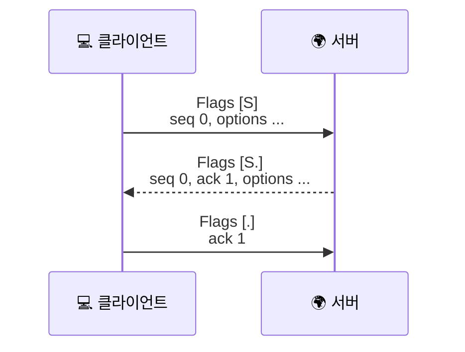
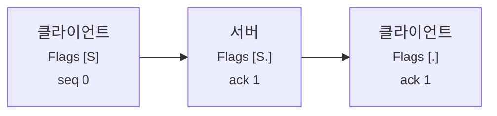

# tcpdump에서 TCP handshake는 어떻게 보일까요?

> `SYN → SYN-ACK → ACK` 는 머리로는 알겠죠? **근데 캡처 화면에서 그 세 줄을 바로 집어내는 건 또 다른 감각이에요.**

[TCP 3-way handshake는 왜 세 번이나 주고받을까요?](../basic/09-tcp-3-way-handshake.md#handshake-signals){ data-preview }에서는 **왜 세 번이나 주고받는지**를 큰 그림으로 먼저 봤고, [tcpdump 한 줄은 어떻게 읽어야 할까요?](./tcpdump-first-look.md#one-line-anatomy){ data-preview }에서는 **한 줄을 어디부터 읽어야 하는지**를 먼저 잡았어요.

근데 막상 캡처 화면을 열면 이런 생각이 들죠.

> *"좋아요, handshake 자체는 알아요. 근데 이 수많은 줄 중에서 어느 세 줄이 그 handshake고, 어디서부터 읽어야 하죠?"*

바로 그 질문에 답하는 글이에요. 오늘은 `tcpdump` 화면에서 **SYN, SYN-ACK, ACK가 실제로 어떻게 찍히는지**, 그리고 **어디서 끊기면 무엇을 의심해야 하는지**까지 같이 볼게요.

!!! note "이 글의 범위"
    여기서는 **핸드셰이크 장면을 캡처 위에서 읽는 감각**에 집중해요. `tcpdump` 명령 옵션 전체를 다시 설명하거나, TCP 헤더의 모든 칸을 다시 해부하지는 않을 거예요. 한 줄 읽기 감각은 [tcpdump 한 줄은 어떻게 읽어야 할까요?](./tcpdump-first-look.md){ data-preview }에서, 헤더 칸 자체는 [TCP 헤더는 왜 이렇게 칸이 많을까요?](./tcp-header-anatomy.md){ data-preview }에서 이미 봤으니까요. 여기서는 그걸 **실제 장면**으로 다시 묶어볼게요.

---

## 일단 비유로 시작해볼게요

이번에는 **현관 앞 인터폰 기록**을 떠올려볼까요?

- 누군가 먼저 벨을 눌러요.
- 안쪽에서 "누구세요? 저도 들었어요" 하고 답해요.
- 바깥에서 마지막으로 "네, 그 답도 들었어요" 하고 확인해요.

기본편에서는 이 과정을 **인사 자체**로 봤다면, 캡처는 그 인사가 오간 **짧은 녹취록**에 가까워요. 즉 지금 보는 건 새로운 개념이 아니라, **이미 배운 handshake를 로그 형태로 다시 읽는 일**이에요.

| 기본편에서 잡은 감각 | 비유에서는 | 실제로는 |
|---|---|---|
| `SYN` | 첫 벨 누르기 | 클라이언트의 연결 시작 패킷 |
| `SYN-ACK` | "들었어요, 저도 준비됐어요" | 서버의 응답 패킷 |
| `ACK` | "좋아요, 그 답도 확인했어요" | 클라이언트의 마지막 확인 패킷 |
| 인터폰 기록 | 누가 언제 어떤 말로 주고받았는지 남은 로그 | `tcpdump` 캡처 줄 |

---

## 먼저 장면부터 볼까요?

실제 캡처에서는 대개 이런 줄을 만나게 돼요.

```text
14:32:01.123456 eth0 Out IP 192.168.0.10.51515 > 198.51.100.80.443: Flags [S], seq 0, win 64240, options [mss 1460,sackOK,TS val 12345 ecr 0,nop,wscale 7], length 0
14:32:01.158204 eth0 In  IP 198.51.100.80.443 > 192.168.0.10.51515: Flags [S.], seq 0, ack 1, win 65160, options [mss 1460,sackOK,TS val 45678 ecr 12345,nop,wscale 7], length 0
14:32:01.158311 eth0 Out IP 192.168.0.10.51515 > 198.51.100.80.443: Flags [.], ack 1, win 502, length 0
```

처음 보면 그냥 긴 문장 세 줄처럼 보이죠. 근데 이건 사실 [기본편 handshake 그림](../basic/09-tcp-3-way-handshake.md#handshake-signals){ data-preview }이 **캡처 자막**으로 바뀐 모습이에요.



이 그림이 중요한 이유는, 캡처에서 handshake를 읽을 때 **플래그만 보는 게 아니라 방향과 숫자와 옵션을 같이 본다**는 감각을 잡게 해주기 때문이에요.

---

## 이 장면에서 먼저 읽어야 할 신호 네 가지 { #signals-to-read }

장면 해석형 글에서는 *"뭘 먼저 봐야 하지?"* 가 제일 중요하잖아요. 이 handshake 장면에서는 우선 이 네 가지부터 보면 돼요.

1. **누가 먼저 시작했는지** — `Flags [S]` 를 누가 먼저 보냈는지
2. **`ack` 가 왜 1 늘어나는지** — `SYN` 이 sequence 공간을 1칸 쓰기 때문
3. **옵션이 무엇을 같이 협상하는지** — `mss`, `wscale`, `sackOK`, `TS`
4. **세 줄 사이 간격이 자연스러운지** — 재전송인지, 응답 지연인지

이 네 가지를 먼저 보면, 긴 줄도 그냥 *"연결이 열렸네"* 수준이 아니라 **어디까지 정상이고 어디서부터 이상한지** 읽히기 시작해요.

---

## 한 줄씩 뜯어보면 이렇게 읽어요 { #line-by-line }

같은 세 줄을 표로 펼치면 더 또렷해져요.

| 줄 | 먼저 볼 것 | 이렇게 읽으면 돼요 |
|---|---|---|
| `Flags [S]` | 방향, 목적지 포트, 옵션 | 클라이언트가 443 포트로 연결을 열기 시작했어요. `mss`, `wscale`, `sackOK`, `TS` 같은 옵션도 같이 제안해요. |
| `Flags [S.]` | `ack 1`, 반대 방향, 옵션 | 서버가 클라이언트의 `SYN` 을 봤고, **당신 시작 번호는 확인했어요** 라고 답하면서 자기 시작 번호와 옵션을 같이 내밀어요. |
| `Flags [.]` | 마지막 확인, `length 0` | 클라이언트가 서버의 시작 번호도 확인했어요. 이제부터 실제 데이터가 흐를 준비가 된 거예요. |

여기서 숫자는 일부러 **상대 번호(relative sequence number)** 느낌으로 단순화해서 썼어요. 실제 환경에서는 절대 sequence 번호가 훨씬 크게 보일 수도 있지만, 초반에는 **`SYN` 뒤엔 `ack` 가 1 늘어난다**는 흐름만 읽혀도 충분해요. 이 감각은 [RFC 9293 3.4절과 3.5절](https://www.rfc-editor.org/rfc/rfc9293.html#name-sequence-numbers)에서 설명하는 핵심이기도 해요.

---

## `ack = 1` 은 왜 이렇게 자주 보일까요?

이건 초심자가 handshake 캡처에서 가장 자주 멈추는 지점이에요.

기본편에서도 봤지만, 다시 한 번 연결해볼게요.

- 클라이언트가 `SYN` 을 보냄
- `SYN` 자체가 sequence 공간을 **1칸** 차지함
- 그래서 서버는 `ack 1` 로 답함

즉 `ACK` 는 단순히 *"받았어요"* 가 아니라, **"나는 다음엔 그다음 번호를 기대해요"** 에 더 가까워요. 이 해석이 바로 캡처 읽기의 중심이에요.



여기서 표지판 하나만 세워둘게요.

> 여기서는 `seq`, `ack` 의 **캡처 위 해석**에 집중할게요. 그 숫자 칸이 TCP 헤더 몇 번째 줄에 있는지는 [TCP 헤더는 왜 이렇게 칸이 많을까요?](./tcp-header-anatomy.md#header-grid){ data-preview }에서 다시 펼쳐볼 수 있어요.

---

## 옵션은 왜 첫 두 줄에 몰려 있을까요?

핸드셰이크 줄을 보면 `mss 1460`, `sackOK`, `TS`, `wscale 7` 같은 옵션이 유난히 눈에 띄죠.

이건 단순 장식이 아니에요. **앞으로 데이터를 어떤 규칙으로 주고받을지 초반에 같이 맞추는 과정**이거든요.

- `mss 1460` — 한 세그먼트에 어느 정도까지 실을지
- `wscale 7` — 윈도우 값을 나중에 얼마나 크게 해석할지
- `sackOK` — 중간에 빠진 조각을 더 똑똑하게 복구할 수 있는지
- `TS` — 타임스탬프 옵션을 쓸지

이 옵션들은 [RFC 7323](https://www.rfc-editor.org/rfc/rfc7323.html) 쪽 감각과 이어져요. 특히 `Window Scale` 은 **핸드셰이크에서만 합의**되기 때문에, 이 세 줄을 놓치면 나중에 캡처에서 보이는 윈도우 값을 잘못 읽기 쉬워요.

다만 여기서도 한 가지는 꼭 같이 기억하면 좋아요.

> 어떤 옵션을 실제로 붙이는지는 **운영체제와 구현마다 조금씩 달라질 수 있어요.** 그러니까 옵션 목록이 완전히 같지 않다고 해서 곧장 이상하다고 읽지는 않아요.

그리고 `wscale` 값은 양쪽이 **똑같아야 하는 공용 숫자**라고 생각하면 안 돼요. 클라이언트와 서버가 **각자 자기 방향 Window를 어떻게 키워 읽어달라는지** 따로 알릴 수도 있어요.

---

## 어디서 끊기면 무엇을 의심할까요? { #where-it-breaks }

핸드셰이크 캡처가 진짜 빛나는 순간은, **연결이 안 열릴 때 어디서 멈췄는지** 보여줄 때예요.

### 1. `SYN` 만 반복해서 보이고 `SYN-ACK` 가 안 와요

```text
14:32:01.123456 Out ... Flags [S]
14:32:02.124001 Out ... Flags [S]
14:32:04.126882 Out ... Flags [S]
```

이 장면은 보통 **상대 응답이 안 보인다**는 뜻이에요.

- 서버가 진짜 응답을 못 했을 수도 있고
- 중간 방화벽이나 네트워크가 막았을 수도 있고
- 캡처 위치상 돌아오는 패킷을 못 보고 있을 수도 있어요

즉 이걸 보고 바로 *"서버가 죽었네"* 라고 단정하면 위험해요. **응답이 없다는 사실**과 **왜 응답이 안 보이는지**는 다른 이야기거든요.

### 2. `SYN-ACK` 까지는 보이는데 마지막 `ACK` 가 안 보여요

```text
14:32:01.123456 Out ... Flags [S]
14:32:01.158204 In  ... Flags [S.], ack 1
14:32:02.158771 In  ... Flags [S.], ack 1
```

이건 서버는 답했는데, **클라이언트 쪽 마지막 확인이 안 갔거나 안 보인다**는 뜻으로 읽기 쉬워요.

- 클라이언트가 응답을 못 받았을 수도 있고
- 중간 경로에서 마지막 ACK가 사라졌을 수도 있고
- 내가 보는 캡처 위치가 한쪽 방향만 담고 있을 수도 있어요

### 3. 세 줄은 끝났는데 바로 `RST` 가 보여요

핸드셰이크는 열렸지만, 그다음 애플리케이션이나 중간 장비가 **즉시 연결을 접어버리는 장면**일 수 있어요. 즉 *"연결 열기 실패"* 와 *"열리긴 했지만 곧장 끊김"* 은 완전히 다른 문제예요.

이 차이를 읽으려면 [TCP 플래그는 어떻게 읽어야 할까요?](./tcp-flags-cheatsheet.md#common-combinations){ data-preview }에서 봤던 `RST` 감각이 같이 필요해져요.

---

## 근데 왜 handshake를 캡처 위에서 이렇게까지 읽어야 할까요?

### 1. 누가 먼저 시작했는지 바로 보여줘요

기본편에서는 클라이언트가 먼저 `SYN` 을 보낸다고 배웠죠. 캡처에서는 그게 **실제 어느 IP와 어느 포트였는지**까지 바로 보여줘요. 즉 이야기의 주어가 훨씬 선명해져요.

### 2. 연결이 안 되는 문제를 좁히기 쉬워져요

`SYN` 만 가는지, `SYN-ACK` 까지는 오는지, 마지막 `ACK` 까지 끝나는지에 따라 **막힌 위치 후보**가 꽤 달라져요.

### 3. 뒤에서 보는 재전송, 윈도우, 종료 장면의 출발점이 돼요

재전송, `TIME-WAIT`, `RST`, 윈도우 크기 해석도 결국은 **이 연결이 처음 어떻게 열렸는지** 위에 서 있어요. 그래서 핸드셰이크를 캡처에서 읽는 감각은 뒤의 모든 TCP 장면 해석의 출발점이 돼요.

---

## 잘못 읽기 쉬운 함정 다섯 가지

**하나, `SYN` 만 보이면 무조건 서버 장애라고 단정하기.**  
아니에요. 서버, 방화벽, 라우팅, NAT, 캡처 위치 문제까지 다 가능해요.

**둘, `ack = 1` 을 "패킷 한 개 받았어요" 로 읽기.**  
더 정확히는 **sequence 공간에서 다음으로 기대하는 번호**예요.

**셋, 옵션이 많이 붙으면 이상한 트래픽이라고 생각하기.**  
오히려 MSS, Window Scale, Timestamp 같은 건 아주 흔한 handshake 옵션이에요.

**넷, `length 0` 이면 아무 일도 없다고 생각하기.**  
핸드셰이크의 핵심 신호는 오히려 `length 0` 인 경우가 많아요.

**다섯, 캡처에 안 보이면 실제로도 안 일어났다고 믿기.**  
캡처는 어디서 잡았는지에 따라 빠진 방향이나 빠진 패킷이 있을 수 있어요. 그래서 **보이는 장면**과 **실제 전체 장면**을 늘 같은 것으로 놓으면 안 돼요.

---

## 자, 정리해볼까요?

!!! abstract "오늘 우리가 본 것"
    - `tcpdump` 위의 handshake는 결국 **`Flags [S]` → `Flags [S.]` → `Flags [.]`** 세 줄로 읽히는 경우가 많아요.
    - 이 장면에서는 **누가 먼저 시작했는지**, **`ack` 가 왜 1 늘어나는지**, **어떤 옵션을 같이 협상하는지**, **세 줄 사이 간격이 자연스러운지**를 먼저 보면 좋아요.
    - `SYN` 만 반복되는지, `SYN-ACK` 까지만 보이는지, 세 줄 뒤 바로 `RST` 가 붙는지에 따라 문제 해석이 달라져요.
    - `length 0` 은 "빈 패킷"이 아니라, **제어 신호만 오가는 중요한 장면**일 수 있어요.
    - 캡처 해석은 플래그만 보는 일이 아니라, **방향 · 숫자 · 옵션 · 위치를 같이 읽는 일**이에요.

결국 handshake를 캡처에서 읽는다는 건, 기본편에서 배운 인사를 **현장 로그 위에서 다시 알아보는 감각**에 가까워요. 그 세 줄이 읽히기 시작하면, 이후의 재전송이나 종료 장면도 훨씬 덜 낯설어져요.

---

## 이어서 보면 좋은 글

- `SYN`, `SYN-ACK`, `ACK` 자체를 큰 그림으로 다시 보고 싶다면 — [TCP 3-way handshake는 왜 세 번이나 주고받을까요?](../basic/09-tcp-3-way-handshake.md#handshake-signals){ data-preview }
- `Flags [S]`, `Flags [S.]`, `Flags [R]` 같은 표기를 장면별로 더 읽고 싶다면 — [TCP 플래그는 어떻게 읽어야 할까요?](./tcp-flags-cheatsheet.md#common-combinations){ data-preview }
- 핸드셰이크에서 보였던 `wscale` 옵션이 뒤 Window 해석에 어떤 뜻이 되는지 이어서 보고 싶다면 — [TCP 윈도우와 흐름 제어는 왜 같이 읽어야 할까요?](./tcp-window-and-flow-control.md#window-scale-negotiation){ data-preview }
- 한 줄 자체를 시간, 방향, 주소 순서로 먼저 읽는 감각을 다시 잡고 싶다면 — [tcpdump 한 줄은 어떻게 읽어야 할까요?](./tcpdump-first-look.md#one-line-anatomy){ data-preview }
- `SYN-SENT`, `SYN-RECEIVED`, `ESTABLISHED` 같은 내부 상태 변화까지 같이 보고 싶다면 — [TCP 상태 머신: 연결의 탄생부터 소멸까지의 일대기](./tcp-state-machine.md#connection-states){ data-preview }

이 감각이 익숙해지면, 그다음엔 handshake 뒤에 이어지는 **재전송**, **윈도우**, **종료 장면**도 훨씬 덜 낯설게 보이기 시작할 거예요.
