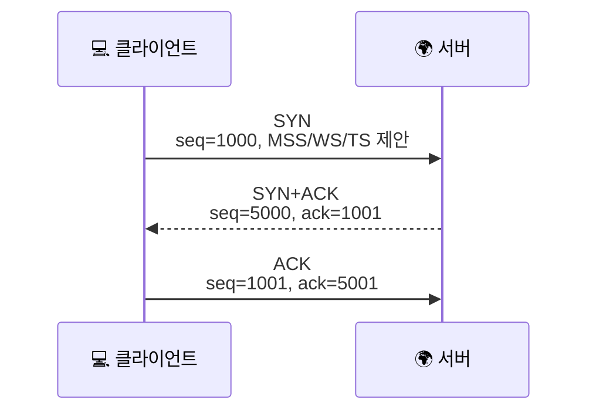

# TCP 헤더는 왜 이렇게 칸이 많을까요?

> 우리가 `SYN`, `ACK`, 포트 번호라고 부르는 건, 사실 **20바이트짜리 격자 안에 꽉 들어찬 서로 다른 칸들**이에요.

[TCP vs UDP](../basic/03-tcp-vs-udp.md#tcp-intro){ data-preview }에서는 TCP를 **꼼꼼한 친구** 정도로 먼저 소개했고, [TCP 3-way handshake](../basic/09-tcp-3-way-handshake.md#handshake-signals){ data-preview }에서는 그 꼼꼼함이 `SYN`, `ACK`, sequence 번호 같은 **실제 숫자와 신호**로 보인다는 걸 봤어요. 그리고 [TCP 재전송과 신뢰성](../basic/21-tcp-retransmission-and-reliability.md){ data-preview }에서는 그 번호들이 빠진 조각을 다시 챙길 때 어떻게 쓰이는지도 봤죠.

근데 여기서 이런 생각이 들지 않으세요?

> *"좋아요, 이제 감은 왔어요. 근데 그 숫자들이 TCP 헤더 안에서는 정확히 어디 칸에 들어가는데요?"*

바로 그 빈칸을 채우는 게 오늘 글이에요. **TCP 기본 헤더 20바이트**를 32비트 줄 위에 펼쳐서, 포트 번호 · sequence 번호 · acknowledgment 번호 · 플래그 · 윈도우가 각각 어디에 앉아 있는지 한 줄씩 같이 읽어볼게요. RFC 기준으로는 [RFC 9293 3.1절](https://www.rfc-editor.org/rfc/rfc9293.html#name-header-format) 의 TCP 헤더 형식을 바탕으로 보고, Window Scale 과 Timestamp 같은 흔한 옵션은 [RFC 7323](https://www.rfc-editor.org/rfc/rfc7323.html) 기준으로 가볍게 이어볼게요.

!!! note "이 글의 범위"
    여기서는 **TCP 기본 헤더와 자주 보는 옵션**까지를 다뤄요. 혼잡 제어 알고리즘 전체나 상태 머신 전체는 오늘 다 안 열어요. 지금은 **"핸드셰이크와 재전송에서 보던 숫자가 실제 헤더의 어느 칸이었는지"** 를 선명하게 만드는 데 집중할게요.

---

## 일단 비유로 시작해볼게요

이번에는 **택배 접수표**를 떠올려볼까요?

- 맨 위에는 **어느 창구에서 어느 창구로 보내는지** 적고,
- 가운데에는 **이 조각이 전체 짐 중 어디쯤인지**, **상대가 다음엔 어디부터 받길 원하는지** 적고,
- 옆에는 **지금 연결 시작인지**, **끝낼 건지**, **리셋해야 하는지** 같은 짧은 표시를 붙이고,
- 아래에는 **지금 얼마나 더 받아둘 수 있는지**, **추가 규칙은 있는지**를 적어둬요.

| 기본편에서 잡은 감각 | 비유에서는 | 실제로는 |
|---|---|---|
| 포트 번호 | 어느 창구에서 어느 창구로 보내는지 | Source Port / Destination Port |
| 순서 번호 | 이 상자가 전체 짐 중 어디서부터인지 | Sequence Number |
| 확인 번호 | 다음에는 몇 번부터 받길 원하는지 | Acknowledgment Number |
| 연결 신호 | 시작 / 확인 / 종료 / 초기화 표시 | SYN / ACK / FIN / RST 등 Flags |
| 받을 여유 | 지금 창고에 얼마나 더 받아둘 수 있는지 | Window |
| 추가 규칙 | 이 연결에서만 같이 쓰는 메모 | Options |

그러니까 TCP 헤더는 단순히 *"주소 적는 표"* 가 아니라, **연결의 상태와 데이터 흐름을 계속 맞춰가는 운영 메모**에 가까워요.



기본편에서는 이걸 *"인사한다"* 정도로 읽었죠. 오늘은 그 인사 안에 들어 있던 **포트, 번호, 플래그, 옵션**이 헤더 어느 줄에 있는지까지 펼쳐볼 거예요.

---

## TCP 기본 헤더 전체 그림 { #header-grid }

TCP 기본 헤더는 **최소 20바이트(160비트)** 예요. 한 줄을 32비트로 그리면 **딱 5줄**이에요. 옵션이 붙으면 더 길어질 수 있지만, 기본 뼈대는 늘 이 5줄이에요.

<div style="margin: 1.5rem 0; border: 2px solid var(--md-default-fg-color--lighter); border-radius: 0.75rem; overflow: hidden; background: color-mix(in srgb, var(--md-default-bg-color) 95%, var(--md-default-fg-color) 5%);">
  <div style="display: grid; grid-template-columns: repeat(32, 1fr); padding: 0.4rem 0.6rem; gap: 0; background: color-mix(in srgb, var(--md-primary-fg-color) 8%, var(--md-default-bg-color)); border-bottom: 1px solid var(--md-default-fg-color--lightest); font-size: 0.65rem; color: var(--md-default-fg-color--light); text-align: center;">
    <span style="grid-column: span 8;">0</span>
    <span style="grid-column: span 8;">8</span>
    <span style="grid-column: span 8;">16</span>
    <span style="grid-column: span 8;">24</span>
  </div>
  <div style="display: grid; grid-template-columns: repeat(32, 1fr); gap: 2px; padding: 0.6rem; background: var(--md-default-fg-color--lightest);">
    <div style="grid-column: span 16; padding: 0.5rem 0.4rem; background: color-mix(in srgb, #ef4444 18%, var(--md-default-bg-color)); text-align: center; font-size: 0.8rem; border-radius: 0.25rem;"><strong>Source Port</strong><br/><small>16b</small></div>
    <div style="grid-column: span 16; padding: 0.5rem 0.4rem; background: color-mix(in srgb, #f97316 18%, var(--md-default-bg-color)); text-align: center; font-size: 0.8rem; border-radius: 0.25rem;"><strong>Destination Port</strong><br/><small>16b</small></div>

    <div style="grid-column: span 32; padding: 0.5rem 0.4rem; background: color-mix(in srgb, #eab308 18%, var(--md-default-bg-color)); text-align: center; font-size: 0.8rem; border-radius: 0.25rem;"><strong>Sequence Number</strong><br/><small>32b</small></div>

    <div style="grid-column: span 32; padding: 0.5rem 0.4rem; background: color-mix(in srgb, #22c55e 18%, var(--md-default-bg-color)); text-align: center; font-size: 0.8rem; border-radius: 0.25rem;"><strong>Acknowledgment Number</strong><br/><small>32b</small></div>

    <div style="grid-column: span 4; padding: 0.5rem 0.3rem; background: color-mix(in srgb, #14b8a6 18%, var(--md-default-bg-color)); text-align: center; font-size: 0.75rem; border-radius: 0.25rem;"><strong>Data<br/>Offset</strong><br/><small>4b</small></div>
    <div style="grid-column: span 4; padding: 0.5rem 0.3rem; background: color-mix(in srgb, #06b6d4 18%, var(--md-default-bg-color)); text-align: center; font-size: 0.75rem; border-radius: 0.25rem;"><strong>Rsrvd</strong><br/><small>4b</small></div>
    <div style="grid-column: span 8; padding: 0.5rem 0.3rem; background: color-mix(in srgb, #0ea5e9 18%, var(--md-default-bg-color)); text-align: center; font-size: 0.75rem; border-radius: 0.25rem;"><strong>Flags</strong><br/><small>8b</small></div>
    <div style="grid-column: span 16; padding: 0.5rem 0.3rem; background: color-mix(in srgb, #6366f1 18%, var(--md-default-bg-color)); text-align: center; font-size: 0.8rem; border-radius: 0.25rem;"><strong>Window</strong><br/><small>16b</small></div>

    <div style="grid-column: span 16; padding: 0.5rem 0.4rem; background: color-mix(in srgb, #8b5cf6 18%, var(--md-default-bg-color)); text-align: center; font-size: 0.8rem; border-radius: 0.25rem;"><strong>Checksum</strong><br/><small>16b</small></div>
    <div style="grid-column: span 16; padding: 0.5rem 0.4rem; background: color-mix(in srgb, #a855f7 18%, var(--md-default-bg-color)); text-align: center; font-size: 0.8rem; border-radius: 0.25rem;"><strong>Urgent Pointer</strong><br/><small>16b</small></div>

    <div style="grid-column: span 32; padding: 0.5rem 0.4rem; background: color-mix(in srgb, var(--md-default-fg-color) 10%, var(--md-default-bg-color)); text-align: center; font-size: 0.75rem; border-radius: 0.25rem; color: var(--md-default-fg-color--light); border: 1px dashed var(--md-default-fg-color--lighter);"><strong>Options</strong><br/><small>있을 수도, 없을 수도 — 있으면 헤더가 20바이트보다 길어져요</small></div>
  </div>
</div>

이 그림에서 먼저 잡아야 할 감각은 세 가지예요.

1. **기본 헤더는 20바이트**라는 점
2. `Sequence Number` 와 `Acknowledgment Number` 가 각각 **한 줄 전체를 통째로** 쓴다는 점
3. 플래그는 1비트씩 짧지만, 연결의 상태를 읽을 때는 **엄청 중요하다**는 점

그리고 TCP는 IPv4처럼 옵션이 없으면 20바이트, 있으면 더 길어져요. 다만 그 길이도 아무렇게나가 아니라 `Data Offset` 필드가 정확히 가리켜줘요.

---

## 1번째 줄 — 어느 창구에서 어느 창구로 { #ports }

**Source Port (16비트) · Destination Port (16비트)**

| 필드 | 길이(bit) | 의미 | 자주 보는 값 |
|---|---:|---|---|
| Source Port | 16 | 보내는 쪽 애플리케이션의 포트 번호 | `51515`, `43210` 류 |
| Destination Port | 16 | 받는 쪽 애플리케이션의 포트 번호 | `80`, `443`, `53` 류 |

[포트와 소켓](../basic/05-ports-and-sockets.md){ data-preview }에서 봤던 **"같은 집 안에서 어느 방으로 보낼까"** 감각이 바로 여기 있어요. IP가 **어느 집까지 갈지**를 맡는다면, TCP 포트는 **그 집 안 어느 서비스까지 갈지**를 맡아요.

이 줄이 16비트 + 16비트로 나뉜 이유도 단순해요. 포트 번호 범위가 **0~65535** 여야 하니까요. 한쪽은 출발지, 다른 한쪽은 목적지예요. 그래서 `192.168.0.10:51515 → 142.250.196.78:443` 같은 한 연결은, 사실 **IP 주소 2개 + 포트 2개** 조합으로 식별돼요.

---

## 2·3번째 줄 — 몇 번째 바이트부터고, 다음엔 뭘 기다릴까요? { #sequence-and-ack }

**Sequence Number (32비트) · Acknowledgment Number (32비트)**

| 필드 | 길이(bit) | 의미 | 자주 보는 값 |
|---|---:|---|---|
| Sequence Number | 32 | 이 세그먼트가 전체 바이트 흐름 중 어디서 시작하는지 | 연결마다 크게 달라짐 |
| Acknowledgment Number | 32 | 나는 다음에 이 번호부터 받길 기대한다는 뜻 | 연결마다 계속 증가 |

여기가 TCP의 핵심이에요. [TCP 3-way handshake](../basic/09-tcp-3-way-handshake.md#handshake-signals){ data-preview }와 [TCP 재전송과 신뢰성](../basic/21-tcp-retransmission-and-reliability.md){ data-preview }에서 계속 보던 숫자들이 바로 이 두 줄이에요.

가장 중요한 포인트는 이거예요.

- `Sequence Number` 는 **패킷 번호**가 아니라 **바이트 흐름의 시작 위치**예요.
- `Acknowledgment Number` 는 **"여기까지 받았어"** 보다 더 정확히는 **"다음에는 이 번호부터 줘"** 예요.

RFC 9293 3.1절은 여기서 한 가지 아주 중요한 단서를 붙여요. **`SYN` 이 켜져 있으면, 그 세그먼트의 `Sequence Number` 자체가 초기 시작 번호(ISN)** 가 되고, 실제 첫 데이터 바이트는 **ISN+1** 부터로 봐요. 그래서 핸드셰이크에서 `SYN seq=1000` 다음에 `ack=1001` 이 나오는 거예요.

비슷한 이유로 `FIN` 도 **sequence 공간을 1칸** 써요. 그래서 연결을 닫는 장면에서도 *"데이터는 없는데 왜 ACK가 1 늘었지?"* 같은 모습이 나올 수 있어요.

즉, 기본편에서 *"숫자를 맞춘다"* 라고 했던 게 추상적인 말이 아니라, 진짜로 **헤더 2줄을 통째로 써서 바이트 흐름의 기준점을 맞춘다**는 뜻이에요.

---

## 4번째 줄 — 헤더 길이, 플래그, 그리고 지금 얼마나 더 받을 수 있을까요? { #flags }

**Data Offset (4비트) · Reserved (4비트) · Flags (8비트) · Window (16비트)**

| 필드 | 길이(bit) | 의미 | 자주 보는 값 |
|---|---:|---|---|
| Data Offset | 4 | TCP 헤더 길이를 **32비트 단어 수**로 표현 | `5`(20바이트), `8`, `10` |
| Reserved | 4 | 미래 용도로 비워둔 칸 | 보통 `0` |
| Flags | 8 | 연결 상태와 제어 신호 | `SYN`, `ACK`, `FIN`, `RST` 자주 봄 |
| Window | 16 | 지금 받을 수 있다고 광고하는 버퍼 여유 | `64240` 류 |

### Data Offset — 헤더가 어디서 끝나는지

이 필드가 **"TCP 데이터 본문은 몇 번째 바이트부터 시작하는가"** 를 알려줘요. 4비트밖에 안 되니까 0~15까지밖에 못 적죠. 그래서 TCP는 길이를 **바이트가 아니라 32비트 단어 개수**로 적어요.

- `5` 면 `5 × 4 = 20바이트` → 옵션 없는 기본 헤더
- `10` 이면 `10 × 4 = 40바이트` → 옵션이 20바이트 붙은 헤더

그래서 TCP 헤더는 **최소 20바이트, 최대 60바이트** 예요.

### Flags — 연결의 분위기를 1비트씩 찍어두는 칸

여기서 중요한 건 **이 자리가 8비트짜리 제어 비트맵**이라는 점이에요. 즉, `Sequence Number` 나 `Window` 처럼 숫자 하나를 담는 칸이 아니라, **연결 시작 / 확인 / 종료 / 리셋 같은 신호를 1비트씩 켜서 표시하는 칸**이죠.

이 글에서는 플래그가 **TCP 헤더 4번째 줄 어디에 붙어 있는지**까지만 잡고 갈게요. `SYN`, `ACK`, `FIN`, `RST`, `PSH` 같은 이름이 각각 무슨 분위기로 읽히는지, 그리고 `Flags [S]`, `Flags [S.]`, `Flags [F.]` 같은 축약 표기가 실제 캡처에서 어떻게 보이는지는 심화편 [TCP 플래그는 어떻게 읽어야 할까요?](./tcp-flags-cheatsheet.md#flag-meanings){ data-preview } 에서 따로 자세히 열어볼 수 있어요.

### Window — "나는 지금 이만큼 더 받을 수 있어요"

이 16비트는 **수신 버퍼 여유**를 광고하는 칸이에요. 즉, *"다음에는 이 번호부터 줘"* 만 말하는 게 아니라, *"그리고 지금은 이 정도까지는 더 흘려 보내도 돼"* 도 같이 말하는 거죠.

여기서 한 가지 표지판만 세워둘게요.

> 여기서는 **Window 필드 자체가 헤더 어디에 있는지**까지만 볼게요. 실제로 이 값이 흐름 제어와 Window Scale 옵션을 만나서 어떻게 커지는지는 [TCP 윈도우와 흐름 제어는 왜 같이 읽어야 할까요?](./tcp-window-and-flow-control.md#window-scale-negotiation){ data-preview }에서 이어서 열어볼게요.

RFC 7323은 이 16비트 한계 때문에 **Window Scale 옵션**을 도입해요. 중요한 건, **와이어 위의 Window 필드는 여전히 16비트**라는 점이에요. 다만 양쪽이 핸드셰이크 때 합의한 배율을 곱해서 *실제 의미*를 키우는 거예요.

---

## 5번째 줄 — 체크섬과 급한 표시 { #checksum-and-urgent }

**Checksum (16비트) · Urgent Pointer (16비트)**

| 필드 | 길이(bit) | 의미 | 자주 보는 값 |
|---|---:|---|---|
| Checksum | 16 | TCP 헤더와 데이터, 그리고 IP 쪽 일부 정보까지 포함한 무결성 검사 | 패킷마다 달라짐 |
| Urgent Pointer | 16 | URG가 켜졌을 때 긴급 데이터의 끝 다음 위치 | 보통 `0` |

`Checksum` 은 *"헤더만 대충 보자"* 가 아니에요. RFC 9293 3.1절 기준으로 TCP 체크섬은 **TCP 헤더 + TCP 데이터** 뿐 아니라, **IP의 출발지/도착지 주소와 프로토콜 번호를 끌어온 pseudo-header** 까지 함께 계산해요. 그래서 잘못된 주소로 흘러간 세그먼트까지 어느 정도 잡아낼 수 있어요.

그리고 TCP에서 체크섬은 **선택 사항이 아니에요.** RFC 9293은 송신자가 반드시 만들고, 수신자가 반드시 검사해야 한다고 못 박아요.

반면 `Urgent Pointer` 는 초심자 입장에서는 자주 볼 일이 거의 없어요. `URG` 플래그가 켜졌을 때만 의미가 있고, 현대의 일반적인 웹 트래픽에서는 대부분 `0` 으로 지나가요. 그래서 이 칸은 *"있긴 있는데 실전 웹 패킷에서는 거의 조용하다"* 정도로 먼저 기억해도 충분해요.

---

## 6번째 줄 이후 — SYN 패킷에서 특히 자주 보이는 옵션들 { #options }

기본 헤더 20바이트만으로도 TCP는 동작해요. 근데 실제 인터넷에서는 핸드셰이크 때 **추가 규칙**을 같이 맞추는 일이 많아요. 그 메모장이 바로 Options예요.

| 옵션 | 길이(byte) | 무엇을 정하나 | 어디서 자주 보나 |
|---|---:|---|---|
| MSS | 4 | 한 번에 받고 싶은 최대 TCP 데이터 크기 | SYN / SYN-ACK |
| Window Scale | 3 | 16비트 Window를 얼마나 확대 해석할지 | SYN / SYN-ACK |
| SACK Permitted | 2 | 선택적 ACK를 써도 되는지 | SYN / SYN-ACK |
| Timestamps | 10 | RTT 측정, PAWS 등에 쓰는 시간표 | SYN 이후 자주 지속 |
| NOP / EOL | 1 | 옵션 정렬 / 옵션 끝 표시 | 옵션 사이사이 |

RFC 9293 3.2절은 `EOL`, `NOP`, `MSS` 를 기본 옵션으로 설명하고, RFC 9293 3.2.1절은 **SACK, Timestamp, Window Scale** 을 오늘날 흔한 옵션으로 짚어요. 그중 Window Scale 과 Timestamp 의 자세한 의미는 RFC 7323이 더 풀어줘요.

여기서 중요한 감각은 이거예요.

- **기본 헤더는 연결 운영의 공통 뼈대**
- **옵션은 그 연결에서만 추가로 합의한 규칙**

그래서 핸드셰이크 패킷은 특히 헤더가 20바이트보다 긴 경우가 많아요.

---

## 근데 왜 굳이 이렇게 칸이 많을까요?

TCP가 단순히 *"데이터를 빨리 보낸다"* 만 목표였다면 훨씬 짧아도 됐을 거예요. 근데 TCP는 그보다 더 많은 걸 맡아요.

### 1. 패킷이 아니라 **바이트 흐름**을 맞춰야 하니까요

TCP는 *"패킷 7번"* 보다는 *"전체 바이트 흐름 중 1201번째부터"* 를 더 중요하게 봐요. 그래서 `Sequence Number` 와 `Acknowledgment Number` 가 각각 32비트씩 통 크게 자리를 차지해요.

### 2. 연결 상태와 데이터 전송을 같은 헤더 안에서 같이 다뤄야 하니까요

`SYN`, `ACK`, `FIN`, `RST` 같은 플래그는 데이터 본문이 없어도 연결의 큰 전환점을 알려줘야 해요. 그래서 **제어 신호**와 **데이터 흐름 정보**가 한 헤더 안에 같이 살아요.

### 3. 받는 쪽 여유를 계속 광고해야 하니까요

보내는 쪽이 신나게만 보내면 안 되죠. 받는 쪽이 *"지금은 여기까지 받아둘 수 있어"* 라고 계속 말해줘야 흐름 제어가 가능해요. 그 역할이 `Window` 예요.

### 4. 연결마다 규칙이 조금씩 달라질 수 있으니까요

MSS, Window Scale, Timestamp 같은 옵션은 연결마다 다를 수 있어요. 그걸 기본 헤더에 다 박아두는 대신, **필요할 때만 뒤에 붙이는 확장 메모지**로 만든 거예요.

---

## 실제 패킷에서 이렇게 보여요

말로만 보면 여전히 추상적이니까, 이번엔 **SYN 세그먼트 하나**를 실제 바이트와 사람이 읽는 한 줄로 같이 볼게요.

### 먼저, 진짜 바이트로 보면 { #real-bytes }

설명용으로 단순화한 SYN 세그먼트의 TCP 헤더를 보면 이렇게 생겼다고 해볼게요.

```text
0x0000  c9 3b 01 bb 12 34 56 78 00 00 00 00 a0 02 fa f0
0x0010  1a 2b 00 00 02 04 05 b4 04 02 08 0a 00 00 30 39
0x0020  00 00 00 00 01 03 03 07
```

| 위치 | hex 에서 잘라보면 | 어떻게 읽나 |
|---|---|---|
| 1~2번째 바이트 | `c9 3b` | Source Port = `51515` |
| 3~4번째 바이트 | `01 bb` | Destination Port = `443` |
| 5~8번째 바이트 | `12 34 56 78` | Sequence Number = `0x12345678` |
| 9~12번째 바이트 | `00 00 00 00` | ACK bit가 꺼진 SYN이라 Ack Number는 아직 의미 없음 |
| 13번째 바이트 상위 4비트 | `a` | Data Offset = `10` → 헤더 길이 `10 × 4 = 40바이트` |
| 13번째 바이트 하위 4비트 | `0` | Reserved = 0 |
| 14번째 바이트 | `02` | Flags = SYN |
| 15~16번째 바이트 | `fa f0` | Window = `64240` |
| 17~18번째 바이트 | `1a 2b` | Checksum |
| 19~20번째 바이트 | `00 00` | Urgent Pointer = 0 |
| 21~24번째 바이트 | `02 04 05 b4` | MSS = `1460` |
| 25~26번째 바이트 | `04 02` | SACK Permitted |
| 27~36번째 바이트 | `08 0a 00 00 30 39 00 00 00 00` | Timestamp option (`TSval=12345`, `TSecr=0`) |
| 37번째 바이트 | `01` | NOP |
| 38~40번째 바이트 | `03 03 07` | Window Scale = `7` |

여기서 제일 중요한 건 세 가지예요.

1. `a0` 의 **상위 4비트 `a`** 가 `Data Offset = 10` 이라서, 이 SYN은 **헤더만 40바이트**라는 점
2. `02` 가 **SYN 플래그**라는 점
3. 기본 20바이트 뒤에 붙은 옵션들 때문에, 우리가 평소 보는 SYN 패킷은 **생각보다 헤더가 길다**는 점

### 사람이 읽는 한 줄로 보면

도구가 이걸 풀어주면 보통 이런 식으로 보여요.

```text
IP 192.168.0.10.51515 > 142.250.196.78.443: Flags [S], seq 305419896, win 64240, options [mss 1460,sackOK,TS val 12345 ecr 0,nop,wscale 7], length 0
```

이 한 줄에서 읽어야 할 건 바로 이거예요.

- `.51515 > .443` — 1번째 줄의 Source Port / Destination Port
- `Flags [S]` — 4번째 줄의 SYN 비트
- `seq 305419896` — 2번째 줄의 Sequence Number
- `win 64240` — 4번째 줄의 Window
- `options [...]` — 6번째 줄 이후의 Options

즉 기본편에서 말로만 봤던 *"SYN이 오고, sequence 번호가 있고, window가 있고, 옵션으로 MSS도 맞춘다"* 가 실제 도구 출력에서는 한 줄로 같이 보이는 거예요.

---

## 잘못 읽기 쉬운 함정 네 가지

**하나, Sequence Number를 패킷 번호처럼 읽기.**
아니에요. TCP는 **바이트 흐름**을 세요. 100바이트를 보내면 sequence가 100만큼 앞으로 가요.

**둘, ACK를 "이 패킷 받았어요" 정도로만 읽기.**
더 정확히는 **"다음엔 이 번호부터 줘"** 예요. 그래서 누적 ACK처럼 동작해요.

**셋, Data Offset을 바이트 수로 착각하기.**
`5` 는 5바이트가 아니라 **5 × 4바이트 = 20바이트** 예요. 이걸 틀리면 데이터 시작 위치를 완전히 잘못 읽게 돼요.

**넷, Window 필드가 실제 윈도우 크기 그 자체라고 단정하기.**
핸드셰이크에서 Window Scale 을 합의했다면, 와이어 위 16비트 값에 **배율을 곱해 해석**해야 해요.

---

## 자, 정리해볼까요?

!!! abstract "오늘 우리가 본 것"
    - TCP 기본 헤더는 **최소 20바이트(160비트)**, 옵션까지 붙으면 **최대 60바이트**예요.
    - 1줄: Source Port + Destination Port — 어느 서비스끼리 이야기하는지.
    - 2줄: Sequence Number, 3줄: Acknowledgment Number — 바이트 흐름의 위치와 다음 기대 위치.
    - 4줄: Data Offset + Flags + Window — 헤더 길이, 연결 신호, 수신 여유.
    - 5줄: Checksum + Urgent Pointer — 무결성 검사와 드물게 쓰는 긴급 표시.
    - 6줄 이후: MSS, Window Scale, Timestamp 같은 옵션 — 연결별 추가 규칙.

[TCP vs UDP](../basic/03-tcp-vs-udp.md#tcp-intro){ data-preview }에서 *"TCP는 꼼꼼하다"* 정도로 잡았던 감각이, 이제는 *"그 꼼꼼함이 포트 · 번호 · 플래그 · 윈도우 · 옵션 칸으로 실제 헤더 안에 배치돼 있다"* 로 한 단계 또렷해졌어요.

---

## 이어서 보면 좋은 글

- 이 TCP 헤더가 어떤 IP 헤더 바로 뒤에 얹히는지 다시 보고 싶다면 — [IPv4 헤더 한 줄 한 줄 읽기](./ipv4-header-anatomy.md){ data-preview }
- `SYN`, `SYN-ACK`, `ACK` 가 이 칸들을 어떻게 채우는지 흐름부터 다시 보고 싶다면 — [TCP 3-way handshake는 왜 세 번이나 주고받을까요?](../basic/09-tcp-3-way-handshake.md#handshake-signals){ data-preview }
- `Sequence Number` 와 `ACK` 가 재전송에서 어떻게 활약하는지 바로 이어서 보고 싶다면 — [TCP 재전송과 신뢰성](../basic/21-tcp-retransmission-and-reliability.md){ data-preview }
- 이 헤더가 실제 캡처 화면에서 어떤 줄로 보이기 시작하는지 바로 이어서 보고 싶다면 — [tcpdump 한 줄은 어떻게 읽어야 할까요?](./tcpdump-first-look.md){ data-preview }
