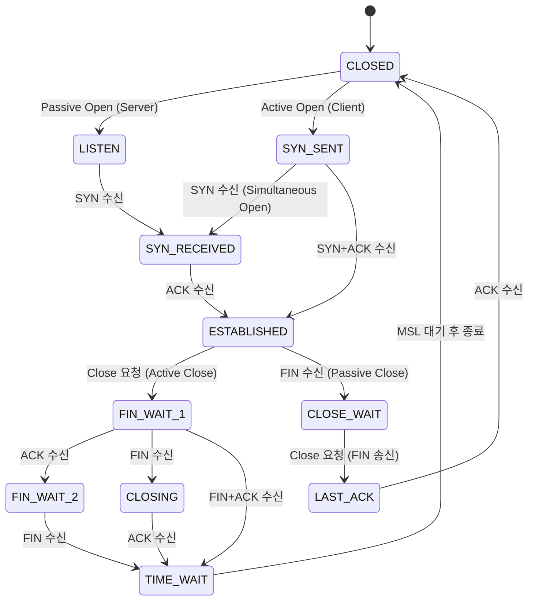
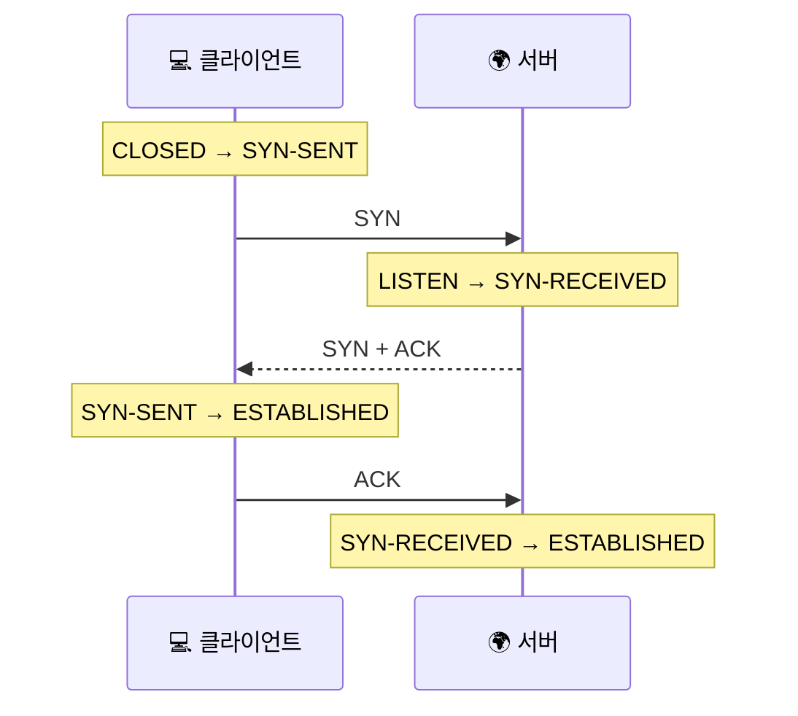
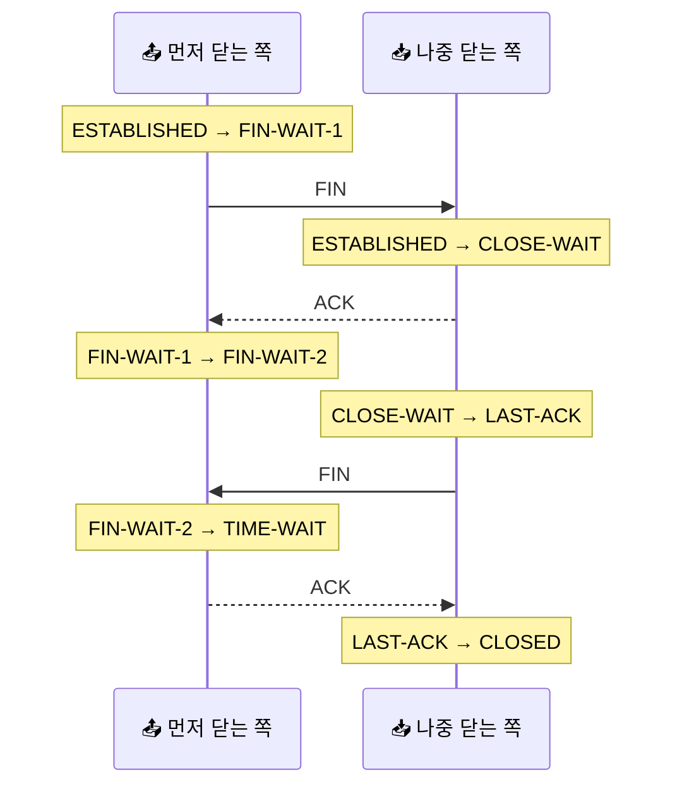

# TCP 상태 머신: 연결의 탄생부터 소멸까지의 일대기

> TCP 연결은 단순히 열려 있거나 닫혀 있는 게 아니에요. 사실은 그 사이에서 수많은 '상태'를 넘나드는 섬세한 살아있는 존재에 가까워요.

[TCP 3-way handshake](../basic/09-tcp-3-way-handshake.md){ data-preview }에서 우리는 연결을 맺는 인사를 봤고, [TCP Teardown과 TIME-WAIT](../basic/22-tcp-teardown-and-time-wait.md){ data-preview }에서는 안전하게 헤어지는 법을 봤어요.

근데 여기서 이런 궁금증이 생기지 않으세요?

> *"좋아요, 인사는 이해했어요. 근데 그 인사를 주고받는 동안 내 컴퓨터 안에서는 정확히 어떤 '상태'가 기록되고 있는 건가요?"*

오늘 다룰 **TCP 상태 머신(State Machine)** 이 바로 그 답이에요. [RFC 9293 3.3.2절](https://www.rfc-editor.org/rfc/rfc9293.html#name-state-machine-diagram)에서 정의하는 표준 상태들을 중심으로, 연결이 태어나서 `CLOSED` 에서 시작하고 다시 `CLOSED` 로 돌아오기까지 어떤 길을 거치는지 촘촘하게 해부해볼게요.

!!! note "이 글의 범위"
    여기서는 **연결 수립(Handshake)과 종료(Teardown)** 과정에서 변하는 상태들에 집중해요. 데이터가 흐르는 ESTABLISHED 상태 내부의 윈도우 조절이나 혼잡 제어 알고리즘은 여기서 다 다루지 않아요. 지금은 **"내 연결이 지금 어느 지점에 서 있는가"** 를 선명하게 만드는 데 집중할게요.

---

## 일단 비유로 시작해볼게요

이번에는 **무인 점포의 키오스크**를 떠올려볼까요?

- 처음에는 아무도 사용하지 않는 **대기 상태**였다가,
- 손님이 화면을 터치하면 **메뉴 선택 중** 상태가 되고,
- 카드를 꽂으면 **결제 승인 대기** 상태를 거쳐서,
- 영수증이 나오면 다시 **초기 화면**으로 돌아가죠.

각 단계마다 키오스크가 "지금 내가 뭘 하고 있는지"를 정확히 알고 있어야 다음 동작을 할 수 있잖아요. TCP도 똑같아요.

| 기본편에서 잡은 감각 | 비유에서는 | 실제로는 (TCP State) |
|---|---|---|
| 아무 일도 없음 | 초기 화면 (대기) | CLOSED |
| 누군가 오길 기다림 | 손님을 기다리는 중 | LISTEN |
| 인사를 건네고 답을 기다림 | "주문하시겠어요?" 하고 반응 대기 | SYN-SENT / SYN-RECEIVED |
| 한창 대화 중 | 주문과 결제가 활발히 일어나는 중 | ESTABLISHED |
| 한쪽이 작별 인사를 함 | "이제 갈게요"라고 말한 상태 | FIN-WAIT-1 / CLOSE-WAIT |
| 마지막 뒷정리 중 | 매장을 나가기 전 영수증을 챙기는 시간 | TIME-WAIT / LAST-ACK |

중요한 건, 이 상태들은 **내 컴퓨터(엔드포인트) 내부의 메모리**에 기록되는 정보라는 점이에요. 상대방이 내 상태를 직접 들여다보는 게 아니라, 오가는 패킷(SYN, ACK, FIN 등)을 보고 서로의 상태가 맞을 거라고 "짐작"하며 움직이는 거죠.

---

## TCP 상태 머신 전체 그림 { #state-diagram }

TCP의 일생을 한 장의 지도로 그리면 이렇게 생겼어요. 복잡해 보이지만, 왼쪽은 **연결되는 과정**, 오른쪽은 **연결을 끊는 과정**이라고 생각하면 마음이 편해져요.



이 그림에서 잡아야 할 핵심은 **"모든 연결이 이 모든 화살표를 다 밟지는 않는다"** 는 점이에요. 일반적인 클라이언트는 `CLOSED -> SYN_SENT -> ESTABLISHED` 경로를 타고, 서버는 `LISTEN -> SYN_RECEIVED -> ESTABLISHED` 경로를 타게 되죠. 다만 여기서 말하는 클라이언트 / 서버는 **가장 흔한 역할 비유**에 가까워요. TCP 상태 자체는 애플리케이션 역할보다 **누가 먼저 열고, 누가 먼저 닫느냐** 에 더 직접 연결돼요.

---

## 연결의 시작: CLOSED에서 ESTABLISHED까지 { #connection-states }

[TCP 3-way handshake](../basic/09-tcp-3-way-handshake.md#handshake-signals){ data-preview }가 일어날 때 우리 내부에서는 이런 일이 벌어져요.

1. **LISTEN**: 서버가 특정 포트를 열고 손님을 기다리는 상태예요.
2. **SYN-SENT**: 클라이언트가 "연결하고 싶어요(SYN)"라고 신호를 보내고 답장을 기다리는 상태예요.
3. **SYN-RECEIVED**: 서버가 SYN을 받고 "나도 준비됐어(SYN-ACK)"라고 답한 뒤, 마지막 확인(ACK)을 기다리는 상태예요.
4. **ESTABLISHED**: 드디어 서로 확인이 끝났어요! 이제 진짜 데이터를 주고받을 수 있는 상태예요.

RFC 9293 3.3.2절에 따르면, `SYN-RECEIVED` 상태에서 클라이언트로부터 `ACK`를 받으면 비로소 `ESTABLISHED`로 넘어간다고 명시되어 있어요. 서버 입장에서는 이 단계가 되어야 비로소 "연결된 소켓"이 완성되는 거죠.



핸드셰이크를 상태 기준으로 다시 보면, 기본편에서 봤던 `SYN`, `SYN-ACK`, `ACK` 가 사실은 **각 엔드포인트의 내부 상태를 한 칸씩 밀어 움직이는 신호**였다는 게 더 또렷해져요.

---

## ESTABLISHED는 왜 이렇게 오래 머물까요? { #established-state }

대부분의 연결은 실제로 이 상태에서 가장 오래 머물러요. 파일을 내려받든, 웹페이지를 열든, API를 부르든 **진짜 일은 거의 다 `ESTABLISHED` 안에서** 일어나거든요.

여기서는 상태 머신 자체가 주제라서 `ESTABLISHED` 안쪽의 세부 알고리즘을 길게 열지는 않을게요. 다만 이 상태가 단순한 "연결 완료" 표지판이 아니라, **ACK를 주고받고, 재전송을 판단하고, 윈도우를 광고하고, 데이터를 순서대로 맞추는 운영의 본무대** 라는 감각은 꼭 잡고 가면 좋아요. 이 안쪽 숫자들이 실제로 어떻게 일하는지는 [TCP 재전송과 신뢰성](../basic/21-tcp-retransmission-and-reliability.md){ data-preview }과 [TCP 헤더는 왜 이렇게 칸이 많을까요?](./tcp-header-anatomy.md#header-grid){ data-preview }에서 같이 이어볼 수 있어요.

---

## 연결의 종료: ESTABLISHED에서 다시 CLOSED까지 { #termination-states }

헤어지는 과정은 조금 더 복잡해요. [TCP Teardown](../basic/22-tcp-teardown-and-time-wait.md){ data-preview }에서 본 4-way teardown이 여기서 상태로 나타나요.

먼저 연결 종료를 요청한 쪽(**Active Close**)과 요청을 받은 쪽(**Passive Close**)의 상태가 달라요.

### Active Close 쪽 (먼저 FIN을 보낸 쪽)
- **FIN-WAIT-1**: "나 이제 그만할게(FIN)"라고 말하고 상대의 확인을 기다려요.
- **FIN-WAIT-2**: 상대가 "응, 알았어(ACK)"라고 한 것까지 들었어요. 이제 상대방도 그만하겠다는 인사를 하길 기다려요.
- **TIME-WAIT**: 상대방의 마지막 인사(FIN)까지 확인하고 "너도 잘 가(ACK)"라고 답했어요. 하지만 혹시 모를 재전송이나 낡은 패킷을 위해 잠시 자리를 지켜요.

### Passive Close 쪽 (FIN을 받은 쪽)
- **CLOSE-WAIT**: 상대방의 종료 인사를 받았어요. "응, 확인했어(ACK)"라고 답하고, 우리 쪽 애플리케이션도 종료 준비를 마칠 때까지 대기해요.
- **LAST-ACK**: 우리도 이제 준비가 끝나서 "나도 이제 갈게(FIN)"라고 말하고 마지막 확인을 기다려요.

그리고 아주 드물지만 **CLOSING** 이라는 상태도 있어요. 이건 내가 `FIN`을 보낸 직후, 상대도 거의 동시에 `FIN`을 보내서 **양쪽이 서로 먼저 닫으려는 신호가 겹쳤을 때** 잠깐 거치는 예외 경로예요. 자주 보는 상태는 아니지만, 상태 머신 그림에 들어간 이유는 *이런 겹침도 TCP가 처리해야 하기 때문* 이라고 보면 돼요.



이 그림을 보면 왜 종료 쪽이 더 복잡한지 보이죠. 시작할 때는 서로 준비만 확인하면 됐는데, 끝낼 때는 **누가 먼저 입을 닫았는지**, **반대 방향 데이터는 아직 남아 있는지**, **마지막 인사가 진짜 전달됐는지** 까지 챙겨야 하거든요.

---

## 상태 요약 표 { #state-summary }

RFC 9293의 설명을 바탕으로 각 상태를 한 표에 모아봤어요.

| 상태명 | 위치 | 의미 | 다음 단계로 가는 트리거 |
|---|---|---|---|
| **CLOSED** | 공통 | 아무 연결도 없는 초기 상태 | Active/Passive Open 요청 |
| **LISTEN** | 서버 | 누군가 오길 기다리는 중 | SYN 패킷 수신 |
| **SYN-SENT** | 클라이언트 | SYN을 보내고 대기 중 | SYN+ACK 수신 |
| **SYN-RECEIVED** | 서버 | SYN을 받고 ACK를 대기 중 | 마지막 ACK 수신 |
| **ESTABLISHED** | 공통 | 연결 완료, 데이터 전송 중 | 애플리케이션의 Close 요청 / FIN 수신 |
| **FIN-WAIT-1** | 먼저 닫는 쪽 | FIN을 보내고 ACK 대기 중 | ACK 수신 (-> FIN-WAIT-2) |
| **FIN-WAIT-2** | 먼저 닫는 쪽 | 상대의 FIN을 대기 중 | FIN 수신 (-> TIME-WAIT) |
| **CLOSING** | 예외 경로 | 서로 거의 동시에 FIN을 보내 겹친 상태 | 마지막 ACK 수신 (-> TIME-WAIT) |
| **CLOSE-WAIT** | 나중 닫는 쪽 | 상대의 FIN을 받고 정리 중 | 우리 쪽 FIN 송신 (-> LAST-ACK) |
| **LAST-ACK** | 나중 닫는 쪽 | 마지막 ACK를 대기 중 | 마지막 ACK 수신 (-> CLOSED) |
| **TIME-WAIT** | 먼저 닫는 쪽 | 낡은 패킷 소멸을 위해 대기 중 | 2MSL 시간 경과 (-> CLOSED) |

---

## 근데 왜? 상태를 이렇게까지 나눠야 했을까요?

### 1. 연결은 "상대적"이기 때문이에요
내 컴퓨터가 `ESTABLISHED`라고 해서 상대방도 반드시 `ESTABLISHED`인 건 아니에요. 예를 들어 내가 마지막 `ACK`를 보냈지만 상대방에게 닿지 않았다면, 나는 `ESTABLISHED`라고 생각해도 상대방은 여전히 `SYN-RECEIVED`에 머물러 있을 수 있죠. 상태 머신은 이런 **불확실한 상황에서도 각자가 어떻게 행동해야 하는지** 가이드라인을 줘요.

### 2. TIME-WAIT는 "미아 패킷"의 무덤이에요
[RFC 1337](https://www.rfc-editor.org/rfc/rfc1337.html)과 RFC 9293에서 중요하게 다루는 게 바로 `TIME-WAIT`예요. 만약 이 상태 없이 바로 `CLOSED`가 된다면, 예전 연결에서 헤매던 패킷이 뒤늦게 나타나서 **새로 열린 같은 포트의 연결**을 오염시킬 수 있거든요. 2MSL(Maximum Segment Lifetime) 동안 기다리는 건, 인터넷 어딘가에 살아있을지 모르는 미아 패킷이 확실히 사라질 시간을 주는 거예요.

---

## 그럼 진짜 화면에서는 어떻게 보일까요? { #real-world-observation }

말로만 하면 재미없죠? 지금 바로 터미널에서 `ss`나 `netstat` 명령어로 내 컴퓨터의 TCP 상태들을 구경할 수 있어요.

```bash
# 리눅스에서 바로 보기 좋은 예시
ss -ant
```

그러면 이런 비슷한 줄들이 쏟아져 나올 거예요.

```text
State       Recv-Q Send-Q Local Address:Port  Peer Address:Port
LISTEN      0      128    0.0.0.0:80          0.0.0.0:*
ESTAB       0      0      192.168.0.10:51515  172.217.211.102:443
TIME-WAIT   0      0      192.168.0.10:51516  172.217.211.113:443
```

- **LISTEN**: 내 컴퓨터가 80번 포트(HTTP)를 열고 손님을 기다리고 있네요.
- **ESTAB**: 51515 포트로 구글 서버(443)와 한창 대화 중이에요. (`ESTABLISHED`의 줄임말이에요)
- **TIME-WAIT**: 방금 대화가 끝난 51516 포트 연결이 안전 정리를 위해 잠시 남아 있어요.

---

## 잘못 읽기 쉬운 함정 세 가지

**하나, ESTABLISHED면 무조건 데이터가 흐르고 있다고 믿기.**
아니에요. `ESTABLISHED`는 단순히 **"대화할 통로가 열려 있다"** 는 뜻이에요. 아무 데이터를 안 보내고 가만히 있어도(IDLE) 이 상태는 유지돼요. 그래서 `Keep-Alive` 같은 기술이 필요한 거죠.

**둘, TIME-WAIT가 많으면 무조건 장애라고 생각하기.**
정반대예요. `TIME-WAIT`는 TCP가 **정상적으로, 아주 정중하게 연결을 닫았을 때** 남는 흔적에 가까워요. 물론 이게 너무 많아서 포트가 부족해지면 운영상 병목이 될 수는 있지만, 상태 이름 자체가 곧장 고장을 뜻하는 건 아니에요.

**셋, 모든 연결이 모든 상태를 다 밟는다고 착각하기.**
아니에요. 어떤 연결은 `LISTEN`을 전혀 안 거치고, 어떤 연결은 `CLOSING`을 평생 못 보고 끝나요. 심지어 `RST(Reset)`가 날아오면 이 복잡한 상태들을 다 무시하고 한 번에 `CLOSED`로 튕겨 나갈 때도 있어요. 상태 머신은 **가능한 길들의 지도**라고 보는 편이 더 정확해요.

---

## 자, 정리해볼까요?

!!! abstract "오늘 우리가 본 것"
    - TCP는 연결의 각 단계마다 **엔드포인트 내부의 메모리**에 '상태'를 기록하며 움직여요.
    - 연결 시작: `LISTEN`, `SYN-SENT`, `SYN-RECEIVED`를 거쳐 `ESTABLISHED`로 들어가요.
    - 연결 종료: 누가 먼저 닫느냐에 따라 `FIN-WAIT-*`, `CLOSE-WAIT`, `LAST-ACK`, `TIME-WAIT` 같은 갈래가 생겨요.
    - **TIME-WAIT**는 먼저 연결을 끊은 쪽이 낡은 패킷의 혼선을 막기 위해 안전 대기하는 필수 상태예요.
    - 상태는 상대방과 공유하는 게 아니라 **각자 로컬에서 관리**하며 패킷으로 서로의 기분을 맞춰가는 거예요.

[TCP 3-way handshake](../basic/09-tcp-3-way-handshake.md){ data-preview }에서 봤던 인사가 이제는 `SYN-SENT`와 `SYN-RECEIVED`라는 구체적인 이름으로 보이기 시작하셨나요? 그리고 [TCP Teardown과 TIME-WAIT](../basic/22-tcp-teardown-and-time-wait.md){ data-preview }에서 봤던 마지막 작별 인사도, 이제는 `FIN-WAIT`, `CLOSE-WAIT`, `LAST-ACK`, `TIME-WAIT` 같은 이름으로 더 또렷하게 보일 거예요.

---

## 이어서 보면 좋은 글

- `SYN`, `SYN-ACK`, `ACK` 가 상태를 어떻게 한 칸씩 밀어 움직이는지 다시 큰 그림으로 보고 싶다면 — [TCP 3-way handshake는 왜 세 번이나 주고받을까요?](../basic/09-tcp-3-way-handshake.md#handshake-signals){ data-preview }
- `FIN`, `CLOSE-WAIT`, `LAST-ACK`, `TIME-WAIT` 흐름을 종료 장면 중심으로 다시 보고 싶다면 — [TCP Teardown과 TIME-WAIT - 대화가 끝난 뒤의 깔끔한 마무리](../basic/22-tcp-teardown-and-time-wait.md){ data-preview }
- `LISTEN`, `ESTABLISHED`, `CLOSE-WAIT`, `TIME-WAIT` 가 실제 `ss` / `netstat` 화면에서는 어떤 줄로 보이는지 보고 싶다면 — [ss와 netstat에서 TCP 상태는 어떻게 읽어야 할까요?](./ss-and-netstat-state-reading.md#signals-to-read){ data-preview }
- 이 상태 변화를 일으키는 `SYN`, `ACK`, `FIN`, `RST` 같은 신호를 캡처 표기 중심으로 읽고 싶다면 — [TCP 플래그는 어떻게 읽어야 할까요?](./tcp-flags-cheatsheet.md){ data-preview }
- 상태 안쪽에서 `seq`, `ack`, `window` 같은 숫자가 실제 TCP 헤더의 어느 칸에 들어가는지 다시 보고 싶다면 — [TCP 헤더는 왜 이렇게 칸이 많을까요?](./tcp-header-anatomy.md#header-grid){ data-preview }
- 이런 상태 변화가 실제 tcpdump 한 줄에서는 어떤 식으로 찍히는지 바로 이어서 보고 싶다면 — [tcpdump 한 줄은 어떻게 읽어야 할까요?](./tcpdump-first-look.md){ data-preview }
