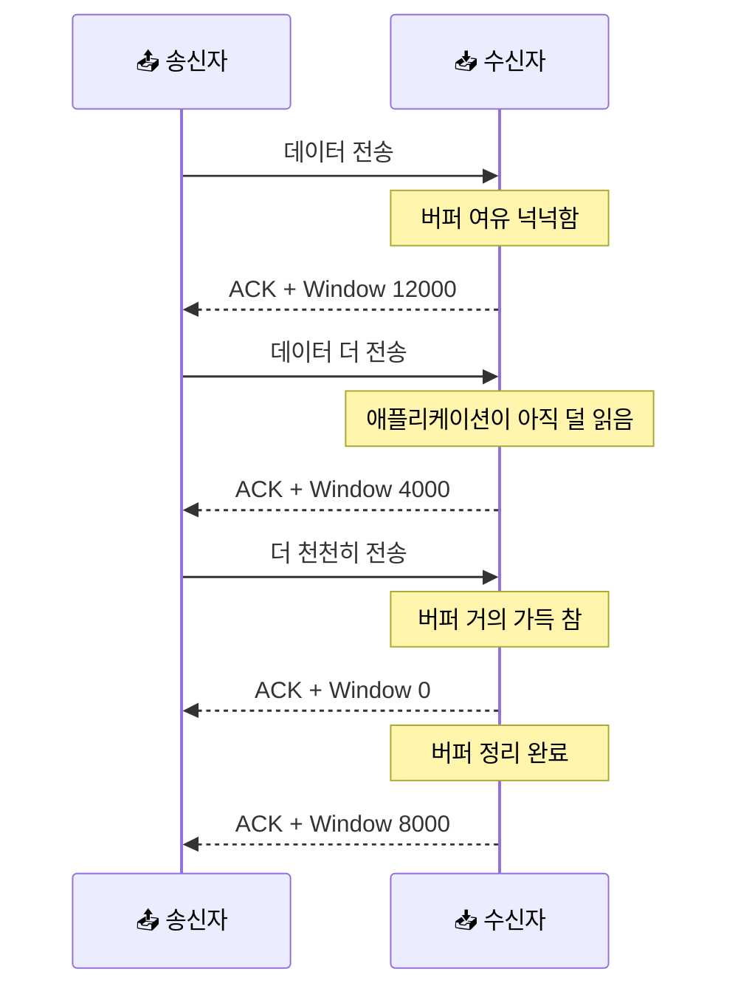
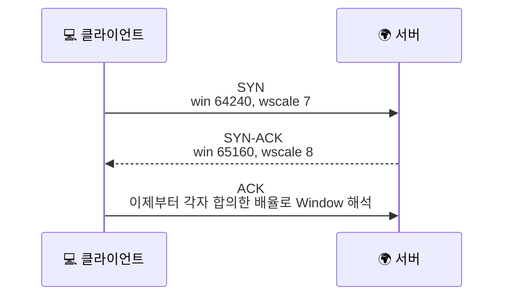

# TCP 윈도우와 흐름 제어는 왜 같이 읽어야 할까요?

> TCP는 빠르게 보내기만 하면 될 것 같죠? **사실은 상대가 "지금은 여기까지만 받아요"라고 말하는 속도 제한도 계속 듣고 있어요.**

[TCP 재전송과 신뢰성](../basic/21-tcp-retransmission-and-reliability.md){ data-preview }에서는 TCP가 **빠진 조각을 다시 챙기는 법**을 먼저 봤어요. 그리고 [TCP 헤더는 왜 이렇게 칸이 많을까요?](./tcp-header-anatomy.md#flags){ data-preview }에서는 그 과정에 쓰이는 `Window` 칸이 TCP 헤더 네 번째 줄에 들어 있다는 것도 슬쩍 봤죠.

근데 여기서 이런 궁금증이 생겨요.

> *"좋아요, ACK로 어디까지 받았는지는 알겠어요. 근데 왜 tcpdump에는 `win 502` 같은 값이 보이고, 그게 보내는 속도랑 무슨 상관이 있죠?"*

바로 그 빈칸을 채우는 글이에요. 오늘은 **받는 쪽 버퍼 여유를 광고하는 Window 값**, 그 값이 만들어내는 **흐름 제어**, 그리고 핸드셰이크에서 같이 맞추는 **Window Scale**까지 한 장면으로 묶어볼게요.

!!! note "이 글의 범위"
    여기서는 **받는 쪽이 광고하는 Window와 흐름 제어**에 집중해요. 패킷 손실 때문에 다시 보내는 재전송은 [TCP 재전송과 신뢰성](../basic/21-tcp-retransmission-and-reliability.md#retransmission-symptoms){ data-preview }에서, `SYN` / `ACK` / `Window` 칸이 헤더 어디에 있는지는 [TCP 헤더는 왜 이렇게 칸이 많을까요?](./tcp-header-anatomy.md#flags){ data-preview }에서 이미 봤어요. 또, 네트워크가 막혀서 보내는 쪽이 스스로 속도를 줄이는 **혼잡 제어(congestion control)** 전체는 여기서 다 열지 않을 거예요. 실제 송신량은 보통 **상대가 광고한 receive window** 와 **송신자가 따로 계산하는 congestion control 제한**을 함께 받아요. 여기서는 그중에서도 **"상대가 얼마나 더 받을 수 있느냐"** 에만 초점을 맞출게요.

---

## 일단 비유로 시작해볼게요

이번에는 택배를 받는 쪽 창고 앞에 **임시 적재 선반**이 있다고 상상해볼까요?

- 보내는 쪽은 상자를 계속 보내고 싶어요.
- 근데 받는 쪽 선반이 꽉 차면 더 받았다가는 안쪽 정리가 꼬이겠죠.
- 그래서 받는 쪽은 계속 이렇게 말해요. **"지금은 선반에 상자 5개까지는 더 올려도 돼요."**
- 선반이 거의 차면 **"지금은 1개만 더요."** 라고 말하고,
- 완전히 가득 차면 **"잠깐만요, 지금은 더 보내지 마세요."** 라고 멈춰 세워요.

TCP의 Window도 딱 이런 감각이에요. 지금 길이 막혔다는 뜻이 아니라, **받는 쪽이 지금 더 받아둘 수 있는 자리**를 계속 알려주는 거예요.

| 기본편에서 잡은 감각 | 비유에서는 | 실제로는 |
|---|---|---|
| ACK | 어디까지 받은지 체크하는 전화 | 다음에 기대하는 바이트 번호 |
| Window | 선반에 지금 더 올릴 수 있는 자리 | 수신자가 광고하는 버퍼 여유 |
| 흐름 제어 | 선반이 차면 잠깐 천천히 받기 | 송신자가 상대 Window를 넘지 않게 조절 |
| Window Scale | 선반 칸 수를 더 큰 단위로 읽는 규칙 | 16비트 Window를 더 크게 해석하는 배율 |
| Zero Window | "잠깐, 지금은 더 못 받아요" | 광고 윈도우가 0인 상태 |

즉, 재전송이 **"잃어버린 걸 다시 보내는 이야기"** 라면, 흐름 제어는 **"상대가 넘치지 않게 보내는 이야기"** 에 더 가까워요.

---

## TCP 헤더에서 Window 칸은 어디일까요? { #window-field }

[TCP 헤더는 왜 이렇게 칸이 많을까요?](./tcp-header-anatomy.md#flags){ data-preview }에서 전체 20바이트를 펼쳐봤다면, 오늘은 그중에서도 **네 번째 줄의 오른쪽 16비트**만 확대해서 볼게요.

<div style="margin: 1.5rem 0; border: 2px solid var(--md-default-fg-color--lighter); border-radius: 0.75rem; overflow: hidden; background: color-mix(in srgb, var(--md-default-bg-color) 95%, var(--md-default-fg-color) 5%);">
  <div style="display: grid; grid-template-columns: repeat(32, 1fr); padding: 0.4rem 0.6rem; gap: 0; background: color-mix(in srgb, var(--md-primary-fg-color) 8%, var(--md-default-bg-color)); border-bottom: 1px solid var(--md-default-fg-color--lightest); font-size: 0.65rem; color: var(--md-default-fg-color--light); text-align: center;">
    <span style="grid-column: span 8;">0</span>
    <span style="grid-column: span 8;">8</span>
    <span style="grid-column: span 8;">16</span>
    <span style="grid-column: span 8;">24</span>
  </div>
  <div style="display: grid; grid-template-columns: repeat(32, 1fr); gap: 2px; padding: 0.6rem; background: var(--md-default-fg-color--lightest);">
    <div style="grid-column: span 4; padding: 0.55rem 0.2rem; background: color-mix(in srgb, #14b8a6 18%, var(--md-default-bg-color)); text-align: center; font-size: 0.75rem; border-radius: 0.25rem;"><strong>Data<br/>Offset</strong><br/><small>4b</small></div>
    <div style="grid-column: span 4; padding: 0.55rem 0.2rem; background: color-mix(in srgb, #06b6d4 18%, var(--md-default-bg-color)); text-align: center; font-size: 0.75rem; border-radius: 0.25rem;"><strong>Reserved</strong><br/><small>4b</small></div>
    <div style="grid-column: span 8; padding: 0.55rem 0.2rem; background: color-mix(in srgb, #0ea5e9 18%, var(--md-default-bg-color)); text-align: center; font-size: 0.75rem; border-radius: 0.25rem;"><strong>Flags</strong><br/><small>8b</small></div>
    <div style="grid-column: span 16; padding: 0.55rem 0.2rem; background: color-mix(in srgb, #6366f1 18%, var(--md-default-bg-color)); text-align: center; font-size: 0.82rem; border-radius: 0.25rem;"><strong>Window</strong><br/><small>16b</small></div>
  </div>
</div>

이 줄에서 먼저 잡아야 할 감각은 세 가지예요.

1. `Window` 는 **TCP 헤더 안의 진짜 필드**라는 점
2. 이 값은 **내가 보낼 수 있는 양**이 아니라 **상대가 더 받아둘 수 있는 양**이라는 점
3. 핸드셰이크에서 `Window Scale` 을 합의했다면, 이 16비트 값은 **그 배율을 함께 생각해서** 읽어야 한다는 점

같은 줄에 `Flags` 와 `Window` 가 붙어 있는 것도 의미가 있어요. 실전에서는 ACK를 보내면서 **"여기까지 받았고, 지금은 이 정도 더 받을 수 있어요"** 를 같이 말하는 경우가 많거든요. RFC 기준으로는 [RFC 9293 3.1절](https://www.rfc-editor.org/rfc/rfc9293.html#name-header-format) 의 TCP 헤더 형식 안에 이 16비트 `Window` 필드가 들어 있고, 수신 쪽이 현재 받아들일 수 있는 범위를 광고하는 역할을 맡아요.

| 필드명 | 길이(bit) | 의미 | 자주 보는 값 |
|---|---:|---|---|
| Window | 16 | 지금 더 받아둘 수 있다고 광고하는 여유 | `64240`, `502`, `0` 류 |
| ACK Flag | 1 | ACK 번호가 유효하다는 표시 | 연결 성립 뒤 거의 항상 켜짐 |
| Acknowledgment Number | 32 | 나는 다음에 이 번호부터 받길 기대해요 | 흐름에 따라 계속 증가 |
| Window Scale Option | 24 | Window 값을 몇 비트 왼쪽으로 키워 읽을지 합의 | `wscale 7`, `wscale 8` 류 |

여기서 표지판 하나만 세워둘게요.

> `Window` 는 TCP 헤더 안에 들어 있는 **원본 16비트 값**이고, 우리가 흔히 말하는 *"실제로 허용된 창 크기"* 는 여기에 **핸드셰이크 때 합의한 Window Scale 배율**까지 함께 봐야 하는 경우가 많아요.

---

## 흐름 제어는 시간에 따라 어떻게 움직일까요? { #flow-control-over-time }

이제 진짜 핵심으로 들어가볼게요. 흐름 제어는 **고정값 하나를 외우는 이야기**가 아니라, 연결이 살아 있는 동안 **Window가 계속 바뀌는 장면**을 읽는 이야기예요.



이 흐름을 말로 풀면 이래요.

- 수신자는 ACK를 보내면서 **"여기까지 받았어요"** 와 **"지금은 이만큼 더 받을 수 있어요"** 를 같이 말해요.
- 송신자는 그 말을 듣고, **상대가 광고한 Window를 넘지 않게** 데이터를 밀어 넣어요.
- 그래서 받는 쪽 애플리케이션이 데이터를 빨리 읽어주지 못하면, 네트워크가 멀쩡해도 송신 속도가 줄어들 수 있어요.

다만 실제 전송량은 이 Window만으로 딱 정해지는 건 아니고, **혼잡 제어 쪽 제한과 함께** 결정돼요. 그래서 흐름 제어는 *"수신자가 얼마나 더 받을 수 있나"* 축, 혼잡 제어는 *"네트워크 길이 지금 얼마나 붐비나"* 축으로 나눠서 보면 좋아요.

즉, 흐름 제어는 *"인터넷 길이 막혔나?"* 를 먼저 보는 이야기가 아니라, **받는 쪽 내부 버퍼가 지금 얼마나 비어 있나** 를 보는 이야기예요.

---

## Window Scale은 왜 handshake 때만 맞출까요? { #window-scale-negotiation }

여기서 한 번 더 물어볼까요?

> *"Window가 중요하면 그냥 큰 숫자를 쓰면 되지, 왜 굳이 배율을 따로 합의하죠?"*

이유는 간단해요. **TCP 헤더의 Window 필드는 원래 16비트**라서, 그 칸만으로는 아주 큰 버퍼 여유를 표현하기가 부족할 수 있거든요. 그래서 [RFC 7323](https://www.rfc-editor.org/rfc/rfc7323.html) 은 핸드셰이크 때 **Window Scale 옵션**을 같이 교환해서, 이후의 Window 값을 더 크게 해석할 수 있게 해줘요.



여기서 중요한 건 두 가지예요.

1. `Window Scale` 은 **핸드셰이크의 SYN / SYN-ACK에서만 합의**돼요.
2. 그래서 핸드셰이크를 놓치면, 뒤 캡처에서 보이는 `win` 값을 **너무 작게 또는 엉뚱하게** 읽기 쉬워요.

[tcpdump에서 TCP handshake는 어떻게 보일까요?](./tcp-handshake-in-capture.md#signals-to-read){ data-preview }에서 `wscale 7` 같은 옵션이 눈에 띄었던 이유도 바로 이거예요. 그건 장식이 아니라, **뒤에서 볼 Window 숫자의 해석 규칙**이었어요.

여기서 특히 중요한 건, 이 배율이 **연결 전체에 공용으로 하나만 있는 게 아니라 방향별로 따로 볼 수 있다**는 점이에요. 즉 클라이언트가 광고하는 Window는 **클라이언트가 SYN에서 알린 `wscale`**, 서버가 광고하는 Window는 **서버가 SYN-ACK에서 알린 `wscale`** 쪽으로 읽는다고 생각하면 덜 헷갈려요.

다만 이것도 꼭 같이 기억하면 좋아요.

> 도구마다 Window를 보여주는 방식은 조금 달라질 수 있어요. 어떤 도구는 **원본 16비트 값**에 가깝게 보여주고, 어떤 도구는 **배율을 적용한 해석**을 더 잘 보조해줘요. 그러니까 숫자 하나만 뽑아 단정하지 말고, **핸드셰이크 옵션을 같이 본다**가 더 안전해요.

---

## 그럼 실제 캡처에서는 어떻게 보일까요? { #capture-reading }

실제 줄에서는 보통 이런 흐름으로 보게 돼요.

```text
14:32:01.123456 Out IP 192.168.0.10.51515 > 198.51.100.80.443: Flags [S], seq 0, win 64240, options [mss 1460,sackOK,TS val 12345 ecr 0,nop,wscale 7], length 0
14:32:01.158204 In  IP 198.51.100.80.443 > 192.168.0.10.51515: Flags [S.], seq 0, ack 1, win 65160, options [mss 1460,sackOK,TS val 45678 ecr 12345,nop,wscale 8], length 0
14:32:01.992004 In  IP 198.51.100.80.443 > 192.168.0.10.51515: Flags [.], ack 1449, win 480, length 0
14:32:02.211905 In  IP 198.51.100.80.443 > 192.168.0.10.51515: Flags [.], ack 2897, win 0, length 0
14:32:02.980442 In  IP 198.51.100.80.443 > 192.168.0.10.51515: Flags [.], ack 2897, win 2048, length 0
```

이 장면에서 먼저 읽어야 할 신호 네 가지는 이거예요.

1. **핸드셰이크에서 `wscale` 이 있었는지**
2. **뒤 ACK 줄에서 `win` 값이 줄어드는지 커지는지**
3. **`win 0` 이 잠깐 나타나는지**
4. **ACK는 계속 가는데 Window만 줄고 있는지**

이 네 가지를 같이 보면, *"패킷이 없어졌나?"* 와 *"받는 쪽이 잠깐 숨이 찼나?"* 를 분리해서 보기 시작할 수 있어요.

특히 `ACK` 가 정상적으로 계속 오는데 `win` 값이 작아지거나 0이 된다면, 그건 **수신자는 살아 있고, 지금은 여유가 없다고 말하고 있다**는 뜻에 더 가까워요. 반대로 재전송 글에서 봤던 것처럼 같은 ACK가 반복되고 중간 조각이 비는 장면은 **유실 / 순서 문제** 쪽에 더 가까워요.

---

## Zero Window는 무슨 뜻일까요? { #zero-window }

`win 0` 을 보면 처음엔 깜짝 놀라기 쉬워요.

> *"윈도우가 0이면 연결이 망가진 거 아닌가요?"*

**사실은 꼭 그렇진 않아요.**

`Zero Window` 는 보통 이렇게 읽는 게 좋아요.

- 수신자는 연결을 보고 있어요.
- ACK도 보낼 수 있어요.
- 근데 지금은 **받아둘 버퍼 여유가 없어서** 더는 밀어 넣지 말아달라고 말하는 거예요.

즉, 이건 *"길이 끊겼다"* 보다는 *"잠깐 창고가 꽉 찼다"* 에 더 가까워요.

물론 `Zero Window` 가 **자주 오래 지속되면** 애플리케이션이 데이터를 너무 늦게 읽거나, 수신 쪽 처리 속도가 병목일 가능성을 의심해볼 수 있어요. 하지만 **한 번 잠깐 찍혔다고 곧장 장애라고 단정하면 위험해요.**

---

## 근데 왜? 재전송만 알면 충분하지 않을까요? { #why-flow-control-matters }

재전송을 알면 분명 많은 장면이 풀려요. 근데 흐름 제어를 모르면 **느린 이유를 자꾸 유실 탓으로만** 읽게 돼요.

### 1. 느린 원인이 항상 패킷 손실은 아니에요

같은 ACK가 반복되고 `TCP Retransmission` 이 보이면 유실을 의심할 수 있죠. 하지만 ACK는 잘 오는데 Window만 계속 작다면, 그건 **받는 쪽이 더 천천히 받고 있다**는 이야기일 수 있어요.

### 2. ACK는 확인만 하는 게 아니라 여유도 같이 실어 나르거든요

[TCP 재전송과 신뢰성](../basic/21-tcp-retransmission-and-reliability.md){ data-preview }에서는 ACK를 **"다음에 이 번호 줘"** 로 먼저 읽었어요. 오늘 한 걸음 더 나아가면, ACK는 종종 **"그리고 지금은 이만큼까지만 더 줘"** 라는 메시지도 같이 싣고 다녀요.

### 3. 핸드셰이크와 데이터 구간이 이어져 보여요

[tcpdump에서 TCP handshake는 어떻게 보일까요?](./tcp-handshake-in-capture.md){ data-preview }에서 보였던 `wscale` 옵션은, 사실 뒤 데이터 구간에서 보이는 Window를 제대로 해석하기 위한 준비였어요. 그러니까 핸드셰이크 장면과 데이터 장면은 따로 노는 게 아니라, **앞 장면에서 뒤 장면의 읽는 법을 미리 정해두는 관계**예요.

---

## 잘못 읽기 쉬운 함정 다섯 가지 { #pitfalls }

**하나, Window는 보내는 쪽 속도 숫자라고 생각하기.**  
더 정확히는 **받는 쪽이 지금 더 받아둘 수 있다고 광고하는 여유**예요.

**둘, `win 0` 이면 네트워크가 바로 끊긴 거라고 단정하기.**  
잠깐 버퍼가 가득 찬 상태일 수도 있어요. ACK가 살아 있는지 같이 봐야 해요.

**셋, 작은 Window를 보면 무조건 패킷 손실이라고 생각하기.**  
손실은 재전송, 중복 ACK, 순서 뒤바뀜 같은 단서와 더 가까워요. 작은 Window는 **수신자 여유 부족** 쪽일 수 있어요.

**넷, 핸드셰이크에서 `wscale` 을 놓치고도 뒤 `win` 숫자만 보고 해석하기.**  
Window Scale은 뒤에서 보는 Window 숫자의 해석 규칙이에요.

**다섯, 흐름 제어와 혼잡 제어를 같은 말로 섞어 부르기.**  
흐름 제어는 **받는 쪽이 넘치지 않게 하는 규칙**, 혼잡 제어는 **네트워크 길 자체가 막히지 않게 조절하는 규칙**에 더 가까워요. 실제 송신량은 둘이 함께 제한한다고 보는 게 안전해요.

---

## 자, 정리해볼까요?

!!! abstract "오늘 우리가 본 것"
    - TCP의 `Window` 는 **받는 쪽이 지금 더 받아둘 수 있는 여유**를 광고하는 필드예요.
    - ACK는 **어디까지 받았는지**뿐 아니라, 종종 **지금 얼마나 더 보낼 수 있는지**도 같이 알려줘요.
    - `Window Scale` 은 핸드셰이크 때 합의한 뒤, 이후 Window 값을 더 크게 해석하게 도와줘요.
    - `Zero Window` 는 곧장 장애 확정이라기보다, **수신 버퍼가 잠깐 꽉 찬 장면**일 수 있어요.
    - 재전송은 **유실 복구 이야기**, 흐름 제어는 **상대가 넘치지 않게 보내는 이야기**예요.

결국 Window를 읽는다는 건, TCP가 단순히 *"다시 보내주는 꼼꼼한 친구"* 를 넘어서, **상대가 감당할 수 있는 속도에 맞춰 발걸음을 조절하는 친구**라는 걸 보는 일이에요.

---

## 이어서 보면 좋은 글

- ACK와 재전송이 왜 중요한지 기본편 흐름으로 다시 보고 싶다면 — [TCP 재전송과 신뢰성](../basic/21-tcp-retransmission-and-reliability.md#retransmission-symptoms){ data-preview }
- `Window` 가 TCP 헤더의 정확히 어느 칸에 들어가는지 다시 보고 싶다면 — [TCP 헤더는 왜 이렇게 칸이 많을까요?](./tcp-header-anatomy.md#flags){ data-preview }
- `wscale` 이 핸드셰이크에서 어떻게 보이는지 먼저 읽고 싶다면 — [tcpdump에서 TCP handshake는 어떻게 보일까요?](./tcp-handshake-in-capture.md#signals-to-read){ data-preview }
- `Flags`, `ACK`, `win` 이 한 줄 안에서 어떻게 같이 보이는지 감각을 다시 잡고 싶다면 — [tcpdump 한 줄은 어떻게 읽어야 할까요?](./tcpdump-first-look.md#one-line-anatomy){ data-preview }
