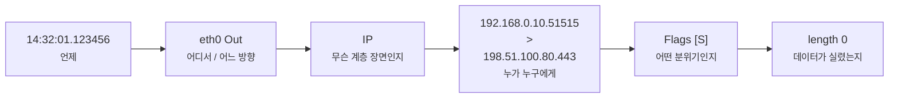
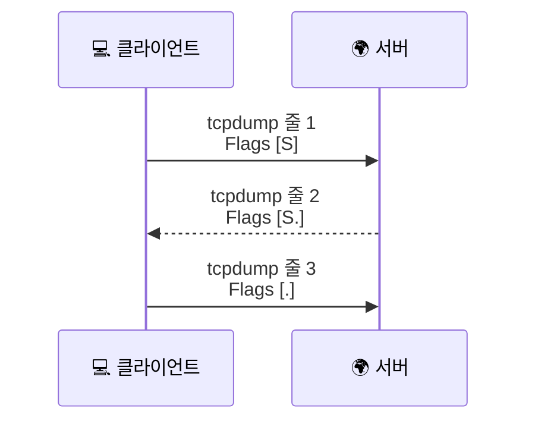

# tcpdump 한 줄은 어떻게 읽어야 할까요?

> tcpdump 화면은 처음 보면 암호문 같죠? **근데 자주 나오는 한 줄만 읽혀도, 연결 분위기가 꽤 많이 풀려요.**

[패킷 캡처는 뭘 보는 걸까요?](../basic/12-packet-capture.md){ data-preview }에서는 패킷 캡처를 **어디에서 봤느냐에 따라 장면이 달라진다**는 큰 그림으로 먼저 잡았어요. `tcpdump` 도 잠깐 만났죠. 하지만 막상 터미널에 줄이 쏟아지면 또 이런 생각이 들어요.

> *"좋아요, 캡처 위치가 중요하다는 건 알겠어요. 근데 눈앞의 이 한 줄은 어디부터 읽어야 하죠?"*

바로 그 질문에 답하는 글이에요. 오늘은 `tcpdump` 한 줄을 읽는 첫 감각부터, **실제로 자주 쓰는 옵션과 필터를 어떻게 붙이면 좋은지** 까지 같이 볼게요. 처음부터 모든 형식과 문법을 다 외우기보다는, **처음 화면을 열었을 때 어디부터 읽으면 되는지** 에 집중해서 따라오면 돼요.

!!! note "이 글의 범위"
여기서는 **tcpdump 한 줄을 읽는 첫 감각**과, 그 감각을 바로 연습할 수 있는 **자주 쓰는 옵션 / 필터 조합**까지 다뤄요. 다만 BPF 문법 전체를 레퍼런스처럼 다 모으거나, 저장한 `.pcap` 파일을 다른 분석 화면에서 흐름 단위로 다시 해부하는 단계까지는 아직 안 들어갈 거예요. 기본편에서 봤던 패킷 캡처의 큰 그림을, 이제 **줄 단위 관찰 로그** 위에 다시 올려보는 첫 심화편이라고 생각하면 돼요.

---

## 일단 비유로 시작해볼게요

[패킷 캡처는 뭘 보는 걸까요?](../basic/12-packet-capture.md#capture-location-matters){ data-preview }에서 패킷 캡처를 **CCTV 영상**처럼 떠올렸죠. `tcpdump` 는 그 CCTV 영상을 화려한 화면으로 보여주는 게 아니라, **"몇 시에, 어느 문 앞에서, 누가 누구에게, 무슨 표식을 붙이고 지나갔는지"를 줄글 로그로 적어주는 기록 담당자**에 더 가까워요.

| 기본편에서 잡은 감각 | 비유에서는 | 실제로는 |
|---|---|---|
| 패킷 캡처 | CCTV 영상 | 특정 인터페이스를 지나는 패킷 로그 |
| 캡처 위치 | 어느 카메라에서 봤는지 | 어느 인터페이스에서 잡았는지 |
| 주소표 | 누구 집에서 누구 집으로 가는지 | 출발지/목적지 IP와 포트 |
| 시작 표식 | "문 두드리기 시작" 스티커 | `Flags [S]` |
| 로그 한 줄 | CCTV 자막 한 줄 | tcpdump 출력 한 줄 |

그러니까 이 글은 **새 도구를 외우는 글**이라기보다, 기본편에서 봤던 패킷 캡처 감각을 **터미널 로그 한 줄 위에 다시 연결해주는 글**이에요.

---

## 먼저 장면부터 볼까요?

실제 `tcpdump` 화면에서는 이런 줄을 자주 보게 돼요.

```text
14:32:01.123456 eth0 Out IP 192.168.0.10.51515 > 198.51.100.80.443: Flags [S], seq 0, win 64240, options [mss 1460,sackOK,TS val 12345 ecr 0,nop,wscale 7], length 0
14:32:01.158204 eth0 In  IP 198.51.100.80.443 > 192.168.0.10.51515: Flags [S.], seq 0, ack 1, win 65160, options [mss 1460,sackOK,TS val 45678 ecr 12345,nop,wscale 7], length 0
14:32:01.158311 eth0 Out IP 192.168.0.10.51515 > 198.51.100.80.443: Flags [.], ack 1, win 502, length 0
```

처음 보면 줄 하나가 너무 길어서 숨이 막히죠. 근데요, 사실 이 세 줄은 [TCP 3-way handshake](../basic/09-tcp-3-way-handshake.md#handshake-signals){ data-preview }에서 본 **SYN → SYN-ACK → ACK** 를 그대로 적어놓은 거예요. 즉 `tcpdump` 는 낯선 암호가 아니라, **우리가 이미 알고 있는 장면을 더 촘촘하게 적어놓은 기록**이라고 보면 돼요.

---

## tcpdump 한 줄의 뼈대는 이렇게 생겨요 { #one-line-anatomy }

같은 줄을 칸으로 나눠보면 이렇게 읽을 수 있어요.



이 그림이 중요한 이유는, 처음부터 `seq`, `win`, `options` 까지 다 읽으려 하지 않아도 되기 때문이에요. 입문 단계에서는 **시간 → 위치/방향 → 주소 → 플래그 → 길이** 순서만 잡아도 장면이 꽤 또렷해져요.

### 한 칸씩 풀어보면

| 줄에서 보이는 부분 | 먼저 읽는 질문 | 뜻 |
|---|---|---|
| `14:32:01.123456` | 언제 지나갔지? | 패킷이 찍힌 시각 |
| `eth0 Out` | 어디 인터페이스에서, 어느 방향이지? | `eth0` 에서 바깥으로 나감 |
| `IP` | 어떤 프로토콜 장면이지? | IPv4 패킷이라는 뜻 |
| `192.168.0.10.51515 > 198.51.100.80.443` | 누가 누구에게 가나? | 출발지/목적지 IP와 포트 |
| `Flags [S]` | 연결 분위기가 뭐지? | TCP 연결 시작 신호 |
| `length 0` | 데이터가 실렸나? | 페이로드 없이 제어 신호만 있음 |

여기서 표지판 하나만 세워둘게요.

> 여기서는 `seq`, `ack`, `window`, `options` 를 **깊게 해부하지는 않을 거예요.** 그 값들이 TCP 헤더의 어느 칸에 들어가는지는 [TCP 헤더는 왜 이렇게 칸이 많을까요?](./tcp-header-anatomy.md){ data-preview }에서, `Flags [S]`, `Flags [S.]`, `Flags [R]` 자체의 성격은 [TCP 플래그는 어떻게 읽어야 할까요?](./tcp-flags-cheatsheet.md#common-combinations){ data-preview }에서 더 자세히 열어볼 수 있어요.

그리고 예시 숫자는 일부러 **상대 번호(relative sequence number)** 느낌으로 단순화해서 쓸게요. 실제 tcpdump 출력은 옵션과 캡처 조건에 따라 더 큰 절대값처럼 보일 수도 있는데, 여기서는 *"SYN 뒤에는 ACK가 1 늘어나는구나"* 같은 흐름을 읽는 데 집중하면 충분해요.

---

## 처음엔 이 신호 세 가지만 먼저 보면 돼요 { #three-signals }

긴 줄을 보고도 덜 얼어붙으려면, 가장 먼저 뭘 읽을지 우선순위를 정해두는 게 좋아요.

### 1. 어느 인터페이스에서, 어느 방향으로 지나갔는지

`eth0 Out`, `wlan0 In`, `any` 같은 표시는 **이 장면을 어디서 보고 있는지** 알려줘요. 기본편에서 가장 중요하게 봤던 *"이 패킷을 어디에서 잡았지?"* 라는 질문이 여기서 다시 살아나요.

- `eth0 Out` 이면 이 인터페이스를 통해 **밖으로 나가는 장면**
- `eth0 In` 이면 이 인터페이스로 **들어오는 장면**
- `any` 인터페이스를 쓰면 리눅스에선 인터페이스 이름이나 패킷 방향 표식이 더 붙을 수 있어요

같은 연결도 **노트북에서 보느냐**, **공유기 바깥쪽에서 보느냐** 에 따라 주소가 달라질 수 있었죠. tcpdump 한 줄에서도 그 감각이 그대로 중요해요.

### 2. 출발지와 목적지, 그리고 포트

`192.168.0.10.51515 > 198.51.100.80.443` 는 한 줄의 중심이에요.

- 앞쪽은 **출발지 IP.포트**
- 뒤쪽은 **목적지 IP.포트**
- `443` 이면 보통 HTTPS 쪽 대화
- `53` 이면 DNS 쪽 대화일 가능성이 큼

즉 **누가 누구에게 어떤 문으로 들어가려는지** 를 먼저 읽는 거예요. [포트와 소켓](../basic/05-ports-and-sockets.md){ data-preview }에서 봤던 감각이 여기서 그대로 이어져요.

### 3. `Flags` 와 `length`

`Flags` 는 연결의 분위기, `length` 는 실제 데이터가 실렸는지를 빠르게 알려줘요.

- `Flags [S]`, `length 0` → **연결 시작 신호만 보냄**
- `Flags [S.]`, `length 0` → **상대가 시작 번호를 내밀며 답장**
- `Flags [P.]`, `length 517` → **데이터가 실린 세그먼트**
- `Flags [F.]`, `length 0` → **정상 종료 쪽으로 넘어감**
- `Flags [R]` → **즉시 거절 / 중단**

그래서 길고 복잡한 줄도, 결국은 **"지금 연결을 여는 중인가, 데이터를 보내는 중인가, 접는 중인가"** 로 먼저 읽히기 시작해요.

---

## 명령어는 많이 외우지 말고, 이런 네 가지부터 잡으면 좋아요

처음부터 모든 옵션을 외우면 오히려 장면 읽기보다 주문 암기처럼 느껴져요. 그래서 여기서는 **화면을 덜 시끄럽게 만들고, 내가 보고 싶은 장면만 남기는 데 바로 도움이 되는 것들**부터 먼저 잡아볼게요.

### 1. `-i` — 어디에서 볼지 정해요

```bash
sudo tcpdump -i eth0
```

이건 **어느 인터페이스를 지켜볼지** 고르는 옵션이에요. 특정 랜카드 하나만 볼 수도 있고, 리눅스에서는 `any` 로 여러 인터페이스를 한 번에 보는 식으로도 자주 써요.

### 2. `-n` — 이름 풀이를 끄고 숫자 그대로 봐요

```bash
sudo tcpdump -ni any
```

기본 이름 풀이를 켜두면 IP를 도메인 이름으로 바꾸거나, 포트를 서비스 이름으로 보여주려 할 수 있어요. 근데 실습 초반에는 그게 오히려 덜 또렷하거든요. 그래서 `-n` 은 거의 기본값처럼 붙여도 괜찮아요. 실무 예시를 보다 보면 `-nn` 처럼 두 번 붙인 명령도 자주 보이는데, 여기서도 핵심은 **이름 대신 숫자를 그대로 본다** 는 감각이에요.

### 3. `-c` — 몇 개만 보고 멈춰요

```bash
sudo tcpdump -ni any -c 10 'tcp port 443'
```

이건 **패킷 10개만 보고 끝내라**는 뜻이에요. 실습이나 캡처 예시를 볼 때 화면이 끝없이 흘러가지 않게 잡아줘서 정말 자주 써요.

### 4. `-tttt` — 사람이 읽기 쉬운 시간으로 봐요

```bash
sudo tcpdump -ni any -tttt -c 10 'tcp port 443'
```

`-tttt` 는 날짜와 시간을 좀 더 **사람 눈에 읽기 쉬운 형태**로 보여줘요. 나중에 패킷 간 간격을 보고 싶을 때는 `-ttt` 같은 변형도 있지만, 입문 단계에서는 `-tttt` 가 훨씬 덜 헷갈려요.

여기까지가 **"화면을 덜 시끄럽게 만들고, 끊어서 읽기 좋게 만드는 옵션"** 이라면, 그다음 것들은 **궁금한 장면을 조금 더 확대해서 보거나, 나중에 다시 꺼내보기 위한 도구**라고 생각하면 돼요.

| 옵션 | 언제 쓰면 좋나 | 어떤 느낌인가 |
|---|---|---|
| `-vv` | 프로토콜 정보를 조금 더 보고 싶을 때 | 너무 자세하진 않지만, 기본보다 말이 많아짐 |
| `-A` | 평문 텍스트가 보이는지 보고 싶을 때 | ASCII 문자 쪽을 보여줌 |
| `-X` | 바이트와 ASCII를 같이 보고 싶을 때 | hex + 문자 해석을 같이 보여줌 |
| `-xx` | 링크 계층 쪽 바이트까지 같이 보고 싶을 때 | 링크 계층 바이트까지 포함한 hex 보기 |
| `-S` | TCP 절대 sequence 번호가 필요할 때 | 기본 상대 번호보다 더 깊은 분석용 |
| `-w file.pcap` | 나중에 다시 열어보고 싶을 때 | 사람이 읽는 출력 대신 파일로 저장 |
| `-r file.pcap` | 저장한 캡처를 다시 읽을 때 | 라이브 캡처 대신 파일 재생 |

즉 처음에는 `-ni any -c 10 -tttt` 정도만 붙이고 시작한 뒤, *"이 장면을 조금 더 가까이 보고 싶은데?"* 싶을 때만 하나씩 얹으면 돼요. **텍스트를 보고 싶으면 `-A`**, **바이트와 문자를 같이 보고 싶으면 `-X`**, **링크 계층 바이트까지 보고 싶으면 `-xx`**, **파일로 남기고 싶으면 `-w`** 같은 식이죠. 다만 `-A`, `-X`, `-xx` 가 있다고 해서 HTTPS 본문이 갑자기 읽히는 건 아니에요. 이런 옵션은 **평문 프로토콜이거나, 암호화되지 않은 일부 구간을 볼 때 특히** 더 유용해요.

### 화면에서는 이렇게 달라져요 { #option-output-peek }

옵션 이름만 보면 감이 잘 안 오죠. 그래서 **같은 장면을 조금 다르게 확대해보면 화면이 어떻게 바뀌는지** 아주 짧게만 볼게요.

!!! warning "평문이 그대로 보일 수도 있어요"
    `-A` 나 `-X` 같은 옵션은 HTTP처럼 평문인 장면에서는 요청 줄이나 헤더가 그대로 보일 수 있어요. 반대로 HTTPS 쪽은 대개 암호화된 바이트만 보여요. 그러니까 **글자가 보인다고 해서 특별한 것도 아니고, 안 보인다고 해서 이상한 것도 아니에요.**

### `-A` — 글자 쪽만 얼핏 보고 싶을 때

```bash
sudo tcpdump -ni any -A -c 1 'tcp port 80'
```

```text
14:32:01.123456 IP 192.168.0.10.51515 > 198.51.100.80.80: Flags [P.], length 80
GET / HTTP/1.1
Host: example.com
```

이럴 때는 바이트 하나하나보다 **사람이 읽을 수 있는 문자열이 실렸는지** 를 먼저 보는 용도에 가까워요.

### `-X` — 바이트와 글자를 같이 붙여 보고 싶을 때

```bash
sudo tcpdump -ni any -X -c 1 'tcp port 80'
```

```text
0x0000:  4745 5420 2f20 4854 5450 2f31 2e31 0d0a  GET / HTTP/1.1..
0x0010:  486f 7374 3a20 6578 616d 706c 652e 636f  Host: example.co
```

`-X` 는 **왼쪽엔 hex, 오른쪽엔 ASCII 쪽 해석**이 같이 보여서, *"이 바이트들이 결국 무슨 글자였지?"* 를 한 번에 보기 좋아요.

### `-xx` — 더 아래 헤더까지 hex 로 보고 싶을 때

```bash
sudo tcpdump -ni any -xx -c 1 'tcp port 80'
```

```text
0x0000:  0011 2233 4455 6677 8899 aabb 0800 4500
0x0010:  0054 1c46 4000 4006 0000 c0a8 000a c633
```

이건 **IP/TCP 위쪽 내용만 보는 느낌보다, 링크 계층 쪽 바이트까지 같이 끌어와 보는 쪽**에 가까워요. 그래서 장면 읽기보다 *"진짜 바이트가 어떻게 놓였지?"* 를 볼 때 더 어울려요.

### `-S` — 상대 번호 말고 절대 sequence 번호로 보고 싶을 때

```bash
sudo tcpdump -ni any -S -c 1 'tcp and port 443'
```

```text
14:32:01.123456 IP 192.168.0.10.51515 > 198.51.100.80.443: Flags [S], seq 305419896, win 64240, length 0
```

지금 글에서 handshake 예시를 볼 때는 상대 번호가 훨씬 읽기 쉬워요. 다만 `-S` 를 붙이면 이렇게 **작고 직관적인 번호 대신, 실제 절대 sequence 번호**가 보여서 더 깊게 대조할 때 도움이 돼요.

### 특정 서버 하나만 빠르게 좁혀보려면

실전에서는 공개 사이트 하나가 **IP 하나로만 딱 고정되어 있지 않은 경우**도 많아요. 특히 CDN 뒤에 있으면 주소가 바뀌거나 여러 개로 보일 수도 있죠.

그래서 원리를 익힐 때는 **"지금 내가 보고 싶은 대상 주소만 남긴다"** 는 감각으로 보는 편이 더 오래 가요. 예를 들어 특정 서버 하나를 이미 알고 있다면 이런 식으로 좁혀볼 수 있어요.

```bash
sudo tcpdump -ni any -tttt -c 10 'host 198.51.100.80'
```

이건 **그 주소와 오가는 장면만** 남겨서 보게 해줘요.

다만 여기서도 표지판 하나는 필요해요.

> 실제 공개 사이트 주소는 나중에 또 달라질 수 있어요. 그래서 원리를 익힐 때는 `host X.X.X.X`, `tcp port 443`, `udp port 53` 같은 **필터 모양 자체**를 먼저 익혀두는 게 더 오래 가요.

```bash
sudo tcpdump -ni any -tttt -c 10 'tcp port 443'
```

이건 **HTTPS 쪽 TCP 대화만** 먼저 모아보는 출발점이에요. 여기서 보이는 `host`, `port`, `tcp`, `and`, `or`, `not` 같은 조각들은 뒤에서 필터를 붙일 때 계속 기본 뼈대처럼 쓰이게 돼요. 더 깊이 문법까지 보고 싶다면 [pcap-filter 문서](https://www.tcpdump.org/manpages/pcap-filter.7.html) 쪽으로 내려가면 되고, 여기서는 장면을 좁히는 감각만 먼저 잡으면 충분해요.

```bash
sudo tcpdump -ni any -tttt -c 10 'udp port 53'
```

이건 **일반적인 DNS 질의/응답 장면**을 보고 싶을 때 좋아요. 브라우저 접속이 느릴 때 DNS부터 의심해야 하나 싶은 순간에 특히 유용하죠. 다만 실제 DNS는 TCP/53으로도 갈 수 있고, DoH/DoT처럼 아예 다른 길을 탈 수도 있어요.

```bash
sudo tcpdump -ni any -tttt -c 10 -X 'udp port 53'
```

이건 같은 DNS 장면을 보되, **패킷 안의 바이트와 ASCII를 같이** 보는 버전이에요. 처음부터 맨날 쓰는 옵션은 아니지만, *"이 줄이 실제로 어떤 데이터를 품고 있지?"* 가 궁금해졌을 때 한 단계 더 들어가는 느낌으로 좋아요.

즉 명령어의 핵심은 생각보다 단순해요.

1. `-i` — 어디 인터페이스에서 볼지
2. `-n`, `-nn` — 이름 풀이를 생략해서 숫자 그대로 볼지
3. `-c`, `-tttt` — 얼마나 / 어떤 시간 형태로 볼지
4. 뒤의 필터 — 지금 내가 궁금한 장면만 좁힐지

여기서 `-n` 이 특히 중요한 이유가 있어요. 이름 풀이를 켜두면 IP를 다시 DNS 이름으로 바꿔 보여주느라 화면이 느려지거나, 초심자 입장에서는 오히려 **원래 주소가 뭐였는지** 덜 또렷해질 수 있거든요. 실무에서는 `-nn` 처럼 두 번 붙여서 **포트 이름까지 숫자로 고정해버리는 습관**도 자주 보여요. 그리고 `-S` 는 반대로 **더 깊게 들어갈 때만** 켜는 옵션이라고 생각하면 좋아요. 지금 글의 예시처럼 상대 번호로 보면 `SYN 뒤 ACK=1` 같은 흐름이 훨씬 직관적으로 읽히니까요.

---

## 필터는 이렇게 생각하면 덜 헷갈려요

tcpdump 필터를 처음 보면 문법처럼 보여서 겁먹기 쉬워요. 근데 이걸 거창한 규칙집처럼 보기보다, **화면에 남길 장면을 고르는 스위치 몇 개**라고 생각하면 훨씬 편해져요.

| 필터 | 이렇게 읽으면 돼요 | 언제 자주 쓰나 |
|---|---|---|
| `host 1.2.3.4` | 이 주소와 관련된 것만 | 특정 서버 하나 볼 때 |
| `src host 1.2.3.4` | 이 주소에서 나가는 것만 | 누가 먼저 보내는지 볼 때 |
| `dst host 1.2.3.4` | 이 주소로 들어가는 것만 | 목적지 쪽만 보고 싶을 때 |
| `tcp port 443` | TCP 443을 쓰는 것만 | HTTPS 대화 볼 때 |
| `udp port 53` | UDP 53을 쓰는 것만 | DNS 질의/응답 볼 때 |
| `not port 22` | SSH는 빼고 보기 | 내 원격 접속 잡음 줄일 때 |
| `src net 192.168.0.0/24` | 이 대역에서 나가는 것만 | 집/사무실 한 대역 볼 때 |

그리고 조합도 생각보다 말 그대로예요.

- `host A and tcp port 443` → **A와 관련된 HTTPS만**
- `udp port 53 or tcp port 53` → **DNS 관련 장면 넓게**
- `not port 22 and tcp` → **SSH는 빼고 TCP만**

즉 필터는 무슨 마법 주문이라기보다, **"지금 화면에 어떤 장면만 남기고 싶지?"** 를 짧게 적는 느낌에 가까워요.

### 실습에서 바로 많이 쓰는 조합 예시

```bash
sudo tcpdump -ni any -tttt -c 20 'host 198.51.100.80 or host 203.0.113.25'
sudo tcpdump -ni any -tttt -c 20 'tcp dst port 443'
sudo tcpdump -ni any -tttt -c 20 'udp port 53'
sudo tcpdump -ni any -tttt -c 20 'not port 22 and tcp'
```

이 네 줄만 익숙해져도, **특정 대상만 남겨 보기 / 서버 443으로 나가는 장면 보기 / 일반적인 DNS 장면 보기 / 잡음 줄이기** 네 가지가 꽤 빨리 손에 들어와요. 결국 필터는 문법 시험이 아니라, **내가 궁금한 장면을 화면 위에 또렷하게 남기는 도구**라고 생각하면 돼요.

---

## 그럼 진짜로 이 세 줄은 어떻게 읽을까요?

아까 본 handshake 세 줄을 다시 가져와 볼게요.

```text
14:32:01.123456 eth0 Out IP 192.168.0.10.51515 > 198.51.100.80.443: Flags [S], seq 0, win 64240, options [mss 1460,sackOK,TS val 12345 ecr 0,nop,wscale 7], length 0
14:32:01.158204 eth0 In  IP 198.51.100.80.443 > 192.168.0.10.51515: Flags [S.], seq 0, ack 1, win 65160, options [mss 1460,sackOK,TS val 45678 ecr 12345,nop,wscale 7], length 0
14:32:01.158311 eth0 Out IP 192.168.0.10.51515 > 198.51.100.80.443: Flags [.], ack 1, win 502, length 0
```

### 첫째 줄

- `eth0 Out` → 내 쪽 인터페이스에서 **밖으로 나감**
- `192.168.0.10.51515 > 198.51.100.80.443` → 내 로컬 포트 `51515` 에서 서버 `443` 으로 감
- `Flags [S]` → **새 연결 시작**
- `length 0` → 아직 데이터는 없고, 문만 두드리는 중

즉 이 줄은 **"브라우저나 앱이 HTTPS 서버에 연결을 열기 시작했다"** 로 읽으면 돼요.

### 둘째 줄

- `eth0 In` → 이번엔 **들어오는 장면**
- 출발지/목적지가 반대로 바뀜 → 서버가 나에게 답장 중
- `Flags [S.]` → **SYN-ACK**, 상대도 연결을 열겠다고 확인
- `ack 1` → 네가 보낸 SYN 하나를 받았다고 답함

즉 **문을 두드렸더니 안쪽에서 "응, 들었어. 너 번호도 확인했어" 하고 답하는 줄**이에요.

### 셋째 줄

- 다시 `Out`
- `Flags [.]` → 마지막 ACK
- 여전히 `length 0` → 아직 애플리케이션 데이터는 싣지 않음

이 줄이 지나가면 handshake가 성립한 거예요. 그다음부터는 `Flags [P.]` 처럼 데이터가 실린 줄들이 이어질 가능성이 커요.



이 그림처럼 보면, 긴 로그 세 줄이 사실은 **우리가 이미 알고 있던 handshake 장면의 자막**이라는 게 보이죠.

---

## 근데 왜 굳이 tcpdump 한 줄을 이렇게 읽어야 할까요?

### 1. 어디서 막혔는지 훨씬 빨리 좁혀져요

`SYN` 만 나가고 `SYN-ACK` 가 안 오면, 적어도 **연결 시작 단계**에서 멈췄다는 건 바로 보여요. 반대로 DNS 줄조차 안 보이면 더 앞단의 문제를 의심하게 되죠.

### 2. 암호화돼도 흐름 단서는 남아요

HTTPS라서 본문은 안 보여도, **누구와 연결했는지**, **열렸는지**, **끊겼는지**, **재전송이 보이는지** 는 여전히 읽혀요. 그래서 운영에서는 tcpdump가 아직도 자주 등장해요.

### 3. "틀린 주소"처럼 보이는 장면을 풀어내기 쉬워져요

내 노트북에서 본 주소, NAT 바깥에서 본 주소, 서버 쪽 로그 주소가 서로 다를 수 있었죠. tcpdump 한 줄을 읽을 때도 **캡처 위치** 감각이 있으면 그 차이를 덜 헷갈리게 돼요.

---

## 잘못 읽기 쉬운 함정 다섯 가지

**하나, `tcpdump` 한 줄은 패킷 전체를 다 보여준다고 생각하기.**  
아니에요. 사람이 읽기 좋게 **요약해서 보여주는 표현**이에요. 더 자세한 바이트나 헤더 칸은 옵션을 더 주거나, 저장한 캡처를 다른 분석 도구에서 다시 열어봐야 할 수 있어요.

**둘, `length 0` 이면 아무 일도 안 일어난다고 생각하기.**  
오히려 handshake나 종료 같은 **중요한 제어 신호**는 `length 0` 인 경우가 많아요.

**셋, 점 뒤 숫자는 전부 IP 주소 일부라고 생각하기.**  
`192.168.0.10.51515` 에서 마지막 `51515` 는 IP 일부가 아니라 **포트 번호**예요.

**넷, `Flags [.]` 를 보면 의미 없는 패킷이라고 생각하기.**  
그 `.` 하나가 ACK를 뜻하고, 연결이 정상적으로 이어지고 있다는 중요한 단서일 수 있어요.

**다섯, 인터페이스와 방향을 안 보고 줄만 읽기.**  
`In` 인지 `Out` 인지, 어느 인터페이스인지 놓치면 **같은 연결도 전혀 다른 장면**으로 오해하기 쉬워요.

---

## 자, 정리해볼까요?

!!! abstract "오늘 우리가 본 것"
    - `tcpdump` 한 줄은 **패킷 전체의 자막 요약본**처럼 읽으면 돼요.
    - 처음엔 **시간 → 인터페이스/방향 → 주소/포트 → Flags → length** 순서만 잡아도 충분해요.
    - `Flags [S]`, `Flags [S.]`, `Flags [.]` 세 줄은 우리가 기본편에서 본 **TCP handshake 장면**을 그대로 보여줘요.
    - `length 0` 은 "아무것도 없다"가 아니라, **제어 신호만 오가는 장면**일 수 있어요.
    - `tcpdump` 를 잘 읽는 핵심은 명령어를 많이 외우는 것보다, **한 줄에서 먼저 봐야 할 신호를 아는 것**이에요.

그러니까 이제 tcpdump 화면이 뜨면, 줄이 길다고 바로 겁먹기보다 *"좋아, 언제 찍혔고, 어디 인터페이스에서, 누가 누구에게, 무슨 플래그로 지나갔는지부터 보자"* 하고 들어가면 돼요.

---

## 이어서 보면 좋은 글

- 패킷 캡처의 큰 그림부터 다시 잡고 싶다면 — [패킷 캡처는 뭘 보는 걸까요?](../basic/12-packet-capture.md#capture-location-matters){ data-preview }
- 우리가 기본편에서 배운 `SYN → SYN-ACK → ACK` 가 실제 캡처 세 줄로 어떻게 보이는지 바로 이어서 보고 싶다면 — [tcpdump에서 TCP handshake는 어떻게 보일까요?](./tcp-handshake-in-capture.md){ data-preview }
- `Flags [S]`, `Flags [S.]`, `Flags [R]` 같은 표식을 장면별로 더 읽고 싶다면 — [TCP 플래그는 어떻게 읽어야 할까요?](./tcp-flags-cheatsheet.md#common-combinations){ data-preview }
- `seq`, `ack`, `window`, `options` 가 TCP 헤더의 정확히 어느 칸에 들어가는지 보고 싶다면 — [TCP 헤더는 왜 이렇게 칸이 많을까요?](./tcp-header-anatomy.md){ data-preview }

이 감각이 익숙해지면, 그다음엔 저장한 `.pcap` 파일을 다시 열어 **이 한 줄 뒤의 전체 흐름을 화면으로 따라가는 읽기**로 자연스럽게 넘어가게 돼요.
