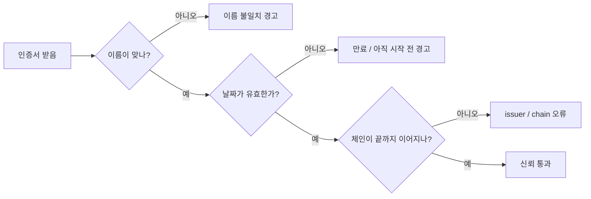
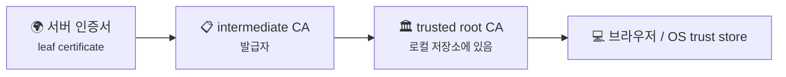
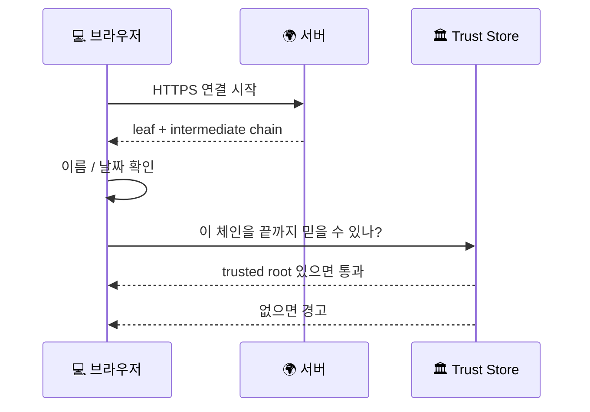

# TLS 인증서 체인과 신뢰 오류는 어떻게 읽어야 할까요?

> 자물쇠가 안 뜨면 그냥 **보안이 약한 사이트** 같죠? **사실은 그보다 훨씬 구체적인 확인 단계에서 멈춘 것**일 때가 많아요.

[TLS, SSL, 인증서는 뭐가 다를까요?](../basic/07-tls-ssl-and-certificates.md#browser-verification-flow){ data-preview }에서는 브라우저가 **상대가 진짜인지 확인하고 보호된 통로를 준비한다**는 큰 그림을 먼저 봤어요. 그리고 [TLS 1.3 핸드셰이크는 실제로 어떤 순서일까요?](./tls13-handshake-anatomy.md#certificate-and-verify){ data-preview }에서는 `Certificate`, `CertificateVerify`, `Finished` 같은 메시지가 **핸드셰이크 안에서 어떤 역할을 맡는지**도 살펴봤죠.

근데 막상 브라우저 경고창이나 `curl` 오류를 만나면, 또 다른 질문이 바로 생겨요.

> *"좋아요, 인증서를 본다는 건 알겠어요. 근데 왜 어떤 날은 이름이 안 맞는다고 하고, 어떤 날은 신뢰할 수 없는 발급자라고 하고, 또 어떤 날은 체인이 불완전하다고 하죠?"*

근데 이 글이 진짜 필요한 이유는, 인증서 오류가 전부 같은 고장이 아니기 때문이에요.

- **이름이 안 맞아서** 멈춘 건지
- **날짜가 지나서** 멈춘 건지
- **중간 체인이 끊겨서** 멈춘 건지
- 아니면 **내 로컬 trust store** 쪽 문제인지

이걸 구분 못 하면 같은 `curl: (60)` 이어도 대응이 완전히 엇나가요. 오늘은 **인증서 체인이 왜 여러 장으로 이어지는지**, 그리고 **브라우저와 CLI가 그 체인을 어디서 어떻게 검사하다가 멈추는지**를 실제 오류 장면처럼 따라가볼게요. 큰 뼈대는 [RFC 5280의 인증서 경로 검증](https://www.rfc-editor.org/rfc/rfc5280.html#section-6)과 [RFC 6125의 이름 확인 규칙](https://www.rfc-editor.org/rfc/rfc6125.html#section-6) 감각을 바탕으로 잡아볼게요.

!!! note "이 글의 범위"
    여기서는 **웹에서 자주 만나는 서버 인증서 신뢰 오류 장면**에 집중할게요. TLS 1.3 핸드셰이크 전체 구조나 `ClientHello` 부터 `Finished` 까지의 순서는 [TLS 1.3 핸드셰이크는 실제로 어떤 순서일까요?](./tls13-handshake-anatomy.md#message-summary){ data-preview }와 [TLS 핸드셰이크는 실제로 어떻게 한 단계씩 진행될까요?](./tls-handshake-step-by-step.md#scene-first-look){ data-preview } 쪽이 맡고, 여기서는 **체인이 어떻게 이어지고 어디서 신뢰가 끊기는지** 쪽을 붙잡을 거예요.

---

## 그래서 인증서 체인은 한마디로 뭐예요?

TLS 인증서 검사는 **증표 한 장만 보는 일**이 아니라, **이 증표를 누가 보증했고 그 보증 사슬이 어디까지 이어지는지**를 보는 일에 더 가까워요.

| 기본편에서 잡은 감각 | 비유에서는 | 실제로는 |
|---|---|---|
| 서버 신분 확인 | 눈앞의 출입증 | 서버의 leaf certificate |
| 발급자 확인 | 중간 관리 부서 도장 | intermediate CA |
| 최종 신뢰 기준 | 건물 관리실이 원래 믿는 도장 | trusted root CA |
| 이름이 맞는지 확인 | 출입증 이름과 방문 명단 대조 | hostname 검증 |
| 유효한 날짜인지 확인 | 출입증 만료일 확인 | notBefore / notAfter 검사 |
| 신뢰 실패 경고 | 검사대에서 입장 보류 | browser / `curl` trust error |

---

## 먼저 장면 한 컷부터 볼까요? { #scene-first-look }

예를 들어 `curl -v https://wrong.host.badssl.com/` 같은 장면에서는 이런 류의 오류를 보게 돼요.

```text
* TLSv1.3 (OUT), TLS handshake, Client hello (1):
* TLSv1.3 (IN), TLS handshake, Server hello (2):
* TLSv1.3 (IN), TLS handshake, Certificate (11):
* SSL: certificate subject name '*.badssl.com' does not match target hostname 'wrong.host.badssl.com'
* closing connection #0
curl: (60) SSL: no alternative certificate subject name matches target hostname 'wrong.host.badssl.com'
```

또 다른 날은 이런 식일 수도 있어요.

```text
* TLSv1.3 (IN), TLS handshake, Certificate (11):
* SSL certificate problem: unable to get local issuer certificate
curl: (60) SSL certificate problem: unable to get local issuer certificate
```

둘 다 **인증서에서 멈췄다**는 점은 비슷해 보여요. 근데 첫 번째는 **이름이 안 맞는 장면**이고, 두 번째는 **신뢰 사슬을 끝까지 못 따라간 장면**이에요. 즉 같은 “인증서 오류”처럼 보여도, **어느 검사가 실패했는지**는 꽤 달라요. 실제 문구는 `curl` 버전, TLS 라이브러리, 플랫폼에 따라 조금씩 달라질 수 있지만, **오류 갈래를 읽는 감각**은 비슷해요.

---

## 이 장면에서 먼저 읽어야 할 신호 네 가지 { #signals-to-read }

인증서 오류를 처음 볼 때는 세세한 ASN.1 구조보다, **검사가 어느 칸에서 멈췄는지**를 먼저 읽는 게 더 중요해요. 우선은 이 네 가지부터 잡으면 돼요.

- **이름이 안 맞는지** — 접속한 호스트 이름과 인증서의 이름이 다른가?
- **날짜가 안 맞는지** — 만료됐거나 아직 유효 기간이 시작되지 않았는가?
- **체인이 중간에서 끊기는지** — intermediate가 빠졌거나 로컬이 발급자를 못 믿는가?
- **로컬 신뢰 저장소가 다른지** — 서버는 멀쩡해 보여도, 지금 이 기기/도구가 그 루트를 안 믿는가?

이 네 가지만 먼저 읽어도, *"서버가 가짜인가?"*, *"체인이 덜 왔나?"*, *"내 PC가 오래된 건가?"* 같은 질문을 훨씬 덜 헤매고 좁힐 수 있어요.



이 그림이 중요한 이유는, 브라우저 경고를 막연히 **"TLS가 안 됐다"** 로만 읽으면 너무 넓기 때문이에요. 실제로는 **이름 검사 실패**, **날짜 검사 실패**, **체인 검사 실패**처럼 꽤 다른 갈래로 갈라져요.

---

## 인증서 체인은 왜 한 장이 아니라 줄줄이 따라올까요? { #chain-overview }

서버가 보내는 인증서는 대개 한 장으로 끝나지 않아요. 보통은 **서버 자신을 나타내는 leaf certificate** 와, 그걸 발급한 **intermediate certificate** 들이 함께 따라와요.



여기서 자주 헷갈리는 포인트가 하나 있어요.

> *"루트까지 다 서버가 보내주면 되는 거 아닌가요?"*

실제로는 브라우저나 운영체제가 **이미 가지고 있는 trusted root** 를 신뢰 기준점으로 쓰는 경우가 많아요. 서버는 보통 **leaf + intermediate 쪽**을 보내고, 클라이언트는 자기 로컬 저장소에서 **이미 믿는 root** 와 이어 붙여서 경로를 완성하려고 해요. RFC 5280이 말하는 path validation 감각도 바로 이 **사슬을 끝까지 따라가며 검증하는 일**에 가까워요.

즉 체인은 **"인증서가 여러 장이라 복잡한 것"** 이 아니라, **"눈앞의 신분증을 누가 보증했고 그 보증이 어디까지 이어지는지 보여주는 구조"** 라고 이해하면 훨씬 편해요.

---

## 브라우저는 누구를 어디까지 믿을까요? { #trust-store }

브라우저가 서버를 믿는다고 할 때, 사실 그 믿음은 **서버를 직접 원래부터 아는 것**과는 좀 달라요.

- 브라우저는 보통 **신뢰 저장소(trust store)** 안의 루트들을 신뢰 기준점으로 삼고,
- 서버가 보낸 leaf certificate를 보고,
- intermediate를 따라 올라가며,
- 그 경로가 **자기 trust store 안의 신뢰 anchor와 이어지는지** 확인해요.



이때 중요한 건 **구현마다 조금씩 다를 수 있다**는 점이에요. 어떤 브라우저는 OS trust store를 더 직접 쓰고, 어떤 도구는 자체 번들을 쓰기도 해요. 또 이름 확인, 날짜 확인, 경로 검증이 **설명처럼 딱 한 줄 순서로만 끊어지지 않고** 구현마다 조금 섞여 보일 수도 있어요. 그래서 같은 서버를 봐도 **Chrome은 열리는데 오래된 `curl` 은 실패한다** 같은 장면이 나올 수 있어요. 이런 차이는 *"서버가 완전히 멀쩡하다"* 라기보다, **누가 어떤 신뢰 저장소와 검증 정책을 기준으로 검사했는지**까지 같이 봐야 한다는 뜻에 더 가까워요.

---

## 어디서 끊기면 어떤 오류로 보일까요? { #trust-errors }

### 1. 이름이 안 맞으면, "이 서버가 그 이름의 주인 맞아?"에서 멈춰요

예를 들어 `example.com` 으로 접속했는데 인증서에는 `api.example.com` 만 들어 있으면, 브라우저는 **이름 확인 단계**에서 멈춰요. RFC 6125는 이런 서비스 이름 확인 규칙을 다루고, 오늘 감각으로는 **접속한 호스트 이름과 인증서 이름이 맞아야 한다** 정도만 붙잡아도 충분해요.

### 2. 날짜가 안 맞으면, 아직 유효하지 않거나 이미 끝난 증표로 읽혀요

만료됐거나 아직 시작 전인 인증서는, 신원 자체보다도 **시간 조건**에서 탈락해요. 이건 서버가 진짜인지와 별개로, **지금 이 시점에 쓸 수 있는 증표인가** 를 묻는 검사예요.

### 3. intermediate가 빠지면, 중간 보증 줄이 끊겨 보여요

서버가 leaf만 내밀고 intermediate를 제대로 안 주면, 클라이언트는 **누가 이 leaf를 보증했는지**를 끝까지 따라가기 어려워져요. 그때 자주 보는 문구가 `unable to get local issuer certificate`, `unable to verify the first certificate` 류예요. `unknown ca` 같은 표현도 보일 수 있는데, 이건 도구와 상황에 따라 **조금 더 넓게 “신뢰할 수 없는 발급자/체인 검증 실패” 쪽**으로 읽는 편이 안전해요.

### 4. 로컬이 그 root를 안 믿으면, 체인은 보여도 끝점이 낯설어요

사설 CA, 회사 내부 루트, 너무 오래된 루트 번들 같은 경우에는 **체인 자체는 있어 보여도 마지막 신뢰 기준점이 로컬에 없음** 쪽으로 멈출 수 있어요.

| 보이는 오류 감각 | 먼저 의심할 것 | 자주 연결되는 장면 |
|---|---|---|
| hostname mismatch | 접속 이름과 인증서 SAN/CN 불일치 | 다른 도메인 인증서 배포 |
| expired / not yet valid | 인증서 날짜 | 갱신 누락, 서버 시간 문제 |
| unknown issuer | intermediate 누락, 신뢰 안 되는 루트 | 체인 불완전, 사설 CA |
| unable to verify first certificate | 체인 경로 완성 실패 | intermediate 전송 누락 |

---

## 그럼 진짜 출력은 어떻게 읽을까요? { #real-scene }

이번에는 **체인 문제가 있는 테스트 서버를 진단해본다**고 상상해볼게요. 예를 들어 `openssl s_client -connect incomplete-chain.badssl.com:443 -servername incomplete-chain.badssl.com -showcerts` 같은 식으로 볼 수 있고, 출력은 대략 이런 느낌으로 나타날 수 있어요.

```text
CONNECTED(00000003)
depth=0 CN = example.com
verify error:num=20:unable to get local issuer certificate
verify return:1
depth=0 CN = example.com
verify error:num=21:unable to verify the first certificate
verify return:1
Certificate chain
 0 s:CN = example.com
   i:C = US, O = Example Intermediate CA
-----BEGIN CERTIFICATE-----
...
```

여기서 먼저 읽을 포인트는 이런 식이에요.

1. **`depth=0` 는 지금 leaf certificate를 보고 있다는 뜻**에 가까워요.
2. **`unable to get local issuer certificate` 는 위 발급자를 못 잇는 장면**으로 읽으면 돼요.
3. **`unable to verify the first certificate` 는 이 leaf에서 출발한 경로 검증이 완성되지 않았다는 뜻**에 가까워요.
4. 아래 `Certificate chain` 목록을 보면, **서버가 실제로 몇 장을 보내는지** 감이 와요.

중요한 건 이거예요. 이 출력은 단순히 *"TLS 실패"* 라기보다, **체인을 따라 올라가다 어느 계단에서 멈췄는지**를 보여주는 힌트예요. 그래서 인증서 문제를 볼 때는 **오류 한 줄 + chain 목록 + 접속 호스트 이름**을 같이 보는 습관이 꽤 중요해져요. 또 `openssl s_client` 는 **verify error를 보여줘도 진단용으로 연결을 계속 진행하는 경우가 있어요.** 그래서 브라우저나 `curl` 이 바로 실패하는 장면과 **완전히 같은 의미로 읽지 않는 것**도 중요해요.

여기서는 갈래를 한 번만 분리해둘게요.

> 여기서는 `openssl` 과 `curl` 출력의 세부 옵션을 백과사전처럼 다 모으진 않을게요. 지금 중요한 건 **도구 이름 외우기**가 아니라, 이름 검사인지 체인 검사인지 날짜 검사인지부터 먼저 가르는 감각이에요.

---

## 근데 왜 이런 오류가 브라우저마다 조금씩 다르게 보일까요?

이 부분도 초심자가 되게 많이 헷갈려요.

> *"한 브라우저에서는 경고고, 다른 도구에서는 아예 연결 실패예요. 누구 말이 맞는 거죠?"*

둘 다 틀렸다고 보기보다, **어떤 신뢰 저장소와 정책을 기준으로 검사했는지**가 다를 수 있다고 보는 편이 더 정확해요.

### 1. trust store가 다를 수 있어요

브라우저와 CLI 도구가 같은 루트 목록을 그대로 쓰지 않을 수 있어요.

### 2. 오류 문구를 보여주는 방식이 달라요

어떤 도구는 **hostname mismatch** 를 바로 크게 말해주고, 어떤 도구는 더 낮은 수준의 verify error 번호를 먼저 보여줘요.

### 3. 체인을 보충하는 전략도 구현마다 달라질 수 있어요

어떤 환경은 로컬에 이미 있던 intermediate 정보로 이어 붙이기도 하고, 어떤 환경은 서버가 안 보내면 더 엄격하게 실패하기도 해요.

그래서 이 글에서 제일 안전한 읽기법은, **"도구 A가 이렇게 말했으니 서버는 무조건 이렇다"** 보다 **"이 도구는 어떤 저장소와 정책 위에서 이 경고를 띄웠지?"** 로 한 번 더 생각하는 거예요.

---

## 잘못 읽기 쉬운 함정 다섯 가지 { #pitfalls }

**하나, 인증서가 한 장만 맞으면 끝났다고 생각하기.**  
실제로는 leaf만 보는 게 아니라, intermediate를 거쳐 trusted root까지 이어지는지 같이 봐요.

**둘, 자물쇠가 안 떴으니 무조건 서버가 가짜라고 단정하기.**  
이름 불일치일 수도 있고, intermediate 누락일 수도 있고, 로컬 trust store 차이일 수도 있어요.

**셋, `Certificate` 메시지가 보였으니 신뢰 검증도 자동으로 끝났다고 생각하기.**  
핸드셰이크 안에서 인증서를 받는 것과, 그 인증서를 **신뢰 경로로 검증하는 것**은 같은 말이 아니에요.

**넷, 브라우저 하나에서 열리면 모든 클라이언트에서도 열릴 거라고 생각하기.**  
도구와 OS마다 신뢰 저장소와 정책이 달라서 결과가 다를 수 있어요.

**다섯, 체인 오류를 서버 개인키 문제로 곧장 연결하기.**  
많은 경우는 개인키 유출 같은 극적인 문제가 아니라, **intermediate 누락**이나 **잘못 배포된 체인** 같은 운영 실수 쪽이에요.

---

## 자, 정리해볼까요?

!!! abstract "오늘 우리가 본 것"
    - TLS 인증서 검사는 **증표 한 장만 보는 일**이 아니라, **leaf → intermediate → trusted root** 로 이어지는 신뢰 사슬을 읽는 일이에요.
    - 인증서 오류를 볼 때는 우선 **이름**, **날짜**, **체인**, **로컬 trust store** 네 갈래부터 나눠 읽으면 좋아요.
    - `hostname mismatch` 와 `unknown issuer` 는 둘 다 인증서 문제처럼 보여도, 실제로는 **실패한 검사 지점이 다르다**는 게 중요해요.
    - 같은 서버라도 브라우저와 `curl` 이 다르게 반응할 수 있는 건, **도구와 저장소 차이**까지 같이 작용할 수 있기 때문이에요.
    - 그래서 TLS 경고를 읽는다는 건 단순히 무섭게 보는 게 아니라, **어느 확인 단계에서 멈췄는지 좁혀 보는 일**에 더 가까워요.

결국 인증서 체인과 신뢰 오류를 읽는다는 건, *"자물쇠가 안 떴네"* 에서 멈추지 않고 **도대체 어느 검문소에서 멈췄는지**를 알아내는 일이에요. 이 감각이 붙으면 브라우저 경고창도, `curl: (60)` 도, `openssl verify error` 도 조금 덜 막연하게 보이기 시작해요.

---

## 이어서 보면 좋은 글

- TLS와 인증서의 큰 그림부터 다시 잡고 싶다면 — [TLS, SSL, 인증서는 뭐가 다를까요?](../basic/07-tls-ssl-and-certificates.md#browser-verification-flow){ data-preview }
- 핸드셰이크 안에서 `Certificate` 와 `CertificateVerify` 가 어떤 역할을 맡는지 다시 보고 싶다면 — [TLS 1.3 핸드셰이크는 실제로 어떤 순서일까요?](./tls13-handshake-anatomy.md#certificate-and-verify){ data-preview }
- TLS 장면이 실제로 어떤 순서로 지나가는지 step-by-step으로 다시 보고 싶다면 — [TLS 핸드셰이크는 실제로 어떻게 한 단계씩 진행될까요?](./tls-handshake-step-by-step.md#scene-first-look){ data-preview }
- 요청 하나를 따라가다가 TLS 구간에서 인증서 경고가 끼면 어디쯤으로 읽어야 하는지 다시 붙이고 싶다면 — [End-to-End Request Debugging](../basic/26-end-to-end-request-debugging.md#tls-checkpoint){ data-preview }
