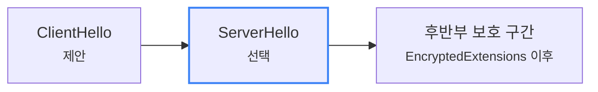

# TLS 핸드셰이크는 실제로 어떻게 한 단계씩 진행될까요?

> 주소창 자물쇠는 그냥 *짠!* 하고 켜질 것 같죠? **사실은 그 전에 꽤 차분한 확인 절차가 한 단계씩 지나가요.**

[TLS, SSL, 인증서는 뭐가 다를까요?](../basic/07-tls-ssl-and-certificates.md#browser-verification-flow){ data-preview }에서는 **브라우저가 상대를 확인하고 보호된 통로를 준비한다**는 큰 그림을 먼저 봤어요. 그리고 [TLS 1.3 핸드셰이크는 실제로 어떤 순서일까요?](./tls13-handshake-anatomy.md#full-handshake){ data-preview }에서는 `ClientHello`, `ServerHello`, `Certificate`, `Finished` 같은 메시지들이 **프로토콜 안에서 어떤 역할을 맡는지**를 구조 쪽에서 해부해봤죠.

실제 장면으로 내려오면 여기서부터 또 다른 헷갈림이 생겨요.

> *"좋아요, 이름과 역할은 알겠어요. 근데 실제 장면처럼 따라가면 어느 단계에서 무슨 일이 벌어지는 거죠?"*

이 글이 필요한 이유는 딱 이거예요. 브라우저나 도구를 보다 보면 **TCP는 이미 열렸는데, HTTP는 아직 안 올라오고, 중간에 TLS 줄들이 여러 개 끼어드는 장면**을 자주 보게 되거든요. 그때 이 흐름을 모르면 *"지금 느린 게 TCP 때문인지, 인증서 확인 때문인지, 그냥 정상 준비 단계인지"* 가 잘 안 갈려요.

오늘은 **가장 흔한 TLS 1.3 인증서 기반 핸드셰이크 한 장면**을 기준으로, 이게 **무슨 장면인지**, **TCP / 인증서 / 첫 HTTP 요청과 어떻게 연결되는지**, **왜 확인 단계가 여러 줄로 나뉘는지**, 그리고 그다음에야 **어떤 순서로 읽어야 하는지** 따라가볼게요. 설명의 큰 뼈대는 [RFC 8446 2장과 4장](https://www.rfc-editor.org/rfc/rfc8446.html#section-2), 실제 흐름 감각은 [RFC 8448의 simple 1-RTT example](https://www.rfc-editor.org/rfc/rfc8448.html#section-3) 쪽을 바탕으로 잡아볼게요.

!!! note "이 글의 범위"
    여기서는 **현대 웹에서 가장 흔한 TLS 1.3의 기본 핸드셰이크 장면을 읽는 감각**에 집중할게요. 각 메시지 필드와 변형 흐름 자체를 해부하는 일은 [TLS 1.3 핸드셰이크는 실제로 어떤 순서일까요?](./tls13-handshake-anatomy.md#message-summary){ data-preview } 쪽이 맡고, 여기서는 **그 구조가 실제 줄 위에서 어떤 순서와 신호로 보이는지**, 그리고 **왜 그 단계가 HTTP 앞에 끼어 있는지**를 붙잡을 거예요.

---

## 이 장면이 정확히 뭐였더라요?

먼저 아주 짧게만 다시 잡고 갈게요.

TLS 핸드셰이크는 **이미 열린 TCP 연결 위에서**,

- 누구와 이야기하는지 확인하고,
- 어떤 보호 규칙으로 갈지 맞추고,
- 그 확인 절차가 안 바뀌었는지 닫는

**HTTPS 시작 전 준비 장면**이에요.

즉 이 글은 암호학 교과서를 다시 여는 글이 아니라,
**HTTP 요청이 올라가기 전에 왜 이런 줄들이 먼저 지나가는지** 읽는 글에 더 가까워요.

그리고 이 확인 절차가 한 줄로 끝나지 않는 이유도 먼저 짚고 갈게요.

- 먼저 **어떤 방식으로 보호할지** 맞춰야 하고,
- 그다음 **상대가 누구인지** 확인해야 하고,
- 마지막으로 **방금까지의 대화가 안 바뀌었는지** 닫아야 하거든요.

즉 TLS 핸드셰이크가 여러 줄로 보이는 건 괜히 복잡하게 꾸며서가 아니라, **HTTP를 올리기 전에 서로 다른 확인 일을 순서대로 처리하고 있기 때문**이에요.

| 앞에서 잡은 감각 | 여기서 다시 보면 | 실제로는 |
|---|---|---|
| 보호된 통로 준비 | HTTP 앞에서 거치는 준비 절차 | TLS 핸드셰이크 |
| 아래 연결 | 먼저 대화 선로가 열려 있어야 함 | TCP 연결 |
| 상대 확인 | 진짜 서버인지 확인 | 인증서 / 검증 단계 |
| 마지막 닫기 | 방금까지 대화가 안 바뀌었는지 확인 | `Finished` |

---

## 먼저 장면 한 컷부터 볼까요? { #scene-first-look }

가장 단순한 설명용 장면은 보통 이렇게 잡아요.

```text
TCP handshake complete
ClientHello
ServerHello
EncryptedExtensions
Certificate
CertificateVerify
Finished
Finished
HTTP GET / ...
```

처음 보면 그냥 줄 몇 개처럼 보이죠. 근데 장면 읽기에서는 **각 줄의 구조보다 줄 사이 경계와 순서**가 더 중요해요. 즉 이 글의 핵심 질문은 *"이 메시지가 무슨 필드를 갖고 있지?"* 보다 *"이 줄이 어느 단계의 흔적이지?"* 에 더 가까워요.

여기서 제일 먼저 잡아야 할 건, **TLS는 TCP 위에서 시작한다**는 점이에요. 즉 이 장면은 연결을 여는 장면이 아니라, **이미 열린 연결 위에서 서로를 확인하고 보호 규칙을 맞추는 장면**이에요.

---

## 이 장면에서 먼저 읽어야 할 신호 네 가지 { #signals-to-read }

핸드셰이크를 처음 읽을 때는 세부 필드보다 **어디를 먼저 봐야 하는지**가 더 중요해요. 우선은 이 네 가지부터 잡으면 돼요.

1. **TLS는 TCP가 열린 뒤에 시작돼요** — 둘을 같은 핸드셰이크로 섞어 읽으면 바로 헷갈려요.
2. **`ClientHello` 는 시작 신호예요** — 이제 TLS 협상 장면이 열렸다는 뜻이에요.
3. **`ServerHello` 는 경계선이에요** — 여기서부터 TLS 1.3의 후반부 감각이 확 달라져요.
4. **뒤쪽 메시지들은 같은 덩어리가 아니에요** — 신원 제시, 소유 증명, 마지막 확인이 나눠져 있다는 점만 잡으면 돼요.

이 네 가지만 먼저 머리에 넣으면, 긴 설명을 보더라도 *"아, 지금은 제안 중이구나"*, *"여기서부터는 보호 경계가 바뀌는구나"* 같은 식으로 장면이 훨씬 잘 끊겨 보여요.

---

## 1단계: 먼저 TCP가 열려 있어야 해요

TLS는 허공에서 바로 시작하지 않아요. 보통은 먼저 TCP가 연결을 열고, 그 위에서 TLS가 올라와요.

이게 왜 중요할까요?

- TCP는 **대화할 선로를 여는 일**에 가깝고,
- TLS는 그 선로 위에서 **누구와 어떻게 안전하게 말할지 맞추는 일**에 가깝기 때문이에요.

그래서 [TCP 3-way handshake는 왜 세 번이나 주고받을까요?](../basic/09-tcp-3-way-handshake.md#handshake-signals){ data-preview }에서 봤던 `SYN → SYN-ACK → ACK` 와, 지금 보는 `ClientHello → ServerHello → ...` 는 이름도 다르고 목적도 달라요.

여기서는 한 가지만 먼저 분리해서 볼게요.

> 여기서는 TCP 자체를 다시 길게 열지 않을게요. 아래 연결이 어떻게 열리는지 감각을 다시 붙이고 싶다면 [tcpdump에서 TCP handshake는 어떻게 보일까요?](./tcp-handshake-in-capture.md#signals-to-read){ data-preview } 쪽이 바로 이어져요.

---

## 2단계: `ClientHello` 가 보이면, 이제 장면이 시작된 거예요

이 글에서는 `ClientHello` 의 모든 칸을 다시 해부하지 않을게요. 그건 이미 [TLS 1.3 핸드셰이크는 실제로 어떤 순서일까요?](./tls13-handshake-anatomy.md#clienthello){ data-preview }에서 구조 쪽으로 열어봤으니까요. 여기서는 **이 줄이 나타났다는 사실 자체가 뭘 뜻하는지**만 잡아볼게요.

`ClientHello` 가 보이면 일단 이렇게 읽으면 돼요.

- 이제 **TLS 대화가 시작됐다**
- 아직은 **협상 앞부분**이다
- 세부 필드를 외우기보다 **다음 줄로 어떻게 이어지는지** 보는 게 중요하다

그러니까 `ClientHello` 는 *"암호화가 끝났다"* 보다, **"암호화 준비가 막 시작됐다"** 쪽에 더 가까워요.

---

## 3단계: `ServerHello` 는 어디서 경계가 바뀌는지 알려줘요

`ServerHello` 를 보면 제일 먼저 떠올려야 할 질문은 이거예요.

> *"좋아요, 이제부터는 뭐가 달라지죠?"*

TLS 1.3에서는 바로 여기서 장면의 성격이 바뀌어요. 서버가 실제로 쓸 조합을 고르고 나면, 뒤쪽 메시지들은 **더 보호된 후반부** 감각으로 넘어가거든요.



그래서 장면을 읽을 때는 `ServerHello` 를 **단순 응답 한 줄**이 아니라, **앞단 협상과 뒷단 확인 절차를 가르는 경계선**으로 보는 편이 좋아요.

---

## 4단계: 뒤쪽 줄은 "이름"보다 "역할 덩어리"로 읽으면 쉬워요

`EncryptedExtensions`, `Certificate`, `CertificateVerify`, `Finished` 를 볼 때도 이 글에서는 각 필드 구조를 다시 길게 뜯지 않을게요. 대신 장면 위에서는 **지금이 어떤 확인 덩어리인지**만 끊어 읽으면 훨씬 편해요.

| 지금 보이는 장면 | 이렇게 읽으면 돼요 |
|---|---|
| `EncryptedExtensions` | 문 안쪽으로 들어가서 **추가 운영 규칙**을 알려주는 구간 |
| `Certificate` | 서버가 **누구인지 보여주는 구간** |
| `CertificateVerify` | 그 신분증의 **진짜 주인인지 증명하는 구간** |
| `Finished` | 지금까지의 대화가 **안 바뀌었는지 마지막으로 닫는 구간** |

즉 장면 감각에서는 *"메시지 이름 외우기"* 보다, **지금이 규칙 확인 단계인지, 신원 확인 단계인지, 마지막 무결성 확인 단계인지**를 먼저 읽는 편이 훨씬 덜 헷갈려요.

---

## 5단계: 그래서 실제 장면에서는 어디까지 보이고, 어디서부터 덜 보일까요?

여기서 초심자가 제일 자주 멈춰요.

> *"앞줄은 보이는데, 왜 뒤로 갈수록 덜 보이죠?"*

이건 TLS 1.3이 **암호화 경계를 더 빨리 세우는 쪽**으로 움직였기 때문이에요. 그래서 장면을 읽을 때는 이렇게만 기억해도 좋아요.

- `ClientHello`, `ServerHello` 는 **협상 앞부분**
- 그 뒤는 **확인 절차의 후반부**
- 그래서 TLS 1.2 기억만으로 보면 *"왜 안 보이지?"* 같은 오해가 생길 수 있음

여기서는 가지를 너무 넓히지 않고 기본 흐름만 먼저 붙잡을게요.

> 실제 도구나 구현에 따라 **호환성용 `ChangeCipherSpec` 레코드**가 잠깐 보이는 경우도 있어요. 여기서는 초심자용 기본 흐름을 먼저 붙잡고, 그런 가지는 나중에 따로 열어볼게요.

---

## 6단계: 그제야 HTTP가 올라와요

핸드셰이크를 읽을 때 자주 놓치는 포인트가 하나 더 있어요.

> 이 글에서 보는 **기본적인 웹 장면**에서는, 핸드셰이크 확인 절차가 닫힌 뒤에야 본격적인 HTTP 대화가 올라온다고 읽는 편이 좋아요.

물론 구현과 설명 방식에 따라 *정확히 어느 순간부터 어느 키를 이미 쓸 수 있는가* 는 더 세밀하게 들어갈 수 있어요. 하지만 입문-심화 사이 글에서는, **`Finished` 단계들이 지나간 뒤 application data 가 시작된다**는 감각으로 잡아두는 편이 안전해요.

그래서 [End-to-End Request Debugging](../basic/25-end-to-end-request-debugging.md#tls-checkpoint){ data-preview }에서 TLS 구간이 따로 보이는 거예요. HTTP가 느린 게 아니라, **그 전에 보호 통로 준비 시간이 따로 쓰이고 있을 수 있기 때문**이죠.

---

## 근데 왜 장면이 이렇게 여러 줄로 나뉠까요?

한 번에 *"자, 이제 암호화!"* 하고 끝내면 쉬울 것 같죠? **사실은 아니에요.** TLS는 한꺼번에 해결해야 하는 문제가 여러 개라서 단계를 나눠요.

### 1. 어떤 방식으로 말할지 먼저 맞춰야 하니까요

앞줄에서 어떤 조합으로 갈지 맞춰야, 뒤 줄이 무슨 뜻인지도 읽히기 시작하거든요.

### 2. 상대가 누구인지 확인해야 하니까요

그냥 줄이 몇 개 오갔다고 끝이 아니에요. **내가 찾은 그 서버인지** 확인되는 흐름이 따로 보여야 하거든요.

### 3. 방금까지의 대화가 안 바뀌었는지도 확인해야 하니까요

중간 줄에서 신원과 확인 절차가 어떻게 닫히는지 보여야, 마지막 줄의 의미도 분명해져요.

### 4. 그 다음에야 HTTP를 안심하고 올릴 수 있으니까요

결국 이 여러 줄은 쓸데없이 복잡한 장식이 아니라, **HTTP가 올라오기 전에 무엇이 먼저 확인되는지 보여주는 기록**이에요.

---

## 그럼 진짜 TLS 장면은 어떻게 보일까요? { #real-scene }

아까는 설명용 장면으로 봤죠. 이번에는 **실제로 도구에서 만날 법한 흔적**을 한 번 볼게요. 예를 들어 `openssl s_client -connect example.com:443 -servername example.com -tls1_3 -msg` 같은 흐름에서는, 대표적으로 이런 줄을 만나게 돼요.

```text
>>> TLS 1.3, Handshake, ClientHello
<<< TLS 1.3, Handshake, ServerHello
<<< TLS 1.3, Handshake, EncryptedExtensions
<<< TLS 1.3, Handshake, Certificate
<<< TLS 1.3, Handshake, CertificateVerify
<<< TLS 1.3, Handshake, Finished
>>> TLS 1.3, Handshake, Finished
```

물론 실제 길이 값, 레코드 표현, 출력 형식은 도구와 구현마다 조금씩 달라질 수 있어요. 중요한 건 **줄 모양을 통째로 외우는 것**보다, 이 장면에서 무엇을 먼저 읽어야 하는지예요.

1. **화살표 방향** — 누가 먼저 보냈는지
2. **`ServerHello` 뒤 경계** — 장면의 성격이 바뀌는 지점
3. **`Certificate` 와 `CertificateVerify` 분리** — 신분 제시와 진짜 주인 증명이 다른 단계라는 점
4. **`Finished` 두 줄** — 마지막 확인이 양쪽에서 닫히는 장면이라는 점

이렇게 보면 이 글은 단순히 메시지 이름을 다시 외우는 글이 아니라, **실제 줄을 봤을 때 어디서 협상이 끝나고, 어디서 신원이 보이고, 어디서 마지막 확인이 닫히는지 읽는 글**이 돼요.

---

## TLS 1.2 감각이랑 어디서 가장 많이 헷갈릴까요?

여기서는 큰 그림만 짚을게요. **TLS 1.2와 TLS 1.3은 같은 이름표를 달고 있어도 장면 순서가 꽤 달라요.**

- TLS 1.2에는 `ServerHelloDone`, `ChangeCipherSpec` 같은 감각이 더 또렷해요.
- TLS 1.3에는 `EncryptedExtensions` 가 들어오고, `ServerHello` 뒤의 후반부가 더 빨리 보호돼요.
- 그래서 TLS 1.2 화면 기억만으로 TLS 1.3 장면을 읽으면, *"왜 이 줄이 안 보이지?"* 같은 오해가 생기기 쉬워요.

표지판만 하나 세워둘게요.

> 여기서는 **현대 웹에서 가장 흔한 TLS 1.3 기본 장면**만 붙잡을게요. `HelloRetryRequest`, 0-RTT, 호환성용 `ChangeCipherSpec`, 구버전 흐름 비교는 뒤에서 따로 열어도 충분해요.

---

## 잘못 읽기 쉬운 함정 다섯 가지 { #pitfalls }

**하나, TCP 핸드셰이크와 TLS 핸드셰이크를 같은 장면으로 생각하기.**  
TCP는 연결 열기고, TLS는 그 연결 위에서 보호 규칙과 신원을 맞추는 단계예요.

**둘, `Certificate` 만 보이면 인증이 끝났다고 생각하기.**  
`CertificateVerify` 와 `Finished` 까지 봐야 현재 세션 위 확인이 닫혀요.

**셋, TLS 1.3에서도 예전처럼 뒤 단계가 다 평문에 오래 남는다고 생각하기.**  
TLS 1.3에서는 `ServerHello` 뒤의 후반부 감각이 확 달라져요.

**넷, 0-RTT를 기본 핸드셰이크의 평범한 빠른 버전이라고 생각하기.**  
그건 재개 쪽 가지예요. 첫 이해에서는 기본 흐름과 분리해서 보는 편이 안전해요.

**다섯, 자물쇠가 떴다는 걸 "암호화만 됐다" 로만 읽기.**  
실제로는 **협상 + 신원 확인 + 무결성 확인**이 지나간 결과에 더 가까워요.

---

## 자, 정리해볼까요?

!!! abstract "오늘 우리가 본 것"
    - TLS 핸드셰이크는 보통 **TCP가 열린 뒤**에 시작돼요.
    - `ClientHello` 는 장면의 시작 신호, `ServerHello` 는 경계선, 뒤쪽 메시지들은 신원 확인과 마지막 확인 절차로 읽으면 좋아요.
    - TLS 1.3에서는 **`ServerHello` 뒤부터 후반부 감각이 크게 달라진다**는 점이 중요해요.
    - 그래서 자물쇠는 단순히 "숨겼다" 보다, **상대 확인과 보호 통로 준비가 닫혔다**는 뜻에 더 가까워요.
    - HTTP는 그 준비 절차가 지나간 뒤에야 안심하고 올라와요.

결국 TLS 핸드셰이크를 step-by-step으로 읽는다는 건, *"보안이 걸렸다"* 라는 결과만 보는 게 아니라 **그 결과가 어떤 순서의 확인 절차 위에서 만들어졌는지** 보는 일이에요.

---

## 이어서 보면 좋은 글

- TLS와 인증서의 큰 그림부터 다시 잡고 싶다면 — [TLS, SSL, 인증서는 뭐가 다를까요?](../basic/07-tls-ssl-and-certificates.md#browser-verification-flow){ data-preview }
- 메시지 이름과 역할을 구조 쪽에서 다시 해부하고 싶다면 — [TLS 1.3 핸드셰이크는 실제로 어떤 순서일까요?](./tls13-handshake-anatomy.md#message-summary){ data-preview }
- 실제 장면에서 인증서 경고가 뜰 때, 이름 문제인지 체인 문제인지 더 구체적으로 가르고 싶다면 — [TLS 인증서 체인과 신뢰 오류는 어떻게 읽어야 할까요?](./tls-cert-chain-and-trust-errors.md#signals-to-read){ data-preview }
- 아래 연결이 실제로 어떻게 열리는지 캡처 감각으로 다시 보고 싶다면 — [tcpdump에서 TCP handshake는 어떻게 보일까요?](./tcp-handshake-in-capture.md#signals-to-read){ data-preview }
- 요청 하나를 끝까지 따라가며 TLS 구간이 어디인지 다시 보고 싶다면 — [End-to-End Request Debugging](../basic/25-end-to-end-request-debugging.md#tls-checkpoint){ data-preview }
