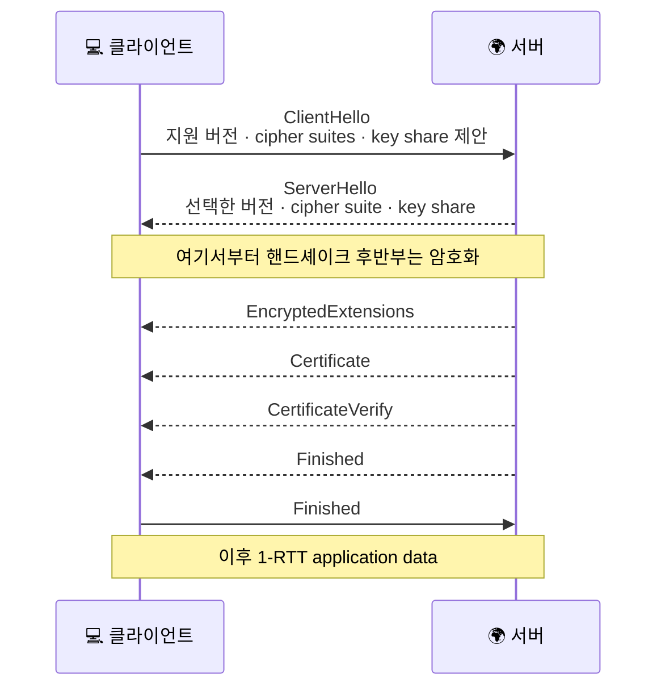
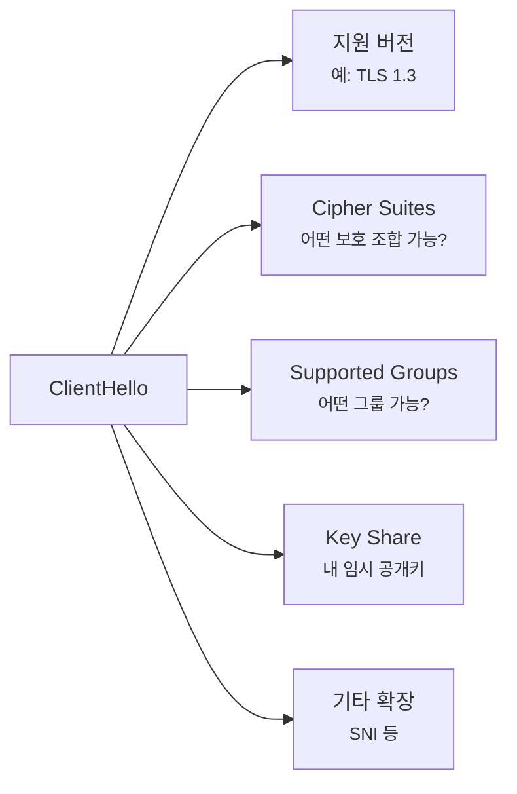
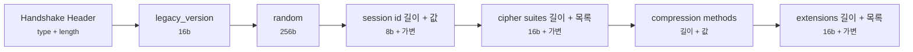
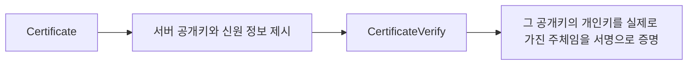

# TLS 1.3 핸드셰이크는 실제로 어떤 순서일까요?

> HTTPS는 자물쇠만 뜨면 끝일 것 같죠? **사실 그 직전에는 꽤 촘촘한 준비 대화가 먼저 오가요.**

[TLS, SSL, 인증서는 뭐가 다를까요?](../basic/07-tls-ssl-and-certificates.md#browser-verification-flow){ data-preview }에서는 브라우저가 **진짜 서버인지 확인하고 보호된 통로를 준비한다**는 큰 그림을 먼저 봤어요. 그리고 [End-to-End Request Debugging](../basic/25-end-to-end-request-debugging.md#tls-checkpoint){ data-preview }에서는 연결은 열렸는데 **TLS에서 시간이 쓰일 수도 있다**는 감각도 붙여봤죠.

근데 여기서 이런 궁금증이 딱 생겨요.

> *"좋아요, TLS가 보호된 통로를 준비한다는 건 알겠어요. 근데 TLS 1.3에서는 그 준비가 정확히 어떤 순서로 오가죠?"*

근데 이 글이 필요한 이유는 단순히 메시지 이름을 외우기 위해서가 아니에요.

- 왜 TLS 1.3은 **1-RTT** 감각으로 설명되는지
- 왜 `ServerHello` 뒤부터는 장면이 **갑자기 덜 보이기 시작하는지**
- 왜 `Certificate` 하나로 끝나지 않고 `CertificateVerify`, `Finished` 까지 **여러 확인 단계**가 필요한지

이런 질문이 실제 HTTPS 장면, 성능 감각, 인증서 이해와 다 같이 연결돼 있거든요.

오늘은 **TLS 1.3의 대표적인 전체 핸드셰이크 흐름**을 기준으로, 먼저 **이게 한마디로 어떤 준비 절차인지**, **무엇과 연결되는지**, **왜 TLS 1.2보다 이런 모양으로 바뀌었는지**를 잡고, 그다음 `ClientHello` 부터 `Finished` 까지 각 메시지가 **프로토콜 안에서 무슨 역할을 맡는지** 같이 해부해볼게요. RFC 기준으로는 [RFC 8446 2장과 4장](https://www.rfc-editor.org/rfc/rfc8446.html#section-2) 의 흐름을 바탕으로 볼게요.

!!! note "이 글의 범위"
    여기서는 **TLS 1.3의 기본적인 인증서 기반 1-RTT 핸드셰이크**를 큰 뼈대로 볼게요. 인증서 체인 검증의 세부 정책, ECH, QUIC, 기업용 TLS 설정표 같은 주제까지는 지금 다 열지 않아요. 또 HKDF 수식 자체를 암호학 교과서처럼 풀기보다, **"왜 이 메시지가 여기서 필요할까"** 에 집중할 거예요.

    반대로 *"좋아요, 이 구조는 알겠어요. 근데 실제 줄을 보면 어디부터 읽죠?"* 같은 질문은 [TLS 핸드셰이크는 실제로 어떻게 한 단계씩 진행될까요?](./tls-handshake-step-by-step.md#scene-first-look){ data-preview }에서 **장면 읽기 감각**으로 따로 이어볼게요.

---

## 그래서 TLS 1.3 핸드셰이크는 한마디로 뭐예요?

TLS 1.3 핸드셰이크는 단순히 *"암호화 켜기"* 버튼을 누르는 일이 아니라, **규칙 협상 → 암호화 경계 세우기 → 신원 확인 → 마지막 무결성 확인** 순서로 진행되는 준비 절차에 더 가까워요.

이 절차는 TCP가 이미 열린 뒤에 올라와서,

- 어떤 보호 조합으로 갈지 맞추고,
- 서버가 진짜 그 서버인지 확인하고,
- 그 확인 대화가 중간에 안 바뀌었는지 닫은 다음,
- 그제야 HTTP 같은 application data 를 안전하게 올리게 해줘요.

| 기본편에서 잡은 감각 | 비유에서는 | 실제로는 |
|---|---|---|
| 보호된 통로 준비 | 비밀 회의실 입장 절차 | TLS 핸드셰이크 |
| 가능한 방식 제안 | 방문객이 가능한 회의 방식 제시 | `ClientHello` |
| 방식 선택 | 관리실이 사용할 조합 확정 | `ServerHello` |
| 문 안쪽 안내 | 밖에서는 안 들리게 추가 안내 | `EncryptedExtensions` |
| 신분증 확인 | 회의실 쪽 신원 증명 | `Certificate` + `CertificateVerify` |
| 마지막 확인 | "방금 대화 안 바뀌었죠?" 확인 | `Finished` |

그리고 TLS 1.3이 이런 모양으로 정리된 데에는 배경이 있어요. 예전보다 **왕복을 줄이고**, **암호화 경계를 더 빨리 세우고**, **중간에서 평문으로 보이는 협상 정보를 줄이려는 방향**으로 크게 움직였거든요. 그래서 이 글은 메시지 목록만 보는 글이 아니라, **왜 TLS 1.3이 이렇게 재배치됐는지**까지 같이 읽는 글이에요.

---

## TLS 1.3 전체 흐름은 이렇게 생겨요 { #full-handshake }

가장 많이 보는 **인증서 기반 full handshake** 를 한 장으로 그리면 이래요.

이 그림에서 가장 먼저 잡아야 할 핵심은 세 가지예요.

1. **앞부분 두 메시지(`ClientHello`, `ServerHello`)가 암호화 경계를 세운다**는 점
2. **`ServerHello` 뒤부터는 많은 내용이 암호화된다**는 점
3. **신분 확인과 마지막 무결성 확인이 따로 존재한다**는 점

RFC 8446은 이 전체 흐름을 크게 세 단계로 설명해요.

- **Key Exchange** — 버전, 암호 모드, 키 재료를 맞춰요.
- **Server Parameters** — 추가 핸드셰이크 파라미터를 정해요.
- **Authentication** — 서버를 인증하고, 핸드셰이크가 안 바뀌었는지 확인해요.

---

## 메시지 한눈에 요약하면 이래요 { #message-summary }

| 메시지 | 누가 보내나 | 하는 일 | 평문 / 암호화 |
|---|---|---|---|
| `ClientHello` | 클라이언트 | 지원 버전, cipher suite, key share 등 제안 | 평문 |
| `ServerHello` | 서버 | 실제로 쓸 버전과 파라미터 선택 | 평문 |
| `EncryptedExtensions` | 서버 | 이제 암호화된 상태에서 서버 쪽 추가 파라미터 전달 | 암호화 |
| `Certificate` | 서버 | 서버 인증서 제시 | 암호화 |
| `CertificateVerify` | 서버 | 방금 낸 인증서의 개인키를 실제로 가진 쪽임을 증명 | 암호화 |
| `Finished` | 서버/클라이언트 | 지금까지 핸드셰이크가 안 바뀌었는지 확인 | 암호화 |

여기서는 가지를 잠깐 접어둘게요.

> 여기서는 **인증서 기반 전체 흐름**을 중심으로 볼게요. PSK 재개, 0-RTT, `HelloRetryRequest` 같은 가지는 뒤에서 **변형 흐름**으로 따로 묶어볼게요.

---

## `ClientHello` 는 왜 이렇게 많은 걸 한 번에 들고 갈까요? { #clienthello }

TLS 1.3의 출발점은 `ClientHello` 예요. 이 메시지는 *"안녕하세요"* 하나로 끝나지 않아요. 오히려 **앞으로 대화를 어떻게 준비할지에 대한 제안서**에 더 가까워요.

RFC 8446 2장은 `ClientHello` 안에 이런 것들이 들어간다고 설명해요.

- 지원 가능한 **TLS 버전 목록**
- 지원 가능한 **cipher suites**
- 보통 **Diffie-Hellman key share**
- 필요하면 **PSK 관련 정보**
- 그 밖의 여러 확장 정보

이게 중요한 이유는, TLS 1.3이 **왕복 횟수를 줄이기 위해** 클라이언트가 미리 key share까지 들고 가는 쪽으로 설계됐기 때문이에요. 예전보다 *"이것도 돼요, 저것도 돼요, 그리고 이 키 재료 후보도 가져왔어요"* 를 초반에 한 번에 묶어 보내는 거죠.

### ClientHello의 기본 뼈대는 이렇게 잡으면 돼요

| 필드명 | 길이(bit) | 의미 | 자주 보는 값 |
|---|---:|---|---|
| Handshake Type | 8 | 이 메시지가 `ClientHello` 임을 표시 | `client_hello` |
| Length | 24 | 뒤에 오는 ClientHello 본문 길이 | 환경마다 다름 |
| `legacy_version` | 16 | 하위 호환을 위한 기록용 버전 칸 | `0x0303` 자주 봄 |
| `random` | 256 | 클라이언트 쪽 랜덤 값 | 매번 달라짐 |
| Cipher Suites Vector | 16 + 가변 | 지원 cipher suite 목록 | `TLS_AES_128_GCM_SHA256` 류 |
| Extensions Vector | 16 + 가변 | 버전, key share, SNI 등 확장 묶음 | 길이와 구성은 가변 |

여기서 중요한 건 **ClientHello가 딱딱한 고정 20바이트 헤더 같은 구조는 아니라는 점**이에요. 대신 **핸드셰이크 공통 머리말 + 여러 가변 길이 벡터**가 이어지는 구조에 더 가까워요. 그래서 TLS 해부형 글에서는 TCP처럼 32비트 격자를 펼치기보다, **메시지 뼈대와 확장 묶음**을 읽는 편이 더 자연스러워요.

| 필드/요소 | 길이(고정 여부) | 의미 | 자주 보는 값/감각 |
|---|---:|---|---|
| `supported_versions` | 가변 | TLS 1.3을 포함한 지원 버전 목록 | `TLS 1.3` 포함 |
| `cipher_suites` | 가변 | 사용할 수 있는 보호 조합 목록 | `TLS_AES_128_GCM_SHA256` 류 |
| `supported_groups` | 가변 | 어떤 (EC)DHE 그룹을 쓸 수 있는지 | `x25519`, `secp256r1` 류 |
| `key_share` | 가변 | 클라이언트의 임시 공개키 | 1-RTT를 줄이는 핵심 재료 |
| `signature_algorithms` | 가변 | 어떤 서명 알고리즘을 검증할 수 있는지 | 서버 인증서 검증과 연결 |

즉 `ClientHello` 는 단순한 인사말이 아니라, **협상 재료를 한꺼번에 깔아두는 첫 장면**이에요.

---

## `ServerHello` 뒤에는 정확히 뭐가 달라질까요? { #serverhello }

서버는 `ClientHello` 를 보고 **실제로 쓸 조합**을 골라서 `ServerHello` 로 답해요.

- 어떤 TLS 버전을 쓸지
- 어떤 cipher suite 를 쓸지
- 어떤 key share 를 받아들일지

RFC 8446 2장은 **`ClientHello` + `ServerHello` 의 조합이 공유 키 재료를 결정한다**고 설명해요. 여기서 중요한 반전이 하나 나와요.

> **TLS 1.3에서는 `ServerHello` 뒤의 많은 핸드셰이크 메시지가 암호화돼요.**

이건 TLS 1.2와 비교할 때 사람들이 가장 자주 기억하는 차이 중 하나예요. RFC 8446 1.2절도 주요 차이점으로 **"All handshake messages after the ServerHello are now encrypted"** 를 직접 적고 있어요.

### 왜 이게 큰 차이일까요?

예전 감각으로는 인증서나 여러 협상 세부사항이 더 오래 평문에 머무는 쪽이 익숙했어요. 근데 TLS 1.3은 **암호화 경계를 더 빨리 세우는 쪽**으로 크게 움직였어요. 그래서 중간 관찰자가 볼 수 있는 정보가 줄어들죠.

---

## `EncryptedExtensions` 는 왜 따로 있을까요? { #encryptedextensions }

이 이름이 처음엔 좀 낯설어요. *"확장을 그냥 ServerHello에 더 넣으면 안 되나요?"* 싶죠.

TLS 1.3은 여기서 역할을 분리해요.

- `ServerHello` 는 **키 교환과 암호화 경계 설정에 꼭 필요한 것**에 집중하고,
- `EncryptedExtensions` 는 **그 뒤에 알려도 되는 서버 쪽 추가 파라미터**를 담아요.

RFC 8446 2장은 `EncryptedExtensions` 를 **암호 파라미터 결정에 필수는 아니지만, 핸드셰이크에 필요한 서버 응답 확장**을 보내는 자리로 설명해요.

즉 이 메시지는 *"이제 문은 닫혔고, 그 안에서 조금 더 자세한 운영 규칙을 알려줄게요"* 에 가까워요.

---

## `Certificate` 와 `CertificateVerify` 는 왜 둘 다 필요할까요? { #certificate-and-verify }

이 부분이 초심자가 가장 자주 멈추는 지점이에요.

> *"인증서 보여줬으면 된 거 아닌가요? 왜 또 Verify가 따로 있어요?"*

핵심은 이거예요.

- `Certificate` 는 **"이 공개키와 이 신원 정보를 봐주세요"** 에 가까워요.
- `CertificateVerify` 는 **"그리고 그 공개키에 대응하는 개인키를 내가 진짜 갖고 있어요"** 를 서명으로 증명해요.

RFC 8446 2장은 `CertificateVerify` 를 **Certificate 메시지의 공개키에 대응하는 개인키로, 그 시점까지의 핸드셰이크 transcript 에 서명하는 단계**라고 설명해요.

즉 `Certificate` 만 있으면 **신분증 사본을 보여준 것**에 더 가깝고, `CertificateVerify` 까지 가야 **그 신분증의 진짜 주인임을 현재 세션 위에서 증명한 것**에 가까워져요.

| 메시지 | 하는 일 | 왜 따로 필요한가 |
|---|---|---|
| `Certificate` | 인증서와 공개키 제시 | 브라우저가 누구인지, 어떤 공개키인지 읽어야 하니까 |
| `CertificateVerify` | 그 시점까지의 handshake transcript 에 서명 | 그 공개키의 개인키를 실제로 가진 주체임을 증명해야 하니까 |

여기서 표지판 하나만 더 세워둘게요.

> 여기서는 인증서 체인 검증 정책 전체를 길게 다루지 않을 거예요. **"어떤 이름인지, 누가 발급했는지, 그 공개키를 실제로 가진 주체인지"** 가 왜 메시지 둘로 나뉘는지까지만 선명하게 잡으면 충분해요.

---

## `Finished` 는 무엇을 확인할까요? { #finished }

`Finished` 는 이름이 심심해 보여도 되게 중요해요.

RFC 8446 2장은 이 메시지를 **그 시점까지의 핸드셰이크 transcript 를 검증하는 MAC** 으로 설명해요. 이 메시지가 하는 일은 크게 세 가지예요.

1. **키 확인(key confirmation)**
2. **상대 신원과 지금 세션 키를 묶기**
3. **지금까지 본 핸드셰이크 transcript 가 안 바뀌었는지 확인하기**

즉 `Finished` 는 *"좋아요, 우리 둘 다 지금까지의 대화를 같은 내용으로 보고 있고, 같은 키 쪽으로 도달했어요"* 라는 마지막 확인장 같은 거예요.

그래서 `Certificate` 와 `CertificateVerify` 만 보고 *"이제 끝났네"* 라고 읽으면 반쯤만 본 거예요. **마지막 transcript 무결성 확인**까지 지나가야 진짜로 핸드셰이크가 닫혀요.

RFC 8446의 큰 흐름 기준으로는, **적어도 각자 자기 `Finished` 까지는 지나야 그다음 단계 데이터 보호가 닫힌다**고 보는 편이 안전해요. 다만 설명을 단순하게 할 때 흔히 **서버 `Finished` → 클라이언트 `Finished` → 본격적인 application data** 순서로 그리지만, 실제 설명에서는 그 경계를 너무 절대적인 한 줄 규칙처럼 외우기보다 **누가 어느 단계 키를 이미 갖췄는지** 쪽으로 읽는 게 더 정확해요.

---

## 근데 왜 TLS 1.3은 이렇게 바뀌었을까요? { #why-tls13 }

RFC 8446 1.2절이 짚는 큰 변화들을 사람 말로 풀면 이래요.

### 1. 더 적은 왕복으로 시작하고 싶었어요

클라이언트가 `ClientHello` 에 key share 를 미리 담아 가니까, 서버가 맞는 조합을 골라 바로 `ServerHello` 로 이어가기 쉬워졌어요. 그래서 대표적인 전체 핸드셰이크가 **1-RTT** 감각으로 정리돼요.

### 2. 더 빨리 암호화 경계를 세우고 싶었어요

`ServerHello` 뒤의 많은 핸드셰이크 메시지가 암호화되면서, 중간 관찰자가 보는 정보가 줄었어요. 이건 성능만이 아니라 **개인정보 노출 면적을 줄이는 쪽**과도 연결돼요.

### 3. 낡은 방식은 많이 걷어냈어요

RFC 8446 1.2절은 TLS 1.3이 **legacy 알고리즘을 많이 정리했고**, **static RSA key exchange를 제거했고**, **forward secrecy 쪽으로 정리했다**고 설명해요. 즉 옛날 배경 짐을 많이 덜어낸 버전이라고 보면 돼요.

---

## 변형 흐름은 어떤 게 있을까요? { #variants }

기본 전체 흐름만 외워두면 좋은데, 실전에서는 몇 가지 가지치기가 있어요.

### 1. `HelloRetryRequest`

클라이언트가 처음 보낸 `key_share` 가 서버가 원하는 그룹과 안 맞으면, 서버는 [RFC 8446 2.1절](https://www.rfc-editor.org/rfc/rfc8446.html#section-2.1) 에 따라 `HelloRetryRequest` 로 **다시 맞는 share를 보내달라**고 할 수 있어요.

즉 이건 *"실패"* 라기보다, **초반 협상 재시도 분기**에 가까워요.

### 2. PSK / 세션 재개

RFC 8446 2.2절은 TLS 1.3이 예전 세션 ID / 세션 티켓 감각을 **새 PSK 기반 재개 흐름**으로 정리했다고 설명해요. 이미 이전 연결에서 만든 재료를 바탕으로 더 빨리 다시 시작하는 가지예요.

### 3. 0-RTT

TLS 1.3은 **0-RTT 데이터**도 추가했어요. 왕복을 더 줄일 수 있지만, RFC 8446 1.2절과 8장은 이 모드가 **certain security properties** 를 희생한다고 설명해요. 특히 많이 알려진 핵심은 이거예요.

> **0-RTT 데이터는 재생(replay)될 수 있어요.**

그래서 *"빠르다 = 무조건 좋다"* 로 보면 안 되고, **무슨 데이터에 허용할지** 를 조심스럽게 골라야 해요.

---

## 잘못 읽기 쉬운 함정 여섯 가지 { #pitfalls }

**하나, TLS 1.3은 TLS 1.2에서 메시지 몇 개만 줄인 버전이라고 생각하기.**  
아니에요. 왕복 수, 암호화 경계, 키 파생 구조, 재개 방식까지 꽤 크게 재설계됐어요.

**둘, 인증서는 평문으로 항상 다 보인다고 생각하기.**  
TLS 1.3에서는 `ServerHello` 뒤의 많은 핸드셰이크 메시지가 암호화돼요.

**셋, `Certificate` 만 오면 서버 인증이 끝났다고 생각하기.**  
`CertificateVerify` 와 `Finished` 까지 봐야 현재 세션 위 인증과 무결성 확인이 닫혀요.

**넷, 0-RTT는 그냥 더 빠른 정상 모드라고 생각하기.**  
빠르긴 하지만, replay 쪽 성질이 달라서 아무 데이터에나 막 쓰는 감각은 위험해요.

**다섯, `HelloRetryRequest` 를 예외적인 오류 메시지 정도로만 보기.**  
실제로는 key share가 안 맞을 때 나오는 **정식 협상 분기**예요.

---

## 자, 정리해볼까요?

!!! abstract "오늘 우리가 본 것"
    - TLS 1.3 핸드셰이크는 **`ClientHello` → `ServerHello` → `EncryptedExtensions` → `Certificate` → `CertificateVerify` → `Finished`** 흐름으로 읽으면 큰 뼈대가 잡혀요.
    - 이 글의 핵심은 **각 메시지가 프로토콜 안에서 왜 필요한지**를 잡는 거예요.
    - `ClientHello` 와 `ServerHello` 는 협상과 키 재료의 출발점이고, `ServerHello` 뒤에는 후반부 메시지가 더 보호된 상태로 이어져요.
    - `Certificate` 와 `CertificateVerify` 는 신원 제시와 개인키 보유 증명을 나눠 맡고, `Finished` 는 마지막 무결성 확인을 닫아요.
    - 변형 흐름으로는 `HelloRetryRequest`, PSK 재개, 0-RTT 같은 가지가 붙을 수 있어요.

결국 TLS 1.3 핸드셰이크를 읽는다는 건, *"자물쇠가 떴다"* 를 넘어서 **그 자물쇠를 잠그는 프로토콜 부품이 각각 무슨 일을 하는지** 보는 일이에요. 이 역할 분담이 잡히면, 뒤에서 실제 로그나 캡처를 만났을 때도 어느 줄이 어떤 뜻인지 훨씬 덜 막연해져요.

---

## 이어서 보면 좋은 글

- TLS가 왜 필요한지, 인증서와 보호 통로의 큰 그림부터 다시 잡고 싶다면 — [TLS, SSL, 인증서는 뭐가 다를까요?](../basic/07-tls-ssl-and-certificates.md#browser-verification-flow){ data-preview }
- 같은 메시지들을 이번에는 **실제 장면처럼 한 단계씩** 따라가고 싶다면 — [TLS 핸드셰이크는 실제로 어떻게 한 단계씩 진행될까요?](./tls-handshake-step-by-step.md#scene-first-look){ data-preview }
- `Certificate` 뒤에서 실제로 이름 확인, 체인 검증, 신뢰 실패가 어떻게 갈라지는지 장면으로 보고 싶다면 — [TLS 인증서 체인과 신뢰 오류는 어떻게 읽어야 할까요?](./tls-cert-chain-and-trust-errors.md#signals-to-read){ data-preview }
- 요청 하나를 따라가다가 **TLS 단계에서 멈춘다**는 감각을 다시 붙여보고 싶다면 — [End-to-End Request Debugging](../basic/25-end-to-end-request-debugging.md#tls-checkpoint){ data-preview }
- 평문 TCP 연결 위에 TLS가 올라가기 전, 아래 연결 자체는 어떻게 열리는지 다시 보고 싶다면 — [TCP 3-way handshake는 왜 세 번이나 주고받을까요?](../basic/09-tcp-3-way-handshake.md#handshake-signals){ data-preview }
- 상태 목록 다음 단계로, 실제 패킷 줄과 캡처 장면을 읽는 감각을 붙이고 싶다면 — [tcpdump 한 줄은 어떻게 읽어야 할까요?](./tcpdump-first-look.md#one-line-anatomy){ data-preview }
