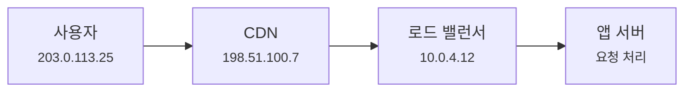
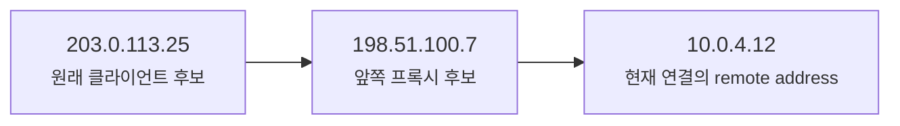
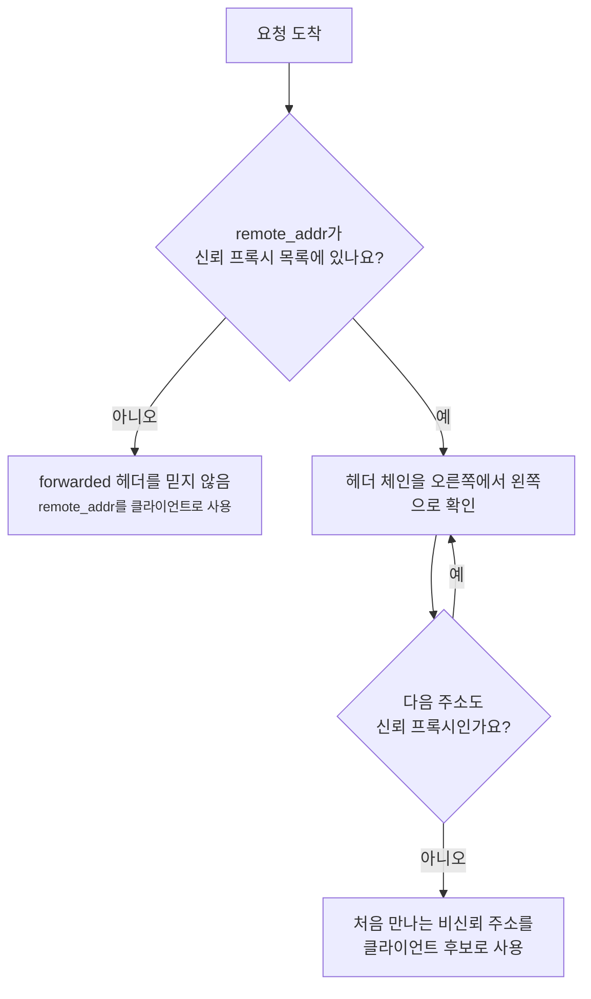
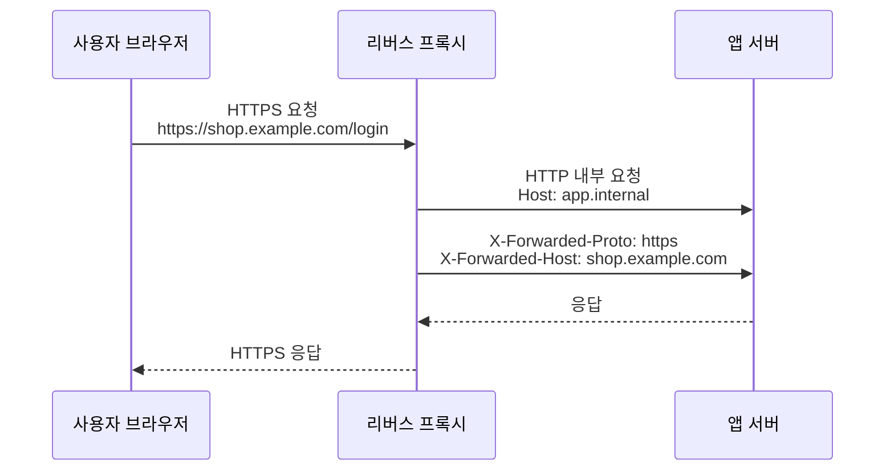

# X-Forwarded 헤더에서 진짜 클라이언트 IP는 어떻게 읽을까요?

> 로그에 찍힌 IP가 사용자 주소처럼 보이죠? **사실은 바로 앞 프록시 주소일 수도 있어요.**

[Proxy, Reverse Proxy, 그리고 Load Balancer](../basic/24-proxy-reverse-proxy-and-load-balancer.md){ data-preview }에서는 브라우저와 앱 서버 사이에 리버스 프록시나 로드 밸런서가 설 수 있다는 큰 그림을 봤어요. 그리고 [502, 503, 504는 어디서 만든 응답일까요?](./reading-502-503-504.md){ data-preview }에서는 앞단과 오리진 사이에서 응답의 목소리가 달라질 수 있다는 걸 봤죠.

이번에는 응답 코드가 아니라 **클라이언트 IP**를 읽어볼게요.

운영 로그에 이런 줄이 있다고 해볼게요.

```text
remote_addr=10.0.4.12
x-forwarded-for=203.0.113.25, 198.51.100.7
x-forwarded-proto=https
x-forwarded-host=shop.example.com
```

처음 보면 `203.0.113.25`가 사용자 같고, `10.0.4.12`는 내부 주소처럼 보여요. 맞을 수도 있어요. 하지만 그냥 맨 앞 값을 믿으면 안 돼요.

오늘의 질문은 이거예요.

> *"이 IP는 누가 적은 값이고, 어디까지 믿어도 될까요?"*

`Forwarded` 헤더는 [RFC 7239](https://www.rfc-editor.org/rfc/rfc7239.html)에서 표준화한 HTTP 확장 헤더예요. 이 RFC는 프록시가 끼면 원래 클라이언트 IP, 원래 Host, 원래 protocol 같은 정보가 사라지거나 바뀔 수 있고, 이를 HTTP 헤더로 전달할 수 있다고 설명해요. 동시에 `X-Forwarded-For`, `X-Forwarded-By`, `X-Forwarded-Proto` 같은 헤더는 흔히 쓰이는 **비표준 계열**이라고 짚어요.

!!! note "이 글의 범위"
    여기서는 특정 프레임워크 설정법보다, `X-Forwarded-For`, `X-Forwarded-Proto`, `X-Forwarded-Host`, 표준 `Forwarded` 헤더를 **어떤 순서로 읽고 어디까지 신뢰해야 하는지**에 집중해요. 제품마다 헤더를 붙이는 방식과 trust proxy 설정 이름은 달라요.

---

## 앱 서버가 처음 보는 주소는 "바로 앞 사람"이에요

택배를 생각해볼게요. 고객이 택배를 보냈는데, 중간 물류센터가 여러 번 갈아 실었어요. 마지막 창고 직원이 상자를 받으면, 상자를 손에 건넨 사람은 고객이 아니라 **바로 앞 물류센터 직원**이에요.

웹 서버도 비슷해요.



앱 서버 입장에서 TCP 연결을 직접 열고 들어온 상대는 `10.0.4.12`일 수 있어요. 그래서 앱의 `remote address`나 `remote_addr`에는 사용자가 아니라 로드 밸런서 주소가 찍힐 수 있죠.

| 물류 장면 | 웹 요청 장면 |
|---|---|
| 고객 | 실제 사용자 클라이언트 |
| 중간 물류센터 | CDN, 프록시, 로드 밸런서 |
| 마지막으로 상자를 건넨 직원 | 앱 서버가 보는 transport remote address |
| 운송장에 적힌 원래 보낸 사람 | `X-Forwarded-For` 또는 `Forwarded: for=` |
| 배송 방식 메모 | `X-Forwarded-Proto` 또는 `Forwarded: proto=` |
| 원래 목적지 이름 | `X-Forwarded-Host` 또는 `Forwarded: host=` |

핵심은 이거예요.

**앱이 직접 본 주소와, 헤더에 적힌 원래 주소는 성격이 달라요.**

직접 본 주소는 네트워크 연결에서 나온 값이고, forwarded 계열 헤더는 HTTP 요청 안에 적힌 값이에요. HTTP 헤더는 중간 프록시가 붙여줄 수도 있지만, 클라이언트가 마음대로 보내버릴 수도 있어요.

## X-Forwarded-For는 보통 왼쪽부터 경로를 남겨요

가장 자주 보는 건 `X-Forwarded-For`예요.

```http
X-Forwarded-For: 203.0.113.25, 198.51.100.7
```

많은 환경에서는 왼쪽부터 이렇게 읽어요.



즉, 앱 서버가 보는 `remote_addr`가 `10.0.4.12`이고, 헤더가 `203.0.113.25, 198.51.100.7`이라면 전체 후보 체인은 이렇게 볼 수 있어요.

```text
203.0.113.25 -> 198.51.100.7 -> 10.0.4.12 -> app
```

하지만 여기서 바로 "맨 왼쪽이 진짜 사용자"라고 외우면 위험해요.

왜냐하면 `X-Forwarded-For`는 표준 `Forwarded`보다 오래 널리 쓰인 관례에 가깝고, 무엇보다 **요청 헤더라서 위조될 수 있기 때문**이에요.

```http
GET /admin HTTP/1.1
Host: shop.example.com
X-Forwarded-For: 127.0.0.1
```

만약 인터넷에서 들어온 이 값을 앱이 그대로 믿고 "127.0.0.1이면 내부 관리자군요"라고 판단하면 큰 사고가 나요. 그래서 forwarded 헤더 읽기의 핵심은 파싱보다 **신뢰 경계**예요.

!!! warning "인터넷에서 온 X-Forwarded-For를 그대로 믿으면 안 돼요"
    사용자는 요청에 임의의 `X-Forwarded-For`를 넣을 수 있어요. 이 헤더를 신뢰하려면, 먼저 **내가 신뢰하는 프록시가 기존 값을 지우거나 정리한 뒤 새로 붙이는 구조인지** 확인해야 해요.

---

## 먼저 신뢰할 프록시를 정해야 해요

클라이언트 IP를 안전하게 읽으려면 이런 질문을 해야 해요.

> *"우리 앱 바로 앞의 `remote_addr`는 신뢰하는 프록시인가요?"*



이 흐름이 중요한 이유가 있어요. 공격자가 맨 왼쪽에 가짜 IP를 넣어도, 우리가 **오른쪽에서부터 신뢰하는 프록시를 벗겨내는 방식**으로 읽으면 위험을 줄일 수 있어요.

예를 들어 이런 값이 있다고 해볼게요.

```text
remote_addr=10.0.4.12
X-Forwarded-For: 10.1.2.3, 203.0.113.25, 198.51.100.7
```

그리고 우리 신뢰 목록이 이렇다고 해볼게요.

```text
trusted proxies:
- 10.0.0.0/8
- 198.51.100.7
```

그러면 읽는 감각은 이래요.

| 오른쪽부터 본 값 | 신뢰하나요? | 판단 |
|---|---:|---|
| `remote_addr=10.0.4.12` | 예 | 앱 바로 앞 프록시로 인정 |
| `198.51.100.7` | 예 | 신뢰 프록시로 인정 |
| `203.0.113.25` | 아니오 | 클라이언트 후보 |
| `10.1.2.3` | 확인하지 않음 | 앞쪽 값은 사용자가 위조했을 수 있음 |

그래서 이 예시에서는 맨 왼쪽 `10.1.2.3`이 아니라 `203.0.113.25`를 사용자 후보로 읽는 쪽이 더 안전해요.

!!! tip "오른쪽에서 왼쪽으로 벗겨요"
    `X-Forwarded-For`를 안전하게 읽을 때는 "맨 왼쪽이 진짜"보다 **오른쪽에서부터 내가 신뢰하는 프록시를 하나씩 벗긴다**고 생각하는 편이 좋아요.

## X-Forwarded-Proto와 Host는 URL 판단에 영향을 줘요

forwarded 계열 헤더는 IP만 다루지 않아요.

프록시가 TLS를 앞단에서 끝내면, 앱 서버와 프록시 사이는 내부 HTTP일 수 있어요.



앱이 자기 요청을 내부 HTTP로만 보면 이런 문제가 생길 수 있어요.

| 헤더 | 앱이 이 값을 쓰는 장면 | 잘못 읽으면 |
|---|---|---|
| `X-Forwarded-Proto: https` | redirect URL, secure cookie 판단 | `http://`로 리다이렉트하거나 쿠키 보안 판단이 틀어짐 |
| `X-Forwarded-Host: shop.example.com` | absolute URL 생성, tenant 선택 | 내부 host로 링크를 만들거나 엉뚱한 tenant 선택 |
| `X-Forwarded-Port: 443` | 외부 포트 판단 | `:8080` 같은 내부 포트가 노출됨 |
| `X-Forwarded-For` | 로그, rate limit, abuse 대응 | 프록시 주소만 보고 모두 같은 사용자로 봄 |

하지만 `Host`와 `Proto`도 마찬가지로 신뢰 문제가 있어요. 외부 사용자가 보낸 `X-Forwarded-Host`를 그대로 믿고 redirect URL을 만들면, open redirect나 잘못된 링크 생성으로 이어질 수 있어요.

그래서 일반 원칙은 이렇게 잡는 게 좋아요.

1. 앱 바로 앞 프록시가 신뢰되는지 확인해요.
2. 프록시가 외부에서 온 forwarded 계열 헤더를 정리하는지 확인해요.
3. 앱은 신뢰 프록시가 보장한 헤더만 사용해요.
4. 보안 판단에는 allowlist와 별도 정책을 같이 둬요.

## 표준 Forwarded 헤더는 한 줄에 묶어서 표현해요

`X-Forwarded-*`가 널리 쓰이지만, 표준화된 헤더는 `Forwarded`예요.

```http
Forwarded: for=203.0.113.25;proto=https;host=shop.example.com
```

프록시가 여러 개라면 쉼표로 이어질 수 있어요.

```http
Forwarded: for=203.0.113.25;proto=https;host=shop.example.com, for=198.51.100.7
```

RFC 7239는 `Forwarded`가 프록시 과정에서 사라지거나 바뀐 정보를 전달하기 위한 선택적 요청 헤더라고 설명해요. 주요 parameter는 아래처럼 읽을 수 있어요.

| `Forwarded` parameter | `X-Forwarded-*`와 비교하면 | 의미 |
|---|---|---|
| `for=` | `X-Forwarded-For` | 요청을 만든 클라이언트나 앞쪽 프록시 식별자 |
| `by=` | `X-Forwarded-By`에 가까움 | 프록시의 사용자 쪽 인터페이스 식별자 |
| `host=` | `X-Forwarded-Host` | 프록시가 받은 원래 Host |
| `proto=` | `X-Forwarded-Proto` | 프록시가 받은 요청 scheme, 보통 `http` 또는 `https` |

`Forwarded`의 장점은 `for`, `proto`, `host` 같은 값이 한 요소 안에 묶여 있어 **어떤 프록시가 어떤 값을 붙였는지**를 더 잘 맞춰볼 수 있다는 점이에요. 반대로 `X-Forwarded-For`, `X-Forwarded-Proto`, `X-Forwarded-Host`는 서로 다른 헤더라서 여러 프록시가 섞일 때 값의 짝을 맞추기 어려울 수 있어요.

다만 현실에서는 여전히 `X-Forwarded-*`를 더 많이 만날 수 있어요. 그래서 둘 중 하나만 "정답"으로 외우기보다, 내가 쓰는 CDN, 로드 밸런서, 프레임워크가 무엇을 붙이고 무엇을 읽는지 확인해야 해요.

## 로그에서는 네 가지를 같이 남겨요

클라이언트 IP 문제를 나중에 디버깅하려면 한 값만 남기면 부족해요.

| 로그 필드 | 왜 남기나요? |
|---|---|
| `remote_addr` | 앱과 직접 연결된 바로 앞 주소를 알기 위해 |
| raw `X-Forwarded-For` | 프록시 체인이 어떻게 전달됐는지 보기 위해 |
| 계산된 `client_ip` | 앱이 최종적으로 누구를 클라이언트로 판단했는지 보기 위해 |
| `X-Forwarded-Proto` / `Host` | URL, redirect, secure cookie 문제를 확인하기 위해 |
| request id | 프록시 로그와 앱 로그를 같은 요청으로 묶기 위해 |

예를 들면 이런 식이에요.

```text
remote_addr=10.0.4.12
xff="203.0.113.25, 198.51.100.7"
client_ip=203.0.113.25
xfp=https
xfh=shop.example.com
request_id=req_8321b
```

이렇게 남겨두면 나중에 rate limit이 이상하거나, 특정 사용자 차단이 잘못 걸리거나, HTTPS redirect가 꼬였을 때 훨씬 빨리 원인을 좁힐 수 있어요.

## 어디서 자주 문제가 생길까요?

### 모든 사용자가 같은 IP로 보일 때

앱이 `X-Forwarded-For`를 전혀 읽지 않고 `remote_addr`만 보면 모든 사용자가 로드 밸런서 IP로 보일 수 있어요. 그러면 rate limit, abuse 탐지, 지역 통계가 전부 이상해져요.

### 아무나 내부 IP인 척할 수 있을 때

반대로 앱이 `X-Forwarded-For`를 무조건 믿으면 사용자가 `127.0.0.1`이나 사내 IP를 헤더에 넣어서 내부 사용자처럼 보이려 할 수 있어요. IP 기반 접근 제어가 있다면 특히 위험해요.

### HTTPS인데 앱은 HTTP라고 착각할 때

TLS가 프록시에서 끝나고 앱에는 HTTP로 들어오면, 앱은 외부 요청이 HTTPS였는지 모를 수 있어요. 이때 `X-Forwarded-Proto`를 안전하게 읽지 못하면 `http://` redirect가 생기거나 secure cookie 설정이 흔들릴 수 있어요.

### Host 기반 라우팅이 꼬일 때

멀티테넌트 서비스나 여러 도메인을 한 앱에서 받는 구조에서는 원래 Host가 중요해요. 프록시가 내부 Host로 바꿔서 보내는데 앱이 `X-Forwarded-Host`를 안전하게 처리하지 못하면 tenant 선택, canonical URL, OAuth callback URL이 꼬일 수 있어요.

## 잘못 읽기 쉬운 함정

### `X-Forwarded-For`의 맨 왼쪽을 항상 진짜 사용자로 보기

맨 왼쪽 값은 진짜일 수도 있지만, 사용자가 직접 넣은 가짜 값일 수도 있어요. 신뢰 프록시 목록을 기준으로 오른쪽에서부터 확인해야 해요.

### `remote_addr`를 항상 진짜 사용자로 보기

프록시 뒤의 앱에서 `remote_addr`는 보통 바로 앞 프록시 주소예요. 이 값만 보면 모든 사용자가 같은 주소처럼 보일 수 있어요.

### 프록시가 헤더를 정리해줄 거라고 가정하기

앞단이 외부에서 들어온 `X-Forwarded-*`를 지우고 새로 붙이는지, 기존 값을 append하는지, 아예 건드리지 않는지는 설정에 따라 달라요. 확인 없이 앱에서 믿으면 안 돼요.

### `X-Forwarded-Proto`만 보면 보안 판단이 끝난다고 보기

`proto=https`도 헤더 값이에요. 신뢰 프록시가 보장한 값인지 확인해야 하고, 중요한 보안 판단은 별도 allowlist, HSTS, secure cookie 정책과 함께 봐야 해요.

### 표준 `Forwarded`만 쓰면 모든 문제가 사라진다고 보기

`Forwarded`는 더 구조화된 표준 헤더지만, 그래도 요청 헤더예요. 신뢰할 수 없는 경로에서 들어온 값은 여전히 믿으면 안 돼요.

## 자, 정리해볼까요?

!!! abstract "오늘 우리가 배운 것"
    - 프록시 뒤의 앱 서버가 직접 보는 `remote_addr`는 실제 사용자 IP가 아니라 **바로 앞 프록시 주소**일 수 있어요.
    - `X-Forwarded-For`는 원래 클라이언트와 중간 프록시 체인을 남기는 데 널리 쓰이지만, 비표준 계열이고 위조될 수 있어요.
    - 안전하게 읽으려면 `remote_addr`가 신뢰 프록시인지 확인하고, 오른쪽에서 왼쪽으로 신뢰 프록시를 벗겨가며 클라이언트 후보를 찾아야 해요.
    - `X-Forwarded-Proto`, `X-Forwarded-Host`는 redirect, secure cookie, absolute URL, tenant 선택에 영향을 줄 수 있어요.
    - 표준 `Forwarded` 헤더는 `for`, `by`, `host`, `proto`를 한 줄에 묶어 표현하지만, 이것도 신뢰 경계 없이 믿으면 안 돼요.
    - 로그에는 raw 헤더와 계산된 `client_ip`를 함께 남겨야 나중에 오해를 줄일 수 있어요.

## 이어서 보면 좋은 글

- [Proxy, Reverse Proxy, 그리고 Load Balancer](../basic/24-proxy-reverse-proxy-and-load-balancer.md){ data-preview } - 왜 앱 앞에 중간자가 서는지 큰 그림을 다시 볼 수 있어요.
- [End-to-End Request Debugging](../basic/26-end-to-end-request-debugging.md){ data-preview } - 요청 하나가 어떤 체크포인트를 지나 앱까지 오는지 이어서 볼 수 있어요.
- [502, 503, 504는 어디서 만든 응답일까요?](./reading-502-503-504.md){ data-preview } - 응답 코드도 어느 계층이 만들었는지 같이 읽어볼 수 있어요.
- [HTTP/1.1 메시지는 왜 빈 줄 하나가 중요할까요?](./http1-message-grammar.md){ data-preview } - forwarded 값이 결국 HTTP 헤더 안에 들어간다는 구조를 더 자세히 볼 수 있어요.
