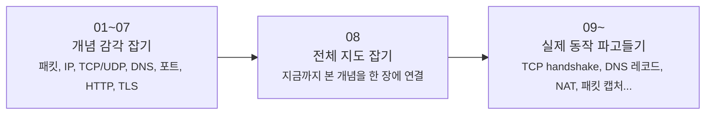

# 네트워크 시리즈는 어디부터 읽으면 좋을까요?

> 네트워크 글은 깊어질수록 따로 놀 것 같죠? **사실은 앞에서 잡은 감을, 뒤에서 실제 구조로 다시 여는 흐름이에요.**

패킷, IP, TCP, DNS, NAT...
이름은 익숙한데 막상 읽으려면 **지금 나는 감부터 잡아야 하는지**, 아니면 **실제 구조를 더 깊게 봐도 되는지** 가 제일 헷갈리죠?

그래서 이 페이지는 글마다 설명을 길게 붙이는 대신,
**입문 흐름**과 **메커니즘 흐름**을 한눈에 나눠서 보여주려고 만들었어요.

근데 한 가지 먼저 짚고 갈게요.
앞으로 네트워크 카테고리에는 **보충 글이나 실전 글**이 더 생길 수도 있어요.
그래도 이 페이지는 그런 글까지 전부 한꺼번에 섞어서 보여주기보다는,
**처음 읽는 분이 따라가기 좋은 공식 메인 시리즈 흐름**을 기준으로 안내할게요.

---

## 먼저, 어떤 방식으로 읽고 싶으세요?

사실 모든 분이 같은 지점에서 들어오는 건 아니잖아요.
지금 궁금한 방향에 따라 이렇게 시작하면 훨씬 덜 헤매요.

- **아직 네트워크가 낯설고, 감부터 잡고 싶어요**
→ [01. 패킷이 뭐길래?](01-what-is-packet.md){ data-preview } 부터 차근차근 읽는 게 가장 편해요.
  이쪽은 **01~07** 구간이에요. 패킷, IP, TCP/UDP, DNS, 포트, HTTP, TLS를 먼저 친숙하게 연결해봐요.
- **이미 큰 개념은 조금 아는데, 실제 구조와 동작이 더 궁금해요**
→ [08. OSI 7계층과 TCP/IP 모델](08-osi-and-tcp-ip-layers.md){ data-preview } 부터 들어오면 좋아요.
그다음엔 [OSI 7계층과 TCP/IP 모델](08-osi-and-tcp-ip-layers.md){ data-preview }이 전체 지도를 한 번 정리해주고, 이어지는 글들에서 TCP 3-way handshake, DNS 레코드, NAT, 패킷 캡처 같은 실제 메커니즘으로 들어가거든요.

근데요, **처음 읽는 분에게는 여전히 첫 글부터 시작하는 길이 제일 자연스러워요.**
뒤쪽 글은 앞에서 만든 직관을 바탕으로, 실제 필드와 상태, 신호로 번역하는 방식이기 때문이에요.

!!! tip "이렇게 읽으면 제일 덜 헷갈려요"
- 처음이라면 [패킷이 뭐길래?](01-what-is-packet.md){ data-preview }부터 읽는 게 가장 편해요.
- 이미 개념 감은 있다면 [OSI 7계층과 TCP/IP 모델](08-osi-and-tcp-ip-layers.md){ data-preview }부터 들어와도 괜찮아요.
  - 뒤쪽 글부터 읽다가 막히면, 앞쪽 글로 돌아가 감을 보충하면 돼요.

---

## 왜 읽는 길이 여기서 갈라질까요?

이 시리즈는 그냥 번호만 늘어나는 구조가 아니에요.
앞에서는 **직관**을 만들고, 가운데에서 **전체 지도**를 잡고, 뒤에서는 **실제 메커니즘**을 열어봐요.

여기서 중요한 건 **[OSI 7계층과 TCP/IP 모델](08-osi-and-tcp-ip-layers.md){ data-preview }이 다리 역할**을 한다는 점이에요.

- **[패킷이 뭐길래?](01-what-is-packet.md){ data-preview }부터 [TLS, SSL, 인증서](07-tls-ssl-and-certificates.md){ data-preview }까지**: "이게 뭐지? 왜 필요하지?" 를 먼저 쉽게 익혀요.
- **[OSI 7계층과 TCP/IP 모델](08-osi-and-tcp-ip-layers.md){ data-preview }**: 지금까지 본 개념을 네트워크 전체 지도 위에 올려서, 어디쯤 있는 기술인지 연결해봐요.
- **[TCP 3-way handshake는 왜 세 번이나 주고받을까요?](09-tcp-3-way-handshake.md){ data-preview } 이후**: 이제는 "실제로는 어떤 신호, 숫자, 상태로 보일까?" 를 보는 구간이에요.

그러니까 뒤쪽 글은 앞쪽 글의 쉬운 설명을 다시 반복하는 게 아니라,
**앞에서 감으로 잡은 내용을 실제 구조로 번역하는 단계**라고 보면 딱 맞아요.

예를 들어,

- [TCP vs UDP - 꼼꼼한 친구와 빠른 친구는 뭐가 다를까요?](03-tcp-vs-udp.md#tcp-intro){ data-preview }에서는 TCP를 "먼저 인사하는 방식"으로 감 잡고,
- [TCP 3-way handshake는 왜 세 번이나 주고받을까요?](09-tcp-3-way-handshake.md#handshake-signals){ data-preview }에서는 그 인사 안에 있는 `SYN`, `ACK`, sequence number를 실제로 열어봐요.

같은 식으로,

- [패킷이 뭐길래?](01-what-is-packet.md){ data-preview }에서는 패킷을 "작은 상자"처럼 이해하고,
- 뒤쪽 글에서는 그 안의 헤더, 주소, 포트, 캡처 흔적을 실제로 읽게 돼요.

---

## 지금 읽을 수 있는 글은 이렇게 보면 돼요

여기만 보면 현재 공개된 흐름을 한 번에 파악할 수 있어요.
이 페이지에서는 아래 목록만 **지금 읽을 수 있는 공식 메인 시리즈 목록**으로 두고 갈게요.

즉, 나중에 네트워크 카테고리에 다른 보충 글이 더 생기더라도,
이 섹션은 계속 **"차례대로 읽는 메인 흐름"** 을 보여주는 기준이라고 보면 돼요.

### 01~07 · 감부터 차근차근 잡는 구간

- [01. 패킷이 뭐길래?](01-what-is-packet.md){ data-preview } — 인터넷 데이터는 왜 잘게 쪼개서 보낼까요?
- [02. IP 주소와 라우팅](02-ip-and-routing.md){ data-preview } — 그 작은 패킷은 어떻게 목적지를 찾아갈까요?
- [03. TCP vs UDP](03-tcp-vs-udp.md){ data-preview } — 도착 확인은 어떻게 하고, 왜 방식이 두 가지일까요?
- [04. DNS](04-dns.md){ data-preview } — `google.com` 같은 이름은 어떻게 주소로 바뀔까요?
- [05. 포트와 소켓](05-ports-and-sockets.md){ data-preview } — 같은 컴퓨터 안에서 어느 앱으로 가야 하는지는 어떻게 구분할까요?
- [06. HTTP와 HTTPS](06-http-and-https.md){ data-preview } — 브라우저와 서버는 어떤 규칙으로 대화하고, 왜 HTTPS가 필요할까요?
- [07. TLS, SSL, 인증서](07-tls-ssl-and-certificates.md){ data-preview } — 브라우저는 어떻게 진짜 서버를 확인하고 보호된 통로를 준비할까요?

### 08 · 감과 구조를 연결하는 다리

- [08. OSI 7계층과 TCP/IP 모델](08-osi-and-tcp-ip-layers.md){ data-preview } — 지금까지 본 개념들은 네트워크 전체 지도에서 어디에 놓일까요?

### 09 이후 · 실제 신호와 구조를 읽는 구간

- [09. TCP 3-way handshake](09-tcp-3-way-handshake.md){ data-preview } — TCP는 왜 연결 전에 세 번이나 주고받을까요?
- [10. DNS 레코드](10-dns-records.md){ data-preview } — A, AAAA, CNAME 같은 레코드는 왜 여러 종류로 나뉠까요?
- [11. 공인 IP, 사설 IP, 그리고 NAT](11-public-private-ip-and-nat.md){ data-preview } — 집 안 주소와 바깥 주소는 왜 다르고, 공유기는 그 사이에서 무슨 일을 할까요?
- [12. 패킷 캡처](12-packet-capture.md){ data-preview } — 같은 요청도 캡처 위치에 따라 왜 다르게 보이고, TCP와 NAT 흔적은 어디서 읽을 수 있을까요?
- [13. 공유기와 홈 네트워크](13-router-and-home-network.md){ data-preview } — 우리 집 안 장비들은 실제로 어떤 구조로 연결되고, 공유기는 그 안에서 어떤 역할을 할까요?
- [14. 포트 포워딩과 들어오는 연결](14-port-forwarding-and-incoming-connections.md){ data-preview } — 평소엔 닫혀 있는 집 안 문을, 어떤 경우에 왜 특정 장치 쪽으로 열어줘야 할까요?
- [15. 방화벽과 상태 기반 필터링](15-firewall-and-stateful-filtering.md){ data-preview } — 들어오는 패킷이 친구인지 도둑인지, 공유기는 어떻게 똑똑하게 판단할까요?
- [16. DHCP](16-dhcp.md){ data-preview } — 우리 집 기기들은 자기 주소를 어떻게 자동으로 받을까요?
- [17. ARP와 로컬 전달](17-arp-and-local-delivery.md){ data-preview } — 주소는 받았는데, 같은 집 안의 진짜 목적지는 어떻게 찾을까요?
- [18. 기본 게이트웨이와 첫 번째 도약](18-default-gateway-and-first-hop.md){ data-preview } — 게이트웨이에게 맡긴 패킷은 집을 나서는 순간 어떤 판단을 거칠까요?
- [19. ICMP, Ping, 그리고 Traceroute](19-icmp-ping-and-traceroute.md){ data-preview } — 패킷이 어디까지 갔는지, 어디서 막혔는지 네트워크는 어떻게 힌트를 줄까요?
- [20. MTU, Fragmentation, 그리고 Path MTU](20-mtu-fragmentation-and-path-mtu.md){ data-preview } — 길은 맞는데도 왜 어떤 패킷은 너무 커서 중간에서 문제를 만들까요?

여기서부터는 단순히 "이름을 안다" 에서 멈추지 않고,
이후의 실제 신호와 구조를 읽는 구간까지 이어져요.

---

## 그럼 다음엔 어디로 이어질까요?

지금 공개된 흐름은 이제 **MTU, Fragmentation, 그리고 Path MTU** 까지 왔어요.
이제 그다음부터는, 길도 맞고 크기도 맞춘 뒤에 **중간에 사라진 패킷을 어떻게 다시 책임질지** 까지 열어볼게요.

- **21. TCP 재전송과 신뢰성** — 중간에 패킷 하나가 사라지면, 네트워크는 어떻게 그 사실을 알고 다시 보내줄까요?

즉, 이제부터는 **개념을 이해했다** 에서 끝나는 게 아니라,
**실제로 보이는 구조를 읽고 해석하는 단계**로 한 걸음 더 들어가게 돼요.

그리고 그 사이에, 필요하면 특정 도구나 사례를 다루는 **독립 글**이 먼저 추가될 수도 있어요.
그런 글이 생기더라도 메인 시리즈 번호를 대신하는 건 아니고,
이 페이지에서는 계속 **공식 번호형 흐름**을 중심으로 안내할 거예요.

---

## 자, 이 페이지는 이렇게 읽으면 돼요

!!! abstract "이 페이지를 쓰는 가장 쉬운 방법"
- 처음이라면 [패킷이 뭐길래?](01-what-is-packet.md){ data-preview }부터 시작하면 가장 자연스러워요.
- 이미 큰 그림은 있는데 더 깊은 구조가 궁금하다면, **[OSI 7계층과 TCP/IP 모델](08-osi-and-tcp-ip-layers.md){ data-preview }을 다리로 삼아** 뒤쪽 메커니즘 글들로 들어오면 돼요.
    - 이 시리즈는 **01~07 직관 → OSI 7계층과 TCP/IP 모델 → 뒤쪽 메커니즘 글들** 흐름으로 깊어져요.
    - 뒤쪽 글은 앞쪽 글의 반복이 아니라, **앞에서 만든 감을 실제 신호와 구조로 번역하는 단계**예요.
    - 공개된 글 목록은 이 페이지의 **"지금 읽을 수 있는 글"** 섹션만 보면 충분해요.
    - 앞으로 네트워크 카테고리에 보충 글이 더 생기더라도, 이 페이지는 계속 **메인 시리즈 읽기 가이드** 역할을 맡아요.

그럼, 어디부터 읽어볼까요?

<a class="md-button md-button--primary" href="{{ first_post('Network').href }}">첫 글부터 읽으러 가기</a>
<a class="md-button" href="{{ latest_post('Network').href }}">가장 최신 글 읽으러 가기</a>
