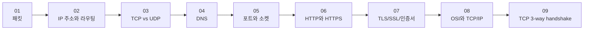

# 네트워크 시리즈는 어디부터 읽으면 좋을까요?

> 네트워크 글은 하나씩 따로 읽어도 되지만, **순서대로 읽으면 갑자기 퍼즐이 맞아들어가요.**

패킷, IP, TCP, DNS… 이름은 다 들어봤는데, 막상 읽으려면 어디부터 시작해야 할지 조금 막막하죠?

그래서 이 페이지를 만들었어요. **이 시리즈가 어떤 흐름으로 이어지는지**, **지금 어디까지 나왔는지**, 그리고 **다음엔 뭘 읽게 될지** 한눈에 볼 수 있게요.

---

## 이 시리즈는 이런 순서로 읽으면 좋아요

이 네트워크 시리즈는 일부러 **"작은 조각 → 길 찾기 → 전달 방식 → 이름 찾기 → 앱 찾기 → 대화 규칙 → 보호된 대화 → 전체 지도 → 연결 시작"** 순서로 이어지고 있어요.

처음부터 어려운 용어를 쌓기보다,
**인터넷이 데이터를 어떻게 움직이는지**를 한 칸씩 따라가게 만드는 흐름이라고 보면 돼요.

이 순서가 왜 좋냐면요.

1. 먼저 **인터넷 데이터의 가장 작은 단위**를 보고
2. 그 조각이 **어떻게 길을 찾는지** 이해하고
3. 그다음 **어떤 성격으로 전달되는지** 보고
4. 그다음 **이름을 주소로 바꾸는 과정**을 보고
5. 그다음 **도착한 뒤 어느 앱으로 들어가는지**를 보고
6. 그다음 **브라우저와 서버가 어떤 규칙으로 대화하는지**를 보고
7. 그다음 **그 대화가 어떻게 보호되는지**를 보고
8. 그다음 **이 모든 개념이 어떤 계층에 속하는지 전체 지도**를 그리고
9. 마지막으로 **TCP 연결이 실제로 어떻게 시작되는지** 까지 보거든요.

!!! tip "처음 읽는다면 이렇게 가보세요"
    네트워크 용어가 아직 익숙하지 않다면 **무조건 01부터** 읽는 걸 추천해요. 뒤 글일수록 앞 글의 감각을 조금씩 밟고 올라가거든요.

---

## 한 편씩 보면 이런 흐름이에요

| 순서 | 글 | 이 글에서 답하는 질문 | 상태 |
|------|----|------------------------|------|
| 01 | [패킷이 뭐길래?](01-what-is-packet.md) | 인터넷 데이터는 왜 잘게 쪼개서 보낼까요? | 읽기 가능 |
| 02 | [IP 주소와 라우팅](02-ip-and-routing.md) | 그 작은 패킷은 어떻게 목적지를 찾아갈까요? | 읽기 가능 |
| 03 | [TCP vs UDP](03-tcp-vs-udp.md) | 도착 확인은 어떻게 하고, 왜 방식이 두 가지일까요? | 읽기 가능 |
| 04 | [DNS](04-dns.md) | `google.com` 같은 이름은 어떻게 IP 주소로 바뀔까요? | 읽기 가능 |
| 05 | [포트와 소켓](05-ports-and-sockets.md) | 같은 컴퓨터 안에서 어느 앱으로 가야 하는지는 어떻게 구분할까요? | 읽기 가능 |
| 06 | [HTTP와 HTTPS](06-http-and-https.md) | 브라우저와 서버는 어떤 규칙으로 대화하고, 왜 HTTPS가 필요할까요? | 읽기 가능 |
| 07 | [TLS, SSL, 인증서](07-tls-ssl-and-certificates.md) | 브라우저는 어떻게 진짜 서버를 확인하고, 보호된 통로를 준비할까요? | 읽기 가능 |
| 08 | [OSI 7계층과 TCP/IP 모델](08-osi-and-tcp-ip-layers.md) | 네트워크 전체를 한눈에 보여주는 지도는 어떻게 생겼을까요? | 읽기 가능 |
| 09 | [TCP 3-way handshake](09-tcp-3-way-handshake.md) | TCP는 왜 연결 전에 세 번이나 주고받으며 준비할까요? | 읽기 가능 |

표로 보면 단순한데, 실제로는 질문이 하나씩 다음 질문을 부르는 구조예요.

"패킷이 뭐지?" 에서 시작했는데,
읽다 보면 자연스럽게 **"그럼 어디로 가?"**, **"잘 도착한 건 어떻게 알아?"**, **"이름은 또 누가 숫자로 바꿔줘?"**, **"도착한 뒤엔 누구한테 가?"**, **"그다음엔 무슨 규칙으로 말해?"**, **"그 말은 어떻게 안전하게 보호돼?"**, **"이 모든 건 어떻게 쌓여있어?"**, **"그 연결은 정확히 어떻게 시작돼?"** 같은 궁금증으로 이어지죠.

---

## 지금 어디까지 나왔을까요?

- :material-check-circle-outline:{ .lg .middle } **이미 나온 글**

    ---

    지금은 **9편**이 공개되어 있어요.
    패킷부터 시작해서 OSI/TCP-IP 지도와 TCP 핸드셰이크까지,
    네트워크가 어떻게 움직이고 연결되는지 보는 큰 줄기가 이어졌어요.

- :material-map-marker-path:{ .lg .middle } **지금쯤 머릿속에 생기는 감각**

    ---

    이쯤 읽고 나면 개별 기술들이 따로 노는 게 아니라,
    **지도 위의 자기 자리에서 층층이 쌓여서 움직이는구나** 하는 전체적인 그림이 그려지기 시작해요.

- :material-timer-sand:{ .lg .middle } **다음에 궁금해질 주제**

    ---

    이제 TCP가 연결을 시작하는 데까지 봤으니,
    다음엔 이름을 주소로 바꿀 때 실제로 어떤 **DNS 레코드**가 쓰이는지,
    그리고 그다음엔 집 안과 바깥을 잇는 **NAT** 가 어떻게 움직이는지 궁금해져요.

---

## 어떤 글부터 골라 읽어도 될까요?

물론이에요. 꼭 순서대로만 읽어야 하는 건 아니에요.

예를 들어:

- **"패킷이 뭔지부터 감이 안 와요"** → 01부터
- **"DNS가 제일 궁금해요"** → 04 먼저 읽고, 막히면 01~03으로 돌아오기
- **"포트랑 소켓이 늘 헷갈려요"** → 05 먼저 읽고, 필요하면 02~04로 거슬러 올라오기
- **"OSI 7계층이 대체 뭐예요?"** → 08 먼저 읽고 큰 그림 보기
- **"TCP가 왜 세 번이나 주고받는지 궁금해요"** → 09 먼저 읽기
- **"TLS나 인증서가 왜 필요한지 헷갈려요"** → 07 먼저 읽기
- **"TCP랑 UDP 차이만 빨리 알고 싶어요"** → 03 먼저 읽기

근데요, **가장 덜 헷갈리는 길은 여전히 01 → 02 → 03 → 04 → 05 → 06 → 07 → 08 → 09** 예요.

> 처음엔 돌아가는 길 같아 보여도, 사실은 그게 제일 덜 헤매는 길이에요.

---

## 다음엔 뭐가 더 이어질까요?

이제 TCP 연결이 어떻게 시작되는지까지 봤으니, 조금 더 깊은 기술적 원리들을 계속 따라가보려 해요.

다음엔 **DNS의 `A`, `AAAA`, `CNAME` 같은 레코드**를 더 또렷하게 정리하고,
그 후에 **공인 IP, 사설 IP, NAT**, 그리고 **패킷 분석** 같은 실전적인 주제들로 뻗어 나갈 예정이에요.

이 흐름까지 이어지면,
인터넷이 단순히 "되는 것"을 넘어 **"어떻게, 왜 그렇게 작동하는지"** 를 깊이 있게 이해하는 진짜 실력을 갖추게 될 거예요.

---

## 자, 어떻게 읽으면 좋을지 정리해볼까요?

!!! abstract "이 페이지는 이렇게 쓰면 돼요"
    - 네트워크 시리즈를 **어디부터 읽을지 헷갈릴 때** 이 페이지를 보면 돼요.
    - 가장 추천하는 순서는 **01부터 09까지** 차례대로 읽는 거예요.
    - 지금은 **9편 공개**, TCP 3-way handshake까지 이어져 있어요.
    - 특정 주제가 급하면 골라 읽어도 되지만, 처음이라면 **01부터** 가는 게 제일 편해요.

그럼, 어디부터 읽어볼까요?

<a class="md-button md-button--primary" href="{{ first_post('Network').href }}">첫 글부터 읽으러 가기</a>
<a class="md-button" href="{{ latest_post('Network').href }}">가장 최신 글 읽으러 가기</a>
