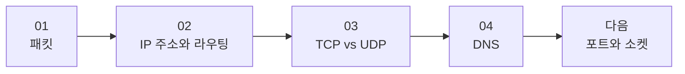

# 네트워크 시리즈는 어디부터 읽으면 좋을까요?

> 네트워크 글은 하나씩 따로 읽어도 되지만, **순서대로 읽으면 갑자기 퍼즐이 맞아들어가요.**

패킷, IP, TCP, DNS… 이름은 다 들어봤는데, 막상 읽으려면 어디부터 시작해야 할지 조금 막막하죠?

그래서 이 페이지를 만들었어요. **이 시리즈가 어떤 흐름으로 이어지는지**, **지금 어디까지 나왔는지**, 그리고 **다음엔 뭘 읽게 될지** 한눈에 볼 수 있게요.

---

## 이 시리즈는 이런 순서로 읽으면 좋아요

이 네트워크 시리즈는 일부러 **"작은 조각 → 길 찾기 → 전달 방식 → 이름 찾기"** 순서로 이어지고 있어요.

처음부터 어려운 용어를 쌓기보다,
**인터넷이 데이터를 어떻게 움직이는지**를 한 칸씩 따라가게 만드는 흐름이라고 보면 돼요.

이 순서가 왜 좋냐면요.

1. 먼저 **인터넷 데이터의 가장 작은 단위**를 보고
2. 그 조각이 **어떻게 길을 찾는지** 이해하고
3. 그다음 **어떤 성격으로 전달되는지** 보고
4. 마지막으로 **이름을 주소로 바꾸는 과정**까지 이어지거든요.

!!! tip "처음 읽는다면 이렇게 가보세요"
    네트워크 용어가 아직 익숙하지 않다면 **무조건 01부터** 읽는 걸 추천해요. 뒤 글일수록 앞 글의 감각을 살짝 깔고 가거든요.

---

## 한 편씩 보면 이런 흐름이에요

| 순서 | 글 | 이 글에서 답하는 질문 | 상태 |
|------|----|------------------------|------|
| 01 | [패킷이 뭐길래?](01-what-is-packet.md) | 인터넷 데이터는 왜 잘게 쪼개서 보낼까요? | 읽기 가능 |
| 02 | [IP 주소와 라우팅](02-ip-and-routing.md) | 그 작은 패킷은 어떻게 목적지를 찾아갈까요? | 읽기 가능 |
| 03 | [TCP vs UDP](03-tcp-vs-udp.md) | 도착 확인은 어떻게 하고, 왜 방식이 두 가지일까요? | 읽기 가능 |
| 04 | [DNS](04-dns.md) | `google.com` 같은 이름은 어떻게 IP 주소로 바뀔까요? | 읽기 가능 |
| 다음 | 포트와 소켓 | 같은 컴퓨터 안에서 어느 앱으로 가야 하는지는 어떻게 구분할까요? | 준비 중 |

표로 보면 단순한데, 실제로는 질문이 하나씩 다음 질문을 부르는 구조예요.

"패킷이 뭐지?" 에서 시작했는데,
읽다 보면 자연스럽게 **"그럼 어디로 가?"**, **"잘 도착한 건 어떻게 알아?"**, **"이름은 또 누가 숫자로 바꿔줘?"** 같은 궁금증으로 이어지죠.

---

## 지금 어디까지 나왔을까요?

- :material-check-circle-outline:{ .lg .middle } **이미 나온 글**

    ---

    지금은 **4편**이 공개되어 있어요.
    패킷 → IP/라우팅 → TCP/UDP → DNS까지,
    인터넷이 움직이는 큰 줄기를 따라갈 수 있어요.

- :material-map-marker-path:{ .lg .middle } **지금쯤 머릿속에 생기는 감각**

    ---

    이쯤 읽고 나면 "인터넷은 그냥 연결되는 거"가 아니라,
    **작은 조각이 길을 찾고, 확인하고, 이름을 해석하면서 움직이는구나** 하는 감각이 생겨요.

- :material-timer-sand:{ .lg .middle } **다음에 나올 글**

    ---

    다음 주제는 **포트와 소켓**이에요.
    같은 집에 택배가 도착한 뒤,
    그걸 어느 방으로 보내야 하는지에 대한 이야기라고 생각하면 돼요.

---

## 어떤 글부터 골라 읽어도 될까요?

물론이에요. 꼭 순서대로만 읽어야 하는 건 아니에요.

예를 들어:

- **"패킷이 뭔지부터 감이 안 와요"** → 01부터
- **"DNS가 제일 궁금해요"** → 04 먼저 읽고, 막히면 01~03으로 돌아오기
- **"TCP랑 UDP 차이만 빨리 알고 싶어요"** → 03 먼저 읽기

근데요, **가장 덜 헷갈리는 길은 여전히 01 → 02 → 03 → 04** 예요.

> 처음엔 돌아가는 길 같아 보여도, 사실은 그게 제일 덜 헤매는 길이에요.

---

## 다음엔 뭐가 나올까요?

DNS까지 읽고 나면 이제 **"어느 컴퓨터로 갈지"** 는 알게 돼요.

근데 한 컴퓨터 안에는 브라우저도 있고, 게임도 있고, 메신저도 있잖아요?
그럼 도착한 데이터는 **정확히 어느 프로그램이 받아야 하는지**도 정해야겠죠.

그래서 다음 글은 **"포트와 소켓"** 으로 이어질 예정이에요.

이 흐름까지 이어지면,
인터넷에서 데이터가 **어떤 조각으로 나뉘고 → 어디로 가고 → 어떤 방식으로 전달되고 → 누구한테 전달돼야 하는지** 꽤 큰 그림으로 보이기 시작할 거예요.

---

## 자, 어떻게 읽으면 좋을지 정리해볼까요?

!!! abstract "이 페이지는 이렇게 쓰면 돼요"
    - 네트워크 시리즈를 **어디부터 읽을지 헷갈릴 때** 이 페이지를 보면 돼요.
    - 가장 추천하는 순서는 **01 → 02 → 03 → 04** 예요.
    - 지금은 **4편 공개**, 다음 글은 **포트와 소켓** 예정이에요.
    - 특정 주제가 급하면 골라 읽어도 되지만, 처음이라면 **01부터** 가는 게 제일 편해요.

그럼, 어디부터 읽어볼까요?

[첫 글부터 읽으러 가기 :material-arrow-right:]({{ first_post("Network").url }}){ .md-button .md-button--primary }
[가장 최신 글 읽으러 가기 :material-newspaper:]({{ latest_post("Network").url }}){ .md-button }
