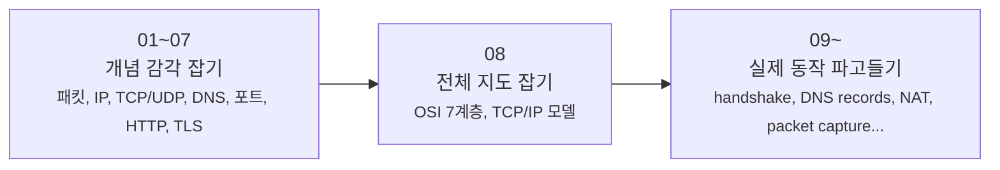

# 네트워크 시리즈는 어디부터 읽으면 좋을까요?

> 네트워크 글은 많아질수록 더 복잡해질 것 같죠? **사실은 흐름만 잡으면 오히려 덜 헷갈려요.**

패킷, IP, TCP, DNS, NAT...
이름은 익숙한데 막상 읽으려면 **지금 어디서부터 들어가야 하는지** 가 제일 어렵죠?

그래서 이 페이지는 글마다 설명을 길게 덧붙이는 대신,
**이 시리즈가 어떤 단계로 깊어지는지**, **내가 지금 어디쯤 읽으면 좋은지**, **이미 나온 글은 어떤 질문에 답하는지** 를 한 번에 보게 만들었어요.

---

## 먼저, 어디부터 읽으면 좋을까요?

사실 모든 분이 같은 출발점에서 읽는 건 아니잖아요.
지금 궁금한 지점에 따라 이렇게 들어가면 돼요.

- **네트워크가 처음이라 감부터 잡고 싶어요** → [01. 패킷이 뭐길래?](01-what-is-packet.md){ data-preview }
- **큰 그림이 먼저 필요해요** → [08. OSI 7계층과 TCP/IP 모델](08-osi-and-tcp-ip-layers.md){ data-preview }
- **TCP가 실제로 어떻게 연결되는지가 궁금해요** → [09. TCP 3-way handshake](09-tcp-3-way-handshake.md){ data-preview }
- **주소, 이름, 길 찾기 흐름이 헷갈려요** → [02. IP 주소와 라우팅](02-ip-and-routing.md){ data-preview } → [04. DNS](04-dns.md){ data-preview } → [10. DNS 레코드](10-dns-records.md){ data-preview }
- **집 안 IP와 바깥 IP가 왜 다른지 궁금해요** → [11. 공인 IP, 사설 IP, 그리고 NAT](11-public-private-ip-and-nat.md){ data-preview }
- **보안 쪽 흐름부터 보고 싶어요** → [06. HTTP와 HTTPS](06-http-and-https.md){ data-preview } → [07. TLS, SSL, 인증서](07-tls-ssl-and-certificates.md){ data-preview }

근데요, **처음부터 차근차근 감을 만들고 싶다면 여전히 01부터 읽는 게 가장 편해요.**
뒤로 갈수록 앞에서 만든 직관을 실제 구조로 다시 열어보는 방식이거든요.

!!! tip "처음 읽는다면 이렇게 가보세요"
    가장 덜 헤매는 길은 **01 → 02 → 03 → 04 → 05 → 06 → 07 → 08 → 09 → 10 → 11** 이에요.
    중간 글부터 읽어도 되지만, 처음이라면 01부터 시작하는 쪽이 훨씬 자연스러워요.

---

## 이 시리즈는 세 단계로 깊어져요

이 시리즈는 단순히 글이 번호순으로 늘어나는 구조가 아니에요.
앞에서는 **직관**을 만들고, 가운데에서 **전체 지도**를 잡고, 뒤에서는 **실제 메커니즘**으로 들어가요.

이 그림에서 중요한 포인트는 **08편이 피벗**이라는 점이에요.

- **01~07**: "이게 뭐지? 왜 필요하지?" 를 친숙한 비유로 먼저 익혀요.
- **08**: 지금까지 본 개념들을 한 장의 지도 위에 올려서, 어디에 있는 기술인지 연결해봐요.
- **09 이후**: 이제부터는 "실제로는 어떤 신호와 숫자, 상태로 움직이지?" 를 보는 구간이에요.

그러니까 뒤쪽 글은 앞 글의 반복이 아니라,
**앞에서 감으로 잡은 내용을 실제 구조로 번역하는 단계**라고 보면 딱 맞아요.

---

## 지금 읽을 수 있는 글은 이렇게 묶여 있어요

여기만 보면 지금 공개된 글 전체를 한 번에 파악할 수 있어요.
이 페이지에서는 이 목록만 **공개된 글의 기준 목록**으로 두고 갈게요.

### 01~07 · 개념 감각 잡기

- [01. 패킷이 뭐길래?](01-what-is-packet.md){ data-preview } — 인터넷 데이터는 왜 잘게 쪼개서 보낼까요?
- [02. IP 주소와 라우팅](02-ip-and-routing.md){ data-preview } — 그 작은 패킷은 어떻게 목적지를 찾아갈까요?
- [03. TCP vs UDP](03-tcp-vs-udp.md){ data-preview } — 도착 확인은 어떻게 하고, 왜 방식이 두 가지일까요?
- [04. DNS](04-dns.md){ data-preview } — `google.com` 같은 이름은 어떻게 주소로 바뀔까요?
- [05. 포트와 소켓](05-ports-and-sockets.md){ data-preview } — 같은 컴퓨터 안에서 어느 앱으로 가야 하는지는 어떻게 구분할까요?
- [06. HTTP와 HTTPS](06-http-and-https.md){ data-preview } — 브라우저와 서버는 어떤 규칙으로 대화하고, 왜 HTTPS가 필요할까요?
- [07. TLS, SSL, 인증서](07-tls-ssl-and-certificates.md){ data-preview } — 브라우저는 어떻게 진짜 서버를 확인하고 보호된 통로를 준비할까요?

### 08 · 전체 지도 잡기

- [08. OSI 7계층과 TCP/IP 모델](08-osi-and-tcp-ip-layers.md){ data-preview } — 지금까지 본 개념들은 네트워크 전체 지도에서 어디에 놓일까요?

### 09 이후 · 실제 동작 파고들기

- [09. TCP 3-way handshake](09-tcp-3-way-handshake.md){ data-preview } — TCP는 왜 연결 전에 세 번이나 주고받을까요?
- [10. DNS 레코드](10-dns-records.md){ data-preview } — A, AAAA, CNAME 같은 레코드는 왜 여러 종류로 나뉠까요?
- [11. 공인 IP, 사설 IP, 그리고 NAT](11-public-private-ip-and-nat.md){ data-preview } — 집 안 주소와 바깥 주소는 왜 다르고, 공유기는 그 사이에서 무슨 일을 할까요?

이렇게 나눠 보면,
이 시리즈는 그냥 용어 모음이 아니라 **질문이 다음 질문을 부르는 구조**라는 게 더 잘 보여요.

---

## 그럼 다음엔 어디로 이어질까요?

지금 공개된 흐름은 **NAT** 까지 왔어요.
그다음부터는 우리가 지금까지 배운 개념이 실제 화면과 장비에서 어떻게 보이는지로 자연스럽게 이어져요.

- **12. 패킷 캡처** — 지금까지 배운 패킷, 포트, handshake, NAT가 실제 캡처 화면에서 어떻게 보일까요?
- **13. 공유기와 홈 네트워크** — 우리 집 안 장비들은 실제로 어떤 구조로 연결되고, 공유기는 그 안에서 어떤 역할을 할까요?

즉, 이제부터는 **개념을 안다**에서 끝나는 게 아니라,
**실제로 어디서 보이고 어떻게 해석해야 하는지** 로 한 걸음 더 들어가게 돼요.

---

## 자, 이 페이지는 이렇게 보면 돼요

!!! abstract "이 페이지를 쓰는 가장 쉬운 방법"
    - 처음이라면 **01부터 차례대로** 읽으면 돼요.
    - 중간부터 들어오고 싶다면, 먼저 **"지금 내가 궁금한 질문이 뭔지"** 보고 위의 추천 경로를 고르면 돼요.
    - 이 시리즈는 **01~07 직관 → 08 전체 지도 → 09 이후 메커니즘** 흐름으로 깊어져요.
    - 공개된 글 목록은 이 페이지의 **"지금 읽을 수 있는 글"** 섹션만 보면 충분해요.

그럼, 어디부터 읽어볼까요?

<a class="md-button md-button--primary" href="{{ first_post('Network').href }}">첫 글부터 읽으러 가기</a>
<a class="md-button" href="{{ latest_post('Network').href }}">가장 최신 글 읽으러 가기</a>
