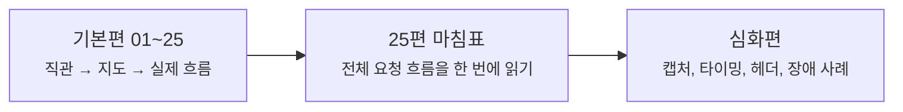

# 네트워크 글은 이제 어디부터 읽으면 좋을까요?

> 네트워크 글이 많아지면 어디서부터 읽어야 할지 더 헷갈릴 것 같죠? **사실은 지금부터는 기본편과 심화편의 역할이 더 또렷하게 나뉘어요.**

패킷, IP, TCP, DNS, NAT...
이름은 익숙한데 막상 읽으려면 **지금 나는 감부터 잡아야 하는지**, 아니면 **실제 구조를 더 깊게 봐도 되는지** 가 제일 헷갈리죠?

그래서 이제 `docs/Network/` 는,
**처음부터 차근차근 따라가는 기본편** 과
**25편 이후 장면별로 더 깊게 파고드는 심화편** 을 나눠서 안내하려고 해요.

근데요, 이건 단순히 폴더만 나누는 얘기가 아니에요.
독자가 **"처음엔 어디서 시작하고, 큰 그림을 다 본 뒤엔 어디로 더 들어가면 되는지"** 를 덜 헷갈리게 하려는 정리예요.

---

## 먼저, 지금 어떤 쪽이 더 필요하세요?

사실 모든 분이 같은 문으로 들어올 필요는 없잖아요.
지금 필요한 쪽에 따라 이렇게 보면 훨씬 덜 헤매요.

- **아직 네트워크가 낯설고, 처음부터 흐름을 잡고 싶어요**
→ [기본편 읽기 가이드](basic/index.md){ data-preview } 로 들어가면 좋아요.
  이쪽은 **01~25 메인 시리즈** 예요. 패킷부터 시작해서 마지막엔 End-to-End Request Debugging까지 한 흐름으로 연결돼요.
- **기본편은 다 읽었고, 이제 장면 하나씩 더 깊게 파고들고 싶어요**
→ [심화편 입구](deep-dive/index.md){ data-preview } 로 들어오면 돼요.
  이쪽은 25편에서 닫은 큰 그림을 바탕으로, 패킷 캡처·브라우저 타이밍·캐시 헤더·장애 사례 같은 장면을 더 깊게 읽는 구간이 될 거예요.

근데요, **처음 읽는 분에게는 여전히 기본편 01부터 시작하는 길이 제일 자연스러워요.**
심화편은 앞에서 만든 직관과 전체 지도를 이미 머릿속에 갖고 있다는 전제로 더 깊게 들어갈 테니까요.

!!! tip "이렇게 읽으면 제일 덜 헷갈려요"
- 처음이라면 [기본편 읽기 가이드](basic/index.md){ data-preview }부터 시작하면 가장 편해요.
- 이미 25편까지 읽었다면, 그다음부턴 [심화편 입구](deep-dive/index.md){ data-preview }에서 더 깊게 들어오면 돼요.

---

## 왜 이제 읽는 길을 둘로 나눌까요?

메인 시리즈는 25편까지 오면서,
이제 **인터넷을 이해하는 큰 그림** 하나를 꽤 또렷하게 닫았어요.
그래서 여기서부터는 같은 방식으로 26편, 27편을 계속 붙이기보다,
필요한 장면을 따로 떼어 더 깊게 들어가는 편이 더 자연스럽죠.

여기서 중요한 건,
기본편은 **큰 흐름을 끊기지 않게 따라가는 길**이고,
심화편은 그 흐름 안의 장면을 **확대해서 다시 보는 길**이라는 점이에요.

---

## 지금은 이렇게 들어가면 돼요

- [기본편 읽기 가이드](basic/index.md){ data-preview }
  - 01부터 25까지 차례대로 읽는 공식 메인 흐름이에요.
  - 처음 보는 분, 또는 다시 처음부터 훑고 싶은 분에게 가장 자연스러운 길이에요.
- [심화편 입구](deep-dive/index.md){ data-preview }
  - 25편 이후, 특정 장면을 더 깊게 파고드는 보충 글과 실전형 글이 이어질 자리예요.
  - 기본편을 이미 읽었거나, 큰 그림은 있는데 더 깊은 장면 해석이 궁금한 분에게 맞아요.

---

## 자, 이제는 이렇게 생각하면 돼요

이제 `docs/Network/` 는,
**기본편에서 큰 그림을 한 번 완성하고**,
그다음엔 **심화편에서 필요한 장면을 더 깊게 여는 구조**로 보면 딱 맞아요.

---

## 자, 이 페이지는 이렇게 읽으면 돼요

!!! abstract "이 페이지를 쓰는 가장 쉬운 방법"
- 처음이라면 [기본편 읽기 가이드](basic/index.md){ data-preview }로 들어가서 01부터 25까지 차근차근 따라가면 돼요.
- 이미 기본편을 다 읽었다면, 그다음엔 [심화편 입구](deep-dive/index.md){ data-preview }에서 더 깊은 장면으로 들어오면 돼요.

그럼, 어디부터 읽어볼까요?

<a class="md-button md-button--primary" href="basic/">기본편 보러 가기</a>
<a class="md-button" href="deep-dive/">심화편 입구 보기</a>
