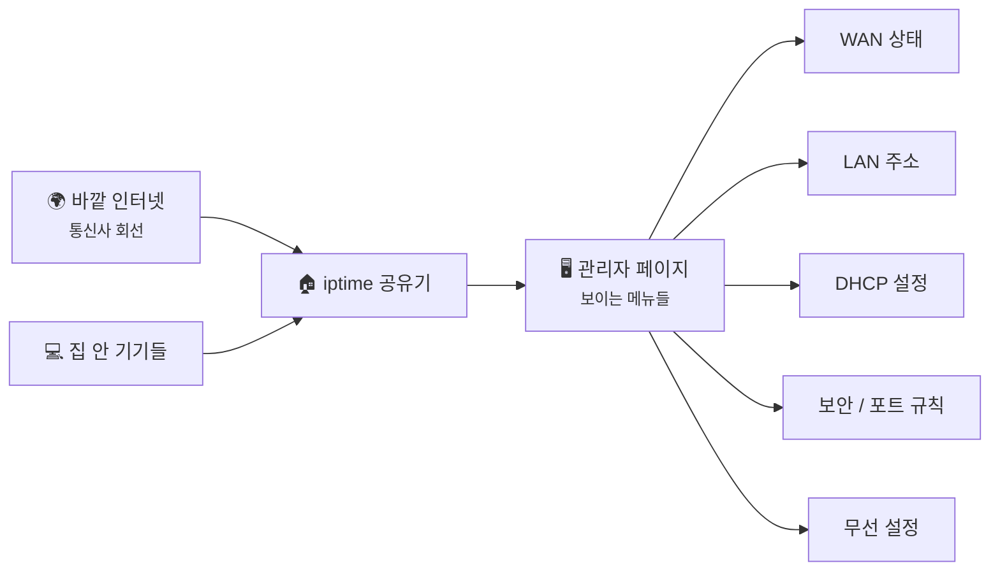
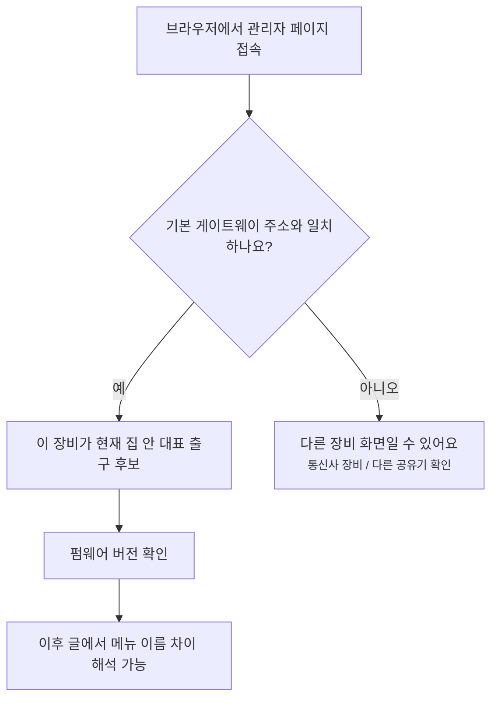
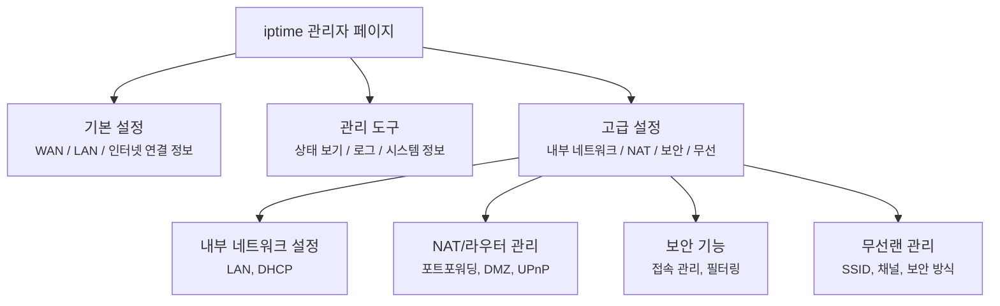

# iptime 관리자 페이지는 어디부터 보면 될까요?

> 공유기 설정 화면은 버튼이 많아서 무서워 보이죠? **사실은 집 안 출입문 규칙표를 펼쳐놓은 것에 더 가까워요.**

[공유기와 홈 네트워크](../basic/13-router-and-home-network.md){ data-preview }에서는 공유기가 **기본 게이트웨이**, **DHCP**, **NAT**, **방화벽** 같은 역할을 한 박스 안에서 같이 맡고 있다는 걸 봤어요. 근데 거기까지 보고 나면 꼭 이런 궁금증이 남아요. *"좋아요, 개념은 알겠어요. 근데 iptime 관리자 화면을 열면 그 개념이 어디에 보이는데요?"*

오늘 글은 바로 그 빈칸을 채우는 첫 실습 글이에요. 이후에 DHCP, 포트포워딩, 보안, 무선 같은 **세부 화면 실습 글**이 하나씩 생기더라도, 이번 글은 그 전에 **관리자 화면 전체를 어떤 눈으로 읽어야 하는지** 큰 그림부터 잡아둘게요.

!!! note "이 글의 범위"
    여기서는 **iptime 관리자 페이지를 처음 열었을 때 어디부터 봐야 하는지** 에 집중할게요. 실제 메뉴 이름은 펌웨어 버전에 따라 조금 다를 수 있어요. 그래서 이 글에서는 가능한 한 **"관리 도구 → 고급 설정 → ..." 같은 경로 중심** 으로 설명할 거예요. 기본 접속 주소는 보통 `http://192.168.0.1` 이고, 이 글은 이후 모든 iptime 실습 글이 자주 다시 가리키는 공통 입구가 될 거예요.

한 가지 덧붙이면, iptime 화면은 보통 **상태를 보는 화면** 과 **규칙을 바꾸는 화면** 이 살짝 나뉘어요. 그래서 WAN/LAN처럼 현재 상태를 먼저 보는 항목은 `기본 설정` 쪽에, DHCP·포트포워딩·보안처럼 규칙을 바꾸는 항목은 `관리 도구 → 고급 설정` 쪽에 놓이는 경우가 많아요. 이 글에서는 그 차이까지 같이 읽어볼게요.

---

## 일단 비유로 시작해볼게요

공유기 관리자 화면을 처음 열면, 마치 작은 건물의 관리실에 들어간 느낌이 들어요.

- 건물 바깥 회선 상태를 보는 **출입 통제 모니터** 가 있고,
- 방 번호와 자리 배치를 정리하는 **좌석 배정표** 가 있고,
- 누가 새로 들어오면 자리를 나눠주는 **접수대** 가 있고,
- 어떤 문을 열고 닫을지 정하는 **보안 규칙판** 도 있어요.

그래서 설정 화면은 기능 이름만 보면 복잡해 보여도,
사실은 우리가 기본편에서 본 개념들이 **화면 위 메뉴 이름** 으로 다시 나타난 거예요.

| 기본편에서 잡은 감각 | 비유에서는 | iptime 화면에서는 |
|---|---|---|
| 기본 게이트웨이 | 건물 바깥으로 나가는 대표 출구 | `기본 설정 → 내부 네트워크 설정` 의 LAN 주소, 보통 `192.168.0.1` |
| WAN / 공인 IP | 건물 바깥 회선 상태판 | `기본 설정 → 인터넷 설정 정보` |
| DHCP | 새로 온 사람에게 자리표 나눠주는 접수대 | `관리 도구 → 고급 설정 → 내부 네트워크 설정 → DHCP 서버 설정` |
| 방화벽 / 포트 규칙 | 어떤 문을 열고 닫을지 적힌 보안 규칙판 | `관리 도구 → 고급 설정 → 보안 기능`, `NAT/라우터 관리` 주변 메뉴 |
| 무선 네트워크 | 무선으로 건물 안에 들어오는 입구 | `관리 도구 → 고급 설정 → 무선랜 관리` 주변 메뉴 |

즉, 이번 글은 **새 메뉴를 외우는 글** 이라기보다, [공유기와 홈 네트워크](../basic/13-router-and-home-network.md#router-jobs){ data-preview }에서 본 역할들이 **관리자 화면 어느 칸에 보이는지** 다시 연결해주는 글이에요.

이 그림에서 중요한 건,
관리자 페이지가 **별도 세계** 가 아니라 공유기가 이미 하고 있던 일을 **사람이 읽을 수 있게 펼쳐놓은 화면** 이라는 점이에요.

---

## 먼저, 어디로 들어가고 어떤 버전인지부터 확인할게요 { #entry-and-version }

대부분의 iptime 공유기는 브라우저 주소창에 `http://192.168.0.1` 을 넣으면 관리자 페이지로 들어갈 수 있어요. 다만 집 구조에 따라 공유기 LAN 주소가 `192.168.1.1` 이거나 다른 값일 수도 있으니, 안 열리면 **내 기기의 기본 게이트웨이 주소** 를 먼저 확인해보면 돼요.

로그인에 들어갔다면 제일 먼저 볼 건 두 가지예요.

1. **지금 내가 접속한 장비가 정말 내가 만지는 그 공유기 맞는지**
2. **펌웨어 버전이 무엇인지**

이 두 가지가 중요한 이유가 있어요. 집에 통신사 장비와 내 iptime 공유기가 둘 다 있으면, 내가 열어놓은 화면이 **통신사 게이트웨이인지, 내 iptime인지** 부터 헷갈릴 수 있거든요. 그리고 펌웨어 버전이 다르면 메뉴 이름이나 위치가 조금씩 달라질 수 있어요.

그러니까 첫 화면에서 바로 옵션을 바꾸기보다,
**"내가 지금 어느 장비를 보고 있지?"**, **"이 장비 메뉴 표기는 어느 버전 기준이지?"** 부터 잡는 게 출발점이에요.

---

## 메뉴 큰 그림부터 잡아볼게요 { #menu-map }

iptime 메뉴는 버전에 따라 조금 달라도, 큰 덩어리는 보통 비슷해요.

- **기본 설정** 쪽에는 바깥 회선 상태와 내부 주소처럼 **지금 구조가 어떤지** 보는 정보가 있고,
- **고급 설정** 쪽에는 DHCP, NAT, 포트포워딩, 무선, 보안처럼 **규칙을 바꾸는 메뉴** 가 모여 있고,
- **관리 도구** 쪽에는 로그, 트래픽, 시스템 정보처럼 **운영 상태를 읽는 메뉴** 가 붙는 경우가 많아요.

즉, 경로가 `기본 설정 → ...` 로 시작한다고 해서 중요도가 낮은 게 아니고, `관리 도구 → 고급 설정 → ...` 으로 길어진다고 해서 더 어려운 메뉴라는 뜻도 아니에요. **앞쪽은 현재 상태를 읽는 자리, 뒤쪽은 규칙을 만지는 자리** 라고 생각하면 훨씬 덜 헷갈려요.

처음부터 모든 메뉴를 읽을 필요는 없어요. 오히려 중요한 건 **정보를 보는 메뉴** 와 **규칙을 바꾸는 메뉴** 를 먼저 나눠서 보는 거예요. 이 구분만 돼도 실수할 확률이 확 줄어요.

---

## 처음엔 이 네 화면만 보면 돼요 { #first-checks }

[공유기와 홈 네트워크](../basic/13-router-and-home-network.md#router-jobs){ data-preview }에서 공유기가 맡는 역할을 다섯 가지 정도로 정리했죠. 관리자 화면에서는 그중에서도 처음에 아래 네 묶음만 보여도 감이 확 살아나요.

### 1. WAN 쪽 상태 — 바깥과 정말 연결돼 있나요?

보통 `기본 설정 → 인터넷 설정 정보` 같은 경로에서 보는 화면이에요. 여기서는 공유기가 **바깥에서 어떤 주소를 받았는지**, 연결이 살아 있는지, 회선 종류가 무엇인지 같은 단서를 봐요.

- 공인 IP처럼 보이는 값이 잡히는지
- 아예 값이 비어 있거나 비정상적이지 않은지
- 연결 시간, 재연결 흔적 같은 정보가 없는지

기본편 [공유기와 홈 네트워크](../basic/13-router-and-home-network.md#home-packet-flow){ data-preview }에서 본 **"공유기 바깥 출구"** 를 실제 숫자로 확인하는 곳이라고 생각하면 돼요.

### 2. LAN 쪽 주소 — 집 안 대표 출구는 몇 번 방인가요?

보통 `기본 설정 → 내부 네트워크 설정` 쪽에서 LAN 주소를 봐요. 흔히 `192.168.0.1` 이나 `192.168.1.1` 처럼 보이죠.

이 숫자는 그냥 관리자 주소가 아니라, 집 안 기기들이 바깥으로 나갈 때 먼저 향하는 **기본 게이트웨이** 후보예요. 그래서 이 주소를 보면 *"아, 우리 집 안 출구가 여기구나"* 하고 머릿속 지도가 잡혀요.

### 3. DHCP 설정 — 집 안 주소는 어떻게 나눠주고 있나요?

보통 `관리 도구 → 고급 설정 → 내부 네트워크 설정 → DHCP 서버 설정` 같은 경로에서 봐요. 버전에 따라 경로 표기가 조금 달라질 수 있지만, 핵심은 **자동 주소 배정 규칙** 을 보는 메뉴라는 거예요.

여기서 볼 건 보통 이런 것들이에요.

- DHCP 서버가 켜져 있는지
- 자동 할당 범위가 어디부터 어디까지인지
- 임대 시간(lease time)이 얼마나 되는지
- 현재 어떤 기기들이 주소를 받고 있는지

즉, 기본편에서 본 **"공유기가 주소를 나눠준다"** 는 말을 화면 위 표와 숫자로 확인하는 자리에요.

### 4. 보안 / 포트 / 무선 메뉴 — 문지기 규칙은 어디 있나요?

나머지 메뉴는 세부 실습에서 하나씩 다시 보겠지만, 처음엔 위치만 알아도 충분해요.

- `고급 설정 → NAT/라우터 관리` — 포트포워딩, DMZ, UPnP 같은 **문 열기 규칙**
- `고급 설정 → 보안 기능` — 접속 제한, 필터링 같은 **문지기 규칙**
- `고급 설정 → 무선랜 관리` — SSID, 채널, 보안 방식 같은 **무선 입구 규칙**

이 세 묶음은 나중에 [포트 포워딩과 들어오는 연결](../basic/14-port-forwarding-and-incoming-connections.md){ data-preview }, [방화벽과 상태 기반 필터링](../basic/15-firewall-and-stateful-filtering.md){ data-preview }, [DHCP](../basic/17-dhcp.md){ data-preview }에서 본 개념과 하나씩 다시 이어질 거예요.

---

## 본다, 바꾼다, 확인한다 { #look-change-verify }

iptime 실습 글은 메뉴 이름을 외우는 것보다, **화면을 다루는 순서** 를 익히는 게 더 중요해요. 저는 이 순서를 추천해요.

### 1. 먼저 본다 — 지금 상태부터 읽어요

처음엔 저장 버튼 누르지 말고,

- WAN 주소가 있는지
- LAN 주소가 몇 번인지
- DHCP가 켜져 있는지
- 무선 이름과 보안 방식이 어떻게 잡혀 있는지

이런 **현재 상태** 를 먼저 읽어요.

### 2. 그다음 바꾼다 — 바꿀 이유가 분명한 것만 건드려요

예를 들면 이런 경우예요.

- 무선 이름을 더 알아보기 쉽게 바꾸고 싶다
- DHCP 범위를 조정해야 한다
- 포트포워딩을 특정 장치에만 열어야 한다

중요한 건, **무엇을 바꾸는지보다 왜 바꾸는지** 가 먼저 또렷해야 한다는 거예요. 이유 없이 메뉴를 많이 건드릴수록 나중에 원인을 되짚기가 어려워져요.

### 3. 마지막에 확인한다 — 개념과 결과가 맞는지 다시 봐요

변경 뒤에는 꼭 다시 확인해요.

- LAN 주소를 바꿨다면 관리자 페이지 접속 주소도 같이 바뀌었는지
- DHCP 범위를 바꿨다면 새로 붙는 기기가 그 범위 안 주소를 받는지
- 무선 설정을 바꿨다면 기기가 다시 잘 붙는지
- WAN 정보가 제대로 유지되는지

즉, 실습의 핵심은 **버튼 누르기** 가 아니라,
**개념 → 설정 → 관찰 결과** 가 일치하는지 보는 거예요.

!!! warning "저장 전에는 원복 경로부터 같이 확인해두세요"
    LAN 주소, DHCP, 무선 보안 방식 같은 설정은 잘못 바꾸면 **관리자 페이지에 다시 못 들어가거나, 집 안 기기들이 인터넷을 잃을 수 있어요.** 바꾸기 전 현재 값을 메모하거나 화면을 캡처해두고, 가능하면 한 번에 하나씩만 바꾸세요. 원복할 때는 같은 메뉴 경로로 돌아가 **방금 바꾸기 전 값** 을 다시 넣으면 돼요.

iptime가 아니더라도 비슷한 개념은 거의 다 있어요. 다른 공유기를 쓰더라도 이름이 조금 다를 뿐, 보통은 **인터넷 설정 / 내부 네트워크 / DHCP / 무선 / 보안** 같은 묶음으로 비슷하게 나타나요.

---

## 잘못 읽기 쉬운 함정 세 가지

처음 관리자 화면을 열면 여기서 자주 미끄러져요.

**하나, 와이파이 메뉴가 곧 인터넷 메뉴라고 생각하기.**
와이파이는 **집 안 무선 입구** 일 뿐이에요. 인터넷이 안 될 때는 WAN 상태, DNS 전달, 게이트웨이 역할이 따로 멀쩡한지도 같이 봐야 해요.

**둘, 관리자 페이지 주소가 공인 IP라고 생각하기.**
`192.168.0.1` 같은 주소는 보통 집 안 LAN 주소예요. 바깥에서 보이는 공인 IP는 WAN 쪽 정보에서 따로 확인해야 해요.

**셋, 메뉴가 많으니 처음부터 다 알아야 한다고 생각하기.**
사실은 반대예요. 처음엔 [기본편 13](../basic/13-router-and-home-network.md#router-jobs){ data-preview }에서 본 역할을 기준으로 **WAN / LAN / DHCP / 보안·포트** 네 묶음만 읽어도 충분해요.

---

## 자, 정리해볼까요?

!!! abstract "오늘 우리가 본 것"
    - iptime 관리자 페이지는 **새 개념을 배우는 곳** 이라기보다, 기본편에서 본 공유기 역할을 **화면 위 메뉴로 다시 읽는 곳** 이에요.
    - 먼저 확인할 건 **내가 접속한 장비가 맞는지**, **펌웨어 버전이 무엇인지** 예요.
    - 처음엔 전체 메뉴를 다 볼 필요 없이 **WAN 상태 / LAN 주소 / DHCP 설정 / 보안·포트·무선 메뉴 위치** 만 봐도 충분해요.
    - 실습은 항상 **본다 → 바꾼다 → 확인한다** 순서로 가는 게 덜 위험해요.
    - 다른 공유기를 써도 핵심 개념은 비슷하고, 메뉴 이름만 조금 다르게 보일 뿐이에요.

[공유기와 홈 네트워크](../basic/13-router-and-home-network.md){ data-preview }에서 봤던 공유기의 역할이 이제는 조금 더 손에 잡히죠? **기본 게이트웨이**, **DHCP**, **보안 규칙** 이 전부 추상 개념이 아니라, 실제로는 관리자 화면 어딘가에 놓인 메뉴라는 감각만 생겨도 이번 글의 목적은 충분히 달성한 거예요.

---

## 이어서 보면 좋은 글

이제부터는 이 공통 입구를 기준으로, 메뉴 하나씩 더 깊게 내려가면 돼요.

- 공유기가 집 안 주소를 실제로 어떻게 나눠주는지 바로 이어서 보고 싶다면 — [DHCP, 우리 집 기기들은 자기 주소를 어떻게 자동으로 받을까요?](../basic/17-dhcp.md){ data-preview }
- 관리자 화면의 포트 규칙이 왜 중요한지 먼저 큰 그림을 다시 보고 싶다면 — [포트 포워딩과 들어오는 연결](../basic/14-port-forwarding-and-incoming-connections.md){ data-preview }
- 공유기 안의 문지기 역할을 다시 붙여 보고 싶다면 — [방화벽과 상태 기반 필터링](../basic/15-firewall-and-stateful-filtering.md){ data-preview }

여기까지 읽었다면, 아마 이런 질문이 바로 이어질 거예요.

> *"좋아요. 이제 화면은 덜 무섭네요. 그럼 DHCP 메뉴를 열었을 때 임대시간이랑 주소 예약은 뭘 보고 판단하면 될까요?"*

그 감각은 다음 iptime 실습 글에서 **DHCP 화면을 실제 숫자와 목록 기준으로 읽는 장면** 으로 이어질 거예요.
