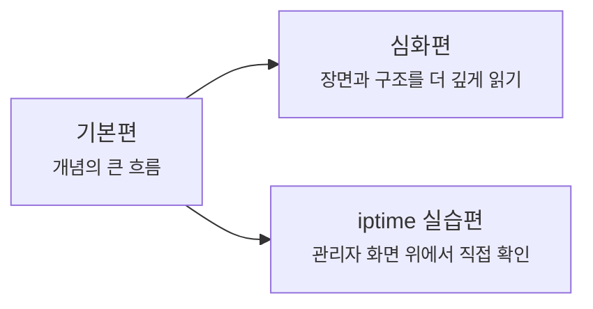

# iptime 실습은 여기서 시작할게요

> 관리자 화면은 설정 버튼이 많아서 복잡해 보이죠? **사실은 네트워크 개념을 손으로 다시 확인하는 연습장에 더 가까워요.**

[기본편](../basic/index.md){ data-preview }과 [심화편](../deep-dive/index.md){ data-preview }에서 큰 그림과 장면 해석을 잡았다면,
이제는 **실제 관리자 화면 위에서 그 개념이 어디에 보이는지** 확인해볼 차례예요.

여기서는 `iptime` 공유기를 예시로 쓰지만,
핵심은 특정 브랜드가 아니라 **공유기 화면을 어떤 개념으로 읽을 것인가** 예요.

---

## 이 실습편은 어떻게 읽으면 좋을까요?

- 기본편은 **개념의 큰 흐름**을 잡아줘요.
- 심화편은 **비트·필드·캡처·장면**을 더 깊게 읽게 해줘요.
- iptime 실습편은 그 개념을 **실제 관리자 화면 위에서 손으로 확인**하게 해줘요.

즉, 이 레인은 **네트워크 설명서**가 아니라,
이미 배운 개념을 **화면과 숫자와 메뉴 경로로 다시 연결하는 실습편**이라고 보면 돼요.

---

## 지금 바로 읽을 수 있는 실습 글

- [iptime 관리자 페이지는 어디부터 보면 될까요?](./01-iptime-admin-tour.md){ data-preview } — 공유기 역할을 실제 관리자 화면 위에 다시 올려보면서, WAN·LAN·DHCP·보안 메뉴를 어떤 눈으로 읽어야 하는지 먼저 잡아봐요.

---

## 읽기 전에 이것만 기억하면 돼요

이 실습편은 처음부터 **설정을 많이 바꾸는 것**이 목적이 아니에요.

- 먼저 **지금 상태를 읽고**,
- 왜 바꾸는지 분명할 때만 **하나씩 바꾸고**,
- 바꾼 뒤에는 **개념과 결과가 맞는지 확인**하는 쪽에 더 가까워요.

그래서 기본편과 심화편을 아직 안 읽었다면,
가능하면 먼저 [공유기와 홈 네트워크](../basic/13-router-and-home-network.md){ data-preview }, [DHCP](../basic/16-dhcp.md){ data-preview }, [ARP와 로컬 전달](../basic/17-arp-and-local-delivery.md){ data-preview } 쪽 감각을 잡고 들어오면 훨씬 덜 헷갈려요.

---

## 자, 정리해볼까요?

!!! abstract "iptime 실습편은 이렇게 보면 돼요"
    - 이 레인은 네트워크 개념을 **실제 관리자 화면 위에서 다시 확인하는 실습편**이에요.
    - 처음부터 복잡한 옵션을 다 만지는 게 아니라, **화면을 어떤 눈으로 읽을지** 부터 잡으면 돼요.
    - 현재는 공통 입구 글부터 시작하고, 이후 필요한 실습이 하나씩 이어질 거예요.

그럼, 첫 실습부터 같이 들어가볼까요?

<a class="md-button md-button--primary" href="01-iptime-admin-tour/">첫 실습 글 보기</a>
