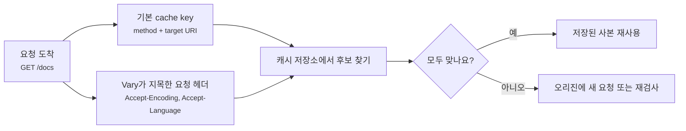
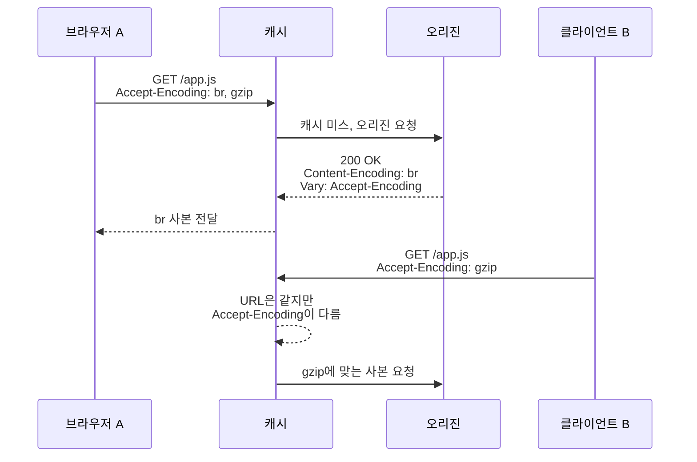
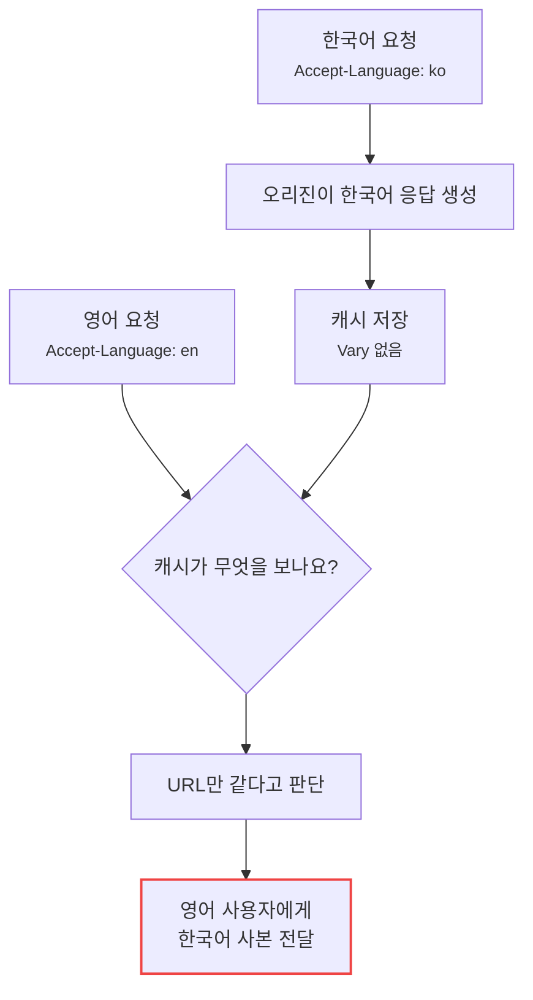
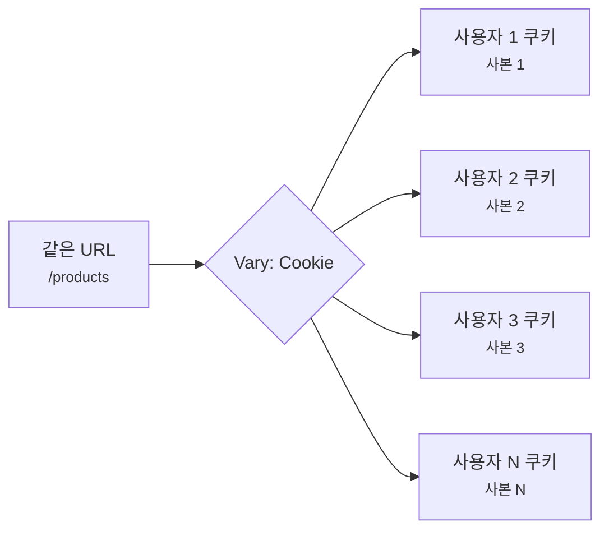

# Cache Key와 Vary는 왜 같이 읽어야 할까요?

> URL이 같으면 캐시도 무조건 같은 사본을 꺼낼 것 같죠? **사실은 요청 헤더 몇 개가 달라졌다는 이유만으로 다른 사본을 꺼내야 할 때가 있어요.**

[CDN, Cache, 그리고 Edge Delivery](../basic/25-cdn-cache-and-edge-delivery.md){ data-preview }에서는 캐시가 **무엇을 같은 응답으로 볼지 정하는 기준**을 캐시 키라고 가볍게 봤어요. 그리고 [Cache-Control과 Age 헤더](./reading-cache-control-and-age.md){ data-preview }에서는 저장된 사본이 아직 fresh인지, 이미 얼마나 나이를 먹었는지 읽었죠.

이번에는 그보다 한 칸 앞의 질문을 볼게요.

> *"캐시가 지금 꺼내려는 사본은 정말 이 요청에 맞는 사본일까요?"*

실제 운영에서는 이런 장면을 자주 만나요.

```http
GET /docs HTTP/2
host: example.com
accept-language: ko-KR,ko;q=0.9,en;q=0.8
accept-encoding: br, gzip
```

그리고 응답에는 이런 헤더가 붙어 있어요.

```http
HTTP/2 200
cache-control: public, max-age=600
vary: Accept-Encoding, Accept-Language
content-language: ko
content-encoding: br
```

겉으로는 `/docs`라는 같은 URL이에요. 그런데 영어를 원하는 사용자, 한국어를 원하는 사용자, `br` 압축을 받을 수 있는 브라우저, `gzip`만 받을 수 있는 클라이언트가 모두 같은 사본을 받아도 될까요?

오늘은 **Cache Key가 무엇을 같은 요청으로 묶는지**, **Vary가 어떤 요청 헤더를 추가로 비교하라고 말하는지**, 그리고 **캐시가 잘 안 맞거나 너무 많이 쪼개질 때 어디를 봐야 하는지** 같이 읽어볼게요. HTTP 캐시의 기본 캐시 키와 Vary 계산 규칙은 [RFC 9111: HTTP Caching](https://www.rfc-editor.org/rfc/rfc9111.html#section-2)과 [RFC 9111의 Vary 절](https://www.rfc-editor.org/rfc/rfc9111.html#section-4.1)을 바닥에 두고, Vary 헤더 자체의 의미는 [RFC 9110의 Vary 절](https://www.rfc-editor.org/rfc/rfc9110.html#section-12.5.5)을 기준으로 잡을게요.

!!! note "이 글의 범위"
    여기서는 특정 CDN의 설정 화면보다 **표준 HTTP 캐시가 같은 응답을 재사용해도 되는지 판단하는 감각**에 집중해요. CDN마다 쿼리 문자열 정규화, 커스텀 캐시 키, 쿠키 포함 규칙은 다를 수 있으니, 제품별 설정은 별도 문서와 함께 확인해야 해요.

---

## 같은 상품도 옵션이 다르면 다른 칸에 둬야 해요

카페 픽업대를 떠올려볼게요.

겉으로는 모두 같은 "라떼" 주문처럼 보여요. 그런데 실제로는 옵션이 달라질 수 있죠.

- 아이스 라떼인지, 따뜻한 라떼인지
- 일반 우유인지, 오트 우유인지
- 작은 컵인지, 큰 컵인지
- 한국어 이름표인지, 영어 이름표인지

픽업대 직원이 메뉴 이름만 보고 아무 라떼나 건네면 문제가 생겨요. **같은 메뉴처럼 보여도, 어떤 옵션은 반드시 같이 맞아야 해요.**

HTTP 캐시도 비슷해요.

| 카페 장면 | HTTP 캐시 장면 |
|---|---|
| 픽업대에 붙은 주문표 | cache key |
| 메뉴 이름 | 요청 URI |
| 주문 옵션 | 요청 헤더, 쿼리 문자열, 쿠키 같은 선택 조건 |
| 같은 주문표의 음료 | 재사용 가능한 cached response |
| 옵션이 다른 음료 | 같은 URL이어도 다른 representation |
| 직원에게 "이 옵션도 비교해 주세요"라고 적는 표시 | `Vary` |

핵심은 **캐시 키가 사본을 꺼내는 이름표**라는 점이에요. 그리고 `Vary`는 그 이름표에 "이 요청 헤더들도 같이 맞는지 보세요"라고 덧붙이는 신호예요.



이 그림에서 URL은 출발점이에요. 하지만 `Vary`가 있으면 캐시는 URL만 보고 끝내지 않고, 응답을 만들 때 영향을 준 요청 헤더까지 다시 비교해야 해요.

## Cache Key는 캐시가 사본을 찾는 주소예요

아주 단순하게 말하면 cache key는 이 질문의 답이에요.

> **"어떤 요청들이 같은 저장 칸을 공유해도 될까요?"**

HTTP 표준에서는 캐시 키가 최소한 요청 method와 target URI를 바탕으로 만들어진다고 설명해요. 현실의 일반적인 웹 캐시는 대부분 `GET` 응답을 주로 저장하기 때문에, 운영자가 처음 볼 때는 **URL이 가장 큰 축**으로 보일 때가 많아요.

```text
GET https://example.com/assets/app.css
GET https://example.com/assets/app.css?v=2
GET https://example.com/assets/app.css?v=3
```

이 셋은 비슷해 보여도 target URI가 달라요. 특히 쿼리 문자열은 캐시 키에 들어갈 수도 있고, CDN 설정에 따라 일부만 쓰거나 무시할 수도 있어요.

| 요청 | 같은 사본으로 봐도 될까요? | 처음 확인할 지점 |
|---|---|---|
| `/app.css` vs `/app.css` | 대체로 같은 후보예요 | method, scheme, host, path |
| `/app.css?v=1` vs `/app.css?v=2` | 보통 다른 후보예요 | query string 정책 |
| `http://` vs `https://` | 보통 다른 후보예요 | scheme 포함 여부 |
| `www.example.com/app.css` vs `static.example.com/app.css` | 보통 다른 후보예요 | host 포함 여부 |
| `GET /api/items` vs `POST /api/items` | 같은 방식으로 재사용하면 안 돼요 | method와 안전성 |

여기서 "보통"이라고 말한 이유가 있어요. 표준은 큰 원칙을 주지만, CDN과 프록시는 운영자가 설정한 cache key 정책을 추가로 가질 수 있거든요.

예를 들어 어떤 CDN은 이런 선택지를 제공할 수 있어요.

- 쿼리 문자열 전체를 cache key에 포함
- 특정 쿼리만 포함
- 쿼리 순서를 정규화
- 특정 쿠키나 헤더를 cache key에 포함
- 모바일/데스크톱 같은 장치 구분을 별도 키에 포함

그래서 캐시 문제를 볼 때는 "URL이 같은가요?"에서 멈추면 부족해요. **이 캐시가 실제로 어떤 값을 key로 삼았는지**까지 확인해야 해요.

!!! tip "캐시 키는 저장소의 파일명처럼 생각해도 좋아요"
    파일명이 너무 대충이면 서로 다른 내용이 덮여요. 반대로 파일명이 너무 잘게 쪼개지면 같은 내용을 재사용하지 못하고 파일이 끝없이 늘어나요. 캐시 키도 같은 균형을 잡아야 해요.

## Vary는 "이 요청 헤더까지 맞아야 해요"라는 표시예요

이제 `Vary`를 볼게요.

```http
Vary: Accept-Encoding
```

이 헤더는 응답 쪽에 붙어요. 의미는 이렇게 읽으면 좋아요.

> *"이 응답은 요청의 `Accept-Encoding` 값에 따라 달라질 수 있으니, 나중에 재사용할 때도 그 요청 헤더가 맞는지 비교하세요."*

왜 필요할까요?

브라우저 A는 Brotli 압축을 받을 수 있어요.

```http
Accept-Encoding: br, gzip
```

오래된 클라이언트 B는 gzip만 받을 수 있다고 해볼게요.

```http
Accept-Encoding: gzip
```

오리진이나 CDN이 A에게 `br`로 압축한 응답을 보냈다면, 그 사본을 B에게 그대로 주면 안 돼요. B가 Brotli를 이해하지 못할 수 있으니까요.



이 흐름에서 `Vary: Accept-Encoding`이 없으면 캐시는 같은 URL이라는 이유로 `br` 사본을 엉뚱한 클라이언트에게 줄 위험이 생겨요.

| Vary 값 | 왜 나눠야 할까요? | 흔한 결과 |
|---|---|---|
| `Accept-Encoding` | 압축 형식이 달라질 수 있어요 | `br`, `gzip`, 압축 없음 사본 분리 |
| `Accept-Language` | 언어별 본문이 달라질 수 있어요 | 한국어/영어 페이지 분리 |
| `Accept` | 같은 URL에서 HTML, JSON 등을 고를 수 있어요 | 표현 형식 분리 |
| `Origin` | CORS 응답 헤더가 origin별로 달라질 수 있어요 | 허용 origin별 응답 분리 |
| `Cookie` | 로그인/실험/지역 정보가 쿠키에 있을 수 있어요 | 사본이 매우 잘게 쪼개질 수 있음 |

`Vary`는 캐시를 더 안전하게 만들 수 있어요. 하지만 동시에 캐시 키를 더 잘게 쪼개기 때문에 히트율을 떨어뜨릴 수도 있어요. 그래서 `Vary`는 "많이 넣을수록 좋은 헤더"가 아니라, **응답 내용이나 응답 헤더가 실제로 달라지는 요청 헤더만 정확히 넣어야 하는 헤더**예요.

## Vary가 빠지면 잘못된 사본이 섞일 수 있어요

가장 위험한 장면은 오리진이 요청 헤더에 따라 다른 응답을 만들면서도 `Vary`를 빠뜨리는 경우예요.

예를 들어 `/home`이 언어에 따라 달라진다고 해볼게요.

```http
GET /home HTTP/2
Accept-Language: ko-KR,ko;q=0.9
```

응답은 한국어예요.

```http
HTTP/2 200
Cache-Control: public, max-age=300
Content-Language: ko
```

그런데 `Vary: Accept-Language`가 없어요. 그러면 캐시는 `/home`의 public 응답 하나를 저장했다가, 영어를 원하는 사용자에게도 한국어 사본을 줄 수 있어요.



이런 문제는 눈에 띄면 금방 찾을 것 같지만, 실제로는 지역, 언어, 실험 그룹, 로그인 상태가 얽히면 꽤 교묘하게 보여요.

| 겉으로 보이는 증상 | 의심할 신호 |
|---|---|
| 사용자가 가끔 다른 언어 페이지를 봄 | `Accept-Language`를 쓰는데 `Vary`가 없음 |
| API 응답이 브라우저마다 CORS 오류가 다름 | `Origin`별 응답인데 `Vary: Origin`이 없음 |
| 모바일/데스크톱 내용이 뒤섞임 | 장치 판별 신호가 캐시 키에 없음 |
| A/B 테스트 내용이 섞임 | 실험 쿠키를 기준으로 응답이 달라지지만 캐시 정책이 애매함 |

!!! warning "응답이 요청 헤더에 따라 달라지면 Vary도 같이 봐야 해요"
    `Cache-Control: public`만 보고 "공유 캐시에 둬도 되겠네"라고 끝내면 안 돼요. 같은 URL의 응답이 `Accept-Language`, `Origin`, 특정 쿠키 값에 따라 달라진다면, 그 차이가 cache key나 `Vary`에 반영돼야 해요.

## Vary가 너무 넓으면 캐시가 거의 안 맞을 수 있어요

반대 문제도 있어요.

이번에는 응답에 이런 헤더가 붙었다고 해볼게요.

```http
Vary: User-Agent
```

처음에는 안전해 보여요. 브라우저 종류마다 다른 응답을 줄 수 있으니까요. 그런데 `User-Agent` 값은 생각보다 길고 다양해요.

```text
Mozilla/5.0 (...) Chrome/126.0.0.0 Safari/537.36
Mozilla/5.0 (...) Chrome/126.0.0.0 Mobile Safari/537.36
Mozilla/5.0 (...) Firefox/127.0
```

아주 조금만 달라도 캐시는 다른 요청으로 볼 수 있어요. 그러면 같은 파일을 많은 사용자가 요청해도 사본이 끝없이 갈라져서 히트율이 떨어질 수 있어요.

`Cookie`는 더 조심해야 해요.

```http
Vary: Cookie
```

쿠키에는 세션 ID, 분석 ID, 실험 ID, 최근 본 상품 같은 값이 섞일 수 있어요. 그 전체를 기준으로 나누면 사용자마다 거의 다른 cache key가 생겨요. 공유 캐시가 사실상 재사용하지 못하게 되는 셈이에요.



이 그림은 보안 문제라기보다 히트율 문제를 보여줘요. 응답이 정말 사용자별로 다르다면 공유 캐시에 섞으면 안 돼요. 하지만 응답 본문은 모두 같은데 분석 쿠키가 있다는 이유만으로 `Vary: Cookie`가 붙으면, 캐시를 거의 못 쓰는 상태가 될 수 있어요.

!!! tip "Vary는 필요한 헤더만 좁게 잡는 게 좋아요"
    언어 때문에 달라지면 `Accept-Language`, 압축 때문에 달라지면 `Accept-Encoding`처럼 원인을 좁혀야 해요. "뭔가 다를 수 있으니 Cookie나 User-Agent 전체를 넣자"는 식이면 캐시가 너무 잘게 쪼개질 수 있어요.

## `Vary: *`는 나중 요청에 그냥 맞춰볼 수 없다는 신호예요

가끔 이런 값을 볼 수도 있어요.

```http
Vary: *
```

이건 "어떤 요청 요소가 응답 선택에 영향을 줬는지 수신자가 판단할 수 없다"는 강한 신호예요. RFC 9110은 `Vary: *`가 있으면 나중 요청에 이 응답이 적절한지 origin server에 보내지 않고는 판단할 수 없다고 설명해요.

운영 감각으로는 이렇게 보면 돼요.

| Vary 값 | 캐시가 나중에 할 수 있는 일 |
|---|---|
| `Vary: Accept-Encoding` | 요청의 `Accept-Encoding`이 맞는지 비교할 수 있어요 |
| `Vary: Accept-Language` | 요청의 `Accept-Language`가 맞는지 비교할 수 있어요 |
| `Vary: *` | 어떤 요청이 맞는지 캐시 혼자 판단하기 어려워요 |

그래서 `Vary: *`는 일반적인 CDN 히트율을 높이는 도구라기보다, **저장된 응답을 나중에 그냥 재사용하기 어렵게 만드는 신호**로 읽는 편이 좋아요.

## 실제 디버깅에서는 다섯 가지를 같이 봐요

캐시 키와 `Vary`가 의심될 때는 응답 헤더 하나만 보지 말고, 요청과 응답을 한 화면에서 같이 봐야 해요.

```text
Request URL: https://example.com/docs
Request Headers:
  Accept-Encoding: br, gzip
  Accept-Language: ko-KR,ko;q=0.9,en;q=0.8
  Cookie: experiment=A

Response Headers:
  Cache-Control: public, max-age=600
  Vary: Accept-Encoding, Accept-Language
  Content-Encoding: br
  Content-Language: ko
  Age: 128
  CF-Cache-Status: HIT
```

처음에는 아래 순서로 좁히면 좋아요.

| 순서 | 볼 것 | 묻는 질문 |
|---|---|---|
| 1 | Request URL | scheme, host, path, query가 기대한 것과 같나요? |
| 2 | method | 캐시가 재사용할 수 있는 요청인가요? |
| 3 | `Vary` | 어떤 요청 헤더를 추가로 비교하나요? |
| 4 | 실제 request header | `Vary`가 지목한 값이 이전 사본과 맞을 수 있나요? |
| 5 | `Age`와 CDN 상태 헤더 | 실제로 HIT인지, MISS인지, 오래된 사본인지 서로 말이 맞나요? |

여기서 중요한 건 `Vary`가 **응답 헤더**라는 점이에요. 하지만 비교 대상은 **요청 헤더**예요. 그래서 디버깅할 때 응답의 `Vary`만 캡처하고 끝내면 반쪽이에요. 반드시 그 요청이 보낸 `Accept-Encoding`, `Accept-Language`, `Origin`, `Cookie` 같은 값을 같이 봐야 해요.

!!! note "CDN의 커스텀 캐시 키는 Vary와 별개일 수 있어요"
    어떤 CDN은 표준 `Vary` 외에도 설정 화면에서 host, query, header, cookie를 cache key에 넣거나 뺄 수 있게 해요. 응답에 `Vary`가 안 보여도 CDN 설정이 별도 key 분리를 하고 있을 수 있고, 반대로 `Vary`가 있어도 제품 정책에 따라 저장 방식이 다르게 보일 수 있어요.

## 잘못 읽기 쉬운 함정

### 1. "URL이 같으니 무조건 같은 캐시다"

URL은 가장 중요한 축이지만 전부는 아니에요. `Vary: Accept-Encoding`이 있으면 같은 URL에도 압축 방식별 사본이 있을 수 있고, `Vary: Accept-Language`가 있으면 언어별 사본이 있을 수 있어요.

### 2. "Vary가 많을수록 더 안전하다"

무조건 그렇지는 않아요. 필요한 차이를 반영하지 않으면 사본이 섞이고, 너무 많은 차이를 반영하면 히트율이 떨어져요. 안전과 재사용 사이에서 **정말 응답을 바꾸는 신호만** 골라야 해요.

### 3. "Vary: Cookie면 로그인 응답도 공유 캐시에 안전하다"

위험한 단정이에요. 사용자별 민감 응답은 보통 `private`, `no-store`, 인증 헤더, CDN 우회 정책까지 함께 봐야 해요. `Vary: Cookie`는 요청 쿠키가 다르면 사본을 나누라는 신호이지, 민감 응답을 공유 캐시에 저장해도 된다는 허가증이 아니에요.

### 4. "Age가 있으면 cache key가 맞았다는 뜻이다"

`Age`는 캐시를 거쳐 온 힌트예요. 하지만 어떤 key로 저장됐고, `Vary` 비교가 제대로 됐는지는 별도의 문제예요. `Age`, CDN 상태 헤더, `Vary`, 실제 요청 헤더를 같이 봐야 해요.

## 예시로 같이 읽어볼게요

### 1. 압축 방식 때문에 사본이 나뉘는 정적 파일

```http
GET /assets/app.js HTTP/2
Accept-Encoding: br, gzip

HTTP/2 200
Cache-Control: public, max-age=31536000, immutable
Vary: Accept-Encoding
Content-Encoding: br
Age: 8042
```

이 응답은 오래 캐시해도 되는 정적 파일에 가까워요. 다만 `Content-Encoding: br`이므로, 나중 요청이 Brotli를 받을 수 있는지 확인해야 해요. 여기서 `Vary: Accept-Encoding`은 자연스러운 신호예요.

### 2. 언어별 페이지인데 Vary가 있는 경우

```http
GET /guide HTTP/2
Accept-Language: en-US,en;q=0.9,ko;q=0.8

HTTP/2 200
Cache-Control: public, max-age=300
Vary: Accept-Language, Accept-Encoding
Content-Language: en
Age: 42
```

같은 `/guide`라도 언어별 사본이 나뉠 수 있어요. 이 경우에는 `Content-Language`와 `Vary: Accept-Language`가 서로 말이 맞는지 봐요.

### 3. 쿠키 때문에 히트율이 떨어지는 경우

```http
GET /landing HTTP/2
Cookie: analytics_id=abc; experiment=A

HTTP/2 200
Cache-Control: public, max-age=600
Vary: Cookie
Age: 0
```

이 응답이 사용자별로 정말 달라진다면 조심해야 해요. 그런데 본문이 모두 같은 랜딩 페이지라면 `Vary: Cookie` 때문에 사용자의 쿠키 조합마다 사본이 갈라져 히트율이 낮아질 수 있어요. 이때는 쿠키 전체가 아니라 실험 그룹처럼 실제로 응답을 바꾸는 작은 신호만 key에 넣을 수 있는지 검토해야 해요.

### 4. CORS 응답에서 Origin을 빼먹은 경우

```http
GET /api/public-data HTTP/2
Origin: https://app.example.com

HTTP/2 200
Cache-Control: public, max-age=120
Access-Control-Allow-Origin: https://app.example.com
```

만약 origin별로 `Access-Control-Allow-Origin` 값이 달라진다면 `Vary: Origin`이 필요할 수 있어요. 없으면 다른 origin 요청에 앞선 origin의 CORS 헤더가 섞여 보일 수 있거든요.

!!! warning "CORS는 본문이 같아도 응답 헤더가 달라질 수 있어요"
    캐시가 비교해야 하는 건 본문만이 아니에요. 같은 JSON 본문이라도 `Access-Control-Allow-Origin` 같은 응답 헤더가 요청의 `Origin`에 따라 달라지면, 그 차이도 재사용 가능성을 바꿔요.

## 자, 정리해볼까요?

!!! abstract "오늘 우리가 배운 것"
    - **Cache Key**는 캐시가 저장된 응답을 찾을 때 쓰는 이름표예요.
    - HTTP 캐시의 기본 key는 최소한 요청 method와 target URI에서 출발하지만, 실제 CDN은 query, header, cookie 같은 추가 정책을 가질 수 있어요.
    - **Vary**는 응답을 나중에 재사용할 때 어떤 요청 헤더까지 맞는지 비교하라고 알려주는 응답 헤더예요.
    - `Vary`가 빠지면 언어, 압축, CORS, 실험 응답이 섞일 수 있어요.
    - `Vary`가 너무 넓으면 사본이 과하게 쪼개져 캐시 히트율이 떨어질 수 있어요.
    - 캐시 문제를 볼 때는 URL, method, `Vary`, 실제 요청 헤더, `Age`, CDN 상태 헤더를 같이 봐야 해요.

캐시를 볼 때 `Cache-Control`은 **얼마나 오래 쓸 수 있는지**를 말하고, cache key와 `Vary`는 **어떤 요청에 그 사본을 써도 되는지**를 말해요. 이 둘을 같이 봐야 "캐시가 됐다"와 "맞는 사본이 나왔다"를 구분할 수 있어요.

## 이어서 볼 질문

다음에는 캐시된 사본이 오래됐을 때 **다시 전체를 내려받지 않고 같은 버전인지 확인하는 방법**을 볼 거예요. `ETag`, `Last-Modified`, `If-None-Match`, `304 Not Modified`가 이어서 나올 질문이에요.

## 이어서 보면 좋은 글

- [CDN, Cache, 그리고 Edge Delivery](../basic/25-cdn-cache-and-edge-delivery.md){ data-preview } — 캐시와 엣지 전달의 큰 그림으로 돌아가고 싶을 때 좋아요.
- [Cache-Control과 Age 헤더는 어떻게 같이 읽어야 할까요?](./reading-cache-control-and-age.md){ data-preview } — 지금 사본이 fresh인지, 이미 얼마나 오래됐는지 같이 읽어봐요.
- [브라우저 waterfall은 어디부터 읽어야 할까요?](./reading-browser-waterfall.md){ data-preview } — 캐시된 요청과 네트워크 요청이 브라우저 도구에서 어떻게 다르게 보이는지 이어서 볼 수 있어요.
