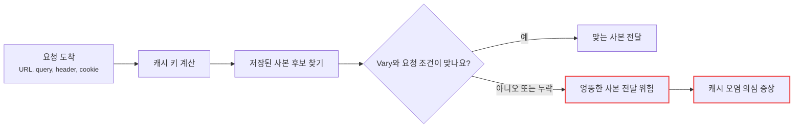
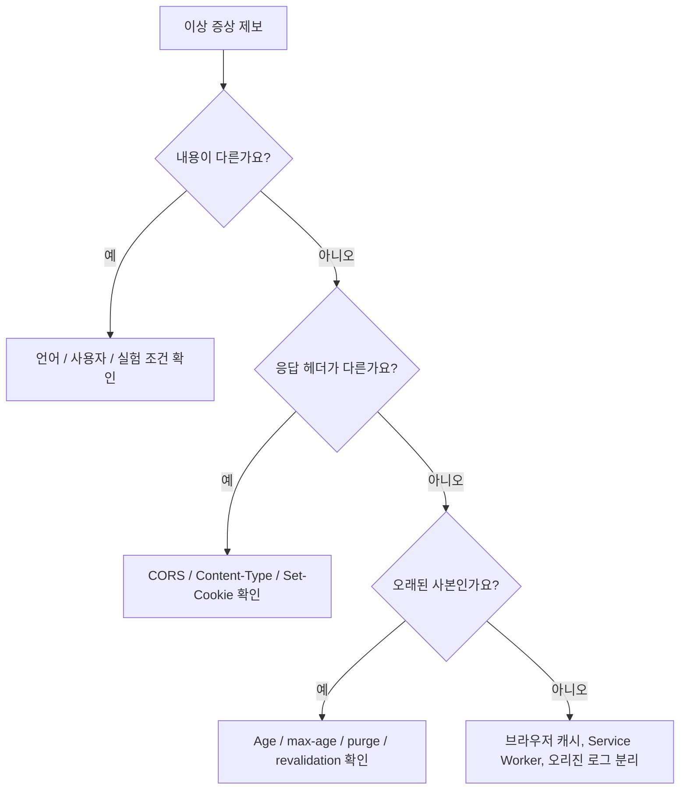
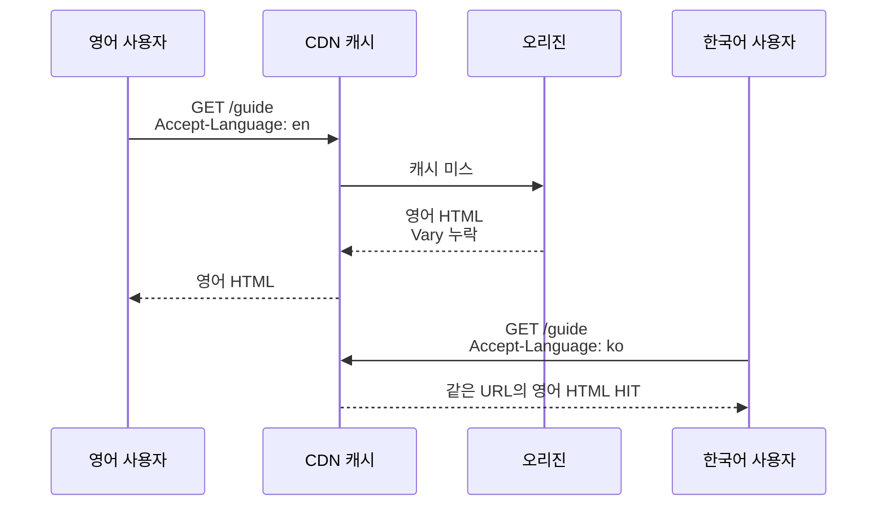
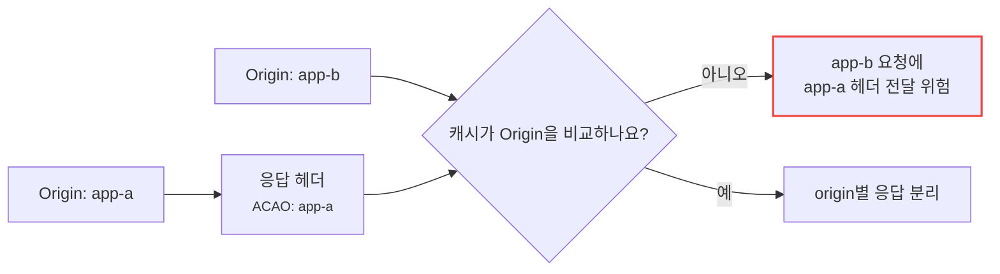
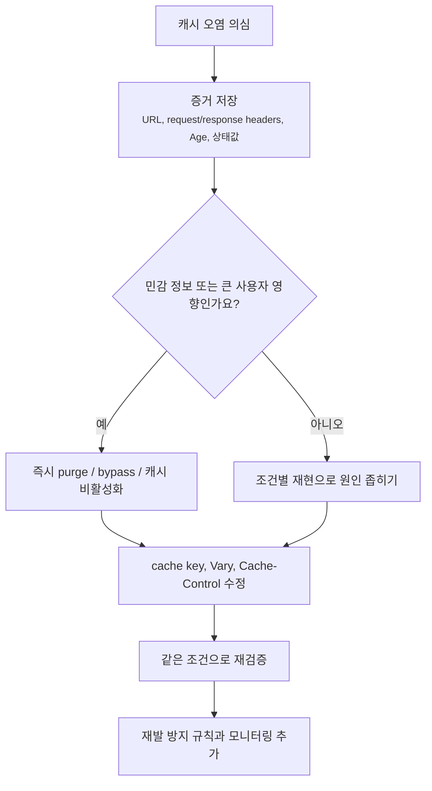

# 캐시 오염 증상은 어디서부터 읽어야 할까요?

> 캐시에서 `HIT`이 나오면 좋은 일 같죠? **사실은 잘못된 사본을 빠르게 나눠주는 중일 수도 있어요.**

[CDN, Cache, 그리고 Edge Delivery](../basic/25-cdn-cache-and-edge-delivery.md){ data-preview }에서는 캐시가 사용자 가까이에 사본을 두고 빠르게 응답하는 큰 그림을 봤어요. 그리고 [Cache Key와 Vary](./cache-key-and-vary.md){ data-preview }, [Cookie와 캐시 가능성](./cookie-and-cacheability.md){ data-preview }에서는 **어떤 요청에 어떤 사본을 써도 되는지**를 더 조심스럽게 봤죠.

이번 글은 그 지식이 실제 장애 장면에서 어떻게 보이는지 읽어볼게요.

장면은 이래요.

- 어떤 사용자는 한국어 페이지를 기대했는데 영어 페이지를 봐요.
- 로그인하지 않은 사용자가 로그인 사용자용 조각을 봤다고 제보해요.
- API 본문은 맞는 것 같은데 CORS 헤더가 다른 사이트용으로 보여요.
- 오리진에서는 이미 고쳤는데 CDN에서는 계속 예전 HTML이 나와요.
- 응답 헤더에는 `HIT`과 꽤 큰 `Age`가 보여요.

처음 보면 캐시가 잘 동작하는 것 같아요. 빠르고, `HIT`이고, 오리진 부하도 줄었으니까요.

근데요, 캐시에서 중요한 건 빠른 것보다 먼저 **맞는 사본을 맞는 요청에 주는 것**이에요. 캐시 오염은 바로 이 약속이 깨졌을 때 의심하는 증상이에요.

!!! note "이 글의 범위"
    여기서는 특정 공격 기법을 따라 하는 방법이 아니라, 운영자가 **잘못된 캐시 사본이 사용자에게 나가는 증상**을 어떻게 읽고 줄일지에 집중해요. 실제 보안 취약점이 의심되면 CDN 설정, 애플리케이션 응답 생성 로직, 보안 로그를 함께 보고 필요한 경우 보안 담당자와 같이 다뤄야 해요.

---

## 먼저 같은 도시락이 맞는지 확인해요

탕비실에 도시락이 쌓여 있다고 해볼게요.

겉포장에는 모두 "샌드위치"라고 적혀 있어요. 그런데 안쪽은 다를 수 있죠.

- 누구나 먹어도 되는 공용 샌드위치
- 알레르기 때문에 특정 사람에게만 맞는 샌드위치
- 한국어 이름표가 붙은 도시락
- 영어 이름표가 붙은 도시락
- 어제 만든 샌드위치인데 오늘도 남아 있는 것

포장이 같다는 이유로 아무 도시락이나 건네면 안 돼요. 캐시도 마찬가지예요. URL이 같고 `HIT`이 나왔더라도, 그 사본이 **이번 요청의 조건에 맞는지**는 따로 봐야 해요.

| 도시락 장면 | 캐시 장애 장면 |
|---|---|
| 같은 메뉴처럼 보임 | 같은 URL처럼 보임 |
| 이름표가 다름 | `Cookie`, `Authorization`, `Accept-Language`가 다름 |
| 알레르기 옵션이 섞임 | 사용자별 응답이 공유 캐시에 섞임 |
| 어제 도시락이 남아 있음 | 오래된 HTML이나 API 응답이 남아 있음 |
| 직원이 잘못된 칸에서 꺼냄 | cache key나 `Vary` 조건이 빠짐 |

여기서 오늘 볼 핵심 질문은 이거예요.

> *"캐시가 찾은 사본은 정말 이 요청에 맞는 사본일까요?"*



이 그림에서 캐시 오염은 "캐시가 있다"가 문제가 아니에요. **캐시가 같은 것으로 묶으면 안 되는 요청을 같은 칸에 묶었거나, 이미 잘못 저장된 사본을 계속 꺼내는 장면**이 문제예요.

## 먼저 읽을 신호 여섯 가지 { #signals-to-read }

캐시 오염이 의심될 때는 재배포나 purge부터 누르기 전에, 증거를 짧게 잡아야 해요. 특히 잘못된 사본은 purge하면 사라질 수 있어서, 무엇이 잘못 묶였는지 놓치기 쉬워요.

| 신호 | 무엇을 보나요? | 왜 중요할까요? |
|---|---|---|
| 문제 URL과 query | 같은 URL인지, query가 다른지 | 기본 cache key의 출발점이에요 |
| `Cache-Control` | 공유 캐시에 저장 가능했는지 | 저장 자체가 자연스러운지 봐요 |
| `Age`와 CDN 상태 | 사본이 얼마나 오래 있었고 HIT인지 | 오리진 새 응답인지 캐시 사본인지 갈라요 |
| `Vary` | 어떤 요청 헤더를 비교해야 하는지 | 언어, 압축, Origin, 쿠키 차이를 봐요 |
| 실제 요청 헤더 | `Accept-Language`, `Origin`, `Cookie` 등 | `Vary`가 지목한 값과 맞춰봐요 |
| 사용자별 신호 | `Set-Cookie`, `Authorization`, 세션 쿠키 | 공유 캐시에 섞이면 안 되는지 봐요 |

이 여섯 가지를 한 화면에 모으면, "캐시가 이상해요"라는 말이 조금 더 구체적인 질문으로 바뀌어요.

```text
Request URL: https://example.com/dashboard
Request Headers:
  Accept-Language: ko-KR,ko;q=0.9,en;q=0.8
  Cookie: session=user-b

Response Headers:
  Cache-Control: public, max-age=600
  Age: 421
  CF-Cache-Status: HIT
  Content-Language: en
  Set-Cookie: last_seen=...
```

이 예시에서 바로 단정하면 안 돼요. 하지만 적어도 세 질문은 떠올라야 해요.

- 한국어 요청인데 왜 `Content-Language: en`일까요?
- `Cookie: session=user-b`가 있는 요청에 `public` 사본을 줘도 될까요?
- `Set-Cookie`가 있는 응답이 공유 캐시에 저장돼도 되는 장면일까요?

!!! warning "잘못된 사본을 바로 purge하면 증거도 같이 사라질 수 있어요"
    사용자 영향이 크면 purge가 먼저 필요할 수 있어요. 다만 가능하면 purge 전에 문제 응답의 URL, 요청 헤더, 응답 헤더, CDN 상태, `Age`, 시간대를 남겨두세요. 그래야 재발 방지에서 어떤 조건이 빠졌는지 볼 수 있어요.

## 캐시 오염은 보통 네 갈래로 보여요

운영에서 보이는 증상은 다양하지만, 처음에는 네 갈래로 나눠 읽으면 좋아요.

| 겉으로 보이는 증상 | 먼저 의심할 갈래 | 같이 볼 신호 |
|---|---|---|
| 다른 언어 페이지가 보임 | 언어 조건 누락 | `Accept-Language`, `Content-Language`, `Vary` |
| 다른 사용자 조각이 보임 | 사용자별 응답 공유 | `Cookie`, `Authorization`, `private`, `no-store` |
| CORS가 어떤 origin에서는 깨짐 | 응답 헤더 조건 누락 | `Origin`, `Access-Control-Allow-Origin`, `Vary: Origin` |
| 배포 후 예전 HTML이 계속 보임 | 오래된 사본 잔존 | `Age`, `max-age`, purge, soft purge, cache key |

여기서 중요한 반전이 있어요.

**캐시 오염은 본문이 틀릴 때만 생기는 문제가 아니에요.**

본문은 같은 JSON이어도 `Access-Control-Allow-Origin` 같은 응답 헤더가 요청의 `Origin`에 따라 달라진다면, 헤더만 섞여도 문제가 돼요. 반대로 HTML 본문은 맞아 보이는데 안쪽에 참조하는 JavaScript 파일 경로가 예전 것이라 장애가 나는 경우도 있어요.



이 흐름은 "캐시가 원인이다"라고 확정하는 표가 아니에요. 캐시를 의심할 때 **어떤 종류의 틀림인지**를 먼저 나누는 표예요.

## 예시 1. 언어가 섞이는 장면

가장 이해하기 쉬운 장면부터 볼게요.

```http
GET /guide HTTP/2
Accept-Language: ko-KR,ko;q=0.9,en;q=0.8

HTTP/2 200
Cache-Control: public, max-age=600
Content-Language: en
CF-Cache-Status: HIT
Age: 212
```

한국어를 더 선호한다고 보냈는데 영어 응답이 왔어요. 물론 서버가 한국어 페이지를 아직 만들지 않았을 수도 있어요. 하지만 다른 사용자는 한국어를 봤다고 한다면 cache key와 `Vary`를 봐야 해요.

문제가 되는 흔한 모양은 이래요.

```http
HTTP/2 200
Cache-Control: public, max-age=600
Content-Language: en
```

언어별로 본문이 달라지는데 `Vary: Accept-Language`가 없거나, CDN의 커스텀 cache key에 언어 조건이 반영되지 않으면 같은 URL의 사본이 섞일 수 있어요.



이때 해결 방향은 단순히 "캐시 끄기"만은 아니에요. 공용 페이지를 캐시하고 싶다면 **언어가 실제로 응답을 바꾸는 신호인지**, 그렇다면 `Vary`나 CDN key에 어떻게 좁게 반영할지 봐야 해요.

## 예시 2. 사용자별 응답이 공유 캐시에 섞이는 장면

더 조심해야 하는 건 사용자별 응답이에요.

```http
GET /account HTTP/2
Cookie: session=user-a

HTTP/2 200
Cache-Control: public, max-age=300
Content-Type: text/html

안녕하세요, A님
```

이 응답이 공유 캐시에 저장되고, 다음 사용자가 같은 URL을 요청하면 위험해질 수 있어요.

| 확인할 것 | 왜 보나요? |
|---|---|
| `Cache-Control: public` | 공유 캐시에 저장하라는 강한 신호일 수 있어요 |
| `Set-Cookie` | 사용자 상태를 바꾸는 응답인지 봐요 |
| `Cookie` 요청 헤더 | 응답이 세션에 따라 달라지는지 봐요 |
| `Authorization` | 인증된 사용자 응답인지 봐요 |
| CDN 우회 규칙 | `/account`, `/cart`, `/admin` 같은 경로가 빠졌는지 봐요 |

민감한 사용자별 페이지라면 보통 공유 캐시에 두지 않는 쪽으로 설계해야 해요. HTTP 캐시 관점에서는 [RFC 9111: HTTP Caching](https://www.rfc-editor.org/info/rfc9111/)의 `private`, `no-store`, 인증된 응답 재사용 조건 같은 기본 규칙을 바닥에 두고, CDN 제품의 우회 정책을 함께 봐야 해요.

!!! warning "Vary: Cookie는 만능 안전장치가 아니에요"
    `Vary: Cookie`는 쿠키 값이 다르면 다른 사본으로 보라는 신호에 가까워요. 하지만 사용자별 민감 응답을 공유 캐시에 저장해도 된다는 허가증은 아니에요. 계정, 장바구니, 결제, 관리자 응답은 저장 가능성 자체를 더 보수적으로 봐야 해요.

## 예시 3. CORS 헤더만 섞이는 장면

이번에는 본문이 공용 JSON이라고 해볼게요.

```http
GET /api/public-data HTTP/2
Origin: https://app-a.example

HTTP/2 200
Cache-Control: public, max-age=120
Access-Control-Allow-Origin: https://app-a.example
```

그다음 다른 사이트에서 같은 API를 호출해요.

```http
GET /api/public-data HTTP/2
Origin: https://app-b.example

HTTP/2 200
Cache-Control: public, max-age=120
Access-Control-Allow-Origin: https://app-a.example
CF-Cache-Status: HIT
```

본문은 같아도 응답 헤더가 요청의 `Origin`에 따라 달라진다면, 캐시는 그 차이를 알아야 해요. 이런 경우 `Vary: Origin`이 필요할 수 있어요.

여기서 헷갈리기 쉬운 점은, 캐시가 비교해야 하는 것이 본문만은 아니라는 거예요. **응답 헤더도 representation의 일부처럼 재사용 안전성을 바꿀 수 있어요.**



## 예시 4. 오래된 HTML이 계속 남는 장면

배포 직후에도 캐시 오염처럼 보이는 일이 있어요.

```http
HTTP/2 200
Cache-Control: public, max-age=3600
Age: 3400
CF-Cache-Status: HIT
Content-Type: text/html
```

오리진에서는 새 HTML이 나가고 있는데 CDN에서는 거의 한 시간 된 HTML이 계속 나가요. 이것은 악의적인 오염이라기보다 **오래된 사본이 아직 fresh로 남아 있는 장면**일 수 있어요.

이때는 아래를 나눠 봐야 해요.

| 질문 | 답을 찾을 곳 |
|---|---|
| HTML에 긴 `max-age`가 붙었나요? | `Cache-Control`, `s-maxage` |
| purge가 정확한 URL과 key에 적용됐나요? | CDN purge 기록, query 포함 여부 |
| soft purge라서 stale 사본이 나갔나요? | CDN 상태값, `stale-while-revalidate` |
| 브라우저 캐시가 붙잡고 있나요? | Network 탭 `(memory cache)`, hard reload |
| Service Worker가 응답하나요? | Application 탭, service worker 로그 |

여기서도 `HIT`만 보고 끝내면 안 돼요. `HIT`은 캐시가 사본을 찾았다는 뜻에 가깝고, 그 사본이 지금 배포 의도와 맞는지는 `Age`, freshness, purge 조건까지 같이 봐야 해요.

## 복구할 때는 영향 차단과 원인 보존을 나눠요

캐시 오염 의심 장애는 빨리 멈춰야 해요. 잘못된 사용자별 응답이나 잘못된 CORS 헤더가 나간다면 영향이 계속 퍼질 수 있으니까요.

다만 복구는 두 줄로 나눠 생각하면 좋아요.



사용자 정보가 섞일 가능성이 있으면, 원인 분석보다 영향 차단이 먼저예요. 대신 그 순간에도 최소한의 헤더 증거는 남겨두는 게 좋아요.

복구 후에는 같은 조건으로 다시 확인해야 해요.

```text
curl -I https://example.com/guide \
  -H 'Accept-Language: ko-KR,ko;q=0.9,en;q=0.8'

curl -I https://example.com/guide \
  -H 'Accept-Language: en-US,en;q=0.9'
```

이런 비교는 "한국어와 영어가 다른 사본으로 나뉘는지"를 보는 예시예요. 실제로는 문제였던 `Origin`, 쿠키, query, 호스트 이름까지 같은 조건으로 재현해야 해요.

!!! tip "복구 확인은 문제가 났던 조건 그대로 해요"
    오리진 직접 접속, 쿠키 없는 요청, 다른 언어 헤더, 다른 query로 성공해도 사용자 경로가 고쳐졌다는 뜻은 아닐 수 있어요. 실패했던 요청 조건을 되도록 그대로 다시 보내야 해요.

## 잘못 읽기 쉬운 함정 여섯 가지 { #pitfalls }

**하나, `HIT`이면 좋은 상태라고만 보기.**  
`HIT`은 빠른 신호일 수 있지만, 잘못된 사본을 빠르게 주는 신호일 수도 있어요. 사본이 맞는지까지 봐야 해요.

**둘, URL만 같으면 같은 응답이라고 보기.**  
언어, 압축, `Origin`, 쿠키, 인증 상태가 응답을 바꾼다면 URL만으로 부족할 수 있어요.

**셋, `Vary: Cookie`를 안전한 해결책으로 과신하기.**  
사용자별 민감 응답은 공유 캐시에 저장하지 않는 쪽이 먼저예요. `Vary: Cookie`는 히트율도 크게 떨어뜨릴 수 있어요.

**넷, purge가 원인 수정이라고 생각하기.**  
purge는 잘못 저장된 사본을 지우는 조치예요. 같은 조건으로 다시 잘못 저장될 수 있다면 cache key, `Vary`, `Cache-Control`, CDN 규칙을 고쳐야 해요.

**다섯, 브라우저 캐시와 CDN 캐시를 섞어 읽기.**  
Network 탭의 `(memory cache)`와 CDN의 `HIT`은 위치가 달라요. 어느 캐시가 응답했는지 먼저 나눠야 해요.

**여섯, 보안 이슈인데 성능 이슈처럼만 다루기.**  
다른 사용자 정보, 권한별 응답, CORS 허용 헤더가 섞였다면 단순 캐시 튜닝이 아니에요. 영향 범위와 노출 가능성을 별도로 확인해야 해요.

## 재발 방지는 캐시 키를 좁고 명확하게 만드는 일이에요

캐시 오염을 막으려면 "캐시를 다 끄자"로 끝내기보다, 어떤 응답을 어떤 조건으로 재사용할지 명확히 해야 해요.

| 재발 방지 항목 | 왜 필요한가요? |
|---|---|
| 사용자별 경로 우회 | 계정, 장바구니, 결제, 관리자 응답이 섞이지 않게 해요 |
| HTML과 정적 파일 정책 분리 | 배포 시작점과 해시 파일의 캐시 수명이 달라요 |
| 필요한 `Vary`만 명시 | 언어, 압축, Origin 같은 실제 차이를 반영해요 |
| 쿠키 scope 줄이기 | 정적 파일 요청에 세션 쿠키가 붙는 일을 줄여요 |
| purge 절차 점검 | 정확한 URL, query, host, key를 지우는지 확인해요 |
| 캐시 상태 모니터링 | `HIT` 비율뿐 아니라 이상한 `Age`, BYPASS, stale도 봐요 |

좋은 캐시 설정은 무조건 오래 저장하는 설정이 아니에요. **공유해도 되는 사본은 적극적으로 재사용하고, 사용자별이거나 조건이 다른 사본은 섞이지 않게 나누는 설정**이에요.

## 더 깊이 보고 싶다면

- [RFC 9111: HTTP Caching](https://www.rfc-editor.org/info/rfc9111/) — HTTP 캐시가 응답을 저장하고 재사용하는 기준 문서예요. 이 글에서는 저장 가능성, `Vary`, 검증 감각만 가져왔어요.
- [RFC 9110: HTTP Semantics](https://www.rfc-editor.org/info/rfc9110/) — HTTP 의미와 헤더 필드의 기준 문서예요. `Vary`와 요청/응답 의미를 더 깊게 볼 때 도움이 돼요.

## 자, 정리해볼까요?

!!! abstract "오늘 우리가 본 것"
    - 캐시 오염은 캐시가 있다는 문제가 아니라, **맞지 않는 사본을 맞는 것처럼 재사용하는 장면**이에요.
    - `HIT`은 캐시가 사본을 찾았다는 신호이지, 그 사본이 이번 요청에 맞다는 보증은 아니에요.
    - 처음에는 URL, `Cache-Control`, `Age`, CDN 상태, `Vary`, 실제 요청 헤더, 쿠키와 인증 신호를 같이 봐야 해요.
    - 언어, 사용자별 응답, CORS 헤더, 오래된 HTML은 서로 다른 갈래라서 같은 방식으로 고치면 안 돼요.
    - purge는 영향 차단에는 도움이 되지만, cache key, `Vary`, 저장 정책을 고치지 않으면 같은 문제가 다시 생길 수 있어요.
    - 재발 방지는 공유 가능한 사본과 사용자별 사본을 명확히 나누는 일에서 시작해요.

## 이어서 보면 좋은 글

- [Cache Key와 Vary는 왜 같이 읽어야 할까요?](./cache-key-and-vary.md){ data-preview } — 같은 URL의 사본이 왜 나뉘어야 하는지 원리부터 다시 보고 싶을 때 좋아요.
- [CDN Cache Status 헤더는 어떻게 읽어야 할까요?](./cdn-cache-status-headers.md){ data-preview } — `HIT`, `MISS`, `BYPASS`, `STALE` 같은 상태값을 주변 헤더와 함께 읽고 싶을 때 이어서 보면 좋아요.
- [Cookie와 캐시 가능성은 왜 같이 봐야 할까요?](./cookie-and-cacheability.md){ data-preview } — 사용자별 응답이 공유 캐시에 섞이지 않게 판단하는 기준을 더 자세히 볼 수 있어요.
- [stale-while-revalidate와 soft purge는 왜 같이 볼까요?](./stale-while-revalidate-and-soft-purge.md){ data-preview } — 오래된 사본이 바로 사라지지 않는 운영 장면을 이어서 볼 수 있어요.
