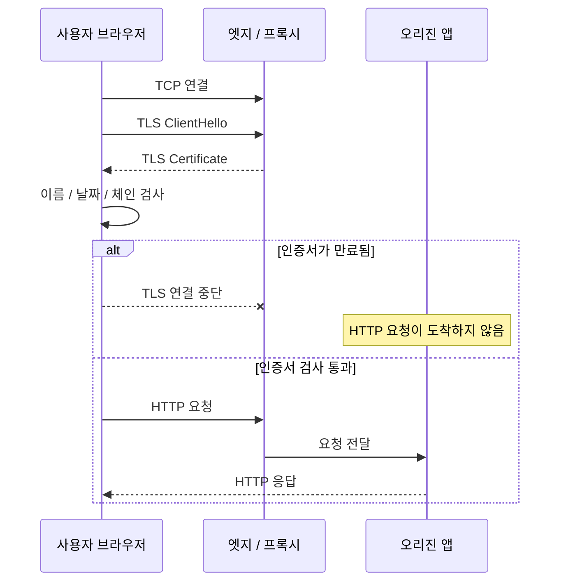
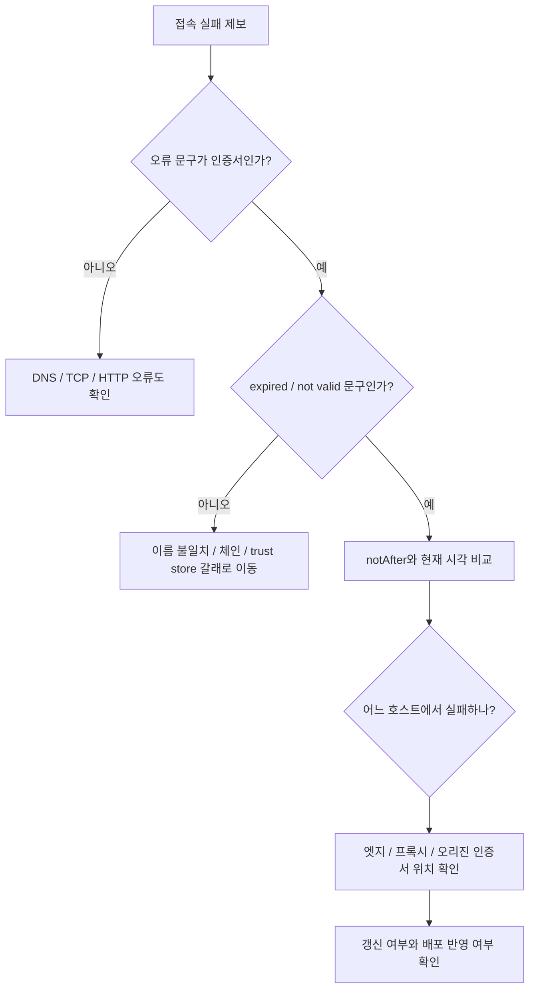
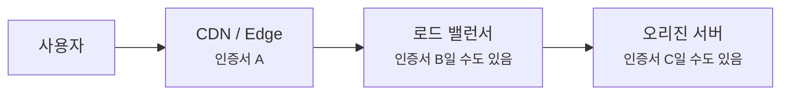
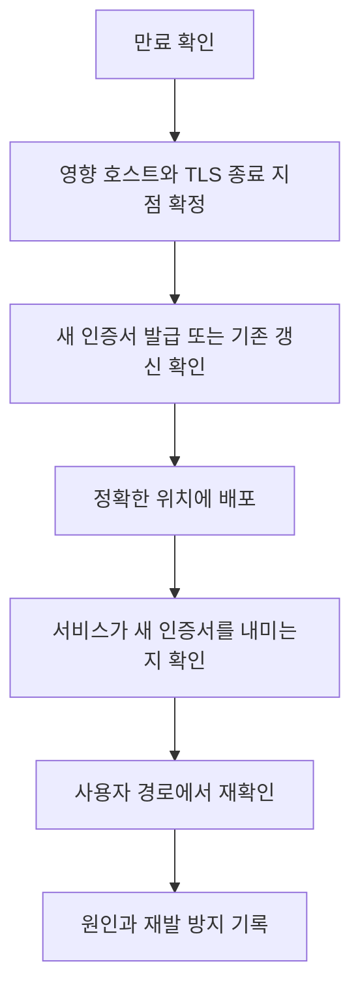

# 인증서 만료 장애는 어디서부터 읽어야 할까요?

> 어제까지 잘 열리던 사이트가 오늘 갑자기 **"안전하지 않음"** 으로 막히면 서버가 해킹된 것처럼 느껴지죠? **사실은 증표의 날짜가 지나서, 브라우저가 대화를 시작하기 전에 멈춘 장면**일 때가 많아요.

[TLS, SSL, 인증서는 뭐가 다를까요?](../basic/07-tls-ssl-and-certificates.md#browser-verification-flow){ data-preview }에서는 브라우저가 HTTPS 통로를 만들기 전에 **도메인 이름, 발급자, 유효 기간**을 확인한다는 큰 그림을 봤어요. 그리고 [TLS 인증서 체인과 신뢰 오류는 어떻게 읽어야 할까요?](./tls-cert-chain-and-trust-errors.md#signals-to-read){ data-preview }에서는 인증서 오류를 **이름, 날짜, 체인, 로컬 trust store** 네 갈래로 먼저 나누는 법을 봤죠.

이번 글은 그중에서도 운영에서 자주 만나는 **인증서 만료 장애**를 사례처럼 읽어볼게요.

장면은 이래요.

- 브라우저에서는 사이트가 열리지 않고 인증서 경고가 떠요.
- `curl` 에서는 `certificate has expired` 류의 오류가 보여요.
- 앱 서버 로그에는 요청이 거의 안 남아요.
- 그런데 모니터링은 한참 뒤에야 "사용자 접속 실패"로 시끄러워져요.

처음 보면 이상해요.

> *"사이트가 안 열리는데 왜 앱 로그에는 아무것도 없죠?"*

그 이유는 단순할 수 있어요. **HTTP 요청이 앱까지 도착하기 전에, TLS 인증서 검사에서 멈췄기 때문**이에요.

!!! note "이 글의 범위"
    여기서는 인증서 만료를 **실제 장애를 좁히는 읽기 순서**로 다룰게요. 특정 인증기관, 특정 CDN, 특정 웹서버의 갱신 방법을 매뉴얼처럼 다루지는 않아요. 제품별 명령과 화면은 다르지만, 만료 장애를 읽는 신호는 꽤 비슷해요.

---

## 먼저 한 장면으로 볼게요

월요일 아침에 운영 채널에 이런 메시지가 올라왔다고 해볼게요.

```text
사용자 제보: https://www.example.com 접속 시 개인정보 보호 오류가 뜹니다.
시작 시각: 2026-06-23 08:57 KST 전후
영향: 브라우저 접속 실패, 일부 API 호출 실패
```

당장 `curl -v` 로 확인해보면 이런 식의 출력이 보일 수 있어요. 아래 값은 읽기 연습용 예시예요.

```text
* TLSv1.3 (IN), TLS handshake, Certificate (11):
* SSL certificate problem: certificate has expired
* closing connection #0
curl: (60) SSL certificate problem: certificate has expired
```

여기서 중요한 줄은 `certificate has expired`예요. 이건 브라우저나 `curl` 이 **서버 인증서를 받기는 했지만, 그 인증서가 지금 시각 기준으로 더 이상 유효하지 않다**고 본 장면이에요.

| 기본편에서 잡은 감각 | 장애 장면에서는 | 실제로는 |
|---|---|---|
| 신분증을 확인함 | 서버 인증서를 받음 | TLS `Certificate` 메시지 |
| 신분증 날짜를 봄 | 유효 기간을 검사함 | `notBefore` / `notAfter` |
| 날짜가 지남 | 입장을 막음 | expired certificate error |
| 창구까지 못 감 | 앱 로그가 비어 보임 | HTTP 요청 전 TLS 실패 |
| 다른 지점은 열림 | 일부 경로만 정상 | CDN/프록시/오리진 인증서 차이 |

여기서 첫 번째 반전이 나와요.

**인증서 만료 장애는 웹 앱 장애처럼 보이지만, 실제로는 HTTP가 시작되기 전 장애일 수 있어요.**

---

## 요청은 어디에서 멈췄을까요?

인증서 만료를 볼 때는 먼저 요청 흐름 위에서 멈춘 위치를 잡아야 해요.



이 그림에서 핵심은 **만료 오류가 HTTP 상태 코드가 아닐 수 있다**는 점이에요.

브라우저는 `GET /` 요청을 보내기 전에, 먼저 TLS 과정에서 인증서를 확인해요. 그 인증서의 유효 기간이 이미 끝났다면 브라우저는 "이 상대와 보호된 통로를 열 수 없다"고 보고 멈출 수 있어요. 그러면 오리진 앱 입장에서는 요청을 받은 적이 없으니 access log가 조용해질 수 있죠.

!!! tip "앱 로그가 비어도 앱이 무조건 멀쩡하다는 뜻은 아니에요"
    다만 인증서 만료처럼 **HTTP 전에 멈추는 장애**에서는 앱 로그가 비어 있는 것이 오히려 중요한 신호일 수 있어요. "로그가 없다"를 곧장 "증상이 없다"로 읽지 말고, 요청이 어느 단계까지 갔는지 먼저 봐야 해요.

---

## 먼저 읽을 신호 다섯 가지 { #signals-to-read }

만료 장애에서 처음 볼 신호는 많지 않아요. 아래 다섯 가지면 시작점은 잡을 수 있어요.

| 신호 | 무엇을 확인하나요? | 왜 중요할까요? |
|---|---|---|
| 브라우저 경고 문구 | 만료인지, 이름 불일치인지, 신뢰 실패인지 | 인증서 오류의 갈래를 나눠요 |
| `curl -v` 오류 | CLI 기준으로도 만료인지 | 브라우저 UI 표현을 더 좁혀요 |
| 인증서 `notAfter` | 실제 만료 시각이 언제인지 | 장애 시작 시각과 맞춰봐요 |
| 어떤 호스트만 실패하는지 | `www`, `api`, apex, 내부 도메인 차이 | 인증서 배포 범위를 좁혀요 |
| 앱/프록시 로그 유무 | HTTP까지 도착했는지 | TLS 전 실패인지, 뒤쪽 오류인지 갈라요 |

이 다섯 가지를 순서대로 보면, 처음부터 인증서 재발급 명령을 치기보다 **어디의 어떤 인증서가 만료됐는지**를 먼저 좁힐 수 있어요.



이 흐름은 정답표가 아니라 **초기 분기표**예요. 만료처럼 보여도 실제로는 클라이언트 시간이 크게 틀렸거나, 중간 프록시에 예전 인증서가 남아 있을 수도 있거든요.

---

## `notBefore`와 `notAfter`는 날짜표예요

인증서 안에는 유효 기간이 들어 있어요. X.509 인증서의 validity에는 대략 **이 시각 전에는 아직 쓰면 안 됨**을 뜻하는 `notBefore`와, **이 시각 뒤에는 더 이상 쓰면 안 됨**을 뜻하는 `notAfter`가 있어요. RFC 5280에서도 인증서 유효 기간을 이 두 시각으로 표현해요.

예시로 보면 이런 느낌이에요.

```text
Validity
    Not Before: Mar 25 00:00:00 2026 GMT
    Not After : Jun 23 00:00:00 2026 GMT
```

여기서 조심할 점은 시간대예요. 인증서 출력은 보통 `GMT`나 `UTC` 기준으로 보이고, 장애 채널에서는 `KST` 같은 로컬 시간으로 말할 때가 많아요.

| 출력 | 읽는 법 |
|---|---|
| `Not Before: Mar 25 00:00:00 2026 GMT` | 2026-03-25 00:00 UTC부터 유효 |
| `Not After : Jun 23 00:00:00 2026 GMT` | 2026-06-23 00:00 UTC 이후로는 만료 |
| KST 기준 | UTC보다 9시간 빠르게 보임 |

그러니까 `Jun 23 00:00:00 GMT` 만료라면 한국 시간으로는 **2026-06-23 09:00:00 KST** 근처에서 갑자기 터지는 것처럼 보일 수 있어요.

!!! warning "날짜를 로컬 시간으로 착각하면 장애 시작 시각이 어긋나요"
    "아침 9시에 갑자기 터졌다"는 제보가 사실은 `00:00 UTC` 만료와 정확히 맞을 수 있어요. 인증서 날짜를 볼 때는 출력 시간대와 운영 채널의 시간대를 꼭 같이 봐야 해요.

---

## 실제 확인은 이렇게 나눠요

진단할 때는 한 도구만 믿기보다, 관점이 다른 도구를 짧게 나눠 보는 편이 좋아요.

### 1. 브라우저에서는 사용자가 보는 실패를 확인해요

브라우저 경고는 사용자 영향 확인에 좋아요. 다만 문구가 친절하게 바뀌거나, 보안 정책상 세부 원인을 숨겨 보일 수 있어요.

먼저 볼 것은 이 정도예요.

- 경고가 **만료**를 말하는지
- 접속한 주소가 정확히 무엇인지
- 다른 브라우저나 다른 네트워크에서도 같은지
- 오류가 apex 도메인, `www`, `api` 중 어디에서 나는지

브라우저가 "만료"라고 말해도, 거기서 바로 끝내지 말고 다음으로 CLI에서 같은 호스트를 확인해요.

### 2. `curl -v` 에서는 TLS 실패 지점을 더 좁혀요

```text
curl -v https://www.example.com/
```

예시 출력은 이런 식이에요.

```text
* Server certificate:
*  subject: CN=www.example.com
*  start date: Mar 25 00:00:00 2026 GMT
*  expire date: Jun 23 00:00:00 2026 GMT
* SSL certificate problem: certificate has expired
curl: (60) SSL certificate problem: certificate has expired
```

여기서 읽을 포인트는 세 가지예요.

1. `subject`나 SAN이 내가 접속한 이름과 맞는지
2. `expire date`가 현재 시각보다 과거인지
3. 오류가 `expired`인지, 아니면 `unable to get local issuer certificate` 같은 체인 오류인지

`curl` 출력 문구는 버전과 TLS 라이브러리에 따라 조금 다를 수 있어요. 그래도 **날짜 오류인지 체인 오류인지**를 나누는 데는 꽤 도움이 돼요.

### 3. `openssl s_client` 에서는 서버가 내미는 인증서를 봐요

```text
openssl s_client -connect www.example.com:443 -servername www.example.com -showcerts
```

여기서 `-servername`은 중요해요. 하나의 IP에 여러 HTTPS 사이트가 같이 있을 때, 서버는 SNI로 받은 이름을 보고 어떤 인증서를 내밀지 고를 수 있거든요. 이걸 빼면 **다른 기본 인증서**를 보고 엉뚱한 결론을 낼 수 있어요.

출력에서는 이런 부분을 봐요.

```text
depth=0 CN = www.example.com
verify error:num=10:certificate has expired
notAfter=Jun 23 00:00:00 2026 GMT
Verify return code: 10 (certificate has expired)
```

`Verify return code: 10` 같은 숫자는 OpenSSL 쪽 표현이에요. 숫자 자체보다 중요한 건, 이 도구도 **만료**를 말하고 있는지예요.

### 4. 프록시와 CDN에서는 "어느 인증서가 나갔는지"를 봐요

현실에서는 인증서가 한 곳에만 있지 않을 때가 많아요.



사용자가 보는 인증서는 보통 **가장 앞에서 TLS를 종료하는 곳**의 인증서예요. CDN이 TLS를 끝내면 사용자는 CDN 인증서를 보고, 로드 밸런서가 TLS를 끝내면 로드 밸런서 인증서를 봐요. 반대로 TLS 패스스루라면 오리진 인증서가 그대로 사용자에게 보일 수도 있어요.

그래서 만료 장애에서 꼭 물어야 해요.

> *"지금 사용자가 보고 있는 인증서는 어느 지점의 인증서일까요?"*

이 질문을 빼먹으면 오리진 인증서를 갱신했는데도 CDN 엣지에는 예전 인증서가 남아 있거나, 반대로 CDN은 정상인데 오리진 재암호화 구간에서만 실패하는 장면을 놓칠 수 있어요.

---

## 만료처럼 보이지만 원인이 조금 다른 경우도 있어요

인증서 날짜 오류가 보인다고 해서 항상 "갱신을 안 했다" 한 줄로 끝나지는 않아요. 운영에서는 보통 아래 갈래를 같이 봐야 해요.

| 보이는 장면 | 실제 가능성 | 다음 확인 |
|---|---|---|
| 모든 사용자가 동시에 실패 | 공개 인증서 자체 만료 | 앞단 인증서 만료 시각 확인 |
| 일부 지역만 실패 | 일부 엣지에 예전 인증서 잔존 | 지역별 `curl`, CDN 배포 상태 확인 |
| `www`만 실패 | 호스트별 인증서가 따로 있음 | SAN, SNI, 가상호스트 설정 확인 |
| 브라우저만 실패 | 로컬 시간, trust store, 정책 차이 | 다른 기기/시간/브라우저 비교 |
| 오리진 health check만 실패 | 엣지-오리진 TLS 구간 문제 | 오리진 인증서와 내부 CA 확인 |
| 갱신했는데 계속 실패 | 새 인증서가 배포되지 않음 | reload, listener, secret mount, CDN propagation 확인 |

여기서 두 번째 반전이 있어요.

**인증서 파일을 갱신한 것과, 실제로 서비스가 새 인증서를 내미는 것은 같은 일이 아니에요.**

웹서버가 파일을 다시 읽지 않았을 수도 있고, 로드 밸런서 listener가 옛 인증서를 붙잡고 있을 수도 있고, CDN 배포가 아직 모든 엣지에 퍼지지 않았을 수도 있어요.

---

## 복구할 때는 순서를 조심해야 해요

만료 장애를 복구할 때의 큰 흐름은 보통 이래요.



여기서 제일 많이 실수하는 지점은 `D`와 `E` 사이예요. 파일을 바꿨거나 콘솔에서 갱신 버튼을 눌렀다고 해서, 실제 사용자 경로에서 새 인증서가 보인다는 보장은 없어요.

확인할 때는 적어도 이렇게 봐요.

```text
curl -v https://www.example.com/
openssl s_client -connect www.example.com:443 -servername www.example.com </dev/null
```

그리고 가능하면 실패했던 **같은 호스트 이름**, **같은 경로**, **같은 네트워크 위치**에서 다시 확인해요. 오리진 직접 접속은 정상인데 사용자 경로의 CDN 인증서가 여전히 만료일 수 있고, 반대로 사용자 경로는 정상인데 내부 health check가 보는 오리진 인증서가 만료일 수도 있거든요.

!!! warning "만료 복구 중에 검증을 끄는 건 마지막 선택이어야 해요"
    급하다고 `-k`, `--insecure`, 인증서 검증 비활성화를 서비스 설정에 넣어버리면 장애는 숨겨져도 신뢰 검사가 사라져요. 진단용으로 잠깐 쓰는 것과 운영 경로에 남기는 것은 완전히 다른 일이에요.

---

## 잘못 읽기 쉬운 함정 여섯 가지 { #pitfalls }

**하나, 앱 로그가 조용하니 앱 문제가 아니라고만 생각하기.**  
TLS에서 멈추면 앱 로그가 조용할 수 있어요. 하지만 그 조용함은 **요청이 앱까지 못 갔다**는 신호로 읽어야 해요.

**둘, 인증서를 갱신했으니 복구됐다고 생각하기.**  
새 인증서가 실제 listener, CDN, 프록시, 오리진 경로에서 나가고 있는지 확인해야 해요.

**셋, apex와 `www`를 같은 인증서라고 가정하기.**  
`example.com`, `www.example.com`, `api.example.com`은 인증서와 배포 위치가 다를 수 있어요.

**넷, SNI 없이 확인하고 엉뚱한 인증서를 보는 것.**  
가상호스트 환경에서는 `openssl s_client`에 `-servername`을 넣어야 실제 호스트용 인증서를 볼 가능성이 높아요.

**다섯, UTC 만료 시각을 로컬 시간으로 읽는 것.**  
`00:00 GMT` 만료가 한국에서는 오전 9시 장애처럼 보일 수 있어요.

**여섯, `--insecure`로 성공하면 문제가 사라졌다고 착각하기.**  
검증을 끄면 만료 인증서도 지나갈 수 있어요. 그건 원인을 고친 게 아니라 검사를 건너뛴 거예요.

---

## 재발 방지는 "갱신"보다 "관측"이 먼저예요

인증서 만료는 기술적으로는 갱신하면 끝나는 문제처럼 보이지만, 운영적으로는 **미리 알 수 있었는데 놓친 문제**일 때가 많아요.

재발 방지에서는 보통 아래를 확인해요.

| 확인할 것 | 이유 |
|---|---|
| 만료일 모니터링 | 장애가 나기 전에 알림을 받아야 해요 |
| 실제 사용자 경로 검사 | 파일 만료일이 아니라 외부에서 보이는 인증서를 봐야 해요 |
| 호스트별 목록 | `www`, `api`, 내부 health check 도메인이 빠지기 쉬워요 |
| 갱신 자동화 결과 | 발급 성공과 배포 성공을 따로 봐야 해요 |
| 소유자와 대응 절차 | 알림을 받아도 누가 고치는지 모르면 늦어요 |

여기서 중요한 건 **인증서 저장소에 있는 만료일**만 보는 게 아니라, **사용자가 실제로 만나는 경로에서 어떤 인증서가 보이는지**를 보는 거예요. 특히 CDN, 로드 밸런서, 오리진이 함께 있는 구조에서는 내부 파일 하나의 상태보다 바깥에서 보이는 결과가 더 중요할 수 있어요.

---

## 더 깊이 보고 싶다면

- [RFC 5280](https://www.rfc-editor.org/rfc/rfc5280.html) — X.509 인증서와 인증서 경로 검증의 기준 문서예요. 이 글에서는 validity의 `notBefore` / `notAfter` 감각만 가볍게 가져왔어요.
- [RFC 8446](https://www.rfc-editor.org/rfc/rfc8446.html) — TLS 1.3 기준 문서예요. 인증서가 TLS 핸드셰이크 안에서 어떤 메시지로 오가는지 더 깊게 볼 때 도움이 돼요.

## 자, 정리해볼까요?

!!! abstract "오늘 우리가 본 것"
    - 인증서 만료 장애는 웹 앱 장애처럼 보이지만, 실제로는 **HTTP 요청 전에 TLS 검사에서 멈춘 장면**일 수 있어요.
    - 먼저 브라우저 경고, `curl -v`, 인증서 `notAfter`, 영향 호스트, 앱/프록시 로그 유무를 같이 봐야 해요.
    - `notAfter` 출력은 보통 UTC/GMT 기준이라서, 운영 채널의 로컬 시간과 맞춰 읽어야 해요.
    - 인증서를 갱신한 것과 실제 사용자 경로에서 새 인증서가 나가는 것은 다를 수 있어요.
    - 재발 방지는 발급 자동화뿐 아니라 **외부에서 보이는 인증서 만료일 관측**까지 포함해야 해요.

## 이어서 보면 좋은 글

- [TLS 인증서 체인과 신뢰 오류는 어떻게 읽어야 할까요?](./tls-cert-chain-and-trust-errors.md#signals-to-read){ data-preview } — 만료뿐 아니라 이름 불일치, 체인 누락, trust store 차이를 같이 나눠 읽고 싶을 때 좋아요.
- [TLS 종료와 TLS 패스스루는 어디서 갈라질까요?](./tls-termination-vs-passthrough.md){ data-preview } — 사용자가 보는 인증서가 CDN, 로드 밸런서, 오리진 중 어디에서 나오는지 더 정확히 나눠볼 수 있어요.
- [curl verbose와 timing은 어디부터 읽어야 할까요?](./curl-verbose-and-timing.md){ data-preview } — TLS 실패를 CLI 출력에서 더 차근차근 읽고 싶을 때 이어서 보면 좋아요.
