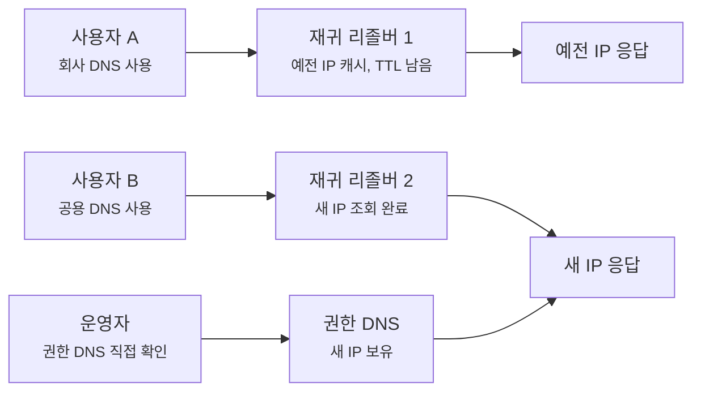
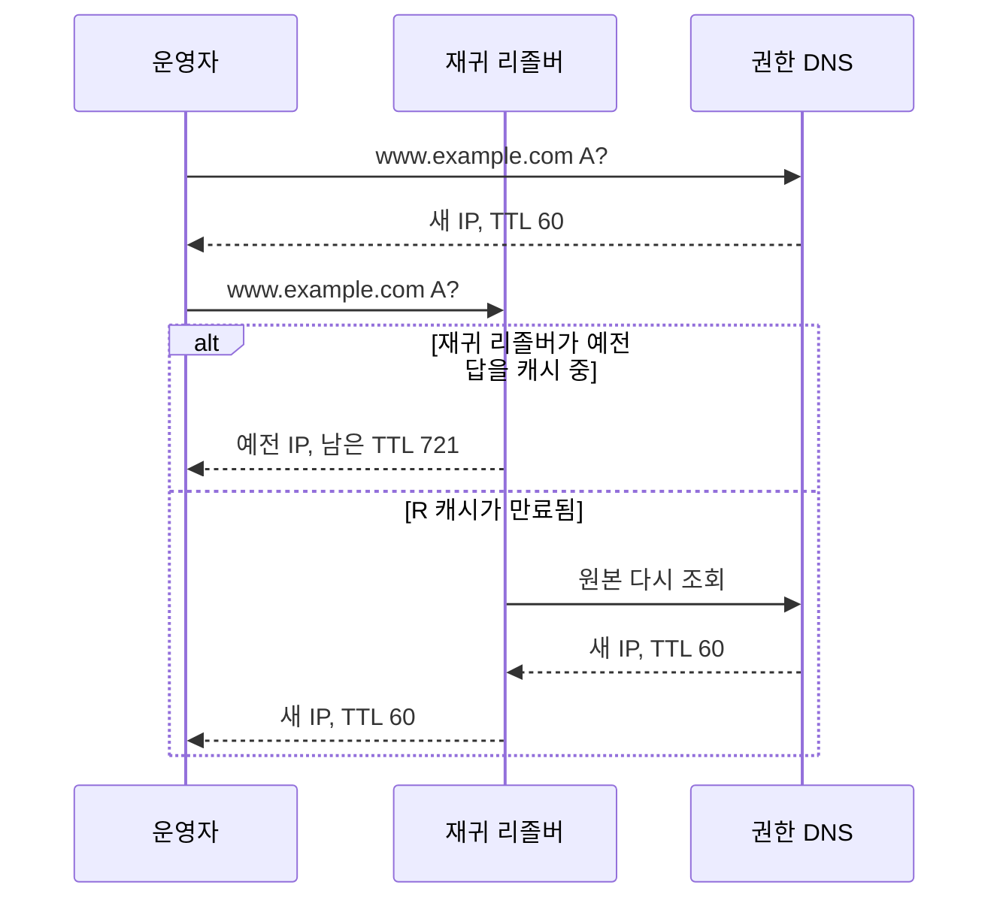
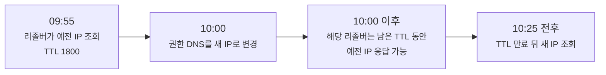
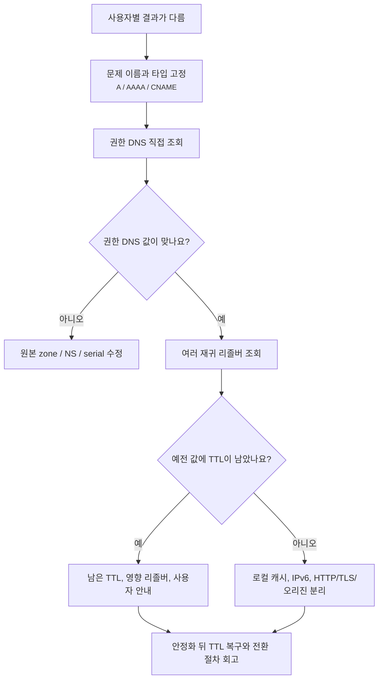

# DNS가 됐다 안 됐다 하는 장애는 TTL부터 어떻게 읽어야 할까요?

> DNS 장애는 전부가 한꺼번에 망가질 것 같죠? **사실은 어떤 사람에게는 정상이고, 어떤 사람에게는 장애처럼 보이는 시간이 꽤 길게 남을 수 있어요.**

[DNS는 어떻게 이름을 IP 주소로 바꿀까요?](../basic/04-dns.md){ data-preview }에서는 DNS가 도메인 이름을 IP 주소로 바꿔주는 안내 데스크라는 큰 그림을 봤어요. 그리고 [DNS TTL과 캐시는 왜 바뀐 주소를 바로 안 보여줄까요?](./dns-ttl-and-cache-staleness.md){ data-preview }에서는 재귀 리졸버가 답을 TTL 동안 캐시할 수 있다는 것도 봤죠.

이번 글은 그 지식이 실제 장애처럼 보이는 장면에서 어떻게 쓰이는지 볼게요.

장면은 이래요.

- 새 서버로 DNS 레코드를 바꿨어요.
- 내 노트북에서는 새 IP가 보여요.
- 그런데 고객 일부는 계속 예전 서버로 가요.
- 다른 지역 모니터링은 정상과 실패가 번갈아 보여요.
- 팀 채널에서는 "DNS가 플랩한다"는 말이 나오기 시작해요.

처음 보면 DNS가 랜덤하게 흔들리는 것 같아요. 근데요, DNS가 정말로 매초 값을 바꾸고 있을 수도 있지만, 더 흔한 장면은 **여러 재귀 리졸버가 서로 다른 캐시 상태를 보고 있는 것**이에요.

!!! note "이 글의 범위"
    여기서는 DNS가 됐다 안 됐다 하는 증상을 **TTL과 캐시 관점으로 좁히는 읽기 순서**에 집중해요. 특정 DNS 사업자의 장애 공지, 특정 제품의 레코드 편집 화면, Anycast 라우팅 문제까지 한꺼번에 다루지는 않을게요.

---

## 먼저 같은 안내문을 보고 있는지 확인해요

건물 입구 안내판을 새 주소로 바꿨다고 해볼게요. 본사 안내판은 이미 새 주소예요. 그런데 각 지점 안내 데스크 직원들이 어제 복사해 간 메모를 아직 들고 있다면요?

어떤 지점에서는 새 주소를 알려주고, 어떤 지점에서는 예전 주소를 알려줄 수 있어요. 본사 안내판이 다시 예전 주소로 바뀐 게 아니라, **메모를 새로 받아간 시각이 지점마다 다른 것**이죠.

DNS도 비슷해요.

| 안내 데스크 장면 | DNS 장애 장면 |
|---|---|
| 본사 주소록 | 권한 DNS 서버 |
| 지점 직원의 복사 메모 | 재귀 리졸버 캐시 |
| 메모 유효 시간 | TTL |
| 새 메모를 받은 지점 | 새 레코드를 보는 리졸버 |
| 예전 메모가 아직 유효한 지점 | 예전 레코드를 캐시한 리졸버 |

여기서 핵심 질문은 이거예요.

> *"지금 내가 보는 답은 권한 DNS의 원본일까요, 어느 재귀 리졸버의 캐시일까요?"*

이 질문을 빼먹으면 "DNS가 이상하다"는 말이 너무 커져요. 권한 DNS가 틀린 건지, 재귀 리졸버 캐시가 아직 남은 건지, 내 로컬 캐시가 붙잡고 있는 건지 갈라지지 않거든요.



이 그림에서 겉으로는 "DNS가 사용자마다 다르다"로 보이지만, 실제로는 조회한 위치가 달라요. 그래서 장애 초반에는 **누가, 어느 리졸버를 통해, 어떤 TTL이 남은 답을 봤는지**를 먼저 모아야 해요.

## 먼저 읽을 신호 여섯 가지 { #signals-to-read }

DNS 플랩처럼 보이는 장면에서는 레코드를 계속 바꾸기 전에 신호를 짧게 잡아야 해요.

| 신호 | 무엇을 보나요? | 왜 중요할까요? |
|---|---|---|
| 문제 도메인과 레코드 타입 | `A`, `AAAA`, `CNAME` 중 무엇인지 | 타입이 다르면 캐시와 경로도 따로 봐야 해요 |
| 권한 DNS 결과 | 원본 레코드가 지금 무엇인지 | 설정 자체가 맞는지 먼저 확인해요 |
| 재귀 리졸버별 결과 | 리졸버마다 새 값/예전 값이 갈리는지 | 캐시 상태 차이를 확인해요 |
| 남은 TTL | 예전 답이 얼마나 더 남았는지 | 기다리면 사라질 캐시인지 가늠해요 |
| SOA/음성 캐시 신호 | 없는 이름이나 삭제된 레코드가 캐시됐는지 | `NXDOMAIN`도 한동안 남을 수 있어요 |
| 변경 시각과 기존 TTL | 언제 낮췄고 언제 바꿨는지 | 이미 받아간 긴 TTL을 설명해요 |

예를 들어 `www.example.com`의 A 레코드를 새 서버로 바꿨다고 해볼게요. 아래 `dig` 출력과 이 글에 이어지는 IP·TTL·시각 값은 모두 설명을 위해 만든 **합성 예시**이며, 실제 장애에서 수집한 출력은 아니에요.

```text
$ dig @1.1.1.1 www.example.com A +noall +answer
www.example.com.      41    IN    A    198.51.100.20

$ dig @8.8.8.8 www.example.com A +noall +answer
www.example.com.     721    IN    A    192.0.2.10
```

두 줄을 보고 바로 "1.1.1.1은 맞고 8.8.8.8은 틀렸다"고 끝내면 조금 위험해요. 더 정확히는 이렇게 읽는 편이 좋아요.

- `1.1.1.1`은 새 IP `198.51.100.20`을 보고 있어요.
- `8.8.8.8`은 예전 IP `192.0.2.10`을 아직 캐시하고 있어요.
- 예전 IP 응답의 TTL이 `721`초 남아 있으니, 이 리졸버를 쓰는 사용자는 한동안 예전 서버로 갈 수 있어요.

!!! warning "다른 리졸버 결과가 다르다고 바로 계속 수정하지 마세요"
    같은 레코드를 짧은 시간에 여러 번 바꾸면 증거가 더 흐려질 수 있어요. 먼저 권한 DNS 원본, 재귀 리졸버별 응답, 남은 TTL, 변경 시각을 기록한 뒤에 다음 조치를 정하는 편이 좋아요.

## 권한 DNS와 재귀 리졸버를 나눠서 봐요

DNS 전환 장애에서 제일 먼저 갈라야 하는 건 **원본**과 **캐시**예요.



권한 DNS는 도메인의 원본 레코드를 들고 있는 쪽이에요. 재귀 리졸버는 사용자 대신 권한 DNS를 찾아가고, 답을 TTL 동안 보관할 수 있는 쪽이고요.

그래서 확인도 두 갈래로 나눠요.

```bash
dig @ns1.example-dns.net www.example.com A +noall +answer
dig @1.1.1.1 www.example.com A +noall +answer
dig @8.8.8.8 www.example.com A +noall +answer
```

첫 번째는 권한 DNS를 직접 보는 의도예요. 실제 권한 DNS 이름은 도메인마다 다르니 `dig NS example.com`으로 먼저 확인해야 해요. 두 번째와 세 번째는 서로 다른 재귀 리졸버가 어떤 답을 들고 있는지 보는 의도고요.

| 확인 결과 | 읽는 법 |
|---|---|
| 권한 DNS도 예전 IP | 원본 설정이 아직 바뀌지 않았거나 다른 권한 서버가 엇갈릴 수 있어요 |
| 권한 DNS는 새 IP, 일부 재귀 리졸버는 예전 IP | 예전 답 캐시가 TTL 동안 남아 있을 가능성이 커요 |
| 권한 DNS 서버마다 값이 다름 | DNS 제공자 동기화, zone 배포, serial 차이를 확인해야 해요 |
| 모든 재귀 리졸버가 새 IP, 일부 사용자만 예전 IP | 로컬 DNS 캐시, 브라우저/앱 캐시, 네트워크별 프록시를 봐야 해요 |

여기서 중요한 반전이 있어요.

**권한 DNS가 새 값을 보여준다고 해서, 모든 사용자가 이미 새 값을 본다는 뜻은 아니에요.**

## TTL은 남은 시간을 보여줘요

TTL은 원본에 적힌 숫자이기도 하지만, 재귀 리졸버 응답에서는 **남은 시간**처럼 보일 때가 많아요.

예를 들어 전환 전 레코드가 이랬다고 해볼게요.

```text
www.example.com.    1800    IN    A    192.0.2.10
```

운영자가 10:00에 새 IP로 바꿨어요.

```text
www.example.com.      60    IN    A    198.51.100.20
```

그런데 어떤 재귀 리졸버는 09:55에 예전 답을 받아갔어요. 전환 시각 10:00에는 아직 1500초 정도가 남아 있을 수 있죠.



이때 "10:00에 TTL을 60으로 바꿨는데 왜 아직 25분이나 예전 IP가 보이죠?"라는 질문이 나와요.

이유는 단순해요. **이미 받아간 예전 답의 TTL은 나중에 원본 TTL을 낮춘다고 자동으로 줄어들지 않아요.** 새 TTL 60은 새로 받아가는 답부터 의미가 있어요.

그래서 큰 전환 전에는 보통 이런 순서가 더 안전해요.

| 시점 | 행동 | 이유 |
|---|---|---|
| 전환 전 충분히 이른 시각 | 기존 TTL을 낮춤 | 리졸버들이 짧은 TTL 답을 새로 받아가게 해요 |
| 기존 긴 TTL만큼 대기 | 예전 긴 캐시가 빠질 시간을 둠 | 이미 받아간 긴 답을 기다려요 |
| 전환 시점 | 레코드 값을 새 IP로 변경 | 새 값이 짧은 TTL로 퍼지게 해요 |
| 안정화 뒤 | TTL을 다시 적절히 올림 | 권한 DNS 조회 부담을 줄여요 |

!!! tip "TTL 낮추기는 전환 버튼이 아니라 준비 동작이에요"
    TTL을 낮추는 행위 자체가 이미 퍼진 캐시를 지우지는 않아요. 전환 전에 미리 낮추고, 기존 긴 TTL이 빠질 시간을 둬야 의미가 커져요.

## "됐다 안 됐다"는 네 가지 모양으로 갈라져요

DNS가 흔들린다고 말할 때 실제 모양은 하나가 아니에요. 처음에는 아래 네 갈래로 나눠보면 좋아요.

| 겉으로 보이는 증상 | 먼저 의심할 갈래 | 같이 볼 신호 |
|---|---|---|
| 사용자마다 다른 IP를 봄 | 재귀 리졸버 캐시 차이 | 리졸버별 `dig`, 남은 TTL |
| 같은 사용자가 새로고침마다 다른 IP를 봄 | 여러 A/AAAA 값, 로드밸런싱, 클라이언트 선택 | 전체 answer set, IPv4/IPv6 차이 |
| 삭제한 이름이 계속 `NXDOMAIN` | 음성 캐시 | SOA minimum, negative TTL |
| 권한 DNS 서버마다 값이 다름 | zone 배포 불일치 | NS별 직접 조회, SOA serial |

특히 두 번째 줄은 TTL 문제처럼 보이지만 아닐 수 있어요. A 레코드가 여러 개면 DNS는 여러 주소를 돌려줄 수 있고, 클라이언트는 IPv4와 IPv6 중 더 잘 닿는 쪽을 고르기도 해요. 이때는 "예전 값과 새 값이 섞였다"가 아니라 **원래 여러 값을 주는 설정인지**를 먼저 봐야 해요. 아래도 그 모양만 보여주는 합성 출력이에요.

```text
$ dig www.example.com A +short
198.51.100.20
198.51.100.21
```

이런 응답은 그 자체로 장애가 아니에요. 하지만 한 주소만 실패한다면 DNS보다 뒤쪽의 서버, 로드 밸런서, 방화벽, 배포 상태를 같이 봐야 해요.

## 없는 이름도 잠깐 기억될 수 있어요

DNS 전환에서 또 자주 헷갈리는 장면은 `NXDOMAIN`이에요. 새 서브도메인을 만들기 전에 누군가가 먼저 조회했는데, 그때 "그런 이름 없음"이라는 답을 받아갔다고 해볼게요. 아래 역시 음성 캐시의 모양을 보여주기 위한 합성 출력이에요.

```text
$ dig @8.8.8.8 api-new.example.com A +noall +answer +authority
example.com.    600    IN    SOA    ns1.example-dns.net. hostmaster.example.com. ...
```

그 뒤 운영자가 `api-new.example.com` 레코드를 만들었어요. 권한 DNS에는 이제 존재해요. 그런데 어떤 재귀 리졸버는 여전히 한동안 없다고 말할 수 있어요. 성공한 A 레코드만 캐시되는 게 아니라, **없는 이름이라는 답도 음성 캐시로 남을 수 있기 때문**이에요.

RFC 2308은 이런 음성 응답 캐시의 동작을 정리해요. 운영자가 자세한 숫자를 볼 때는 응답의 SOA 정보와 리졸버별 남은 TTL을 같이 확인해야 해요.

!!! warning "새 이름을 만들기 직전에 테스트 조회를 반복하면 오히려 헷갈릴 수 있어요"
    레코드를 만들기 전에 여기저기서 조회하면 "없음"이라는 답이 일부 리졸버에 캐시될 수 있어요. 새 이름을 공개해야 한다면 레코드를 먼저 준비하고, 필요한 검증은 권한 DNS와 제한된 리졸버로 나눠서 보는 편이 좋아요.

## 잘못 읽기 쉬운 함정

DNS TTL 장애는 눈에 보이는 증상이 들쭉날쭉해서 결론을 빨리 내리기 쉬워요. 특히 아래 함정은 자주 나와요.

| 함정 | 왜 위험할까요? | 더 나은 읽기 |
|---|---|---|
| "내 컴퓨터는 정상이라 장애가 끝났다" | 다른 리졸버에는 예전 TTL이 남아 있을 수 있어요 | 여러 재귀 리졸버와 사용자 지역을 나눠 봐요 |
| "권한 DNS가 새 값이니 사용자가 다 새 값을 본다" | 캐시는 권한 DNS와 별도로 남아요 | 권한 DNS와 재귀 리졸버 결과를 분리해요 |
| "TTL을 지금 낮췄으니 곧바로 반영된다" | 이미 받아간 긴 TTL은 그대로 남을 수 있어요 | 낮춘 시각과 기존 TTL을 같이 봐요 |
| "DNS가 플랩하니 레코드를 다시 바꾸자" | 변경을 반복하면 캐시 상태가 더 복잡해져요 | 증거를 남기고 원본/캐시/로컬을 나눠요 |
| "NXDOMAIN은 캐시되지 않는다" | 없는 이름도 음성 캐시될 수 있어요 | SOA와 negative TTL 신호를 확인해요 |

운영 채널에서는 "전파가 덜 됐다"는 말이 편해요. 하지만 실제로 조치해야 할 때는 조금 더 작게 말하는 편이 좋아요.

> *"권한 DNS는 새 값이고, 일부 재귀 리졸버가 예전 A 레코드를 남은 TTL 동안 캐시 중이에요."*

이렇게 말하면 기다릴 문제인지, 설정을 고칠 문제인지, 사용자 안내를 해야 할 문제인지 훨씬 분명해져요.

## 실제 대응 순서는 이렇게 잡아요

DNS 플랩 의심 장면에서 바로 할 수 있는 대응 순서를 하나로 묶으면 이래요.



이 순서에서 중요한 건 **도메인 이름과 타입을 고정하는 것**이에요. `www.example.com A`를 보는 중에 갑자기 `example.com AAAA`나 `api.example.com CNAME` 이야기를 섞으면 판단이 흐려져요. DNS 문제는 이름과 타입이 조금만 달라도 완전히 다른 레코드예요.

실제 기록은 아래 정도면 시작하기 충분해요. 다만 아래 기록 자체는 형식을 보여주기 위한 합성 예시예요.

```text
증상 시각: 2026-06-23 10:04 KST
대상: www.example.com A
기대값: 198.51.100.20
예전값: 192.0.2.10

권한 DNS:
  ns1.example-dns.net -> 198.51.100.20 TTL 60
  ns2.example-dns.net -> 198.51.100.20 TTL 60

재귀 리졸버:
  1.1.1.1 -> 198.51.100.20 TTL 41
  8.8.8.8 -> 192.0.2.10 TTL 721
  회사 DNS -> 192.0.2.10 TTL 1140

해석:
  원본은 새 값으로 바뀌었고, 일부 재귀 리졸버가 예전 답을 캐시 중.
```

이렇게 적어두면 "DNS가 이상해요"보다 훨씬 실행 가능한 상태가 돼요. 남은 TTL 동안 예전 서버를 유지해야 하는지, 예전 서버에서 새 서버로 임시 리다이렉트나 프록시를 둘 수 있는지, 사용자에게 어느 정도 시간을 안내해야 하는지 판단할 수 있거든요.

## 자, 정리해볼까요?

!!! abstract "오늘 우리가 배운 것"
    - DNS가 됐다 안 됐다 하는 것처럼 보여도, 실제로는 **재귀 리졸버별 캐시 상태 차이**일 수 있어요.
    - 먼저 **권한 DNS 원본**과 **재귀 리졸버 캐시**를 나눠서 봐야 해요.
    - TTL은 전환 예약 시간이 아니라, 이미 받아간 답이 **얼마나 더 캐시될 수 있는지**를 읽는 시간표예요.
    - TTL을 낮추는 일은 전환 직전 버튼이 아니라, 기존 긴 캐시가 빠질 시간을 두는 **준비 동작**이에요.
    - 없는 이름이라는 `NXDOMAIN` 응답도 음성 캐시로 잠깐 남을 수 있어요.

## 이어서 보면 좋은 글

- [DNS TTL과 캐시는 왜 바뀐 주소를 바로 안 보여줄까요?](./dns-ttl-and-cache-staleness.md){ data-preview } — TTL과 재귀 리졸버 캐시의 기본 동작을 더 차분히 보고 싶을 때 좋아요.
- [dig 출력은 어디부터 읽어야 할까요?](./dns-lookup-with-dig.md){ data-preview } — `ANSWER`, `AUTHORITY`, `SERVER`, TTL 줄을 도구 화면에서 직접 읽고 싶을 때 이어서 보면 좋아요.
- [DNS 재귀 조회와 반복 조회는 뭐가 다를까요?](./dns-resolver-recursion-vs-iteration.md){ data-preview } — 사용자가 권한 DNS에 직접 묻지 않는 이유와 재귀 리졸버의 역할을 다시 잡을 수 있어요.
