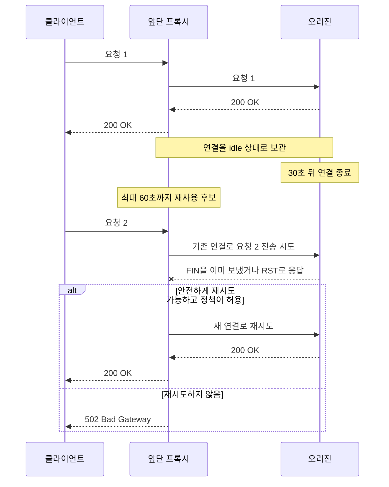
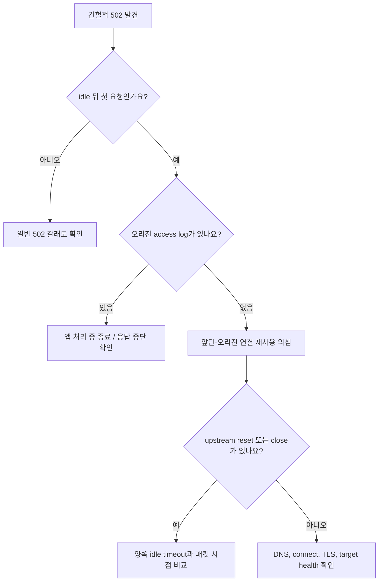
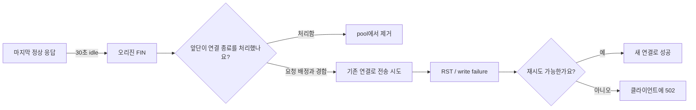
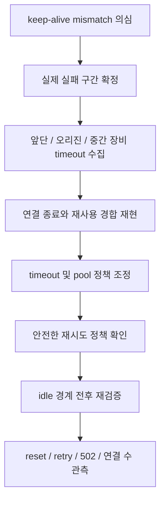

# 한동안 조용한 뒤 첫 요청만 502가 나는 이유는 뭘까요?

> 계속 실패하면 고장 난 곳을 찾기 쉬울 것 같죠? **사실은 한동안 조용한 뒤 첫 요청만 실패하는 장애가 더 찾기 어려워요.**

[Proxy, Reverse Proxy, 그리고 Load Balancer](../basic/24-proxy-reverse-proxy-and-load-balancer.md){ data-preview }에서는 브라우저와 앱 사이에 앞단 프록시가 설 수 있다는 큰 그림을 봤어요. 그리고 [Connection reuse, Keep-Alive, Pooling](./connection-reuse-keepalive-and-pooling.md){ data-preview }에서는 앞단이 오리진 연결을 매번 새로 열지 않고 pool에 남겨뒀다가 다시 쓸 수 있다는 걸 봤죠.

이번 글은 그중에서도 **앞단은 아직 쓸 수 있다고 생각했는데, 오리진은 이미 닫아버린 연결**이 실제 장애에서 어떻게 보이는지 따라가 볼게요.

장면은 이래요.

- 평소 요청은 대부분 `200 OK`예요.
- 트래픽이 잠깐 끊긴 뒤 첫 요청에서만 가끔 `502 Bad Gateway`가 나요.
- 바로 새로고침하면 정상으로 돌아와요.
- 실패한 시각의 앱 access log에는 요청이 없을 때가 있어요.
- 앞단 로그에는 `connection reset`, `upstream prematurely closed`, `remote close` 같은 표현이 보여요.

이 증상만 보면 앱이 가끔 죽거나, 특정 서버가 불안정하거나, 사용자 네트워크가 끊긴 것처럼 느껴져요.

근데요, 실패한 건 새 연결이 아닐 수 있어요.

> *"앞단이 pool에서 꺼낸 그 연결은 정말 아직 살아 있었을까요?"*

!!! note "이 글의 범위"
    여기서는 HTTP/1.1 기반의 앞단-오리진 연결 재사용 장면을 중심으로 봐요. 제품마다 pool 관리, 사전 연결 검사, 재시도, 로그 문구, 502 변환 방식은 달라요. 그래서 특정 로그 한 줄을 정답처럼 외우기보다 **idle 시간 뒤 첫 요청**, **오리진 로그 유무**, **재시도 흔적**, **FIN/RST 시점**을 함께 읽는 데 집중할게요.

---

## 먼저 장애 타임라인부터 맞춰볼게요

쇼핑몰 API 앞에 리버스 프록시가 있고, 그 뒤에 오리진 앱 서버가 있다고 해볼게요.

앞단은 사용이 끝난 upstream 연결을 최대 60초 동안 pool에 남겨두고, 오리진은 30초 동안 요청이 없으면 연결을 닫는 설정이에요.

| 위치 | 연결을 바라보는 정책 |
|---|---|
| 앞단 프록시 | idle 연결을 60초까지 재사용 후보로 보관 |
| 오리진 서버 | 30초 동안 요청이 없으면 연결 종료 |
| 사용자 | 이 두 설정을 볼 수 없고 HTTP 응답만 봄 |

처음 요청은 정상이에요.

```text
10:00:00  request #1  -> 200 OK
10:00:00  upstream connection becomes idle
10:00:30.000  origin starts closing the idle connection
10:00:30.001  request #2 is assigned to the same connection
10:00:30.002  upstream write/read fails
10:00:30.003  client receives 502 or proxy retries
```

이 타임라인에서 중요한 건 `10:00:30` 근처의 아주 짧은 순간이에요. 오리진의 종료 신호를 앞단이 처리해 pool에서 빼는 일과, 마침 도착한 요청을 그 연결에 배정하는 일이 엇갈릴 수 있어요.



이 그림은 "timeout이 다르면 반드시 502가 난다"는 뜻은 아니에요. 정상 구현은 종료 신호를 감지한 연결을 pool에서 빼요. 다만 연결 종료와 다음 요청 배정이 비슷한 순간에 일어나거나, 중간 장비가 조용히 상태를 지웠거나, 제품별 검사·재시도 정책이 다르면 **짧은 경합 구간**에서 실패가 드러날 수 있어요.

HTTP/1.1 표준도 연결은 의도와 상관없이 언제든 닫힐 수 있고, 서버가 idle 연결을 닫으려는 순간 클라이언트가 새 요청을 보내는 경합이 생길 수 있다고 설명해요. 그래서 persistent connection을 쓰는 양쪽은 비동기 종료를 예상해야 해요.

## 기본 감각을 실제 장애 신호로 바꿔봐요

연결 재사용 글에서 본 감각을 이번 사례에 옮기면 이렇게 돼요.

| 기본 감각 | 이번 장애 장면 | 실제 용어 |
|---|---|---|
| 통화를 끊지 않고 다음 용건을 기다림 | 응답 뒤 연결을 pool에 보관 | persistent connection |
| 한쪽은 30초 뒤 전화를 끊음 | 오리진이 먼저 idle 연결 종료 | origin idle timeout |
| 다른 쪽은 60초 동안 기다린다고 생각함 | 앞단이 더 오래 재사용 후보로 유지 | proxy keep-alive timeout |
| 끊긴 줄로 다시 말하려 함 | 기존 upstream 연결로 요청 전송 | stale connection reuse |
| 새 줄로 다시 전화함 | 새 TCP 연결로 재시도 | retry on fresh connection |
| 창구가 대신 오류표를 줌 | 앞단이 사용자에게 502 반환 | gateway-generated error |

여기서 `stale connection`은 캐시의 오래된 사본을 말하는 게 아니에요. **pool에는 남아 있지만 실제 peer 상태와 어긋난 연결**을 설명하기 위한 운영 표현에 가까워요.

## 먼저 읽을 신호 여섯 가지 { #signals-to-read }

이 장애는 에러율이 낮아서 한 줄만 보면 우연처럼 지나가기 쉬워요. 아래 신호를 같은 시간축에 모아야 패턴이 보여요.

| 신호 | 무엇을 확인하나요? | 왜 중요할까요? |
|---|---|---|
| 실패 전 idle 간격 | 마지막 정상 요청 뒤 몇 초 후 실패했는지 | 특정 timeout 값과 맞는지 봐요 |
| 앞단의 upstream 오류 | reset, close, write/read failure가 있는지 | 앞단-오리진 구간 실패인지 좁혀요 |
| 오리진 access log | 실패한 요청이 앱까지 도착했는지 | HTTP 처리 전 실패인지 봐요 |
| 재시도 횟수와 target | 같은 요청을 새 연결이나 다른 서버로 다시 보냈는지 | 사용자가 502를 봤는지 숨겨졌는지 갈라요 |
| upstream connect time | 실패 직전 연결이 새로 만들어졌는지 | 재사용 연결인지 새 연결인지 추정해요 |
| 패킷의 FIN/RST | 누가 먼저 닫았고 요청과 얼마나 가까웠는지 | 로그 해석을 전송 계층에서 확인해요 |



이 흐름에서 `오리진 로그가 없음`은 원인 확정이 아니에요. 로그 수집 누락일 수도 있고, 다른 프로세스나 다른 target으로 갔을 수도 있어요. 하지만 request id와 target 주소까지 맞췄는데도 앱 access log가 없다면, **앱의 HTTP 핸들러보다 앞에서 실패했을 가능성**이 커져요.

## 로그는 한 요청의 양쪽 얼굴로 읽어요

아래는 읽기 연습용 예시예요. 특정 제품의 실제 고정 문구는 아니에요.

앞단 access log에는 이렇게 남았다고 해볼게요.

```text
2026-06-24T10:00:30.217+09:00
request_id=req_a81f
status=502
upstream=10.0.2.17:8080
upstream_connect_time=0.000
upstream_response_time=0.001
retry_count=0
error="upstream connection reset before response headers"
```

여기서 읽을 신호는 네 가지예요.

1. `status=502`라서 앞단이 오류 응답을 만들었을 가능성이 있어요.
2. `upstream=10.0.2.17:8080`으로 어느 target이었는지 알 수 있어요.
3. `upstream_connect_time=0.000`은 새 연결 비용이 거의 없거나 기존 연결을 사용한 장면일 수 있어요.
4. `before response headers`라서 오리진 응답 헤더를 받기 전에 연결이 끝났어요.

같은 시각의 오리진 access log에는 `req_a81f`도, 해당 path도 없어요.

```text
10:00:00 GET /healthz 200
10:00:00 GET /api/cart 200
10:00:31 GET /api/cart 200
```

이때 `10:00:31`의 성공 요청은 사용자의 새로고침일 수도 있고, 앞단이 새 연결로 다시 보낸 요청일 수도 있어요. 그래서 시간만 보지 말고 request id, forwarded request id, source port, retry attempt 같은 연결 고리를 같이 봐야 해요.

| 관측 조합 | 더 가까운 해석 |
|---|---|
| 앞단 502, 오리진 요청 없음, connect time 0에 가까움 | 재사용 연결에서 요청 전송/응답 시작 전 실패 가능성 |
| 앞단 502, 오리진 요청 있음, 앱 응답 완료 없음 | 앱 처리 중 종료나 응답 전송 실패 가능성 |
| 앞단 502 뒤 같은 request id로 다른 target 200 | 앞단 재시도가 사용자 실패를 가렸을 가능성 |
| 매번 새 connect가 실패 | keep-alive보다 포트, 방화벽, health, TLS 문제 가능성 |
| 특정 target에서만 반복 | 서버별 timeout 또는 배포 설정 차이 가능성 |

!!! tip "`connect_time=0` 하나만으로 재사용을 확정하지는 않아요"
    로그의 `0`, `-`, 빈 값이 무엇을 뜻하는지는 제품마다 달라요. 연결 재사용 여부를 직접 기록하는 필드가 있다면 그 값을 우선하고, 없으면 connect time, connection id, source port, 패킷을 조합해 추정해야 해요.

## 패킷에서는 FIN과 RST의 순서를 봐요

로그만으로 애매하면 앞단과 오리진 사이를 짧게 캡처할 수 있어요.

아래 예시는 실제 캡처가 아니라 흐름을 읽기 위한 축약 예시예요.

```text
10:00:00.120 P -> O  HTTP GET /api/cart
10:00:00.128 O -> P  HTTP/1.1 200 OK
10:00:30.129 O -> P  TCP FIN, ACK
10:00:30.130 P -> O  HTTP GET /api/cart
10:00:30.130 O -> P  TCP RST
```

이 모양이라면 오리진이 연결 종료를 시작한 순간과 앞단의 재사용 시도가 거의 겹쳤고, 같은 4-tuple로 데이터를 보내려다가 reset을 받은 흐름을 의심할 수 있어요.

하지만 현실의 캡처는 항상 이렇게 깔끔하지 않아요.

- 앞단이 FIN을 받고 즉시 ACK한 뒤 pool에서 제거할 수 있어요.
- FIN과 새 요청이 거의 동시에 지나가 경합처럼 보일 수 있어요.
- 중간 NAT나 방화벽이 idle 상태를 먼저 지워서 RST 또는 무응답이 생길 수 있어요.
- 캡처 위치에 따라 한쪽 패킷만 보일 수 있어요.
- TLS upstream이면 HTTP path는 안 보이고 TCP/TLS 종료 신호만 보일 수 있어요.

그래서 패킷에서 볼 것은 단순히 `RST가 있다`가 아니에요.

| 패킷 질문 | 확인하려는 것 |
|---|---|
| FIN을 누가 먼저 보냈나요? | 정상적인 idle 종료 주체 |
| 마지막 데이터 뒤 몇 초 후 FIN이 왔나요? | 오리진 idle timeout과의 일치 |
| 다음 요청과 FIN/RST의 간격은 얼마인가요? | 종료와 재사용의 경합 여부 |
| 새 SYN이 있었나요? | 새 연결인지 기존 연결 재사용인지 |
| 재시도 때 source port가 바뀌었나요? | 새 TCP 연결을 열었는지 |
| 특정 target에서만 반복되나요? | 서버별 설정 차이인지 |



이 그림에서 실제 장애를 만드는 건 timeout 숫자 두 개만이 아니에요. **종료를 감지하고 pool에서 제거하는 방식, 요청을 이미 얼마나 보냈는지, 재시도를 허용하는지**가 같이 결과를 만들어요.

## 왜 새로고침하면 바로 성공할까요?

첫 요청이 실패하면서 문제 연결이 pool에서 제거됐다고 해볼게요. 다음 요청은 더 이상 그 연결을 꺼낼 수 없으니 새 TCP 연결을 만들어요.

```text
request #1 after idle
  reused connection -> reset -> 502

request #2 immediately after
  new TCP connection -> HTTP request -> 200
```

사용자 입장에서는 **"한 번 오류가 났지만 새로고침하니 됐다"**예요. 운영자 입장에서는 더 까다로워요. 재현 버튼을 누르는 순간 두 번째 요청이 되어 정상만 보일 수 있거든요.

그래서 재현할 때는 요청을 빠르게 반복하기보다, **의심되는 idle 시간보다 조금 더 기다린 뒤 첫 요청의 결과**를 기록해야 해요.

```text
1. 정상 요청을 한 번 보냄
2. 35초 기다림
3. 첫 요청의 상태와 시각 기록
4. 즉시 두 번째 요청도 기록
5. 같은 실험을 여러 번 반복
```

예를 들어 오리진 timeout이 30초로 의심된다면 5초, 20초, 29초, 31초, 45초처럼 대기 시간을 바꿔 비교할 수 있어요.

| 대기 시간 | 결과 예시 | 읽는 법 |
|---:|---|---|
| 5초 | 모두 200 | 연결이 아직 살아 있을 가능성 |
| 20초 | 모두 200 | timeout 경계 전일 가능성 |
| 31초 | 첫 요청 일부 502 | 30초 전후 종료와 연관 가능성 |
| 45초 | 첫 요청 일부 502 | stale 재사용 후보가 남는 구간 가능성 |
| 65초 | 모두 200, 새 연결 | 앞단 pool에서도 이미 제거됐을 가능성 |

!!! warning "운영 쓰기 요청으로 재현하면 안 돼요"
    주문 생성, 결제, 메시지 발송 같은 요청은 실패 응답을 받았더라도 서버에서 처리됐을 가능성을 완전히 배제하기 어려워요. 재현은 부작용 없는 전용 endpoint나 읽기 요청으로 하고, 운영 트래픽에서 재시도 정책을 바꿀 때는 중복 처리 위험도 함께 봐야 해요.

## 재시도는 502를 숨길 수도, 중복 처리를 만들 수도 있어요

앞단이 재사용 연결 실패를 감지한 뒤 새 연결로 자동 재시도하면 사용자는 `200`만 볼 수 있어요. 그렇다고 장애가 없는 건 아니에요.

```text
attempt=1 reused_connection reset
attempt=2 fresh_connection 200
client_status=200
```

이때 사용자 오류율은 낮아도 내부에서는 다음 신호가 늘 수 있어요.

- upstream retry count
- remote reset count
- 새 연결 생성률
- 첫 시도 실패율
- tail latency

반대로 재시도하지 않으면 사용자가 간헐적 502를 직접 봐요.

문제는 요청이 어디까지 처리됐는지 모호할 때예요. `GET`처럼 같은 요청을 반복해도 의도한 효과가 달라지지 않는 메서드는 자동 재시도를 설계하기 상대적으로 쉬워요. 하지만 `POST` 같은 비멱등 요청은 첫 시도가 오리진에 적용됐는지 확신할 수 없다면 자동 재시도가 중복 주문이나 중복 결제로 이어질 수 있어요.

[RFC 9110의 멱등 메서드 설명](https://www.rfc-editor.org/rfc/rfc9110.html#name-idempotent-methods)도 자동 재시도가 가능한 이유와 비멱등 요청을 조심해야 하는 이유를 구분해요.

| 상황 | 재시도 판단에서 볼 것 |
|---|---|
| 요청을 보내기 전에 연결이 죽었다고 확실함 | 새 연결 재시도 가능성을 검토 |
| 요청 헤더나 본문 일부를 이미 보냄 | 오리진 적용 여부가 모호할 수 있음 |
| `GET`, `HEAD`, 멱등하게 설계한 `PUT` | 정책과 timeout budget 안에서 재시도 검토 |
| 주문 생성 `POST` | idempotency key나 처리 상태 확인 없이 자동 재시도 주의 |
| 앞단이 이미 응답 일부를 클라이언트에 보냄 | 다른 upstream으로 재시도하기 어려울 수 있음 |

!!! tip "사용자 502가 사라져도 first-attempt failure를 관측해요"
    재시도가 성공하면 가용성은 좋아지지만, timeout mismatch나 연결 종료 경합이 해결된 건 아니에요. retry success와 함께 첫 시도 reset, 새 연결 생성률, 추가 지연을 계속 봐야 해요.

## 복구는 timeout 하나를 무작정 늘리는 일이 아니에요

이 장애를 만나면 흔히 "keep-alive를 더 길게 하자" 또는 "더 짧게 하자"로 바로 가요. 그런데 어느 쪽 설정을 바꾸는지, 중간 장비가 있는지, 연결 수가 얼마나 늘어나는지를 같이 봐야 해요.

큰 방향은 **재사용하는 쪽이 peer보다 오래된 연결을 계속 후보로 들고 있지 않도록 정렬하고, 종료 신호를 제때 처리하며, 안전한 재시도와 관측을 갖추는 것**이에요.



설정을 바꿀 때는 아래를 같이 확인해요.

| 확인 항목 | 이유 |
|---|---|
| 앞단 upstream idle timeout | 재사용 후보를 얼마나 오래 들고 있는지 |
| 오리진 keep-alive timeout | 오리진이 idle 연결을 언제 닫는지 |
| NAT, 방화벽, 서비스 메시 idle timeout | 양 끝보다 먼저 상태를 지울 수 있는지 |
| 최대 idle/active connection 수 | timeout을 늘렸을 때 리소스가 얼마나 늘어나는지 |
| graceful drain 정책 | 배포 중 기존 연결을 어떻게 닫는지 |
| retry 조건과 횟수 | 502를 줄이는 대신 중복이나 지연을 만들지 |

NGINX처럼 upstream keepalive cache의 최대 idle 연결 수와 idle timeout을 따로 두는 구현도 있고, Envoy처럼 HTTP connection idle timeout과 request/stream timeout을 구분하는 구현도 있어요. **같은 `timeout`이라는 이름이어도 적용 대상이 다르므로**, 반드시 제품 문서에서 어느 연결과 어느 상태에 적용되는지 확인해야 해요.

## 잘못 읽기 쉬운 함정 일곱 가지 { #pitfalls }

**하나, 간헐적 502를 모두 keep-alive 문제로 보기.**  
502는 upstream 연결 거부, TLS 실패, 잘못된 HTTP 응답, 프로세스 종료 같은 여러 원인으로 생겨요. idle 뒤 첫 요청이라는 시간 패턴과 연결 종료 신호가 같이 있어야 의심이 강해져요.

**둘, timeout 값이 다르면 반드시 장애가 난다고 보기.**  
종료 신호를 정상적으로 감지해 pool에서 제거하면 문제없이 새 연결을 열 수 있어요. 숫자 차이는 단서이고, 실제 실패는 종료 감지와 요청 배정의 경합까지 봐야 해요.

**셋, 앱 access log가 없으니 앱 서버는 무조건 정상이라고 보기.**  
요청이 HTTP 파서까지 못 갔을 수 있지만, 서버 프로세스 재시작이나 listener 종료가 연결을 끊었을 수도 있어요. 시스템 로그와 배포 시각도 확인해야 해요.

**넷, RST 하나만 보고 오리진 잘못이라고 단정하기.**  
RST는 이미 닫힌 연결에 데이터가 왔을 때나 중간 장비 정책 등 여러 장면에서 보일 수 있어요. 이전 FIN, 마지막 데이터, 캡처 위치를 같이 봐야 해요.

**다섯, 사용자 502가 없으니 문제가 없다고 보기.**  
프록시 재시도가 실패를 숨겼을 수 있어요. 첫 시도 reset과 retry count가 늘면 지연과 새 연결 비용은 남아요.

**여섯, 모든 요청을 자동 재시도하기.**  
비멱등 요청은 첫 시도가 실제로 처리됐는지 모호할 수 있어요. 재시도 안전성은 메서드 이름만이 아니라 애플리케이션의 idempotency 설계까지 봐야 해요.

**일곱, HTTP keep-alive와 TCP keepalive를 같은 설정으로 보기.**  
HTTP 연결 재사용을 위한 idle 정책과 TCP 수준의 liveness probe는 다른 메커니즘이에요. TCP keepalive를 켰다고 HTTP pool의 timeout mismatch가 자동으로 사라지지는 않아요.

## 복구 뒤에는 같은 idle 경계를 다시 통과해봐요

설정 반영 직후 연속 요청이 모두 성공했다고 끝내면 안 돼요. 이 장애는 **기다린 뒤 첫 요청**에서 나타났으니까요.

검증도 같은 모양이어야 해요.

```text
검증 1: 5초 idle 뒤 첫 요청
검증 2: 오리진 timeout 경계 직전 첫 요청
검증 3: 오리진 timeout 경계 직후 첫 요청
검증 4: 앞단 timeout 경계 직후 첫 요청
검증 5: 배포 drain 중 기존 연결과 새 연결
```

그리고 성공 여부만 보지 말고 아래 지표를 같이 봐요.

| 검증 지표 | 기대하는 변화 |
|---|---|
| 사용자 502 | 사라지거나 허용 범위 아래로 감소 |
| upstream remote reset | timeout 경계에서 증가하지 않음 |
| first-attempt failure | 재시도 성공 뒤에 숨지 않음 |
| retry count | 불필요한 재시도 감소 |
| 새 연결 생성률 | 과도하게 증가하지 않음 |
| active/idle connection 수 | 오리진 한도를 넘지 않음 |
| p95/p99 | 재시도 때문에 꼬리 지연이 늘지 않음 |

이렇게 해야 "502만 안 보이게 만든 것"과 "연결 수명 정책을 실제로 맞춘 것"을 구분할 수 있어요.

## 더 깊이 보고 싶다면

- [RFC 9112의 Failures and Timeouts](https://www.rfc-editor.org/rfc/rfc9112.html#name-failures-and-timeouts) — persistent connection은 언제든 닫힐 수 있고, idle 종료와 새 요청이 경합할 수 있다는 HTTP/1.1의 바닥 규칙이에요.
- [RFC 9110의 502 Bad Gateway](https://www.rfc-editor.org/rfc/rfc9110.html#name-502-bad-gateway) — gateway나 proxy가 upstream에서 유효한 응답을 받지 못한 장면의 상태 코드 의미를 확인할 수 있어요.
- [NGINX upstream keepalive 문서](https://nginx.org/en/docs/http/ngx_http_upstream_module.html#keepalive) — 한 구현에서 idle connection cache, 요청 수, 연결 수명, idle timeout이 서로 다른 설정이라는 걸 볼 수 있어요.
- [Envoy timeout 문서](https://www.envoyproxy.io/docs/envoy/latest/faq/configuration/timeouts) — connection idle timeout과 stream/request timeout을 구분해 읽는 예시예요.

## 자, 정리해볼까요?

!!! abstract "오늘 우리가 배운 것"
    - 한동안 조용한 뒤 첫 요청만 502가 난다면 **idle 연결 재사용 실패**를 후보에 넣어볼 수 있어요.
    - 앞단은 연결을 재사용할 수 있다고 생각하지만, 오리진이나 중간 장비는 이미 그 연결을 닫았을 수 있어요.
    - 진단할 때는 idle 간격, 앞단 upstream 오류, 오리진 access log, 재시도, connect time, FIN/RST를 같은 시간축에 놓아야 해요.
    - timeout 값이 다르다는 사실만으로 원인이 확정되지는 않아요. 종료 감지, pool 제거, 요청 배정의 경합까지 확인해야 해요.
    - 자동 재시도는 사용자 502를 숨길 수 있지만, 비멱등 요청에서는 중복 처리 위험을 만들 수 있어요.
    - 복구 뒤에는 연속 요청이 아니라 **문제가 났던 idle 경계 뒤 첫 요청**을 다시 검증해야 해요.

## 이어서 보면 좋은 글

- [Connection reuse, Keep-Alive, Pooling은 왜 같이 봐야 할까요?](./connection-reuse-keepalive-and-pooling.md){ data-preview } — 이번 장애의 바닥에 있는 persistent connection과 upstream pool 개념을 다시 정리할 수 있어요.
- [502, 503, 504는 어디서 만든 응답일까요?](./reading-502-503-504.md){ data-preview } — 앞단이 만든 502와 오리진이 만든 오류를 나누는 기본 읽기 순서를 볼 수 있어요.
- [tcpdump 한 줄은 어떻게 읽어야 할까요?](./tcpdump-first-look.md){ data-preview } — FIN, RST, 주소, 포트를 실제 캡처 한 줄에서 읽는 감각을 이어서 익힐 수 있어요.
- [Connection Pool Saturation은 왜 TTFB를 길게 만들까요?](./connection-pool-saturation.md){ data-preview } — 연결이 죽는 문제가 아니라 자리가 부족해서 요청이 기다리는 장면과 비교할 수 있어요.
