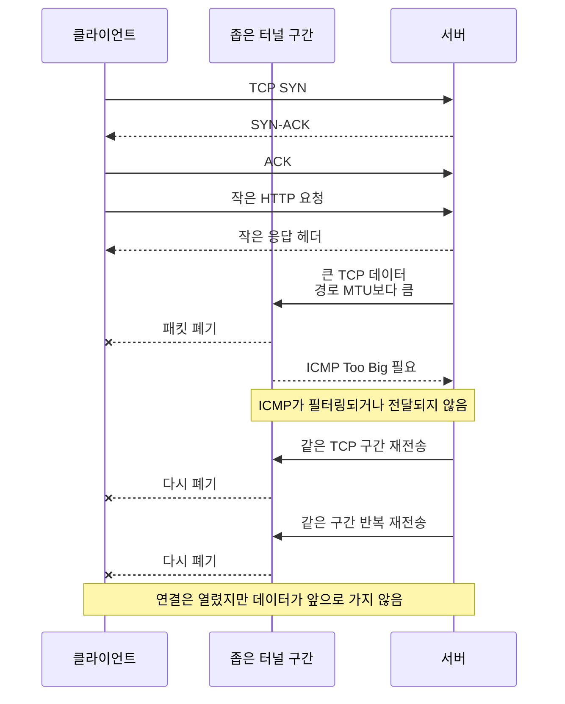
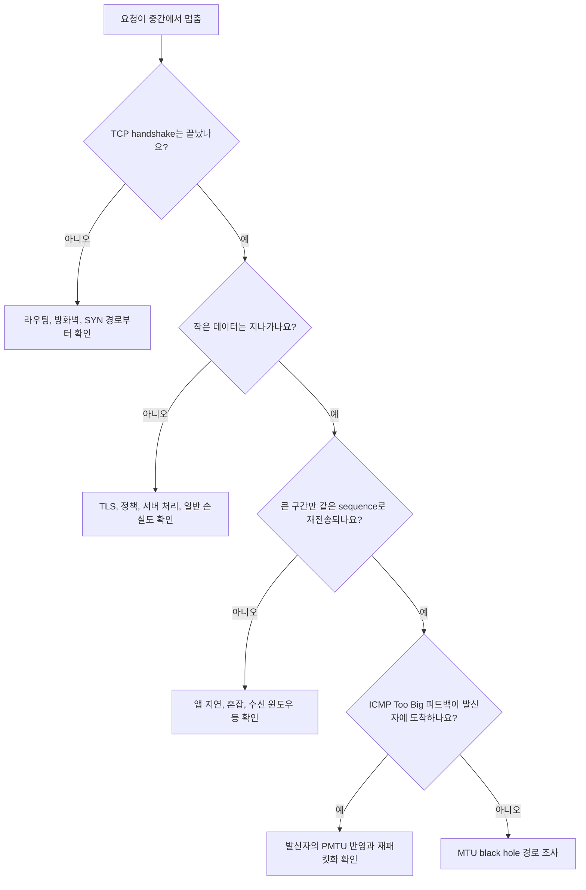
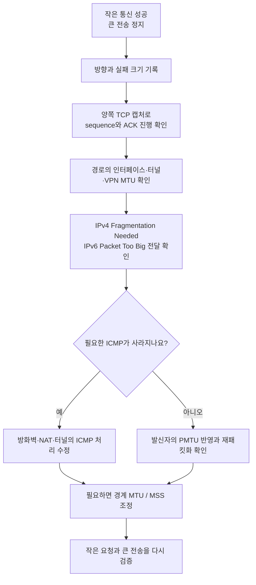

# 작은 요청은 되는데 큰 응답만 멈추는 이유는 뭘까요?

> 연결이 됐고 작은 요청도 성공하면 길은 멀쩡한 것 같죠? **사실은 큰 패킷만 조용히 사라지는 길일 수 있어요.**

[MTU, Fragmentation, 그리고 Path MTU](../basic/21-mtu-fragmentation-and-path-mtu.md){ data-preview }에서는 길마다 한 번에 통과시킬 수 있는 패킷 크기가 다르고, 너무 큰 패킷을 줄이라는 ICMP 힌트가 사라지면 **MTU black hole**이 생길 수 있다는 큰 그림을 봤어요.

그리고 [ICMP와 ICMPv6 Type](./icmp-and-icmpv6-types.md){ data-preview }에서는 IPv4의 `Type 3, Code 4`와 IPv6의 `Packet Too Big`이 경로 MTU를 알려주는 중요한 메시지라는 것도 봤죠.

이번에는 그 장면을 실제 장애처럼 읽어볼게요.

- DNS 조회는 성공해요.
- TCP 3-way handshake도 끝나요.
- 짧은 API 응답이나 작은 파일은 잘 받아요.
- 그런데 로그인 뒤 큰 페이지, 파일 다운로드, 인증서가 긴 HTTPS 응답처럼 데이터가 커지는 순간 멈춰요.
- 서버는 같은 TCP 구간을 여러 번 재전송해요.
- 필요한 ICMP 메시지는 발신자에게 돌아오지 않아요.
- 결국 브라우저는 오래 기다리다가 timeout으로 끝나요.

이 증상은 서버가 느리거나 방화벽이 연결을 막은 것처럼 보이기 쉬워요.
하지만 연결 자체는 이미 열렸어요.

> *"작은 패킷이 지나갔다는 사실이, 큰 패킷도 지나간다는 뜻일까요?"*

!!! note "이 글의 범위"
    여기서는 **경로 중간의 MTU가 더 작은데, 패킷 크기를 줄이라는 ICMP 피드백까지 사라진 장면**을 중심으로 봐요. Linux 명령 예시를 일부 사용하지만 옵션과 출력은 운영체제·도구 버전에 따라 달라질 수 있어요. 실제 장애에서는 IPv4/IPv6, 터널, VPN, NAT, 로드 밸런서, 비대칭 경로를 함께 확인해야 해요.

---

## 먼저 장애 장면을 한 줄로 줄여볼게요

서버 쪽 인터페이스 MTU는 `1500`이고, 경로 중간에 VPN 터널이 하나 있다고 해볼게요.
터널 헤더가 바깥에 더 붙으면서 실제로 안쪽 IP 패킷이 안전하게 지나갈 수 있는 크기는 `1400`이 됐어요.

| 위치 | 보이는 MTU 또는 역할 |
|---|---:|
| 서버 인터페이스 | `1500` |
| 터널 바깥 링크 | `1500` |
| 터널 오버헤드를 뺀 안쪽 경로 | `1400` |
| 서버가 처음 보낸 큰 IPv4 패킷 | `1500`, DF 설정 |
| 라우터가 보내야 할 힌트 | ICMP Destination Unreachable, Fragmentation Needed |
| 실제 장애 | ICMP가 방화벽이나 중간 장비에서 사라짐 |

서버는 자기 첫 링크만 보고 `1500`바이트 패킷을 보낼 수 있다고 생각해요.
하지만 경로 중간에서는 그 크기를 그대로 통과시킬 수 없어요.

정상이라면 중간 장비가 **"이 길에서는 더 작게 보내세요"**라는 ICMP 메시지를 돌려줘야 해요.
발신자는 그 값을 보고 패킷 크기를 줄이고 다시 보내고요.

문제는 그 안내문이 돌아오지 않을 때예요.



이 그림에서 TCP handshake가 성공한 이유는 handshake 패킷이 작기 때문이에요.
짧은 요청과 응답 헤더도 좁은 길을 통과할 수 있어요.
문제는 서버가 **경로 MTU보다 큰 첫 데이터 패킷**을 보내는 순간부터 시작돼요.

## 기본 감각을 실제 장애 신호로 바꿔봐요

기본편에서 본 길과 짐의 비유를 실제 용어로 옮기면 이렇게 돼요.

| 기본 감각 | 이번 장애 장면 | 실제 용어 |
|---|---|---|
| 출발지 앞 도로는 넓음 | 서버 인터페이스에서는 큰 패킷을 보낼 수 있음 | link MTU |
| 중간 터널은 더 좁음 | 경로 중 가장 작은 허용 크기가 더 작음 | Path MTU |
| 큰 트럭은 터널을 못 지남 | 큰 IP 패킷이 중간에서 폐기됨 | MTU exceed |
| 짐을 나누지 말라는 표시 | IPv4 패킷의 DF 설정 | Don't Fragment |
| "더 작게 보내세요" 안내문 | IPv4 Fragmentation Needed / IPv6 Packet Too Big | ICMP Packet Too Big(PTB) feedback |
| 안내문까지 사라짐 | 발신자가 실제 PMTU를 배우지 못함 | PMTUD failure |
| 큰 짐만 계속 사라지는 구간 | 연결은 열리지만 큰 전송이 멈춤 | MTU black hole |

여기서 `black hole`은 모든 패킷을 삼키는 장비 이름이 아니에요.
**특정 크기보다 큰 패킷은 사라지는데, 왜 사라졌는지 알려주는 피드백도 돌아오지 않는 상태**를 설명하는 표현이에요.

## 먼저 읽을 신호 일곱 가지 { #signals-to-read }

MTU black hole은 "접속 불가"보다 **일부만 되는 장애**로 나타나는 경우가 많아요.
그래서 성공한 신호와 실패한 신호를 같이 모아야 해요.

| 신호 | 무엇을 확인하나요? | 왜 중요할까요? |
|---|---|---|
| TCP handshake | `SYN`, `SYN-ACK`, `ACK`가 끝났는지 | 연결 전 문제와 연결 후 문제를 나눠요 |
| 작은 요청·응답 | 짧은 payload는 통과하는지 | 크기 경계가 있는지 봐요 |
| 실패 방향 | 업로드와 다운로드 중 어느 쪽이 멈추는지 | 방향별 경로와 MTU가 다를 수 있어요 |
| 반복 재전송 | 같은 TCP sequence 구간이 반복되는지 | 큰 데이터가 앞으로 못 가는지 봐요 |
| ACK 진행 | ACK 번호가 특정 지점에서 멈추는지 | 수신자가 어느 바이트 이후를 못 받는지 확인해요 |
| ICMP 메시지 | Fragmentation Needed / Packet Too Big이 보이는지 | 발신자가 PMTU를 배울 수 있는지 봐요 |
| 터널·VPN 변화 | 장애가 특정 경로, 지점, VPN에서만 생기는지 | 캡슐화 오버헤드와 MTU 차이를 좁혀요 |



이 흐름은 MTU 문제를 한 번에 확정하는 공식이 아니에요.
다만 **연결이 열렸는지**, **크기에 따라 결과가 갈리는지**, **같은 큰 구간이 반복되는지**, **ICMP 피드백이 있는지**를 차례로 보면 다른 장애와 훨씬 빨리 갈라낼 수 있어요.

## 캡처에서는 "같은 큰 구간"이 반복되는지 봐요

아래는 읽기 연습을 위한 축약 예시예요.
실제 `tcpdump` 출력은 TCP 옵션, checksum offload, 상대 sequence 표시 방식에 따라 다르게 보일 수 있어요.

```text
10:20:00.100 C > S  Flags [S],  seq 1000, length 0
10:20:00.110 S > C  Flags [S.], seq 5000, ack 1001, length 0
10:20:00.120 C > S  Flags [.],  ack 5001, length 0

10:20:00.130 C > S  Flags [P.], seq 1001:1211, ack 5001, length 210
10:20:00.140 S > C  Flags [.],  ack 1211, length 0

10:20:00.150 S > C  Flags [P.], seq 5001:6449, ack 1211, length 1448
10:20:01.160 S > C  Flags [P.], seq 5001:6449, ack 1211, length 1448
10:20:03.180 S > C  Flags [P.], seq 5001:6449, ack 1211, length 1448
10:20:07.220 S > C  Flags [P.], seq 5001:6449, ack 1211, length 1448
```

앞부분에서는 handshake와 210바이트 요청이 성공했어요.
그다음 서버가 보낸 `seq 5001:6449` 구간은 같은 범위로 반복돼요.

이때 중요한 건 단순히 `retransmission이 있다`가 아니에요.

| 캡처 질문 | MTU black hole에서 기대하는 모양 |
|---|---|
| 어떤 크기부터 실패하나요? | 작은 패킷은 성공하고 큰 패킷부터 반복 |
| sequence 번호가 진행하나요? | 특정 큰 구간에서 멈춤 |
| 수신 ACK가 돌아오나요? | 해당 구간을 확인하는 ACK가 오지 않음 |
| 재전송 크기가 그대로인가요? | 같은 크기로 다시 보내고 다시 사라질 수 있음 |
| ICMP 오류가 보이나요? | 중간에서는 생성돼도 발신자 캡처에는 없을 수 있음 |

TCP 재전송만으로 MTU 문제를 확정할 수는 없어요.
혼잡, 무선 손실, 방화벽 정책, 수신자 장애도 재전송을 만들 수 있거든요.

MTU 쪽으로 무게가 실리는 건 **작은 패킷은 안정적으로 성공하는데 일정 크기 이상의 패킷만 같은 지점에서 반복 실패하는 패턴**이에요.

## ICMP는 어느 캡처 위치에서 사라졌는지 나눠봐요

발신자 서버에서 ICMP가 안 보인다고 해서, 중간 라우터가 아예 만들지 않았다고 바로 결론 내리면 안 돼요.


ICMP 피드백은 여러 이유로 사라질 수 있어요.

- 중간 라우터가 필요한 ICMP를 만들지 않아요.
- 방화벽이 `모든 ICMP 차단` 정책으로 함께 버려요.
- 터널 장비가 바깥 패킷의 오류를 안쪽 발신자에게 제대로 전달하지 못해요.
- NAT가 ICMP 안에 인용된 원래 패킷 정보를 올바르게 변환하지 못해요.
- 비대칭 경로 때문에 ICMP의 돌아오는 길이 달라져요.
- 장비의 ICMP rate limit 때문에 일부 메시지만 보여요.

그래서 가능하다면 한 지점의 캡처로 끝내지 말고, **큰 패킷이 사라지기 전과 후**, **ICMP가 생성되는 쪽과 발신자 쪽**을 나눠서 봐야 해요.

| 캡처 위치 | 큰 패킷 | ICMP | 가까운 해석 |
|---|---|---|---|
| 서버 | 나감 | 안 들어옴 | 서버는 PMTU를 배우지 못함 |
| 터널 입구 | 들어옴 | 생성됨 | 좁은 경로는 문제를 감지함 |
| 서버 앞 방화벽 바깥 | ICMP 보임 | 서버 안에서는 안 보임 | 방화벽 또는 호스트 정책 확인 |
| 터널 반대편 | 큰 패킷 안 보임 | 해당 없음 | 터널 안에서 이미 폐기됐을 가능성 |

!!! tip "ICMP를 전부 허용하자는 뜻은 아니에요"
    ICMP에는 진단과 경로 동작에 필요한 메시지가 있어요. 정책은 필요한 Type/Code, 방향, 상태 추적을 기준으로 설계해야 해요. 특히 IPv6에서는 `Packet Too Big`을 포함한 ICMPv6 일부 기능이 정상 통신에 더 직접적으로 필요해요.

## 왜 `ping`은 되는데 웹은 멈출까요?

기본 `ping`은 보통 작은 payload를 사용해요.
그래서 경로 MTU가 `1400`이어도 작은 Echo Request와 Echo Reply는 문제없이 지나갈 수 있어요.

```text
작은 ping
  IP packet 84 bytes
  -> 좁은 경로 통과

큰 TCP data
  IP packet 1500 bytes
  -> 좁은 경로에서 폐기
  -> ICMP 피드백도 사라짐
```

이 때문에 아래 결과가 동시에 나올 수 있어요.

| 확인 | 결과 | 실제로 알 수 있는 것 |
|---|---|---|
| 작은 `ping` | 성공 | 작은 ICMP 패킷의 왕복 경로가 있음 |
| TCP handshake | 성공 | 작은 TCP 제어 패킷이 왕복함 |
| 짧은 HTTP 응답 | 성공 | 작은 데이터도 통과함 |
| 큰 다운로드 | 멈춤 | 큰 데이터 패킷 경로는 별도 확인 필요 |

즉 `ping 성공`은 **모든 크기의 패킷이 안전하게 지나간다는 증명**이 아니에요.
게다가 어떤 네트워크는 Echo 메시지는 막고 TCP는 허용하기도 하니, 반대 방향으로도 단정하면 안 되고요.

## 크기를 바꿔가며 경계를 찾을 수 있어요

Linux의 `ping` 구현에서는 IPv4 패킷을 조각내지 않도록 요청하고 payload 크기를 바꿔볼 수 있어요.

```bash
ping -4 -M do -s 1472 203.0.113.20
ping -4 -M do -s 1372 203.0.113.20
```

일반적인 IPv4 헤더 20바이트와 ICMP 헤더 8바이트를 가정하면:

| `-s` 값 | 대략적인 IPv4 패킷 크기 |
|---:|---:|
| `1472` | `1500`바이트 |
| `1372` | `1400`바이트 |

큰 값은 실패하고 작은 값은 성공한다면 크기 경계를 의심할 근거가 생겨요.
하지만 이 테스트에도 한계가 있어요.

- `ping` 옵션은 운영체제마다 달라요.
- ICMP Echo와 실제 TCP/UDP 트래픽의 경로·정책이 다를 수 있어요.
- 로드 밸런싱 때문에 패킷 크기나 5-tuple에 따라 다른 경로를 탈 수도 있어요.
- IPv4 옵션이나 터널 헤더가 있으면 단순히 28바이트만 더하는 계산이 달라져요.
- 성공과 실패가 갈리는 값이 보여도 어느 장비가 좁은지는 별도 캡처가 필요해요.

Linux에서는 `tracepath`가 경로 MTU 변화를 찾는 데 도움을 줄 때도 있어요.

```bash
tracepath 203.0.113.20
tracepath -6 2001:db8::20
```

다만 중간 장비가 응답하지 않거나 경로가 비대칭이면 결과가 완전하지 않을 수 있어요.
도구 하나의 숫자보다 **실제 애플리케이션 재현, 양쪽 캡처, 인터페이스·터널 MTU 설정**을 함께 보는 편이 안전해요.

!!! warning "운영 경로에서 큰 패킷 테스트를 무작정 반복하지 마세요"
    크기 탐색은 일부 패킷을 의도적으로 버리게 만들 수 있어요. 트래픽이 민감한 환경에서는 대상, 횟수, 시간대를 제한하고 실제 사용자 연결과 분리해서 확인해야 해요.

## 업로드는 되고 다운로드만 멈출 수도 있어요

인터넷 경로는 양방향이 완전히 같은 길이라고 보장되지 않아요.
그래서 MTU black hole도 한 방향에서만 드러날 수 있어요.

예를 들어 클라이언트가 보내는 요청은 작아서 서버까지 도착해요.
서버가 보내는 응답은 커서 반대 방향의 좁은 터널에서 막힐 수 있어요.

반대로 큰 파일 업로드만 실패하고 작은 다운로드는 잘될 수도 있고요.

그래서 장애를 기록할 때는 "통신이 안 된다"보다 이렇게 적는 편이 좋아요.

> *"클라이언트에서 서버로 보내는 300바이트 요청은 도착하지만, 서버에서 클라이언트로 보내는 첫 1448바이트 TCP payload부터 ACK가 진행하지 않아요."*

이렇게 방향과 크기를 적으면 조사 범위가 훨씬 작아져요.

## MSS가 맞아도 MTU 문제가 생길 수 있을까요?

TCP handshake에서는 양쪽이 **한 TCP 세그먼트에 어느 정도 payload까지 받을 수 있는지** MSS 옵션으로 알려줄 수 있어요.

Ethernet MTU `1500`을 기준으로 IPv4 TCP 옵션이 없는 단순 계산을 하면 흔히 이런 숫자를 떠올려요.

```text
1500 - IPv4 header 20 - TCP header 20 = MSS 1460
```

그런데 경로 중간에 터널이 생겨 실제 PMTU가 `1400`이라면, `1460`바이트 TCP payload는 너무 클 수 있어요.

| 값 | 무엇을 말하나요? |
|---|---|
| MTU | 링크나 경로가 허용하는 IP 패킷 전체 크기 |
| MSS | TCP payload 한 구간의 최대 크기를 협상하는 힌트 |
| PMTU | 출발지부터 목적지까지 경로 중 가장 작은 MTU |

방화벽이나 터널 장비가 TCP SYN의 MSS 값을 경로에 맞게 낮추는 **MSS clamping**을 쓰기도 해요.
이 방식은 TCP 트래픽에서 큰 세그먼트가 만들어지는 일을 줄일 수 있어요.

하지만 MSS clamping을 모든 문제의 정답으로 보면 안 돼요.

- UDP에는 TCP MSS가 없어요.
- IPv6와 다른 전송 프로토콜도 별도로 봐야 해요.
- 경로가 바뀌면 고정값이 다시 틀릴 수 있어요.
- 너무 낮게 잡으면 불필요하게 작은 패킷을 많이 보낼 수 있어요.
- ICMP 전달이나 터널 MTU 설정이 잘못된 근본 원인은 남을 수 있어요.

MSS clamping은 필요한 경계에서 쓸 수 있는 운영 도구지만, 먼저 **어느 캡슐화가 몇 바이트를 더하고 실제 경로 MTU가 얼마인지**를 확인해야 해요.

## 잘못 읽기 쉬운 함정 여섯 가지

| 함정 | 왜 위험할까요? | 더 나은 읽기 |
|---|---|---|
| `ping`이 되니 네트워크는 정상이라고 결론 | 작은 패킷만 통과했을 수 있어요 | 크기를 바꾸고 실제 TCP 방향을 봐요 |
| 재전송이 있으니 무조건 혼잡이라고 결론 | 같은 큰 구간만 크기 경계에서 사라질 수 있어요 | ACK 진행, 패킷 크기, ICMP를 같이 봐요 |
| 서버 인터페이스 MTU만 확인 | PMTU는 중간의 가장 좁은 구간으로 결정돼요 | 터널과 전체 경로를 확인해요 |
| ICMP가 안 보이니 MTU 문제는 아니라고 결론 | ICMP가 사라지는 것이 black hole의 핵심일 수 있어요 | 여러 캡처 지점에서 생성·전달을 나눠 봐요 |
| MTU를 무조건 아주 낮게 설정 | 증상은 가려도 효율 저하와 다른 경로 문제가 남아요 | 실제 오버헤드와 PMTU를 근거로 조정해요 |
| MSS clamping만 넣고 끝냄 | UDP·IPv6·경로 변경에는 충분하지 않을 수 있어요 | ICMP 정책과 터널 MTU도 함께 고쳐요 |

또 하나 자주 생기는 오해는 **"큰 응답이면 애플리케이션이 늦게 만들었겠지"**예요.
서버 로그에서는 응답 생성이 이미 끝났는데 클라이언트가 받지 못할 수도 있어요.

이때는 앱 처리 시간만 보지 말고:

- 서버가 응답을 언제 쓰기 시작했는지
- 커널이 같은 TCP 구간을 재전송하는지
- 클라이언트 ACK가 어디서 멈췄는지
- 앞단 프록시가 client write timeout으로 끝냈는지

를 같은 시간축에 놓아야 해요.

## 실제 대응은 이 순서로 잡아요



### 1. 증상을 방향과 크기로 다시 적어요

먼저 아래를 기록해요.

- 어느 출발지와 목적지 사이인지
- IPv4인지 IPv6인지
- 업로드와 다운로드 중 어느 방향인지
- 어느 정도 크기부터 실패하는지
- VPN, 터널, 특정 지점, 특정 ISP에서만 생기는지

### 2. 양쪽 캡처를 같은 시각으로 맞춰요

발신자에서는 큰 패킷이 나가는데 수신자에는 안 보이는지 확인해요.
수신자까지 도착했는데 ACK만 돌아오지 않는다면 반대 방향도 따로 봐야 하고요.

```bash
tcpdump -ni any 'host 203.0.113.20 or icmp or icmp6'
```

운영 캡처에서는 대상 IP, 포트, 시간 범위를 더 좁혀야 해요.
TLS 트래픽이어도 TCP sequence, ACK, 길이, 재전송, ICMP 신호는 볼 수 있어요.

### 3. 터널 오버헤드까지 계산해요

VPN, GRE, VXLAN, IPsec 같은 캡슐화는 원래 패킷 바깥에 헤더를 더 붙여요.
겉 링크 MTU가 그대로여도 안쪽 패킷이 쓸 수 있는 크기는 줄어들 수 있어요.

제품과 모드마다 오버헤드가 다르니 숫자를 외워서 적용하지 말고, 실제 캡슐화와 설정을 확인해야 해요.

### 4. 필요한 ICMP가 끝까지 돌아오는지 확인해요

IPv4 PMTUD에서는 Fragmentation Needed 메시지가, IPv6에서는 Packet Too Big 메시지가 발신자에게 도달해야 패킷 크기를 줄일 수 있어요.

`모든 ICMP 차단`처럼 넓은 정책이 있다면 필요한 메시지까지 막고 있지 않은지 확인해요.
터널과 NAT가 ICMP 안의 인용 패킷을 원래 흐름과 연결할 수 있게 처리하는지도 중요하고요.

### 5. 우회책과 근본 수정을 나눠요

상황에 따라 다음 조치가 필요할 수 있어요.

| 조치 | 역할 | 주의점 |
|---|---|---|
| 터널 인터페이스 MTU 조정 | 캡슐화 뒤에도 실제 링크 크기를 넘지 않게 함 | 정확한 오버헤드 계산 필요 |
| TCP MSS clamping | TCP가 너무 큰 payload를 만들지 않게 도움 | TCP에만 적용되고 고정값 오판 가능 |
| ICMP 정책 수정 | PMTUD 피드백이 발신자까지 돌아오게 함 | Type/Code와 방향을 구체적으로 설계 |
| 장비 설정·펌웨어 수정 | PTB 생성·전달 오류를 바로잡음 | 장비별 검증 필요 |
| PLPMTUD 사용 | 전송 계층의 probe와 손실 신호로 PMTU 탐색 | 프로토콜·OS·앱 지원 여부 확인 |

가장 좋은 결과는 **경로가 실제 크기를 정확히 알리고, 발신자가 그 값에 맞춰 다시 패킷화하는 것**이에요.
단순히 모든 호스트 MTU를 작은 값으로 내리면 장애는 가려질 수 있지만, 왜 특정 경로에서만 문제가 생겼는지는 남아요.

## 수정 뒤에는 작은 성공 말고 큰 전송까지 확인해요

정책이나 MTU를 고친 뒤 `ping` 한 번만 성공했다고 종료하면 안 돼요.
원래 실패했던 큰 요청이나 다운로드를 같은 조건으로 다시 통과시켜야 해요.

| 검증 | 확인할 것 |
|---|---|
| 원래 실패한 큰 다운로드·응답 | timeout 없이 끝나는지 |
| 반대 방향 큰 전송 | 업로드와 다운로드가 모두 되는지 |
| 패킷 캡처 | sequence와 ACK가 계속 진행하는지 |
| ICMP 캡처 | 필요할 때 PTB가 발신자까지 도착하는지 |
| 재전송 지표 | 같은 큰 구간의 반복 재전송이 사라졌는지 |
| 다른 경로 | VPN 밖, 다른 지역, IPv4/IPv6에서도 부작용이 없는지 |

MTU 문제는 경로별로 달라질 수 있어요.
한 클라이언트에서 성공했다고 모든 사용자의 경로가 고쳐졌다고 단정하지 말고, 실제 영향 구간을 나눠서 다시 확인해야 해요.

## 더 깊이 보고 싶다면

- [RFC 1191: Path MTU Discovery](https://www.rfc-editor.org/rfc/rfc1191.html) — IPv4에서 DF와 ICMP Fragmentation Needed를 이용해 PMTU를 찾는 기본 흐름을 설명해요.
- [RFC 8201: Path MTU Discovery for IP version 6](https://www.rfc-editor.org/rfc/rfc8201.html) — IPv6의 Packet Too Big 처리와 PMTU 갱신 규칙을 설명해요.
- [RFC 2923: TCP Problems with Path MTU Discovery](https://www.rfc-editor.org/rfc/rfc2923.html) — 작은 통신은 되지만 큰 전송이 멈추는 오래된 black hole 증상과 탐지 문제를 정리해요.
- [RFC 8899: Packetization Layer Path MTU Discovery for Datagram Transports](https://www.rfc-editor.org/rfc/rfc8899.html) — ICMP에만 의존하지 않고 packetization layer에서 probe로 경로 크기를 탐색하는 접근을 설명해요.

## 자, 정리해볼까요?

!!! abstract "오늘 우리가 배운 것"
    - MTU black hole은 **경로보다 큰 패킷이 폐기되고, 크기를 줄이라는 ICMP 피드백까지 발신자에게 돌아오지 않는 상태**예요.
    - TCP handshake와 작은 `ping`이 성공해도, 큰 데이터 패킷은 별도로 막힐 수 있어요.
    - 캡처에서는 **작은 데이터 성공**, **특정 큰 sequence 구간의 반복 재전송**, **ACK 정지**, **ICMP 부재**를 함께 읽어요.
    - 서버 인터페이스 MTU보다 **터널과 전체 경로의 가장 작은 MTU**가 중요해요.
    - MSS clamping과 MTU 하향은 상황에 따라 도움이 되지만, ICMP 전달과 터널 설정을 고치지 않으면 근본 원인이 남을 수 있어요.
    - 수정 뒤에는 원래 실패했던 큰 전송을 다시 실행하고, sequence와 ACK가 끝까지 진행하는지 확인해야 해요.

연결이 열렸다는 사실은 출발선이 통과됐다는 뜻일 뿐이에요.
데이터가 커진 뒤에도 같은 길을 끝까지 지나가는지는 패킷 크기와 피드백을 따로 봐야 해요.

## 이어서 보면 좋은 글

- MTU와 단편화의 큰 그림부터 다시 보고 싶다면 — [MTU, Fragmentation, 그리고 Path MTU](../basic/21-mtu-fragmentation-and-path-mtu.md){ data-preview }
- 캡처에서 `Fragmentation Needed`와 `Packet Too Big` 번호를 읽고 싶다면 — [ICMP와 ICMPv6 Type은 어떻게 읽어야 할까요?](./icmp-and-icmpv6-types.md){ data-preview }
- 같은 sequence 구간이 왜 반복되는지 TCP 관점으로 보고 싶다면 — [TCP 재전송과 신뢰성](../basic/22-tcp-retransmission-and-reliability.md){ data-preview }
- 긴 캡처 한 줄을 읽는 순서가 아직 낯설다면 — [tcpdump 한 줄은 어떻게 읽어야 할까요?](./tcpdump-first-look.md){ data-preview }
