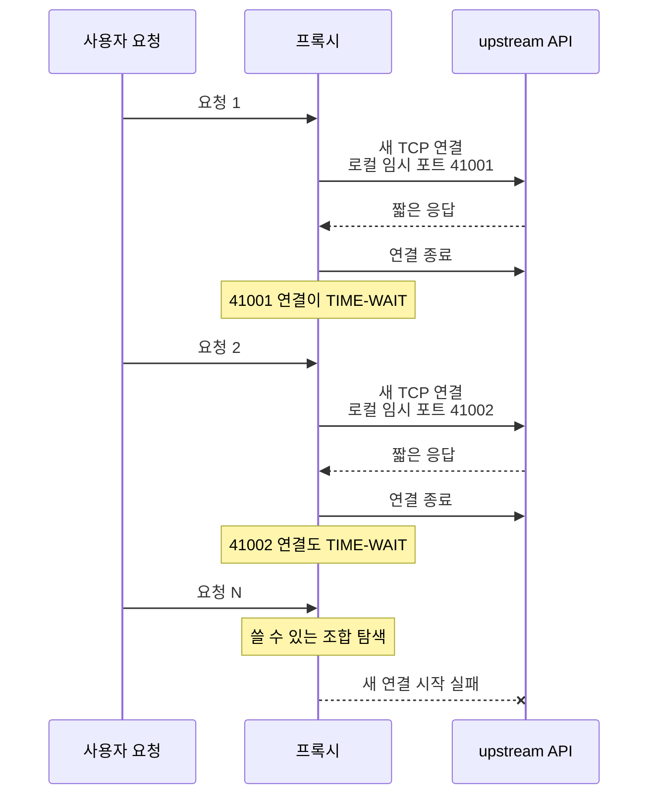
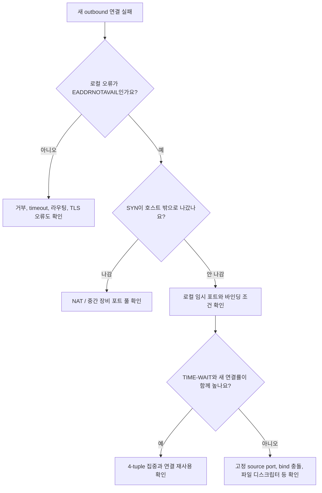
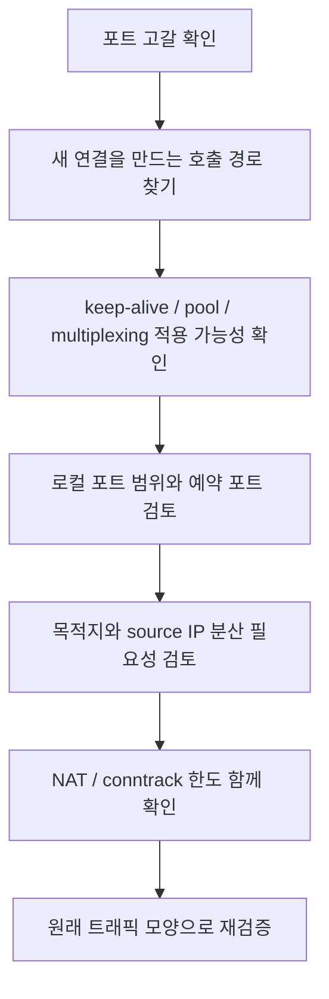

# TIME-WAIT가 많을 때 정말 포트가 고갈된 걸까요?

> `TIME-WAIT`가 수만 개 보이면 포트가 다 떨어진 것 같죠? **사실은 개수만으로 포트 고갈을 확정할 수 없어요.**

[TCP Teardown과 TIME-WAIT](../basic/23-tcp-teardown-and-time-wait.md){ data-preview }에서는 먼저 연결을 닫은 쪽이 마지막 ACK와 늦게 도착한 패킷을 안전하게 처리하려고 잠시 기다린다는 큰 그림을 봤어요.
그리고 [ss와 netstat에서 TCP 상태 읽기](./ss-and-netstat-state-reading.md#common-states){ data-preview }에서는 `TIME-WAIT`가 흔히 **정상 종료 뒤 남는 흔적**이라는 것도 확인했죠.

이번에는 그 정상적인 흔적이 아주 빠르게 쌓일 때, 실제 장애와 어떻게 이어지는지 볼게요.

- API 프록시가 upstream 연결을 매번 새로 열어요.
- 요청은 짧아서 금방 끝나고, 연결도 바로 닫혀요.
- 트래픽이 늘수록 `TIME-WAIT` 수가 가파르게 올라가요.
- 어느 순간 새 upstream 연결이 간헐적으로 실패해요.
- 앱 로그에는 `Cannot assign requested address`, `EADDRNOTAVAIL` 같은 로컬 연결 오류가 보여요.
- 원격 서버는 멀쩡하고, 기존 연결의 요청은 계속 성공하기도 해요.

겉으로는 upstream 서버가 연결을 거부하거나 네트워크가 흔들린 것처럼 보여요.
하지만 이 장면에서는 SYN이 서버까지 출발하기 전에 막혔을 수도 있어요.

> *"새 연결에 붙여줄 로컬 임시 포트를 운영체제가 찾지 못한 건 아닐까요?"*

!!! note "이 글의 범위"
    여기서는 Linux 호스트가 외부 서버로 TCP 연결을 많이 여는 **클라이언트·리버스 프록시·NAT 앞단** 장면을 중심으로 봐요. 포트 선택과 재사용 조건은 운영체제 버전, 네트워크 namespace, 바인딩 방식, 목적지 분산, NAT 구현에 따라 달라질 수 있어요. 그래서 `TIME-WAIT` 개수 하나가 아니라 **실제 연결 오류, 로컬 포트 범위, 목적지 집중도, 연결 생성률**을 함께 읽는 데 집중할게요.

---

## 먼저 장애 장면을 한 줄로 줄여볼게요

프록시 한 대가 같은 API 서버의 `443` 포트로 초당 수백 개의 짧은 연결을 새로 만든다고 해볼게요.
응답은 금방 끝나지만 프록시가 먼저 연결을 닫아서 로컬에 `TIME-WAIT`가 남아요.



이 그림에서 중요한 건 `TIME-WAIT`가 생겼다는 사실 자체가 아니에요.
**연결을 새로 만드는 속도가 포트를 다시 안전하게 쓸 수 있게 되는 속도보다 빠른지**가 핵심이에요.

대략적인 감각은 이렇게 잡을 수 있어요.

```text
동시에 묶여 있을 수 있는 종료 흔적
≈ 초당 새 연결 수 × TIME-WAIT가 유지되는 시간
```

예를 들어 초당 새 연결 수가 두 배가 되면, 다른 조건이 같을 때 관측되는 `TIME-WAIT`도 대체로 더 많이 쌓일 수 있어요.
하지만 이 계산은 **압력을 이해하는 근사치**일 뿐이에요. 실제 포트 재사용 가능 여부는 로컬 주소, 원격 주소, 원격 포트, TCP 구현 조건까지 함께 봐야 해요.

## 기본 감각을 실제 장애 신호로 바꿔봐요

기본편에서 본 포트와 종료 감각을 이번 사례에 옮기면 이렇게 돼요.

| 기본 감각 | 이번 장애 장면 | 실제 용어 |
|---|---|---|
| 통화할 때 잠깐 내선 번호를 빌림 | 외부 연결마다 로컬 포트가 자동 선택됨 | ephemeral port, 임시 포트 |
| 통화가 끝나도 번호표를 잠깐 보관함 | 먼저 닫은 연결이 로컬에 남음 | `TIME-WAIT` |
| 같은 상대와 같은 번호로 바로 새 통화를 만들기 어려움 | 예전 연결과 새 연결이 섞이지 않게 구분함 | 4-tuple 보호 |
| 번호를 새로 뽑는 속도가 너무 빠름 | 짧은 TCP 연결 생성률이 높음 | connection churn |
| 새 번호를 배정하지 못함 | 로컬에서 `connect()`가 실패함 | ephemeral port exhaustion |
| 통화를 끊지 않고 다음 용건에 다시 씀 | 기존 연결로 여러 요청을 보냄 | connection reuse, pooling |

여기서 **connection churn**은 연결 수가 많다는 말과 조금 달라요.
오래 유지되는 연결 1만 개보다, 1초마다 열고 닫는 연결 수천 개가 임시 포트와 `TIME-WAIT`에 더 강한 압력을 줄 수 있어요.

## 포트 하나만이 아니라 4-tuple을 봐야 해요 { #four-tuple }

TCP 연결은 보통 아래 네 값을 묶어서 구분해요.

```text
로컬 IP : 로컬 포트  ->  원격 IP : 원격 포트
```

예를 들면 이런 연결들이에요.

```text
10.0.1.20:41001 -> 203.0.113.10:443
10.0.1.20:41002 -> 203.0.113.10:443
10.0.1.20:41001 -> 198.51.100.30:443
```

첫 번째와 세 번째 줄은 로컬 포트가 `41001`로 같지만 원격 IP가 달라요.
운영체제와 소켓 조건에 따라 이런 연결은 서로 다른 4-tuple이므로 동시에 존재할 수 있어요.

그래서 아래 두 장면은 압력이 달라요.

| 연결 모양 | 포트 압력 |
|---|---|
| 하나의 로컬 IP에서 하나의 원격 IP:포트로 집중 | 같은 목적지 조합 안에서 임시 포트 경쟁이 커지기 쉬움 |
| 여러 원격 IP나 포트로 분산 | 같은 로컬 포트를 다른 4-tuple에서 활용할 여지가 생길 수 있음 |
| 여러 로컬 IP로 분산 | 각 로컬 주소가 제공하는 연결 조합이 늘어날 수 있음 |
| NAT 뒤 수많은 호스트가 하나의 공인 IP를 공유 | 변환 장비의 바깥쪽 포트 풀이 별도 병목이 될 수 있음 |

즉 `TIME-WAIT 30,000개`라는 숫자만 봐서는 부족해요.
그 연결들이 **어느 로컬 IP에서, 어느 원격 IP:포트로 몰렸는지**를 같이 봐야 해요.


이 그림이 필요한 이유는 포트 고갈을 **0번부터 65535번까지 번호를 모두 한 번씩 썼다**는 단순한 문제로 보면 안 되기 때문이에요.
실제 연결 가능성은 이 네 값의 조합과 운영체제의 재사용 규칙으로 결정돼요.

## 먼저 읽을 신호 일곱 가지 { #signals-to-read }

`TIME-WAIT`가 많아 보여도 아래 신호가 함께 맞지 않으면 아직 포트 고갈로 확정하면 안 돼요.

| 신호 | 무엇을 확인하나요? | 왜 중요할까요? |
|---|---|---|
| 새 연결 오류 | `EADDRNOTAVAIL`, `Cannot assign requested address`가 있는지 | 로컬 임시 포트 배정 실패와 직접 이어질 수 있어요 |
| `TIME-WAIT` 추이 | 트래픽과 함께 급증하고 내려오는지 | 짧은 연결 churn을 확인해요 |
| 로컬 임시 포트 범위 | 호스트가 자동 할당에 쓰는 범위가 어디인지 | 사용 가능한 후보 공간을 봐요 |
| 목적지 집중도 | 특정 원격 IP:포트로 대부분 몰리는지 | 같은 4-tuple 후보 경쟁인지 좁혀요 |
| 초당 새 연결 수 | 요청 수가 아니라 실제 TCP connect 비율이 얼마인지 | 연결 재사용이 안 되는지 봐요 |
| SYN 출발 여부 | 실패한 시도에서 SYN이 인터페이스 밖으로 나갔는지 | 로컬 실패와 원격 실패를 나눠요 |
| NAT/SNAT 상태 | 중간 장비의 변환 포트나 conntrack이 찼는지 | 호스트가 아니라 NAT가 병목일 수 있어요 |



Linux의 `connect(2)` 문서는 소켓이 미리 로컬 주소에 바인딩되지 않은 상태에서 임시 포트를 고르려 했지만 범위 안의 포트를 사용할 수 없으면 `EADDRNOTAVAIL`이 날 수 있다고 설명해요.
그러니까 이 오류는 강한 단서예요. 다만 애플리케이션이나 라이브러리가 오류를 다른 문구로 감쌀 수 있으니, 가능하면 원래 `errno`까지 확인하는 편이 좋아요.

## `ss` 화면에서는 개수보다 분포를 봐요

먼저 전체 소켓 요약을 볼 수 있어요.

```bash
ss -s
```

그다음 `TIME-WAIT`만 줄여서 봐요.

```bash
ss -tan state time-wait
ss -tan state time-wait '( dport = :443 )'
```

출력은 이런 모양일 수 있어요.

```text
State      Local Address:Port   Peer Address:Port
TIME-WAIT  10.0.1.20:41001     203.0.113.10:443
TIME-WAIT  10.0.1.20:41002     203.0.113.10:443
TIME-WAIT  10.0.1.20:41003     203.0.113.10:443
TIME-WAIT  10.0.1.20:41004     203.0.113.10:443
```

이 장면에서는 네 줄이라는 개수보다 아래 모양이 중요해요.

1. 로컬 IP가 모두 `10.0.1.20`으로 같아요.
2. 원격 IP와 포트도 `203.0.113.10:443`으로 같아요.
3. 로컬 임시 포트만 빠르게 바뀌어요.
4. 같은 목적지로 짧은 연결이 반복됐다는 흔적에 가까워요.

반대로 수만 개가 보여도 원격 목적지가 아주 넓게 분산돼 있고 새 연결 오류가 없다면, 그 숫자는 높은 트래픽의 정상 흔적일 수도 있어요.

!!! tip "`TIME-WAIT` 총합과 실제 실패를 같은 그래프에 놓아봐요"
    장애 시각의 `TIME-WAIT` 수, 초당 새 연결 수, `EADDRNOTAVAIL` 수, 요청 실패율을 같은 시간축에 놓으면 단순한 상관과 실제 임계점이 더 잘 보여요. 숫자가 많다는 사실보다 **어느 시점부터 새 연결이 실패했는지**가 중요해요.

## 임시 포트 범위는 현재 호스트에서 직접 확인해요

Linux에서는 현재 network namespace의 자동 할당 범위를 이렇게 확인할 수 있어요.

```bash
cat /proc/sys/net/ipv4/ip_local_port_range
```

예시 출력은 이런 두 숫자예요.

```text
32768 60999
```

이 값은 **읽기 연습용 예시**예요.
배포판, 커널 설정, 컨테이너와 namespace 구성에 따라 다를 수 있으니 외워서 적용하지 말고 장애가 난 환경에서 직접 확인해야 해요.

함께 확인할 항목은 아래예요.

```bash
cat /proc/sys/net/ipv4/ip_local_port_range
cat /proc/sys/net/ipv4/ip_local_reserved_ports
```

`ip_local_reserved_ports`에 들어간 포트는 자동 할당 후보에서 제외될 수 있어요.
따라서 범위의 양 끝만 빼서 계산한 숫자와 실제 후보 수가 다를 수 있어요.

컨테이너 환경에서는 명령을 어디서 실행했는지도 중요해요.
호스트, Pod, sidecar, 프록시가 서로 다른 network namespace에 있다면 **실제로 outbound 연결을 만드는 위치**의 값을 봐야 해요.

## 캡처에서는 SYN이 아예 나갔는지 봐요

포트 고갈이 로컬 `connect()` 단계에서 일어나면, 실패한 시도는 네트워크 인터페이스에 SYN을 남기지 않을 수 있어요.

```text
12:00:00.100 app connect() -> EADDRNOTAVAIL
12:00:00.100 packet capture -> matching SYN 없음
```

반면 원격 서버가 연결을 거부했다면 이런 식으로 SYN과 RST가 보일 수 있어요.

```text
12:00:00.100 P -> O  SYN
12:00:00.110 O -> P  RST, ACK
```

방화벽이나 경로에서 버려졌다면 SYN 재전송 뒤 timeout으로 끝날 수 있고요.

| 장면 | 로컬 오류 | 패킷 모양 |
|---|---|---|
| 로컬 임시 포트 배정 실패 | `EADDRNOTAVAIL` 후보 | 실패 시도와 맞는 SYN이 없음 |
| 원격 포트가 닫힘 | `ECONNREFUSED` 후보 | SYN 뒤 RST |
| 경로·방화벽 무응답 | `ETIMEDOUT` 후보 | SYN 반복, 응답 없음 |
| NAT 포트 풀 고갈 | 제품별 오류·timeout | 호스트에서는 SYN이 나가도 바깥쪽에서는 안 보일 수 있음 |

그래서 앱 로그 한 줄과 한 지점의 캡처만으로 끝내지 말고, **실패한 요청의 정확한 시각과 대상 주소**를 맞춰서 봐야 해요.

## 왜 기존 연결은 되는데 새 연결만 실패할까요?

임시 포트는 새 TCP 연결을 만들 때 필요해요.
이미 `ESTABLISHED`인 연결은 자기 4-tuple을 이미 가지고 있으므로, 그 연결 위에서 데이터를 계속 주고받는 데 새 임시 포트를 하나 더 뽑지 않아요.

```text
기존 연결로 요청 재사용
  10.0.1.20:41001 -> 203.0.113.10:443
  요청 A, 요청 B, 요청 C
  -> 새 로컬 포트 불필요

요청마다 새 연결
  10.0.1.20:41001 -> 203.0.113.10:443
  10.0.1.20:41002 -> 203.0.113.10:443
  10.0.1.20:41003 -> 203.0.113.10:443
  -> 연결마다 포트 조합 필요
```

이 때문에 포트 압력이 높아진 순간에도 아래처럼 보일 수 있어요.

- 이미 열린 DB connection pool의 쿼리는 성공해요.
- 새로 만드는 외부 API 연결만 실패해요.
- HTTP/2로 오래 유지된 연결은 괜찮아요.
- HTTP/1.1 연결을 매번 닫는 경로만 에러가 나요.
- 재시작 직후 잠깐 회복됐다가 다시 실패해요.

이 패턴이 보이면 서버 전체가 죽었다고 보기보다 **어느 호출 경로가 새 TCP 연결을 계속 만드는지**를 먼저 찾아야 해요.

## 복구는 TIME-WAIT를 없애는 것보다 연결 churn을 줄이는 데서 시작해요

가장 먼저 볼 것은 `TIME-WAIT` 타이머를 줄이는 설정이 아니에요.
왜 요청마다 새 연결이 생기는지부터 봐야 해요.



복구 방향은 보통 이런 순서로 검토해요.

| 방향 | 확인할 점 |
|---|---|
| HTTP keep-alive와 connection pool 사용 | idle timeout, 최대 연결 수, stale connection 처리 |
| HTTP/2 같은 multiplexing 활용 | 하나의 연결에 여러 요청을 안전하게 실을 수 있는지 |
| DNS·upstream 주소 분산 확인 | 실제 연결이 특정 IP 하나에만 몰리는지 |
| 로컬 IP 추가 또는 SNAT pool 확장 | 라우팅, 방화벽, 응답 경로, 운영 복잡성 |
| 임시 포트 범위 조정 | 예약 포트와 충돌하지 않는지, 변경 뒤 실제 후보가 늘어나는지 |
| NAT/conntrack 용량 조정 | 호스트가 아니라 중간 장비가 병목인지 |
| 요청률 제한과 backpressure | 순간 폭주가 새 연결 폭주로 번지지 않게 하는지 |

연결 재사용은 포트 압력을 줄이는 데 효과적이지만, 무조건 오래 들고 있으면 되는 건 아니에요.
[한동안 조용한 뒤 첫 요청만 502가 나는 사례](./case-keepalive-mismatch-502.md){ data-preview }처럼 앞단과 upstream의 idle timeout이 어긋나면 닫힌 연결을 다시 쓰려다가 다른 장애가 생길 수 있어요.

즉 목표는 **연결을 무조건 짧게 만들기**도, **무조건 오래 유지하기**도 아니에요.
트래픽 모양과 peer 정책에 맞는 pool 수명, 최대 연결 수, 재시도, 관측을 함께 설계하는 거예요.

## 잘못 읽기 쉬운 함정 여덟 가지 { #pitfalls }

**하나, `TIME-WAIT`가 많으면 무조건 포트 고갈이라고 보기.**  
정상 종료가 많으면 `TIME-WAIT`도 많아져요. 새 연결 실패와 포트 범위 압력이 함께 보여야 해요.

**둘, 전체 `TIME-WAIT` 수만 보고 목적지 분포를 안 보기.**  
같은 원격 IP:포트에 몰렸는지, 여러 목적지로 흩어졌는지에 따라 4-tuple 압력이 달라져요.

**셋, 서버의 listening 포트가 부족해졌다고 생각하기.**  
이 사례에서 부족한 후보는 보통 outbound 연결을 만드는 쪽의 **로컬 임시 포트**예요. 원격 서버의 `443` 포트가 여러 번 소모되는 게 아니에요.

**넷, `tcp_fin_timeout`을 낮추면 `TIME-WAIT`가 줄어든다고 믿기.**  
Linux 커널 문서에서 `tcp_fin_timeout`은 orphaned `FIN-WAIT-2` 연결을 다루는 값이에요. 이름에 `fin`이 들어갔다고 `TIME-WAIT` 타이머 설정으로 읽으면 안 돼요.

**다섯, `tcp_max_tw_buckets`를 낮춰 강제로 지우기.**  
Linux 커널 문서는 이 값을 단순 튜닝 손잡이가 아니라 시스템을 보호하는 한도로 설명하고, 인위적으로 낮추지 말라고 경고해요. 안전장치를 없애면 낡은 패킷과 새 연결의 혼선을 키울 수 있어요.

**여섯, `tcp_tw_reuse`를 원인 확인 없이 켜기.**  
TIME-WAIT 재사용은 타임스탬프와 연결 조건을 포함한 TCP 안전성 위에서 판단해야 해요. 커널 버전별 의미와 기본값도 달라질 수 있으므로, 연결 churn과 pool 문제를 남겨둔 채 첫 해결책으로 쓰면 안 돼요.

**일곱, 포트 범위만 크게 넓히고 끝내기.**  
범위를 넓히면 임계점을 늦출 수 있지만, 요청마다 새 연결을 만드는 구조가 그대로면 더 큰 트래픽에서 다시 만날 수 있어요. NAT나 upstream 한도가 먼저 터질 수도 있고요.

**여덟, 재시작 뒤 회복됐으니 원인이 사라졌다고 보기.**  
프로세스 재시작으로 연결 패턴이나 pool 상태가 잠깐 바뀌었을 뿐일 수 있어요. 같은 요청률과 지속 시간으로 다시 임계점을 통과해봐야 해요.

## 복구 뒤에는 같은 연결 생성률로 다시 확인해요

평소보다 낮은 트래픽으로 몇 번 성공했다고 끝내면 안 돼요.
이번 장애는 **짧은 연결이 빠르게 쌓일 때** 나타났으니까요.

검증은 원래 장애의 모양을 다시 만들어야 해요.

```text
검증 1: 초당 새 연결 수가 실제로 줄었는지
검증 2: 같은 요청률에서 TIME-WAIT가 안정 구간에 머무는지
검증 3: EADDRNOTAVAIL이 다시 발생하지 않는지
검증 4: p95/p99 연결 시간이 튀지 않는지
검증 5: NAT/SNAT와 conntrack 여유도 남는지
검증 6: keep-alive idle 경계 뒤 첫 요청도 성공하는지
```

| 검증 지표 | 기대하는 변화 |
|---|---|
| 초당 새 TCP 연결 수 | connection reuse 적용 뒤 감소 |
| 요청당 connect 비율 | 요청 수보다 훨씬 낮아짐 |
| `TIME-WAIT` 수 | 트래픽 대비 안정된 범위에서 움직임 |
| `EADDRNOTAVAIL` | 발생하지 않음 |
| outbound 실패율 | 허용 범위 아래 유지 |
| upstream reset·retry | 연결 재사용 부작용으로 늘지 않음 |
| NAT/conntrack 사용량 | 임계치와 충분한 간격 유지 |

이렇게 해야 **포트 범위를 넓혀 장애 시각만 늦춘 것**과 **연결 churn 자체를 줄인 것**을 구분할 수 있어요.

## 더 깊이 보고 싶다면

- [RFC 9293의 TCP 연결 종료와 TIME-WAIT](https://www.rfc-editor.org/rfc/rfc9293.html#section-3.6.1) — active close 뒤 TIME-WAIT가 왜 필요하고, 2MSL과 이전 연결의 지연 세그먼트를 어떻게 다루는지 볼 수 있어요.
- [Linux 커널 IP sysctl 문서](https://docs.kernel.org/networking/ip-sysctl.html) — `ip_local_port_range`, `tcp_max_tw_buckets`, `tcp_tw_reuse`, `tcp_fin_timeout`이 서로 다른 역할이라는 걸 확인할 수 있어요.
- [Linux `connect(2)` 문서의 오류 설명](https://man7.org/linux/man-pages/man2/connect.2.html#ERRORS) — 임시 포트 범위를 사용할 수 없을 때 `EADDRNOTAVAIL`이 날 수 있다는 연결 고리를 확인할 수 있어요.

## 자, 정리해볼까요?

!!! abstract "오늘 우리가 배운 것"
    - `TIME-WAIT`는 먼저 연결을 닫은 쪽에 남는 **정상적인 TCP 안전 상태**예요.
    - 장애가 되는 건 상태 이름 자체보다 **짧은 새 연결 생성률이 임시 포트 조합의 회복 속도를 앞지르는 장면**이에요.
    - 포트 고갈은 전체 상태 수만 보지 말고 로컬 IP, 로컬 포트, 원격 IP, 원격 포트로 이루어진 **4-tuple 분포**를 함께 봐야 해요.
    - `EADDRNOTAVAIL`, 임시 포트 범위, 같은 목적지 집중, SYN 출발 여부, NAT 상태를 같은 시간축에서 확인해야 해요.
    - 우선순위는 TIME-WAIT 강제 제거가 아니라 **connection reuse, pooling, multiplexing으로 연결 churn을 줄이는 것**이에요.
    - 복구 뒤에는 원래와 같은 연결 생성률로 다시 부하를 주고, 포트 오류와 재사용 부작용이 모두 사라졌는지 확인해야 해요.

## 이어서 보면 좋은 글

- [TCP Teardown과 TIME-WAIT - 대화가 끝난 뒤의 깔끔한 마무리](../basic/23-tcp-teardown-and-time-wait.md){ data-preview } — TIME-WAIT가 왜 필요한지 종료 절차의 큰 그림부터 다시 볼 수 있어요.
- [TCP 상태 머신: 연결의 탄생부터 소멸까지의 일대기](./tcp-state-machine.md#termination-states){ data-preview } — active close 쪽이 어떤 상태를 거쳐 TIME-WAIT에 들어가는지 상태 지도에서 확인할 수 있어요.
- [ss와 netstat에서 TCP 상태는 어떻게 읽어야 할까요?](./ss-and-netstat-state-reading.md#signals-to-read){ data-preview } — 상태, 로컬·피어 주소, 큐를 실제 운영 화면에서 읽는 순서를 익힐 수 있어요.
- [Connection reuse, Keep-Alive, Pooling은 왜 같이 봐야 할까요?](./connection-reuse-keepalive-and-pooling.md){ data-preview } — 요청마다 새 연결을 만들지 않고 기존 연결을 다시 쓰는 구조를 더 깊게 볼 수 있어요.
- [한동안 조용한 뒤 첫 요청만 502가 나는 이유는 뭘까요?](./case-keepalive-mismatch-502.md){ data-preview } — 연결 재사용을 적용한 뒤 idle timeout이 어긋날 때 생기는 반대쪽 함정을 이어서 볼 수 있어요.
