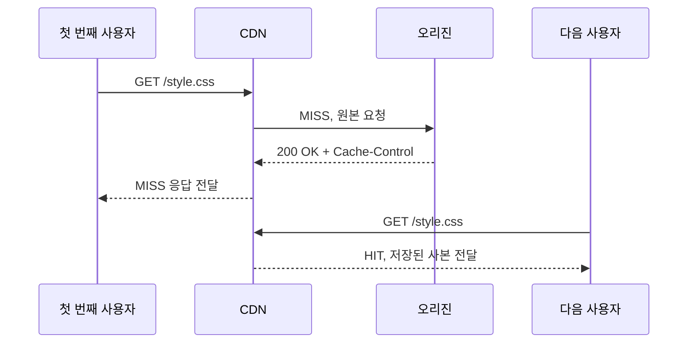
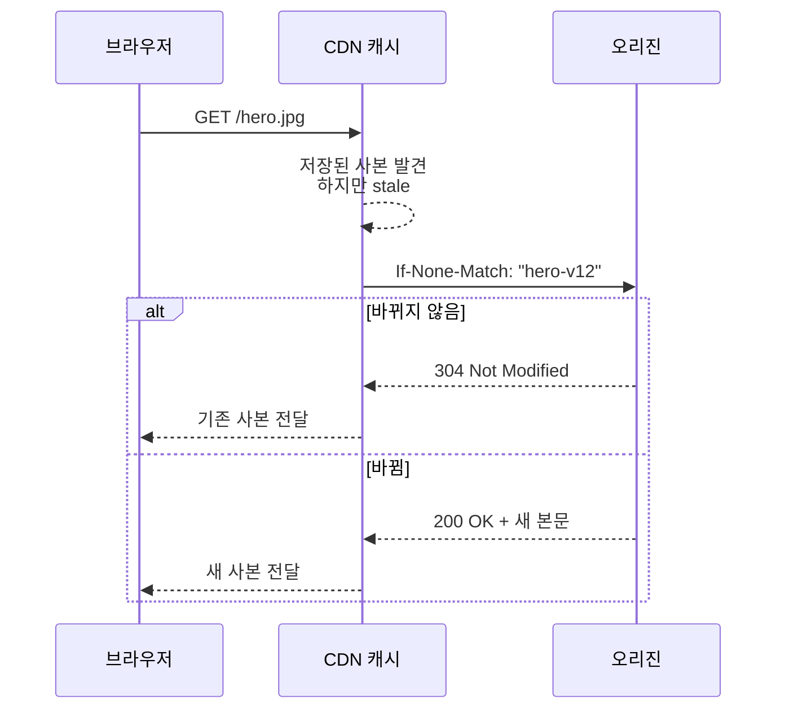
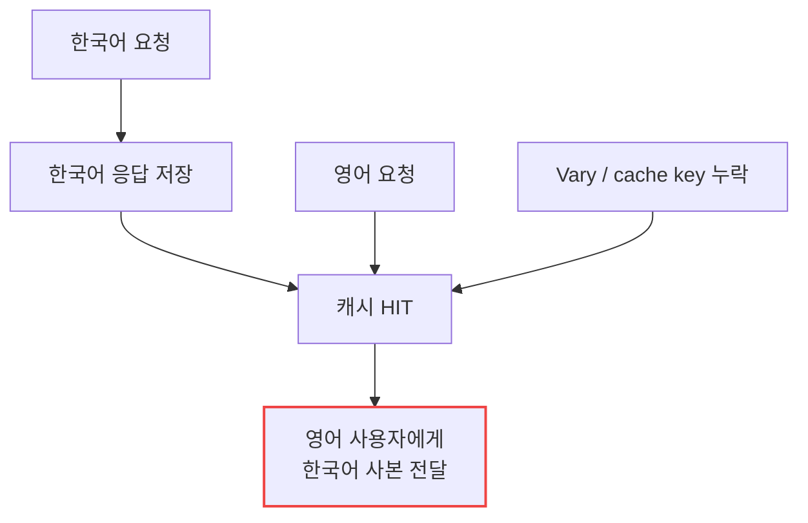
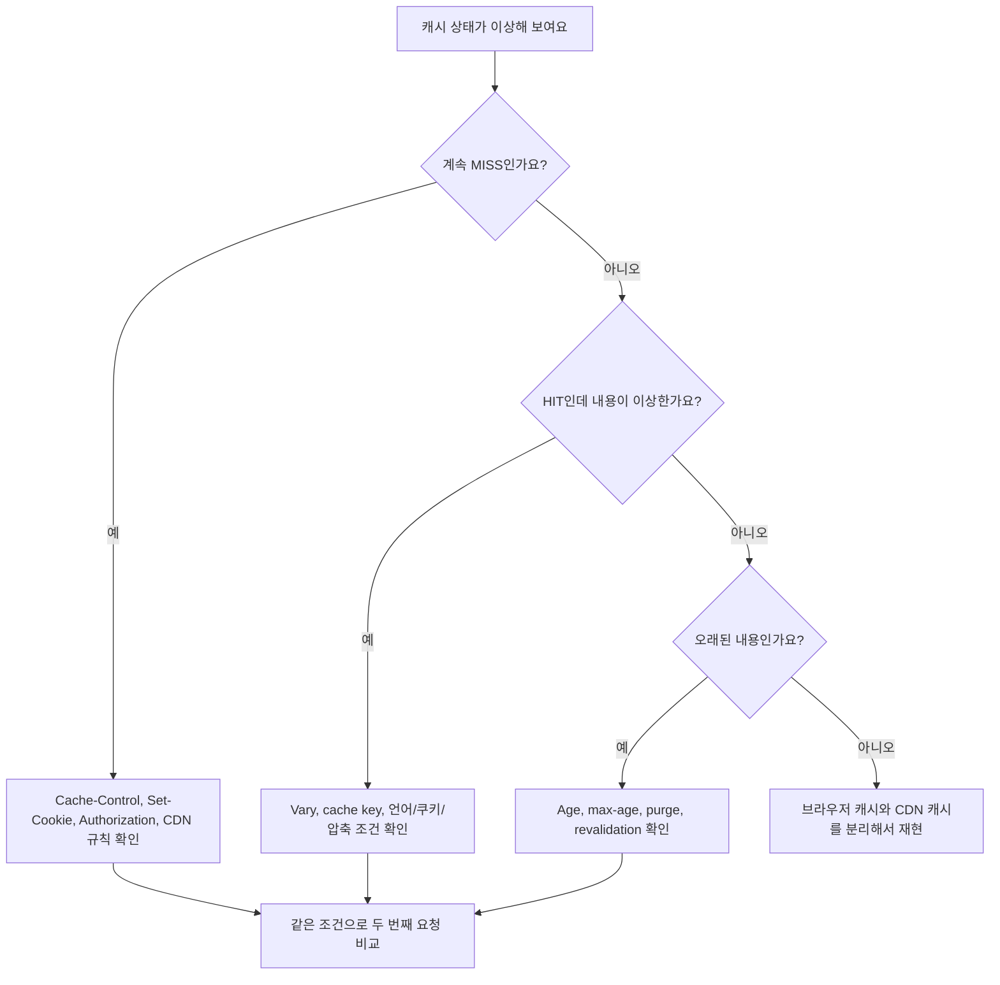

# CDN Cache Status 헤더는 어떻게 읽어야 할까요?

> `HIT`이면 무조건 빠르고, `MISS`면 무조건 문제가 있는 걸까요? **사실은 그 한 단어만으로는 캐시가 왜 그렇게 판단했는지까지 알 수 없어요.**

[CDN, Cache, 그리고 Edge Delivery](../basic/25-cdn-cache-and-edge-delivery.md){ data-preview }에서는 사용자 가까이에 복사본을 두는 큰 그림을 봤어요. 그리고 [Cache-Control과 Age 헤더](./reading-cache-control-and-age.md){ data-preview }에서는 사본이 아직 fresh인지, [Cache Key와 Vary](./cache-key-and-vary.md){ data-preview }에서는 같은 URL처럼 보여도 사본이 왜 갈라질 수 있는지 읽었죠.

이번에는 브라우저 Network 탭이나 `curl -I`에서 자주 보이는 이런 줄을 볼게요.

```http
HTTP/2 200
cache-control: public, max-age=600
age: 128
cf-cache-status: HIT
vary: Accept-Encoding
```

처음에는 `cf-cache-status: HIT`만 눈에 들어와요.

> *"아, CDN 캐시에서 나온 거구나."*

맞아요. 그런데 여기서 끝내면 아직 반쪽이에요. `HIT`인지 `MISS`인지, `Age`가 있는지, `Cache-Control`이 무엇인지, `Vary`가 어떤 요청 헤더를 비교하는지까지 같이 봐야 **왜 이 요청이 캐시에서 끝났는지**를 좁힐 수 있어요.

오늘 질문은 이거예요.

> *"이 응답은 캐시에 있었나요, 왜 없었나요, 있어도 그대로 써도 되는 사본이었나요?"*

HTTP 캐시의 기본 판단은 [RFC 9111: HTTP Caching](https://www.rfc-editor.org/info/rfc9111/)을 바닥에 두고, 캐시가 자신이 한 일을 설명하는 표준 헤더로는 [RFC 9211: Cache-Status](https://www.rfc-editor.org/rfc/rfc9211.html)가 있어요. 반면 `CF-Cache-Status`, `X-Cache`, `X-Cache-Status`는 표준 `Cache-Status`의 다른 이름이 아니라 제품별 헤더예요. 실제 운영 화면에서는 이런 벤더 헤더를 더 자주 볼 수 있으므로, 예를 들어 Cloudflare의 `HIT`, `MISS`, `BYPASS`, `DYNAMIC`, `STALE`, `REVALIDATED`, `UPDATING`은 Cloudflare 문서를 기준으로 읽어야 해요.

!!! note "이 글의 범위"
    여기서는 특정 CDN 설정 화면을 외우기보다, **CDN 캐시 상태 헤더를 다른 HTTP 캐시 신호와 함께 읽는 순서**를 잡아요. 상태 이름은 제품마다 다를 수 있으니, 실제 장애 분석에서는 해당 CDN 문서를 같이 확인해야 해요.

---

## 먼저 여섯 가지 신호를 한 화면에서 봐요

`HIT`이나 `MISS`는 택배의 처리 도장처럼 **이번 요청의 결과**를 보여줘요. 원인을 찾으려면 요청과 응답을 한 화면에 놓고 아래 순서로 읽는 편이 빨라요.

```text
Request URL: https://example.com/assets/app.8f31c2.css
Request Method: GET
Request Headers:
  Accept-Encoding: br, gzip

Response Headers:
  Status: 200
  Cache-Control: public, max-age=31536000, immutable
  Age: 86400
  Vary: Accept-Encoding
  Content-Encoding: br
  CF-Cache-Status: HIT
```

처음에는 아래 순서로 좁히면 좋아요.

| 순서 | 볼 것 | 묻는 질문 |
|---|---|---|
| 1 | 요청 method와 URL | 캐시가 재사용할 수 있는 요청인가요? |
| 2 | 캐시 상태 헤더 | `HIT`, `MISS`, `BYPASS`, `STALE` 중 무엇처럼 보이나요? |
| 3 | `Cache-Control` | 저장 가능하고, 얼마 동안 fresh인가요? |
| 4 | `Age` | 공유 캐시에 이미 얼마나 있었나요? |
| 5 | `Vary`와 요청 헤더 | 같은 URL이어도 사본이 나뉘는 조건이 있나요? |
| 6 | 쿠키와 인증 조건 | 공유 캐시에 두면 안 되는 사용자별 응답인가요? |

이 순서가 중요한 이유는, `MISS`가 항상 "캐시가 안 된다"는 뜻이 아니기 때문이에요. 첫 요청이라서 MISS일 수 있고, key가 달라서 MISS일 수 있고, stale 사본을 재검사하느라 오리진에 갔을 수도 있어요. 다만 상태 이름을 붙이는 기준은 제품과 시기에 따라 다르므로, 실제 CDN 문서를 함께 봐야 해요.

!!! tip "상태값은 결과, 주변 헤더는 이유예요"
    `HIT`이나 `MISS`는 캐시가 낸 결과예요. 그 이유는 `Cache-Control`, `Age`, `Vary`, 요청 헤더, 쿠키, CDN 설정 쪽에서 찾아야 해요.

## 상태 헤더 이름은 제품마다 달라요

브라우저나 `curl`에서 볼 수 있는 캐시 상태 헤더는 한 가지가 아니에요.

```http
CF-Cache-Status: HIT
X-Cache: HIT
X-Cache-Status: MISS
Cache-Status: "ExampleCache"; hit; ttl=246
```

`Cache-Status`는 RFC 9211에 정의된 표준 헤더예요. 반면 `CF-Cache-Status`나 `X-Cache` 계열은 제품이나 배포 환경에서 오래 써온 관측용 헤더라서, 이름이나 값이 비슷해도 표준 `Cache-Status` 문법과 의미를 그대로 적용하면 안 돼요.

| 헤더 | 읽는 감각 | 조심할 점 |
|---|---|---|
| `Cache-Status` | 표준화된 캐시 처리 설명 | 모든 CDN이 기본으로 붙이는 건 아니에요 |
| `CF-Cache-Status` | Cloudflare 캐시 처리 결과 | 값의 의미는 Cloudflare 문서를 기준으로 봐야 해요 |
| `X-Cache` | 프록시/CDN이 남긴 캐시 힌트 | 제품별 값과 포맷이 다를 수 있어요 |
| `X-Cache-Status` | 배포 환경에서 만든 상태 힌트 | 표준 의미라고 단정하면 안 돼요 |

처음 보는 헤더라면 표준인지, CDN 제품이 붙였는지, 중간 프록시가 만든 값인지부터 확인해요. 그래야 `HIT`, `MISS`, `BYPASS`를 다른 제품에 그대로 일반화하지 않게 돼요.

## HIT은 "저장된 사본을 썼다"에 가까워요

가장 읽기 쉬운 장면부터 볼게요.

```http
HTTP/2 200
cache-control: public, max-age=31536000, immutable
age: 86400
vary: Accept-Encoding
content-encoding: br
cf-cache-status: HIT
```

이 응답은 캐시에서 나온 정적 파일처럼 보여요.

| 신호 | 읽기 |
|---|---|
| `CF-Cache-Status: HIT` | CDN에 저장된 사본이 사용됐어요 |
| `Age: 86400` | 공유 캐시 안에서 하루 정도 나이를 먹었어요 |
| `max-age=31536000` | freshness lifetime이 아주 길어요 |
| `immutable` | URL이 바뀌지 않는 한 내용도 바뀌지 않는다는 강한 힌트예요 |
| `Vary: Accept-Encoding` | 압축 방식별 사본이 나뉠 수 있어요 |

여기서는 `Age`가 크다고 해서 바로 오래된 나쁜 응답이라고 보면 안 돼요. 해시가 붙은 정적 파일이고 `max-age`가 1년이라면, 하루 된 사본은 여전히 fresh일 수 있어요.


이 그림은 `HIT`이 "오리진을 매번 가지 않았다"는 뜻에 가깝다는 걸 보여줘요. 하지만 `HIT`이 항상 올바른 응답이라는 보장은 아니에요. cache key나 `Vary`가 잘못됐으면 잘못된 사본도 HIT으로 나갈 수 있어요.

## MISS는 "이번 요청에는 바로 쓸 사본이 없었다"에 가까워요

이번에는 첫 요청 장면이에요.

```http
HTTP/2 200
cache-control: public, max-age=600
cf-cache-status: MISS
```

이건 꼭 장애가 아니에요. CDN 엣지에 아직 사본이 없어서 오리진에 다녀온 것일 수 있어요. 같은 조건으로 다시 요청하면 그때는 `HIT`이 될 수도 있죠.



`MISS`를 봤다면 아래를 같이 확인해요.

| 확인할 것 | 왜 보나요? |
|---|---|
| 첫 요청인지 | 새 배포, 새 URL, 새 엣지 위치에서는 자연스러운 MISS일 수 있어요 |
| `Cache-Control` | 오리진 응답이 저장 가능한지 봐야 해요 |
| `Set-Cookie` | 쿠키가 붙으면 공유 캐시가 우회될 수 있어요 |
| `Vary`와 요청 헤더 | 다른 언어, 압축, 쿠키 조건 때문에 다른 key가 됐을 수 있어요 |
| CDN 규칙 | 특정 path나 status code를 캐시하지 않도록 설정됐을 수 있어요 |

!!! warning "`MISS`를 곧바로 'CDN이 고장났다'로 읽지 마세요"
    Cloudflare에서는 2026년 5월 26일부터 캐시할 수 없는 응답에 일관되게 `BYPASS`를 사용해요. `MISS`는 캐시할 수 있지만 요청 시점의 로컬 캐시에 없던 응답에만 사용해요. 과거 Cloudflare 배포에서는 캐시할 수 없는 응답에도 `MISS`가 섞여 나왔고, 다른 CDN은 지금도 기준이 다를 수 있어요. 자세한 변경 내용은 [Cloudflare Cache 변경 기록](https://developers.cloudflare.com/cache/changelog/#2026-05-26)에서 확인할 수 있어요.

## BYPASS와 DYNAMIC은 "캐시를 쓰지 않기로 했다"에 가까워요

이번에는 응답이 캐시에 저장되기 어려운 장면이에요.

```http
HTTP/2 200
cache-control: private, no-store
set-cookie: session=...
cf-cache-status: BYPASS
```

또는 이런 식으로 볼 수도 있어요.

```http
HTTP/2 200
cache-control: private, max-age=0
cf-cache-status: DYNAMIC
```

이런 값은 제품별 의미가 다르지만, 운영 감각으로는 **캐시에서 꺼낸 사본이 아니라 오리진이나 동적 처리 경로로 갔다**고 먼저 읽으면 좋아요.

| 신호 | 먼저 의심할 장면 |
|---|---|
| `private` | 사용자별 응답이라 공유 캐시에 두기 어려워요 |
| `no-store` | 저장 자체를 피해야 하는 응답이에요 |
| `max-age=0` | 바로 stale로 보고 재검사해야 할 수 있어요 |
| `Set-Cookie` | 사용자 상태를 바꾸는 응답일 수 있어요 |
| `Authorization` 요청 헤더 | 인증된 사용자 요청일 수 있어요 |

여기서 중요한 반전이 있어요.

> *"캐시가 안 됐으니 나쁜 설정이다"*

항상 그렇지는 않아요. 로그인 페이지, 장바구니, 결제 응답, 개인화 API는 공유 캐시에 저장되지 않는 편이 맞을 수 있어요. 캐시 상태 헤더는 성능 점수표가 아니라 **정책 판단의 흔적**이에요.

## EXPIRED, STALE, REVALIDATED, UPDATING은 "오래된 사본을 어떻게 처리했나"를 봐야 해요

캐시에는 사본이 있었지만 freshness lifetime이 끝난 장면도 있어요.

```http
HTTP/2 200
cache-control: public, max-age=300
age: 300
etag: "hero-v12"
cf-cache-status: REVALIDATED
```

이런 응답은 저장된 사본이 있었고, CDN이 오리진에 다시 확인했을 가능성을 떠올리게 해요. 오리진이 `304 Not Modified`로 "그 사본 그대로 써도 돼요"라고 확인해주면, 캐시는 본문을 다시 받지 않고 기존 사본을 내보낼 수 있어요.



반대로 `STALE`이나 `UPDATING`류의 값은 **stale 사본을 어떻게 다뤘는지**를 봐야 해요. 어떤 CDN은 오리진이 잠시 닿지 않을 때 오래된 사본을 대신 줄 수 있고, 어떤 설정에서는 stale 사본을 주면서 백그라운드로 갱신할 수 있어요. 이 영역은 제품과 설정 차이가 크기 때문에, 상태값 이름만 외우지 말고 아래 질문을 같이 남겨야 해요.

| 질문 | 왜 중요할까요? |
|---|---|
| stale 사본을 사용자에게 줬나요? | 사용자는 빠르게 받았지만 오래된 값을 봤을 수 있어요 |
| 오리진 재검사를 기다렸나요? | 지연이 늘어날 수 있어요 |
| 백그라운드 갱신이 켜져 있나요? | 첫 요청만 갱신 비용을 치르고 뒤 요청은 빠를 수 있어요 |
| `must-revalidate`가 있나요? | stale 사본을 그냥 쓰지 못하게 할 수 있어요 |

## 같은 HIT이어도 캐시 키가 틀리면 위험해요

`HIT`이 나왔는데 사용자에게 엉뚱한 언어가 보인다고 해볼게요.

```http
GET /guide HTTP/2
accept-language: en-US,en;q=0.9

HTTP/2 200
cache-control: public, max-age=600
content-language: ko
cf-cache-status: HIT
```

여기서 문제는 `HIT`이 아니라 **무엇을 같은 사본으로 봤는지**일 수 있어요. 언어별로 본문이 달라진다면 `Vary: Accept-Language`나 CDN의 커스텀 cache key가 그 차이를 반영해야 해요.



이런 장면에서는 캐시 상태 헤더만 보면 오히려 속을 수 있어요. `HIT`은 캐시가 사본을 찾았다는 뜻이지, 그 사본이 이 사용자에게 맞는지까지 대신 보증하지 않아요.

## 브라우저 캐시와 CDN 캐시를 섞어 읽지 마세요

Network 탭에는 이런 표시도 나와요.

```text
Name           Status   Size             Time
app.css        200      (memory cache)    0 ms
logo.svg       200      (disk cache)      1 ms
api/items      200      3.8 KB            92 ms
```

`(memory cache)`나 `(disk cache)`는 브라우저 쪽 캐시 표시예요. CDN의 `CF-Cache-Status: HIT`과는 관측 위치가 달라요.

| 위치 | 캐시 신호 | 읽는 감각 |
|---|---|---|
| 브라우저 | `(memory cache)`, `(disk cache)` | 사용자 기기 안에서 재사용 |
| CDN / 공유 캐시 | `Age`, `CF-Cache-Status`, `X-Cache`, `Cache-Status` | 중간 엣지나 프록시에서 재사용 |
| 오리진 | access log, request id | 실제 원본 서버까지 도착했는지 |

그래서 "내 브라우저에서는 빠른데 다른 사용자는 느리다" 같은 문제에서는 브라우저 캐시를 끄거나 hard reload, `curl -H 'Cache-Control: no-cache'`, 다른 지역/네트워크 테스트처럼 관측 조건을 나눠야 해요. 단, 요청에 `Cache-Control: no-cache`를 붙이면 캐시 동작 자체가 달라질 수 있으니, 평소 사용자 요청과 디버깅 요청을 구분해서 봐야 해요.

## 잘못 읽기 쉬운 함정

### `HIT`이면 항상 최신이라고 보기

`HIT`은 캐시에서 나왔다는 뜻에 가까워요. 최신인지 아닌지는 `Cache-Control`, `Age`, 재검사 정책, purge 여부를 같이 봐야 해요.

### `MISS`이면 캐시 설정이 실패했다고 보기

첫 요청, 새 배포 파일, 새 query, 새 언어 조건, 새 엣지 위치에서는 MISS가 자연스러울 수 있어요. 같은 조건의 두 번째 요청도 계속 MISS인지 봐야 해요.

### `Age`가 없으면 CDN을 안 탔다고 단정하기

제품별로 `Age`를 붙이는 조건이 다를 수 있어요. 예를 들어 어떤 CDN은 캐시에서 실제로 제공한 응답에만 `Age`를 붙이고, MISS나 동적 응답에는 붙이지 않을 수 있어요. `Age` 없음 하나로 경로 전체를 단정하지 마세요.

### 벤더 상태값을 모든 CDN에 똑같이 적용하기

`BYPASS`, `DYNAMIC`, `UPDATING` 같은 이름은 제품별 의미와 조건이 달라요. 글에서는 읽기 감각을 잡지만, 실제 운영에서는 해당 CDN 문서와 설정을 같이 봐야 해요.

### `HIT`만 높이면 무조건 좋다고 보기

히트율은 중요하지만, 사용자별 응답까지 공유 캐시에 섞이면 더 큰 문제가 돼요. 캐시는 빠른 것도 중요하지만, **맞는 사본을 맞는 사용자에게 주는 것**이 먼저예요.

## 장애나 이상 증상을 만나면 이렇게 좁혀봐요



실전에서는 아래 질문을 남기면 좋아요.

| 질문 | 답을 찾을 곳 |
|---|---|
| 캐시 상태 헤더는 누가 붙였나요? | CDN 문서, 프록시 설정, 응답 헤더 이름 |
| 같은 요청을 두 번 보냈을 때 상태가 바뀌나요? | `curl -I` 반복, Network 탭 재시도 |
| 저장 가능한 응답인가요? | `Cache-Control`, status code, method |
| 같은 사본으로 봐도 되는 요청인가요? | URL, query, `Vary`, 커스텀 cache key |
| 사용자별 응답이 섞일 위험이 있나요? | `Cookie`, `Authorization`, `private`, `no-store` |
| stale 사본이 사용자에게 나갔나요? | `Age`, 상태값, 재검사 로그, CDN 설정 |

## 자, 정리해볼까요?

!!! abstract "오늘 우리가 배운 것"
    - CDN 캐시 상태 헤더는 캐시가 **이번 요청을 어떻게 처리했는지** 보여주는 관측 신호예요.
    - `Cache-Status`는 표준 헤더이고, `CF-Cache-Status`, `X-Cache` 같은 헤더는 제품별 의미를 문서로 확인해야 해요.
    - `HIT`은 저장된 사본을 썼다는 뜻에 가깝지만, 그 사본이 최신인지 또는 이 요청에 맞는지는 별도로 봐야 해요.
    - 현재 Cloudflare에서 `MISS`는 캐시할 수 있지만 로컬 캐시에 없던 응답, `BYPASS`는 캐시할 수 없는 응답을 뜻해요.
    - 과거 Cloudflare 배포나 다른 CDN에서는 `MISS`, `BYPASS`, `DYNAMIC`, `STALE`, `REVALIDATED`, `UPDATING` 같은 값의 기준이 다를 수 있으므로 해당 시점과 제품의 문서를 함께 읽어야 해요.
    - 캐시 상태 헤더는 `Cache-Control`, `Age`, `Vary`, 요청 헤더, 쿠키, 인증 조건과 같이 봐야 이유가 보여요.
    - 브라우저 캐시와 CDN 캐시는 관측 위치가 다르므로 `(memory cache)` 표시와 CDN 상태 헤더를 섞어 읽으면 안 돼요.

캐시 상태 헤더는 캐시 디버깅의 결론이 아니라 **출발점**이에요. `HIT`인지 `MISS`인지 본 다음, "왜 그렇게 됐을까?"를 주변 헤더와 요청 조건으로 좁혀가는 게 핵심이에요.

## 이어서 보면 좋은 글

- [CDN, Cache, 그리고 Edge Delivery](../basic/25-cdn-cache-and-edge-delivery.md){ data-preview } — 캐시 히트와 미스, 오리진과 엣지의 큰 그림으로 돌아가고 싶을 때 좋아요.
- [Cache-Control과 Age 헤더는 어떻게 같이 읽어야 할까요?](./reading-cache-control-and-age.md){ data-preview } — 캐시 사본의 freshness와 나이를 먼저 정리하고 싶을 때 좋아요.
- [Cache Key와 Vary는 왜 같이 읽어야 할까요?](./cache-key-and-vary.md){ data-preview } — `HIT`인데도 사본이 이상하게 섞이는 이유를 더 깊게 볼 수 있어요.
- [ETag와 조건부 요청은 어떻게 304를 만들까요?](./etag-and-conditional-requests.md){ data-preview } — `REVALIDATED`나 `304 Not Modified`가 왜 보이는지 이어서 읽어볼 수 있어요.
