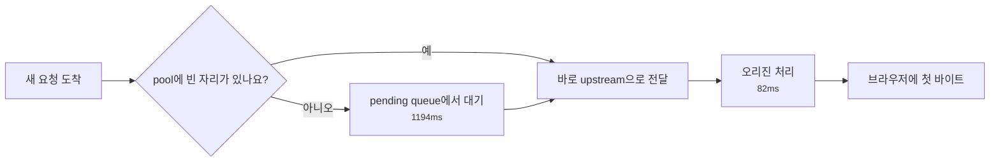
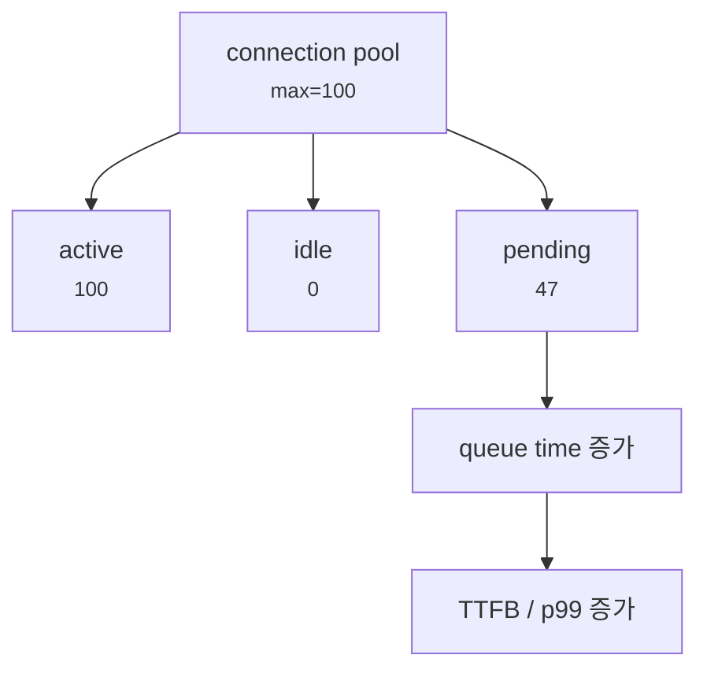
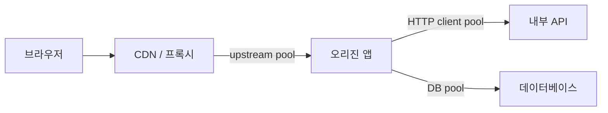
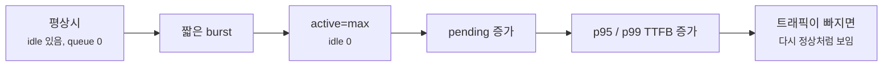
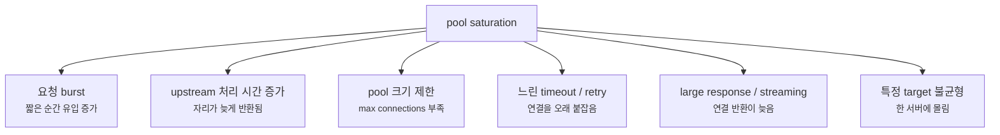

# Connection Pool Saturation은 왜 TTFB를 길게 만들까요?

> 서버가 느린 줄 알았는데, **사실은 서버로 가는 자리부터 기다리고 있었을 수 있어요.**

[Connection reuse, Keep-Alive, Pooling](./connection-reuse-keepalive-and-pooling.md){ data-preview }에서는 요청마다 새 연결을 열지 않고, 남겨둔 연결을 다시 쓰는 장면을 봤어요. 그리고 [Tail Latency와 p99](./tail-latency-and-p99.md){ data-preview }에서는 평균 뒤쪽에 숨어 있는 느린 요청들을 따로 봐야 한다고 했죠.

근데요, 운영 화면에서 이런 장면을 만나면 조금 헷갈려요.

```text
Browser waterfall:
Waiting for server response   1320 ms
Content Download                18 ms

Origin app log:
req_4ad1 GET /api/products 200 82ms

Edge upstream log:
upstream_queue_time=1194ms
upstream_connect_time=3ms
upstream_response_time=82ms
pool_active=100
pool_max=100
pool_pending=47
```

브라우저는 `Waiting`이 길다고 말해요. 그런데 앱 로그는 `82ms`밖에 안 걸렸다고 해요. 둘 중 하나가 거짓말하는 걸까요?

그럴 수도 있지만, 먼저 이렇게 읽는 게 좋아요.

> *"앱이 느린 게 아니라, 앱으로 들어갈 연결 자리가 비기를 기다린 건 아닐까요?"*

오늘은 이 장면, 즉 **connection pool saturation**을 읽어볼게요.

!!! note "이 글의 범위"
    여기서는 특정 제품의 튜닝값을 맞히기보다, 프록시·앱·DB·내부 API 앞의 connection pool이 가득 찼을 때 어떤 신호가 보이는지에 집중해요. HTTP connection pool, DB pool, worker pool은 세부 구현이 다르지만, **한정된 자리를 기다리며 queue가 생긴다**는 운영 감각은 함께 이어져요.

---

## 식당은 빠른데 입장 줄이 길 수 있어요

식당 안쪽 주방은 음식을 빨리 만들 수 있다고 해볼게요. 주문이 들어가면 3분이면 나와요.

그런데 테이블이 10개뿐이고, 손님이 한꺼번에 50명 오면 어떻게 될까요?

주방이 느리지 않아도 손님은 밖에서 기다려요. 자리가 나야 주문이 들어가고, 주문이 들어간 뒤에는 음식이 빨리 나와요.

웹 요청도 비슷해요.

| 식당 장면 | 네트워크 / 서버 장면 |
|---|---|
| 테이블 수가 정해져 있음 | pool의 최대 연결 수가 정해져 있음 |
| 이미 앉은 손님 | active connection |
| 빈 테이블 | idle connection |
| 밖에서 기다리는 손님 | pending request / queue |
| 주문 뒤 음식은 빨리 나옴 | 오리진 처리 시간은 짧음 |
| 입장 줄 때문에 체감이 느림 | TTFB / Waiting이 길어짐 |

그래서 pool saturation은 단순히 **"서버가 느리다"** 가 아니에요. 더 정확히는 **요청을 처리할 자리, 연결, worker, upstream slot이 이미 꽉 차서 새 요청이 기다리는 상태**에 가까워요.



이 그림에서 브라우저가 느끼는 `Waiting`은 `pending queue 대기`와 `오리진 처리`가 합쳐진 시간이에요. 앱 로그가 짧아도, 앞단에서 기다린 시간이 길면 사용자는 여전히 느리게 느껴요.

## saturation은 "가득 참"과 "줄 섬"을 같이 봐야 해요

connection pool을 단순화하면 세 칸으로 볼 수 있어요.



여기서 중요한 신호는 하나가 아니에요.

| 신호 | 읽는 감각 |
|---|---|
| `active == max` | 이미 모든 연결 자리가 사용 중이에요 |
| `idle == 0` | 바로 재사용할 수 있는 연결이 없어요 |
| `pending > 0` | 새 요청이 줄 서고 있어요 |
| `queue_time` 증가 | 줄에서 기다린 시간이 사용자 지연으로 보일 수 있어요 |
| `connect_time`은 짧음 | 네트워크 연결 자체가 느린 문제는 아닐 수 있어요 |
| `origin duration`은 짧음 | 앱 함수가 오래 계산한 문제도 아닐 수 있어요 |

`active`가 높은 것만으로는 부족해요. 트래픽이 많은 서비스에서는 active가 높은 시간이 자연스러울 수 있거든요. 하지만 `active`가 `max`에 붙어 있고, `idle`이 0이고, `pending`과 `queue_time`이 같이 늘면 pool saturation 쪽으로 훨씬 강하게 기울어요.

## 어디의 pool인지 먼저 붙여야 해요

"pool이 찼다"는 말도 보는 위치에 따라 뜻이 달라져요.



각 위치에서 보이는 증상이 조금씩 달라요.

| pool 위치 | 겉으로 보이는 모양 | 같이 볼 신호 |
|---|---|---|
| CDN / 프록시 -> 오리진 | 앱 로그는 짧은데 TTFB가 김 | upstream queue, origin connection count |
| 앱 -> 내부 API | 앱 로그 전체 시간이 길고 특정 호출이 김 | HTTP client pending, dependency p99 |
| 앱 -> DB | DB 쿼리 자체보다 checkout 대기가 김 | DB pool wait, active sessions, lock |
| worker / thread pool | 요청 시작 전부터 대기하거나 event loop lag | worker busy, queue depth, CPU |

그래서 "pool을 키우면 되나요?"라고 묻기 전에 먼저 **어느 구간의 pool이 찼는지**를 붙여야 해요. 앞단 upstream pool이 찬 건지, 앱의 DB pool이 찬 건지, 내부 API 클라이언트 pool이 찬 건지에 따라 다음 행동이 달라지거든요.

## 브라우저 Waiting과 앱 로그가 안 맞을 때 의심해요

pool saturation을 의심하기 좋은 대표 장면은 이거예요.

```text
Browser:
TTFB p99 = 1800ms

App:
route=/api/products p99 = 95ms

Edge:
upstream_queue_time p99 = 1650ms
pool_pending p99 = 38
pool_active = 100/100
```

브라우저 입장에서는 첫 바이트가 늦어요. 앱 입장에서는 요청을 받은 뒤 빨리 처리했어요. 그 사이가 비어 있죠.

이런 차이가 보이면 [Server-Timing과 Request ID](./server-timing-and-request-id.md){ data-preview }에서 본 것처럼 같은 요청을 id로 묶고, 각 구간의 시간을 다시 나눠봐야 해요.

| 구간 | 예시 시간 | 읽는 법 |
|---|---:|---|
| 브라우저 Waiting | `1800ms` | 사용자가 첫 바이트를 오래 기다렸어요 |
| 앞단 queue | `1650ms` | 오리진 연결 자리가 빌 때까지 기다렸어요 |
| upstream connect | `4ms` | 새 연결 자체는 오래 걸리지 않았어요 |
| 오리진 app | `95ms` | 앱 처리 자체는 짧아요 |
| download | `18ms` | 본문 전송도 짧아요 |

이 장면에서 앱 코드만 profile하면 답이 안 나올 수 있어요. 느린 시간의 대부분이 앱 함수 안쪽이 아니라, 앱 앞의 줄에서 생겼기 때문이에요.

!!! warning "앱 로그 시간이 짧다고 사용자의 느림이 가짜인 건 아니에요"
    앱 로그가 요청을 받은 뒤부터 시간을 재면, 앞단 queue에서 기다린 시간은 빠져요. 그래서 브라우저 Waiting, 앞단 upstream timing, 앱 duration의 시작점이 어디인지 같이 봐야 해요.

## p99에서 더 잘 보이는 이유가 있어요

pool saturation은 평균보다 p95, p99에서 먼저 튀어나오는 경우가 많아요.

평소에는 pool이 비어 있다가, 짧은 burst가 올 때만 줄이 생길 수 있거든요.

```text
10:00:00-10:01:00
avg queue_time = 18ms
p50 queue_time = 0ms
p95 queue_time = 420ms
p99 queue_time = 1710ms
max queue_time = 4980ms
```

여기서 평균 `18ms`만 보면 별일 없어 보여요. 하지만 p99는 `1710ms`예요. 대부분의 요청은 바로 지나갔고, 일부 요청만 꽉 찬 순간에 걸려 오래 기다렸다는 뜻이에요.



그래서 "지금은 정상인데요?"라는 말만으로는 부족해요. 같은 시간대의 queue depth, pool usage, p99 latency, 요청 수를 같이 봐야 해요.

## saturation이 생기는 흔한 이유들

pool이 찼다고 해서 무조건 pool 크기만 작은 건 아니에요.



여기서 핵심은 **연결 자리가 언제 반환되는지**예요. 요청 하나가 오래 걸리면 그 연결은 계속 active에 묶여 있어요. 그러면 뒤에 오는 요청은 빈 자리가 생길 때까지 기다려야 해요.

| 원인 후보 | 확인할 질문 |
|---|---|
| 갑작스러운 요청 burst | 요청 수와 pending 증가가 같은 시간에 붙나요? |
| upstream 처리 지연 | active 연결이 오래 유지되나요? |
| pool 크기 제한 | `active == max`가 자주 보이나요? |
| retry / timeout | 느린 요청이 설정 timeout 근처에 몰리나요? |
| long polling / streaming | 연결을 오래 붙잡는 endpoint가 있나요? |
| target 불균형 | 특정 오리진만 active와 pending이 높나요? |

pool은 앞쪽에서 보기에는 병목처럼 보이지만, 실제 원인은 뒤쪽 처리 시간일 수도 있어요. 뒤쪽이 느려져서 연결 반환이 늦어지고, 그 결과 앞쪽 queue가 생기는 식이죠.

## pool을 키우는 건 해결일 수도, 병목 이동일 수도 있어요

가장 쉬운 반응은 pool 크기를 키우는 거예요.

```text
max upstream connections: 100 -> 300
```

이렇게 하면 pending queue는 줄 수 있어요. 하지만 항상 정답은 아니에요.

| 조치 | 좋아질 수 있는 점 | 조심할 점 |
|---|---|---|
| pool 크기 증가 | 앞단 대기 시간이 줄 수 있어요 | 오리진이 더 많은 동시 요청을 감당해야 해요 |
| timeout 축소 | 죽은 요청이 자리를 오래 잡지 않아요 | 정상적인 느린 요청을 너무 빨리 끊을 수 있어요 |
| retry 제한 | 중복 시도로 pool을 더 채우는 일을 줄여요 | 일시 실패 복구력이 낮아질 수 있어요 |
| endpoint 분리 | 긴 요청이 짧은 요청 자리를 막지 않게 해요 | 라우팅과 운영 복잡도가 늘어요 |
| upstream 최적화 | 연결 반환이 빨라져요 | 앱, DB, 내부 API 쪽 원인 분석이 필요해요 |

pool을 키우는 건 **앞쪽 줄을 줄이는 조치**예요. 그런데 뒤쪽 서버가 감당하지 못하면 이제 오리진 CPU, DB pool, 내부 API가 다음 병목이 될 수 있어요.

그래서 좋은 질문은 "얼마나 키울까요?"보다 먼저 이거예요.

> *"지금 pool이 작은 건가요, 아니면 뒤쪽 요청이 너무 오래 자리를 붙잡고 있나요?"*

## 잘못 읽기 쉬운 함정

### TTFB가 기니까 앱 함수가 느리다고 보기

TTFB에는 앞단 queue, upstream 연결 대기, 오리진 처리, 첫 바이트 전송까지 여러 시간이 섞일 수 있어요. 앱 로그 duration이 짧고 upstream queue가 길면 앱 함수보다 pool 대기를 먼저 봐야 해요.

### active가 높으니 무조건 문제라고 보기

트래픽이 많으면 active 연결이 높은 건 자연스러울 수 있어요. 문제는 active가 max에 계속 붙고, idle이 0이고, pending과 queue time이 같이 늘어나는지예요.

### pool을 키우면 근본 원인이 사라진다고 보기

pool을 키우면 줄은 줄 수 있지만, 뒤쪽 오리진이 더 많은 동시 작업을 떠안아요. 병목이 DB, 내부 API, CPU로 이동할 수 있어요.

### 평균 queue time만 보고 안심하기

짧은 burst성 포화는 평균에 잘 안 보일 수 있어요. p95, p99, max, 시간대별 그래프를 같이 봐야 해요.

### 모든 endpoint가 같은 pool을 써도 된다고 보기

오래 붙잡는 요청과 짧은 요청이 같은 pool을 공유하면, 긴 요청이 짧은 요청까지 줄 세울 수 있어요. streaming, export, report 같은 endpoint는 따로 봐야 할 때가 있어요.

## 예시로 같이 읽어볼게요

### 1. 앱은 빠른데 브라우저 Waiting이 긴 경우

```text
Browser Waiting p99:  1800ms
App duration p99:     95ms
Edge queue p99:       1650ms
pool_active:          100/100
pool_pending p99:     38
```

이건 앱 내부 계산보다 앞단 upstream pool 대기를 먼저 봐야 해요. 같은 시간대 요청 수, target별 active, pending queue, 오리진 connection limit을 확인해요.

### 2. DB pool 대기가 앱 duration 안에 숨어 있는 경우

```text
App log:
req_7c11 route=/orders duration=1460ms
db_pool_wait=1210ms
db_query_time=42ms
render=38ms
```

쿼리 자체는 `42ms`인데 DB 연결을 얻기까지 `1210ms`를 기다렸어요. 이때는 쿼리 튜닝보다 DB pool 크기, transaction 길이, connection leak, slow transaction을 먼저 봐요.

### 3. 긴 요청이 짧은 요청을 막는 경우

```text
GET /api/products      p99 queue=40ms
GET /api/export.csv    p99 queue=4200ms

Shared upstream pool:
active=100/100
pending=63
```

export 요청이 오래 연결을 붙잡으면 같은 pool을 쓰는 짧은 요청도 같이 밀릴 수 있어요. endpoint 분리, 별도 pool, concurrency 제한, 비동기 export 같은 선택지를 검토해야 해요.

## 자, 정리해볼까요?

!!! abstract "오늘 우리가 배운 것"
    - connection pool saturation은 연결 자리나 처리 slot이 가득 차서 새 요청이 queue에서 기다리는 상태예요.
    - 브라우저 Waiting이 길어도 앱 로그 duration은 짧을 수 있어요. 앞단 queue 시간이 앱 로그 밖에 있을 수 있기 때문이에요.
    - `active == max`, `idle == 0`, `pending > 0`, `queue_time` 증가가 같이 보이면 pool saturation을 강하게 의심해요.
    - 평균보다 p95, p99에서 먼저 드러나는 경우가 많아요. 짧은 burst가 일부 요청만 길게 만들 수 있기 때문이에요.
    - pool을 키우는 건 해결일 수도 있지만, 뒤쪽 오리진·DB·내부 API로 병목을 옮기는 조치일 수도 있어요.
    - 어느 구간의 pool인지 먼저 붙여야 해요. 프록시 upstream pool, 앱 HTTP client pool, DB pool은 서로 다른 문제예요.

pool saturation은 겉으로는 그냥 **"서버 응답이 늦다"** 로 보이지만, 안쪽에서는 **자리가 비기를 기다리는 시간**일 수 있어요. 그래서 느린 요청을 볼 때는 앱 처리 시간만 보지 말고, 그 요청이 처리되기 전 어디선가 줄을 섰는지도 같이 봐야 해요.

## 이어서 보면 좋은 글

- [Connection reuse, Keep-Alive, Pooling은 왜 같이 봐야 할까요?](./connection-reuse-keepalive-and-pooling.md){ data-preview } — pool이 왜 생기고, 연결 재사용과 idle timeout이 어떤 관계인지 먼저 정리할 수 있어요.
- [Tail Latency와 p99는 왜 평균보다 먼저 봐야 할까요?](./tail-latency-and-p99.md){ data-preview } — 짧은 burst성 포화가 왜 평균보다 p99에서 먼저 보이는지 이어서 읽기 좋아요.
- [Server-Timing과 Request ID는 왜 같이 봐야 할까요?](./server-timing-and-request-id.md){ data-preview } — 느린 요청 하나를 브라우저, 앞단, 오리진 로그로 이어 붙이는 방법을 볼 수 있어요.
- [느린 upstream과 느린 render는 어떻게 구분할까요?](./slow-upstream-vs-slow-render.md){ data-preview } — pool 대기 뒤쪽에서 실제 upstream 대기와 응답 생성 시간을 다시 나눠볼 수 있어요.
