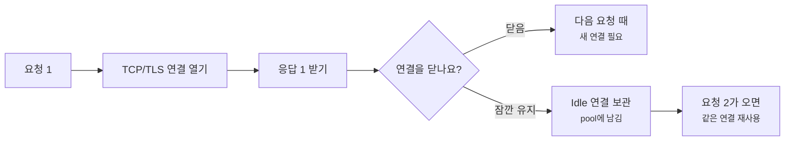
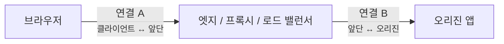
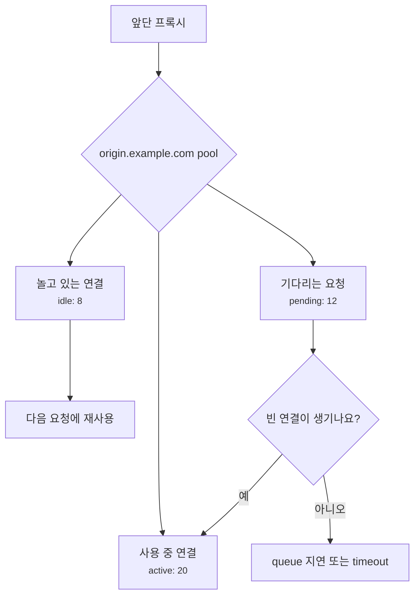
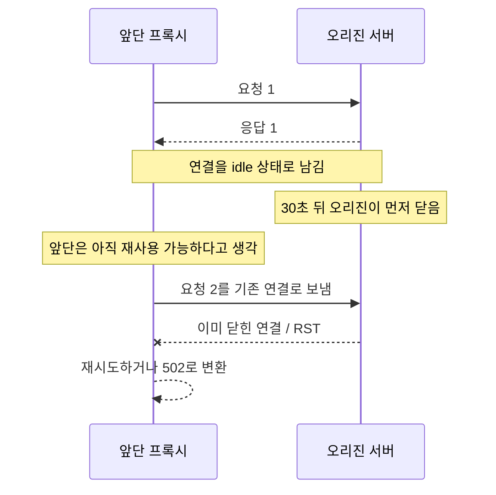
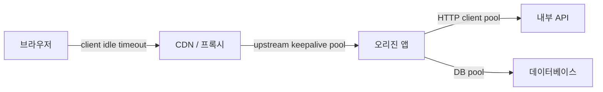
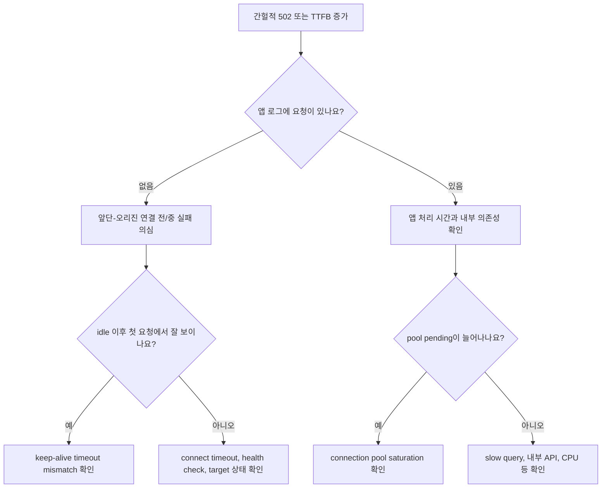

# Connection reuse, Keep-Alive, Pooling은 왜 같이 봐야 할까요?

> 요청 하나가 끝나면 연결도 바로 닫힐 것 같죠? **사실은 같은 연결을 잠깐 남겨두고 다시 쓰는 경우가 아주 많아요.**

[Proxy, Reverse Proxy, 그리고 Load Balancer](../basic/24-proxy-reverse-proxy-and-load-balancer.md){ data-preview }에서는 서버 앞단이 요청을 먼저 받고 오리진으로 넘기는 큰 그림을 봤어요. 그리고 [End-to-End Request Debugging](../basic/26-end-to-end-request-debugging.md){ data-preview }에서는 느린 요청을 DNS, TCP, TLS, 프록시, 캐시, 오리진 체크포인트로 나눠 읽었죠.

이번 글은 그중에서도 **앞단과 오리진 사이의 연결을 다시 쓰는 장면**을 볼게요.

운영 로그나 설정을 보다 보면 이런 표현이 나와요.

```text
keepalive_timeout 65s
upstream keepalive 32
max idle connections per host
connection pool exhausted
upstream prematurely closed connection
```

처음에는 다 비슷하게 **"연결을 오래 열어둔다"** 는 말처럼 보이기 쉬워요. 그런데 실제로는 조금씩 달라요.

- HTTP 메시지 관점에서는 **persistent connection**이에요.
- 설정 화면에서는 **keep-alive**라고 보일 수 있어요.
- 프록시나 클라이언트 라이브러리 안에서는 **connection pool**로 관리돼요.
- 장애 화면에서는 **502, 503, 504, 지연, 연결 재시도**로 튀어나올 수 있어요.

오늘의 질문은 이거예요.

> *"이 요청은 새 연결을 열었을까요, 아니면 남아 있던 연결을 다시 썼을까요?"*

!!! note "이 글의 범위"
    여기서는 특정 서버 제품의 설정법보다 **연결 재사용(connection reuse)**, **HTTP keep-alive**, **connection pool**, **idle timeout mismatch**를 운영 장면에서 읽는 법에 집중해요. HTTP/2와 HTTP/3는 연결 안에서 여러 요청을 동시에 섞을 수 있어서 세부 구현이 다르지만, "연결을 매번 새로 만들지 않는다"는 큰 감각은 같이 이어져요.

---

## 매번 새 택시를 부르지 않고, 잠깐 기다리게 할 수 있어요

배달 기사님이 건물 앞에 왔다고 해볼게요.

주문 하나를 전달할 때마다 기사님을 보내버리고, 다음 주문 때마다 새 기사님을 다시 부르면 시간이 많이 들어요. 건물 입구 확인, 엘리베이터 이동, 담당자 찾기 같은 준비가 매번 반복되니까요.

반대로 주문이 계속 들어올 가능성이 있으면 기사님을 잠깐 기다리게 할 수 있어요. 다음 주문이 바로 생기면 같은 기사님이 이어서 가져가면 되죠.

웹 연결도 비슷해요.

| 배달 장면 | 네트워크 장면 |
|---|---|
| 기사님을 새로 부름 | 새 TCP 연결, 새 TLS 핸드셰이크 |
| 기사님이 잠깐 대기 | idle 연결을 잠깐 유지 |
| 다음 주문을 같은 기사님에게 맡김 | 같은 연결로 다음 HTTP 요청 전송 |
| 대기 시간이 지나 기사님이 떠남 | idle timeout으로 연결 닫힘 |
| 대기 중인 기사님 명단 | connection pool |
| 서로 대기 시간을 다르게 알고 있음 | idle timeout mismatch |

핵심은 **연결과 요청은 같은 단위가 아니라는 점**이에요. 요청 하나가 끝났다고 해서 TCP 연결도 반드시 바로 사라지는 건 아니에요. 연결은 잠깐 살아 있고, 그 위로 다음 요청이 지나갈 수 있어요.



이 그림에서 중요한 건 중간의 `Idle 연결`이에요. 놀고 있는 연결은 아무 일도 안 하는 것처럼 보이지만, 다음 요청의 TCP/TLS 준비 시간을 줄여줄 수 있어요. 대신 너무 많이 남겨두면 서버와 프록시의 파일 디스크립터, 메모리, connection slot을 잡아먹어요.

## HTTP/1.1에서는 연결을 기본적으로 다시 쓰려고 해요

HTTP/1.0 시절에는 요청 하나, 응답 하나가 끝나면 연결을 닫는 방식이 흔했어요. 그런데 웹 페이지 하나에도 이미지, CSS, JavaScript, API 요청이 여럿 붙잖아요. 매번 TCP 연결을 새로 열고 TLS까지 다시 하면 낭비가 커요.

그래서 HTTP/1.1에서는 기본적으로 같은 연결에 여러 요청과 응답을 실을 수 있는 **persistent connection**을 써요. [RFC 9112의 persistence 절](https://www.rfc-editor.org/rfc/rfc9112.html#name-persistence)은 HTTP/1.1이 기본적으로 persistent connection을 사용한다고 설명해요.

아주 단순하게 보면 이런 흐름이에요.

```text
TCP connection #1
  GET /index.html  ->  200 OK
  GET /app.css     ->  200 OK
  GET /app.js      ->  200 OK
  ...idle...
  close
```

여기서 `Connection: keep-alive`라는 헤더를 떠올릴 수 있어요. 다만 조심해야 해요. HTTP/1.1에서는 연결 유지가 기본 방향이라, `keep-alive`라는 단어가 보이지 않는다고 해서 곧바로 "재사용 안 함"이라고 읽으면 안 돼요.

반대로 이런 헤더는 더 직접적인 신호예요.

```http
Connection: close
```

이건 현재 메시지 뒤에 연결을 닫겠다는 신호로 읽을 수 있어요. 그리고 `Connection` 헤더는 end-to-end로 끝까지 전달되는 일반 헤더가 아니라, 현재 연결 구간에서 처리되는 hop-by-hop 성격의 헤더예요. 이 점은 [RFC 9110의 Connection 절](https://www.rfc-editor.org/rfc/rfc9110.html#name-connection)에 정리돼 있어요.

!!! warning "`Connection: keep-alive`를 모든 HTTP 버전의 정답처럼 보면 안 돼요"
    HTTP/2와 HTTP/3에서는 HTTP/1.1식 `Connection` 헤더를 그대로 쓰는 감각으로 읽으면 안 돼요. HTTP/2는 한 TCP 연결 위에 여러 스트림을 multiplexing하고, HTTP/3는 QUIC 연결 위에서 스트림을 나눠요. 그래서 로그에 `keep-alive`라는 단어가 없더라도 연결 재사용과 요청 multiplexing은 다른 방식으로 일어날 수 있어요.

## 브라우저-앞단 연결과 앞단-오리진 연결은 따로 봐야 해요

연결 재사용이 헷갈리는 가장 큰 이유는, 요청 경로에 연결이 하나만 있는 게 아니기 때문이에요.

사용자가 `https://shop.example.com`에 접속하면 적어도 이런 구간이 나뉠 수 있어요.



겉으로는 요청 하나처럼 보이지만, 앞단이 TLS를 종료하거나 HTTP를 읽는 구조라면 클라이언트와 앞단 사이 연결 A, 앞단과 오리진 사이 연결 B는 서로 다른 연결이에요.

그래서 아래 질문을 나눠야 해요.

| 질문 | 보는 구간 |
|---|---|
| 브라우저가 새 TCP/TLS를 열었나요? | 클라이언트 ↔ 앞단 |
| 앞단이 기존 upstream 연결을 재사용했나요? | 앞단 ↔ 오리진 |
| 앱 서버가 연결을 먼저 닫았나요? | 오리진 쪽 idle timeout |
| 프록시 pool에 남은 연결이 충분했나요? | 앞단 내부 connection pool |
| 연결 재사용 실패를 프록시가 재시도했나요? | 앞단 정책과 요청 메서드 |

[TLS 종료와 TLS 패스스루](./tls-termination-vs-passthrough.md){ data-preview }에서 본 것처럼, 앞단에서 TLS가 끝나면 앞단은 오리진과 별도의 새 연결을 만들 수 있어요. 이때 브라우저 쪽 연결은 멀쩡해도, 오리진 쪽 연결 재사용에서 문제가 날 수 있어요.

```text
browser -> edge: existing h2 connection OK
edge -> origin: reused HTTP/1.1 connection was already closed
edge -> browser: 502 or retry
```

사용자 입장에서는 그냥 "가끔 502가 떠요"예요. 하지만 실제 장면은 **브라우저와 앞단 사이가 아니라, 앞단이 오리진으로 재사용하려던 연결**일 수 있어요.

## Connection pool은 남겨둔 연결의 대기실이에요

프록시, 앱 서버, HTTP 클라이언트 라이브러리는 보통 연결을 그냥 흩어놓지 않아요. 대상 호스트별로 "지금 쓸 수 있는 연결", "사용 중인 연결", "대기 중인 요청"을 관리해요. 이 묶음을 connection pool이라고 부르는 경우가 많아요.



pool이 있으면 좋은 점은 분명해요.

- 매 요청마다 TCP/TLS 연결 준비를 반복하지 않아도 돼요.
- 오리진에 갑자기 너무 많은 새 연결을 만들지 않도록 제한할 수 있어요.
- 같은 대상에 대한 연결 수와 대기 요청 수를 관측할 수 있어요.

하지만 pool은 성능 장치이면서 동시에 병목 지점이에요. pool 크기가 너무 작으면 요청이 줄을 서요. 너무 크면 오리진이 감당해야 하는 연결 수가 늘어요. idle 연결을 너무 오래 잡으면 리소스를 낭비하고, 너무 빨리 닫으면 재사용 이점이 줄어요.

| pool에서 보이는 신호 | 읽는 법 |
|---|---|
| `active connections` 증가 | 실제로 처리 중인 연결이 많아짐 |
| `idle connections` 많음 | 재사용 후보가 많지만 리소스도 잡고 있음 |
| `pending requests` 증가 | 연결을 기다리는 요청이 줄 서고 있음 |
| `connect timeout` 증가 | 새 연결을 만들거나 target에 붙는 데 실패 |
| `upstream timeout` 증가 | 연결은 됐지만 응답이 늦음 |

!!! tip "pool은 빠르게 만드는 장치이자 줄 세우는 장치예요"
    connection pool은 항상 좋은 것만은 아니에요. 재사용으로 빠르게 만들기도 하지만, 동시에 최대 연결 수를 넘는 요청을 기다리게 만드는 지점이기도 해요.

## Keep-Alive mismatch는 간헐적인 502처럼 보일 수 있어요

가장 헷갈리는 장면은 양쪽의 idle timeout이 다를 때예요.

예를 들어 앞단은 오리진 연결을 60초 동안 재사용할 수 있다고 생각하고, 오리진은 30초 동안 요청이 없으면 연결을 닫는다고 해볼게요.



이 장면은 매번 터지지 않아요. 새 연결을 열면 정상이고, 재사용 타이밍이 맞을 때만 실패해요. 그래서 "배포 후 모든 요청이 실패"가 아니라 **"가끔 첫 요청만 502"**, **"트래픽이 낮을 때 더 잘 보임"**, **"idle 시간이 지난 뒤 첫 호출이 실패"** 같은 모양으로 나타날 수 있어요.

| 증상 | 의심할 장면 |
|---|---|
| 한동안 조용하다가 첫 요청이 502 | idle 연결 재사용 실패 |
| 바로 새로고침하면 성공 | 새 연결로 다시 붙었거나 프록시가 재시도 |
| 앱 access log에 요청이 없음 | 오리진 앱까지 HTTP 요청이 도달하기 전 실패 |
| 앞단 로그에 `connection reset` | 이미 닫힌 upstream 연결을 다시 쓰려 했을 수 있음 |
| POST에서 더 조심스러움 | 재시도가 안전한지 판단하기 어려움 |

여기서 프록시가 자동으로 재시도하면 사용자는 문제를 못 볼 수도 있어요. 하지만 모든 요청을 마음대로 재시도할 수 있는 건 아니에요. `GET`처럼 부작용이 없는 요청은 상대적으로 재시도하기 쉽지만, 주문 생성 같은 `POST`는 이미 처리됐는지 알 수 없는 상태에서 재시도하면 중복 처리가 될 수 있거든요.

!!! warning "간헐적인 502를 앱 예외로만 보면 놓칠 수 있어요"
    앱 로그에 예외가 없고, 앞단 로그에 upstream reset이나 prematurely closed 같은 표현이 보이면 connection reuse와 idle timeout을 같이 확인해보세요. 특히 앞단 timeout이 오리진 timeout보다 길면, 앞단이 죽은 연결을 살아 있다고 착각하는 순간이 생길 수 있어요.

## 지연을 볼 때는 새 연결 비용과 pool 대기 시간을 나눠요

느린 요청을 보면 "오리진이 느리다"로 바로 가기 쉬워요. 하지만 연결 재사용이 끼어 있으면 시간이 두 갈래로 나뉘어요.

첫 번째는 **새 연결을 준비하는 비용**이에요.

```text
DNS Lookup              4 ms
Initial connection     35 ms
SSL                    48 ms
Request sent            1 ms
Waiting               120 ms
Content Download        3 ms
```

이런 모양이면 TCP 연결과 TLS 핸드셰이크 시간이 눈에 보여요. 연결을 재사용하면 DNS, TCP, TLS 구간이 0ms에 가깝거나 생략된 것처럼 보일 수 있어요.

두 번째는 **pool에서 연결을 기다리는 시간**이에요. 이건 브라우저 waterfall에 그대로 보이지 않을 수도 있어요. 브라우저는 앞단에 이미 요청을 보냈고, 앞단 내부에서 오리진 pool이 비기를 기다리는 장면일 수 있거든요.

```text
client -> edge: request received
edge: waiting for available upstream connection 180ms
edge -> origin: request sent
origin -> edge: response 40ms
edge -> client: response
```

사용자에게는 `Waiting for server response`가 220ms처럼 보일 수 있어요. 하지만 그중 180ms는 앱이 계산한 시간이 아니라, 앞단이 오리진 연결 자리를 기다린 시간일 수 있어요.

| 보이는 시간 | 바로 단정하면 안 되는 것 | 같이 볼 것 |
|---|---|---|
| TCP/TLS 시간이 큼 | 앱이 느림 | 새 연결이 자주 생기는지 |
| Waiting/TTFB가 큼 | 앱 처리만 느림 | 앞단 queue, pool pending, upstream connect |
| 다운로드 시간이 큼 | 연결 재사용 문제 | 응답 크기, 대역폭, 압축 |
| 특정 target만 느림 | 전체 오리진 문제 | target별 pool, health, connection count |

[브라우저 waterfall](./reading-browser-waterfall.md){ data-preview }은 클라이언트 쪽 시간을 잘 보여줘요. 하지만 앞단 내부 pool 대기까지 모두 드러내지는 못해요. 그래서 운영 로그의 upstream timing, request id, server timing이 같이 필요해져요.

## 설정을 읽을 때는 "누구와 누구 사이"인지 먼저 붙여요

`keepalive_timeout`, `idle_timeout`, `max_connections`, `max_idle_connections` 같은 설정 이름은 제품마다 달라요. 그래서 이름만 보면 위험해요.

먼저 이 질문을 붙여야 해요.

> *"이 설정은 어느 구간의 연결에 적용되나요?"*

| 설정이 걸린 위치 | 의미가 달라지는 이유 |
|---|---|
| 브라우저 ↔ CDN | 사용자 연결 유지, HTTP/2/3 세션, 엣지 연결 수 |
| CDN ↔ 로드 밸런서 | 엣지에서 오리진 입구까지의 재사용 |
| 로드 밸런서 ↔ 앱 서버 | upstream pool, idle timeout mismatch |
| 앱 서버 ↔ 내부 API | 앱의 HTTP client pool, 의존성 병목 |
| 앱 서버 ↔ DB | HTTP는 아니지만 pool 고갈 감각은 비슷함 |

예를 들어 `keepalive_timeout 75s`라는 줄 하나만 봐서는 부족해요. 그게 클라이언트가 프록시에 붙는 연결인지, 프록시가 upstream에 붙는 연결인지, 앱이 외부 API에 붙는 연결인지에 따라 장애 해석이 달라져요.



이 그림에서 모든 화살표는 "연결을 열고, 유지하고, 닫는 정책"을 가질 수 있어요. 그래서 지연이나 502를 볼 때 한 구간만 보면 놓치기 쉬워요.

## 잘못 읽기 쉬운 함정

### Keep-Alive가 길수록 무조건 좋다고 보기

연결을 오래 유지하면 재사용 가능성이 늘어요. 하지만 idle 연결도 리소스를 잡아요. 서버가 감당할 수 있는 연결 수가 정해져 있는데, 오래 놀고 있는 연결이 너무 많으면 새 요청이 들어올 자리가 줄어들 수 있어요.

그래서 keep-alive timeout은 "길수록 빠름"이 아니라 **재사용 이점과 리소스 점유 사이의 균형**으로 봐야 해요.

### Connection pool을 크게 하면 병목이 사라진다고 보기

pool을 키우면 줄 서는 요청은 줄어들 수 있어요. 하지만 그만큼 오리진이나 내부 API가 동시에 받아야 하는 연결도 늘어요. 뒤쪽이 감당하지 못하면 병목이 뒤로 밀릴 뿐이에요.

pool 크기는 앞단만의 설정이 아니라, 오리진 worker 수, upstream 처리 시간, timeout, 재시도 정책과 같이 봐야 해요.

### 브라우저 waterfall만 보고 upstream pool을 판단하기

브라우저 waterfall은 사용자의 브라우저와 앞단 사이를 보는 데 강해요. 하지만 앞단이 오리진 pool에서 얼마나 기다렸는지는 별도 로그나 metric 없이는 잘 안 보여요.

그래서 `Waiting`이 길다고 해서 곧바로 앱 함수가 느리다고 단정하면 안 돼요. 앞단 queue, upstream connect time, origin response time을 나눠 봐야 해요.

### HTTP keep-alive와 TCP keepalive를 섞어 보기

HTTP keep-alive는 HTTP 요청과 응답 뒤에 연결을 재사용하는 이야기예요. TCP keepalive는 더 낮은 계층에서 죽은 연결을 감지하기 위한 별도 메커니즘이에요.

이름이 비슷해서 헷갈리지만, 운영 설정에서는 둘을 구분해서 읽어야 해요.

## 장애를 만났을 때는 이렇게 좁혀봐요

간헐적인 502나 이유 모를 TTFB 증가를 보면 아래 순서로 좁혀볼 수 있어요.



이 흐름은 정답표가 아니라 읽는 순서예요. 핵심은 "502니까 앱 예외" 또는 "TTFB니까 DB"처럼 바로 뛰지 않는 거예요. 연결 재사용이 끼어 있으면, 실패한 지점은 요청 처리 전일 수도 있고 pool 대기 중일 수도 있어요.

실전에서는 이런 신호를 같이 모으면 좋아요.

| 확인할 신호 | 왜 보나요? |
|---|---|
| 앞단 access/error log | upstream reset, prematurely closed, timeout 표현 |
| 오리진 access log | 요청이 실제 앱까지 도달했는지 |
| upstream timing | connect, queue, first byte 시간을 분리 |
| pool metric | active, idle, pending, max reached 여부 |
| target별 에러율 | 특정 오리진만 timeout mismatch가 있는지 |
| 배포/재시작 시각 | 연결이 끊기는 시점과 겹치는지 |

## 자, 정리해볼까요?

!!! abstract "오늘 우리가 배운 것"
    - 요청 하나가 끝났다고 연결이 반드시 바로 닫히는 건 아니에요.
    - HTTP/1.1은 기본적으로 persistent connection을 사용하고, HTTP/2와 HTTP/3는 다른 방식으로 연결 안에 여러 요청을 싣기도 해요.
    - 브라우저-앞단 연결과 앞단-오리진 연결은 서로 다른 연결이므로 따로 봐야 해요.
    - connection pool은 재사용으로 빠르게 만들지만, 동시에 요청을 줄 세우는 병목이 될 수도 있어요.
    - idle timeout mismatch는 한동안 조용하다가 첫 요청에서 보이는 간헐적 502처럼 나타날 수 있어요.

## 이어서 보면 좋은 글

- [한동안 조용한 뒤 첫 요청만 502가 나는 이유는 뭘까요?](./case-keepalive-mismatch-502.md){ data-preview } — idle timeout mismatch가 실제 로그, 재시도, FIN/RST에서 어떻게 보이는지 사례로 이어서 읽어봐요.
- [TLS 종료와 TLS 패스스루는 어디서 갈라질까요?](./tls-termination-vs-passthrough.md){ data-preview } — 앞단과 오리진 사이 연결이 왜 클라이언트 쪽 HTTPS와 별개인지 먼저 정리하고 싶을 때 좋아요.
- [502, 503, 504는 어디서 만든 응답일까요?](./reading-502-503-504.md){ data-preview } — connection reuse 실패가 어떤 5xx 모양으로 보일 수 있는지 이어서 읽기 좋아요.
- [브라우저 waterfall은 어디부터 읽어야 할까요?](./reading-browser-waterfall.md){ data-preview } — 새 연결 비용과 TTFB를 클라이언트 화면에서 먼저 나눠 보고 싶을 때 좋아요.
- [Connection Pool Saturation은 왜 TTFB를 길게 만들까요?](./connection-pool-saturation.md){ data-preview } — pool이 가득 찼을 때 앱은 빨라도 사용자는 기다리는 장면을 이어서 볼 수 있어요.
