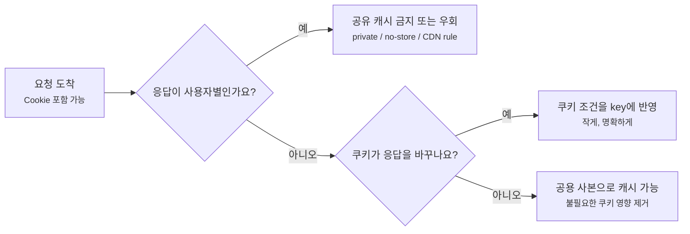
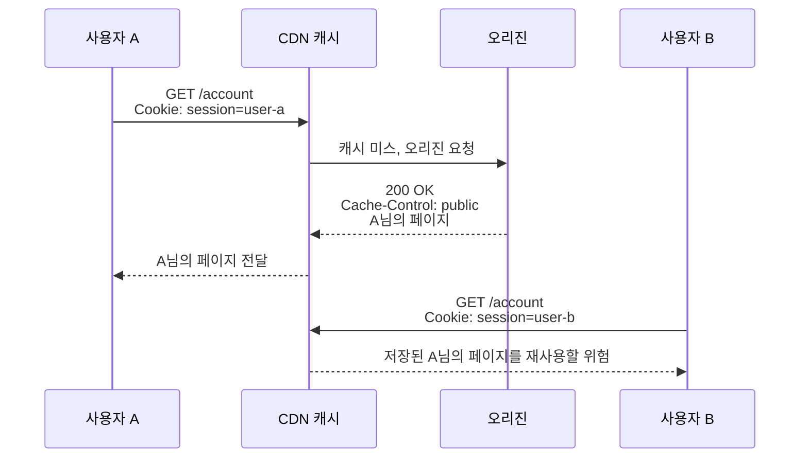
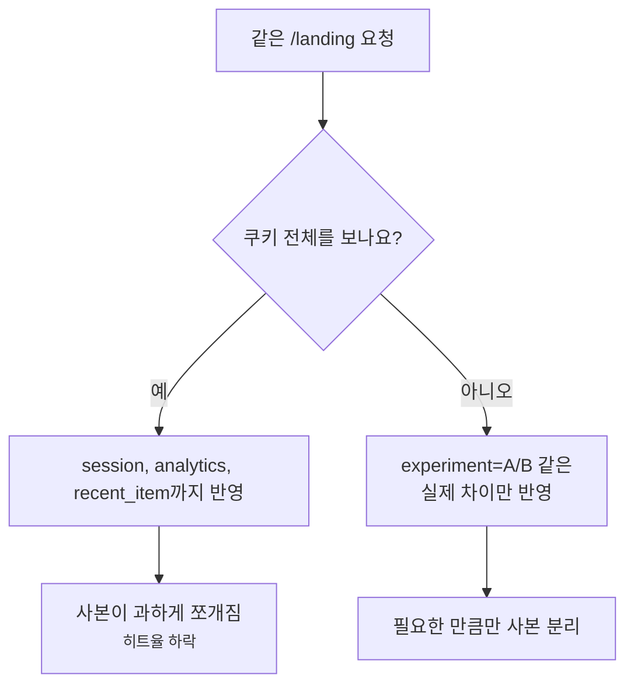

# Cookie와 캐시 가능성은 왜 같이 봐야 할까요?

> 쿠키가 보이면 캐시가 무조건 꺼질 것 같죠? **사실은 쿠키가 있다는 사실만으로 HTTP 캐시 가능성이 자동으로 끝나지는 않아요.**

[CDN, Cache, 그리고 Edge Delivery](../basic/25-cdn-cache-and-edge-delivery.md){ data-preview }에서는 캐시가 사용자 가까이에 복사본을 두는 큰 그림을 봤어요. 그리고 [Cache Key와 Vary](./cache-key-and-vary.md){ data-preview }에서는 같은 URL이라도 요청 헤더나 쿠키 조건 때문에 사본이 나뉠 수 있다는 감각을 잡았죠.

이번에는 캐시 문제에서 가장 조심스러운 신호를 볼게요.

```http
GET /account HTTP/2
Cookie: session=abc123; theme=dark

HTTP/2 200
Cache-Control: public, max-age=300
Set-Cookie: last_seen=1719052800; Path=/; Secure; HttpOnly
```

처음 보면 이렇게 말하고 싶어져요.

> *"쿠키가 있으니까 당연히 캐시 안 되겠죠?"*

그런데 이 단정이 위험해요. `Cookie` 요청 헤더와 `Set-Cookie` 응답 헤더가 있다고 해서 HTTP 표준상 캐시 저장과 재사용이 자동으로 금지되는 건 아니거든요. [RFC 9111: HTTP Caching](https://www.rfc-editor.org/info/rfc9111/)은 `Set-Cookie` 응답 헤더가 캐싱을 막지 않는다고 설명하고, [RFC 6265: HTTP State Management Mechanism](https://datatracker.ietf.org/doc/html/rfc6265)도 `Cookie`나 `Set-Cookie`의 존재만으로 HTTP 캐시가 응답을 저장하거나 재사용하지 못하게 되는 것은 아니라고 설명해요.

그래서 오늘 질문은 이거예요.

> *"이 응답은 여러 사용자가 같이 써도 되는 사본일까요, 아니면 한 사용자에게만 묶어야 하는 사본일까요?"*

!!! note "이 글의 범위"
    여기서는 쿠키 문법 전체보다 **쿠키가 캐시 가능성 판단에 어떤 신호로 들어오는지**에 집중해요. 실제 CDN은 `Set-Cookie`가 있으면 우회하거나, 쿠키를 제거하고 저장하거나, 특정 쿠키만 cache key에 넣는 제품별 정책을 가질 수 있어요. 그래서 표준 원칙과 CDN 설정을 함께 봐야 해요.

---

## 같은 도시락처럼 보여도 이름표가 붙으면 조심해야 해요

회사 탕비실에 도시락이 놓여 있다고 해볼게요.

- 아무나 먹어도 되는 공용 샌드위치가 있어요.
- 특정 사람 이름이 붙은 도시락도 있어요.
- 겉포장은 비슷하지만, 안쪽에는 알레르기나 식단 옵션이 다를 수 있어요.
- 이름표가 붙은 도시락을 공용 선반에 두면 누군가 잘못 가져갈 수 있어요.

웹 캐시도 비슷해요.

| 탕비실 장면 | HTTP 캐시 장면 |
|---|---|
| 아무나 먹어도 되는 공용 샌드위치 | `public`으로 공유 캐시에 둘 수 있는 응답 |
| 특정 사람 이름표가 붙은 도시락 | 세션 쿠키가 붙은 사용자별 응답 |
| 도시락에 새 이름표를 붙임 | `Set-Cookie` |
| 다음 방문 때 이름표를 들고 옴 | `Cookie` 요청 헤더 |
| 공용 선반에 두면 안 됨 | `private`, `no-store`, CDN cache bypass |
| 옵션별로 따로 보관 | cache key 또는 `Vary: Cookie` |

핵심은 쿠키가 **사용자 상태와 관련된 강한 힌트**라는 점이에요. 하지만 쿠키가 보인다고 무조건 버리는 게 아니라, 이 응답이 정말 사용자별인지, 공용으로 재사용해도 되는지, 저장 자체를 피해야 하는지 나눠 읽어야 해요.



이 그림에서 먼저 묻는 질문은 "쿠키가 있나요?"가 아니에요. **"응답이 누구에게나 같아도 되나요?"** 가 먼저예요.

## Cookie와 Set-Cookie는 서로 다른 방향의 신호예요

쿠키를 볼 때는 요청과 응답을 나눠야 해요.

```http
Cookie: session=abc123; experiment=A
```

`Cookie`는 클라이언트가 서버에게 보내는 요청 헤더예요. 브라우저가 "저는 이런 상태를 가지고 있어요"라고 알려주는 쪽이죠.

```http
Set-Cookie: session=abc123; Path=/; Secure; HttpOnly
```

`Set-Cookie`는 서버가 브라우저에게 보내는 응답 헤더예요. "다음 요청부터 이 값을 들고 오세요"라고 저장시키는 쪽이고요.

| 헤더 | 방향 | 캐시를 볼 때 묻는 질문 |
|---|---|---|
| `Cookie` | 요청 | 이 값 때문에 응답 본문이나 응답 헤더가 달라지나요? |
| `Set-Cookie` | 응답 | 이 응답을 다른 사용자에게 재사용해도 안전한가요? |
| `Authorization` | 요청 | 인증된 사용자 응답을 공유 캐시에 둬도 되는 예외 조건이 있나요? |
| `Cache-Control` | 응답 | 저장 가능성, fresh 시간, 공유 가능 범위를 명시했나요? |
| `Vary` | 응답 | 어떤 요청 헤더 차이를 다시 비교해야 하나요? |

여기서 중요한 반전이 있어요.

> *"`Set-Cookie`가 있으니 표준 캐시는 절대 저장하지 않을 것이다."*

그렇게 기대하면 안 돼요. 민감한 응답이라면 서버가 명시적으로 `Cache-Control: private`이나 `Cache-Control: no-store` 같은 정책을 줘야 해요. CDN 제품이 보호적으로 우회해줄 수도 있지만, 그건 제품 정책이지 HTTP 표준의 자동 안전장치로 보면 안 돼요.

!!! warning "`Set-Cookie`를 캐시 방지 장치로 쓰면 안 돼요"
    사용자별 응답을 공유 캐시에 두면 안 된다면 `Set-Cookie`가 있다는 사실에 기대지 말고, `Cache-Control`과 CDN 규칙으로 명시해야 해요. 특히 계정, 장바구니, 결제, 관리자 화면은 보수적으로 봐야 해요.

## 사용자별 응답은 공유 캐시에 섞이면 안 돼요

가장 위험한 장면부터 볼게요.

```http
GET /account HTTP/2
Cookie: session=user-a

HTTP/2 200
Cache-Control: public, max-age=300
Content-Type: text/html

안녕하세요, A님
```

이 응답이 공유 캐시에 저장되고, 다음 사용자에게 재사용되면 어떻게 될까요?



이건 성능 문제가 아니라 개인정보와 권한 문제예요. 이런 응답은 보통 공유 캐시에서 재사용하면 안 돼요.

| 응답 종류 | 공유 캐시 감각 |
|---|---|
| 로그인 사용자 홈 | 보통 `private` 또는 `no-store` 쪽으로 봐요 |
| 장바구니, 주문, 결제 | 공유 캐시 저장을 피하는 쪽이 안전해요 |
| 관리자 화면 | 저장 자체를 보수적으로 봐야 해요 |
| 개인화 추천 API | 사용자별이면 공유 재사용을 피해야 해요 |
| 공용 문서 HTML | 쿠키가 있어도 본문이 같다면 캐시 가능할 수 있어요 |
| 해시가 붙은 정적 파일 | 쿠키와 무관하게 공용 캐시에 잘 맞아요 |

처음에는 이렇게 나누면 좋아요.

```http
Cache-Control: private, max-age=300
```

이건 브라우저 같은 개인 캐시에는 저장해도 되지만, CDN 같은 공유 캐시가 여러 사용자에게 재사용하면 안 된다는 신호에 가까워요.

```http
Cache-Control: no-store
```

이건 저장 자체를 피해야 하는 응답에 더 어울려요. 결제, 민감한 개인정보, 토큰이 본문에 있는 응답이라면 `private`보다 더 강한 요구가 필요할 수 있어요.

## 쿠키가 있어도 공용 응답일 수 있어요

반대로 쿠키가 있다고 항상 사용자별 응답은 아니에요.

예를 들어 사용자가 로그인한 상태로 공용 CSS 파일을 요청할 수 있어요.

```http
GET /assets/app.8f31c2.css HTTP/2
Cookie: session=abc123

HTTP/2 200
Cache-Control: public, max-age=31536000, immutable
Content-Type: text/css
```

CSS 파일 내용은 모든 사용자에게 같아요. 이때 요청에 `Cookie`가 붙었다는 이유만으로 CDN이 매번 오리진으로 보내면 캐시 효율이 크게 떨어져요.

그래서 실제 운영에서는 이런 전략을 자주 검토해요.

| 장면 | 가능한 전략 |
|---|---|
| 정적 파일 요청에 세션 쿠키가 같이 붙음 | 정적 파일 도메인을 분리하거나 쿠키 scope를 좁혀요 |
| 공용 HTML인데 분석 쿠키만 있음 | 쿠키가 본문을 바꾸지 않는지 확인하고 CDN 정책을 조정해요 |
| 실험 그룹별로 랜딩이 다름 | 쿠키 전체가 아니라 실험 그룹만 key에 반영해요 |
| 로그인 여부에 따라 헤더만 달라짐 | 공용 부분과 사용자별 부분을 분리할 수 있는지 봐요 |

쿠키를 캐시 키에 넣을 때는 특히 조심해야 해요.

```http
Vary: Cookie
```

이건 안전해 보이지만 너무 넓을 수 있어요. 쿠키 전체에는 세션 ID, 분석 ID, 실험 ID, 최근 본 상품 같은 값이 섞이기 때문이에요. 사용자마다 쿠키 문자열이 조금씩 다르면 캐시는 거의 사용자별 사본을 만들게 돼요.



이 그림의 요점은 "쿠키를 절대 key에 넣지 말자"가 아니에요. **응답을 실제로 바꾸는 작은 신호만 넣자**에 가까워요.

!!! tip "쿠키는 전체 문자열보다 의미 단위로 봐요"
    `Cookie` 전체를 기준으로 나누면 히트율이 쉽게 무너져요. 정말 본문을 바꾸는 값이 `ab_group=A` 하나라면, 가능하면 그 작은 의미만 cache key에 반영하는 쪽을 검토해야 해요.

## Authorization은 더 보수적으로 읽어요

쿠키와 비슷하게 인증된 요청을 만드는 헤더가 있어요.

```http
Authorization: Bearer eyJ...
```

이 헤더가 있는 요청의 응답은 공유 캐시에서 특히 조심해야 해요. HTTP 캐시 규칙은 인증된 요청의 응답을 공유 캐시가 마음대로 저장해서 재사용하지 않도록 보수적인 기본값을 가져요. 다만 응답에 `public`, `s-maxage`, `must-revalidate` 같은 명시적인 지시가 있으면 예외적으로 공유 캐시에 저장될 수 있는 길이 열려요.

그래서 인증 API를 볼 때는 이렇게 묻는 게 좋아요.

| 질문 | 왜 중요한가요? |
|---|---|
| 이 응답은 사용자별인가요? | 사용자별이면 공유 재사용이 위험해요 |
| `Authorization`이 요청에 있었나요? | 공유 캐시 기본 판단이 달라질 수 있어요 |
| 응답이 `public`이나 `s-maxage`를 명시하나요? | 공유 캐시 저장 예외를 의도했는지 봐야 해요 |
| 본문에 토큰이나 개인정보가 있나요? | `no-store`가 필요한지 봐야 해요 |
| CDN 규칙이 인증 요청을 우회하나요? | 제품 설정이 표준보다 더 보수적일 수 있어요 |

```http
HTTP/2 200
Cache-Control: no-store
```

토큰 발급, 계정 정보, 결제 상태처럼 민감한 인증 응답은 대개 이렇게 강하게 잡는 편이 안전해요.

반대로 인증이 붙어도 응답이 모든 사용자에게 같은 공용 리소스일 수 있어요. 그럴 때는 정말 공유 캐시에 둬도 되는지, 그리고 그 의도를 응답 헤더와 CDN 설정으로 명확히 표현했는지 확인해야 해요.

## 디버깅할 때는 여섯 줄을 같이 봐요

쿠키와 캐시가 얽힌 문제는 한 줄만 보면 거의 틀려요. 요청과 응답을 같이 놓고 봐야 해요.

```text
Request URL: https://example.com/landing
Request Headers:
  Cookie: session=abc; experiment=A; analytics_id=xyz

Response Headers:
  Cache-Control: public, max-age=600
  Vary: Cookie
  Set-Cookie: seen_popup=true; Path=/; Secure
  Age: 0
  CF-Cache-Status: MISS
```

처음에는 아래 순서로 좁혀요.

| 순서 | 볼 것 | 묻는 질문 |
|---|---|---|
| 1 | 요청 URL과 method | 캐시 가능한 종류의 요청인가요? |
| 2 | `Cookie`, `Authorization` | 사용자별 상태가 들어왔나요? |
| 3 | 응답 본문 성격 | 모두에게 같은 내용인가요, 사용자별인가요? |
| 4 | `Cache-Control` | `public`, `private`, `no-store`, `s-maxage`가 무엇을 말하나요? |
| 5 | `Set-Cookie` | 이 응답이 사용자 상태를 새로 만들거나 바꾸나요? |
| 6 | `Vary`, cache key, CDN 상태 | 어떤 조건으로 사본이 나뉘고 실제로 HIT/MISS/BYPASS가 났나요? |

여기서 `CF-Cache-Status: MISS`가 보인다고 바로 문제라고 보면 안 돼요. 첫 요청이라 MISS일 수도 있고, 쿠키 때문에 key가 달라졌을 수도 있고, 제품 정책상 `Set-Cookie` 응답을 우회했을 수도 있어요.

중요한 건 이 질문이에요.

> *"이 MISS는 안전을 위한 의도된 우회인가요, 아니면 캐시할 수 있는 공용 응답을 쿠키 때문에 놓친 건가요?"*

## 잘못 읽기 쉬운 함정

### 1. "쿠키가 있으면 무조건 캐시되지 않는다"

표준 관점에서는 그렇게 단순하지 않아요. `Cookie`나 `Set-Cookie`가 있어도 캐시 가능한 응답이 있을 수 있어요. 안전하게 막아야 한다면 `Cache-Control`과 CDN 정책으로 명시해야 해요.

### 2. "Set-Cookie가 있으니 사용자별 응답이다"

항상 그렇지는 않아요. 팝업을 봤다는 표시, 실험 배정, 분석용 쿠키처럼 본문이 모두에게 같은 응답에도 `Set-Cookie`가 붙을 수 있어요. 다만 공유 캐시가 그 헤더를 어떻게 다루는지는 제품별로 확인해야 해요.

### 3. "Vary: Cookie면 안전하다"

`Vary: Cookie`는 쿠키 값이 다르면 사본을 나누라는 신호예요. 하지만 민감한 사용자 응답을 공유 캐시에 저장해도 된다는 허가증은 아니에요. 게다가 쿠키 전체를 기준으로 나누면 히트율이 크게 떨어질 수 있어요.

### 4. "`private`이면 아무 데도 저장되지 않는다"

`private`은 공유 캐시가 재사용하면 안 된다는 신호에 가까워요. 브라우저 같은 개인 캐시는 저장할 수 있어요. 저장 자체를 피해야 하는 민감 응답이라면 `no-store`를 봐야 해요.

### 5. "CDN 상태 헤더 하나로 원인을 알 수 있다"

`HIT`, `MISS`, `BYPASS`, `DYNAMIC`은 결과 신호예요. 이유는 `Cache-Control`, 쿠키, 인증 헤더, cache key, CDN 규칙, 오리진 응답을 같이 봐야 보여요.

## 예시로 같이 읽어볼게요

### 1. 정적 파일에 쿠키가 따라온 경우

```http
GET /assets/app.8f31c2.js HTTP/2
Cookie: session=abc123

HTTP/2 200
Cache-Control: public, max-age=31536000, immutable
Vary: Accept-Encoding
CF-Cache-Status: HIT
```

이 응답은 모든 사용자에게 같은 정적 파일일 가능성이 커요. 여기서는 쿠키가 요청에 붙었다는 사실보다, 파일명 해시와 긴 `max-age`, `immutable`, `Vary: Accept-Encoding`이 서로 말이 맞는지 봐요. 정적 자산 요청에 세션 쿠키가 붙지 않도록 쿠키 scope나 정적 도메인을 정리하면 캐시 효율이 더 좋아질 수 있어요.

### 2. 계정 페이지가 public으로 내려온 경우

```http
GET /account HTTP/2
Cookie: session=user-a

HTTP/2 200
Cache-Control: public, max-age=300
Set-Cookie: last_seen=...
```

이건 위험 신호예요. `/account`가 사용자별 본문이라면 공유 캐시가 재사용하면 안 돼요. `private` 또는 `no-store`, CDN bypass 규칙, 프레임워크의 기본 캐시 헤더를 같이 확인해야 해요.

### 3. 실험 그룹별 랜딩 페이지

```http
GET /landing HTTP/2
Cookie: experiment=B; analytics_id=xyz

HTTP/2 200
Cache-Control: public, max-age=600
Vary: Cookie
```

본문이 실험 그룹별로만 달라진다면 쿠키 전체를 `Vary`로 잡는 건 너무 넓을 수 있어요. `analytics_id`까지 key에 들어가면 사실상 사용자별 사본이 되기 때문이에요. CDN이 특정 쿠키만 cache key에 넣을 수 있는지 확인하는 쪽이 좋아요.

### 4. 토큰 API 응답

```http
POST /oauth/token HTTP/2

HTTP/2 200
Cache-Control: no-store
Content-Type: application/json
```

토큰 응답은 저장 자체를 피하는 쪽이 자연스러워요. 여기서는 캐시 히트율보다 유출 방지가 우선이에요. `no-store`가 빠졌다면 프레임워크, 게이트웨이, CDN 기본 정책까지 같이 확인해야 해요.

## 자, 정리해볼까요?

!!! abstract "오늘 우리가 배운 것"
    - `Cookie`는 요청의 사용자 상태 신호이고, `Set-Cookie`는 응답이 브라우저에 상태를 저장시키는 신호예요.
    - 쿠키가 있다는 사실만으로 HTTP 캐시 가능성이 자동으로 사라지는 것은 아니에요.
    - 사용자별 응답은 공유 캐시에 섞이면 안 되므로 `private`, `no-store`, CDN bypass 같은 명시 정책이 필요해요.
    - 공용 정적 파일이나 공용 페이지는 쿠키가 따라와도 캐시 가능할 수 있지만, 실제로 응답이 모두에게 같은지 확인해야 해요.
    - `Vary: Cookie`는 안전 만능키가 아니고, 쿠키 전체를 기준으로 삼으면 히트율이 크게 떨어질 수 있어요.
    - 디버깅할 때는 요청의 `Cookie`와 `Authorization`, 응답의 `Cache-Control`, `Set-Cookie`, `Vary`, CDN 상태 헤더를 한 화면에서 같이 봐야 해요.

캐시와 쿠키가 만나는 지점에서 가장 중요한 질문은 단순히 **"캐시되나요?"** 가 아니에요. **"이 사본을 다른 사용자에게 줘도 되나요?"** 예요. 이 질문에 답한 뒤에야 성능을 위해 캐시할지, 안전을 위해 우회할지 결정할 수 있어요.

## 더 깊이 보고 싶다면

- [RFC 9111: HTTP Caching](https://www.rfc-editor.org/info/rfc9111/) — HTTP 캐시가 응답을 저장하고 재사용하는 기준 흐름을 볼 수 있어요.
- [RFC 6265: HTTP State Management Mechanism](https://datatracker.ietf.org/doc/html/rfc6265) — `Cookie`와 `Set-Cookie`가 HTTP 상태 관리에서 어떤 역할을 하는지 볼 수 있어요.

## 이어서 보면 좋은 글

- [CDN, Cache, 그리고 Edge Delivery](../basic/25-cdn-cache-and-edge-delivery.md){ data-preview } — 공유 캐시와 엣지 전달의 큰 그림으로 돌아가고 싶을 때 좋아요.
- [Cache Key와 Vary는 왜 같이 읽어야 할까요?](./cache-key-and-vary.md){ data-preview } — 같은 URL이어도 쿠키와 요청 헤더 때문에 사본이 어떻게 나뉘는지 이어서 볼 수 있어요.
- [CDN Cache Status 헤더는 어떻게 읽어야 할까요?](./cdn-cache-status-headers.md){ data-preview } — 쿠키 때문에 `MISS`, `BYPASS`, `DYNAMIC`처럼 보일 때 주변 헤더와 같이 읽어봐요.
- [stale-while-revalidate와 soft purge는 왜 같이 볼까요?](./stale-while-revalidate-and-soft-purge.md){ data-preview } — 캐시된 사본이 오래됐을 때 언제 보여주고 언제 갱신할지 이어서 볼 수 있어요.
