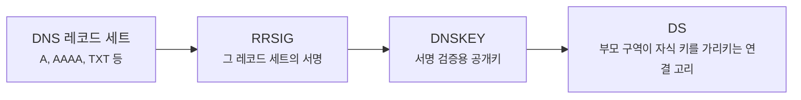
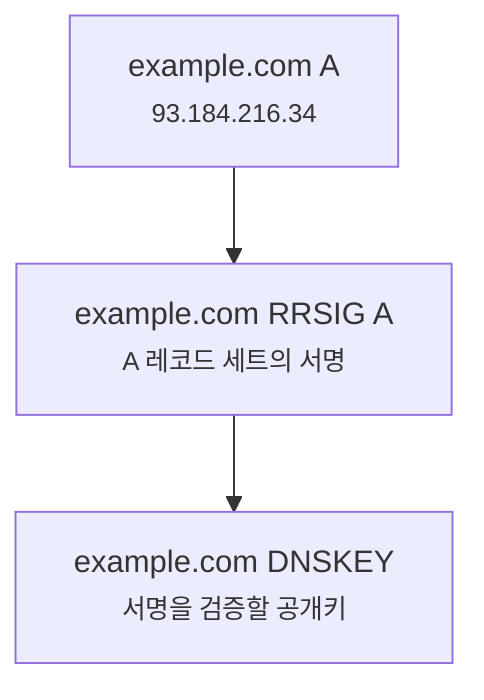
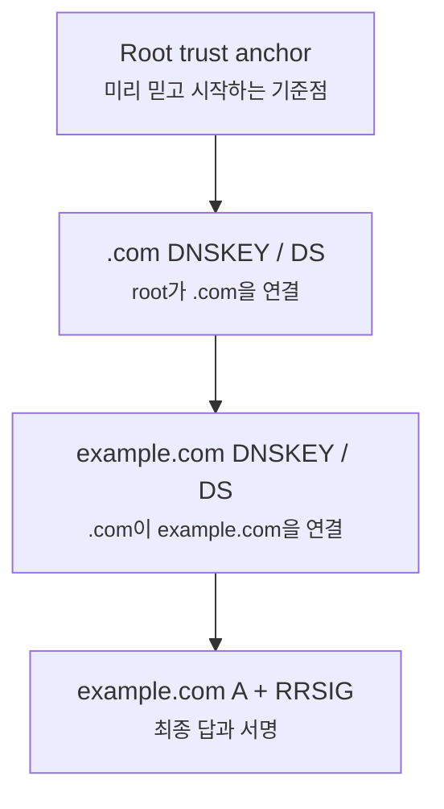
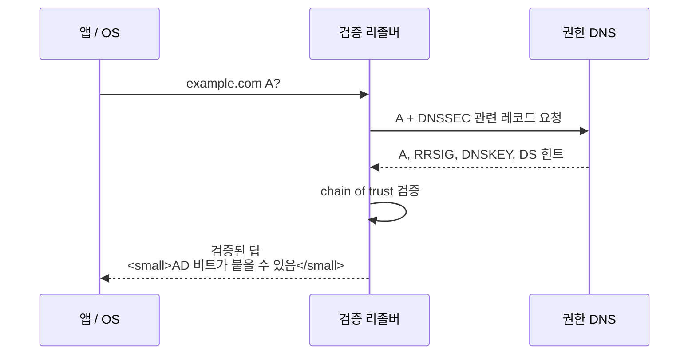

# DNSSEC은 DNS 응답을 어떻게 믿게 만들어줄까요?

> DNS는 주소를 알려주지만, 그 답이 **진짜 권한자가 준 답인지**는 그냥 믿어도 될 것 같죠? **사실은 그 믿음을 따로 검증해야 하는 장면이 있어요.**

[A, AAAA, CNAME... DNS 레코드는 왜 종류가 여러 갈래일까요?](../basic/10-dns-records.md){ data-preview }에서는 DNS가 이름에 붙은 여러 종류의 답을 돌려준다는 걸 봤어요. 그리고 [EDNS0는 DNS 메시지 크기를 어떻게 넓혀줄까요?](./edns0-and-dns-message-size.md){ data-preview }에서는 DNSSEC처럼 큰 데이터가 붙으면 DNS 응답이 커질 수 있다는 것도 살짝 봤죠.

근데요, 크기 문제보다 더 근본적인 질문이 하나 있어요.

- `example.com` 의 A 레코드가 `93.184.216.34` 라고 왔어요.
- 그 답은 정말 `example.com` 담당자가 만든 답일까요?
- 중간에서 누군가 가짜 주소로 바꿔치기했다면 어떻게 알 수 있을까요?
- HTTPS가 있으니까 DNS는 그냥 둬도 괜찮을까요?

여기서 DNSSEC이 등장해요. DNSSEC은 DNS를 암호화해서 숨기는 기술이 아니라, DNS 응답에 **검증 가능한 서명과 연결 고리**를 붙이는 기술이에요.

오늘은 **DNSSEC이 한마디로 무엇인지**, **왜 DNS에 서명이 필요한지**, **기본 DNS 레코드와 EDNS0가 어떻게 이어지는지**, 그리고 그다음에야 **RRSIG, DNSKEY, DS, chain of trust, AD/DO 비트** 순서로 큰 그림을 잡아볼게요. 핵심 개념은 [RFC 4033](https://www.rfc-editor.org/rfc/rfc4033), [RFC 4034](https://www.rfc-editor.org/rfc/rfc4034), [RFC 4035](https://www.rfc-editor.org/rfc/rfc4035)의 DNSSEC 기본 문서 흐름을 바탕으로 볼게요.

!!! note "이 글의 범위"
    여기서는 DNSSEC을 **처음 읽는 데 필요한 큰 구조**에 집중해요. 키 롤오버 절차, 알고리즘 번호, NSEC3 세부 동작, 운영 자동화까지는 깊게 열지 않을게요. 오늘은 *"DNSSEC은 암호화가 아니라 검증이다"*, *"서명은 어떻게 연결되어 믿음의 사슬이 되는가"* 를 붙잡으면 충분해요.

---

## 왜 DNSSEC을 알아야 할까요?

DNS는 인터넷의 안내 데스크 같은 역할을 해요. 브라우저가 `example.com` 을 어디로 보내야 하는지 묻고, DNS는 주소를 알려주죠.

문제는 DNS의 기본 흐름이 아주 오래된 구조라는 점이에요. 질문과 답이 빠르게 오가는 데 초점이 있었고, **그 답이 중간에서 바뀌지 않았는지 검증하는 장치**는 기본 DNS만으로는 약했어요.

예를 들어 누군가가 DNS 응답을 가짜로 끼워 넣는다고 해볼게요.

사용자가 `bank.example A?` 라고 물었는데, 진짜 권한 서버의 답보다 가짜 답이 먼저 리졸버에 도착했다고 상상하면 돼요. 단순히 *"답이 왔다"* 만으로는 부족해요. **그 답을 만든 사람이 진짜 권한자인지**, **응답 내용이 도중에 바뀌지 않았는지** 확인해야 하거든요.

---

## 가짜 주소 답변지는 어떻게 구분할까요?

동네 안내 데스크가 가게 주소를 알려준다고 상상해볼까요?

일반 DNS는 이런 느낌이에요.

> "아하 은행은 3번 건물이에요."

듣기에는 충분해 보이죠. 그런데 누군가가 안내 데스크 앞에서 가짜 종이를 슬쩍 끼워 넣으면 어떻게 될까요?

> "아하 은행은 9번 건물이에요."

사용자는 종이만 보고는 진짜인지 가짜인지 구분하기 어려워요. 그래서 안내 데스크는 답변지에 **도장**을 찍고, 그 도장이 진짜인지 확인할 수 있는 **상위 기관의 확인서**를 붙이기 시작해요.

DNSSEC은 이 구조와 비슷해요.

| 비유에서는 | 실제로는 |
|---|---|
| 주소 답변지 | A, AAAA, MX, TXT 같은 DNS 레코드 세트 |
| 답변지에 찍힌 도장 | `RRSIG` 서명 |
| 도장을 확인하는 공개 도장 정보 | `DNSKEY` |
| 상위 기관이 이 도장을 인정한다는 확인서 | `DS` 레코드 |
| 최상위 신뢰 기관 | DNS root trust anchor |
| 도장이 맞는지 확인하는 사람 | 검증 리졸버 |

여기서 중요한 점은, DNSSEC이 **답을 숨겨주는 기술**이 아니라는 거예요. 답은 여전히 보일 수 있어요. 대신 그 답이 **진짜 권한자의 서명을 통과했는지** 확인할 수 있게 해줘요.

---

## DNSSEC은 한마디로 뭐예요?

짧게 잡으면 이래요.

> **DNSSEC은 DNS 레코드에 디지털 서명을 붙이고, 그 서명을 상위 구역부터 이어 검증하게 만드는 확장 규칙이에요.**

DNSSEC을 이해할 때는 세 가지를 나눠 보면 좋아요.



이 그림에서 먼저 붙잡을 건 **서명 대상이 보통 레코드 하나가 아니라 같은 이름과 같은 종류의 레코드 묶음**이라는 점이에요. 예를 들어 `example.com A` 답이 여러 개라면, 그 묶음 전체에 대해 서명이 붙는 식으로 생각하면 돼요.

---

## 근데 왜 HTTPS만으로는 부족할까요?

여기서 흔한 반응이 있어요.

> *"어차피 HTTPS가 인증서로 서버를 확인하잖아요. DNSSEC이 꼭 필요해요?"*

HTTPS는 아주 중요해요. 하지만 HTTPS와 DNSSEC은 보는 위치가 달라요.

| 기술 | 확인하는 것 | 보호하지 못하는 빈틈 |
|---|---|---|
| HTTPS | 연결한 서버가 인증서 기준으로 맞는지 | DNS 답이 바뀌어 엉뚱한 곳으로 먼저 향하는 장면 |
| DNSSEC | DNS 응답이 권한 구역에서 서명된 진짜 답인지 | 연결 내용 암호화나 웹 서버 인증 전체 |
| DoH / DoT | DNS 질의가 전송 중 엿보이거나 바뀌기 어려운 통로인지 | 권한 데이터 자체의 서명 검증 |

즉 DNSSEC은 HTTPS를 대체하지 않아요. HTTPS도 DNSSEC을 대체하지 않아요. DNSSEC은 **주소 안내서의 진위를 확인하는 층**, HTTPS는 **그 주소로 연결한 뒤 통신 상대와 내용을 보호하는 층**에 가까워요.

---

## 서명은 어떤 레코드로 보일까요?

DNSSEC이 켜진 도메인을 `dig`로 보면 평소보다 낯선 레코드가 보일 수 있어요.

```text
example.com.  300  IN  A      93.184.216.34
example.com.  300  IN  RRSIG  A 13 2 300 ...
```

여기서 `A`는 우리가 원래 묻던 답이고, `RRSIG`는 그 A 레코드 세트에 붙은 서명이에요.



이 그림에서 `RRSIG A`라는 표현이 중요해요. `RRSIG`는 그냥 아무 서명이 아니라, **어떤 종류의 레코드 세트를 서명했는지**를 같이 알려줘요. `RRSIG A`면 A 레코드 세트의 서명, `RRSIG MX`면 MX 레코드 세트의 서명처럼 읽으면 돼요.

---

## 믿음의 사슬은 어떻게 이어질까요? { #chain-of-trust }

서명만 있다고 끝나면 좋겠지만, 바로 다음 질문이 생겨요.

> *"그 서명을 검증하는 DNSKEY는 진짜라는 걸 어떻게 믿죠?"*

그래서 DNSSEC은 한 구역 안의 서명만 보지 않아요. **부모 구역이 자식 구역의 키를 가리키고**, 그 부모도 다시 위쪽에서 검증되는 방식으로 이어져요.



이 흐름을 **chain of trust**, 즉 믿음의 사슬이라고 불러요.

검증 리졸버는 대략 이런 식으로 확인해요.

1. 미리 신뢰하는 root 기준점에서 시작해요.
2. root가 `.com` 쪽 키를 인정하는지 봐요.
3. `.com` 이 `example.com` 쪽 키를 인정하는지 봐요.
4. `example.com` 의 DNSKEY로 최종 응답의 `RRSIG`를 검증해요.

중간 어디선가 사슬이 끊기면, 리졸버는 답을 그냥 믿기 어려워져요.

---

## DNSKEY와 DS는 왜 둘 다 필요할까요?

처음 보면 `DNSKEY`와 `DS`가 비슷해 보여요. 둘 다 키와 관련 있어 보이니까요.

하지만 역할은 달라요.

| 레코드 | 어디에 있나요? | 역할 |
|---|---|---|
| `DNSKEY` | 자식 구역 안 | 이 구역의 서명을 검증할 공개키를 알려줘요 |
| `DS` | 부모 구역 안 | 부모가 자식의 키를 인정한다는 연결 고리를 제공해요 |
| `RRSIG` | 서명된 레코드 세트 옆 | 실제 데이터가 그 키로 서명됐는지 확인하게 해줘요 |

비유로 보면 이래요.

- `DNSKEY`는 **가게가 공개한 도장 확인표**예요.
- `DS`는 **구청이 "이 가게의 도장 확인표는 이게 맞아요"라고 남긴 기록**이에요.
- `RRSIG`는 **답변지에 실제로 찍힌 도장**이에요.

그러니까 자식 구역이 `DNSKEY`만 들고 있다고 충분하지 않아요. 부모 구역의 `DS`가 그 키를 이어줘야, 위에서 아래로 믿음이 내려와요.

---

## 검증 리졸버는 실제로 무엇을 하나요?

사용자 기기나 브라우저가 매번 이 모든 과정을 직접 다 하지는 않는 경우가 많아요. 보통은 **검증 기능이 켜진 재귀 리졸버**가 대신 확인해요.



여기서 `AD` 비트는 **Authenticated Data** 감각으로 읽으면 돼요. 검증 리졸버가 *"이 답은 검증을 통과한 데이터예요"* 라는 신호를 응답에 표시할 수 있어요.

반대로 클라이언트가 DNSSEC 관련 데이터를 받고 싶다고 표시할 때는 EDNS0의 `DO` 비트가 쓰여요. 여기서 `DO`는 **DNSSEC OK**에 가까운 신호예요. 그래서 DNSSEC은 직전 글의 EDNS0와도 연결돼요. DNSSEC 관련 서명과 키는 응답을 크게 만들 수 있고, 클라이언트는 EDNS0 메모로 DNSSEC 데이터를 받을 준비가 되어 있음을 알릴 수 있어요.

---

## 없는 이름도 서명할 수 있을까요?

DNSSEC은 있는 답만 검증하면 끝일 것 같죠? **사실은 없는 답도 검증해야 해요.**

예를 들어 `nosuch.example.com` 이 없다는 답을 받았다고 해볼게요.

그럼 공격자가 그냥 *"없어요"* 라고 거짓말한 건지, 진짜 권한 서버가 *"그런 이름은 없어요"* 라고 말한 건지 구분해야 해요. 그래서 DNSSEC에는 부정 응답을 증명하는 레코드도 있어요.

| 레코드 | 역할 | 처음엔 이렇게 읽으면 돼요 |
|---|---|---|
| `NSEC` | 다음 존재 이름을 알려주며 사이에 없음을 증명 | "이 범위 사이에는 없어요" |
| `NSEC3` | 이름을 해시해서 비슷한 증명을 제공 | "이름을 그대로 드러내지 않고 없음을 증명해요" |

`NSEC3`의 구조와 검증 방식은 [RFC 5155](https://www.rfc-editor.org/rfc/rfc5155)에 정리되어 있어요. 여기서는 세부 알고리즘까지 들어가지 않을게요. 중요한 건 **DNSSEC은 있는 답의 진위뿐 아니라, 없는 답의 진위도 증명하려고 한다**는 점이에요.

---

## 잘못 읽기 쉬운 함정

DNSSEC은 이름 때문에 보안 만능처럼 들리지만, 실제 역할은 더 좁고 또렷해요.

| 헷갈리는 읽기 | 더 정확한 읽기 |
|---|---|
| DNSSEC은 DNS를 암호화한다 | DNSSEC은 응답을 숨기지 않고, 서명으로 검증하게 해줘요 |
| DNSSEC을 쓰면 HTTPS가 필요 없다 | DNSSEC은 주소 응답 검증이고, HTTPS는 연결과 콘텐츠 보호예요 |
| `RRSIG`만 있으면 무조건 안전하다 | root부터 이어지는 chain of trust 검증이 필요해요 |
| `DNSKEY`만 있으면 충분하다 | 부모 구역의 `DS`가 자식 키를 연결해줘야 해요 |
| DNSSEC은 모든 DNS 장애를 해결한다 | 키 만료, DS 불일치, 시간 문제 때문에 오히려 검증 실패가 날 수도 있어요 |

특히 마지막이 운영에서 중요해요. DNSSEC은 잘 설정되면 신뢰를 높여주지만, 키나 서명 만료 시간이 어긋나면 검증 리졸버가 답을 거부할 수 있어요. 그래서 DNSSEC 장애는 단순히 *"DNS가 안 돼요"* 가 아니라 **검증이 실패해서 답을 못 믿는 상태**로 읽어야 해요.

---

## 그럼 진짜 운영 장면에서는 어디를 볼까요?

DNSSEC 문제를 의심할 때는 이런 신호를 봐요.

| 볼 것 | 왜 보나요? |
|---|---|
| `RRSIG`가 있는지 | 응답 레코드 세트에 서명이 붙었는지 보기 위해서예요 |
| `DNSKEY`가 조회되는지 | 서명을 검증할 공개키가 있는지 보기 위해서예요 |
| 부모 구역의 `DS`가 맞는지 | 믿음의 사슬이 부모에서 자식으로 이어지는지 보기 위해서예요 |
| 응답의 `AD` 비트 | 검증 리졸버가 검증된 답으로 표시했는지 보기 위해서예요 |
| 시간과 서명 만료 | 아직 유효한 서명인지 보기 위해서예요 |

`dig`로는 이런 식의 감각을 잡을 수 있어요.

```bash
$ dig example.com A +dnssec

;; flags: qr rd ra ad; QUERY: 1, ANSWER: 2, AUTHORITY: 0, ADDITIONAL: 1

;; ANSWER SECTION:
example.com.  300  IN  A      93.184.216.34
example.com.  300  IN  RRSIG  A 13 2 300 ...
```

여기서 `+dnssec`은 DNSSEC 관련 데이터를 요청하는 쪽의 표지판으로 보면 돼요. 출력에 `RRSIG`가 붙고, 검증 리졸버가 검증을 통과했다고 판단하면 `ad` 플래그가 보일 수 있어요.

물론 `ad`가 보이는지 여부는 어떤 리졸버를 쓰는지, 클라이언트 설정이 어떤지, 실제 도메인이 서명되어 있는지에 따라 달라질 수 있어요. 그래서 `ad` 하나만 보고 모든 걸 단정하기보다는, **RRSIG, DNSKEY, DS, chain of trust**를 함께 봐야 해요.

---

## 자, 정리해볼까요?

!!! abstract "오늘 우리가 배운 것"
    - DNSSEC은 DNS 응답을 숨기는 기술이 아니라, **서명으로 검증하게 만드는 기술**이에요.
    - `RRSIG`는 DNS 레코드 세트에 붙는 서명이에요.
    - `DNSKEY`는 그 서명을 검증할 공개키이고, `DS`는 부모 구역이 자식 키를 인정하는 연결 고리예요.
    - root부터 TLD, 도메인까지 이어지는 **chain of trust**가 검증의 핵심이에요.
    - DNSSEC은 HTTPS나 DoH/DoT를 대체하지 않아요. 각자 보호하는 위치가 달라요.

이제 DNSSEC을 보면 *"DNS를 암호화하는 기능"* 이 아니라, **DNS 답변지에 도장을 찍고 그 도장이 진짜인지 위에서 아래로 확인하는 구조**로 읽으면 돼요.

## 이어서 보면 좋은 글

- [EDNS0는 DNS 메시지 크기를 어떻게 넓혀줄까요?](./edns0-and-dns-message-size.md){ data-preview } — DNSSEC 서명과 키 때문에 응답이 커질 때, EDNS0가 왜 같이 등장하는지 이어서 보기 좋아요.
- [DNS 메시지는 왜 질문 하나에 칸이 이렇게 많을까요?](./dns-message-format.md#signals-to-read){ data-preview } — `AD`, `DO`, `RCODE`, `Additional` 같은 신호가 DNS 메시지 안에서 어디에 붙는지 다시 보고 싶을 때 좋아요.

## 이어서 볼 질문

> *"검증은 알겠어요. 그럼 DNS 질문 자체를 누가 보는지는 어떻게 숨길 수 있을까요?"*

다음에는 **DoH와 DoT가 DNS 경로를 어디까지 숨기고, 무엇은 여전히 남기는지** 이어서 열어볼게요.
