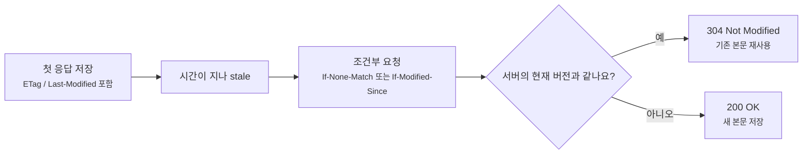
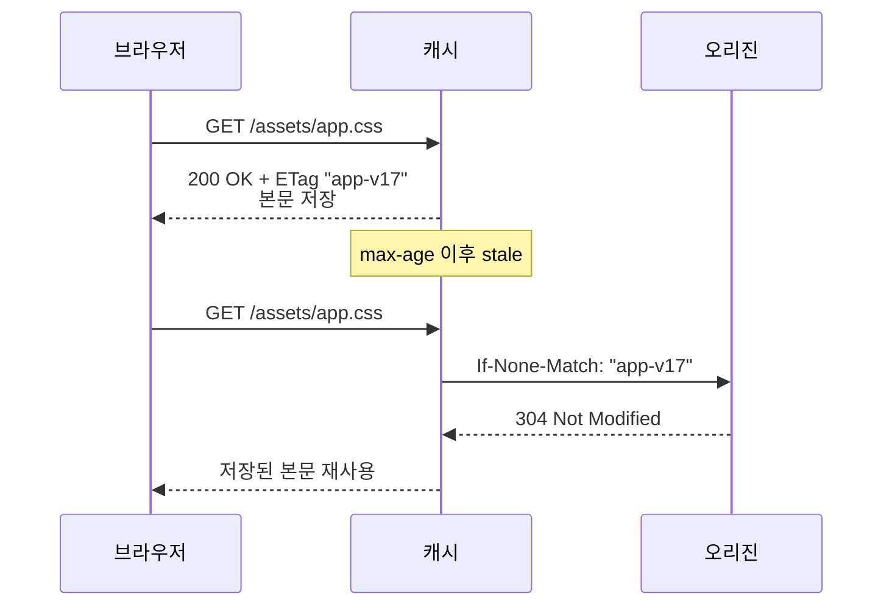
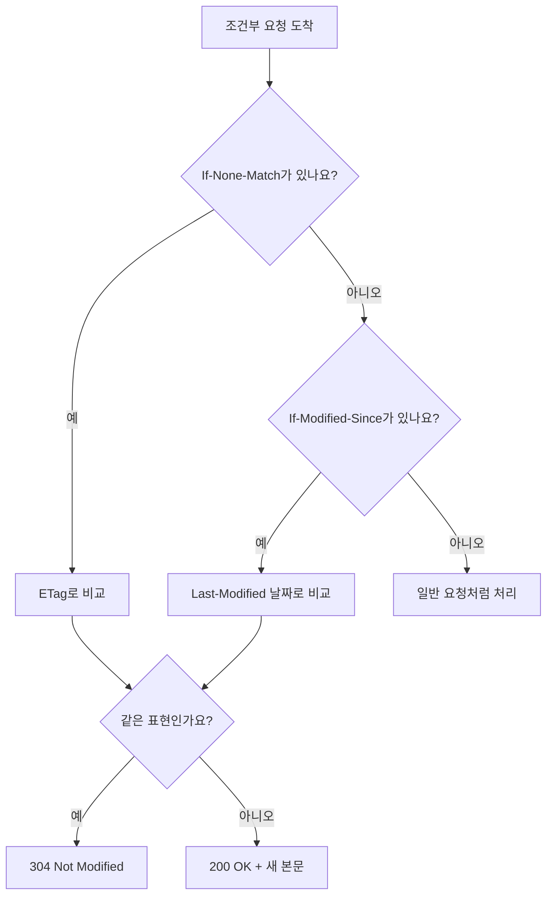
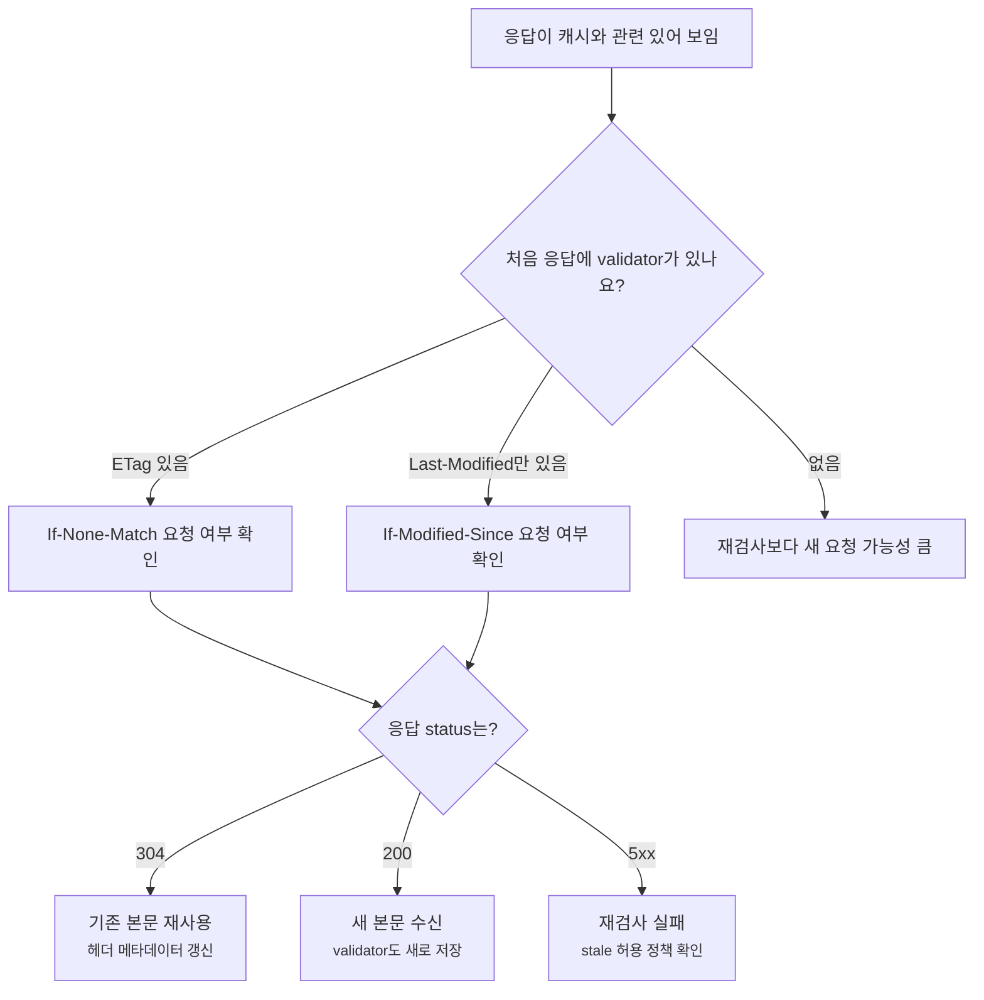

# ETag와 조건부 요청은 어떻게 304를 만들까요?

> 캐시된 파일이 오래됐으면 무조건 다시 내려받아야 할까요? **사실은 "그 파일 아직 같은 버전이에요?"라고 먼저 물어볼 수 있어요.**

[CDN, Cache, 그리고 Edge Delivery](../basic/25-cdn-cache-and-edge-delivery.md){ data-preview }에서는 캐시가 복사본을 가까운 곳에 두고 재사용한다는 큰 그림을 봤어요. 그리고 [Cache-Control과 Age 헤더](./reading-cache-control-and-age.md){ data-preview }에서는 그 복사본이 아직 fresh인지, [CDN Cache Status 헤더](./cdn-cache-status-headers.md){ data-preview }에서는 CDN이 방금 캐시를 어떻게 처리했는지 읽었죠.

이번에는 stale이 된 사본을 버리기 전에 한 번 더 묻는 장면을 볼게요.

```http
GET /assets/app.css HTTP/2
If-None-Match: "app-css-v17"
```

서버가 보기에 지금 최신 버전도 `"app-css-v17"`이라면, 본문 전체를 다시 보낼 필요가 없어요.

```http
HTTP/2 304 Not Modified
ETag: "app-css-v17"
Cache-Control: public, max-age=600
```

처음 보면 `304`는 "응답이 비어 있는데 괜찮은 건가?"처럼 보여요. 괜찮아요. 이건 실패가 아니라 **이미 가진 사본을 그대로 써도 된다는 확인 응답**이에요.

오늘 질문은 이거예요.

> *"캐시는 어떤 단서를 들고 서버에 다시 확인하고, 서버는 언제 304로 대답할까요?"*

HTTP validator인 `ETag`와 `Last-Modified`의 의미는 [RFC 9110의 validator 절](https://www.rfc-editor.org/rfc/rfc9110.html#section-8.8)을 바닥에 두고, 캐시가 stale 응답을 다시 확인하는 revalidation 흐름은 [RFC 9111의 validation 절](https://www.rfc-editor.org/rfc/rfc9111.html#section-4.3)을 기준으로 잡을게요.

!!! note "이 글의 범위"
    여기서는 브라우저와 CDN에서 자주 보는 **조건부 GET**, **ETag**, **Last-Modified**, **304 Not Modified** 흐름에 집중해요. `If-Match`로 쓰기 충돌을 막는 optimistic locking 같은 API 설계는 살짝만 언급하고, 캐시 재검사 장면을 중심으로 볼게요.

---

## 도서관에서 책을 새로 빌리기 전에 판 번호를 먼저 물어봐요

도서관에서 책을 이미 한 권 갖고 있다고 해볼게요.

그런데 며칠이 지나서 혹시 새 판이 나왔는지 궁금해요. 이때 도서관에 이렇게 물을 수 있죠.

> "제가 가진 책이 17판인데요, 지금도 17판인가요?"

도서관 직원이 "네, 아직 17판이에요"라고 말해주면, 같은 책을 다시 들고 올 필요가 없어요. 내가 가진 책을 그대로 읽으면 돼요.

웹 캐시도 비슷해요.

| 도서관 장면 | HTTP 캐시 장면 |
|---|---|
| 내가 가진 책 | 저장된 cached response |
| 책의 판 번호 | `ETag` |
| 마지막 개정일 | `Last-Modified` |
| "이 판 번호 아직 맞나요?" | `If-None-Match` |
| "이 날짜 이후로 바뀌었나요?" | `If-Modified-Since` |
| "아직 그대로예요" | `304 Not Modified` |
| 새 판 책을 다시 받음 | `200 OK`와 새 본문 |

핵심은 `ETag`와 `Last-Modified`가 **캐시된 사본을 다시 확인하기 위한 단서**라는 점이에요. `Cache-Control`이 "얼마 동안 그냥 믿을지"를 말한다면, validator는 "오래됐을 때 무엇으로 비교할지"를 말해요.



이 그림에서 304는 새 데이터를 주지 않는 응답이에요. 대신 캐시에게 **네가 가진 본문을 계속 써도 된다**고 확인해주는 역할을 해요.

## 먼저 응답에 validator가 있는지 봐요

조건부 요청은 아무 근거 없이 만들어지지 않아요. 처음 받은 응답에 비교할 단서가 있어야 해요.

```http
HTTP/2 200
Cache-Control: public, max-age=600
ETag: "hero-v12"
Last-Modified: Mon, 22 Jun 2026 03:20:00 GMT
Content-Type: image/jpeg
Content-Length: 482193
```

여기서 중요한 단서는 두 개예요.

| 응답 헤더 | 읽는 감각 |
|---|---|
| `ETag: "hero-v12"` | 이 표현의 버전표예요 |
| `Last-Modified: Mon, 22 Jun 2026 03:20:00 GMT` | 서버가 알고 있는 마지막 수정 시각이에요 |

둘 다 validator로 쓸 수 있지만 성격은 달라요.

| validator | 장점 | 조심할 점 |
|---|---|---|
| `ETag` | 서버가 원하는 방식으로 버전표를 만들 수 있어요 | 값이 어떻게 만들어졌는지는 클라이언트가 알 필요도, 알 수도 없어요 |
| `Last-Modified` | 사람이 읽기 쉬운 날짜예요 | 초 단위 해상도, 서버 시계, 배포 방식 때문에 정확도가 부족할 수 있어요 |

RFC 9110은 `ETag` 값을 opaque validator로 봐요. 즉 클라이언트가 `"hero-v12"` 안쪽의 의미를 해석하려고 하면 안 돼요. 해시처럼 보일 수도 있고, 버전 번호처럼 보일 수도 있지만, 클라이언트에게 중요한 건 **문자열이 서버의 현재 validator와 맞는지**예요.

!!! tip "ETag는 내용 해석용 이름표가 아니라 비교용 이름표예요"
    `ETag: "abc123"`을 보고 "이건 SHA 해시겠지"라고 단정하지 마세요. 서버 구현자가 어떤 방식으로 만들었는지는 구현 차이예요. 캐시 입장에서는 나중에 같은 값인지 비교할 수 있으면 돼요.

## stale이 되면 조건부 요청으로 다시 확인해요

응답이 fresh일 때는 캐시가 보통 서버에 묻지 않고 사본을 재사용할 수 있어요. 그런데 freshness lifetime이 끝나면 이야기가 달라져요.

```http
HTTP/2 200
Cache-Control: public, max-age=60
ETag: "app-v17"
```

60초가 지난 뒤 같은 URL을 다시 요청하면, 브라우저나 CDN은 이런 요청을 만들 수 있어요.

```http
GET /assets/app.css HTTP/2
If-None-Match: "app-v17"
```

이걸 조건부 요청이라고 불러요. 그냥 "파일 주세요"가 아니라, 조건이 붙어 있어요.

> *"`app-v17`과 다를 때만 새 본문을 주세요."*

서버가 확인한 현재 `ETag`도 `"app-v17"`이면 이렇게 응답할 수 있어요.

```http
HTTP/2 304 Not Modified
ETag: "app-v17"
Cache-Control: public, max-age=60
Date: Mon, 22 Jun 2026 04:01:30 GMT
```

본문은 없거나 매우 작아요. 캐시는 이미 저장해둔 본문을 꺼내고, 304 응답에 함께 온 새 헤더 메타데이터로 저장된 응답을 fresh하게 갱신할 수 있어요.



이 흐름이 중요한 이유는, 네트워크 왕복은 여전히 필요할 수 있지만 **큰 본문 전송은 피할 수 있기 때문**이에요. 이미지, CSS, JavaScript처럼 본문이 큰 응답에서는 차이가 꽤 커요.

## 바뀌었으면 304가 아니라 200과 새 본문이 와요

이번에는 파일이 바뀐 장면이에요.

브라우저가 예전 사본을 들고 있어요.

```http
GET /assets/app.css HTTP/2
If-None-Match: "app-v17"
```

그런데 서버의 현재 버전은 `"app-v18"`이에요. 그러면 `304`가 아니라 새 본문이 담긴 `200 OK`가 와야 해요.

```http
HTTP/2 200
Cache-Control: public, max-age=60
ETag: "app-v18"
Content-Type: text/css
Content-Length: 53912

/* 새 CSS 본문 */
```

이 장면을 표로 보면 더 선명해요.

| 클라이언트가 가진 validator | 서버의 현재 validator | 응답 |
|---|---|---|
| `"app-v17"` | `"app-v17"` | `304 Not Modified`, 기존 본문 재사용 |
| `"app-v17"` | `"app-v18"` | `200 OK`, 새 본문 저장 |
| validator 없음 | 비교할 단서 없음 | 보통 일반 `GET`처럼 새 응답을 받음 |

그래서 `304`는 "캐시가 맞았다"는 신호에 가깝고, `200`은 "새 본문이 필요했다"는 신호에 가까워요. 둘 다 정상일 수 있어요.

!!! warning "`304`가 빠르다고 항상 더 좋은 설계는 아니에요"
    해시가 붙은 정적 파일처럼 URL이 내용 버전을 이미 담고 있다면, 긴 `max-age`로 아예 재검사 왕복을 줄이는 편이 더 나을 수 있어요. 304는 본문 전송을 줄여주지만, 서버나 CDN에 확인하러 가는 왕복 자체를 없애주지는 않아요.

## If-None-Match와 If-Modified-Since는 우선순위가 달라요

조건부 요청에는 대표적으로 두 가지가 있어요.

```http
If-None-Match: "app-v17"
If-Modified-Since: Mon, 22 Jun 2026 03:20:00 GMT
```

둘을 같이 보내는 경우도 볼 수 있어요. 이때는 `If-None-Match`가 더 정확한 비교 단서로 취급돼요. RFC 9110도 `If-None-Match`가 있으면 `If-Modified-Since`는 무시하라고 정리해요.

처음 읽을 때는 이렇게 보면 좋아요.

| 요청 헤더 | 비교 기준 | 흔한 응답 |
|---|---|---|
| `If-None-Match` | `ETag` 값 | 같으면 `304`, 다르면 `200` |
| `If-Modified-Since` | 마지막 수정 시각 | 이후로 안 바뀌었으면 `304`, 바뀌었으면 `200` |
| 둘 다 있음 | `ETag` 쪽이 우선 | 날짜는 오래된 중간 장비 호환용처럼 볼 수 있어요 |

`Last-Modified` 기반 비교는 날짜라서 직관적이지만, 초 단위로만 보이거나 서버 시계와 배포 시스템 차이의 영향을 받을 수 있어요. 아주 짧은 시간 안에 같은 리소스가 여러 번 바뀌는 시스템에서는 `ETag`가 더 정확한 단서가 되기 쉬워요.



이 그림은 조건부 요청을 읽는 순서를 보여줘요. 처음에는 `If-None-Match`가 있는지부터 보고, 없으면 `If-Modified-Since`를 보면 덜 헷갈려요.

## strong ETag와 weak ETag는 같은 이름표처럼 보여도 비교 힘이 달라요

`ETag`에는 가끔 `W/`가 붙어요.

```http
ETag: "app-v17"
ETag: W/"app-v17"
```

`W/`는 weak validator라는 뜻이에요. 아주 거칠게 말하면:

| 모양 | 읽는 감각 |
|---|---|
| `"app-v17"` | strong ETag예요. 바이트 단위로 같은 표현인지 강하게 비교할 수 있어요 |
| `W/"app-v17"` | weak ETag예요. 의미상 같은 표현인지 느슨하게 비교할 수 있어요 |

예를 들어 HTML을 만들 때 공백이나 생성 시각 주석처럼 작은 차이가 있을 수 있지만, 사용자에게 보여줄 의미는 같다고 볼 수 있는 경우가 있어요. 이때 서버는 weak ETag를 쓸 수 있어요.

캐시 재검사에서 자주 보는 `If-None-Match`는 weak 비교를 사용할 수 있어요. 그래서 `W/"app-v17"` 같은 값도 cache validation에는 쓸 수 있어요. 하지만 range 요청처럼 정확한 바이트 조각을 이어 붙여야 하는 장면에서는 strong validator가 더 중요해져요.

!!! note "처음에는 W/를 '느슨한 버전표'로 기억해도 좋아요"
    `W/`가 붙었다고 캐시에 못 쓰는 건 아니에요. 다만 "정확히 같은 바이트"라는 강한 약속은 아니므로, 다운로드 이어받기나 range 처리 같은 장면에서는 의미가 달라질 수 있어요.

## 브라우저 Network 탭에서는 304와 200의 크기를 같이 봐요

브라우저 Network 탭에서 이런 줄을 볼 수 있어요.

```text
Name          Status   Size                     Time
app.css       304      180 B                    42 ms
logo.svg      200      (disk cache)             1 ms
hero.jpg      200      482 kB                   118 ms
```

여기서 `304`는 본문을 다시 받지 않았다는 신호예요. 그런데 브라우저 화면에서는 최종적으로 CSS가 적용되고 이미지가 보이기 때문에, "응답 본문이 없는데 화면은 왜 나오지?" 싶을 수 있어요.

답은 간단해요. 브라우저가 이미 가진 cached body를 쓴 거예요.

| Network 탭 신호 | 읽는 감각 |
|---|---|
| `304` | 서버에 확인했고, 기존 본문을 계속 써요 |
| 작은 `Size` | 304 응답 헤더만 오갔을 가능성이 커요 |
| `200 (memory cache)` | 네트워크로 나가지 않고 메모리 캐시에서 끝났을 수 있어요 |
| `200 (disk cache)` | 디스크 캐시에서 꺼냈을 수 있어요 |
| `200`과 큰 transferred size | 새 본문을 다시 받았을 가능성이 커요 |

!!! tip "304는 화면에 보이는 최종 본문 상태가 아니라 재검사 응답이에요"
    개발자 도구에서 `304`를 보면 "브라우저가 아무것도 못 받았다"가 아니라, "서버가 기존 사본을 써도 된다고 확인했다"로 읽어야 해요.

## curl로는 두 번 요청해보면 흐름이 보여요

실제 확인은 `curl`로도 할 수 있어요. 먼저 헤더만 받아서 validator를 봐요.

```bash
curl -I https://example.com/assets/app.css
```

예를 들어 이런 응답을 받았다고 해볼게요.

```http
HTTP/2 200
cache-control: public, max-age=60
etag: "app-v17"
last-modified: Mon, 22 Jun 2026 03:20:00 GMT
```

그다음 같은 `ETag`로 조건부 요청을 직접 보내요.

```bash
curl -I https://example.com/assets/app.css \
  -H 'If-None-Match: "app-v17"'
```

서버의 현재 버전이 같으면 이런 모양이 나올 수 있어요.

```http
HTTP/2 304
etag: "app-v17"
cache-control: public, max-age=60
```

날짜 기반으로도 확인할 수 있어요.

```bash
curl -I https://example.com/assets/app.css \
  -H 'If-Modified-Since: Mon, 22 Jun 2026 03:20:00 GMT'
```

이런 실험을 할 때는 CDN이나 브라우저 캐시 조건 때문에 결과가 달라질 수 있어요. 같은 URL이라도 요청 헤더, cache key, CDN 지역, purge 상태가 다르면 `200`, `304`, `HIT`, `REVALIDATED`가 다르게 보일 수 있거든요.

## 잘못 읽기 쉬운 함정

### 1. 304를 에러처럼 읽기

`304 Not Modified`는 3xx라서 redirect 계열처럼 보이지만, 캐시 재검사에서는 정상적인 성공 흐름이에요. 새 위치로 보내는 리다이렉트가 아니라 **저장된 응답을 계속 쓰라는 확인**이에요.

### 2. ETag가 항상 파일 해시라고 믿기

`ETag`가 해시처럼 생길 수는 있어요. 하지만 표준 관점에서는 opaque value예요. 서버가 파일 inode, 수정 시각, 빌드 번호, 데이터베이스 버전, 내용 해시 등을 섞어 만들 수도 있어요. 클라이언트가 내부 의미를 해석하면 안 돼요.

### 3. ETag가 있으면 캐시가 무조건 빨라진다고 믿기

`ETag`는 본문 재전송을 줄이는 데 도움을 줘요. 하지만 stale이 된 뒤에는 확인 왕복이 필요할 수 있어요. 해시 파일명과 긴 `max-age`가 가능한 정적 자산이라면, 재검사보다 URL 버전 변경 전략이 더 효율적일 수 있어요.

### 4. Last-Modified만으로 아주 잦은 변경을 정확히 잡으려 하기

`Last-Modified`는 날짜 기반이라 사람이 읽기 쉽지만, 매우 짧은 시간 안에 같은 리소스가 여러 번 바뀌는 경우에는 충분히 정밀하지 않을 수 있어요. 그런 장면에서는 서버가 정확한 `ETag`를 제공하는 쪽이 더 나아요.

### 5. 304 응답 헤더를 무시하기

304에는 본문이 없더라도 메타데이터가 올 수 있어요. 캐시는 304 응답의 헤더를 바탕으로 저장된 응답의 헤더 정보를 갱신할 수 있어요. 그래서 304를 볼 때도 `Cache-Control`, `ETag`, `Date`, CDN 상태 헤더를 같이 봐야 해요.

## 실제 장면에서는 이렇게 좁혀봐요

캐시 재검사 문제를 볼 때는 아래 순서로 보는 게 좋아요.



표로 다시 정리하면 이렇게 읽을 수 있어요.

| 확인할 것 | 질문 |
|---|---|
| `Cache-Control`, `Age` | 사본이 fresh였나요, stale이라 재검사가 필요했나요? |
| `ETag`, `Last-Modified` | 다시 확인할 validator가 있었나요? |
| `If-None-Match`, `If-Modified-Since` | 클라이언트나 캐시가 조건부 요청을 보냈나요? |
| `304` 또는 `200` | 서버가 기존 사본을 인정했나요, 새 본문을 보냈나요? |
| CDN 상태 헤더 | CDN이 `REVALIDATED`, `EXPIRED`, `STALE` 같은 상태를 남겼나요? |
| `Vary` | 조건부 요청이 올바른 representation에 대해 만들어졌나요? |

이 중에서 `Vary`도 중요해요. 같은 URL이라도 언어, 압축, 형식이 다르면 다른 representation일 수 있거든요. `ETag` 비교는 **어떤 representation을 비교하는지**와 함께 봐야 해요.

## 한 줄로 읽어보면

실제 헤더 몇 개를 놓고 읽어볼게요.

### 1. 같은 버전이라 304가 온 장면

```http
GET /assets/app.css HTTP/2
If-None-Match: "app-v17"

HTTP/2 304
ETag: "app-v17"
Cache-Control: public, max-age=600
```

이건 서버가 "네가 가진 `app-v17`을 계속 써도 돼요"라고 말한 장면이에요. 본문은 다시 내려오지 않지만, 캐시는 기존 본문을 재사용할 수 있어요.

### 2. 버전이 바뀌어 200이 온 장면

```http
GET /assets/app.css HTTP/2
If-None-Match: "app-v17"

HTTP/2 200
ETag: "app-v18"
Content-Length: 53912
```

이건 서버가 "지금은 `app-v18`이에요. 새 본문을 받으세요"라고 말한 장면이에요. 캐시는 새 본문과 새 validator를 저장할 수 있어요.

### 3. 날짜로 재검사한 장면

```http
GET /news HTTP/2
If-Modified-Since: Mon, 22 Jun 2026 03:20:00 GMT

HTTP/2 304
Last-Modified: Mon, 22 Jun 2026 03:20:00 GMT
```

이건 해당 시각 이후로 선택된 표현이 바뀌지 않았다고 볼 수 있는 장면이에요. 다만 가능하면 `ETag`가 있는지 먼저 보는 습관이 좋아요.

## 자, 정리해볼까요?

!!! abstract "오늘 우리가 배운 것"
    - `ETag`와 `Last-Modified`는 cached response를 나중에 다시 확인하기 위한 validator예요.
    - `If-None-Match`는 클라이언트가 가진 `ETag`를 들고 "이 버전이 아니면 새 본문을 주세요"라고 묻는 조건부 요청이에요.
    - 서버의 현재 `ETag`와 조건이 맞으면 `304 Not Modified`가 오고, 캐시는 기존 본문을 재사용할 수 있어요.
    - 바뀌었으면 `304`가 아니라 `200 OK`와 새 본문, 새 validator가 와요.
    - `If-None-Match`와 `If-Modified-Since`가 같이 있으면 `ETag` 기반 조건을 먼저 보는 쪽으로 읽으면 돼요.
    - `304`는 에러가 아니라 본문 재전송을 줄이는 정상적인 캐시 재검사 흐름이에요.

`Cache-Control`은 **언제까지 그냥 믿을지**를 말하고, `ETag`와 조건부 요청은 **오래됐을 때 어떻게 다시 확인할지**를 말해요. 그래서 캐시 문제를 읽을 때는 freshness와 validation을 함께 봐야 해요.

## 이어서 보면 좋은 글

- [Cache-Control과 Age 헤더는 어떻게 같이 읽어야 할까요?](./reading-cache-control-and-age.md){ data-preview } — 사본이 fresh인지 stale인지 먼저 정리하고 싶을 때 좋아요.
- [Cache Key와 Vary는 왜 같이 읽어야 할까요?](./cache-key-and-vary.md){ data-preview } — 조건부 요청이 어떤 representation을 비교하는지 헷갈릴 때 같이 보면 좋아요.
- [CDN Cache Status 헤더는 어떻게 읽어야 할까요?](./cdn-cache-status-headers.md){ data-preview } — `REVALIDATED`, `STALE`, `HIT`, `MISS` 같은 관측 신호와 연결해서 읽어봐요.
- [stale-while-revalidate와 soft purge는 왜 같이 볼까요?](./stale-while-revalidate-and-soft-purge.md){ data-preview } — 오래된 사본을 잠깐 보여주면서 뒤에서 갱신하는 캐시 운영 흐름을 이어서 볼 수 있어요.
- [CDN, Cache, 그리고 Edge Delivery](../basic/25-cdn-cache-and-edge-delivery.md){ data-preview } — 캐시와 CDN의 큰 그림으로 돌아가고 싶을 때 좋아요.

## 이어서 볼 질문

다음에는 캐시가 아예 되면 안 되는 응답을 볼 거예요. `Cookie`, `Authorization`, `Set-Cookie`, `private`, `no-store`가 왜 캐시 가능성과 함께 읽혀야 하는지 이어서 열어볼 수 있어요.
