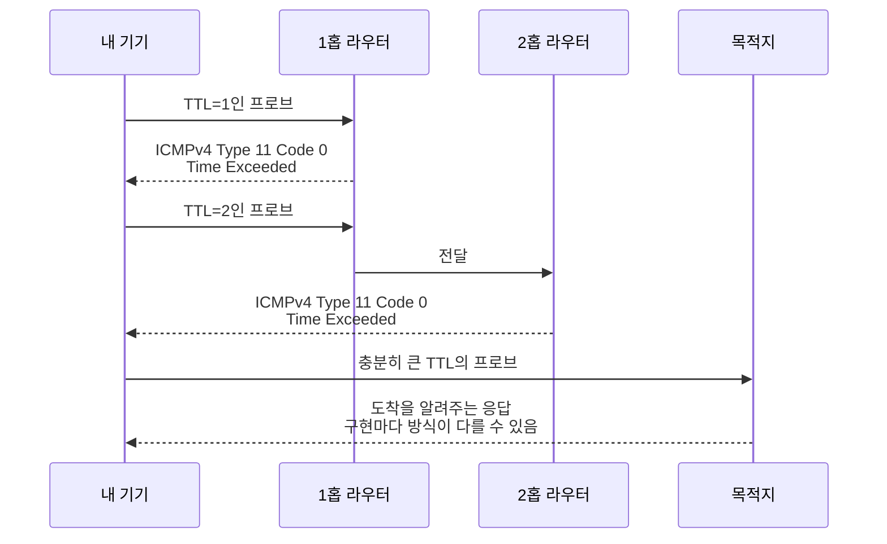
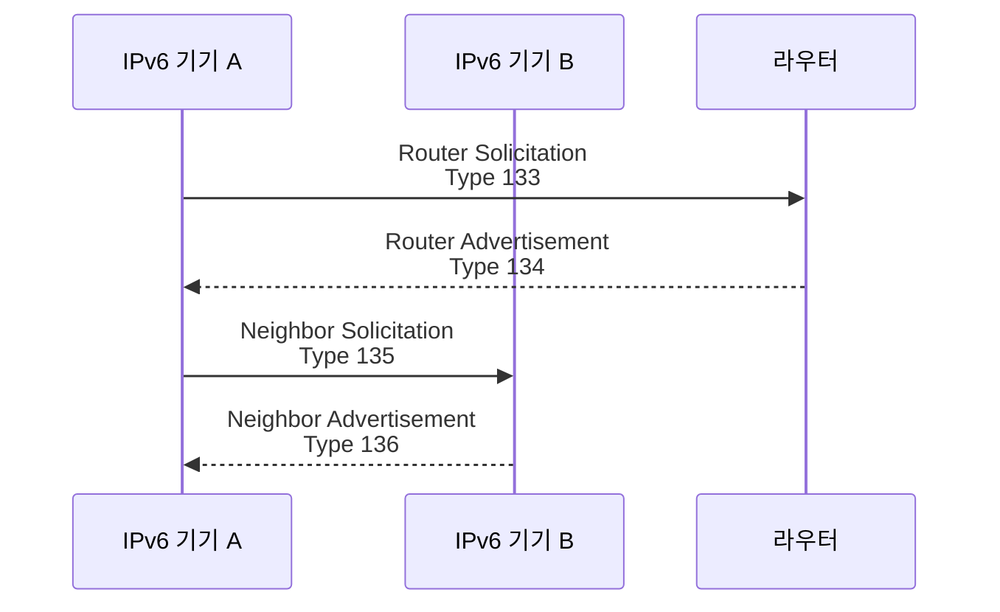

# ICMP와 ICMPv6 Type은 어떻게 읽어야 할까요?

> `ping`이 실패하면 그냥 "안 된다"로 보이죠? **근데 ICMP 안쪽에는 실패의 종류를 나누는 짧은 번호표가 들어 있어요.**

[ICMP, Ping, 그리고 Traceroute](../basic/20-icmp-ping-and-traceroute.md){ data-preview }에서는 ICMP를 **네트워크가 돌려주는 짧은 안내 메시지**로 봤어요.
`ping`은 Echo Request와 Echo Reply를 보고, `traceroute`는 TTL이 다 닳았을 때 돌아오는 Time Exceeded를 이용한다고 했죠.

근데 막상 캡처나 로그를 보면 질문이 한 단계 더 구체적으로 바뀌어요.

> *"좋아요, 이게 ICMP인 건 알겠어요. 그런데 `type 3 code 4`, `type 11`, `icmp6 type 2`는 각각 무슨 말이에요?"*

이 글이 필요한 이유는, ICMP를 **한 덩어리의 오류 메시지**로만 읽으면 중요한 차이를 놓치기 때문이에요.

- 목적지가 없는 건지
- 포트만 닫힌 건지
- 홉 제한이 다 닳은 건지
- 패킷이 너무 큰 건지
- IPv6에서 이웃 기기를 찾는 중인지

이 차이를 제일 먼저 가르는 칸이 바로 **Type**이고, 그 안에서 더 세부 이유를 나누는 칸이 **Code**예요. 오늘은 ICMPv4와 ICMPv6 메시지를 Type/Code 중심으로 펼쳐서, `ping`, `traceroute`, MTU 문제, IPv6 이웃 탐색 장면에서 어떤 번호를 먼저 읽어야 하는지 같이 볼게요.

!!! note "이 글의 범위"
    여기서는 ICMP 메시지 전체를 모두 외우지 않아요. 실전에서 자주 만나는 **Echo**, **Destination Unreachable**, **Time Exceeded**, **Packet Too Big**, 그리고 IPv6의 **Neighbor Discovery** 쪽 메시지를 중심으로 봐요. 세부 형식은 ICMPv4는 RFC 792, ICMPv6는 RFC 4443과 RFC 4861을 기준으로 삼을게요.

---

## Type과 Code는 한마디로 뭐예요?

ICMP 메시지는 길 위에서 돌아오는 **짧은 상황 보고서**에 가까워요.
그리고 그 보고서 맨 앞에는 보통 이런 식의 번호표가 붙어요.

- **Type**: 어떤 종류의 보고서인가?
- **Code**: 그 종류 안에서 더 구체적인 이유는 무엇인가?

| 기본편에서 잡은 감각 | 비유에서는 | 실제로는 |
|---|---|---|
| "거기 있니?" | 확인 질문 | Echo Request |
| "응, 여기 있어" | 확인 답장 | Echo Reply |
| "여기로는 못 가요" | 배달 불가 사유서 | Destination Unreachable |
| "이 거리까지만 왔어요" | 제한 시간이 끝난 위치 알림 | Time Exceeded |
| "짐이 너무 커요" | 통로 크기 초과 알림 | Packet Too Big / Fragmentation Needed |
| "이웃이 누구예요?" | 같은 동네 주소 확인 | IPv6 Neighbor Solicitation |

그러니까 ICMP를 읽는 첫 습관은 이거예요.

> **먼저 Type으로 큰 장면을 고르고, 그다음 Code로 세부 이유를 좁혀요.**

---

## ICMP 메시지의 앞부분은 이렇게 생겼어요 { #icmp-header-shape }

ICMPv4와 ICMPv6는 세부 메시지 종류가 다르지만, 앞부분의 큰 감각은 비슷해요.
처음 4바이트에 **Type, Code, Checksum**이 있고, 그 뒤는 메시지 종류마다 달라져요.

<div style="margin: 1.5rem 0; border: 2px solid var(--md-default-fg-color--lighter); border-radius: 0.75rem; overflow: hidden; background: color-mix(in srgb, var(--md-default-bg-color) 95%, var(--md-default-fg-color) 5%);">
  <div style="display: grid; grid-template-columns: repeat(32, 1fr); padding: 0.4rem 0.6rem; gap: 0; background: color-mix(in srgb, var(--md-primary-fg-color) 8%, var(--md-default-bg-color)); border-bottom: 1px solid var(--md-default-fg-color--lightest); font-size: 0.65rem; color: var(--md-default-fg-color--light); text-align: center;">
    <span style="grid-column: span 8;">0</span>
    <span style="grid-column: span 8;">8</span>
    <span style="grid-column: span 8;">16</span>
    <span style="grid-column: span 8;">24</span>
  </div>
  <div style="display: grid; grid-template-columns: repeat(32, 1fr); gap: 2px; padding: 0.6rem; background: var(--md-default-fg-color--lightest);">
    <div style="grid-column: span 8; padding: 0.5rem 0.35rem; background: color-mix(in srgb, #ef4444 18%, var(--md-default-bg-color)); text-align: center; font-size: 0.8rem; border-radius: 0.25rem;"><strong>Type</strong><br/><small>8b</small></div>
    <div style="grid-column: span 8; padding: 0.5rem 0.35rem; background: color-mix(in srgb, #f97316 18%, var(--md-default-bg-color)); text-align: center; font-size: 0.8rem; border-radius: 0.25rem;"><strong>Code</strong><br/><small>8b</small></div>
    <div style="grid-column: span 16; padding: 0.5rem 0.35rem; background: color-mix(in srgb, #6366f1 18%, var(--md-default-bg-color)); text-align: center; font-size: 0.8rem; border-radius: 0.25rem;"><strong>Checksum</strong><br/><small>16b</small></div>

    <div style="grid-column: span 32; padding: 0.65rem 0.45rem; background: color-mix(in srgb, #22c55e 16%, var(--md-default-bg-color)); text-align: center; font-size: 0.8rem; border-radius: 0.25rem;"><strong>Message-specific fields</strong><br/><small>Echo id/sequence, MTU, pointer, quoted original packet...</small></div>
  </div>
</div>

여기서 먼저 봐야 할 건 두 가지예요.

1. **Type과 Code가 앞에 아주 작게 붙어 있다**는 점
2. 그 작은 번호가 뒤쪽 형식을 바꾼다는 점

예를 들어 Echo 메시지라면 뒤쪽에 identifier와 sequence number가 붙고, 오류 메시지라면 원래 문제를 만든 패킷의 앞부분이 같이 붙어요. 그래야 받은 쪽이 *"아, 이 오류가 내가 보낸 어느 요청 때문에 돌아왔구나"* 하고 맞춰볼 수 있거든요.

---

## ICMPv4에서 자주 보는 Type은 이 정도예요 { #icmpv4-common-types }

IPv4에서 ICMP는 IP 헤더의 **Protocol 값 1**로 실려요.
[IPv4 헤더](./ipv4-header-anatomy.md){ data-preview }에서 봤던 `Protocol` 칸이 `1`이면, 그 다음 payload를 ICMPv4 메시지로 읽기 시작하면 돼요.

| Type | 대표 Code | 이름 | 장면 |
|---:|---:|---|---|
| `0` | `0` | Echo Reply | `ping` 응답 |
| `3` | 여러 값 | Destination Unreachable | 목적지, 네트워크, 포트, 조각화 문제 |
| `8` | `0` | Echo Request | `ping` 요청 |
| `11` | `0` 또는 `1` | Time Exceeded | TTL 초과, 조각 재조립 시간 초과 |
| `12` | 여러 값 | Parameter Problem | IP 헤더나 옵션 해석 문제 |

### Echo Request와 Echo Reply

`ping`에서 가장 자주 보는 조합은 단순해요.

```text
ICMP echo request, id 1234, seq 1
ICMP echo reply, id 1234, seq 1
```

Type으로 보면 이렇게 대응돼요.

| 방향 | ICMPv4 Type | 의미 |
|---|---:|---|
| 내 쪽 -> 목적지 | `8` | Echo Request |
| 목적지 -> 내 쪽 | `0` | Echo Reply |

여기서 `id`와 `seq`는 여러 ping 시도 중 어떤 요청에 대한 답인지 맞춰보는 단서예요.
그러니까 `ping`을 캡처로 볼 때는 **Type 8이 나갔고 Type 0이 돌아왔는지**, 그리고 **id/seq가 맞는지**를 같이 보면 돼요.

### Destination Unreachable

`Destination Unreachable`은 Type 하나만 보고 끝내면 안 돼요.
진짜 이유는 Code가 나눠주거든요.

| ICMPv4 | 의미 | 흔한 해석 |
|---|---|---|
| Type `3`, Code `0` | Network Unreachable | 그 네트워크로 가는 길을 찾기 어려움 |
| Type `3`, Code `1` | Host Unreachable | 네트워크는 알지만 대상 호스트가 닿지 않음 |
| Type `3`, Code `3` | Port Unreachable | 대상까지는 갔지만 해당 UDP 포트가 닫힘 |
| Type `3`, Code `4` | Fragmentation Needed and DF Set | 조각내야 하는데 DF 때문에 못 보냄 |

특히 `Type 3, Code 3`은 UDP 진단에서 자주 만나요.
TCP는 포트가 닫혀 있으면 보통 `RST` 같은 TCP 신호로 답할 수 있지만, UDP는 연결 상태가 없으니 **닫힌 포트에 대한 힌트가 ICMP Port Unreachable로 돌아올 수 있어요.**

`Type 3, Code 4`는 [MTU와 Path MTU](../basic/21-mtu-fragmentation-and-path-mtu.md){ data-preview }를 볼 때 중요해요.
패킷이 너무 큰데 IPv4의 DF 비트 때문에 중간에서 조각낼 수 없으면, 라우터가 이 힌트를 돌려줄 수 있거든요.

### Time Exceeded

`traceroute`에서 가장 중요한 친구가 `Time Exceeded`예요.

| ICMPv4 | 의미 | 흔한 해석 |
|---|---|---|
| Type `11`, Code `0` | TTL exceeded in transit | 홉을 지나며 TTL이 0이 됨 |
| Type `11`, Code `1` | Fragment reassembly time exceeded | 조각난 패킷을 제때 다시 못 맞춤 |

기본편에서 본 `traceroute`의 핵심은 `TTL=1`, `TTL=2`, `TTL=3`처럼 일부러 작게 보내는 거였죠.
그때 중간 라우터가 **"여기서 TTL이 끝났어요"** 하고 돌려주는 대표 힌트가 바로 `Type 11, Code 0`이에요.



이 그림은 `traceroute`가 지도를 미리 받는 게 아니라, **홉 제한을 일부러 닳게 해서 중간 장비가 목소리를 내게 만드는 방식**이라는 걸 보여줘요.

---

## ICMPv6에서는 번호 읽는 감각이 조금 달라져요 { #icmpv6-common-types }

IPv6에서는 ICMP가 그냥 IPv4의 부가 기능처럼 남아 있는 정도가 아니에요.
ICMPv6는 오류 보고뿐 아니라 **이웃 탐색, 라우터 발견, 주소 중복 확인** 같은 IPv6의 기본 동작에도 깊게 들어가요.

IPv6 헤더에서는 ICMPv6가 **Next Header 값 58**로 나타나요.
[IPv6 헤더](./ipv6-header-anatomy.md#row-2){ data-preview }에서 봤던 `Next Header` 칸이 `58`이면, 뒤쪽을 ICMPv6로 읽으면 돼요.

ICMPv6에서 먼저 기억하면 좋은 큰 규칙은 이거예요.

| Type 범위 | 큰 분류 | 감각 |
|---:|---|---|
| `0`-`127` | Error messages | 문제가 생겨 돌아오는 메시지 |
| `128`-`255` | Informational messages | 확인, 발견, 이웃 탐색 같은 정보 메시지 |

이 규칙은 ICMPv4에는 그대로 적용하면 안 돼요.
IPv4 쪽은 `Echo Reply = 0`, `Echo Request = 8`처럼 역사적으로 정해진 번호를 따로 외워야 하고, ICMPv6는 **상위 비트가 0이면 오류, 1이면 정보성 메시지**라는 식으로 큰 범위를 나눠 읽을 수 있어요.

| Type | 대표 Code | 이름 | 장면 |
|---:|---:|---|---|
| `1` | 여러 값 | Destination Unreachable | 경로 없음, 관리자 정책, 주소/포트 도달 불가 |
| `2` | `0` | Packet Too Big | 경로 MTU보다 패킷이 큼 |
| `3` | `0` 또는 `1` | Time Exceeded | Hop Limit 초과, 조각 재조립 시간 초과 |
| `4` | 여러 값 | Parameter Problem | IPv6 헤더나 확장 헤더 해석 문제 |
| `128` | `0` | Echo Request | IPv6 `ping` 요청 |
| `129` | `0` | Echo Reply | IPv6 `ping` 응답 |
| `133` | `0` | Router Solicitation | 라우터에게 정보 요청 |
| `134` | `0` | Router Advertisement | 라우터가 prefix, 기본 라우터 등 안내 |
| `135` | `0` | Neighbor Solicitation | 이웃의 링크 계층 주소 확인 |
| `136` | `0` | Neighbor Advertisement | 이웃 탐색에 대한 응답 |
| `137` | `0` | Redirect | 더 나은 첫 홉 안내 |

### IPv6에서 Packet Too Big은 특히 중요해요

IPv4에서는 중간 라우터가 조각화를 해줄 수 있는 경우가 있었어요.
하지만 IPv6에서는 중간 라우터가 패킷을 조각내지 않아요.
그래서 너무 큰 패킷이 경로 중간에서 막히면, ICMPv6 `Packet Too Big`이 아주 중요한 피드백이 돼요.

```text
ICMP6, packet too big, mtu 1280
```

이런 줄을 보면 단순히 *"IPv6가 안 되나?"* 로 읽기보다,
**"이 경로에서 이 크기로는 못 지나가고, 알려준 MTU에 맞춰 다시 보내야 하는구나"** 쪽으로 읽어야 해요.

### IPv6 Neighbor Discovery는 ICMPv6 위에서 움직여요

IPv4에서 같은 LAN 안의 MAC 주소를 찾을 때 [ARP](../basic/18-arp-and-local-delivery.md){ data-preview }를 봤죠.
IPv6에서는 이웃 탐색이 별도 ARP 프로토콜이 아니라 ICMPv6 Neighbor Discovery 쪽으로 들어와요.



이 장면을 보면 ICMPv6가 단순히 **ping용 프로토콜**이 아니라는 게 보여요.
IPv6에서는 기본 라우터를 찾고, 같은 링크의 이웃을 찾고, 주소가 이미 쓰이고 있는지 확인하는 일까지 ICMPv6 메시지가 맡는 경우가 많아요.

---

## 캡처에서는 이런 순서로 읽으면 좋아요 { #capture-reading-order }

긴 캡처를 볼 때 ICMP 한 줄을 만났다면, 처음부터 모든 필드를 외우려 하지 말고 아래 순서로 좁혀보면 돼요.

### 1. 먼저 IPv4 ICMP인지 ICMPv6인지 나눠요

```text
IP 192.168.0.10 > 8.8.8.8: ICMP echo request, id 321, seq 1, length 64
IP6 2001:db8::10 > 2001:db8::1: ICMP6, echo request, id 321, seq 1, length 64
```

- `IP ... ICMP`이면 보통 ICMPv4
- `IP6 ... ICMP6`이면 ICMPv6

이 구분이 먼저예요.
같은 Echo라도 ICMPv4는 `Type 8/0`, ICMPv6는 `Type 128/129`를 쓰거든요.

### 2. 그다음 Type으로 큰 장면을 골라요

```text
ICMP time exceeded in-transit
ICMP host 203.0.113.20 unreachable - admin prohibited
ICMP6, packet too big, mtu 1280
```

여기서는 큰 장면이 각각 달라요.

| 출력 느낌 | 먼저 떠올릴 Type | 질문 |
|---|---|---|
| `time exceeded` | ICMPv4 `11` / ICMPv6 `3` | 홉 제한이 다 닳았나? |
| `unreachable` | ICMPv4 `3` / ICMPv6 `1` | 목적지, 포트, 정책 중 무엇이 막았나? |
| `packet too big` | ICMPv6 `2` | 경로 MTU보다 큰가? |

### 3. 마지막으로 Code와 원래 패킷 조각을 같이 봐요

오류 ICMP는 보통 **문제를 만든 원래 패킷의 앞부분**을 함께 싣고 돌아와요.
그래야 운영체제나 도구가 *"이 오류가 어떤 연결, 어떤 UDP 포트, 어떤 프로브에 대한 답인지"* 맞출 수 있어요.

예를 들어 UDP traceroute에서 이런 흐름을 볼 수 있어요.

```text
UDP 192.168.0.10.53000 > 203.0.113.20.33434
ICMP 198.51.100.1 > 192.168.0.10: time exceeded in-transit
```

두 번째 줄의 ICMP만 따로 보면 *"어딘가에서 시간이 초과됐구나"* 정도예요.
하지만 ICMP 안에 인용된 원래 UDP 헤더를 같이 보면, 이 응답이 **내가 보낸 traceroute 프로브에 대한 답**이라는 걸 맞춰볼 수 있어요.

---

## 잘못 읽기 쉬운 함정 다섯 가지

**하나, ICMP를 전부 ping으로 읽기.**  
`ping`은 ICMP의 대표 사용 장면일 뿐이에요. Destination Unreachable, Time Exceeded, Packet Too Big, Neighbor Discovery처럼 다른 역할이 많아요.

**둘, Type만 보고 Code를 안 보기.**  
`Destination Unreachable`이라고 다 같은 장애가 아니에요. 네트워크가 없는 것, 포트가 닫힌 것, 정책상 막힌 것, 조각화가 필요한 것은 해석이 달라요.

**셋, ICMPv4 번호를 ICMPv6에 그대로 가져가기.**  
IPv4 `Echo Request`는 Type `8`이지만, IPv6 `Echo Request`는 Type `128`이에요. 둘은 비슷한 역할을 하지만 번호 체계가 달라요.

**넷, ICMP가 안 보이면 문제가 없다고 읽기.**  
장비나 방화벽이 ICMP 생성을 줄이거나 막을 수 있어요. ICMP는 강력한 단서지만, 모든 실패가 반드시 ICMP로 돌아온다는 보장은 없어요.

**다섯, ICMP 오류를 원인 그 자체로만 읽기.**  
ICMP 오류는 보통 **원래 패킷을 처리하다가 생긴 결과 보고**예요. 그래서 항상 *"이 ICMP가 어떤 원래 패킷 때문에 돌아왔나?"* 를 같이 봐야 해요.

---

## 자, 정리해볼까요?

!!! abstract "오늘 우리가 본 것"
    - ICMP 메시지는 앞쪽의 **Type**으로 큰 종류를 고르고, **Code**로 세부 이유를 좁혀요.
    - ICMPv4는 IP 헤더의 `Protocol = 1`, ICMPv6는 IPv6 헤더의 `Next Header = 58`로 나타나요.
    - IPv4 `ping`은 보통 `Echo Request Type 8`과 `Echo Reply Type 0`을 봐요.
    - `traceroute`에서 자주 보는 Time Exceeded는 IPv4에서는 Type `11`, IPv6에서는 Type `3`이에요.
    - IPv6에서는 `Packet Too Big`과 Neighbor Discovery 메시지까지 ICMPv6 위에서 중요하게 움직여요.

결국 ICMP 읽기는 오류 이름을 외우는 일이 아니라, **네트워크가 돌려준 짧은 상황 보고서를 Type과 Code로 분류하는 일**에 가까워요.
`ping`이 되느냐 안 되느냐만 보던 눈에서 한 단계 더 들어가면, 이제는 *"어떤 종류의 힌트가, 어떤 원래 패킷 때문에 돌아왔는지"* 를 읽을 수 있어요.

---

## 더 깊이 보고 싶다면

- ICMPv4의 기본 메시지 형식과 대표 Type/Code는 [RFC 792](https://www.rfc-editor.org/rfc/rfc792)에서 볼 수 있어요.
- ICMPv6의 오류/정보 메시지 구분과 기본 형식은 [RFC 4443](https://www.rfc-editor.org/rfc/rfc4443)에서 볼 수 있어요.
- IPv6 Neighbor Discovery의 Router Solicitation, Neighbor Solicitation 같은 메시지는 [RFC 4861](https://www.rfc-editor.org/rfc/rfc4861)에서 볼 수 있어요.

## 이어서 보면 좋은 글

- ICMP가 `ping`과 `traceroute`에서 어떤 큰 그림으로 쓰이는지 다시 보고 싶다면 — [ICMP, Ping, 그리고 Traceroute](../basic/20-icmp-ping-and-traceroute.md){ data-preview }
- ICMP 오류가 붙어서 돌아오는 IPv4 헤더의 앞칸을 같이 읽고 싶다면 — [IPv4 헤더 한 줄 한 줄 읽기](./ipv4-header-anatomy.md){ data-preview }
- ICMPv6가 붙는 IPv6 헤더의 `Next Header` 감각을 다시 보고 싶다면 — [IPv6 헤더는 왜 딱 40바이트일까요?](./ipv6-header-anatomy.md#row-2){ data-preview }
- `Packet Too Big`과 MTU 문제가 실제 경로에서 왜 중요한지 이어서 보고 싶다면 — [MTU, Fragmentation, 그리고 Path MTU](../basic/21-mtu-fragmentation-and-path-mtu.md){ data-preview }
