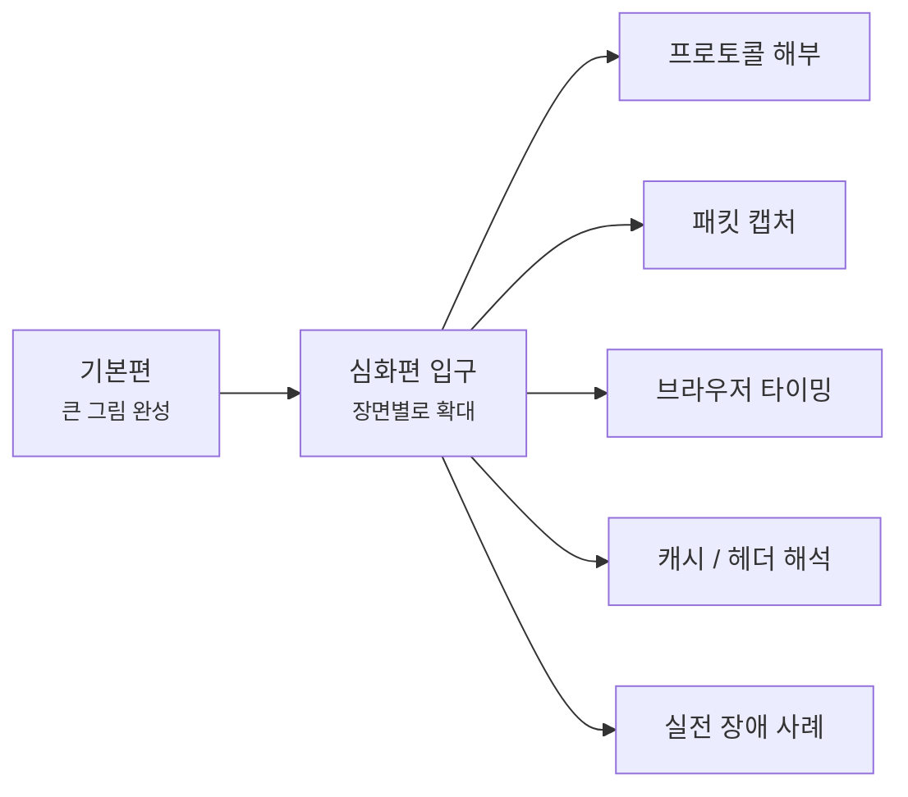
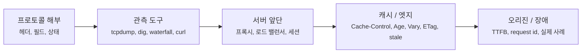
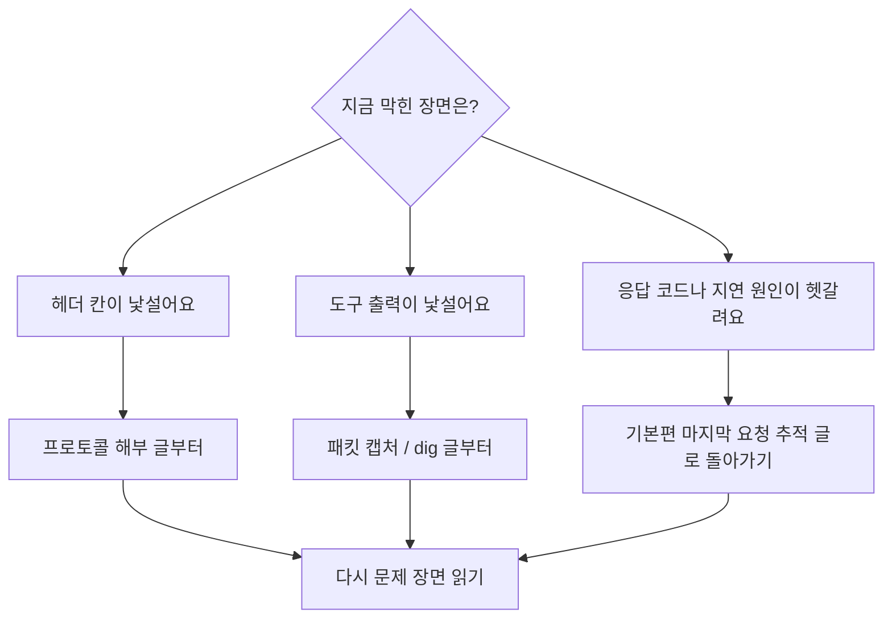

# 네트워크 심화편은 여기서 시작할게요

> 큰 그림을 다 보면 끝일 것 같죠? **사실은 그때부터가 장면을 더 깊게 읽는 시작이에요.**

[기본편의 마지막 글인 요청 하나를 끝까지 따라가 보는 글](../basic/26-end-to-end-request-debugging.md){ data-preview }까지 읽고 나면,
이제는 **인터넷이 왜 그렇게 움직이는지** 에 대한 큰 그림이 어느 정도 머릿속에 들어와 있을 거예요.

근데요, 여기서부터는 질문이 조금 달라져요.

- "이 헤더 칸은 실제로 몇 번째 비트에 들어 있을까요?"
- "이 패킷 캡처 줄은 왜 이렇게 보일까요?"
- "브라우저 waterfall에서 어디가 진짜 느린 걸까요?"
- "캐시 히트와 미스는 응답 헤더에서 어떻게 읽을까요?"
- "이 장애 장면은 DNS 문제일까요, TLS 문제일까요, 오리진 문제일까요?"

바로 이런 질문들이 심화편의 출발점이에요.

---

## 심화편은 어떤 흐름으로 읽게 될까요?

기본편이 **처음부터 차례대로 따라가는 큰 길**이었다면,
심화편은 그 길 위의 **특정 장면을 확대해서 다시 보는 구간**이에요.

그러니까 여기서는 기본편의 큰 흐름을 다시 반복하기보다,
**"이 장면을 더 정확하게 읽고 싶다"** 는 필요를 따라 들어오면 돼요. 어떤 글은 헤더나 캡처를 더 깊게 읽는 쪽으로, 또 어떤 글은 장애 장면이나 브라우저 타이밍을 더 촘촘하게 해석하는 쪽으로 이어질 거예요.

---

## 읽기 전에 이것만 먼저 보면 좋아요

심화편에서 중요한 건 글 수보다,
**기본편에서 만든 감과 지도를 들고 들어오는 것** 이거든요.

그래서 가능하면 먼저:

- [기본편 읽기 가이드](../basic/index.md){ data-preview }를 한 번 보고,
- 가능하면 [기본편 마지막 글](../basic/26-end-to-end-request-debugging.md){ data-preview }까지의 큰 흐름을 머릿속에 두고,
- 그다음 필요한 장면을 심화편에서 다시 여는 식으로 들어오면 좋아요.

근데요, 심화편은 번호 시리즈가 아니다 보니 **아무 데서나 골라 읽기 쉬워 보이지만**, 막상 읽어보면 앞에서 한 번 보고 온 장면이 있을수록 훨씬 덜 헷갈려요.
그래서 아래는 발행 순서가 아니라, **독자가 읽기 편한 추천 순서**로 정리해둘게요.

### 지금 바로 읽을 수 있는 프로토콜 해부 글

- [IPv4 헤더 한 줄 한 줄 읽기](./ipv4-header-anatomy.md){ data-preview } — 기본편에서 카드처럼만 봤던 IP 헤더를 32비트 격자 위에서 펼쳐봐요.
- [IPv6 헤더는 왜 딱 40바이트일까요?](./ipv6-header-anatomy.md){ data-preview } — 주소는 더 길어졌는데 왜 기본 헤더는 오히려 일정해졌는지 같이 읽어봐요.
- [서브넷 마스크와 CIDR은 실제로 어떻게 계산할까요?](./subnet-mask-and-cidr.md){ data-preview } — `/24`와 `255.255.255.0`이 같은 뜻인 이유부터 네트워크 주소, 브로드캐스트 주소, 호스트 범위 계산까지 같이 읽어봐요.
- [네트워크 주소, 브로드캐스트 주소, 호스트 범위는 어떻게 나뉠까요?](./network-broadcast-and-host-range.md){ data-preview } — `/24`, `/26` 같은 범위 안에서 시작 주소, 끝 주소, 실제 기기 주소가 어떻게 갈라지는지 같이 읽어봐요.
- [A/B/C 클래스 주소 체계는 왜 CIDR로 바뀌었을까요?](./classful-addressing-and-cidr-history.md){ data-preview } — 예전 클래스 방식이 왜 낭비를 만들었고, 지금은 왜 prefix 길이로 주소 범위를 읽는지 같이 정리해봐요.
- [Longest Prefix Match는 왜 더 구체적인 길을 고를까요?](./longest-prefix-match-and-route-selection.md){ data-preview } — 라우팅 테이블에 여러 경로가 동시에 맞을 때 왜 더 긴 prefix가 선택되는지 같이 따라가봐요.
- [TCP 헤더는 왜 이렇게 칸이 많을까요?](./tcp-header-anatomy.md){ data-preview } — `SYN`, `ACK`, sequence 번호, window, 옵션이 TCP 헤더의 어느 칸에 들어가는지 20바이트 격자 위에서 같이 읽어봐요.
- [TCP 플래그는 어떻게 읽어야 할까요?](./tcp-flags-cheatsheet.md){ data-preview } — `Flags [S]`, `Flags [S.]`, `Flags [F.]`, `Flags [R]` 같은 짧은 표시를 handshake, 데이터, 종료 장면과 함께 읽어봐요.
- [TCP 상태 머신: 연결의 탄생부터 소멸까지의 일대기](./tcp-state-machine.md){ data-preview } — TCP가 `SYN`을 보내고 `TIME-WAIT`로 사라지기까지, 엔드포인트 내부에서 어떤 상태를 거치는지 RFC 9293 표준을 바탕으로 촘촘하게 해부해봐요.
- [TCP 윈도우와 흐름 제어는 왜 같이 읽어야 할까요?](./tcp-window-and-flow-control.md){ data-preview } — 받는 쪽이 **"지금은 이만큼 더 받아도 돼요"** 라고 광고하는 Window 값이 ACK, 버퍼 여유, Window Scale과 함께 어떻게 움직이는지 같이 읽어봐요.
- [TCP 혼잡 제어는 왜 흐름 제어와 따로 봐야 할까요?](./tcp-congestion-control.md){ data-preview } — 받는 쪽 여유가 아니라 **길이 붐비는지**를 보고 송신자가 `cwnd` 를 어떻게 조절하는지, slow start와 duplicate ACK 감각까지 같이 읽어봐요.
- [UDP 헤더는 왜 딱 8바이트일까요?](./udp-header-anatomy.md){ data-preview } — TCP보다 훨씬 짧은 UDP 헤더가 포트, 길이, 체크섬 네 칸으로 어떻게 끝나는지 같이 읽어봐요.
- [이더넷 프레임과 VLAN 태그 해부하기](./ethernet-frame-and-vlan.md){ data-preview } — IP 패킷을 감싸서 로컬 네트워크로 실어 나르는 이더넷 프레임의 구조와, 그 사이에 끼어드는 VLAN 태그의 4바이트를 자세히 들여다봐요.

### 지금 바로 읽을 수 있는 패킷 캡처 글

- [tcpdump 한 줄은 어떻게 읽어야 할까요?](./tcpdump-first-look.md){ data-preview } — 터미널에 길게 찍히는 tcpdump 한 줄을 시간, 인터페이스, 방향, 주소, 플래그, 길이 순서로 차근차근 읽어봐요.
- [tcpdump에서 TCP handshake는 어떻게 보일까요?](./tcp-handshake-in-capture.md){ data-preview } — `SYN`, `SYN-ACK`, `ACK` 세 줄이 실제 캡처에서는 어떻게 찍히는지, 어디서 끊기면 무엇을 의심해야 하는지 같이 읽어봐요.
- [ss와 netstat에서 TCP 상태는 어떻게 읽어야 할까요?](./ss-and-netstat-state-reading.md){ data-preview } — `LISTEN`, `ESTABLISHED`, `TIME-WAIT`, `CLOSE-WAIT` 같은 상태 이름이 실제 운영 화면에서는 어떤 장면으로 읽히는지 같이 정리해봐요.

### 그다음 TLS 장면으로 넘어가면 좋아요

- [TLS 1.3 핸드셰이크는 실제로 어떤 순서일까요?](./tls13-handshake-anatomy.md){ data-preview } — `ClientHello` 부터 `ServerHello`, `EncryptedExtensions`, `Certificate`, `Finished` 까지, HTTPS 보호 통로가 어떤 순서로 준비되는지 같이 해부해봐요.
- [TLS 핸드셰이크는 실제로 어떻게 한 단계씩 진행될까요?](./tls-handshake-step-by-step.md){ data-preview } — TCP가 열린 뒤 TLS 장면이 어떤 순서로 지나가고, 각 단계에서 무엇을 먼저 읽어야 하는지 실제 흐름처럼 따라가봐요.
- [TLS 인증서 체인과 신뢰 오류는 어떻게 읽어야 할까요?](./tls-cert-chain-and-trust-errors.md){ data-preview } — `hostname mismatch`, 만료, intermediate 누락, 신뢰 저장소 차이 같은 인증서 경고를 **어느 검사에서 멈췄는지** 기준으로 같이 읽어봐요.
- [SNI, ESNI, ECH는 뭐가 다를까요?](./sni-and-esni-ech.md){ data-preview } — 서버가 인증서를 고르기 전에 왜 이름이 먼저 필요했는지, 평문 SNI가 왜 문제였는지, 왜 ESNI가 ECH로 바뀌었는지 같이 해부해봐요.
- [QUIC은 왜 UDP 위에서 돌아갈까요?](./quic-first-look.md){ data-preview } — QUIC이 왜 굳이 UDP를 바닥으로 골랐는지, TLS는 어디에 들어가는지, HTTP/3 장면은 어떻게 보이는지 같이 읽어봐요.

### 그다음 DNS 메시지 안쪽으로 내려가도 좋아요

- [DNS 메시지는 왜 질문 하나에 칸이 이렇게 많을까요?](./dns-message-format.md){ data-preview } — `id`, `flags`, `QUESTION`, `ANSWER`, `AUTHORITY`, `ADDITIONAL` 같은 칸이 실제로 어떤 구조로 붙어 있는지, `dig` 화면 감각과 함께 같이 읽어봐요.
- [dig 출력은 어디부터 읽어야 할까요?](./dns-lookup-with-dig.md){ data-preview } — `dig` 기본 출력에서 `HEADER`, `QUESTION`, `ANSWER`, `AUTHORITY`, `ADDITIONAL`, `SERVER` 줄을 어떤 순서로 읽어야 하는지 실제 장면처럼 따라가봐요.
- [DNS 재귀 조회와 반복 조회는 뭐가 다를까요?](./dns-resolver-recursion-vs-iteration.md){ data-preview } — 브라우저는 한 번만 물어본 것 같은데, 재귀 리졸버가 루트·TLD·권한 서버를 대신 따라가는 흐름을 같이 읽어봐요.
- [DNS TTL과 캐시는 왜 바뀐 주소를 바로 안 보여줄까요?](./dns-ttl-and-cache-staleness.md){ data-preview } — DNS 설정을 바꿨는데도 누군가는 예전 주소를 보는 이유를 TTL, 재귀 리졸버 캐시, 음성 캐시 관점에서 읽어봐요.
- [CNAME과 apex 도메인은 왜 같이 쓰기 어려울까요?](./cname-flattening-and-apex.md){ data-preview } — CNAME이 편한 별명처럼 보이지만, 루트 도메인에서는 왜 `SOA`, `NS` 같은 필수 레코드와 충돌하는지 같이 읽어봐요.
- [EDNS0는 DNS 메시지 크기를 어떻게 넓혀줄까요?](./edns0-and-dns-message-size.md){ data-preview } — DNS 응답이 512바이트를 넘을 때 `OPT PSEUDOSECTION`, `udp:` 값, `TC` 비트, TCP 재시도를 어떻게 이어 읽어야 하는지 같이 볼 수 있어요.
- [DNSSEC은 DNS 응답을 어떻게 믿게 만들어줄까요?](./dnssec-overview.md){ data-preview } — DNS 응답에 붙는 `RRSIG`, `DNSKEY`, `DS`가 어떻게 믿음의 사슬을 만들고, 검증 리졸버가 무엇을 확인하는지 같이 읽어봐요.
- [DoH와 DoT는 DNS 경로를 어디까지 숨겨줄까요?](./doh-dot-and-resolver-paths.md){ data-preview } — DNS 질문과 응답을 리졸버까지 어떤 암호화 통로에 싣는지, DNSSEC과는 무엇이 다른지 같이 나눠 읽어봐요.

### 그다음 HTTP 메시지 구조로 넘어가면 좋아요

- [HTTP/1.1 메시지는 왜 빈 줄 하나가 중요할까요?](./http1-message-grammar.md){ data-preview } — `GET / HTTP/1.1`, 헤더 필드, 빈 줄, 본문 길이 신호가 HTTP/1.1 메시지에서 어떤 경계를 만드는지 같이 읽어봐요.
- [HTTP/2는 어떻게 여러 요청을 한 연결에 섞어 보낼까요?](./http2-frames-and-multiplexing.md){ data-preview } — HTTP/1.1의 텍스트 메시지가 프레임, 스트림, 멀티플렉싱으로 어떻게 바뀌는지 같이 읽어봐요.
- [HTTP/3는 QUIC 위에서 프레임을 어떻게 나눌까요?](./http3-and-quic-frames.md){ data-preview } — HTTP/2의 프레임 감각이 QUIC 스트림, 제어 스트림, QPACK 위에서 어떻게 다시 배치되는지 같이 읽어봐요.

### 그다음 도구로 요청을 직접 읽어봐요

- [curl verbose와 timing은 어디부터 읽어야 할까요?](./curl-verbose-and-timing.md){ data-preview } — `curl -v` 출력과 `--write-out` timing 값을 DNS, TCP, TLS, 첫 바이트, 전체 시간으로 나눠 읽어봐요.
- [브라우저 waterfall은 어디부터 읽어야 할까요?](./reading-browser-waterfall.md){ data-preview } — Network 탭의 waterfall에서 Queueing, DNS, 연결, TLS, Waiting, 다운로드 구간을 나눠 읽어봐요.

### 그다음 서버 앞단 오류를 읽어봐요

- [502, 503, 504는 어디서 만든 응답일까요?](./reading-502-503-504.md){ data-preview } — 프록시, 로드 밸런서, CDN, 오리진 사이에서 보이는 5xx를 상태 코드, 헤더, waterfall 시간 모양으로 나눠 읽어봐요.
- [X-Forwarded 헤더에서 진짜 클라이언트 IP는 어떻게 읽을까요?](./x-forwarded-headers-and-client-ip.md){ data-preview } — 프록시 뒤에서 앱이 보는 IP가 왜 달라지는지, `X-Forwarded-For`와 `Forwarded` 헤더를 신뢰 경계 기준으로 읽어봐요.
- [L4와 L7 로드 밸런서는 무엇을 보고 나눠 보낼까요?](./l4-vs-l7-load-balancer.md){ data-preview } — 로드 밸런서가 연결의 IP·포트만 보는지, HTTP Host·path까지 읽는지에 따라 장애와 라우팅 해석이 어떻게 달라지는지 같이 읽어봐요.
- [TLS 종료와 TLS 패스스루는 어디서 갈라질까요?](./tls-termination-vs-passthrough.md){ data-preview } — HTTPS 암호를 앞단에서 풀어 읽는지, 뒤쪽 서버까지 그대로 넘기는지에 따라 라우팅과 인증서 오류 해석이 어떻게 달라지는지 같이 읽어봐요.
- [Connection reuse, Keep-Alive, Pooling은 왜 같이 봐야 할까요?](./connection-reuse-keepalive-and-pooling.md){ data-preview } — 앞단과 오리진 사이 연결을 다시 쓰는 방식이 지연, connection pool, 간헐적인 502와 어떻게 이어지는지 같이 읽어봐요.
- [Sticky Session과 로드 밸런싱 방식은 왜 같이 봐야 할까요?](./sticky-sessions-and-load-balancing-modes.md){ data-preview } — 같은 사용자를 계속 같은 서버로 보낼지, 건강한 서버 중 아무 곳으로 보내도 될지 세션과 배포 관점에서 읽어봐요.

### 그다음 캐시 헤더를 읽어봐요

- [Cache-Control과 Age 헤더는 어떻게 같이 읽어야 할까요?](./reading-cache-control-and-age.md){ data-preview } — `max-age`, `s-maxage`, `no-cache`, `no-store`, `Age`를 함께 읽으며 지금 응답이 새 원본인지 캐시 사본인지 좁혀봐요.
- [Cache Key와 Vary는 왜 같이 읽어야 할까요?](./cache-key-and-vary.md){ data-preview } — 같은 URL처럼 보여도 요청 헤더, 쿼리, 쿠키 조건에 따라 캐시 사본이 어떻게 나뉘는지 같이 읽어봐요.
- [CDN Cache Status 헤더는 어떻게 읽어야 할까요?](./cdn-cache-status-headers.md){ data-preview } — `HIT`, `MISS`, `BYPASS`, `STALE` 같은 CDN 상태 헤더를 `Cache-Control`, `Age`, `Vary`와 함께 읽어봐요.
- [ETag와 조건부 요청은 어떻게 304를 만들까요?](./etag-and-conditional-requests.md){ data-preview } — `ETag`, `Last-Modified`, `If-None-Match`, `304 Not Modified`로 오래된 사본을 다시 내려받지 않고 확인하는 흐름을 읽어봐요.
- [stale-while-revalidate와 soft purge는 왜 같이 볼까요?](./stale-while-revalidate-and-soft-purge.md){ data-preview } — stale 사본을 잠깐 보여주면서 뒤에서 갱신하는 방식과, soft purge가 사본을 지우기보다 stale로 표시하는 흐름을 읽어봐요.
- [Cookie와 캐시 가능성은 왜 같이 봐야 할까요?](./cookie-and-cacheability.md){ data-preview } — `Cookie`, `Set-Cookie`, `Authorization`, `private`, `no-store`를 함께 읽으며 사용자별 응답이 공유 캐시에 섞이지 않게 판단해봐요.

### 그다음 오리진 시간을 나눠 읽어요

- [TTFB와 Content Download는 어떻게 다르게 읽을까요?](./ttfb-vs-content-download.md){ data-preview } — 요청 전체 시간이 길 때 첫 바이트 전이 느린지, 첫 바이트 뒤 다운로드가 느린지 나눠 읽어봐요.
- [Server-Timing과 Request ID는 왜 같이 봐야 할까요?](./server-timing-and-request-id.md){ data-preview } — 긴 `Waiting` 구간을 서버가 남긴 시간 힌트, request id, trace id, 오리진 로그와 이어 붙여봐요.
- [느린 upstream과 느린 render는 어떻게 구분할까요?](./slow-upstream-vs-slow-render.md){ data-preview } — 오리진 안쪽 시간이 길 때 DB·내부 API·외부 API를 기다린 시간인지, 서버가 응답을 만든 시간인지 나눠 읽어봐요.
- [Tail Latency와 p99는 왜 평균보다 먼저 봐야 할까요?](./tail-latency-and-p99.md){ data-preview } — 평균은 괜찮은데 일부 요청만 느린 장면에서 p95, p99, max, slow sample을 나눠 읽어봐요.
- [Connection Pool Saturation은 왜 TTFB를 길게 만들까요?](./connection-pool-saturation.md){ data-preview } — 앱 처리는 짧은데 브라우저 `Waiting`이 긴 장면에서 pool 포화, pending queue, upstream timing을 같이 읽어봐요.

## 그다음에는 어떤 장면을 더 열어볼까요?

여기까지가 지금 바로 읽을 수 있는 심화편의 첫 묶음이에요.
처음에는 **프로토콜의 속살을 읽는 힘**을 먼저 만들고, 그다음에는 **도구 출력, 앞단 장애, 캐시 헤더와 오리진 시간을 해석하는 힘**으로 넓혀갈 거예요.

이 그림은 발행 순서라기보다 **읽는 힘이 넓어지는 방향**에 가까워요.
처음에는 패킷과 헤더를 직접 읽고, 그다음에는 그 흔적이 도구 화면과 운영 장면에서 어떻게 보이는지 따라가게 될 거예요.

### IP 주소 쪽에서는 이런 질문이 이어져요

[기본편의 서브넷 마스크와 CIDR 글](../basic/16-subnet-mask-and-cidr.md){ data-preview }에서는
**같은 네트워크인지, 게이트웨이에게 맡겨야 하는지**를 판단하는 큰 그림을 먼저 잡았어요.
심화편에서는 이제 [`/24`와 `255.255.255.0`이 같은 말인 이유](./subnet-mask-and-cidr.md){ data-preview }를 비트 단위로 열고,
[네트워크 주소·브로드캐스트 주소·호스트 범위](./network-broadcast-and-host-range.md){ data-preview }가 실제 숫자 범위에서 어떻게 갈라지는지도 이어서 볼 수 있어요.
또 [A/B/C 클래스 주소 체계가 왜 CIDR로 바뀌었는지](./classful-addressing-and-cidr-history.md){ data-preview }를 보면, 지금 왜 첫 숫자보다 prefix를 더 중요하게 읽는지도 정리돼요.
그리고 [라우터가 여러 경로 중 왜 더 긴 prefix를 고르는지](./longest-prefix-match-and-route-selection.md){ data-preview }까지 보면, 주소 범위 계산이 실제 경로 선택으로 이어져요.

이제 IP 주소 묶음에서는 **주소를 숫자로 자르고, 그 범위를 경로 선택으로 읽는 힘**까지 한 번 이어볼 수 있어요.

### DNS 쪽에서는 이런 질문이 이어져요

이미 공개된 DNS 글에서는 **메시지 구조**, **`dig` 출력 읽기**, **TTL 캐시**, **CNAME과 apex 도메인**, **EDNS0와 DNS 메시지 크기**, **DNSSEC 검증 흐름**을 먼저 봤어요.
그리고 이제 [DoH와 DoT가 DNS 경로를 어디까지 숨기는지](./doh-dot-and-resolver-paths.md){ data-preview }까지 보면, DNS 쪽에서는 **답을 어떻게 담고, 믿고, 리졸버까지 보호해서 보내는지**를 한 번 이어서 볼 수 있어요.

### 웹 요청을 더 깊게 보면 이런 장면도 기다리고 있어요

DNS 다음에는 HTTP와 서버 앞단으로 시선이 옮겨가요.
브라우저에서 요청 하나가 느려졌을 때, 겉으로는 그냥 **"사이트가 느리다"** 로 보이지만 안쪽 장면은 꽤 다르게 갈라지거든요.

먼저 [HTTP/1.1 메시지의 시작 줄, 헤더, 빈 줄, 본문 구조](./http1-message-grammar.md){ data-preview }를 보면, 브라우저와 서버가 실제로 어떤 모양의 약속문을 주고받는지부터 잡을 수 있어요. 이어서 [HTTP/2의 프레임, 스트림, 멀티플렉싱](./http2-frames-and-multiplexing.md){ data-preview }까지 보면, 현대 브라우저가 한 연결 안에서 여러 요청을 어떻게 섞어 처리하는지도 볼 수 있고요. 그다음 [HTTP/3가 QUIC 위에서 프레임을 어떻게 다시 나누는지](./http3-and-quic-frames.md){ data-preview }까지 보면, `h2`와 `h3`가 왜 단순한 버전 숫자 차이가 아닌지도 이어져요. 이제 [curl verbose와 timing 값](./curl-verbose-and-timing.md){ data-preview }으로 요청 하나를 직접 쪼개 보고, [브라우저 waterfall](./reading-browser-waterfall.md){ data-preview }로 여러 요청이 겹쳐 흐르는 장면까지 보면, [502, 503, 504가 어느 계층의 목소리인지](./reading-502-503-504.md){ data-preview }, [프록시 뒤에서 클라이언트 IP를 어떻게 믿어야 하는지](./x-forwarded-headers-and-client-ip.md){ data-preview }, [L4와 L7 로드 밸런서가 무엇을 보고 나누는지](./l4-vs-l7-load-balancer.md){ data-preview }, [TLS 종료와 패스스루가 어디서 갈라지는지](./tls-termination-vs-passthrough.md){ data-preview }도 더 정확히 좁혀 읽을 수 있어요. 그리고 [앞단과 오리진 사이 연결을 다시 쓰는 방식](./connection-reuse-keepalive-and-pooling.md){ data-preview }과 [sticky session이 같은 사용자를 같은 서버에 붙잡는 방식](./sticky-sessions-and-load-balancing-modes.md){ data-preview }까지 보면, 간헐적인 502나 로그인 풀림이 앱 코드만의 문제가 아닐 수도 있다는 감각이 생겨요. 이어서 [Cache-Control과 Age 헤더](./reading-cache-control-and-age.md){ data-preview }를 읽으면, 캐시된 응답이 지금도 fresh인지, 이미 오래된 사본인지도 헤더에서 좁혀볼 수 있어요. 그리고 [Cache Key와 Vary](./cache-key-and-vary.md){ data-preview }까지 보면, 같은 URL처럼 보여도 언어, 압축, 쿠키 조건 때문에 캐시 사본이 왜 갈라지는지도 이어서 읽을 수 있어요. [CDN Cache Status 헤더](./cdn-cache-status-headers.md){ data-preview }까지 보면, `HIT`, `MISS`, `BYPASS`, `STALE` 같은 관측 신호를 주변 헤더와 함께 읽는 순서가 잡히고요. [ETag와 조건부 요청](./etag-and-conditional-requests.md){ data-preview }을 보면, stale 사본을 전체 다운로드 없이 다시 확인하는 `304 Not Modified` 흐름까지 이어져요. [stale-while-revalidate와 soft purge](./stale-while-revalidate-and-soft-purge.md){ data-preview }까지 보면, 오래된 사본을 바로 버리지 않고 잠깐 제공하면서 뒤에서 갱신하는 운영 전략도 이어서 읽을 수 있어요. [Cookie와 캐시 가능성](./cookie-and-cacheability.md){ data-preview }까지 보면, 쿠키와 인증 신호가 있을 때 어떤 응답을 공유 캐시에 둬도 되는지 더 조심스럽게 판단할 수 있어요. 그리고 [TTFB와 Content Download](./ttfb-vs-content-download.md){ data-preview }를 나눠 읽으면, 요청 전체 시간이 길 때 서버가 첫 바이트를 늦게 준 건지, 본문을 옮기는 데 오래 걸린 건지도 더 정확히 갈라볼 수 있어요. 이어서 [Server-Timing과 Request ID](./server-timing-and-request-id.md){ data-preview }를 같이 보면, 긴 `Waiting` 구간을 서버가 남긴 시간 힌트와 로그 표식으로 이어 붙일 수 있어요. 그리고 [느린 upstream과 느린 render](./slow-upstream-vs-slow-render.md){ data-preview }를 나눠 보면, 오리진 안쪽에서 남을 기다린 시간과 서버가 직접 응답을 만든 시간을 더 선명하게 구분할 수 있어요. [Tail Latency와 p99](./tail-latency-and-p99.md){ data-preview }를 보면, 평균은 괜찮은데 일부 요청만 느린 장면에서 p95, p99, slow sample을 어떻게 이어 읽을지 정리할 수 있어요. 마지막으로 [Connection Pool Saturation](./connection-pool-saturation.md){ data-preview }까지 보면, 앱 처리 시간은 짧아도 요청이 오리진 연결 자리를 기다리느라 `Waiting`이 길어지는 장면까지 나눠볼 수 있어요.

| 겉으로 보이는 장면 | 더 깊게 보면 | 앞으로 열어볼 질문 |
|---|---|---|
| 브라우저 waterfall이 길게 늘어짐 | DNS, 연결, TLS, TTFB, 다운로드 시간이 따로 움직임 | 진짜 느린 구간은 어디일까요? |
| `502`, `503`, `504` 가 뜸 | 앞단 프록시와 뒤쪽 서버 사이의 실패일 수 있음 | 이 응답은 누구의 목소리일까요? |
| 로그의 클라이언트 IP가 이상함 | 앱이 직접 본 주소와 forwarded 헤더 값이 다를 수 있음 | 이 IP는 누가 적었고 어디까지 믿어도 될까요? |
| 캐시가 된 것 같은데 값이 이상함 | `Cache-Control`, `Age`, `Vary`, CDN 상태 헤더가 얽힘 | 지금 보는 건 새 값일까요, 오래된 사본일까요? |
| `HIT`과 `MISS`가 예상과 다름 | cache key, TTL, 쿠키, 인증, CDN 규칙이 함께 작동함 | 이 상태값은 결과일까요, 원인일까요? |
| `304`가 떠서 본문이 안 보임 | 저장된 사본을 validator로 다시 확인했을 수 있음 | 이 응답은 새 본문일까요, 재사용 허가일까요? |
| purge했는데 예전 화면이 잠깐 보임 | soft purge나 stale 재검사 정책이 작동했을 수 있음 | 이 사본은 삭제됐을까요, stale로 표시됐을까요? |
| 쿠키가 있는데 캐시가 되거나 안 됨 | 사용자별 응답인지, 공용 응답인지, CDN 정책이 무엇인지 갈라짐 | 이 사본을 다른 사용자에게 줘도 될까요? |
| `Waiting`은 긴데 원인 로그를 못 찾음 | Server-Timing, request id, trace id가 관측 표식이 됨 | 이 브라우저 요청은 어느 로그 줄과 같은 요청일까요? |
| 오리진 로그도 긴데 원인이 애매함 | upstream 대기와 render 시간이 섞여 있을 수 있음 | 남을 기다린 걸까요, 직접 만든 걸까요? |
| 인증서 오류가 갑자기 터짐 | 체인, 만료, 이름 불일치, 신뢰 저장소가 갈라짐 | 어느 검사에서 멈춘 걸까요? |
| 조용하다가 첫 요청만 가끔 502 | 앞단이 닫힌 upstream 연결을 다시 쓰려 했을 수 있음 | 이 연결은 새로 열렸을까요, pool에서 꺼냈을까요? |
| 로그인이나 장바구니가 서버마다 달라짐 | 세션이 특정 백엔드에 묶였거나 sticky가 깨졌을 수 있음 | 이 사용자는 왜 같은 서버로 가야 할까요? |
| 간헐적으로만 느림 | 평균보다 p95, p99 같은 꼬리 지연이 중요할 수 있음 | 왜 대부분은 빠른데 일부 요청만 느릴까요? |
| 앱 로그는 짧은데 `Waiting`이 김 | 오리진 앞 connection pool에서 줄을 섰을 수 있음 | 서버가 느린 걸까요, 서버로 가는 자리가 부족한 걸까요? |

기본편에서는 이 장면들을 한 요청의 큰 흐름으로 이어서 봤고,
심화편에서는 각각의 줄을 **실제 출력, 헤더, 상태, 장애 사례** 위에서 다시 읽어볼 거예요.

## 길을 잃었을 때는 이렇게 돌아오면 돼요

심화편은 차례대로 읽어도 좋지만, 문제를 만난 지점에서 들어와도 괜찮아요.
대신 막히면 아래처럼 한 칸만 뒤로 물러서면 훨씬 덜 복잡해져요.

헤더 칸이 헷갈리면 구조 해부 글로, 출력이 헷갈리면 도구 글로, 전체 요청 흐름이 흐릿하면 기본편 마지막 글로 잠깐 돌아오면 돼요.
심화편은 외우는 글 모음이라기보다, **문제 장면을 더 작게 쪼개 읽는 지도**에 가까워요.

## 자, 정리해볼까요?

!!! abstract "심화편은 이런 분에게 맞아요"
    - 기본편의 큰 흐름을 끝까지 따라온 뒤, 이제 **장면 하나를 더 깊게 보고 싶은 분**
    - 패킷 캡처, 브라우저 타이밍, 캐시 헤더, 장애 사례처럼 **실전 해석 감각**을 더 키우고 싶은 분
    - 큰 그림은 이미 있는데, 그 안쪽 장면이 어떻게 보이는지 더 정확히 읽고 싶은 분
    - 헤더, 상태, 출력, 응답 헤더를 보고 **"이게 어떤 신호인지"** 직접 읽어보고 싶은 분

그럼, 심화편으로 들어가기 전에 기본편의 마지막 흐름부터 다시 보고 싶으세요?

<a class="md-button md-button--primary" href="../basic/26-end-to-end-request-debugging/">기본편 마지막 글 다시 보기</a>
<a class="md-button" href="../basic/">기본편 읽기 가이드 보기</a>
