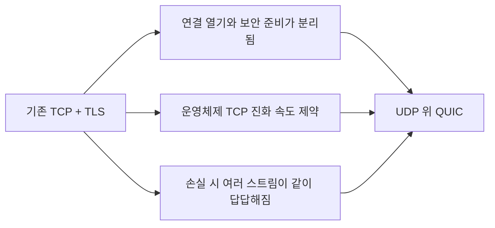
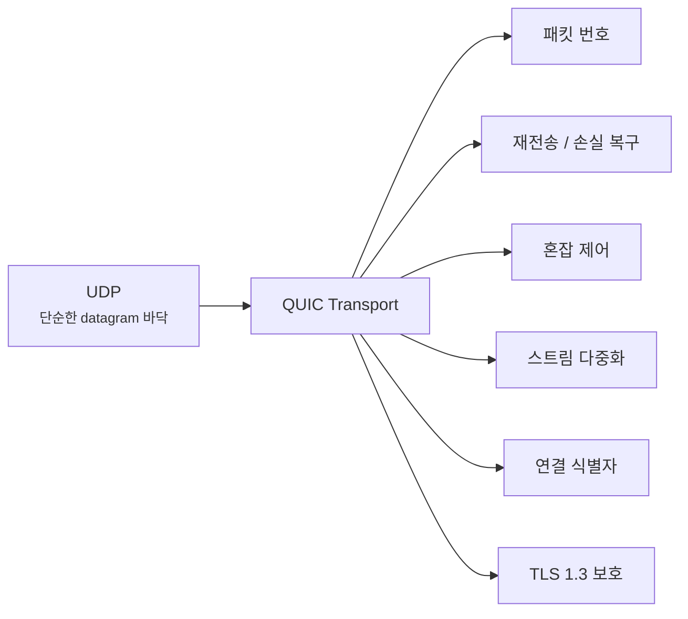
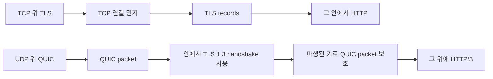
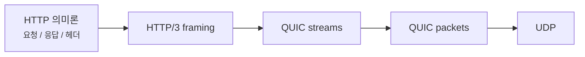

# QUIC은 왜 UDP 위에서 돌아갈까요?

> HTTPS면 그냥 TCP 위에서만 더 좋아지면 될 것 같죠? **사실은 웹이 더 빨라지려면, 아래 전달 방식부터 다시 만져야 하는 순간이 있었어요.**

[TCP vs UDP](../basic/03-tcp-vs-udp.md){ data-preview }에서는 **TCP는 꼼꼼하고, UDP는 가볍다**는 큰 성격 차이를 먼저 봤어요. 그리고 [HTTP와 HTTPS](../basic/06-http-and-https.md){ data-preview }에서는 **브라우저와 서버가 HTTP로 말하고, HTTPS는 그 대화를 보호된 통로로 감싼다**는 흐름도 봤죠. 바로 앞 글인 [SNI, ESNI, ECH는 뭐가 다를까요?](./sni-and-esni-ech.md#what-ech-hides){ data-preview }에서는 TLS의 첫 장면이 어떻게 보이고, 그 안에서 이름이 왜 민감한 힌트가 되는지도 열어봤고요.

근데 여기까지 오면 또 이런 질문이 자연스럽게 남아요.

> *"좋아요, 근데 왜 요즘은 HTTP/3가 TCP 대신 UDP 위에 올라간다고 하죠? UDP면 원래 허술한 쪽 아니었나요?"*

이 글은 바로 그 지점, 그러니까 **HTTP/3가 왜 단순한 버전 숫자 업이 아닌지**를 풀기 위한 글이에요. 개발자 도구에서 `h3` 가 보이거나, 어떤 환경에서는 QUIC 시도 뒤에 다시 HTTP/2로 fallback 되거나, TLS 장면이 예전 TCP 감각과 다르게 보일 때도 결국 이 이야기가 밑에 깔려 있어요.

오늘은 **QUIC이 한마디로 뭐인지**, **무엇과 연결되는지**, **왜 이런 방식이 생겼는지**, 그리고 그다음에야 **왜 UDP를 바닥으로 골랐는지**, **TLS는 어디에 들어가는지**, **HTTP/3 장면은 어떻게 달라지는지** 순서로 같이 볼게요. 핵심 규격은 QUIC 전송을 정의한 [RFC 9000](https://www.rfc-editor.org/rfc/rfc9000), QUIC에서 TLS를 쓰는 방식을 정의한 [RFC 9001](https://www.rfc-editor.org/rfc/rfc9001), HTTP/3를 정의한 [RFC 9114](https://www.rfc-editor.org/rfc/rfc9114)예요. [RFC 9308](https://www.rfc-editor.org/rfc/rfc9308)은 이 셋과 같은 핵심 프로토콜 규격이라기보다, QUIC을 어떤 환경에 적용할 때 무엇을 고려해야 하는지 정리한 적용 지침이에요.

!!! note "이 글의 범위"
    여기서는 **QUIC의 첫인상**에 집중할게요. 패킷 타입을 비트 단위로 끝까지 해부하거나, QPACK과 stream state를 RFC처럼 다 뜯어보진 않을 거예요. 대신 **QUIC이 대체 뭔지**, **왜 웹이 TCP + TLS 감각에서 한 번 더 갈라졌는지**, **TLS 1.3이 QUIC 안에서 어떻게 쓰이는지**, **HTTP/3 장면은 어디서 다르게 보이는지**를 선명하게 붙잡을 거예요.

---

## 왜 QUIC을 알아야 할까요?

브라우저 네트워크 화면에서 `h3` 나 `HTTP/3` 가 보이면, 많은 분들이 이렇게 생각해요.

> *"아, HTTP가 또 한 번 버전업됐구나."*

근데 여기서 진짜 바뀐 건 **HTTP 문법 몇 줄**보다도, 그 HTTP를 실어 나르는 **아래쪽 전달 방식**이에요. 그래서 QUIC을 모르면 이런 장면에서 자꾸 감이 끊겨요.

- 왜 HTTP/3는 **TCP가 아니라 UDP** 위에 있지?
- 왜 TLS가 들어가는 자리도 예전 감각이랑 다르게 보이지?
- 왜 어떤 환경에선 QUIC을 시도했다가 다시 **HTTP/2/TCP로 fallback** 하지?
- 왜 `HTTP/3` 는 그냥 **HTTP/2 faster edition** 정도로 보면 자꾸 설명이 안 맞지?

즉 이 글은 QUIC 자체를 외우기 위한 글이라기보다, **HTTP/3 시대의 아래쪽 장면이 왜 달라졌는지** 이해하기 위한 글이에요.

---

## QUIC은 한마디로 뭐예요?

한 줄로 먼저 잡으면 이래요.

> **QUIC은 UDP 위에, 웹이 필요로 하는 전송 규칙과 보안을 다시 얹은 현대적인 전송 계층이에요.**

여기서 중요한 건 두 가지예요.

1. QUIC은 **그냥 UDP 자체**가 아니에요.
2. QUIC은 **TCP에 암호화만 덧칠한 것**도 아니에요.

오히려 QUIC은 **UDP라는 단순한 바닥 위에서**, 연결 식별, 손실 복구, 혼잡 제어, 스트림 다중화, 보안 같은 것들을 자기 방식으로 다시 묶은 쪽에 더 가까워요.

그러니까 HTTP/3 를 읽을 때는,
**HTTP/1.1 → HTTP/2 → HTTP/3** 를 단순히 HTTP 문법 버전으로만 이어 보면 부족해요.
HTTP/3 에서는 **아래 전송 장면 자체가 달라졌기 때문**이에요.

---

## 그럼 QUIC은 무엇과 연결될까요?

QUIC은 혼자 떨어진 기술이 아니라, 앞에서 보던 것들을 한가운데서 다시 묶는 자리예요.

| 연결되는 대상 | QUIC과의 관계 | 여기서 같이 봐야 하는 이유 |
|---|---|---|
| UDP | QUIC이 올라가는 바닥 | 왜 TCP 대신 UDP를 골랐는지 이해해야 해요 |
| TLS 1.3 | QUIC 안에서 키 협상과 인증을 맡는 엔진 | 왜 보안 장면이 예전 TCP 위 TLS 감각과 다른지 풀려요 |
| HTTP/3 | QUIC 위에 올라가는 웹 대화 | 왜 `h3` 가 단순 버전업이 아닌지 보이기 시작해요 |
| TCP / HTTP/2 | 비교 기준 | QUIC이 무엇을 바꾸려 했는지 가장 잘 드러나요 |

이 연결이 먼저 잡혀야,
뒤에서 나오는 **손실 복구**, **스트림 독립성**, **fallback**, **0-RTT caveat** 같은 말들도 제자리를 찾아가요.

---

## 왜 이런 방식이 나오게 됐을까요?

핵심은 **웹이 빨라지려면 HTTP만 다듬어서는 부족한 순간이 왔다**는 거예요.

HTTP/2 는 이미 TCP 위에서 스트림 다중화를 밀어붙였어요. 겉으로 보기엔 꽤 좋아졌죠. 근데 실제로는 아래쪽 TCP가 가진 성격 때문에 여전히 답답한 지점이 남았어요.

- 패킷 손실이 나면 **여러 스트림이 같이 발목 잡히는 감각**이 남고,
- 전송 규칙을 크게 바꾸려면 **운영체제 TCP 스택** 제약도 같이 만져야 하고,
- 연결 열기와 보안 준비도 **서로 따로 노는 단계**처럼 보였어요.

그래서 웹 쪽에서는 이런 생각이 자연스럽게 나와요.

> *"기존 TCP 위에서 억지로 더 붙이기보다, 웹이 필요한 전송 규칙을 더 빨리 바꿀 수 있는 바닥을 새로 잡는 편이 낫지 않을까?"*

QUIC은 바로 그 답 중 하나였어요. 이 출발점을 잡고 나면, **왜 UDP 위에서 다시 시작했는지**도 훨씬 덜 뜬금없게 보이기 시작해요.

---

## 왜 굳이 UDP 위에서 다시 시작했을까요? { #why-on-udp }

처음 들으면 좀 이상해 보여요.

> *"TCP가 이미 신뢰성도 해주고 순서도 맞춰주는데, 왜 또 새로 만들죠?"*

핵심은 **기존 TCP 위에서 바꾸기 어려운 것들**이 있었기 때문이에요.

### 1. 운영체제 커널 바깥에서 더 빨리 발전시키고 싶었어요

QUIC은 UDP 위에 올라가니까, 구현이 **사용자 공간(user space)** 에 더 가깝게 올라올 수 있어요. 그러면 브라우저나 서버 소프트웨어가 **TCP 스택 전체를 OS가 바꿔주길 기다리지 않고** 더 빠르게 진화할 수 있죠.

### 2. 연결 시작과 보안을 더 가깝게 묶고 싶었어요

TCP 위에 TLS를 따로 얹는 구조에서는, 연결 열기와 보안 준비가 **분리된 두 단계**처럼 느껴져요. QUIC은 여기서 한 발 더 나가, **전송 계층과 TLS 1.3 협상을 더 촘촘히 묶어** 시작 지연을 줄이려 했어요.

### 3. 스트림이 서로 덜 발목 잡게 하고 싶었어요

HTTP/2는 TCP 위에서 다중화는 했지만, 바닥 TCP에서 패킷 손실이 나면 **한 스트림의 손실이 전체 전달 흐름에 영향을 주는 감각**이 남았어요. QUIC은 이 부분을 더 잘게 나눠 **스트림 단위 독립성**을 더 확보하려고 했죠.



RFC 9308을 초심자 말로 줄이면, QUIC은 **그냥 UDP라서 빠르다**가 아니라, **UDP 위에서 자기가 필요한 전송 규칙을 다시 설계할 수 있어서 유연해졌다** 쪽에 더 가까워요.

---

## QUIC은 UDP 위에서 정확히 무엇을 다시 해주나요? { #what-quic-rebuilds }

여기서 제일 흔한 오해가 나와요.

> **QUIC은 “UDP에 암호화만 덧씌운 것”이 아니에요.**

RFC 9000 기준으로 보면 QUIC은 이런 것들을 스스로 가져가요.

- **연결 식별자**
- **패킷 번호**
- **신뢰성 있는 전달**
- **혼잡 제어**
- **흐름 제어**
- **다중 스트림**
- **연결 마이그레이션 지원**



즉 QUIC은 **TCP의 역할 일부를 버리는 게 아니라**, 그중 필요한 것들을 **자기 방식으로 다시 구현한 쪽**에 더 가까워요. 그래서 UDP 위에 있지만, 실제 성격은 **가벼운 전송 계층 + 보안 계층이 강하게 묶인 구조**라고 보는 편이 맞아요.

---

## TLS는 QUIC에서 어디에 들어갈까요? { #tls-inside-quic }

이 부분이 정말 중요해요. [TLS 1.3 핸드셰이크는 실제로 어떤 순서일까요?](./tls13-handshake-anatomy.md#full-handshake){ data-preview }에서 본 `ClientHello`, `ServerHello`, `Finished` 감각은 여전히 중요해요. 근데 QUIC에서는 그 TLS가 **TCP 위의 별도 레코드 계층처럼** 들어가지 않아요.



| 항목 | TCP + TLS 쪽 감각 | QUIC 쪽 감각 |
|---|---|---|
| 바닥 | TCP | UDP |
| 보안 적용 | TLS records가 TCP 위에 따로 감싸짐 | TLS 1.3이 QUIC 안에서 키 협상에 쓰임 |
| 그 위 웹 | HTTP/1.1, HTTP/2 | HTTP/3 |

RFC 9001을 초심자 말로 줄이면 이래요.

- QUIC은 **TLS 1.3을 그대로 버리지 않아요.**
- 대신 TLS 1.3을 **키 협상과 인증의 엔진**처럼 써요.
- 그리고 그 결과로 나온 키를 써서 **QUIC 패킷 자체를 보호**해요.

즉 QUIC은 *"TLS를 안 쓰는 새 프로토콜"* 이 아니라, **TLS 1.3을 더 깊게 끌어안은 전송 계층**에 더 가까워요.

---

## HTTP/3는 QUIC 위에서 어떻게 올라갈까요? { #http3-over-quic }

HTTP/3는 아예 새로운 웹 의미론을 만든 게 아니에요. 핵심은 **HTTP 의미를 QUIC 위에 다시 매핑한 것**에 가까워요.



그래서 초심자 감각으로는 이렇게 이해하면 좋아요.

- **HTTP/1.1**: TCP 위에서 비교적 단순한 요청/응답 흐름
- **HTTP/2**: TCP 위에서 스트림 다중화 강화
- **HTTP/3**: QUIC 위로 올라가며, 아래 전송 성격 자체가 달라짐

RFC 9114가 말하는 핵심을 사람 말로 줄이면, HTTP/3는 **HTTP가 QUIC의 스트림과 보안 모델을 타도록 옮겨 탄 버전**이에요.

---

## 그럼 진짜 장면에서는 무엇이 다르게 보일까요? { #real-scene }

이번 글은 `structure+scene` 이니까, 실제 장면 한 컷도 같이 볼게요. 예를 들어 브라우저 개발자 도구나 `curl --http3 -I https://example.com` 류의 장면을 보면, 대략 이런 감각의 출력이나 흔적을 만나게 돼요.

```text
$ curl --http3 -I https://example.com
HTTP/3 200
alt-svc: h3=":443"; ma=86400
server: example
```

또 브라우저 네트워크 화면에서는 **Protocol** 칼럼이 `h3` 로 보이거나, 초기 연결에서 **UDP 기반 QUIC 연결**이 먼저 보이는 식으로 흔적이 남을 수 있어요. 실제 문자열과 세부 출력은 도구와 버전에 따라 다르지만, **HTTP/3 / h3 / QUIC / UDP** 쪽 힌트가 같이 붙는다는 감각이 중요해요.

### 이 장면에서 먼저 읽어야 할 신호 네 가지 { #signals-to-read }

- **`HTTP/3` 또는 `h3` 표시가 있는지** — 지금 정말 HTTP/3로 올라갔는가?
- **`alt-svc` 가 보이는지** — 서버가 HTTP/3 가능성을 어떻게 알렸는가?
- **UDP 기반 연결 흔적이 있는지** — TCP 대신 QUIC 쪽으로 갔는가?
- **fallback 흔적이 있는지** — UDP 차단이나 환경 제약으로 다시 HTTP/2/TCP로 내려갔는가?

이 네 가지만 잡아도, *"정말 QUIC이 쓰였나?"*, *"시도는 했지만 fallback된 건가?"* 같은 질문을 훨씬 덜 헤매고 읽을 수 있어요.

---

## 근데 QUIC이 만능은 아니에요 { #caveats }

여기서 과장을 빼는 게 중요해요.

### 1. UDP가 막히는 환경이 있어요

RFC 9308의 적용 지침도 짚듯, 어떤 네트워크는 UDP를 더 엄격하게 다뤄요. 그러면 QUIC 시도가 막히고, **HTTP/2/TCP fallback** 이 필요할 수 있어요.

### 2. 0-RTT는 아무 요청에나 막 쓰면 안 돼요

QUIC이 빠르다고 할 때 자주 같이 나오는 게 0-RTT예요. 이전 연결에서 받은 재개 정보를 이용해 핸드셰이크가 완전히 끝나기 전에 application data를 보내는 방식인데, 이 early data는 **재생(replay)될 수 있어요.**

replay는 공격자가 요청 내용을 해독한다는 뜻이 아니에요. **예전에 유효했던 0-RTT 요청을 다시 보내 서버가 한 번 더 처리하게 만들 수 있다**는 뜻이에요. 같은 요청을 반복해도 최종 상태가 같은 **멱등(idempotent) 작업**과 달리, 결제·주문 생성·쿠폰 사용 같은 **비멱등 요청**은 두 번 처리되면 돈이나 상태가 실제로 두 번 바뀔 수 있어서 특히 위험해요.

그래서 0-RTT는 보통 안전하게 반복 가능한 요청으로 제한하거나, 애플리케이션에서 중복 방지 장치를 함께 두는 식으로 다뤄야 해요.

### 3. 스트림 독립성에도 한계는 있어요

QUIC은 **스트림 사이의 발목 잡힘**을 많이 줄였지만, 각 스트림 내부 질서나 혼잡 제어 자체가 사라지는 건 아니에요.

### 4. QUIC이 UDP 위에 있다고 해서 “UDP처럼 대충 간다”는 뜻은 아니에요

오히려 QUIC은 UDP 바닥 위에서 **필요한 신뢰성과 제어를 다시 세밀하게 만든 쪽**에 더 가까워요.

---

## 잘못 읽기 쉬운 함정 다섯 가지 { #pitfalls }

**하나, QUIC은 그냥 UDP라서 빠르다고 생각하기.**  
더 정확한 말은, UDP 위에서 **자기 전송 규칙을 다시 설계할 수 있어서** 유연해졌다는 쪽이에요.

**둘, QUIC은 TLS를 버린 새 보안 방식이라고 생각하기.**  
실제로는 TLS 1.3을 **키 협상과 인증 엔진**으로 깊게 품고 있어요.

**셋, HTTP/3는 HTTP 내용을 완전히 새로 만든 거라고 생각하기.**  
핵심은 HTTP 의미론을 **QUIC 위로 옮겨 탄 것**에 더 가까워요.

**넷, QUIC이면 무조건 항상 더 빠르다고 생각하기.**  
환경에 따라 UDP 차단, fallback, middlebox 제약 같은 현실 변수가 있어요.

**다섯, 스트림이 분리되면 손실과 순서 문제 자체가 완전히 사라진다고 생각하기.**  
cross-stream HOL 감각은 줄지만, 모든 전달 제약이 사라지는 건 아니에요.

---

## 자, 정리해볼까요?

!!! abstract "오늘 우리가 본 것"
    - QUIC은 **UDP 위에 필요한 전송 규칙과 보안을 다시 얹은 구조**에 가까워요.
    - 그래서 그냥 “UDP에 암호화만 더한 것”으로 보면 부족해요.
    - QUIC은 TLS 1.3을 **키 협상과 인증**에 쓰고, 그 결과를 바탕으로 QUIC 패킷을 보호해요.
    - HTTP/3는 **HTTP 의미를 QUIC 위에 올린 버전**이에요.
    - 그래도 QUIC이 만능은 아니고, UDP 차단·fallback·0-RTT caveat 같은 현실 제약을 같이 봐야 해요.

결국 QUIC을 읽는다는 건, *"왜 웹이 TCP + TLS 조합만으로는 아쉬워졌는지"* 와 *"그 아쉬움을 줄이려고 어떤 것들을 UDP 위에 다시 만들었는지"* 를 함께 보는 일이에요. 이 감각이 잡히면 `HTTP/3` 가 단순한 버전 숫자 업이 아니라, **아래 전송 장면 자체가 달라진 결과**라는 것도 같이 보이기 시작해요.

---

## 이어서 보면 좋은 글

- TCP와 UDP의 성격 차이부터 다시 잡고 싶다면 — [TCP vs UDP](../basic/03-tcp-vs-udp.md){ data-preview }
- HTTP와 HTTPS의 큰 그림부터 다시 보고 싶다면 — [HTTP와 HTTPS는 뭐가 다를까요?](../basic/06-http-and-https.md){ data-preview }
- TLS 1.3 핸드셰이크 구조를 먼저 다시 붙이고 싶다면 — [TLS 1.3 핸드셰이크는 실제로 어떤 순서일까요?](./tls13-handshake-anatomy.md#full-handshake){ data-preview }
- ECH와 ClientHello 쪽 민감한 메타데이터 문제를 다시 보고 싶다면 — [SNI, ESNI, ECH는 뭐가 다를까요?](./sni-and-esni-ech.md#what-ech-hides){ data-preview }
