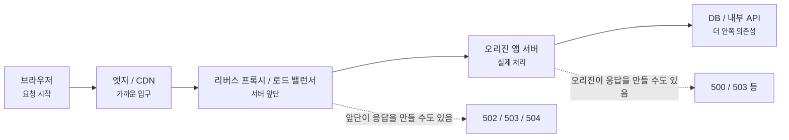
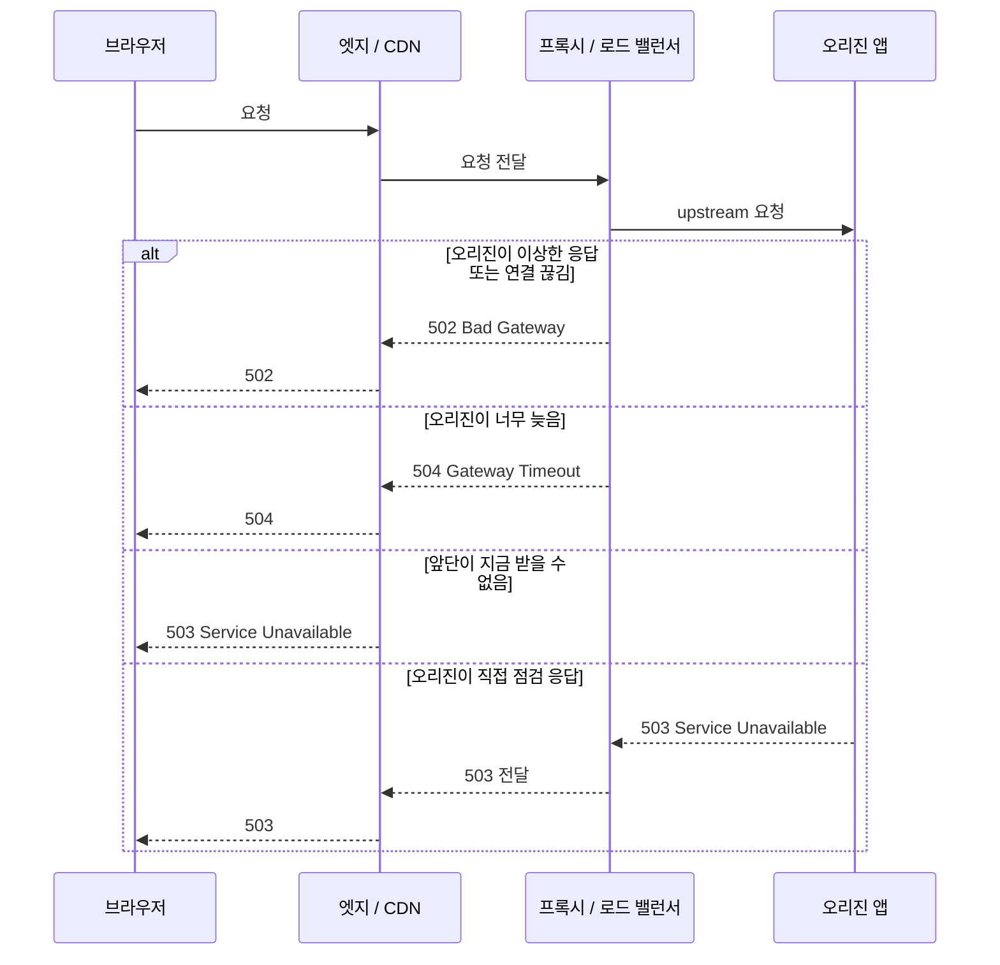
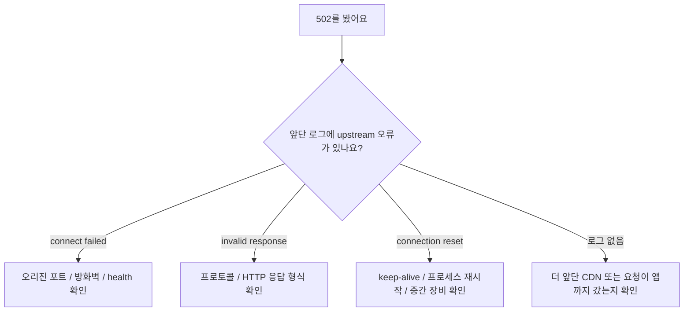
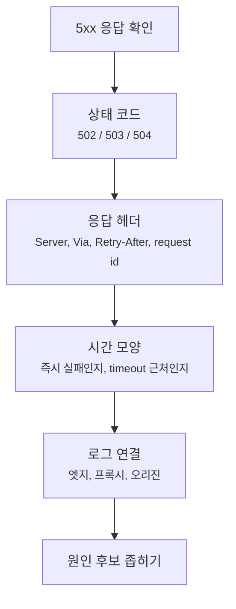

# 502, 503, 504는 어디서 만든 응답일까요?

> 화면에는 그냥 서버 오류처럼 보이죠? **사실은 그 응답을 만든 사람이 앱 서버가 아닐 수도 있어요.**

[Proxy, Reverse Proxy, 그리고 Load Balancer](../basic/24-proxy-reverse-proxy-and-load-balancer.md){ data-preview }에서는 사용자가 보는 서버 앞에 리버스 프록시나 로드 밸런서가 설 수 있다는 큰 그림을 봤어요. 그리고 [End-to-End Request Debugging](../basic/26-end-to-end-request-debugging.md){ data-preview }에서는 요청 하나를 DNS, 연결, TLS, 프록시, 캐시, 오리진 체크포인트로 나눠 읽었죠.

이번 글은 그중에서도 **서버 앞단과 오리진 사이에서 보이는 5xx**를 읽어볼게요.

운영 중에 이런 화면을 보면 마음이 급해져요.

```http
HTTP/2 502
content-type: text/html
server: edge-proxy
```

또는 이렇게 보일 수도 있고요.

```http
HTTP/2 504
content-type: text/html
via: 1.1 reverse-proxy
x-request-id: req_7f3a...
```

처음에는 둘 다 그냥 **"서버가 터졌나?"** 로 보이기 쉬워요. 하지만 여기서 바로 앱 로그만 뒤지면 시간을 잃을 수 있어요. 오늘의 첫 질문은 이거예요.

> *"이 응답은 누구의 목소리일까요?"*

HTTP 상태 코드의 기준 의미는 [RFC 9110](https://www.rfc-editor.org/rfc/rfc9110.html)에 정리돼 있어요. 이 글에서는 그 표준 의미를 바닥에 두고, 실제 디버깅에서는 어떤 신호를 같이 봐야 하는지에 집중할게요.

!!! note "이 글의 범위"
    여기서는 502, 503, 504를 **프록시, 로드 밸런서, CDN, 오리진 경계에서 읽는 법**에 집중해요. 제품마다 에러 페이지 문구, 헤더 이름, 타임아웃 정책은 달라요. 그래서 특정 벤더의 규칙처럼 외우기보다, 어느 지점의 응답인지 좁히는 읽기 순서를 잡는 게 목표예요.

---

## 같은 5xx라도 말하는 위치가 달라요

큰 물류센터에 주문을 넣는다고 해볼게요.

- 고객은 대표 창구에 주문해요.
- 대표 창구는 뒤쪽 창고나 담당 부서에 다시 물어봐요.
- 뒤쪽이 이상하면 대표 창구가 대신 사과문을 줄 수도 있어요.
- 또는 뒤쪽 부서가 직접 "지금은 처리 불가"라고 답할 수도 있죠.

웹 요청도 비슷해요.

| 물류센터 장면 | 웹 요청 장면 |
|---|---|
| 고객 | 브라우저, 앱 클라이언트 |
| 대표 창구 | CDN, 리버스 프록시, 로드 밸런서 |
| 뒤쪽 창고 | 오리진 서버, 앱 서버, 내부 API |
| 창구가 대신 준 사과문 | 앞단이 만든 502/504 |
| 창고가 직접 보낸 안내 | 오리진이 만든 500/503 등 |
| 주문 번호 | request id, trace id |

그래서 5xx를 볼 때는 숫자 하나만 보지 말고, **그 숫자가 어느 위치에서 만들어졌는지**를 같이 봐야 해요.



이 그림에서 중요한 건, 브라우저가 받은 응답이 항상 오리진 앱 서버에서 나온 건 아니라는 점이에요. 중간에 있는 엣지나 프록시가 **뒤쪽과 대화하다가 실패해서 직접 응답**할 수도 있어요.

## 502, 503, 504는 이렇게 갈라서 봐요

먼저 세 숫자의 기본 감각부터 잡아볼게요.

| 상태 코드 | 짧게 읽으면 | 먼저 떠올릴 장면 |
|---|---|---|
| `502 Bad Gateway` | 앞단이 뒤쪽에서 유효한 응답을 못 받음 | upstream 연결 실패, 잘못된 응답, 연결이 끊김 |
| `503 Service Unavailable` | 지금은 처리할 수 없음 | 과부하, 점검, 서버 풀 고갈, 일시 차단 |
| `504 Gateway Timeout` | 앞단이 뒤쪽 응답을 제시간에 못 받음 | upstream 응답 지연, 타임아웃, 내부 API 지연 |

RFC 9110 기준으로도 502는 gateway나 proxy가 upstream에서 잘못된 응답을 받았을 때, 503은 서버가 일시적인 과부하나 점검으로 처리하지 못할 때, 504는 gateway나 proxy가 upstream에서 제때 응답을 받지 못했을 때 쓰는 상태 코드예요. 여기서 `503`의 의미는 **지금 처리할 수 없다**는 것이지, 실제 응답 생성자가 앱 서버라는 뜻은 아니에요. `Retry-After` 헤더가 함께 있을 때는 재시도까지 얼마나 기다리면 좋을지 알려주는 힌트로 읽을 수 있어요.

하지만 이 표만 외우면 아직 부족해요. 실제 운영에서는 앞단이 `503`을 만들 수도 있고, 오리진 앱이 `503`을 직접 만들 수도 있거든요. 그래서 다음 질문이 필요해요.

> *"이 코드는 의미상 무엇이고, 이 응답은 어느 장비가 만들었을까요?"*

---

## 먼저 응답을 만든 쪽을 찾아요

`curl -v`나 브라우저 Network 탭에서 응답 헤더를 보면 이런 단서들이 나올 수 있어요.

```http
HTTP/2 502
date: Thu, 18 Jun 2026 09:12:04 GMT
content-type: text/html
server: edge-proxy
via: 1.1 reverse-proxy
x-request-id: req_4f91a0c2
```

이건 실제 특정 서비스의 캡처가 아니라, 읽을 단서를 보여주기 위한 예시예요. 구현마다 헤더 이름과 값은 달라요.

처음에는 아래 순서로 보면 좋아요.

| 신호 | 무엇을 묻나요? | 조심할 점 |
|---|---|---|
| `Status` | 502, 503, 504 중 무엇인가요? | 숫자만으로 원인을 확정하지 않아요 |
| `Server` | 응답을 만든 소프트웨어 힌트가 있나요? | 보안상 숨기거나 바꿀 수 있어요 |
| `Via` | 중간 프록시를 지났다는 흔적이 있나요? | 모든 프록시가 항상 남기진 않아요 |
| 벤더/엣지 헤더 | CDN이나 엣지의 흔적이 있나요? | 이름은 제품마다 달라요 |
| `Retry-After` | 기다렸다 재시도하라는 힌트가 있나요? | 없다고 영구 장애라는 뜻은 아니에요 |
| `x-request-id` / trace id | 로그와 연결할 키가 있나요? | 앞단 id와 앱 id가 따로일 수 있어요 |
| 에러 본문 디자인 | 앱 화면인가요, 앞단 기본 에러 페이지인가요? | 커스텀 에러 페이지가 섞일 수 있어요 |

!!! tip "처음 질문은 '왜'보다 '누가'예요"
    502/503/504를 봤을 때 바로 원인을 찍으려 하지 말고, 먼저 **응답을 만든 계층**을 좁혀보세요. 누가 말했는지 모르면, 그 다음 로그를 어디서 볼지도 흔들려요.

## 경로 위에서 어디가 실패했는지 나눠봐요

서버 앞단 오류는 보통 **앞단이 뒤쪽과 말하는 과정**에서 드러나요.



같은 `503`이라도 두 장면이 있어요. 앞단이 "지금 뒤쪽으로 보낼 수 없어요"라고 말할 수도 있고, 오리진 앱이 "지금 점검 중이에요"라고 말한 응답을 앞단이 그대로 전달할 수도 있어요.

그래서 로그도 한 곳만 보면 안 돼요.

| 의심 위치 | 볼 수 있는 흔적 |
|---|---|
| 엣지 / CDN | 엣지 로그, 캐시 상태, 벤더 request id, 지역별 차이 |
| 리버스 프록시 / 로드 밸런서 | upstream connect error, upstream timeout, health check, target 선택 |
| 오리진 앱 | 앱 access log, error log, request id, 처리 시간 |
| 내부 의존성 | DB 지연, 외부 API 지연, connection pool 부족 |

## 502는 "뒤쪽 응답을 제대로 못 읽었다"에 가까워요

`502 Bad Gateway`는 이름 때문에 gateway가 핵심이에요. 브라우저가 직접 오리진과 말한 게 아니라, 중간의 gateway나 proxy가 뒤쪽 upstream과 말하다가 **정상적인 응답으로 처리할 수 없는 상황**을 만난 거죠.

흔한 장면은 이런 식이에요.

| 장면 | 502로 보일 수 있는 이유 |
|---|---|
| 오리진 프로세스가 죽어 있음 | 앞단이 연결하려 했지만 받을 대상이 없음 |
| upstream 연결이 중간에 끊김 | 응답을 끝까지 받기 전에 연결 종료 |
| 앞단과 오리진의 프로토콜 설정이 안 맞음 | 앞단이 받은 값을 HTTP 응답으로 해석하지 못함 |
| keep-alive 재사용 타이밍이 어긋남 | 재사용하려던 연결이 이미 닫혀 있음 |
| TLS 종료/재암호화 설정이 어긋남 | 뒤쪽 HTTPS 연결 자체가 실패 |

여기서 중요한 건, 502가 항상 **앱 코드 예외**라는 뜻은 아니라는 점이에요. 앱이 죽어서 생길 수도 있지만, 앞단과 오리진 사이의 연결 설정, 프로토콜, keep-alive, health check 문제일 수도 있어요.



이 흐름은 정답표가 아니라 시작점이에요. 502를 보면 "앱 서버가 나쁜 응답을 줬다"로만 좁히지 말고, **앞단이 뒤쪽 응답을 어떻게 읽다가 실패했는지**를 봐야 해요.

## 503은 "지금은 받을 수 없다"에 가까워요

`503 Service Unavailable`은 말 그대로 지금 서비스가 요청을 처리할 수 없다는 신호예요. 표준 의미로는 일시적인 과부하나 예정된 점검 같은 장면을 포함해요.

여기서 `Retry-After`가 붙으면 읽기가 조금 쉬워져요.

```http
HTTP/2 503
content-type: text/html
retry-after: 120
```

이 예시는 "120초 뒤에 다시 시도해보라"는 식의 힌트예요. 날짜 형태로 올 수도 있고, 초 단위 숫자로 올 수도 있어요. 다만 `Retry-After`가 있을 때도 성공을 보장하는 약속은 아니고, 없다고 해서 즉시 재시도해도 된다는 뜻도 아니에요.

하지만 503은 만든 주체가 특히 중요해요.

| 누가 503을 만들었나요? | 가능성이 큰 장면 |
|---|---|
| CDN / 엣지 | 지역 엣지 문제, 보호 정책, 오리진 접근 불가 |
| 로드 밸런서 | 건강한 target 없음, 서버 풀이 비어 있음 |
| 리버스 프록시 | upstream이 모두 실패, 동시 연결 제한 |
| 오리진 앱 | 점검 모드, 과부하, 의존성 장애, 의도적 admission control |

그러니까 503을 보면 `Retry-After`만 볼 게 아니라, **서버 풀이 비었는지**, **점검 모드인지**, **앞단 정책이 막았는지**를 같이 봐야 해요.

!!! warning "503을 무조건 계속 재시도하면 더 나빠질 수 있어요"
    503은 일시적인 상태일 수 있지만, 재시도 폭탄을 보내도 된다는 뜻은 아니에요. `Retry-After`, 지수 백오프, idempotent 요청인지 여부를 같이 봐야 해요. 특히 결제, 주문, 쓰기 요청은 재시도 정책을 더 조심해야 해요.

## 504는 "기다렸는데 시간이 끝났다"에 가까워요

`504 Gateway Timeout`은 앞단이 뒤쪽 upstream에 요청했지만, 정해진 시간 안에 응답을 받지 못한 장면이에요.

브라우저 waterfall에서는 이런 느낌으로 보일 수 있어요.

```text
Name            Status   Type   Time
/api/orders     504      fetch  30.03 s

Timing
DNS Lookup                       0 ms
Initial connection               0 ms
SSL                              0 ms
Request sent                     1 ms
Waiting for server response 30000 ms
Content Download                 2 ms
```

이 예시에서 DNS, TCP, TLS가 0ms에 가까운 건 이미 연결이 재사용됐다는 뜻일 수 있어요. 반면 `Waiting for server response`가 거의 30초라면, 브라우저 입장에서는 첫 바이트를 오래 기다렸다는 뜻이에요.

물론 이 숫자만으로 "DB가 느리다"까지 단정할 수는 없어요. 하지만 다음 질문은 정해져요.

| 관측 | 다음 질문 |
|---|---|
| `Waiting`이 타임아웃 값 근처에서 끊김 | 앞단의 upstream timeout 설정이 몇 초인가요? |
| 앱 로그에 요청 시작은 있음 | 앱이 응답을 만들기 전에 어디서 오래 걸렸나요? |
| 앱 로그에 요청이 없음 | 앞단에서 오리진까지 도달했나요? |
| 일부 지역에서만 504 | 특정 엣지, 특정 경로, 특정 target만 문제인가요? |
| 특정 API만 504 | 내부 DB/API, connection pool, slow query를 봐야 하나요? |

504는 사용자가 보는 숫자보다 **시간 모양**이 더 중요할 때가 많아요. 항상 30초, 60초처럼 특정 값 근처에서 끊긴다면, 그건 사람의 체감 시간이 아니라 설정된 timeout의 흔적일 수 있어요.

---

## curl과 waterfall에서는 이렇게 나눠 읽어요

앞 글에서 본 [curl verbose와 timing](./curl-verbose-and-timing.md){ data-preview }, [브라우저 waterfall](./reading-browser-waterfall.md){ data-preview }을 여기에 붙이면 더 실전적으로 읽을 수 있어요.



### curl에서는 상태 줄과 헤더를 먼저 봐요

```bash
curl -v -o /dev/null -sS https://example.com/api/orders
```

관심 있는 줄은 대략 이런 것들이에요.

```text
< HTTP/2 504
< server: reverse-proxy
< via: 1.1 edge
< x-request-id: req_9b12...
```

여기서 `server`나 `via`는 절대적인 증거라기보다 출발점이에요. 헤더는 숨겨질 수 있고, 앞단이 오리진 헤더를 그대로 전달할 수도 있어요. 그래도 request id가 있으면 로그를 이어 붙일 수 있어요.

### waterfall에서는 실패까지 걸린 시간을 봐요

| waterfall 모양 | 읽는 감각 |
|---|---|
| 거의 즉시 `503` | 앞단 정책, 서버 풀 없음, 빠른 거절 가능성 |
| 몇 초 뒤 `502` | upstream 연결 재시도, 연결 reset, 응답 해석 실패 가능성 |
| timeout 값 근처에서 `504` | 오리진 또는 내부 의존성이 오래 걸렸을 가능성 |
| `Content Download`가 긴 뒤 실패 | 큰 응답, 중간 끊김, 다운로드 문제 가능성 |
| 특정 리소스만 실패 | 경로별 upstream, 특정 API, 특정 target 문제 가능성 |

!!! note "시간은 단서이지 판결문이 아니에요"
    `Waiting`이 길다고 바로 앱 코드가 느리다고 단정할 수는 없어요. 그 안에는 프록시 대기, 오리진 처리, 내부 API, DB, queue 대기가 섞일 수 있어요. 대신 시간 모양은 **다음에 볼 로그의 위치**를 정하는 데 아주 좋아요.

## 로그를 볼 때는 같은 요청을 이어 붙여요

502/503/504 디버깅에서 자주 놓치는 건 **같은 요청을 보고 있지 않은 로그들을 비교하는 실수**예요.

가능하면 아래 값을 같이 모아요.

| 값 | 왜 필요할까요? |
|---|---|
| 발생 시각 | 엣지, 프록시, 앱 로그를 같은 시간대에서 찾기 위해 |
| URL path와 method | 특정 API인지, 정적 리소스인지 나누기 위해 |
| 상태 코드 | 어느 계층에서 어떤 코드로 끝났는지 비교하기 위해 |
| request id / trace id | 같은 요청을 로그 사이에서 연결하기 위해 |
| 엣지 지역 / target 서버 | 특정 지역이나 특정 서버만 문제인지 보기 위해 |
| 클라이언트 재시도 여부 | 한 장애가 여러 요청처럼 보이는지 확인하기 위해 |

특히 request id는 하나만 있다고 끝이 아니에요. CDN request id, 프록시 request id, 앱 trace id가 서로 다를 수 있어요. 앞단에서 앱으로 id를 넘겨주도록 구성해두면 훨씬 읽기 쉬워져요.

## 자주 헷갈리는 장면을 나눠볼게요

| 증상 | 먼저 볼 것 | 흔한 오해 |
|---|---|---|
| 모든 요청이 503 | load balancer target health, 점검 모드 | 앱 코드 전체가 동시에 터졌다고 단정 |
| 특정 API만 504 | 해당 API의 오리진 로그와 내부 의존성 | 네트워크 전체 장애로 단정 |
| 새 배포 직후 502 증가 | upstream 포트, readiness, keep-alive, 프로토콜 설정 | 사용자 네트워크 문제로 단정 |
| 특정 지역만 5xx | CDN/엣지 지역, 라우팅, origin reachability | 전 세계 공통 장애로 단정 |
| 브라우저는 502, 앱 로그는 없음 | 앞단 로그, CDN 로그 | 앱 로그가 없으니 문제가 없다고 단정 |
| 앱 로그에는 200, 사용자는 504 | 중간 timeout, retry, 다른 요청 id | 같은 요청이라고 단정 |

이 표에서 계속 반복되는 핵심은 하나예요. **상태 코드와 로그를 같은 경로 위에 올려놓고 읽어야 한다**는 점이에요.

## 잘못 읽기 쉬운 함정

### 모든 5xx를 앱 버그로 보기

5xx는 서버 쪽 계열 오류지만, "항상 앱 코드 예외"라는 뜻은 아니에요. CDN, 프록시, 로드 밸런서, 오리진, 내부 API 중 어디서든 만들어질 수 있어요.

### 502, 503, 504를 그냥 같은 장애로 묶기

셋 다 사용자에게는 실패처럼 보이지만 읽는 질문이 달라요. 502는 앞단이 뒤쪽 응답을 제대로 못 읽은 쪽, 503은 지금 처리 불가, 504는 기다렸지만 시간 초과 쪽으로 먼저 나눠요.

### 에러 페이지 디자인만 보고 출처를 확정하기

앞단이 앱 스타일의 커스텀 에러 페이지를 줄 수도 있고, 앱이 앞단처럼 보이는 단순 HTML을 줄 수도 있어요. 본문 디자인은 단서지만, 헤더와 로그 없이 확정하면 위험해요.

### `Retry-After`가 없으니 재시도하면 된다고 보기

`Retry-After`가 없다는 건 "지금 바로 무한 재시도해도 된다"가 아니에요. 재시도는 요청의 안전성, 멱등성, 서버 상태, 백오프 정책과 같이 봐야 해요.

### 앱 로그에 없으니 요청이 없었다고 보기

앱 로그에 없다는 건 정말 요청이 없었다는 뜻일 수도 있지만, 앞단에서 막혔거나 다른 target으로 갔거나 로그 샘플링에서 빠졌다는 뜻일 수도 있어요. 그래서 엣지와 프록시 로그를 같이 봐야 해요.

## 자, 정리해볼까요?

!!! abstract "오늘 우리가 배운 것"
    - `502`, `503`, `504`는 모두 서버 쪽 실패처럼 보이지만, **응답을 만든 계층**이 다를 수 있어요.
    - `502 Bad Gateway`는 앞단이 뒤쪽 upstream에서 유효한 응답을 받지 못한 장면으로 먼저 읽어요.
    - `503 Service Unavailable`은 지금 처리할 수 없다는 의미이지, 앱이 직접 만든 응답이라는 뜻은 아니에요. 과부하, 점검, 서버 풀 없음, 앞단 정책이 모두 후보가 될 수 있어요.
    - `504 Gateway Timeout`은 앞단이 뒤쪽 응답을 제시간에 받지 못한 장면으로 먼저 읽어요.
    - 응답 헤더의 `Server`, `Via`, `Retry-After`, request id, 에러 본문, waterfall 시간 모양을 같이 보면 원인 위치를 더 좁힐 수 있어요.
    - 숫자를 보자마자 원인을 맞히려 하지 말고, 먼저 **"누가 이 응답을 만들었나?"** 를 물어보는 게 좋아요.

## 이어서 보면 좋은 글

- [Proxy, Reverse Proxy, 그리고 Load Balancer](../basic/24-proxy-reverse-proxy-and-load-balancer.md){ data-preview } - 서버 앞단이 왜 요청을 먼저 받는지 큰 그림을 다시 볼 수 있어요.
- [End-to-End Request Debugging](../basic/26-end-to-end-request-debugging.md){ data-preview } - 요청 하나를 DNS, TLS, 프록시, 캐시, 오리진 체크포인트로 이어서 볼 수 있어요.
- [curl verbose와 timing은 어디부터 읽어야 할까요?](./curl-verbose-and-timing.md){ data-preview } - 상태 줄, 응답 헤더, timing 값을 터미널에서 직접 나눠 읽어봐요.
- [브라우저 waterfall은 어디부터 읽어야 할까요?](./reading-browser-waterfall.md){ data-preview } - `Waiting for server response`와 전체 요청 시간을 브라우저에서 나눠 읽어봐요.
