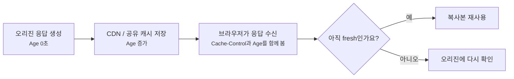
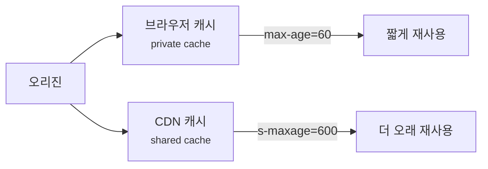
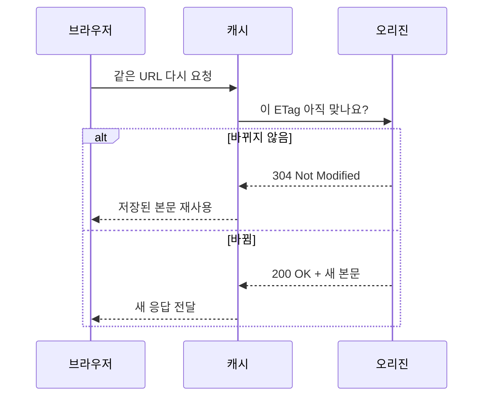
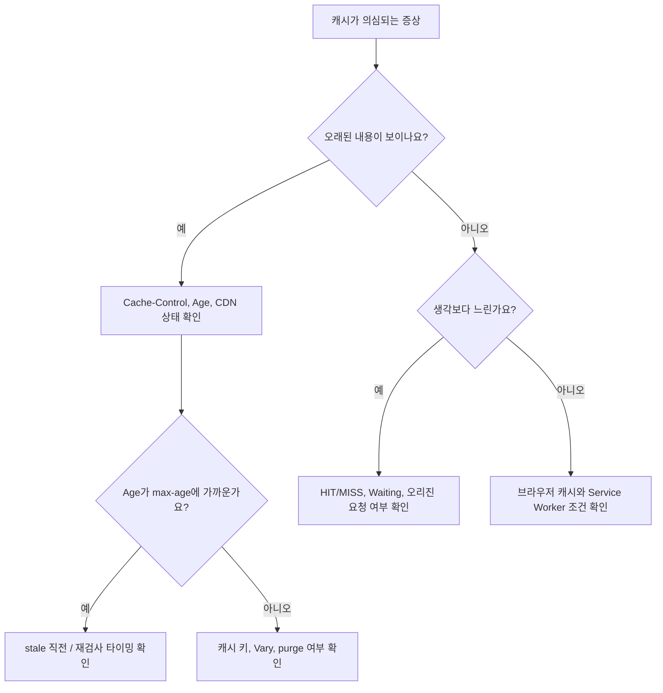

# Cache-Control과 Age 헤더는 어떻게 같이 읽어야 할까요?

> 응답에 `max-age=3600`이 있으면 앞으로 1시간 동안 무조건 새것처럼 보일까요? **사실은 중간 캐시가 이미 얼마 동안 들고 있었는지도 같이 봐야 해요.**

[CDN, Cache, 그리고 Edge Delivery](../basic/25-cdn-cache-and-edge-delivery.md){ data-preview }에서는 사용자 가까이에 복사본을 두면 오리진까지 매번 가지 않아도 된다는 큰 그림을 봤어요. 그리고 [브라우저 waterfall](./reading-browser-waterfall.md){ data-preview }에서는 같은 요청이라도 캐시에서 끝난 것과 네트워크로 나간 것이 다르게 보일 수 있다는 감각을 잡았죠.

이번에는 그 복사본이 **아직 믿고 써도 되는지**를 응답 헤더에서 읽어볼게요.

실제 운영 중에는 이런 장면을 자주 만나요.

```http
HTTP/2 200
cache-control: public, max-age=3600
age: 1240
content-type: text/css
```

처음 보면 `max-age=3600`만 눈에 들어와요.

> *"아, 1시간 캐시구나."*

맞아요. 그런데 여기서 끝내면 반쪽만 읽은 거예요. `Age: 1240`은 이 응답이 공유 캐시 안에서 이미 1240초 정도 나이를 먹었다는 힌트거든요. 오늘의 질문은 이거예요.

> *"이 응답은 지금 새 원본일까요, 아직 신선한 복사본일까요, 아니면 곧 다시 확인해야 할 사본일까요?"*

HTTP 캐시의 기준 동작은 [RFC 9111: HTTP Caching](https://www.rfc-editor.org/info/rfc9111/)에 정리돼 있어요. 이 글에서는 표준 용어를 바닥에 두되, 브라우저와 CDN 앞에서 어떤 순서로 헤더를 읽으면 덜 헷갈리는지에 집중할게요.

!!! note "이 글의 범위"
    여기서는 `Cache-Control`과 `Age`를 중심으로 **fresh**, **stale**, **shared cache**, **private cache**, **revalidation** 감각을 잡아요. `ETag`, `Last-Modified`, `If-None-Match`처럼 다시 확인하는 조건부 요청은 다음 글에서 더 자세히 열어볼게요.

---

## 빵집 진열대에도 만든 시간과 판매 가능 시간이 같이 붙어 있어요

동네 빵집에서 빵을 산다고 해볼게요.

- 빵에는 **만든 시간**이 있어요.
- 진열대에는 **오늘 안에 판매 가능** 같은 규칙이 있어요.
- 손님은 빵이 막 나왔는지, 몇 시간 지났는지 같이 봐요.
- 같은 빵이라도 냉장 진열대와 카운터 진열대의 규칙이 다를 수 있어요.

웹 캐시도 비슷해요.

| 빵집 장면 | HTTP 캐시 장면 |
|---|---|
| 만든 지 몇 시간이 지났는지 | `Age` |
| 몇 시간까지 팔아도 되는지 | `max-age` |
| 냉장 진열대용 별도 규칙 | `s-maxage` |
| 팔기 전에 다시 확인해야 함 | `no-cache` |
| 아예 진열대에 두면 안 됨 | `no-store` |
| 내 집 냉장고에는 둬도 됨 | `private` |
| 모두가 쓰는 진열대에도 둬도 됨 | `public` |
| 판매 가능 시간이 지난 빵 | stale response |

핵심은 `Cache-Control`이 **얼마나 오래 믿어도 되는지**를 말하고, `Age`가 **이미 얼마나 오래 캐시에 있었는지**를 말한다는 점이에요.



이 그림에서 `max-age`는 전체 유효 시간표이고, `Age`는 그 시간표에서 이미 지나간 시간이에요. 그래서 둘을 따로 읽으면 캐시 상태를 오해하기 쉬워요.

## 먼저 Cache-Control을 큰 방향으로 읽어요

`Cache-Control`은 하나의 값처럼 보이지만, 안쪽에는 여러 directive가 쉼표로 붙어요.

```http
Cache-Control: public, max-age=3600, s-maxage=86400
```

처음에는 아래 순서로 읽으면 좋아요.

| 먼저 볼 질문 | 관련 directive | 읽는 감각 |
|---|---|---|
| 저장해도 되나요? | `no-store`, `private`, `public` | 캐시에 둘 수 있는 응답인지 |
| 저장한다면 얼마나 fresh인가요? | `max-age`, `s-maxage` | 몇 초 동안 다시 확인 없이 쓸 수 있는지 |
| stale이 되면 어떻게 하나요? | `no-cache`, `must-revalidate` | 쓰기 전에 다시 확인해야 하는지 |
| 어떤 캐시에 적용되나요? | `s-maxage`, `private` | 브라우저 캐시인지, CDN 같은 공유 캐시인지 |

여기서 **fresh**는 "캐시가 아직 새것으로 취급해도 되는 상태"예요. 반대로 **stale**은 "저장된 사본은 있지만, 그대로 쓰기 전에 다시 확인해야 할 수 있는 상태"예요.

!!! tip "처음엔 세 단어로 나눠보세요"
    `Cache-Control`을 보면 먼저 **저장 가능 여부**, **fresh 시간**, **다시 확인 필요 여부**로 나눠 읽으면 좋아요. directive 이름을 외우는 것보다 이 세 질문이 먼저예요.

## max-age는 "지금부터"가 아니라 "응답이 만들어진 뒤부터"예요

많이 헷갈리는 지점이 여기예요.

```http
Cache-Control: public, max-age=3600
Age: 1200
```

이걸 브라우저가 받았다면, 단순히 "이제부터 3600초 동안 새것"이라고 읽으면 안 돼요. 공유 캐시가 이미 1200초 동안 들고 있었으니, 남은 freshness는 대략 2400초로 봐야 해요.

```mermaid
gantt
    title max-age와 Age를 같이 읽는 시간표
    dateFormat X
    axisFormat %s초
    section Fresh lifetime
    max-age 3600초 :0, 3600
    section 이미 지난 시간
    Age 1200초 :0, 1200
    section 남은 fresh 시간
    재사용 가능한 시간 :1200, 3600
```



이 예시는 계산 감각을 보여주기 위한 단순화예요. 실제 캐시는 응답의 `Date`, 로컬 시계, 전송 지연, 저장 시간 같은 값을 함께 써서 현재 나이를 계산할 수 있어요. 그래서 **`max-age`에서 `Age`를 빼는 값은 운영자가 남은 freshness를 빠르게 가늠하는 근사치이지, 캐시의 정확한 시간 회계를 그대로 재현한 값은 아니에요.**

| 헤더 | 처음 읽기 |
|---|---|
| `Cache-Control: max-age=3600` | 최대 3600초 동안 fresh로 볼 수 있어요 |
| `Age: 0` | 막 저장됐거나 나이가 거의 없어요 |
| `Age: 1200` | 이미 20분 정도 캐시 안에 있었어요 |
| `Age: 3590` | 곧 stale이 될 수 있어요 |
| `Age: 3700` | freshness lifetime을 넘겼을 가능성이 커요 |

!!! warning "`max-age=3600`만 보고 '방금 받은 새 응답'이라고 단정하지 마세요"
    공유 캐시를 거쳐 온 응답이라면 `Age`가 이미 커져 있을 수 있어요. 응답이 빠르게 왔다는 사실과 응답이 새 원본이라는 사실은 달라요.

## s-maxage는 공유 캐시에 따로 주는 시간표예요

이번에는 이런 응답을 볼게요.

```http
Cache-Control: public, max-age=60, s-maxage=600
Age: 120
```

여기서 `s-maxage`의 `s`는 shared cache 쪽으로 보면 좋아요. CDN, 프록시처럼 여러 사용자가 함께 쓰는 캐시가 `s-maxage`를 이해하면, 공유 캐시에서는 `max-age`보다 `s-maxage`가 우선이에요.

| 보는 위치 | 적용 감각 |
|---|---|
| 브라우저 같은 private cache | `max-age=60` 중심으로 봐요 |
| CDN 같은 shared cache | `s-maxage=600` 중심으로 봐요 |
| `Age: 120` | 공유 캐시 안에서는 아직 480초 정도 fresh일 수 있어요 |

이런 설정은 꽤 현실적이에요. 브라우저에는 짧게 저장하게 하고, CDN에는 조금 더 오래 들고 있게 해서 오리진 부담을 줄이고 싶을 수 있거든요.



이 그림은 같은 응답이라도 **어느 캐시가 읽느냐에 따라 시간표가 달라질 수 있다**는 점을 보여줘요. 그래서 브라우저 Network 탭만 보고 CDN의 판단까지 단정하면 안 돼요.

## no-cache는 "저장 금지"가 아니에요

이름 때문에 가장 많이 헷갈리는 directive가 `no-cache`예요.

```http
Cache-Control: no-cache
```

이름만 보면 "캐시하지 마세요"처럼 보이죠. 그런데 HTTP 캐시 문맥에서 `no-cache`는 보통 **저장은 할 수 있지만, 재사용하기 전에는 반드시 다시 확인해야 한다**는 뜻으로 읽어야 해요.

| directive | 저장 가능성 | 재사용 조건 |
|---|---|---|
| `no-cache` | 저장할 수 있어요 | 쓰기 전에 오리진에 재검사해야 해요 |
| `no-store` | 저장하면 안 돼요 | 저장 자체를 피해야 해요 |
| `max-age=0` | 사실상 바로 stale로 봐요 | 대개 재검사 흐름으로 이어져요 |

그래서 개인정보, 결제 화면, 민감한 API 응답에서는 `no-cache`만 보고 안심하면 부족할 수 있어요. 정말 저장 자체를 피해야 한다면 `no-store`가 필요한 장면이 많아요.

!!! warning "`no-cache`를 '아무 데도 저장하지 않는다'로 번역하면 위험해요"
    `no-cache`는 캐시에 저장된 사본을 쓰기 전에 다시 확인하라는 쪽에 가까워요. 민감한 응답을 디스크나 공유 캐시에 남기면 안 되는 요구라면 `no-store`까지 별도로 봐야 해요.

## public과 private은 누가 써도 되는 사본인지 가르는 힌트예요

캐시에는 크게 두 감각이 있어요.

- **private cache**: 한 사용자만 쓰는 브라우저 캐시 같은 곳
- **shared cache**: 여러 사용자가 함께 거치는 CDN, 프록시 같은 곳

이 차이는 로그인 응답에서 특히 중요해요.

```http
Cache-Control: private, max-age=300
```

이건 브라우저처럼 한 사용자에게 묶인 캐시에는 저장해도 되지만, CDN 같은 공유 캐시가 여러 사용자에게 재사용하면 안 되는 응답이라는 힌트예요.

반대로 이런 응답은 여러 사용자가 같은 사본을 봐도 되는 정적 파일에서 자주 봐요.

```http
Cache-Control: public, max-age=31536000, immutable
```

파일명에 해시가 붙은 CSS나 JavaScript라면, 내용이 바뀔 때 URL 자체가 바뀌도록 만들 수 있어요.

```text
/assets/app.8f31c2.css
/assets/app.a901bd.css
```

이런 구조에서는 오래 캐시해도 안전해져요. 같은 URL의 내용을 바꾸는 대신, 새 내용은 새 URL로 배포하기 때문이에요.

| 응답 종류 | 어울리는 캐시 감각 |
|---|---|
| 해시가 붙은 정적 파일 | `public`, 긴 `max-age`, `immutable` |
| 로그인한 사용자 페이지 | `private` 또는 저장 제한 |
| 결제/개인정보 응답 | `no-store` 검토 |
| 자주 바뀌는 HTML | 짧은 `max-age`, 재검사, CDN 정책 검토 |
| 공용 API 응답 | `public` 가능 여부와 `Vary` 조건 확인 |

여기서 `Vary`는 다음 글에서 더 크게 볼 주제예요. 같은 URL이라도 요청 헤더가 다르면 다른 사본으로 봐야 할 수 있거든요.

## 브라우저 Network 탭에서는 이렇게 좁혀봐요

브라우저에서 캐시가 의심될 때는 응답 헤더만 보지 말고, 요청 행의 상태와 크기도 같이 봐요.

```text
Name              Status   Size                    Time
app.css           200      (memory cache)           0 ms
logo.svg          200      (disk cache)             1 ms
/api/products     200      4.2 KB                   86 ms
document          200      18.5 KB                  420 ms
```

그리고 응답 헤더에서 아래 신호를 같이 봐요.

| 신호 | 먼저 묻는 질문 |
|---|---|
| `Cache-Control` | 저장 가능하고, 얼마 동안 fresh인가요? |
| `Age` | 공유 캐시 안에서 이미 얼마나 지났나요? |
| `Date` | 응답이 만들어졌거나 기록된 기준 시각은 언제인가요? |
| `Expires` | 예전 방식의 만료 시각 힌트가 있나요? |
| `ETag` / `Last-Modified` | stale일 때 다시 확인할 단서가 있나요? |
| CDN 상태 헤더 | HIT, MISS, BYPASS 같은 벤더 힌트가 있나요? |
| `Vary` | 어떤 요청 헤더 차이까지 캐시 키에 들어가나요? |

!!! note "CDN 상태 헤더 이름은 제품마다 달라요"
    어떤 서비스는 `cf-cache-status`, 어떤 서비스는 `x-cache`, `x-cache-status`, `cdn-cache-control` 같은 다른 이름을 쓸 수 있어요. 이름보다 **HIT인지 MISS인지, BYPASS인지, Age와 서로 말이 맞는지**를 먼저 보세요.

## 예시로 세 응답을 같이 읽어볼게요

### 1. 아직 신선한 정적 파일

```http
HTTP/2 200
cache-control: public, max-age=31536000, immutable
age: 86400
content-type: text/css
```

이 응답은 `Age`가 하루나 됐지만, `max-age`가 1년이라면 아직 fresh로 볼 수 있어요. 해시 파일명까지 붙어 있다면 꽤 자연스러운 설정이에요.

읽는 순서는 이래요.

| 질문 | 답 |
|---|---|
| 저장해도 되나요? | `public`이라 공유 캐시도 가능해 보여요 |
| 얼마나 fresh인가요? | `max-age=31536000` |
| 이미 얼마나 지났나요? | `Age: 86400` |
| 위험한가요? | URL 버전 관리가 되어 있다면 보통 괜찮아요 |

### 2. 곧 다시 확인해야 할 HTML

```http
HTTP/2 200
cache-control: public, max-age=300
age: 295
content-type: text/html
```

이 응답은 아직 fresh일 수 있지만 거의 끝에 가까워요. 몇 초 뒤 같은 요청은 stale로 판단되어 재검사나 새 요청으로 이어질 수 있어요.

이럴 때 어떤 사용자는 빠르게 응답받고, 바로 다음 사용자는 오리진 확인 때문에 조금 느려질 수 있어요. 그래서 캐시가 얽힌 성능 문제는 "방금 내 요청" 하나만 보면 흔들릴 수 있어요.

### 3. 저장은 되지만 매번 확인해야 하는 응답

```http
HTTP/2 200
cache-control: no-cache
etag: "profile-v42"
content-type: application/json
```

이건 저장 자체가 완전히 금지된 응답이 아니에요. 대신 다음에 재사용하려면 `ETag` 같은 validator로 "이 사본 그대로 써도 되나요?"를 다시 물어봐야 해요.



이 흐름에서 캐시는 본문을 다시 내려받지 않을 수 있지만, 오리진 확인 자체는 필요해요. 그래서 `no-cache` 응답은 "항상 네트워크 비용 0"이 아니에요.

## 잘못 읽기 쉬운 함정

### `Age`가 있으면 무조건 CDN HIT라고 보기

`Age`는 공유 캐시를 거친 힌트가 될 수 있지만, 제품별 헤더와 로그를 같이 봐야 해요. CDN이 `Age`를 갱신하는 방식, 중간 프록시, 브라우저 캐시 표시가 섞일 수 있어요. 가능하면 CDN 상태 헤더와 함께 읽으세요.

### `Age`가 없으면 캐시가 안 됐다고 단정하기

브라우저 메모리 캐시나 디스크 캐시는 Network 탭에 `(memory cache)`, `(disk cache)`처럼 보일 수 있고, 응답 헤더에 항상 기대한 형태의 `Age`가 남지는 않을 수 있어요. 공유 캐시와 브라우저 캐시는 관측 신호가 달라요.

### `no-cache`와 `no-store`를 같은 뜻으로 보기

둘은 달라요. `no-cache`는 재사용 전 재검사, `no-store`는 저장 금지에 가까워요. 민감한 응답에서는 이 차이가 보안과 개인정보 노출로 이어질 수 있어요.

### 긴 `max-age`를 HTML에 아무 생각 없이 붙이기

해시가 붙은 정적 파일은 긴 캐시가 잘 맞지만, HTML은 배포와 라우팅의 시작점일 때가 많아요. HTML을 너무 오래 공유 캐시에 두면 새 JavaScript 파일 경로나 새 설정이 늦게 퍼질 수 있어요.

### `public`이면 모든 응답이 안전하다고 보기

`public`은 공유 캐시에 저장될 수 있다는 강한 힌트예요. 사용자별 내용, 쿠키 영향, 인증 헤더, `Vary` 조건을 제대로 보지 않으면 다른 사람에게 보여주면 안 되는 응답이 재사용될 수 있어요.

## 장애나 이상 증상을 만나면 이렇게 좁혀봐요



실전에서는 아래 질문을 남기면 좋아요.

| 질문 | 답을 찾을 곳 |
|---|---|
| 이 응답은 공유 캐시에 저장돼도 되나요? | `Cache-Control`, 인증/쿠키 조건 |
| 남은 freshness는 어느 정도인가요? | `max-age`, `s-maxage`, `Age` |
| 브라우저 캐시인가요, CDN 캐시인가요? | Size 열, CDN 상태 헤더, `Age` |
| stale이 되면 다시 확인하나요? | `no-cache`, `must-revalidate`, validator |
| 같은 URL이어도 요청 조건이 다른가요? | `Vary`, 쿠키, Accept-Encoding, 언어 헤더 |
| 배포 직후 오래된 파일이 남았나요? | purge/invalidation 기록, 파일명 해시 |

## 자, 정리해볼까요?

!!! abstract "오늘 우리가 배운 것"
    - `Cache-Control`은 캐시가 응답을 **저장해도 되는지**, **얼마나 fresh로 볼지**, **언제 다시 확인할지**를 알려줘요.
    - `Age`는 공유 캐시 안에서 응답이 이미 얼마나 오래 있었는지 보여주는 중요한 힌트예요.
    - `max-age=3600`은 "브라우저가 지금 받은 순간부터 3600초"가 아니라, 응답 freshness lifetime을 말해요. 중간 캐시의 `Age`를 같이 봐야 해요.
    - `s-maxage`는 CDN 같은 shared cache에서 `max-age`보다 우선할 수 있어요.
    - `no-cache`는 저장 금지가 아니라 재사용 전 재검사에 가깝고, `no-store`는 저장 자체를 피해야 하는 장면에 가까워요.
    - 정적 파일, HTML, 로그인 응답, API 응답은 캐시 전략을 다르게 읽어야 해요.

## 이어서 보면 좋은 글

- [CDN, Cache, 그리고 Edge Delivery](../basic/25-cdn-cache-and-edge-delivery.md){ data-preview } — 캐시 히트와 미스, 오리진과 엣지의 큰 그림으로 잠깐 돌아가고 싶을 때 좋아요.
- [브라우저 waterfall은 어디부터 읽어야 할까요?](./reading-browser-waterfall.md){ data-preview } — 캐시된 요청과 네트워크 요청이 페이지 로딩 시간표에서 어떻게 보이는지 같이 읽을 수 있어요.
- [HTTP/1.1 메시지는 왜 빈 줄 하나가 중요할까요?](./http1-message-grammar.md){ data-preview } — 응답 시작 줄, 헤더, 본문 경계를 더 기본 구조부터 보고 싶을 때 좋아요.

## 이어서 볼 질문

다음에는 같은 URL처럼 보여도 왜 캐시가 서로 다른 사본을 만들 수 있는지, `Vary`와 캐시 키를 중심으로 이어서 볼 수 있어요.
