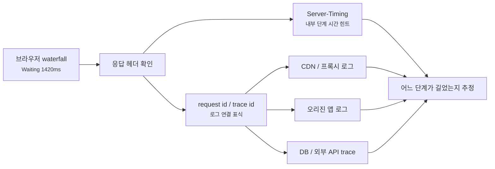
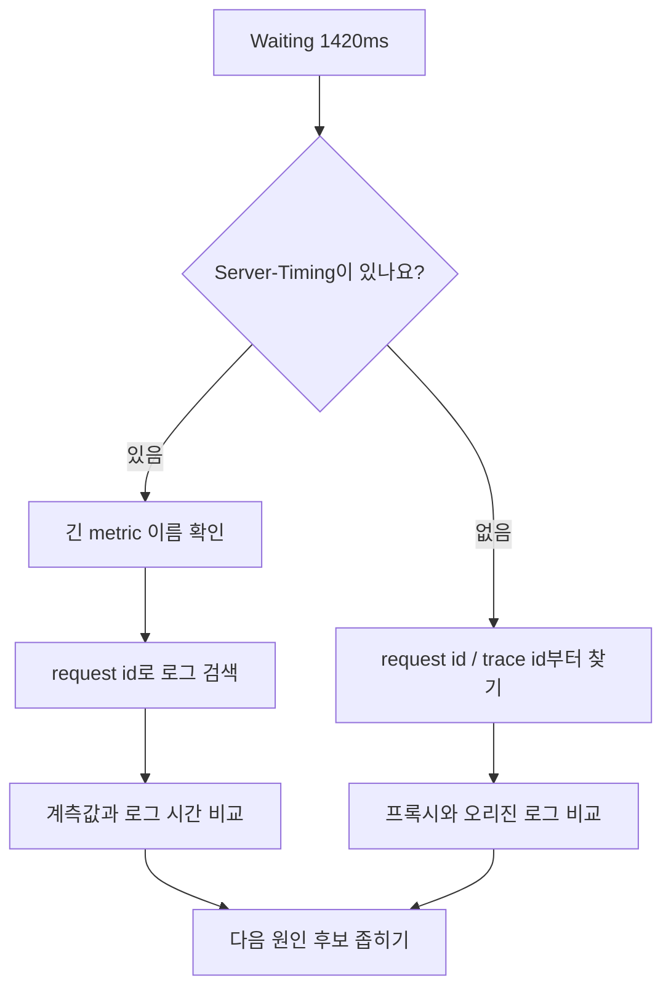
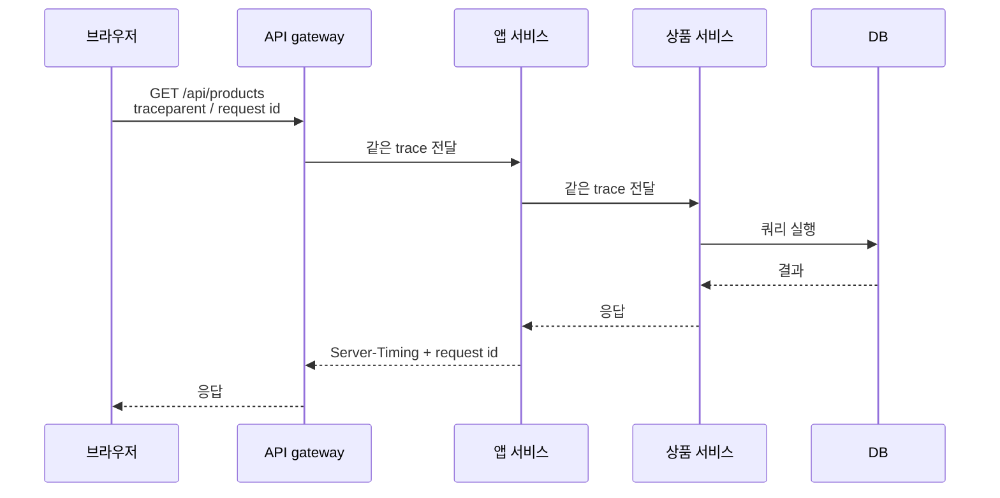
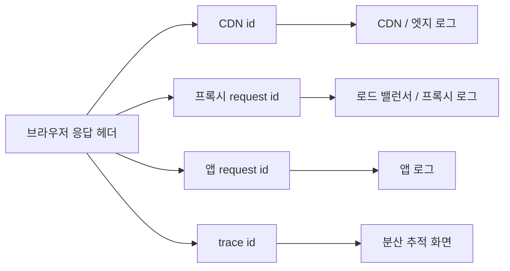

# Server-Timing과 Request ID는 왜 같이 봐야 할까요?

> 브라우저는 첫 바이트를 오래 기다렸다는 사실은 잘 보여줘요. 하지만 **그 안에서 누가 시간을 썼는지는 다른 단서와 이어 붙여야 보여요.**

[End-to-End Request Debugging](../basic/26-end-to-end-request-debugging.md){ data-preview }에서는 느린 요청 하나를 DNS, 연결, TLS, 프록시, 캐시, 오리진으로 나눠 읽는 큰 그림을 봤어요. 그리고 [TTFB와 Content Download](./ttfb-vs-content-download.md){ data-preview }에서는 전체 요청 시간을 첫 바이트 전과 첫 바이트 뒤로 나눠 읽었죠.

근데요, 실제로 가장 답답한 순간은 여기예요.

```text
Request sent                   2 ms
Waiting for server response 1420 ms
Content Download              26 ms
```

이제 첫 바이트가 늦다는 건 알겠어요. 하지만 바로 다음 질문이 생겨요.

> *"그럼 이 1420ms는 앱 서버가 쓴 시간인가요, CDN이 기다린 시간인가요, DB가 느린 시간인가요?"*

브라우저 waterfall만으로는 여기서 멈추기 쉬워요. 그래서 오늘은 `Waiting`이라는 큰 상자 안을 조금 더 열어보는 단서 두 가지를 같이 볼게요.

- `Server-Timing`: 서버나 중간 계층이 응답 헤더로 남긴 시간 힌트
- request id / trace id: 브라우저의 요청 한 줄을 서버 로그와 이어 붙이는 표식

!!! note "이 글의 범위"
    여기서는 관측 도구를 구축하는 법보다, 이미 보이는 응답 헤더와 로그 표식을 **어떤 순서로 읽어야 하는지**에 집중해요. `Server-Timing`은 친절한 힌트이고, request id는 같은 요청을 찾는 열쇠예요. 둘 다 원인 자체는 아니에요.

---

## 배달 기사 위치와 주문 번호는 서로 다른 단서예요

음식 배달 앱을 떠올려볼게요.

앱에는 이런 정보가 보일 수 있어요.

- 조리 시작
- 조리 완료
- 배달 출발
- 예상 도착 시간
- 주문 번호

여기서 **조리 시작, 배달 출발** 같은 정보는 진행 단계 힌트예요. 어느 구간에서 시간이 쓰였는지 대충 감을 줘요.

반면 **주문 번호**는 시간 자체를 알려주지는 않아요. 대신 가게, 배달 대행, 고객센터가 같은 주문을 찾게 해줘요.

웹 요청에서도 비슷해요.

| 배달 장면 | 웹 요청 장면 |
|---|---|
| 조리 `320ms`, 포장 `40ms` 같은 단계 힌트 | `Server-Timing: app;dur=320, db;dur=40` |
| 주문 번호 | request id |
| 배달 추적 번호 | trace id |
| 가게 내부 주문표 | 오리진 access log / application log |
| 고객 앱의 총 대기 시간 | 브라우저 waterfall의 `Waiting` |

그래서 `Server-Timing`과 request id는 역할이 달라요.

- `Server-Timing`은 **응답이 알려주는 내부 시간 힌트**예요.
- request id는 **같은 요청을 로그에서 찾기 위한 연결 표식**이에요.

둘을 같이 보면, 브라우저에서 본 긴 `Waiting`을 서버 안쪽 기록과 이어 붙일 수 있어요.



이 그림에서 중요한 건 브라우저의 긴 막대가 곧바로 하나의 원인으로 바뀌지 않는다는 점이에요. 헤더와 로그를 연결해야 **어느 구간이 진짜 길었는지**가 보이기 시작해요.

## Server-Timing은 응답 헤더로 오는 시간 힌트예요

`Server-Timing`은 서버가 사용자 에이전트에 요청-응답 처리와 관련된 성능 지표를 전달하기 위한 HTTP 응답 헤더예요. [W3C Server Timing](https://www.w3.org/TR/server-timing/) 명세는 이 헤더를 여러 metric의 목록으로 정의하고, 각 metric에는 이름과 선택적인 `dur`, `desc` 같은 매개변수를 붙일 수 있게 해요.

예를 들면 이런 응답이 있을 수 있어요.

```http
HTTP/2 200
content-type: application/json
server-timing: cdn-cache;desc="MISS", edge;dur=32, app;dur=284, db;dur=91
x-request-id: req_8f3c7a2b
```

처음에는 이렇게 읽으면 돼요.

| 조각 | 읽는 감각 |
|---|---|
| `cdn-cache;desc="MISS"` | CDN 캐시 결과를 설명 문자열로 남겼어요 |
| `edge;dur=32` | 엣지나 앞단에서 측정한 어떤 구간이 약 32ms였어요 |
| `app;dur=284` | 앱이 이름 붙인 구간이 약 284ms였어요 |
| `db;dur=91` | DB 관련 구간이 약 91ms였어요 |
| `x-request-id: req_8f3c7a2b` | 로그에서 같은 요청을 찾을 표식이에요 |

!!! warning "`dur` 이름만 보고 보편적인 뜻이라고 단정하지 마세요"
    `app`, `db`, `edge` 같은 metric 이름은 서비스가 붙인 이름이에요. 어느 시점부터 어느 시점까지 잰 값인지는 그 서비스를 만든 쪽의 계측 방식에 달려 있어요. `db;dur=91`이 모든 DB 시간을 완벽히 합친 값이라고 단정하면 안 돼요.

## 브라우저에서는 Waiting 안쪽 힌트로 봐요

브라우저가 보는 `Waiting for server response`는 첫 바이트가 올 때까지의 바깥쪽 대기 시간이에요. 그 안에는 CDN, 프록시, 오리진 연결, 앱 처리, DB, 외부 API가 섞일 수 있어요.

`Server-Timing`이 있으면 이 큰 상자 안에 이름표가 조금 붙어요.

```text
Timing:
Request sent                   2 ms
Waiting for server response 1420 ms
Content Download              26 ms

Response headers:
server-timing: cdn-cache;desc="MISS", app;dur=1180, db;dur=740
x-request-id: req_8f3c7a2b
```

이 화면에서는 바로 이런 식으로 좁혀볼 수 있어요.

| 보이는 신호 | 처음 읽기 |
|---|---|
| `Waiting`이 `1420 ms` | 첫 바이트 전이 길어요 |
| `Content Download`가 `26 ms` | 본문 전송은 짧아요 |
| `cdn-cache;desc="MISS"` | 캐시에서 바로 끝나지 않았을 수 있어요 |
| `app;dur=1180` | 앱 쪽 계측 구간이 길어요 |
| `db;dur=740` | 앱 시간 안쪽의 DB 구간이 길 수 있어요 |
| `x-request-id` | 이제 서버 로그에서 같은 요청을 찾을 수 있어요 |

그렇다고 `db;dur=740`만 보고 바로 "DB가 전부 원인"이라고 끝내면 안 돼요. 그래도 훨씬 좋은 출발점이 생겼어요. 이제 로그에서 `req_8f3c7a2b`를 찾아서 실제 앱 처리 시간, 쿼리 시간, 외부 API 대기, 에러 여부를 확인할 수 있으니까요.



핵심은 `Server-Timing`을 마지막 결론이 아니라 **로그를 어디부터 볼지 정하는 안내판**으로 쓰는 거예요.

## request id는 같은 요청을 찾는 표식이에요

이번에는 `Server-Timing`이 거의 없고 request id만 있는 응답을 볼게요.

```http
HTTP/2 200
content-type: application/json
x-request-id: req_8f3c7a2b
```

이 헤더는 시간 값을 직접 알려주지 않아요. 하지만 운영에서는 아주 중요해요. 같은 요청을 여러 로그 사이에서 이어 붙일 수 있기 때문이에요.

예를 들어 브라우저에서 본 요청이 이랬다고 해볼게요.

```text
GET /api/products
Status: 200
Waiting: 1420 ms
Response header:
  x-request-id: req_8f3c7a2b
```

오리진 access log에서는 이렇게 찾을 수 있어요.

```text
2026-06-22T10:15:04.192Z req_8f3c7a2b GET /api/products 200 1198ms upstream=products-a
```

애플리케이션 로그에는 더 안쪽 기록이 있을 수 있고요.

```text
2026-06-22T10:15:03.011Z req_8f3c7a2b handler=start route=/api/products
2026-06-22T10:15:03.094Z req_8f3c7a2b db=query name=list_products duration=812ms
2026-06-22T10:15:04.190Z req_8f3c7a2b handler=end status=200 duration=1179ms
```

이제 브라우저의 `Waiting 1420ms`와 앱 로그의 `duration=1179ms`를 같이 볼 수 있어요. 약간의 차이는 앞단, 네트워크, 계측 시작점 차이로 남을 수 있지만, 적어도 "앱 안쪽에서도 꽤 오래 걸렸다"는 방향은 잡히죠.

반대로 이런 로그라면 이야기가 달라져요.

```text
2026-06-22T10:15:04.181Z req_8f3c7a2b GET /api/products 200 38ms upstream=products-a
```

브라우저는 `Waiting 1420ms`인데 오리진 앱은 `38ms`라면, 앱 함수 자체보다 앞단 queue, CDN과 오리진 사이, connection pool, 프록시 대기, 로그에 찍히기 전 구간을 봐야 해요.

| 브라우저와 로그 비교 | 먼저 의심할 방향 |
|---|---|
| 브라우저 `Waiting`도 길고 앱 처리도 김 | 앱, DB, 외부 API, 렌더링 |
| 브라우저 `Waiting`은 긴데 앱 처리는 짧음 | CDN, 프록시, upstream 연결, queue |
| 브라우저는 504인데 앱 로그가 없음 | 앞단 timeout, 라우팅 실패, 오리진 도달 전 실패 |
| 앱 로그는 200인데 브라우저는 502/504 | 같은 request id인지, 중간 계층이 다른 응답을 만들었는지 확인 |

request id는 답을 주는 값이 아니라, **같은 요청을 보고 있는지 확인하는 안전장치**예요.

## trace id는 여러 서비스를 지나갈 때 더 중요해져요

request id는 서비스마다 관습이 달라요. `X-Request-ID`, `X-Correlation-ID`, `CF-Ray`, `X-Amzn-Trace-Id`처럼 이름도 다양하고, 어떤 것은 특정 벤더나 프록시가 붙이는 값이에요.

분산 추적에서는 표준화된 문맥 전달도 많이 써요. [W3C Trace Context](https://www.w3.org/TR/trace-context/)는 `traceparent` 헤더를 정의하고, 그 값이 `version`, `trace-id`, `parent-id`, `trace-flags` 네 부분으로 구성된다고 설명해요.

예시는 이런 모양이에요.

```http
traceparent: 00-4bf92f3577b34da6a3ce929d0e0e4736-00f067aa0ba902b7-01
tracestate: vendor=opaque-value
```

처음부터 이 값을 직접 해석하려고 애쓸 필요는 없어요. 초심자에게 중요한 감각은 이거예요.

| 값 | 역할 |
|---|---|
| request id | 보통 한 서비스나 한 경계에서 같은 요청을 찾는 표식 |
| trace id | 여러 서비스와 span을 하나의 흐름으로 묶는 표식 |
| span id / parent id | 그 흐름 안에서 각 작업 조각의 부모-자식 관계를 나타내는 표식 |
| `tracestate` | 벤더별 추적 정보를 같이 전달하는 보조 공간 |

서비스가 하나의 앱 서버와 DB 정도라면 request id만으로도 충분히 많은 문제를 좁힐 수 있어요. 하지만 요청이 API gateway, 인증 서비스, 상품 서비스, 재고 서비스, 결제 서비스처럼 여러 서비스를 지나간다면 trace id가 훨씬 중요해져요.



이 흐름에서 request id가 경계마다 새로 만들어지면 로그 연결이 끊겨 보일 수 있어요. trace context가 제대로 전달되면 여러 서비스의 조각이 한 요청의 가족처럼 묶여서 보여요.

## 헤더를 볼 때는 네 가지를 한 묶음으로 봐요

느린 API 응답을 만났다고 해볼게요.

```http
HTTP/2 200
content-type: application/json
cache-control: no-store
server-timing: edge;dur=18, app;dur=970, db;dur=720, ext;dur=110
x-request-id: req_8f3c7a2b
traceparent: 00-4bf92f3577b34da6a3ce929d0e0e4736-00f067aa0ba902b7-01
```

처음에는 아래 순서로 보면 좋아요.

| 순서 | 볼 것 | 묻는 질문 |
|---|---|---|
| 1 | 브라우저 Timing | `Waiting`이 긴가요, `Content Download`가 긴가요? |
| 2 | 캐시 관련 헤더 | CDN이나 브라우저 캐시에서 끝난 요청인가요? |
| 3 | `Server-Timing` | 서버나 앞단이 남긴 긴 metric이 있나요? |
| 4 | request id / trace id | 같은 요청을 로그와 추적 화면에서 찾을 수 있나요? |

이 순서가 중요한 이유는, `Server-Timing`과 request id를 보기 전에 먼저 **이 요청이 어떤 종류로 느린지**를 알아야 하기 때문이에요. 다운로드가 긴 대용량 이미지라면 request id보다 파일 크기와 압축이 먼저일 수 있어요. 하지만 API의 `Waiting`이 길다면 이제 내부 시간 힌트와 로그 연결이 힘을 가져요.

## 계층마다 다른 id가 붙을 수 있어요

현실에서는 응답 헤더에 id가 하나만 있지 않을 때도 많아요.

```http
cf-ray: 8f3c7a2b9d1c2f0a-ICN
x-request-id: req_8f3c7a2b
x-trace-id: 4bf92f3577b34da6a3ce929d0e0e4736
```

이런 값들은 서로 같은 역할이 아닐 수 있어요.

| 헤더 | 먼저 읽는 감각 |
|---|---|
| CDN 벤더 id | CDN 고객지원, 엣지 로그, 지역별 문제 확인에 유용해요 |
| 프록시 request id | 앞단 access log와 upstream 로그를 이어요 |
| 앱 request id | 애플리케이션 로그에서 같은 요청을 찾아요 |
| trace id | 여러 서비스의 span을 하나의 분산 trace로 묶어요 |

그래서 장애를 볼 때는 "request id가 있다"에서 끝내지 말고, **어느 계층의 id인지**를 같이 적어야 해요.



같은 값이 여러 계층에 전달되면 가장 읽기 쉽고, 계층마다 값이 다르면 변환 관계를 알아야 해요. 예를 들어 프록시 로그가 `edge_req_id`와 `upstream_req_id`를 같이 남기면 두 세계를 이어 붙일 수 있어요.

## 잘못 읽기 쉬운 함정

### `Server-Timing` 값을 모두 더해서 TTFB와 맞추기

`Server-Timing`의 metric은 반드시 서로 겹치지 않는 구간이라는 보장이 없어요. `app;dur=300` 안에 `db;dur=120`이 포함될 수도 있고, 어떤 값은 병렬 작업의 일부일 수도 있어요. 그래서 무작정 더해서 `Waiting`과 맞추면 안 돼요.

### `Server-Timing`이 없으면 관측이 불가능하다고 보기

없어도 request id, access log, APM, trace, 프록시 로그로 볼 수 있어요. `Server-Timing`은 브라우저에서 바로 보이는 편한 힌트일 뿐이에요.

### request id를 보안 없이 전부 노출하기

request id 자체는 보통 비밀이 아니도록 설계하는 편이 좋아요. 하지만 내부 호스트명, 사용자 id, 이메일, 세션 정보가 섞인 값을 그대로 응답 헤더에 내보내면 안 돼요. id는 **추적 가능한 난수형 표식**에 가깝게 두는 편이 안전해요.

### 서로 다른 요청의 로그를 비교하기

시간대와 URL만 비슷하다고 같은 요청이라고 보면 위험해요. 재시도, preflight, redirect, 브라우저 자동 요청 때문에 비슷한 요청이 여러 개 생길 수 있어요. 가능하면 request id나 trace id로 묶어야 해요.

### 브라우저에 보이는 시간과 서버 로그 시간을 완전히 같게 기대하기

측정 시작점과 끝점이 달라요. 브라우저는 클라이언트 입장에서 첫 바이트를 기다리고, 서버 로그는 보통 서버가 요청을 받은 뒤 응답을 끝낼 때까지를 기록해요. 두 값은 비슷한 방향을 보여줄 수 있지만 항상 같은 숫자는 아니에요.

## 예시로 같이 읽어볼게요

### 1. 앱 처리 시간이 실제로 긴 경우

```text
Browser:
Waiting for server response 1420 ms
Content Download              24 ms

Response:
server-timing: app;dur=1210, db;dur=830
x-request-id: req_a

App log:
req_a GET /api/products 200 1198ms
req_a db list_products 812ms
```

여기서는 브라우저의 긴 `Waiting`과 앱 로그의 긴 처리 시간이 같은 방향을 가리켜요. 다음에 볼 곳은 DB 쿼리, 인덱스, 외부 API, 앱 렌더링이에요.

### 2. 브라우저는 긴데 앱은 짧은 경우

```text
Browser:
Waiting for server response 1860 ms

Response:
server-timing: edge;dur=1510, app;dur=42
x-request-id: req_b

App log:
req_b GET /api/products 200 39ms
```

여기서는 앱 함수 자체보다 앞단 queue, upstream 연결, connection pool, CDN과 오리진 사이 대기를 봐야 해요. 앱 로그만 보면 "빠른데요?"가 맞지만, 사용자 입장에서는 여전히 느렸어요.

### 3. request id가 여러 번 바뀌는 경우

```text
CDN log:
edge_id=cf_123 path=/api/products status=200 upstream_request_id=proxy_456

Proxy log:
request_id=proxy_456 upstream_app_request_id=req_c duration=900ms

App log:
request_id=req_c route=/api/products duration=760ms
```

이 장면에서는 브라우저에 `cf_123`만 보이면 앱 로그의 `req_c`를 바로 찾기 어려워요. 중간 로그가 id 변환표 역할을 해야 해요.

### 4. `Server-Timing`은 있는데 이름이 애매한 경우

```http
server-timing: total;dur=980, worker;dur=960, sql;dur=40
```

`total`과 `worker`가 거의 같고 `sql`은 짧아요. 이때 `worker`가 무엇을 뜻하는지 모르면 결론을 내리기 어려워요. 큐 대기까지 포함한 worker인지, 함수 실행 시간인지, 프록시가 붙인 이름인지 계측 정의를 확인해야 해요.

## 자, 정리해볼까요?

!!! abstract "오늘 우리가 배운 것"
    - 브라우저의 `Waiting for server response`는 첫 바이트 대기 시간이고, 그 안에는 여러 계층의 시간이 섞일 수 있어요.
    - `Server-Timing`은 서버나 중간 계층이 응답 헤더로 남기는 시간 힌트예요.
    - request id는 시간을 알려주는 값이 아니라, 같은 요청을 로그에서 찾게 해주는 표식이에요.
    - trace id는 여러 서비스와 span을 하나의 흐름으로 묶을 때 더 중요해져요.
    - `Server-Timing` metric은 서로 겹칠 수 있으니 무작정 더해서 TTFB와 맞추면 안 돼요.
    - 느린 요청은 브라우저 Timing, 캐시 헤더, `Server-Timing`, request id, 로그를 한 묶음으로 읽어야 해요.

긴 `Waiting`을 만났을 때 바로 "서버가 느리다"로 끝내지 마세요. **Server-Timing으로 힌트를 보고, request id로 같은 요청을 찾아서, 브라우저와 서버 로그를 이어 붙이는 것**이 다음 단계예요.

## 더 깊이 보고 싶다면

- [W3C Server Timing](https://www.w3.org/TR/server-timing/) — `Server-Timing` 헤더와 `PerformanceServerTiming` 인터페이스의 기본 구조를 볼 수 있어요.
- [W3C Trace Context](https://www.w3.org/TR/trace-context/) — `traceparent`와 `tracestate`가 여러 서비스 사이에서 추적 문맥을 전달하는 방식을 볼 수 있어요.

## 이어서 보면 좋은 글

- [TTFB와 Content Download는 어떻게 다르게 읽을까요?](./ttfb-vs-content-download.md){ data-preview } — `Waiting`과 다운로드 구간을 먼저 나눠 읽는 감각을 다시 볼 수 있어요.
- [브라우저 waterfall은 어디부터 읽어야 할까요?](./reading-browser-waterfall.md){ data-preview } — Network 탭의 Timing 구간을 전체 페이지 흐름 안에서 읽어볼 수 있어요.
- [502, 503, 504는 어디서 만든 응답일까요?](./reading-502-503-504.md){ data-preview } — request id로 앞단 오류와 오리진 로그를 이어 붙이는 장면을 더 볼 수 있어요.
- [Connection reuse, Keep-Alive, Pooling은 왜 같이 봐야 할까요?](./connection-reuse-keepalive-and-pooling.md){ data-preview } — 앱 로그는 짧은데 브라우저 `Waiting`이 길 때 앞단과 오리진 사이 연결을 같이 읽어볼 수 있어요.
