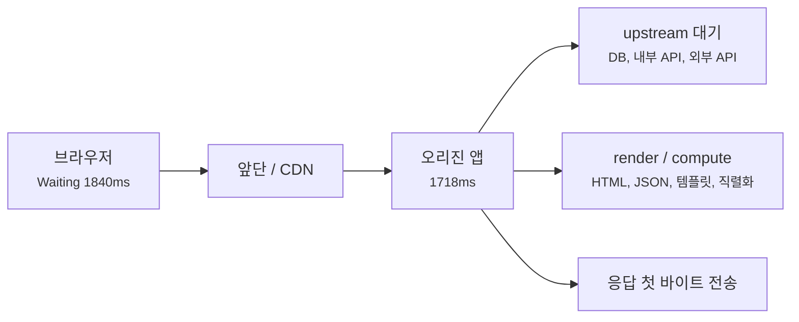
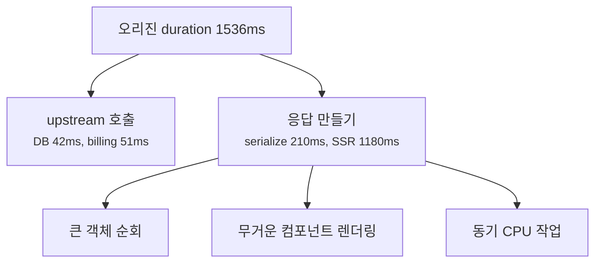
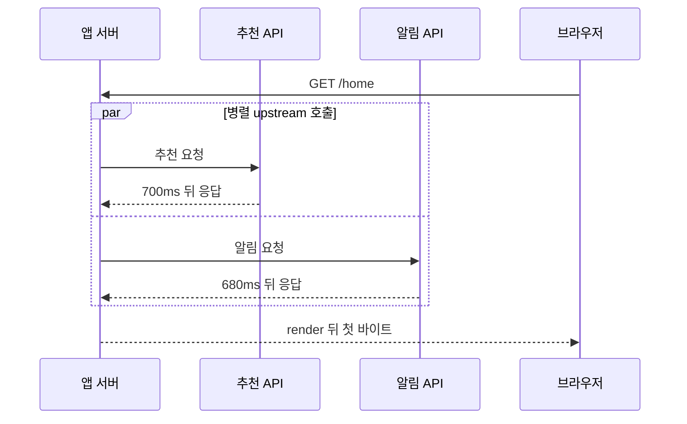

# 느린 upstream과 느린 render는 어떻게 구분할까요?

> 브라우저에서는 둘 다 그냥 `Waiting`으로 보여요. **하지만 서버 안쪽에서는 남을 기다린 시간과 내가 만든 시간이 달라요.**

[End-to-End Request Debugging](../basic/26-end-to-end-request-debugging.md){ data-preview }에서는 느린 요청 하나를 DNS, 연결, TLS, 프록시, 캐시, 오리진으로 나눠 읽었어요. 그리고 [Server-Timing과 Request ID](./server-timing-and-request-id.md){ data-preview }에서는 브라우저의 긴 `Waiting`을 서버가 남긴 시간 힌트와 로그 표식으로 이어 붙이는 방법을 봤죠.

근데요, request id로 오리진 로그까지 찾았는데도 이런 순간이 와요.

```text
Browser:
Waiting for server response 1840 ms
Content Download              31 ms

App log:
req_7d92 GET /product/42 200 1718ms
```

이제 "오리진까지는 왔고, 앱 처리도 길었다"는 건 알겠어요. 그런데 바로 다음 질문이 생겨요.

> *"앱이 오래 계산한 걸까요, 아니면 앱이 다른 서비스를 기다린 걸까요?"*

이 둘은 겉으로 비슷해 보여도 다음 행동이 달라요.

- 상품 API가 늦으면 그 API, 네트워크, timeout, retry를 봐야 해요.
- DB 쿼리가 늦으면 인덱스, 쿼리 계획, lock을 봐야 해요.
- 서버 사이드 렌더링이 늦으면 템플릿, 컴포넌트, 직렬화, 데이터 크기를 봐야 해요.
- CPU가 바쁘면 외부 API를 아무리 봐도 답이 안 나와요.

오늘의 질문은 이거예요.

> *"이 긴 오리진 시간은 남을 기다린 시간일까요, 내가 응답을 만든 시간일까요?"*

!!! note "이 글에서 말하는 upstream"
    `upstream`은 보는 위치에 따라 뜻이 달라질 수 있어요. 프록시 기준에서는 오리진 앱이 upstream이고, 앱 기준에서는 앱이 호출하는 DB, 내부 API, 외부 API가 upstream처럼 불릴 수 있어요. 이 글에서는 **앱 서버가 응답을 만들기 위해 기다리는 뒤쪽 의존성**이라는 뜻으로 좁혀서 볼게요.

---

## 주방이 늦은 건지, 재료가 늦게 온 건지부터 나눠요

식당에서 주문한 음식이 늦게 나왔다고 해볼게요.

손님 입장에서는 그냥 **"음식이 늦다"** 예요. 하지만 주방 안쪽은 다를 수 있어요.

- 요리사는 바로 시작했는데, 재료 배달이 늦었을 수 있어요.
- 재료는 다 있는데, 요리 과정이 오래 걸렸을 수 있어요.
- 재료도 늦고, 요리도 복잡했을 수 있어요.
- 음식은 빨리 나왔는데, 포장이 너무 커서 전달이 오래 걸렸을 수도 있어요.

웹 요청도 비슷해요.

| 식당 장면 | 서버 안쪽 장면 |
|---|---|
| 손님이 음식을 기다림 | 브라우저가 첫 바이트를 기다림 |
| 주방이 재료 배달을 기다림 | 앱이 DB, 내부 API, 외부 API를 기다림 |
| 요리사가 직접 조리함 | 앱이 렌더링, 직렬화, 계산을 수행함 |
| 주문 번호로 주방 기록을 찾음 | request id로 로그와 trace를 찾음 |
| 조리 단계별 시간이 붙음 | `Server-Timing`, span, app log duration |

브라우저 바깥에서는 이 모든 시간이 하나의 `Waiting`으로 합쳐져요. 그래서 오리진 안쪽을 보려면 시간을 한 번 더 쪼개야 해요.



이 그림에서 `upstream 대기`와 `render / compute`가 오늘의 핵심이에요. 둘 다 오리진 시간 안에 들어가지만, 원인과 해결책은 꽤 달라요.

## 먼저 브라우저와 오리진 로그를 같은 요청으로 묶어요

가장 먼저 할 일은 [request id](./server-timing-and-request-id.md){ data-preview }로 같은 요청을 잡는 거예요.

```http
HTTP/2 200
content-type: text/html; charset=utf-8
server-timing: app;dur=1718
x-request-id: req_7d92
```

그리고 서버 로그에서 같은 id를 찾죠.

```text
2026-06-23T09:15:04.220Z req_7d92 route=/product/42 status=200 duration=1718ms
```

처음에는 이렇게 나눠 읽으면 돼요.

| 보이는 신호 | 먼저 읽는 감각 |
|---|---|
| 브라우저 `Waiting 1840ms` | 첫 바이트 전이 길어요 |
| `Content Download 31ms` | 본문 전송은 짧아요 |
| `x-request-id: req_7d92` | 같은 요청을 로그에서 찾을 수 있어요 |
| 앱 로그 `duration=1718ms` | 오리진 안쪽 시간도 실제로 길어요 |
| `server-timing: app;dur=1718` | 브라우저와 앱 로그가 같은 방향을 가리켜요 |

이제 "서버가 느리다"에서 한 칸 더 들어갈 수 있어요. 다음 질문은 **앱이 무엇에 시간을 썼는지**예요.

!!! warning "브라우저 시간과 앱 로그 시간이 완전히 같아야 하는 건 아니에요"
    브라우저는 클라이언트 입장에서 첫 바이트를 기다린 시간을 보고, 앱 로그는 보통 앱이 요청을 받은 뒤 응답을 끝낼 때까지를 봐요. 앞단 대기, 네트워크, 로그 시작점 차이 때문에 숫자는 조금 다를 수 있어요. 방향을 맞춰 읽는 게 먼저예요.

## upstream 대기가 길면 호출 기록이 길게 보여요

이번에는 앱 로그가 조금 더 자세하다고 해볼게요.

```text
req_7d92 route=/product/42 start
req_7d92 db query=product_by_id duration=38ms
req_7d92 http GET http://inventory.internal/stock/42 duration=1120ms status=200
req_7d92 http GET http://reviews.internal/summary/42 duration=360ms status=200
req_7d92 render template=product_page duration=74ms
req_7d92 route=/product/42 status=200 duration=1718ms
```

여기서는 앱이 직접 렌더링한 시간보다, 다른 서비스를 기다린 시간이 훨씬 길어요.

```mermaid
gantt
    title req_7d92 오리진 안쪽 시간 예시
    dateFormat X
    axisFormat %Lms
    section 요청
    route total         :0, 1718
    section upstream
    DB query            :40, 38
    inventory API       :95, 1120
    reviews API         :1225, 360
    section render
    template render     :1595, 74
```



이 예시에서 핵심 신호는 `inventory API 1120ms`예요. 브라우저의 긴 `Waiting`은 앱이 HTML을 열심히 만든 시간이라기보다, 앱이 재고 서비스를 기다린 시간에 가까워요.

upstream 대기를 의심할 때는 이런 신호를 같이 봐요.

| 신호 | 묻는 질문 |
|---|---|
| 외부 HTTP client duration | 어떤 서비스 호출이 긴가요? |
| DB query duration | 쿼리, lock, connection pool 대기가 긴가요? |
| retry 로그 | 한 번 실패하고 다시 시도했나요? |
| timeout 근처 시간 | `1000ms`, `3000ms`, `30s` 같은 설정값에 붙어 끊기나요? |
| upstream status | `200`이지만 느린지, `5xx`나 timeout인지 나눠야 해요 |
| dependency별 p95/p99 | 특정 요청만 긴지, 해당 서비스 전체가 긴지 봐요 |

여기서 중요한 건 `status=200`이어도 느릴 수 있다는 점이에요. 성공 응답이 늦게 오면 사용자는 여전히 기다려요.

## render가 길면 호출보다 만드는 시간이 길게 보여요

반대로 이런 로그도 있을 수 있어요.

```text
req_a91f route=/dashboard start
req_a91f db query=user_summary duration=42ms
req_a91f http GET http://billing.internal/plan duration=51ms status=200
req_a91f serialize json duration=210ms bytes=1842080
req_a91f render react_ssr duration=1180ms
req_a91f route=/dashboard status=200 duration=1536ms
```

여기서는 upstream 호출이 짧아요. 대신 JSON 직렬화와 서버 사이드 렌더링 시간이 길어요.



이 장면에서 외부 API를 먼저 의심하면 길을 잃기 쉬워요. 호출은 짧고, 앱 프로세스가 응답을 만드는 데 시간을 쓰고 있으니까요.

render 또는 compute 쪽을 의심할 때는 이런 신호를 봐요.

| 신호 | 묻는 질문 |
|---|---|
| render duration | 템플릿, SSR, view rendering이 긴가요? |
| serialization duration | JSON으로 바꾸는 시간이 긴가요? |
| response byte size | 만들어야 할 본문이 너무 큰가요? |
| CPU 사용률 | 요청이 느릴 때 CPU가 같이 치솟나요? |
| event loop lag / worker busy | 런타임이 다른 요청까지 막고 있나요? |
| profile / trace | 어떤 함수나 컴포넌트가 시간을 쓰나요? |

!!! tip "render는 HTML만 뜻하지 않아요"
    여기서 render는 화면 HTML을 만드는 일뿐 아니라, API 응답 JSON을 조립하고 직렬화하는 일까지 넓게 볼 수 있어요. 사용자는 화면을 기다리지만, 서버는 그 전에 데이터 모양을 만들고 있을 수 있어요.

## Server-Timing으로 브라우저에 힌트를 남길 수 있어요

서비스가 응답 헤더에 단계별 힌트를 남기면 브라우저에서도 방향이 빨리 잡혀요.

upstream이 긴 경우는 이렇게 보일 수 있어요.

```http
server-timing: app;dur=1718, db;dur=38, inventory;dur=1120, reviews;dur=360, render;dur=74
x-request-id: req_7d92
```

render가 긴 경우는 이렇게 보일 수 있고요.

```http
server-timing: app;dur=1536, db;dur=42, billing;dur=51, serialize;dur=210, render;dur=1180
x-request-id: req_a91f
```

이때는 `app`만 보지 말고 긴 조각을 찾아요.

| 긴 metric | 먼저 의심할 방향 |
|---|---|
| `db` | 쿼리, 인덱스, lock, DB connection pool |
| `inventory`, `billing`, `search` | 내부 API나 외부 API 대기 |
| `render` | 템플릿, SSR, 컴포넌트 렌더링, CPU |
| `serialize` | 큰 JSON, 순환 변환, 불필요한 필드 |
| `queue` | worker 포화, connection pool, 앞단 대기 |

다만 [Server-Timing 글](./server-timing-and-request-id.md){ data-preview }에서 본 것처럼, metric 이름은 서비스가 붙인 이름이에요. `render`가 정확히 어디부터 어디까지인지, `db`가 병렬 쿼리를 어떻게 합친 값인지는 계측 정의를 확인해야 해요.

## 병렬 호출은 합계보다 벽시계 시간을 봐야 해요

upstream 호출이 여러 개 있으면 더 헷갈려요. 특히 병렬로 호출했다면 각각의 duration을 단순히 더하면 안 돼요.

```text
req_p route=/home start
req_p http GET /recommendations duration=700ms
req_p http GET /notifications duration=680ms
req_p render duration=90ms
req_p route=/home status=200 duration=830ms
```

두 호출을 더하면 `1380ms`지만 전체 요청은 `830ms`예요. 두 upstream 호출이 거의 동시에 진행됐기 때문이에요.



그래서 로그를 볼 때는 세 가지를 구분해야 해요.

| 시간 종류 | 뜻 |
|---|---|
| 각 span duration | 작업 조각 하나가 걸린 시간 |
| critical path | 전체 요청을 실제로 늦춘 가장 긴 의존 경로 |
| total route duration | 앱이 요청을 받은 뒤 응답을 끝낼 때까지의 벽시계 시간 |

성능 개선도 critical path를 봐야 효과가 나요. 이미 병렬인 두 호출 중 짧은 쪽을 조금 줄이는 것보다, 가장 긴 호출이나 render 병목을 줄이는 게 더 크게 보일 수 있어요.

## 잘못 읽기 쉬운 함정

### 앱 로그 duration만 보고 render가 느리다고 보기

앱 로그의 전체 duration은 DB, 내부 API, 외부 API, queue, render가 섞인 값이에요. 세부 span 없이 "앱이 1.7초 걸렸으니 render가 느리다"고 단정하면 안 돼요.

### upstream이 느린데 서버 CPU부터 의심하기

외부 호출을 기다리는 동안 서버 CPU는 낮을 수 있어요. 이때 CPU profile만 보면 별일이 없어 보일 수 있어요. HTTP client timing, DB timing, dependency trace를 같이 봐야 해요.

### render가 느린데 외부 API timeout만 늘리기

호출은 짧고 CPU나 직렬화가 긴데 timeout을 늘리면 문제를 가릴 뿐이에요. 응답 크기, 템플릿, 컴포넌트, 객체 변환을 봐야 해요.

### 병렬 span을 모두 더해서 전체 시간과 맞추기

병렬 작업은 시간이 겹쳐요. span 합계가 route duration보다 클 수 있어요. 합계보다 어느 작업이 critical path에 있는지를 봐야 해요.

### `Server-Timing` 이름을 표준 의미처럼 믿기

`render`, `db`, `api` 같은 이름은 팀이 붙인 이름이에요. 같은 이름이라도 서비스마다 측정 범위가 다를 수 있어요.

## 예시로 같이 읽어볼게요

### 1. 느린 upstream API인 경우

```text
Browser:
Waiting for server response 1840 ms

Response:
server-timing: app;dur=1718, inventory;dur=1120, render;dur=74
x-request-id: req_7d92

App log:
req_7d92 inventory GET /stock/42 200 1120ms
req_7d92 route /product/42 200 1718ms
```

여기서는 재고 API 대기가 가장 큰 신호예요. 다음에 볼 곳은 inventory 서비스의 로그, 해당 API의 p95/p99, 재시도, timeout, 네트워크 경로예요.

### 2. 느린 render인 경우

```text
Browser:
Waiting for server response 1610 ms

Response:
server-timing: app;dur=1536, db;dur=42, billing;dur=51, serialize;dur=210, render;dur=1180
x-request-id: req_a91f
```

여기서는 외부 호출보다 응답을 만드는 시간이 길어요. 다음에 볼 곳은 SSR profile, 템플릿 반복, 큰 데이터 구조, JSON 직렬화예요.

### 3. 앱은 짧고 앞단이 긴 경우

```text
Browser:
Waiting for server response 1900 ms

Response:
server-timing: edge;dur=1680, app;dur=58
x-request-id: req_edge

App log:
req_edge route=/api/products status=200 duration=54ms
```

이건 오늘의 upstream/render 구분까지 오기 전 장면이에요. 앱 안쪽이 아니라 앞단 queue, connection pool, upstream connect, CDN과 오리진 사이 대기를 봐야 해요.

### 4. 다운로드가 긴 경우

```text
Browser:
Waiting for server response 120 ms
Content Download            2400 ms
```

첫 바이트 전이 짧기 때문에 upstream이나 render가 주된 병목이 아닐 수 있어요. [TTFB와 Content Download](./ttfb-vs-content-download.md){ data-preview }에서 본 것처럼 본문 크기, 압축, 사용자 네트워크, 스트리밍 여부를 먼저 봐야 해요.

## 자, 정리해볼까요?

!!! abstract "오늘 우리가 배운 것"
    - 브라우저의 긴 `Waiting`은 오리진 안쪽에서 다시 upstream 대기와 render/compute 시간으로 갈라질 수 있어요.
    - upstream 대기가 길면 DB, 내부 API, 외부 API, retry, timeout, dependency별 p95/p99를 봐요.
    - render가 길면 템플릿, SSR, JSON 직렬화, 응답 크기, CPU, event loop lag를 봐요.
    - `Server-Timing`과 request id는 브라우저 요청을 앱 로그와 이어 붙이고, 어느 조각이 긴지 찾는 힌트예요.
    - 병렬 호출은 span duration을 모두 더하지 말고 critical path와 전체 route duration을 같이 봐야 해요.
    - 앱 로그가 짧고 브라우저 `Waiting`이 길면 오리진 안쪽보다 앞단 대기를 먼저 봐야 해요.

느린 요청을 만났을 때 "서버가 느리다"에서 멈추면 너무 넓어요. **남을 기다린 시간인지, 내가 만든 시간인지**를 나누면 다음에 볼 로그와 해결책이 훨씬 선명해져요.

## 이어서 보면 좋은 글

- [Server-Timing과 Request ID는 왜 같이 봐야 할까요?](./server-timing-and-request-id.md){ data-preview } — 브라우저 요청과 서버 로그를 같은 요청으로 묶는 방법을 먼저 볼 수 있어요.
- [TTFB와 Content Download는 어떻게 다르게 읽을까요?](./ttfb-vs-content-download.md){ data-preview } — 첫 바이트 전과 뒤를 먼저 나눠 읽는 감각을 다시 볼 수 있어요.
- [Connection reuse, Keep-Alive, Pooling은 왜 같이 봐야 할까요?](./connection-reuse-keepalive-and-pooling.md){ data-preview } — 앱 로그는 짧은데 브라우저 `Waiting`이 길 때 앞단과 오리진 사이 대기를 같이 볼 수 있어요.
- [502, 503, 504는 어디서 만든 응답일까요?](./reading-502-503-504.md){ data-preview } — upstream timeout과 앞단 오류가 상태 코드로 보이는 장면을 이어서 읽어봐요.
