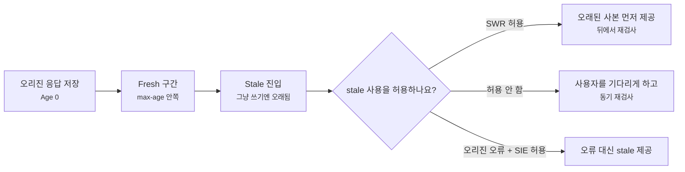
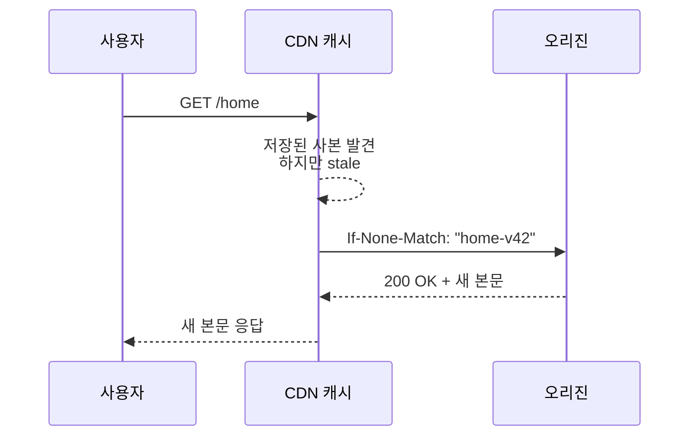
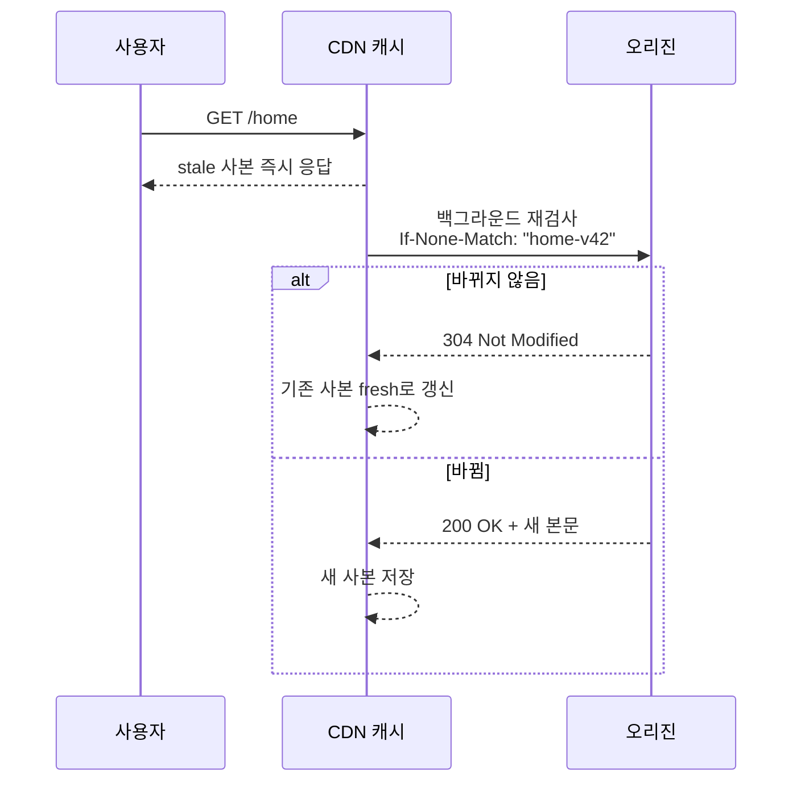
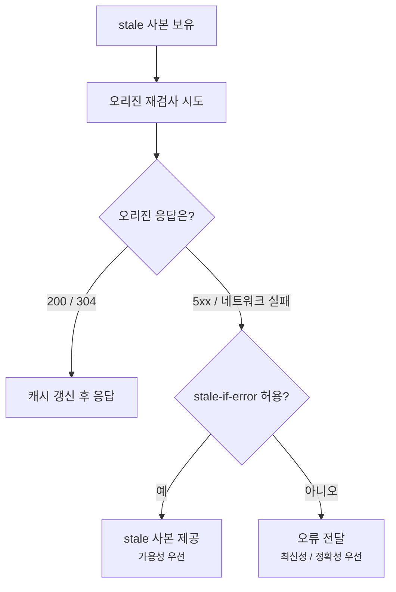
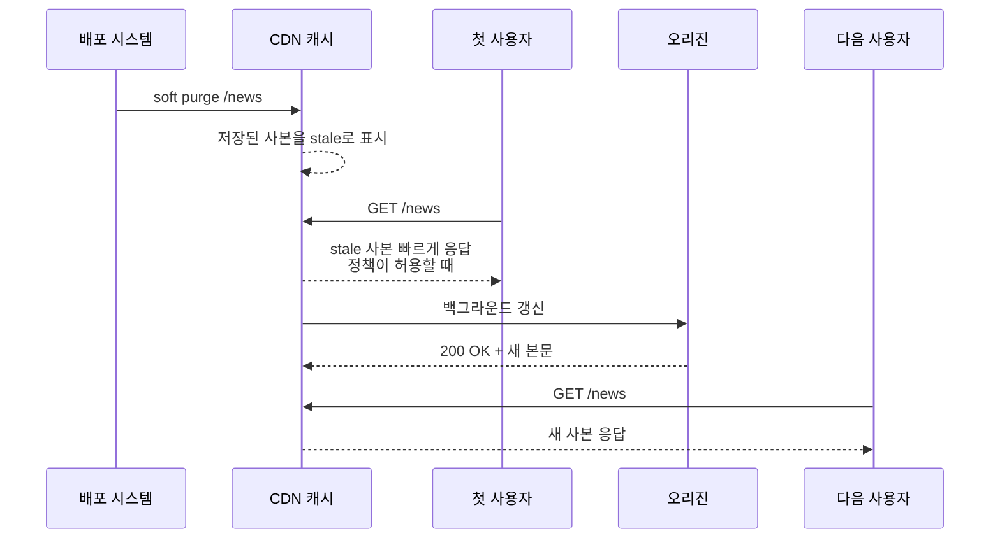
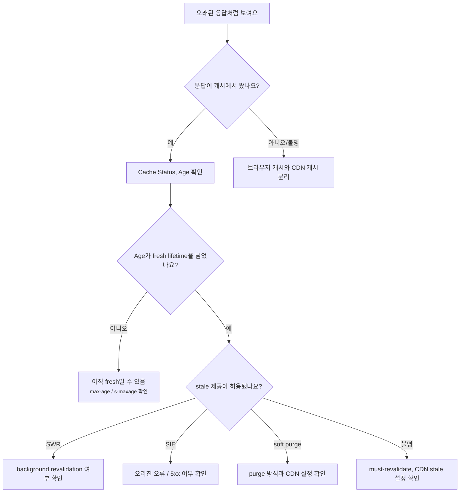

# stale-while-revalidate와 soft purge는 왜 같이 볼까요?

> 캐시가 오래됐으면 바로 버려야 할까요? **사실은 잠깐 오래된 사본을 보여주면서 뒤에서 새 사본을 가져올 수도 있어요.**

[CDN, Cache, 그리고 Edge Delivery](../basic/25-cdn-cache-and-edge-delivery.md){ data-preview }에서는 사용자 가까이에 복사본을 두는 큰 그림을 봤어요. 그리고 [Cache-Control과 Age 헤더](./reading-cache-control-and-age.md){ data-preview }에서는 그 복사본이 fresh인지 stale인지, [ETag와 조건부 요청](./etag-and-conditional-requests.md){ data-preview }에서는 stale 사본을 다시 확인하는 흐름을 봤죠.

이번에는 그다음 장면이에요.

```http
Cache-Control: public, max-age=60, stale-while-revalidate=30, stale-if-error=86400
```

처음 보면 값이 세 개나 붙어서 복잡해 보여요.

> *"`max-age=60`이면 60초 뒤에는 끝 아닌가요? 근데 왜 stale을 또 허용하죠?"*

여기서 핵심은 **사용자에게 기다림을 줄일지, 항상 새 값을 보장할지, 오리진 장애 때 오래된 사본이라도 보여줄지**를 나눠 보는 거예요.

오늘 질문은 이거예요.

> *"캐시 사본이 stale이 되었을 때, 언제 기다리고, 언제 오래된 사본을 먼저 주고, 언제 아예 버려야 할까요?"*

`stale-while-revalidate`와 `stale-if-error`는 [RFC 5861: HTTP Cache-Control Extensions for Stale Content](https://datatracker.ietf.org/doc/html/rfc5861)에 정리된 stale 제어 확장이에요. 기본 캐시 판단과 재검사 흐름은 [RFC 9111: HTTP Caching](https://www.rfc-editor.org/info/rfc9111/)을 바닥에 두고 읽으면 좋아요. 다만 soft purge는 HTTP 표준 directive가 아니라 CDN 제품의 purge 기능 이름으로 쓰이는 경우가 많으니, 실제 동작은 제품 문서와 설정을 같이 봐야 해요.

!!! note "이 글의 범위"
    여기서는 CDN 캐시에서 자주 만나는 **stale-while-revalidate**, **stale-if-error**, **soft purge**, **background revalidation**의 읽는 순서를 잡아요. 특정 CDN의 모든 상태값이나 purge API 사용법을 외우는 글은 아니에요.

---

## 식당에서 남은 반찬을 바로 버릴지, 먼저 새로 만들지 정해야 해요

점심 장사 중인 식당을 떠올려볼게요.

인기 반찬이 진열대에 있어요. 막 만든 지 60분까지는 그대로 내도 괜찮다고 정했어요. 그런데 61분이 됐어요.

이때 식당에는 선택지가 몇 가지 있어요.

- 손님을 기다리게 하고 새 반찬을 만든 뒤 내요.
- 지금 있는 반찬을 잠깐 먼저 내고, 주방에서는 새 반찬을 만들어요.
- 주방에 문제가 생기면, 완전히 못 파는 것보다 잠깐 더 둔 반찬을 내요.
- 위생상 위험한 반찬이면 오래됐다는 이유만으로도 바로 버려요.

웹 캐시도 비슷해요.

| 식당 장면 | HTTP/CDN 캐시 장면 |
|---|---|
| 막 만든 뒤 믿고 낼 수 있는 시간 | `max-age`, `s-maxage` |
| 시간이 지나 오래된 반찬 | stale response |
| 손님에게 먼저 내고 뒤에서 새로 만들기 | `stale-while-revalidate` |
| 주방 장애 때 오래된 반찬이라도 내기 | `stale-if-error` |
| 반찬을 버리지 않고 "오래됨"으로 표시 | soft purge |
| 새로 만든 뒤 진열대 교체 | revalidation / refresh |
| 절대 오래된 걸 내면 안 되는 반찬 | `no-store`, `must-revalidate`, 민감한 개인 응답 |

핵심은 stale이 곧바로 "쓸 수 없음"은 아니라는 점이에요. stale은 **그냥 쓰기에는 시간이 지났으니, 정책을 보고 다음 행동을 결정해야 하는 상태**예요.



이 그림에서 `SWR`은 `stale-while-revalidate`, `SIE`는 `stale-if-error`를 줄여 쓴 거예요. 둘 다 stale을 다루지만, 사용되는 순간이 달라요.

## max-age, stale-while-revalidate, stale-if-error는 시간표가 달라요

아래 응답을 기준으로 볼게요.

```http
HTTP/2 200
Cache-Control: public, max-age=60, stale-while-revalidate=30, stale-if-error=86400
ETag: "home-v42"
Age: 0
```

이걸 시간표로 풀면 이렇게 읽을 수 있어요.

| 시간 | 캐시 사본 상태 | 캐시가 할 수 있는 일 |
|---|---|---|
| 0-60초 | fresh | 오리진에 묻지 않고 바로 응답할 수 있어요 |
| 61-90초 | stale이지만 SWR 창 안쪽 | stale 사본을 먼저 주고 뒤에서 재검사할 수 있어요 |
| 91초 이후 | 일반 stale | 보통 재검사를 기다리거나 새로 가져와야 해요 |
| 오리진 오류 발생, 최대 86400초 | stale-if-error 창 | 오류 대신 stale 사본을 줄 수 있어요 |

여기서 `stale-while-revalidate=30`은 `max-age`를 90초로 늘리는 말이 아니에요. 60초까지는 fresh이고, 그 뒤 30초 동안은 **오래됐다는 걸 알지만, 재검사를 뒤로 미루고 먼저 보여줄 수 있는 완충 구간**이에요.

```mermaid
gantt
    title stale 제어 시간표
    dateFormat X
    axisFormat %s초
    section Fresh
    max-age 60초 :0, 60
    section Stale but usable
    stale-while-revalidate 30초 :60, 90
    section Error fallback
    stale-if-error 가능 구간 :60, 86460
```



이 시간표는 단순화한 그림이에요. 실제 캐시는 `Date`, `Age`, CDN 내부 TTL, 요청 헤더, 제품별 설정을 함께 봐요. 그래도 처음 읽을 때는 **fresh 구간**, **SWR 완충 구간**, **오류 fallback 구간**을 나눠 보면 덜 헷갈려요.

## stale-while-revalidate는 사용자 응답과 갱신 작업을 분리해요

일반적인 stale 재검사는 사용자가 기다리는 흐름이 될 수 있어요.



이 흐름은 정확하지만, 사용자는 오리진 왕복을 기다려야 해요.

`stale-while-revalidate`가 허용된 구간에서는 흐름이 달라질 수 있어요.



사용자 입장에서는 빠르게 응답을 받아요. 대신 그 응답은 방금 막 오리진에서 가져온 최신 본문이 아니라, **오래됐지만 허용된 사본**일 수 있어요.

이 방식은 특히 HTML, 목록 페이지, 공용 API처럼 "몇 초 정도 오래된 값은 괜찮지만 첫 바이트 지연은 줄이고 싶은" 장면에서 자주 검토돼요. 반대로 주식 주문, 결제 상태, 개인 정보처럼 최신성이 더 중요한 장면에서는 조심해야 해요.

!!! warning "`stale-while-revalidate`는 최신성 보장이 아니라 지연 숨김 장치예요"
    사용자는 빠르게 응답을 받지만, 그 응답이 최신이라는 뜻은 아니에요. 짧은 stale 허용이 사용자 경험에는 좋을 수 있지만, 잘못 쓰면 방금 수정한 공지나 가격이 잠깐 늦게 보일 수 있어요.

## stale-if-error는 오리진 장애 때의 선택지예요

`stale-if-error`는 평소 갱신 지연을 숨기는 것보다, 오리진이 실패했을 때 더 중요해져요.

```http
Cache-Control: public, max-age=300, stale-if-error=86400
```

이 응답이 stale이 된 뒤 오리진 재검사를 하려고 했는데, 오리진에서 `500`, `502`, `503`, `504` 같은 오류가 나거나 네트워크 실패가 났다고 해볼게요.

캐시는 선택할 수 있어요.

| 선택 | 사용자에게 보이는 결과 | 장단점 |
|---|---|---|
| 오류를 그대로 전달 | `502`, `503`, `504` 같은 실패가 보임 | 최신성은 속이지 않지만 가용성이 떨어져요 |
| stale 사본 제공 | 예전 화면이라도 보임 | 서비스는 살아 보이지만 오래된 정보일 수 있어요 |

`stale-if-error`는 두 번째 선택을 허용하는 힌트예요. "오리진이 실패하면, 이 시간 안에서는 stale 사본이라도 보여줘도 돼요"에 가까워요.



여기서도 제품 차이가 있어요. 어떤 CDN은 어떤 오류를 stale fallback 대상으로 볼지, 얼마나 오래 허용할지, 상태 헤더에 무엇을 남길지 다르게 구현할 수 있어요. 그래서 실제 운영에서는 CDN 문서를 같이 확인해야 해요.

## soft purge는 "삭제"가 아니라 "오래됨 표시"에 가까워요

purge라고 하면 보통 캐시에서 지워버리는 느낌이 들어요. 그런데 CDN 제품 중에는 soft purge라는 기능을 제공하는 곳이 있어요. 예를 들어 Fastly 문서는 soft purge를 **콘텐츠를 stale로 표시하는 purge**로 설명해요.

둘을 나눠 보면 이래요.

| 작업 | 캐시 안의 사본 | 다음 요청에서 생길 수 있는 일 |
|---|---|---|
| hard purge | 새 요청에서 더는 매칭되지 않거나 즉시 못 쓰게 됨 | 다음 요청이 오리진으로 가서 새 사본을 받아야 해요 |
| soft purge | 사본을 지우기보다 stale로 표시 | 설정에 따라 stale을 잠깐 주고 뒤에서 갱신할 수 있어요 |

soft purge가 왜 필요할까요?

새 배포 직후에 많은 URL을 한꺼번에 hard purge하면, 다음 사용자들이 동시에 오리진으로 몰릴 수 있어요. 캐시가 비어 있으니 모두 새로 가져와야 하거든요.

soft purge는 조금 다른 전략이에요.



이 흐름의 장점은 오리진에 갑작스러운 요청 폭주를 줄일 수 있다는 점이에요. 단점은 첫 사용자에게 오래된 사본이 잠깐 보일 수 있다는 점이고요.

!!! note "soft purge는 표준 HTTP 헤더 이름이 아니에요"
    `stale-while-revalidate`는 HTTP 응답의 `Cache-Control` directive로 볼 수 있지만, soft purge는 CDN의 관리 기능이나 API 동작으로 제공되는 경우가 많아요. 그래서 "soft purge를 지원한다"는 말은 반드시 해당 CDN의 문서와 설정으로 확인해야 해요.

## 상태 헤더에서는 HIT보다 STALE, UPDATING, REVALIDATED 쪽을 같이 봐요

stale 관련 동작이 켜져 있으면 CDN 상태 헤더가 더 중요해져요.

```http
HTTP/2 200
Cache-Control: public, max-age=60, stale-while-revalidate=30
Age: 68
CF-Cache-Status: UPDATING
```

또는 이런 모양을 볼 수도 있어요.

```http
HTTP/2 200
Cache-Control: public, max-age=60
Age: 75
Cache-Status: "ExampleCache"; fwd=stale; fwd-status=304
```

제품마다 값 이름은 달라요. 하지만 읽는 질문은 비슷해요.

| 신호 | 먼저 묻는 질문 |
|---|---|
| `Age`가 `max-age`보다 큼 | 지금 받은 사본이 stale이었나요? |
| `STALE` | 오래된 사본이 사용자에게 나갔나요? 왜 허용됐나요? |
| `UPDATING` | 사용자에게 stale을 주면서 뒤에서 갱신 중인가요? |
| `REVALIDATED` | 오리진 재검사 뒤 304로 다시 fresh해졌나요? |
| `MISS` | purge나 만료 때문에 바로 쓸 사본이 없었나요? |
| `BYPASS` | 정책상 캐시를 쓰지 않기로 했나요? |

여기서 `Age: 68`과 `max-age=60`을 같이 보면, 이 응답은 이미 fresh 구간을 지난 사본일 가능성이 있어요. 그런데도 사용자에게 왔다면 `stale-while-revalidate`, `stale-if-error`, CDN의 stale 설정, soft purge 같은 이유를 같이 확인해야 해요.

## 잘못 읽기 쉬운 함정

### 1. stale을 무조건 나쁜 응답으로 읽기

stale은 "무조건 틀린 응답"이 아니라 "fresh 시간은 지났으니 정책 판단이 필요한 응답"이에요. 짧은 시간의 stale 제공은 성능과 가용성을 위해 의도된 선택일 수 있어요.

### 2. stale-while-revalidate를 max-age 연장으로 읽기

`max-age=60, stale-while-revalidate=30`은 90초 동안 fresh라는 뜻이 아니에요. 60초 뒤에는 stale이고, 그 뒤 30초 동안은 재검사를 뒤에서 하며 stale을 제공할 수 있다는 뜻이에요.

### 3. soft purge를 즉시 삭제로 오해하기

soft purge는 보통 사본을 완전히 못 쓰게 만드는 hard purge와 달라요. 사본을 stale로 표시하고, 설정에 따라 갱신 전까지 제한적으로 사용할 수 있게 하는 전략이에요.

### 4. stale-if-error를 모든 오류에 대한 만능 보험으로 믿기

오리진 장애 때 오래된 사본을 줄 수는 있지만, 사용자별 응답이나 민감한 데이터에는 위험할 수 있어요. 또한 어떤 오류를 fallback 대상으로 보는지는 CDN과 설정에 따라 달라요.

### 5. purge 뒤 첫 요청이 최신일 거라고 단정하기

soft purge와 background revalidation이 켜진 환경에서는 purge 직후 첫 요청이 stale 사본을 받을 수 있어요. "purge했는데 왜 예전 화면이 보여요?"라는 질문이 여기서 나올 수 있어요.

## 실제 장면에서는 이렇게 좁혀봐요

캐시가 오래된 값을 보여주는 것 같다면, 아래 순서로 보면 좋아요.



표로 다시 정리하면 이렇게 물어보면 돼요.

| 확인할 것 | 질문 |
|---|---|
| `Cache-Control` | `max-age`, `s-maxage`, `stale-while-revalidate`, `stale-if-error`가 있나요? |
| `Age` | fresh 구간을 이미 지났나요? |
| validator | `ETag`나 `Last-Modified`가 있어서 재검사가 쉬운가요? |
| CDN 상태 헤더 | `STALE`, `UPDATING`, `REVALIDATED`, `MISS` 중 무엇처럼 보이나요? |
| purge 방식 | hard purge였나요, soft purge였나요? |
| 오리진 상태 | 재검사 때 200/304가 왔나요, 5xx나 timeout이 있었나요? |
| 데이터 성격 | 잠깐 오래된 값을 보여줘도 되는 공용 응답인가요? |

이 중 마지막 질문이 제일 중요해요. 캐시는 기술적으로 가능하다고 다 켜는 기능이 아니에요. **오래된 값을 보여줘도 되는 응답인지**를 먼저 판단해야 해요.

## 어떤 응답에 어울릴까요?

아주 거칠게 나누면 이렇게 볼 수 있어요.

| 응답 종류 | stale 허용 감각 |
|---|---|
| 해시가 붙은 정적 파일 | 긴 `max-age`, `immutable`이 더 단순할 수 있어요 |
| 공지/블로그/문서 HTML | 짧은 SWR로 첫 요청 지연을 줄일 수 있어요 |
| 상품 목록/랭킹 | 몇 초 정도 오래된 값이 괜찮은지 서비스 정책을 먼저 정해야 해요 |
| 로그인 사용자 페이지 | 공유 캐시 stale 제공은 보통 위험해요 |
| 결제/주문/잔액 상태 | stale 제공보다 정확성이 우선이에요 |
| 장애 안내나 정적 fallback 페이지 | `stale-if-error`가 가용성에 도움이 될 수 있어요 |

`stale-while-revalidate`는 "성능 버튼"이 아니라 **오래된 값을 잠깐 허용하는 정책**이에요. 그래서 캐시 헤더를 쓰기 전에 제품 요구사항을 먼저 물어야 해요.

> *"이 응답이 30초 전 내용이어도 사용자에게 괜찮을까요?"*

이 질문에 자신 있게 답할 수 있을 때만 stale 허용 시간을 정하는 게 좋아요.

## 자, 정리해볼까요?

!!! abstract "오늘 우리가 배운 것"
    - stale은 "무조건 폐기"가 아니라, fresh 시간이 지나 정책 판단이 필요한 상태예요.
    - `stale-while-revalidate`는 stale 사본을 먼저 주고 뒤에서 재검사할 수 있게 해 지연을 숨겨요.
    - `stale-if-error`는 오리진 오류 때 오류 대신 stale 사본을 줄 수 있게 해 가용성을 높여요.
    - soft purge는 캐시 사본을 즉시 못 쓰게 만들기보다 stale로 표시해 부드럽게 갱신하는 CDN 기능으로 쓰이는 경우가 많아요.
    - `Age`, `Cache-Control`, CDN 상태 헤더, purge 방식, 오리진 오류를 함께 봐야 stale 응답의 이유가 보여요.
    - stale 제공은 최신성의 일부를 포기하는 선택이므로, 공용 응답인지 민감한 응답인지 먼저 나눠야 해요.

캐시 운영에서 어려운 부분은 "저장할까 말까"보다 **오래된 사본을 언제까지, 누구에게, 어떤 상황에서 보여줄 것인가**예요. `stale-while-revalidate`와 soft purge는 그 결정을 더 부드럽게 만드는 도구지만, 최신성 요구가 강한 응답에는 조심해서 써야 해요.

## 더 깊이 보고 싶다면

- [RFC 5861: HTTP Cache-Control Extensions for Stale Content](https://datatracker.ietf.org/doc/html/rfc5861) — `stale-while-revalidate`와 `stale-if-error`의 기본 의미를 확인할 수 있어요.
- [RFC 9111: HTTP Caching](https://www.rfc-editor.org/info/rfc9111/) — HTTP 캐시의 freshness, validation, stale 처리의 기준 흐름을 볼 수 있어요.
- [Fastly Soft purges](https://www.fastly.com/documentation/guides/full-site-delivery/purging/soft-purges/) — soft purge를 "stale로 표시하는 purge"로 설명하는 제품 문서예요.

## 이어서 보면 좋은 글

- [Cache-Control과 Age 헤더는 어떻게 같이 읽어야 할까요?](./reading-cache-control-and-age.md){ data-preview } — fresh와 stale의 기본 시간표가 헷갈릴 때 좋아요.
- [ETag와 조건부 요청은 어떻게 304를 만들까요?](./etag-and-conditional-requests.md){ data-preview } — stale 사본을 다시 확인하는 validator 흐름을 이어서 볼 수 있어요.
- [CDN Cache Status 헤더는 어떻게 읽어야 할까요?](./cdn-cache-status-headers.md){ data-preview } — `STALE`, `UPDATING`, `REVALIDATED` 같은 상태값을 주변 헤더와 함께 읽어봐요.
- [Cache Key와 Vary는 왜 같이 읽어야 할까요?](./cache-key-and-vary.md){ data-preview } — stale 사본이 맞는 사용자에게 나가는지 확인하려면 cache key 감각도 같이 필요해요.

## 이어서 볼 질문

다음에는 캐시가 아예 되면 안 되는 응답을 볼 거예요. `Cookie`, `Authorization`, `Set-Cookie`, `private`, `no-store`가 왜 캐시 가능성과 함께 읽혀야 하는지 이어서 열어볼 수 있어요.
