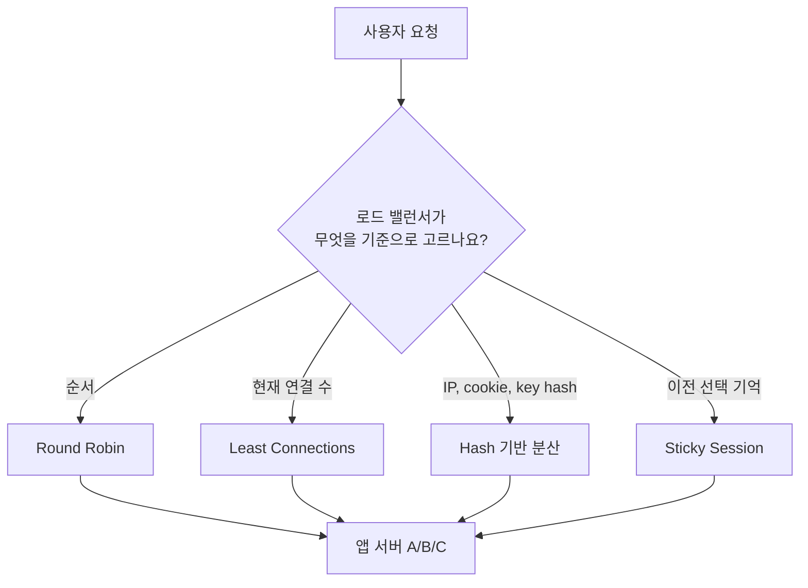
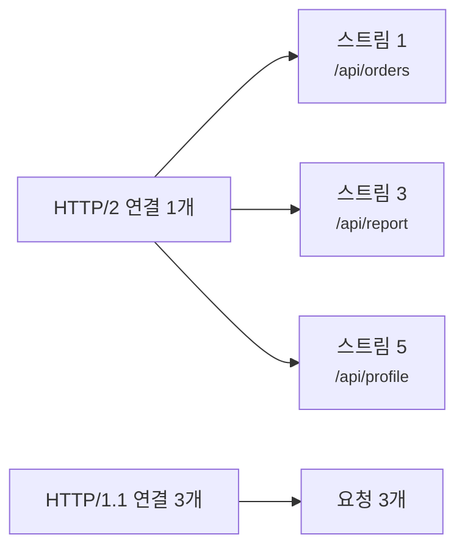
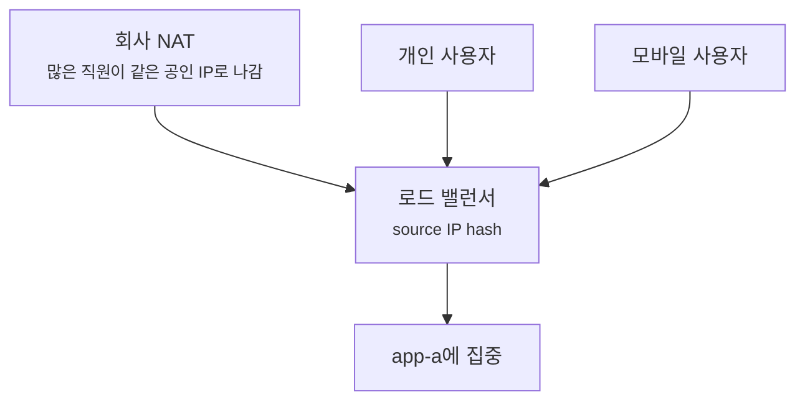
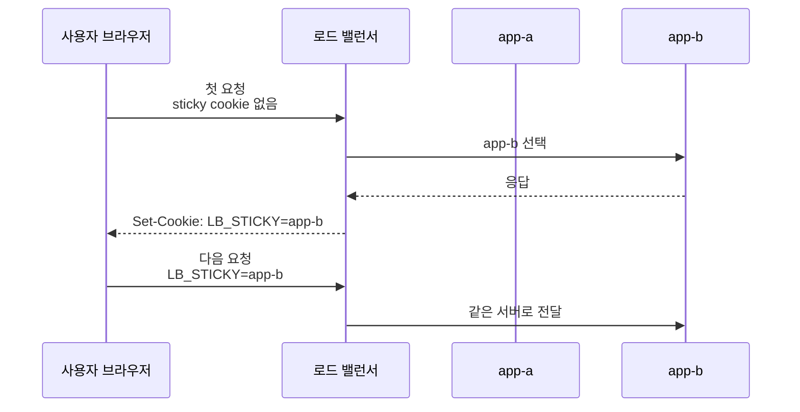
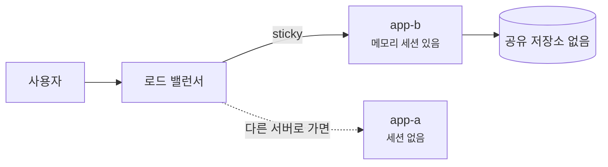
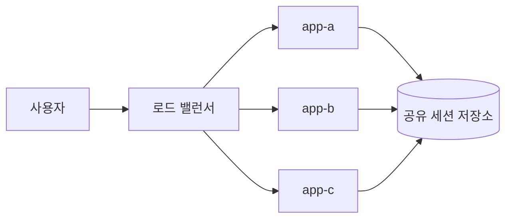
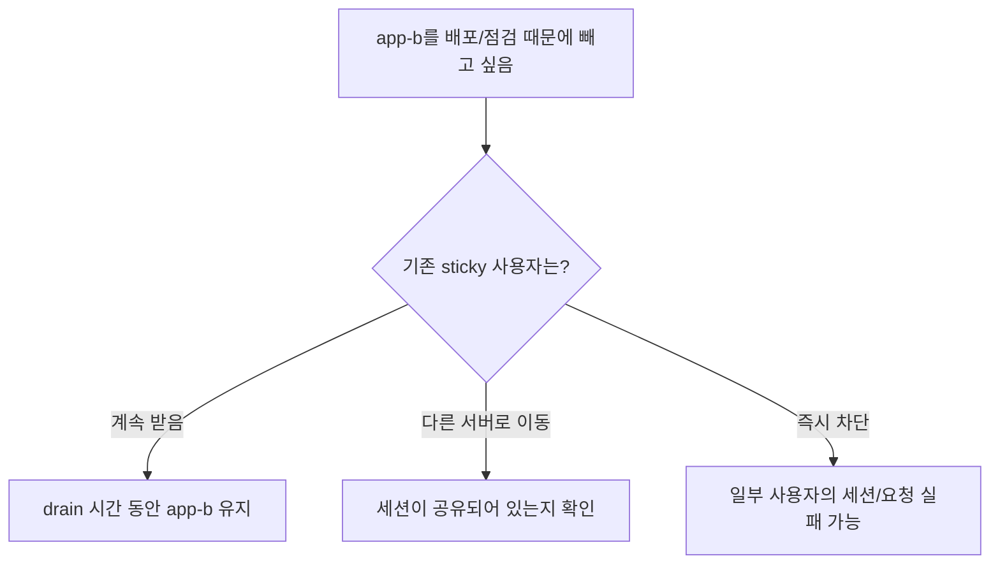
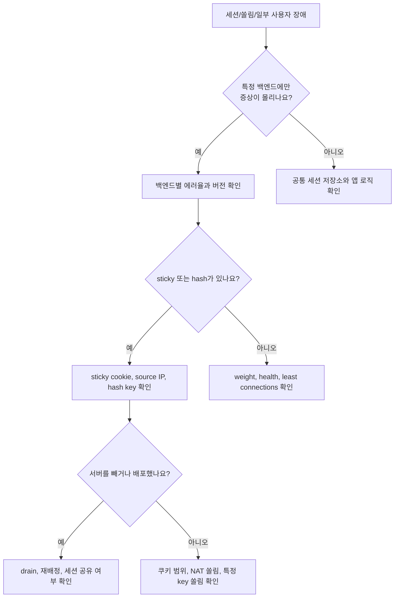

# Sticky Session과 로드 밸런싱 방식은 왜 같이 봐야 할까요?

> 서버가 여러 대면 알아서 골고루 나눠질 것 같죠? **사실은 어떤 기준으로 나누느냐에 따라 같은 사용자가 계속 같은 서버로 갈 수도, 매번 다른 서버로 갈 수도 있어요.**

[Proxy, Reverse Proxy, 그리고 Load Balancer](../basic/24-proxy-reverse-proxy-and-load-balancer.md){ data-preview }에서는 서버 앞단이 요청을 먼저 받고 여러 서버 중 하나를 고를 수 있다는 큰 그림을 봤어요. 그리고 [L4와 L7 로드 밸런서](./l4-vs-l7-load-balancer.md){ data-preview }에서는 앞단이 IP·포트만 보는지, HTTP Host·path까지 읽는지에 따라 판단 재료가 달라진다는 걸 봤죠.

이번에는 로드 밸런서가 **어떤 서버를 고르는 방식**을 더 자세히 볼게요.

운영 중에는 이런 말을 자주 만나요.

```text
round_robin
least_connections
source_ip_hash
cookie-based sticky session
session affinity
```

처음에는 다 비슷하게 **"여러 서버로 나눠 보내는 설정"**처럼 보여요. 그런데 실제 장애를 만나면 차이가 커져요.

- 로그인했는데 다음 요청에서 로그인이 풀려요.
- 서버 한 대가 유독 바빠요.
- 새 버전을 조금만 배포했는데 특정 사용자만 계속 새 버전을 봐요.
- 장애 서버를 빼도 일부 사용자는 계속 그쪽으로 가는 것처럼 보여요.

오늘의 질문은 이거예요.

> *"이 사용자의 다음 요청은 같은 서버로 가야 할까요, 아니면 아무 건강한 서버로 가도 될까요?"*

!!! note "이 글의 범위"
    여기서는 특정 제품의 설정 문법보다 **로드 밸런싱 방식**, **sticky session/session affinity**, **stateful 앱과 stateless 앱의 차이**, **운영 중 읽어야 할 신호**에 집중해요. 실제 제품은 가중치, health check, slow start, consistent hashing 같은 세부 기능을 섞어 제공할 수 있으니, 이름보다 **무엇을 기준으로 서버를 고르는지**를 먼저 보세요.

---

## 식당이 손님을 빈자리로 보낼 수도, 같은 담당 직원에게 붙일 수도 있어요

식당 입구에서 손님을 안내하는 장면을 떠올려볼게요.

- 어떤 식당은 손님이 올 때마다 **가장 덜 바쁜 테이블**로 안내해요.
- 어떤 식당은 순서대로 **1번, 2번, 3번 테이블**에 번갈아 앉혀요.
- 그런데 상담이 이어지는 손님이라면, 다음 방문 때도 **이전 담당 직원**에게 보내는 편이 좋을 수 있어요.

웹 요청도 비슷해요. 요청을 그냥 건강한 서버 중 하나로 보내도 되는 경우가 있고, 같은 사용자의 요청은 되도록 같은 서버에 붙여야 하는 경우가 있어요.

| 식당 장면 | 네트워크 장면 |
|---|---|
| 손님을 순서대로 테이블에 배정 | round robin |
| 가장 한가한 담당자에게 배정 | least connections |
| 손님 이름이나 전화번호로 담당자 결정 | hash 기반 분산 |
| 같은 손님을 이전 담당자에게 계속 보냄 | sticky session, session affinity |
| 담당자 책상에만 손님 메모가 있음 | 서버 로컬 메모리 세션 |
| 중앙 예약 시스템에 메모가 있음 | 공유 세션 저장소, stateless에 가까운 구조 |

핵심은 **요청을 나누는 기준**이에요. 로드 밸런서는 단순히 "여러 대로 보내는 장치"가 아니라, 매 요청 또는 매 연결마다 **어떤 후보를 고를지 판단하는 장치**예요.



이 그림에서 중요한 건 "서버가 여러 대"라는 사실보다 **선택 기준**이에요. 선택 기준이 바뀌면 성능, 세션, 장애, 배포를 읽는 방식도 같이 바뀌어요.

## Round Robin은 순서대로 나눠 보내는 가장 쉬운 그림이에요

Round robin은 후보 서버를 순서대로 돌면서 요청을 보내는 방식이에요.

```text
request 1 -> app-a
request 2 -> app-b
request 3 -> app-c
request 4 -> app-a
request 5 -> app-b
```

이 방식은 이해하기 쉽고, 서버들이 비슷한 성능과 비슷한 요청을 처리한다면 꽤 자연스럽게 나뉘어요.

| 장점 | 조심할 점 |
|---|---|
| 설정과 설명이 단순해요 | 요청마다 처리 시간이 다르면 실제 부하는 균등하지 않을 수 있어요 |
| 서버가 비슷하면 고르게 퍼져요 | 같은 사용자의 다음 요청이 다른 서버로 갈 수 있어요 |
| 캐시나 세션을 따로 고려하지 않는 서비스에 잘 맞아요 | 무거운 요청과 가벼운 요청을 같은 한 건으로 세요 |

예를 들어 요청 1, 2, 3이 모두 비슷하게 50ms 안에 끝난다면 round robin은 괜찮아요. 그런데 요청 1은 10초짜리 리포트 생성이고, 요청 2와 3은 20ms짜리 상태 조회라면 어떨까요?

겉으로는 한 건씩 나눴지만, 실제로는 `app-a`가 훨씬 오래 바쁠 수 있어요.

```mermaid
gantt
    title 같은 한 건이어도 처리 시간이 다를 수 있어요
    dateFormat X
    axisFormat %s
    section app-a
    report request :0, 10
    section app-b
    health request :0, 1
    section app-c
    profile request :0, 1
```



이 그림은 round robin의 한계를 보여줘요. 로드 밸런서가 요청의 무게를 모르면, **건수는 균등해도 체감 부하는 균등하지 않을 수 있어요.**

## Least Connections는 지금 덜 바쁜 쪽을 보려는 방식이에요

Least connections는 현재 연결 수가 적은 서버를 고르는 방식이에요. 이름 그대로 "지금 연결을 덜 들고 있는 서버"를 우선하는 감각이에요.

```text
app-a active connections: 120
app-b active connections:  37
app-c active connections:  42

next request -> app-b
```

긴 요청이 섞인 환경에서는 round robin보다 더 자연스러울 수 있어요. 이미 오래 붙어 있는 연결이 많은 서버를 피할 수 있으니까요.

하지만 이것도 만능은 아니에요.

| 확인할 점 | 왜 중요할까요? |
|---|---|
| 연결 하나가 요청 하나인가요? | HTTP/2, HTTP/3에서는 한 연결 안에 여러 요청이 섞일 수 있어요 |
| 연결은 적지만 CPU가 높은 서버가 있나요? | 연결 수만으로 실제 부하를 다 알 수는 없어요 |
| keep-alive 연결이 오래 남나요? | 놀고 있는 idle 연결도 connection count에 잡히는 방식이 제품마다 달라요 |
| 서버별 성능이 같나요? | 작은 서버와 큰 서버를 같은 기준으로 세면 쏠릴 수 있어요 |

[Connection reuse, Keep-Alive, Pooling](./connection-reuse-keepalive-and-pooling.md){ data-preview }에서 본 것처럼, 연결은 요청과 같은 단위가 아니에요. 그래서 least connections를 볼 때도 "연결 수가 적다"를 곧바로 "실제로 한가하다"로 읽으면 안 돼요.



위쪽은 연결이 하나지만 요청이 여러 개예요. 아래쪽은 연결이 세 개지만 요청이 단순할 수 있어요. 그래서 "least connections"라는 이름은 실제 구현과 프로토콜 버전까지 같이 읽어야 해요.

## Hash 기반 분산은 같은 입력을 같은 서버 쪽으로 보내려는 방식이에요

Hash 기반 분산은 어떤 값을 넣으면, 그 값으로 서버를 고르는 방식이에요.

예를 들어 출발지 IP를 기준으로 해시하면 이런 식의 감각이 돼요.

```text
hash(203.0.113.10) -> app-b
hash(203.0.113.11) -> app-a
hash(203.0.113.10) -> app-b
```

같은 입력은 같은 결과로 가려는 성질이 있으니, 같은 사용자나 같은 key를 같은 서버 쪽으로 보내고 싶을 때 도움이 돼요.

| 해시 기준 | 자주 기대하는 효과 | 조심할 점 |
|---|---|---|
| source IP | 같은 IP 사용자를 같은 서버로 보내기 | NAT 뒤의 많은 사용자가 한 서버로 몰릴 수 있어요 |
| cookie 값 | 특정 브라우저를 같은 서버로 보내기 | 쿠키가 없거나 지워지면 다시 배정돼요 |
| URL path | 특정 리소스를 같은 서버나 캐시로 보내기 | path별 요청량이 다르면 쏠릴 수 있어요 |
| user id, tenant id | 같은 사용자나 tenant를 같은 쪽으로 보내기 | 앞단이 그 값을 읽을 수 있어야 해요 |

여기서 source IP hash는 특히 함정이 있어요. 회사, 학교, 통신사 NAT 뒤에 많은 사용자가 같은 공인 IP로 보일 수 있거든요. 그러면 로드 밸런서는 "같은 사용자"라고 착각한 게 아니라, **같은 출발지 IP라는 입력을 같은 서버로 보낸 것**뿐이에요.



이 장면에서는 알고리즘이 고장 난 게 아닐 수 있어요. 해시 기준으로 고른 값이 실제 사용자 분포를 잘 표현하지 못했을 뿐이에요.

## Sticky Session은 이전에 고른 서버를 계속 기억하려는 방식이에요

Sticky session은 같은 클라이언트의 다음 요청을 되도록 같은 백엔드로 보내는 방식이에요. 다른 이름으로 **session affinity**라고도 불러요.

가장 흔한 장면은 쿠키 기반 sticky예요.

```http
HTTP/1.1 200 OK
Set-Cookie: LB_STICKY=app-b.7f31; Path=/; Secure; HttpOnly
```

다음 요청에서 브라우저가 이 쿠키를 보내면, 앞단은 그 값을 보고 다시 `app-b`로 보내려고 할 수 있어요.

```http
GET /cart HTTP/1.1
Host: shop.example.com
Cookie: LB_STICKY=app-b.7f31
```



이 방식은 서버 로컬 메모리에 세션을 들고 있는 앱에서 특히 많이 등장해요. 예를 들어 `app-b` 메모리에만 로그인 세션이나 장바구니 임시 상태가 있다면, 다음 요청이 `app-a`로 가는 순간 사용자는 로그아웃된 것처럼 느낄 수 있어요.

| 보이는 증상 | sticky가 없거나 깨졌을 때 의심할 장면 |
|---|---|
| 로그인 직후 다음 화면에서 다시 로그인 요구 | 세션이 한 서버 메모리에만 있음 |
| 장바구니가 새로고침마다 사라졌다 돌아옴 | 요청이 서로 다른 서버를 오감 |
| 업로드 진행 상태가 서버마다 다르게 보임 | 진행 상태가 로컬 메모리에만 있음 |
| 특정 사용자만 계속 같은 버그를 봄 | sticky 때문에 특정 백엔드에 고정됨 |

하지만 sticky session은 치료제처럼 보이면서도 비용이 있어요. 같은 사용자를 같은 서버에 붙잡아두면, 서버를 마음대로 빼거나 트래픽을 자연스럽게 재분배하기가 어려워질 수 있어요.

## Sticky는 상태 저장 문제를 숨겨줄 수 있지만, 없애주지는 않아요

여기서 중요한 구분이 나와요.

- 앱이 요청마다 필요한 상태를 중앙 저장소나 토큰에서 읽으면, 어느 서버로 가도 처리하기 쉬워요.
- 앱이 서버 메모리에 사용자 상태를 들고 있으면, 같은 사용자 요청이 같은 서버로 가야 안전해져요.

이걸 흔히 **stateless**와 **stateful**의 차이로 말해요.

| 구분 | 요청이 다른 서버로 가도 괜찮나요? | 예시 |
|---|---|---|
| stateless에 가까움 | 보통 괜찮아요 | JWT, 공유 DB, 공유 Redis 세션, 객체 저장소 |
| stateful에 가까움 | 위험할 수 있어요 | 서버 메모리 세션, 로컬 파일 업로드 임시 상태, 서버별 캐시만 믿는 처리 |

Sticky session은 stateful 앱을 당장 운영 가능하게 도와줄 수 있어요. 하지만 근본적으로는 **상태가 특정 서버에 묶여 있다**는 사실이 남아 있어요.



이 구조에서는 `app-b`가 내려가면 sticky가 더는 사용자를 구해주지 못해요. 사용자는 다른 서버로 이동할 수는 있지만, `app-b` 메모리에 있던 세션은 같이 이동하지 않아요.

반대로 세션을 공유 저장소에 두면 그림이 달라져요.



이렇게 되면 sticky가 없어도 다음 요청을 처리하기 쉬워져요. 물론 공유 저장소 자체의 지연, 장애, 비용은 새로 봐야 해요. 하지만 적어도 "어느 앱 서버 메모리에 들어 있느냐"에 묶이는 문제는 줄어들어요.

## 배포와 장애에서는 sticky가 예상보다 오래 남을 수 있어요

Sticky session은 장애와 배포를 볼 때 특히 중요해져요.

예를 들어 서버 세 대가 있고, 사용자가 쿠키로 `app-b`에 붙어 있다고 해볼게요. 이제 `app-b`에 새 버전을 배포했는데 버그가 있어요. 그러면 모든 사용자가 망가지는 게 아니라, `app-b`에 붙은 사용자만 계속 그 버그를 볼 수 있어요.

```text
app-a: version 1
app-b: version 2  <- bug
app-c: version 1

LB_STICKY=app-b users -> 계속 version 2 경험
```

반대로 장애 서버를 빼는 장면도 봐야 해요.

| 장면 | 확인할 질문 |
|---|---|
| 백엔드가 unhealthy가 됨 | sticky 쿠키가 그 서버를 가리킬 때 어디로 재배정하나요? |
| 서버를 drain 중임 | 기존 sticky 사용자를 계속 받나요, 새 요청만 막나요? |
| canary 서버를 일부만 열었음 | sticky 때문에 같은 사용자가 계속 canary에 남나요? |
| 배포 후 rollback함 | sticky 쿠키나 affinity 정보가 예전 서버를 계속 가리키나요? |

여기서 **drain**은 서버를 바로 끊어내지 않고, 새 요청은 줄이면서 기존 연결이나 기존 사용자가 정리될 시간을 주는 운영 동작이에요. 제품마다 이름은 다르지만, "서버를 풀에서 빼는 중인데 기존 트래픽을 어떻게 처리하나"라는 질문은 공통이에요.



서버를 뺀다는 말은 단순히 "목록에서 삭제"가 아니에요. sticky가 있으면 **이미 그 서버에 붙어 있던 사용자와 연결을 어떻게 보낼지**까지 같이 결정해야 해요.

## 운영 화면에서는 이런 신호를 같이 읽어요

Sticky session이나 로드 밸런싱 방식이 의심될 때는 아래 신호를 같이 보면 좋아요.

| 신호 | 왜 보나요? |
|---|---|
| 백엔드별 요청 수와 에러율 | 특정 서버에만 쏠리거나 특정 서버만 실패하는지 |
| 백엔드별 active connection | least connections 판단과 실제 부하가 맞는지 |
| sticky cookie 존재 여부 | 브라우저가 어떤 affinity 값을 들고 있는지 |
| `Set-Cookie`의 `Path`, `Domain`, `Secure`, `SameSite` | 쿠키가 다음 요청에 실제로 붙는 조건인지 |
| source IP 분포 | IP hash가 NAT 사용자들을 한 서버로 몰지 않는지 |
| health check와 drain 상태 | unhealthy 서버로 sticky가 계속 향하는지 |
| 배포 버전별 요청 수 | canary나 rollback 때 특정 사용자만 남는지 |

특히 쿠키 기반 sticky를 볼 때는 쿠키가 "설정됐다"만 보면 부족해요. 다음 요청에 그 쿠키가 실제로 붙어야 해요.

```text
응답에는 Set-Cookie가 있음
하지만 다음 요청 path/domain 조건이 안 맞아서 Cookie가 안 붙음
로드 밸런서는 새 사용자처럼 다시 배정함
```

이런 장면에서는 앱 세션 문제가 아니라, 앞단 sticky 쿠키의 범위 문제일 수 있어요.

## 알고리즘 이름만으로 장애 원인을 단정하면 위험해요

로드 밸런싱 방식은 로그에서 짧게 보이지만, 실제 판단은 여러 조건이 겹쳐요.

```text
algorithm: round_robin
weights: app-a=100, app-b=50, app-c=100
health: app-b=degraded
sticky: cookie
```

이런 설정에서는 "round robin인데 왜 균등하지 않지?"라고 묻기 전에, 가중치와 health 상태와 sticky를 같이 봐야 해요.

| 겉으로 보이는 현상 | 바로 단정하면 안 되는 것 | 같이 볼 것 |
|---|---|---|
| app-a 요청이 더 많음 | round robin이 고장남 | weight, sticky, health, long connection |
| 특정 사용자만 실패 | 앱 코드가 사용자별로 다름 | sticky 대상 서버, canary, 세션 저장 위치 |
| NAT 사용자들이 느림 | 사용자 PC 문제 | source IP hash 쏠림 |
| 서버를 뺐는데 요청이 남음 | 설정 반영 실패 | drain, keep-alive, sticky 재배정 |
| 새 서버에 트래픽이 천천히 늘어남 | health check가 실패 | slow start, warm-up, connection reuse |

이 표의 목적은 "어떤 알고리즘이 정답"을 고르는 게 아니에요. 장애를 만났을 때 **서버 선택 기준을 증거로 확인하는 순서**를 만들기 위한 거예요.

## 잘못 읽기 쉬운 함정

### Sticky session이 있으면 세션 문제가 해결됐다고 보기

Sticky는 같은 사용자를 같은 서버로 보내려는 장치예요. 서버가 죽거나 drain되거나 쿠키가 사라지면 상태 문제는 다시 드러날 수 있어요. 중요한 상태라면 공유 저장소, 토큰, 재시도 가능한 설계까지 같이 봐야 해요.

### Source IP hash를 사용자 단위 고정으로 생각하기

source IP는 사용자 ID가 아니에요. NAT, VPN, 모바일망, 프록시를 거치면 많은 사용자가 같은 IP로 보일 수 있고, 한 사용자의 IP가 바뀔 수도 있어요. IP hash는 "IP 기준 고정"이지 "사람 기준 고정"이 아니에요.

### Least connections면 항상 가장 한가한 서버를 고른다고 보기

연결 수는 중요한 신호지만 CPU, 메모리, 요청 처리 시간, HTTP/2 스트림 수, DB 대기 시간을 모두 대표하지는 못해요. 그래서 least connections도 실제 metric과 같이 봐야 해요.

### Stateless로 만들면 로드 밸런싱 고민이 사라진다고 보기

stateless에 가까워지면 sticky 의존은 줄어들어요. 하지만 rate limit, 캐시 warm-up, tenant별 데이터 쏠림, DB pool, 외부 API 제한처럼 다른 분산 문제가 남을 수 있어요.

### Health check만 통과하면 그 서버로 보내도 안전하다고 보기

health check는 보통 작은 확인이에요. `/health`는 정상인데 로그인 세션 저장소만 느리거나, 특정 path만 실패할 수 있어요. 로드 밸런서가 보는 건강과 사용자가 느끼는 건강은 다를 수 있어요.

## 장애를 만났을 때는 이렇게 좁혀봐요

로그인 풀림, 특정 서버 쏠림, 배포 후 일부 사용자만 실패 같은 증상을 만나면 아래 순서로 좁혀볼 수 있어요.



이 흐름에서 핵심은 "로드 밸런서가 이상하다"로 뭉개지 않는 거예요. **어떤 기준으로 서버가 선택됐고, 그 기준이 지금 증상과 맞물리는지**를 확인해야 해요.

실전에서는 이런 질문을 남겨두면 좋아요.

| 질문 | 답을 찾을 곳 |
|---|---|
| 같은 사용자의 요청이 같은 백엔드로 갔나요? | access log의 backend 이름, request id |
| sticky 값은 무엇이었나요? | 브라우저 cookie, 앞단 로그 |
| 서버별 버전과 에러율이 달랐나요? | 배포 시스템, metric, 로그 |
| 세션은 어디에 저장됐나요? | 앱 설정, Redis/DB, 서버 메모리 |
| 백엔드를 빼는 중이었나요? | load balancer target 상태, drain 이벤트 |

## 자, 정리해볼까요?

!!! abstract "오늘 우리가 배운 것"
    - 로드 밸런서는 여러 서버 중 하나를 고를 때 **순서, 연결 수, hash, sticky 정보** 같은 기준을 써요.
    - round robin은 단순하지만 요청의 무게와 사용자 상태를 모를 수 있어요.
    - least connections는 현재 연결 수를 보지만, 연결 수가 실제 부하를 완벽하게 대표하지는 않아요.
    - hash 기반 분산은 같은 입력을 같은 서버로 보내려 하지만, source IP 같은 입력은 사용자 단위와 다를 수 있어요.
    - sticky session은 같은 사용자를 같은 서버로 보내는 데 도움을 주지만, 서버 로컬 상태 문제를 근본적으로 없애지는 않아요.
    - 배포, drain, health check, canary를 볼 때는 sticky 사용자가 어디로 재배정되는지까지 같이 봐야 해요.

## 이어서 보면 좋은 글

- [L4와 L7 로드 밸런서는 무엇을 보고 나눠 보낼까요?](./l4-vs-l7-load-balancer.md){ data-preview } — 서버 선택 전에 앞단이 어떤 정보까지 읽는지 먼저 정리하고 싶을 때 좋아요.
- [Connection reuse, Keep-Alive, Pooling은 왜 같이 봐야 할까요?](./connection-reuse-keepalive-and-pooling.md){ data-preview } — 서버 선택 뒤 연결을 새로 여는지, pool에서 다시 쓰는지 이어서 볼 수 있어요.
- [502, 503, 504는 어디서 만든 응답일까요?](./reading-502-503-504.md){ data-preview } — 특정 백엔드 실패가 앞단 오류로 어떻게 보이는지 같이 읽기 좋아요.

## 이어서 볼 질문

다음에는 서버 앞단을 지나 캐시 쪽으로 시선을 옮겨서, `Cache-Control`과 `Age` 헤더를 보고 **지금 보는 응답이 새 원본인지, 오래된 사본인지** 읽어볼 수 있어요.
