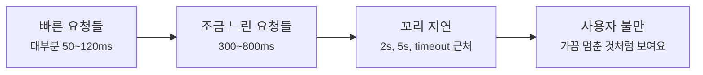
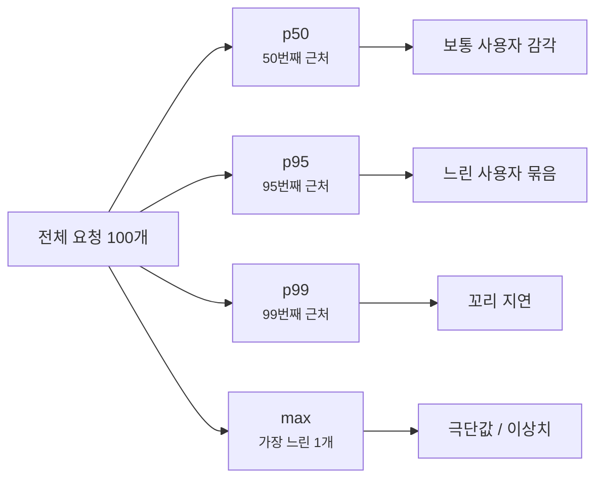
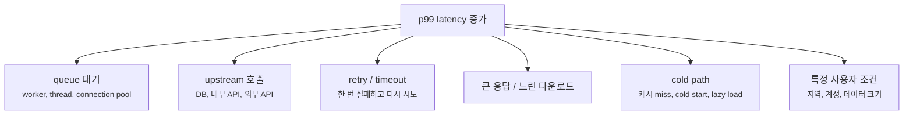
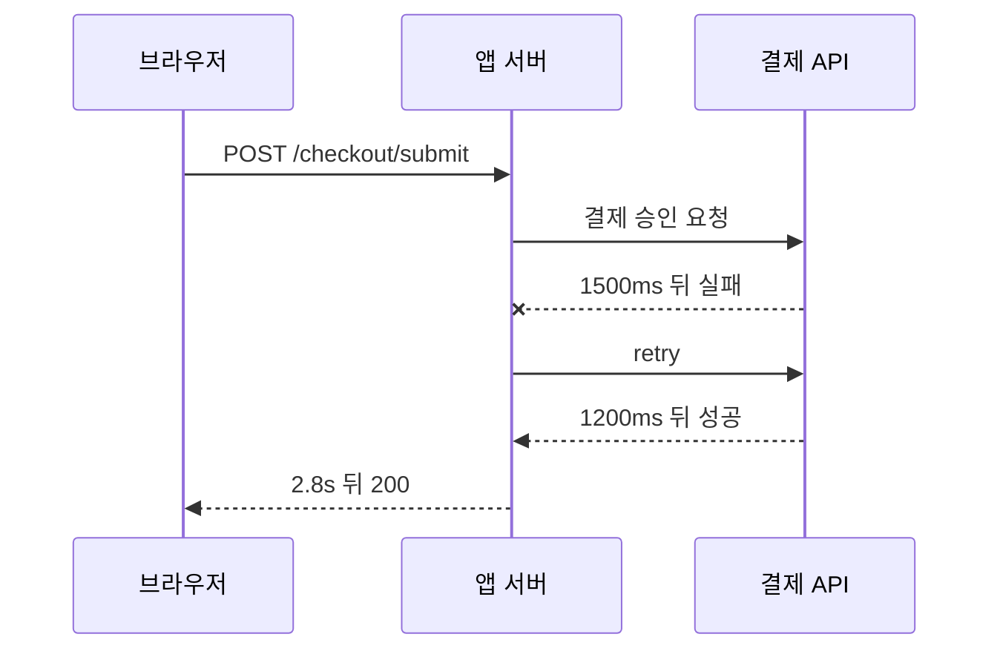

# Tail Latency와 p99는 왜 평균보다 먼저 봐야 할까요?

> 평균은 괜찮아 보이는데 사용자는 느리다고 해요. **사실은 느린 요청들이 끝쪽 꼬리에 숨어 있을 수 있어요.**

[End-to-End Request Debugging](../basic/26-end-to-end-request-debugging.md){ data-preview }에서는 느린 요청 하나를 DNS, 연결, TLS, 프록시, 캐시, 오리진으로 나눠 읽었어요. 그리고 [느린 upstream과 느린 render](./slow-upstream-vs-slow-render.md){ data-preview }에서는 오리진 안쪽 시간이 남을 기다린 시간인지, 직접 응답을 만든 시간인지 나눠 봤죠.

근데요, 실제 운영에서는 요청 하나만 느린 게 아니라 이런 말이 자주 나와요.

```text
Dashboard:
Average latency: 142 ms
p50 latency:      88 ms
p95 latency:     720 ms
p99 latency:    2380 ms

User report:
"대부분은 괜찮은데, 가끔 결제 버튼이 2~3초씩 멈춰요."
```

평균만 보면 `142 ms`예요. 꽤 괜찮아 보이죠. 그런데 p99는 `2380 ms`예요.
이제 질문이 달라져요.

> *"평균은 괜찮은데, 왜 일부 사용자는 이렇게 느리게 느낄까요?"*

오늘은 그 끝쪽 느린 구간, 즉 **tail latency**를 읽어볼게요.

!!! note "이 글의 범위"
    여기서는 통계 공식을 깊게 증명하기보다, 운영 화면에서 평균, p50, p95, p99, max를 **어떤 순서로 읽어야 하는지**에 집중해요. 지표 이름과 계산 방식은 모니터링 도구마다 조금 다를 수 있으니, 같은 도구 안에서 같은 조건으로 비교하는 습관이 중요해요.

---

## 식당 평균 대기 시간은 괜찮은데 줄 끝은 화가 나 있어요

점심시간 식당을 떠올려볼게요.

손님 100명 중 90명은 5분 안에 음식을 받았어요. 그런데 10명은 재료 확인, 결제 오류, 주방 실수 때문에 20분 넘게 기다렸어요.

식당이 이렇게 말할 수도 있어요.

> "평균 대기 시간은 6분밖에 안 돼요."

틀린 말은 아니에요. 하지만 줄 끝에서 20분 기다린 손님에게는 별로 위로가 안 되죠.

웹 요청도 비슷해요.

| 식당 장면 | 웹 요청 장면 |
|---|---|
| 대부분의 손님은 빨리 받음 | 대부분의 요청은 빠르게 끝남 |
| 몇 명만 오래 기다림 | 일부 요청만 1초, 2초, 5초로 늘어짐 |
| 평균 대기 시간은 괜찮아 보임 | 평균 latency는 낮아 보임 |
| 줄 끝 손님이 실제 불만을 느낌 | p95, p99 구간의 사용자가 느림을 느낌 |
| 주문 번호로 늦은 손님을 찾음 | request id, trace id로 느린 요청을 찾음 |

그래서 tail latency는 **대부분이 아니라 끝쪽 사용자가 겪는 지연**을 보는 방식이에요.



이 그림에서 중요한 건 `꼬리 지연`예요. 평균은 `빠른 요청들`의 요청이 많으면 낮게 보일 수 있지만, 사용자가 기억하는 건 `꼬리 지연`의 멈춤일 때가 많아요.

## p50, p95, p99는 줄을 세워서 보는 숫자예요

percentile은 요청 시간을 작은 값부터 큰 값까지 줄 세웠을 때, 어느 위치까지를 보는지에 가까워요.

예를 들어 요청 100개를 빠른 순서대로 세웠다고 해볼게요.

```text
1번째  45ms
2번째  48ms
...
50번째  88ms
...
95번째 720ms
...
99번째 2380ms
100번째 6100ms
```

처음에는 이렇게 읽으면 돼요.

| 지표 | 읽는 감각 |
|---|---|
| average / mean | 전체 시간을 더해서 요청 수로 나눈 값이에요 |
| p50 / median | 절반의 요청이 이 값 이하로 끝났다는 뜻이에요 |
| p95 | 95%의 요청이 이 값 이하, 나머지 5%는 더 느릴 수 있어요 |
| p99 | 99%의 요청이 이 값 이하, 나머지 1%는 더 느릴 수 있어요 |
| max | 관측된 가장 느린 요청이에요 |

그러니까 p99는 "99%가 이 시간보다 느렸다"가 아니에요. 반대로 **99%는 이 값 이하였고, 가장 느린 1%는 이 값보다 더 느릴 수도 있다**는 뜻이에요.



이 그림에서 p99와 max를 구분해야 해요. p99는 꼬리 쪽을 보지만, max 하나에만 끌려가는 숫자는 아니에요. 반대로 max는 한 번의 특이한 요청에도 크게 흔들릴 수 있어요.

## 평균이 괜찮아도 p99가 나빠질 수 있어요

요청 10개만 단순하게 놓고 볼게요.

```text
80ms, 82ms, 85ms, 88ms, 90ms,
92ms, 95ms, 100ms, 110ms, 2500ms
```

대부분은 100ms 근처예요. 그런데 마지막 하나가 `2500ms`예요.
이때 평균은 마지막 값 때문에 올라가지만, 여전히 "대부분은 괜찮다"는 느낌을 줄 수 있어요.

운영 화면에서는 이런 식으로 보일 수 있죠.

```text
route=/checkout/submit
count=12000
avg=142ms
p50=88ms
p95=720ms
p99=2380ms
max=9100ms
error_rate=0.3%
```

여기서 바로 볼 신호는 세 가지예요.

| 신호 | 먼저 묻는 질문 |
|---|---|
| `avg`와 `p50`은 낮은데 `p95`, `p99`가 높음 | 일부 요청만 길게 늘어지나요? |
| `max`가 p99보다 훨씬 큼 | timeout, 재시도, 극단값이 섞였나요? |
| 특정 route에서만 p99가 큼 | 공통 인프라 문제인지, 특정 기능 문제인지 나눌 수 있나요? |

평균은 전체 분위기를 볼 때 유용해요. 하지만 사용자가 "가끔 멈춘다"고 말할 때는 평균보다 p95, p99가 더 빠르게 방향을 잡아줘요.

## 꼬리 지연은 보통 한 가지 원인으로만 생기지 않아요

p99가 커졌다고 해서 바로 "DB가 느리다"로 끝내면 위험해요.
꼬리 지연은 여러 작은 확률이 겹칠 때 자주 커져요.



그래서 꼬리 지연을 볼 때는 "전체가 느린가요?"보다 먼저 이렇게 물어보는 게 좋아요.

- 특정 route만 느린가요?
- 특정 region이나 ISP에서만 느린가요?
- 캐시 `MISS`일 때만 느린가요?
- 로그인 사용자나 큰 계정에서만 느린가요?
- retry가 붙은 요청만 꼬리에 모이나요?
- timeout 설정값 근처에 요청이 몰리나요?

이 질문들은 원인을 한 번에 맞히려는 질문이 아니에요. 꼬리에 숨어 있는 요청들을 **같은 성격끼리 다시 나누기 위한 질문**이에요.

## 히스토그램이나 버킷으로 모양을 먼저 봐요

percentile 숫자만 보면 꼬리의 모양이 잘 안 보여요. 그래서 가능하면 latency histogram이나 bucket도 같이 봐요.

예를 들어 이런 집계가 있다고 해볼게요.

```text
Latency bucket for /checkout/submit

0-100ms       7,800
100-300ms     3,100
300-1000ms      850
1-3s            210
3-10s            38
10s+              2
```

처음에는 이렇게 읽어요.

| 버킷 | 읽는 감각 |
|---|---|
| `0-100ms`, `100-300ms`가 대부분 | 일반 경로는 빠른 편이에요 |
| `300-1000ms`가 늘어남 | 조금 느린 경로가 꽤 있어요 |
| `1-3s`가 보임 | 사용자가 멈춤을 느끼기 시작할 수 있어요 |
| `3-10s`가 있음 | retry, timeout, queue를 강하게 의심해요 |
| `10s+`가 있음 | 설정된 timeout이나 장기 대기 작업을 확인해요 |

이때 `1-3s`, `3-10s` 요청의 request id를 뽑아서 trace를 보면 훨씬 좋아요. 평균을 더 오래 쳐다보는 것보다, 꼬리 버킷의 실제 요청 몇 개를 잡는 게 빠를 때가 많거든요.

## p99를 볼 때는 같은 조건끼리 나눠야 해요

전체 서비스 p99 하나만 보면 너무 넓어요.

```text
All requests:
p99 = 2380ms

By route:
GET  /api/products       p99 = 310ms
GET  /api/search         p99 = 920ms
POST /checkout/submit    p99 = 2380ms
GET  /account/history    p99 = 1840ms
```

이제 이야기가 달라져요. 모든 요청이 느린 게 아니라, 결제와 계정 이력 쪽 꼬리가 길어요.

더 쪼개면 이런 차이도 볼 수 있어요.

| 나눠볼 기준 | 왜 보나요? |
|---|---|
| route / endpoint | 특정 기능만 느린지 봐요 |
| status code | `2xx` 성공도 느린지, `5xx`나 timeout만 느린지 봐요 |
| cache status | `HIT`, `MISS`, `BYPASS`, `STALE`에 따라 경로가 달라져요 |
| region / edge | 특정 지역이나 엣지만 느린지 봐요 |
| user type | 로그인, 비로그인, 큰 계정, 특정 플랜을 나눠요 |
| upstream dependency | DB, 검색, 결제, 외부 API 중 꼬리를 만드는 곳을 봐요 |
| response size | 큰 응답만 다운로드 꼬리를 만드는지 봐요 |

꼬리 지연 디버깅은 "p99가 높다"에서 끝나는 일이 아니에요.
**어떤 요청들의 p99가 높은지**를 좁히는 일이에요.

## request id로 꼬리 요청 몇 개를 실제로 잡아요

숫자가 방향을 알려줬다면, 이제 실제 요청을 봐야 해요.

```text
Slow samples for /checkout/submit

req_91a3 status=200 latency=2410ms server_timing="app;dur=2290, payment;dur=1900, render;dur=45"
req_8fc2 status=200 latency=2368ms server_timing="app;dur=2210, db;dur=1640, render;dur=80"
req_b77e status=504 latency=30000ms upstream_status=timeout
req_c420 status=200 latency=2190ms cache_status=BYPASS user_items=318
```

이 네 줄만 봐도 꼬리가 하나의 원인으로만 보이지 않죠.

| 요청 | 먼저 읽는 방향 |
|---|---|
| `req_91a3` | 결제 API 대기가 길어요 |
| `req_8fc2` | DB 시간이 길어요 |
| `req_b77e` | timeout 설정값 근처까지 갔어요 |
| `req_c420` | 캐시 우회와 큰 사용자 데이터가 같이 보여요 |

여기서 [Server-Timing과 Request ID](./server-timing-and-request-id.md){ data-preview }가 중요해져요. p99 숫자는 **어디가 아픈지 알려주는 알림**이고, request id와 trace는 **그 느린 요청의 실제 경로를 보여주는 기록**이에요.

!!! tip "p99는 샘플링 후보를 고르는 데도 좋아요"
    무작위 요청 10개를 보면 대부분 빠른 요청만 잡힐 수 있어요. p99나 slow query 샘플에서 request id를 뽑으면, 실제로 사용자가 불편을 느낀 꼬리 쪽 장면을 더 빨리 볼 수 있어요.

## timeout 근처에 몰리면 retry와 queue를 같이 봐요

꼬리 지연에서 자주 보이는 모양이 있어요.

```text
p95 = 850ms
p99 = 2900ms
max = 3020ms
client timeout = 3000ms
```

숫자가 `3000ms` 근처에 몰려 있으면 우연이 아닐 수 있어요. 설정된 timeout까지 기다렸다가 실패하거나, 한 번 실패한 뒤 retry를 하면서 꼬리가 길어질 수 있어요.



사용자에게는 성공한 요청이에요. 하지만 체감은 느려요. 그래서 성공률만 보면 놓칠 수 있어요. p99와 retry count, upstream duration, timeout 설정을 같이 봐야 해요.

## 잘못 읽기 쉬운 함정

### 평균이 좋아졌으니 사용자 경험도 좋아졌다고 보기

평균은 좋아졌는데 p99가 나빠질 수 있어요. 예를 들어 빠른 요청을 더 빠르게 만들었지만, 느린 요청의 원인은 그대로라면 꼬리 사용자는 여전히 불편해요.

### p99를 max처럼 읽기

p99는 가장 느린 단 하나의 요청이 아니에요. "상위 1% 근처"를 보는 값이에요. 극단값 하나를 보려면 max나 slow sample을 따로 봐야 해요.

### 전체 서비스 p99 하나로 원인을 정하기

전체 p99는 여러 route, 지역, 사용자 조건, cache status가 섞인 값이에요. route, status, region, dependency로 나누지 않으면 원인이 흐려져요.

### p99 숫자만 보고 실제 요청을 안 보기

percentile은 방향을 알려주지만, 원인 자체는 아니에요. 느린 요청의 request id, trace, 로그, upstream timing을 실제로 봐야 해요.

### 요청 수가 적은 구간의 p99를 과하게 믿기

샘플 수가 작으면 p99가 매우 흔들릴 수 있어요. 20개 요청의 p99와 20만 개 요청의 p99는 신뢰감이 달라요. traffic volume과 집계 기간을 같이 봐야 해요.

## 예시로 같이 읽어볼게요

### 1. 평균은 괜찮지만 p99가 높은 경우

```text
route=/api/search
count=83000
avg=118ms
p50=72ms
p95=410ms
p99=1900ms
max=8200ms
```

여기서는 평균보다 p95, p99가 더 중요해요. 먼저 `p99` 구간의 request id를 뽑고, 검색 upstream, 캐시 miss, 큰 query 조건을 같이 봐요.

### 2. 특정 route만 꼬리가 긴 경우

```text
GET  /api/products       p99=260ms
GET  /api/search         p99=410ms
POST /checkout/submit    p99=2380ms
```

전체 인프라 장애라기보다 결제 제출 경로의 의존성, lock, retry, 외부 API를 먼저 봐요.

### 3. p99와 timeout이 붙어 있는 경우

```text
p99=2900ms
max=3010ms
timeout=3000ms
```

이때는 `3초쯤 걸리는 느린 성공`과 `3초 뒤 실패`가 섞였을 수 있어요. retry, upstream timeout, connection pool 대기, queue depth를 확인해요.

### 4. p99는 높은데 앱 로그는 짧은 경우

```text
Browser:
Waiting p99 = 2200ms

App log:
route=/api/products p99 = 85ms
```

이건 앱 함수 안쪽보다 앞단 queue, 오리진 연결, CDN과 오리진 사이, 브라우저 조건을 먼저 봐야 해요. [Connection reuse, Keep-Alive, Pooling](./connection-reuse-keepalive-and-pooling.md){ data-preview }에서 본 앞단 연결 재사용 문제도 후보가 될 수 있어요.

## 자, 정리해볼까요?

!!! abstract "오늘 우리가 배운 것"
    - tail latency는 대부분의 빠른 요청 뒤쪽에 숨어 있는 느린 요청들의 꼬리예요.
    - 평균은 전체 분위기를 보여주지만, "가끔 멈춘다"는 사용자 경험은 p95, p99에서 더 잘 드러날 수 있어요.
    - p50, p95, p99는 요청 시간을 줄 세웠을 때의 위치를 보는 값이에요. p99는 max와 같지 않아요.
    - p99가 높으면 route, status, region, cache status, user type, upstream dependency로 나눠야 해요.
    - 숫자만 보지 말고 p99 구간의 request id, trace, Server-Timing, 로그를 실제로 잡아야 해요.
    - timeout 근처에 꼬리가 몰리면 retry, queue, connection pool, upstream timeout을 같이 봐야 해요.

평균은 "대체로 어때요?"에 답해줘요. 하지만 사용자가 말하는 느림은 종종 **끝쪽 몇 퍼센트의 경험**이에요. 그래서 느린 요청을 디버깅할 때는 평균을 보고 안심하기 전에, p95와 p99가 어떤 요청들을 가리키는지 먼저 열어봐야 해요.

## 이어서 보면 좋은 글

- [Server-Timing과 Request ID는 왜 같이 봐야 할까요?](./server-timing-and-request-id.md){ data-preview } — p99 구간의 느린 요청을 로그와 trace로 이어 붙이는 방법을 볼 수 있어요.
- [느린 upstream과 느린 render는 어떻게 구분할까요?](./slow-upstream-vs-slow-render.md){ data-preview } — p99 요청 안쪽에서 남을 기다린 시간과 직접 응답을 만든 시간을 나눠봐요.
- [TTFB와 Content Download는 어떻게 다르게 읽을까요?](./ttfb-vs-content-download.md){ data-preview } — 꼬리가 첫 바이트 전인지, 첫 바이트 뒤 다운로드인지 먼저 나눠볼 수 있어요.
- [Connection reuse, Keep-Alive, Pooling은 왜 같이 봐야 할까요?](./connection-reuse-keepalive-and-pooling.md){ data-preview } — 앱 로그는 짧은데 브라우저 쪽 꼬리가 길 때 앞단 연결 재사용과 pool 대기를 이어서 볼 수 있어요.
