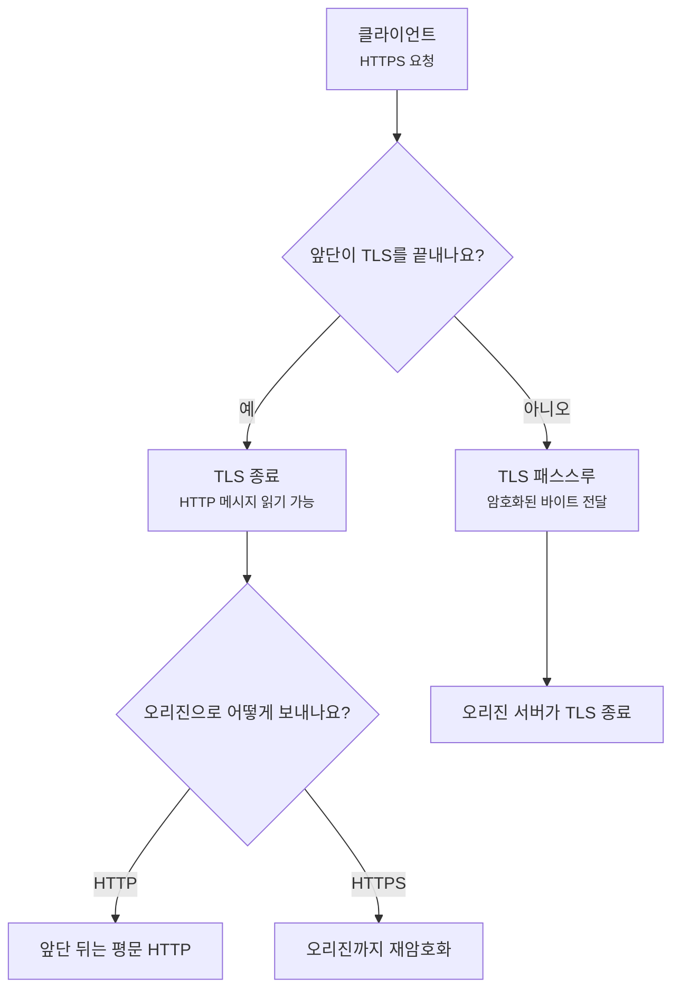
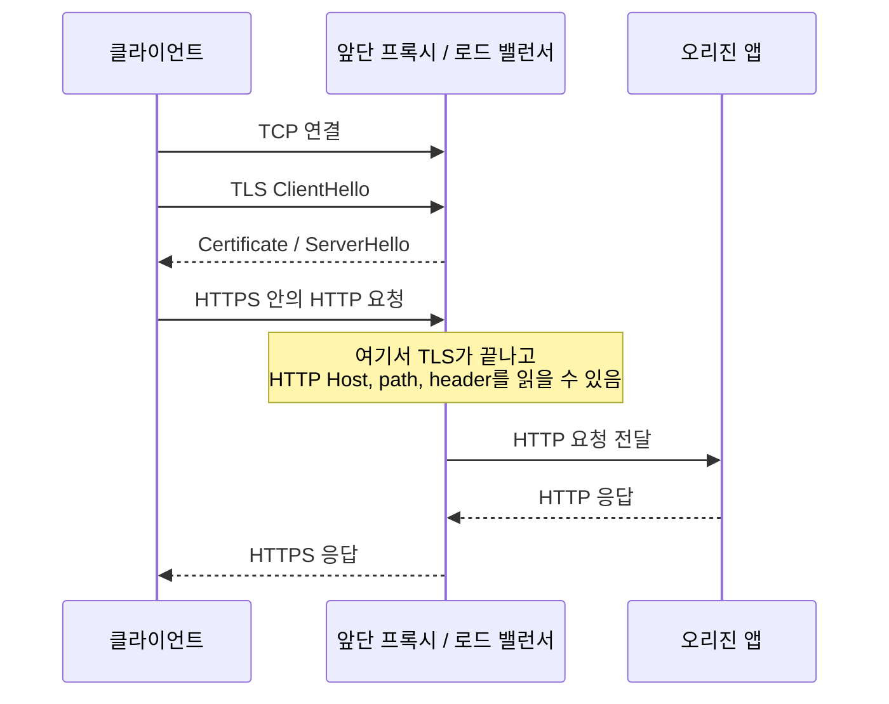
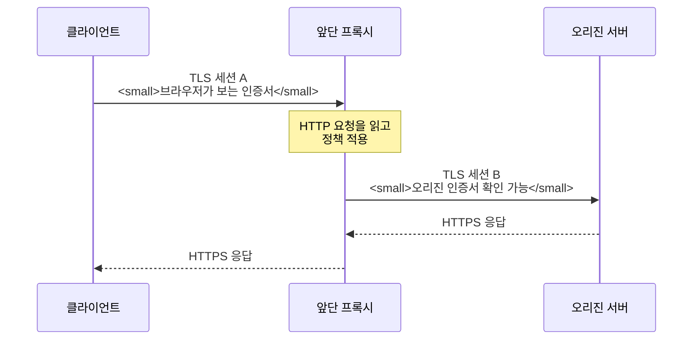
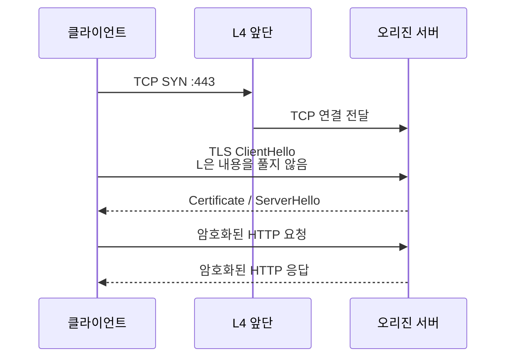

# TLS 종료와 TLS 패스스루는 어디서 갈라질까요?

> 앞단에 로드 밸런서가 있으면 HTTPS도 다 같은 방식으로 지나갈 것 같죠? **사실은 암호를 어디서 푸느냐에 따라 완전히 다른 장면이 돼요.**

[Proxy, Reverse Proxy, 그리고 Load Balancer](../basic/24-proxy-reverse-proxy-and-load-balancer.md){ data-preview }에서는 서버 앞단이 요청을 먼저 받고 뒤쪽 서버로 넘길 수 있다는 큰 그림을 봤어요. 그리고 [TLS, SSL, 인증서는 뭐가 다를까요?](../basic/07-tls-ssl-and-certificates.md){ data-preview }에서는 HTTPS가 TCP 연결 위에서 TLS 보호 통로를 만든 뒤 HTTP를 주고받는다는 감각을 잡았죠.

이번 글은 그 둘이 만나는 지점을 볼게요.

운영 설정을 보다 보면 이런 표현을 만나요.

```text
client --HTTPS--> load balancer --HTTP--> origin
client --HTTPS--> load balancer --HTTPS--> origin
client --TLS passthrough--> origin
```

셋 다 사용자는 `https://example.com`에 접속해요. 그런데 앞단이 HTTP path를 볼 수 있는지, 인증서를 어디에 설치해야 하는지, 오류가 어느 로그에 남는지는 달라져요.

오늘의 질문은 이거예요.

> *"HTTPS의 암호는 앞단에서 풀렸을까요, 아니면 뒤쪽 서버까지 그대로 갔을까요?"*

!!! note "이 글의 범위"
    여기서는 특정 제품 설정법보다 **TLS 종료(termination)**, **재암호화(re-encryption)**, **TLS 패스스루(passthrough)** 를 장애 해석과 라우팅 관점에서 읽어요. 실제 제품은 SNI 기반 TCP 라우팅, mTLS, PROXY protocol 같은 기능을 섞어 제공할 수 있으니, 이름보다 **어느 지점에서 TLS 세션이 끝나는지**를 먼저 보세요.

---

## 봉투를 안내 데스크에서 열 수도, 그대로 넘길 수도 있어요

회사 안내 데스크에 잠긴 봉투가 도착했다고 해볼게요.

- 안내 데스크가 열쇠를 가지고 있으면 봉투를 열어 내용을 읽고, 부서별로 다시 나눌 수 있어요.
- 안내 데스크가 열쇠를 가지고 있지 않으면 봉투 겉면만 보고 안쪽 담당자에게 그대로 넘겨야 해요.
- 안내 데스크가 봉투를 열어본 뒤, 안쪽 부서로 보낼 때 새 봉투에 다시 봉해서 보낼 수도 있어요.

HTTPS 앞단도 비슷해요.

| 봉투 장면 | 네트워크 장면 |
|---|---|
| 안내 데스크가 봉투를 열어봄 | 앞단에서 TLS 종료 |
| 편지 제목과 내용을 보고 부서 선택 | HTTP Host, path, header 기반 라우팅 |
| 다시 새 봉투로 봉해서 전달 | 앞단에서 오리진까지 재암호화 |
| 잠긴 봉투를 그대로 안쪽으로 전달 | TLS 패스스루 |
| 봉투 겉면의 수신자 이름만 봄 | SNI 같은 TLS ClientHello의 이름 신호 |

핵심은 **TLS가 어디서 한 번 끝났는지**예요. TLS가 끝난 지점은 HTTP 메시지를 평문으로 볼 수 있고, 그래서 L7 정책을 적용할 수 있어요. 반대로 TLS를 그대로 통과시키는 지점은 HTTP path나 header를 보지 못해요.



이 그림에서 "종료"는 연결이 끊긴다는 뜻이 아니에요. **클라이언트와 앞단 사이의 TLS 세션이 앞단에서 끝난다**는 뜻이에요. 그 뒤에는 앞단이 오리진과 별도의 HTTP 또는 HTTPS 연결을 만들 수 있어요.

## TLS 종료는 앞단이 HTTPS를 풀어 읽는 방식이에요

TLS 종료에서는 클라이언트가 앞단과 TLS 핸드셰이크를 해요. 브라우저가 보는 인증서도 앞단이 내밀어요.



이 방식에서는 앞단이 HTTP 요청을 읽을 수 있어요. 그래서 이런 일이 가능해져요.

| 앞단이 읽는 신호 | 가능한 정책 |
|---|---|
| `Host: shop.example.com` | 도메인별 오리진 선택 |
| `GET /api/orders` | `/api/*`는 API 서버 풀로 전달 |
| `Cookie: region=kr` | 지역별 서버 풀 선택 |
| `Header: x-canary: true` | 일부 요청만 카나리 서버로 전달 |
| 요청 body 크기 | 큰 업로드 제한, WAF 검사 |

이건 [L4와 L7 로드 밸런서](./l4-vs-l7-load-balancer.md){ data-preview }에서 본 L7 장면과 이어져요. HTTPS 요청의 Host, path, header는 TLS 안쪽에 있으니, 앞단이 그것을 기준으로 라우팅하려면 보통 TLS를 앞단에서 끝내야 해요.

```text
client  --TLS-->  edge-proxy  --HTTP-->  app:8080
                      |
                      +-- reads Host, path, headers
```

운영 관점에서는 장점이 분명해요.

- 인증서를 한 곳에서 관리하기 쉬워요.
- path 기반 라우팅, 리다이렉트, WAF, 압축, 캐시 같은 L7 기능을 앞단에서 적용할 수 있어요.
- 앱은 내부 HTTP로 단순하게 받을 수 있어요.
- 앞단이 `X-Forwarded-Proto: https`, `X-Forwarded-For` 같은 헤더를 붙여줄 수 있어요.

대신 주의할 점도 있어요. 앞단과 오리진 사이가 평문 HTTP라면, 내부 네트워크 구간을 어떻게 보호할지 별도로 판단해야 해요. 같은 VPC나 사설망이라고 해서 언제나 안전하다고 단정하면 안 돼요.

!!! warning "앞단 뒤가 HTTP이면 앱은 원래 요청이 HTTPS였는지 모를 수 있어요"
    TLS 종료 후 오리진으로 HTTP를 보내면 앱 입장에서는 내부 HTTP 요청처럼 보여요. 그래서 `X-Forwarded-Proto`나 표준 `Forwarded` 헤더를 올바르게 신뢰하지 않으면, 앱이 `http://` 리다이렉트를 만들거나 secure cookie 판단을 틀릴 수 있어요.

## 재암호화는 앞단에서 한 번 풀고, 뒤쪽으로 다시 HTTPS를 여는 방식이에요

TLS 종료라고 해서 앞단 뒤가 꼭 평문이어야 하는 건 아니에요. 앞단이 클라이언트와의 TLS를 끝낸 뒤, 오리진과 새 HTTPS 연결을 다시 만들 수도 있어요. 이걸 보통 **TLS 재암호화** 또는 **TLS re-encryption**이라고 불러요.



겉으로 보면 "끝까지 HTTPS"처럼 보이지만, 실제로는 TLS 세션이 두 개예요.

| 구간 | TLS 상대 | 인증서 기준 |
|---|---|---|
| 클라이언트 ↔ 앞단 | 브라우저와 앞단 | 사용자가 접속한 공개 도메인 인증서 |
| 앞단 ↔ 오리진 | 앞단과 오리진 | 내부 도메인 또는 오리진 도메인 인증서 |

이 방식의 장점은 두 가지를 같이 얻는 거예요.

- 앞단은 HTTP 요청을 읽고 L7 정책을 적용할 수 있어요.
- 앞단과 오리진 사이도 다시 암호화할 수 있어요.

대신 인증서와 검증 지점이 늘어나요. 브라우저가 보는 인증서가 멀쩡해도, 앞단이 오리진 인증서를 믿지 못하면 사용자에게는 502나 525 계열처럼 보이는 앞단 오류가 날 수 있어요. 제품마다 상태 코드는 다르지만, 원리는 같아요. **브라우저가 실패한 게 아니라, 앞단이 오리진과 새 TLS를 만들다 실패한 장면**일 수 있어요.

```text
client -> edge: TLS OK
edge -> origin: TLS verify failed
edge -> client: 502 Bad Gateway
```

이때 앱 로그에는 요청이 아예 안 남을 수도 있어요. 앞단이 오리진에 HTTP 요청을 보내기 전에 TLS 연결 만들기에서 멈췄기 때문이에요.

## TLS 패스스루는 앞단이 암호화된 연결을 그대로 넘기는 방식이에요

TLS 패스스루에서는 앞단이 HTTPS 내용을 풀지 않아요. 클라이언트가 최종 오리진 서버와 TLS 핸드셰이크를 하고, 앞단은 암호화된 바이트 흐름을 전달하는 쪽에 가까워요.



이 장면에서는 오리진이 인증서를 내밀어요. 앞단에는 공개 인증서와 개인키가 없어도 될 수 있어요. 그래서 규정상 키를 오리진 밖에 두기 어렵거나, 앞단이 HTTP를 알 필요가 없는 TCP 서비스라면 패스스루가 잘 맞을 수 있어요.

하지만 앞단이 HTTP를 읽지 않으니 할 수 없는 일도 분명해요.

| 하고 싶은 일 | TLS 패스스루에서 가능한가요? | 이유 |
|---|---:|---|
| `/api`와 `/static`을 path로 나누기 | 어려움 | path는 TLS 안쪽 HTTP 메시지예요 |
| HTTP header 기반 WAF | 어려움 | header를 복호화하지 않아요 |
| 오리진 대신 HTTP 301 리다이렉트 만들기 | 어려움 | HTTP 응답을 만들려면 내용을 알아야 해요 |
| SNI 이름으로 서버 풀 고르기 | 가능할 수 있음 | SNI는 ClientHello에 있는 이름 신호예요 |
| TCP 연결 분산 | 가능 | L4 흐름 전달은 가능해요 |

여기서 SNI가 살짝 헷갈릴 수 있어요. SNI는 TLS 핸드셰이크 초반의 ClientHello에 들어 있는 서버 이름 신호예요. 그래서 어떤 앞단은 TLS를 끝내지 않고도 SNI 값을 보고 `api.example.com`은 서버 A로, `www.example.com`은 서버 B로 보낼 수 있어요.

하지만 SNI는 HTTP path가 아니에요. `api.example.com`이라는 이름은 볼 수 있어도, 그 안쪽의 `/v1/orders` 같은 path는 TLS를 풀기 전에는 보통 볼 수 없어요.

!!! tip "패스스루에서는 Host와 path를 나눠 생각해요"
    SNI 기반 분기는 **TLS ClientHello의 이름**을 보는 거예요. HTTP `Host` 헤더나 path 기반 라우팅은 TLS 안쪽 HTTP 메시지를 읽어야 하므로, 보통 TLS 종료가 필요해요.

## 세 방식을 한 화면에서 비교해볼게요

운영 문서에서는 이름이 조금씩 다르게 쓰일 수 있어요. 그래서 단어보다 아래 질문으로 보면 덜 흔들려요.

> *"클라이언트의 TLS 세션이 어디서 끝났나요?"*

| 구분 | 앞단에서 TLS 종료 | 앞단 종료 + 재암호화 | TLS 패스스루 |
|---|---|---|---|
| 클라이언트 TLS 상대 | 앞단 | 앞단 | 오리진 |
| 앞단이 HTTP path/header를 읽나요? | 예 | 예 | 아니오 |
| 오리진으로 가는 구간 | HTTP | HTTPS | 같은 TLS 흐름 전달 |
| 공개 인증서 위치 | 앞단 | 앞단 | 오리진 |
| 오리진 인증서 필요 | 보통 필요 없음 | 필요 | 필요 |
| L7 라우팅/WAF/캐시 | 가능 | 가능 | 제한적 |
| 앞단-오리진 TLS 오류 | 없음 또는 별도 없음 | 가능 | 클라이언트가 직접 볼 수 있음 |
| 앱이 보는 remote address | 보통 앞단 주소 | 보통 앞단 주소 | 앞단 주소 또는 PROXY protocol 사용 |

이 표에서 "패스스루면 앱이 진짜 클라이언트 IP를 자동으로 본다"라고 생각하면 안 돼요. 앞단이 TCP를 중계하거나 NAT하면 오리진이 보는 상대 주소는 여전히 앞단일 수 있어요. 이때는 HTTP 헤더를 앞단이 붙이기 어렵기 때문에, 원래 클라이언트 주소를 전하려면 PROXY protocol 같은 별도 방식이 쓰이기도 해요.

[X-Forwarded 헤더](./x-forwarded-headers-and-client-ip.md){ data-preview }는 HTTP 요청을 읽고 수정할 수 있는 앞단에서 자주 쓰는 방식이에요. 패스스루처럼 HTTP를 열지 않는 구조에서는 그 헤더를 앞단이 자연스럽게 끼워 넣기 어렵다는 점을 같이 기억해두면 좋아요.

## 장애를 볼 때는 실패한 TLS가 어느 구간인지 먼저 나눠요

TLS 경계가 헷갈리면 인증서 오류나 502를 엉뚱한 곳에서 찾게 돼요.

예를 들어 사용자가 브라우저에서 인증서 이름 오류를 본다면 보통 클라이언트가 직접 본 인증서가 문제예요.

```text
브라우저: certificate name mismatch for www.example.com
```

TLS 종료 구조라면 이 인증서는 앞단이 내민 인증서예요. 오리진 인증서가 아니라 앞단 listener의 인증서, SNI 매칭, 도메인 설정을 먼저 봐야 해요.

반대로 사용자는 502만 보고, 앞단 로그에는 이런 식으로 남을 수 있어요.

```text
upstream TLS handshake failed: certificate verify failed
```

이건 클라이언트와 앞단 사이가 아니라, 앞단과 오리진 사이의 재암호화 구간에서 실패했을 가능성이 커요.

| 보이는 증상 | 먼저 볼 구간 | 자주 확인할 것 |
|---|---|---|
| 브라우저가 인증서 이름 불일치 경고 | 클라이언트 ↔ 앞단 또는 클라이언트 ↔ 오리진 | 공개 인증서 SAN, SNI, listener 도메인 |
| 앞단이 502를 만들고 앱 로그 없음 | 앞단 ↔ 오리진 | upstream 연결, 오리진 TLS 검증, 포트 |
| 특정 path만 404/502 | TLS 종료 후 L7 라우팅 | path rule, rewrite, upstream 선택 |
| SNI 도메인별로만 실패 | TLS ClientHello 기반 분기 | SNI rule, 기본 backend, 인증서 선택 |
| 앱이 `http://`로 리다이렉트 | TLS 종료 후 forwarded 정보 | `X-Forwarded-Proto`, trust proxy 설정 |
| 모든 사용자가 같은 IP로 보임 | 앞단과 앱 사이 | `X-Forwarded-For`, `Forwarded`, PROXY protocol |

여기서 핵심은 "TLS 오류"라는 말 하나로 끝내지 않는 거예요. 같은 TLS라도 클라이언트-앞단 구간인지, 앞단-오리진 구간인지, 아니면 오리진이 직접 끝내는 패스스루 구간인지에 따라 봐야 할 로그와 인증서가 달라져요.

## 설정 예시는 이렇게 읽어보면 돼요

다음은 실제 제품 문법이 아니라, 읽는 감각을 보여주기 위한 예시예요.

```text
listener :443
  tls_certificate: public-example-com
  route host=api.example.com path=/v1/* -> api_pool
  upstream api_pool protocol=http port=8080
```

이 설정은 앞단 TLS 종료에 가까워요. 앞단에 인증서가 있고, path를 기준으로 라우팅하며, 오리진으로는 HTTP를 보내고 있죠.

```text
listener :443
  tls_certificate: public-example-com
  route host=api.example.com path=/v1/* -> api_pool
  upstream api_pool protocol=https verify=on sni=api.internal.example
```

이건 앞단 종료 후 재암호화에 가까워요. 앞단이 path를 읽지만, 오리진으로 다시 HTTPS를 열고 인증서 검증까지 하고 있어요.

```text
listener :443
  mode: tcp
  route sni=api.example.com -> api_tls_pool:443
  route sni=www.example.com -> web_tls_pool:443
```

이건 패스스루 성격이 강해요. 앞단은 TCP/TLS 초반 신호를 보고 서버 풀을 고르지만, HTTP path를 읽는 설정은 없어요.

| 설정에 보이는 단어 | 읽는 힌트 |
|---|---|
| `tls_certificate`가 listener에 있음 | 앞단 TLS 종료 가능성이 큼 |
| `path`, `header`, `cookie` rule | HTTP를 읽는 L7 처리 |
| `upstream protocol=https` | 오리진으로 재암호화 가능성 |
| `mode: tcp` | L4 전달 또는 패스스루 가능성 |
| `sni=` rule | TLS 이름 기반 분기 |
| `proxy_protocol` | HTTP 헤더 없이 원래 연결 정보를 넘기려는 신호 |

물론 실제 제품에서는 단어가 다를 수 있어요. 그래도 읽는 순서는 같아요. **인증서가 어디 있고, HTTP 조건을 쓰는지, 오리진으로 어떤 프로토콜을 여는지**를 보면 구조가 보이기 시작해요.

## 잘못 읽기 쉬운 함정

### "끝까지 HTTPS"라는 말을 한 구간으로 생각하기

사용자 화면에서는 주소창이 계속 HTTPS예요. 하지만 내부에서는 클라이언트-앞단 TLS와 앞단-오리진 TLS가 분리될 수 있어요. 그래서 "끝까지 HTTPS"라고만 쓰인 문서를 보면, **한 TLS 세션이 끝까지 간다는 뜻인지**, **구간마다 HTTPS를 쓴다는 뜻인지**를 다시 확인해야 해요.

### TLS 종료를 하면 무조건 안전하지 않다고 보기

TLS 종료 자체가 나쁜 건 아니에요. 앞단에서 WAF, 라우팅, 캐시, 인증서 관리를 하기 위해 꼭 필요한 선택일 수 있어요. 다만 종료 지점 뒤쪽을 평문으로 둘지, 재암호화할지, 내부망 접근을 어떻게 제한할지는 별도 설계예요.

### 패스스루면 앞단이 아무것도 못 본다고 단정하기

패스스루에서는 HTTP 내용은 못 보지만, TCP 연결 정보나 SNI 같은 일부 TLS 초반 신호는 볼 수 있어요. 그래서 "아무것도 못 본다"보다 **HTTP 안쪽을 읽지 않는다**고 표현하는 편이 정확해요.

### 인증서 오류를 항상 오리진에서 찾기

TLS 종료 구조에서는 브라우저가 본 인증서가 앞단 인증서일 수 있어요. 반대로 재암호화 구조에서는 브라우저는 정상인데 앞단이 오리진 인증서를 못 믿어서 502를 만들 수도 있어요. 어떤 인증서가 누구에게 제시됐는지부터 나눠야 해요.

## 자, 정리해볼까요?

!!! abstract "오늘 우리가 배운 것"
    - **TLS 종료**는 클라이언트와 앞단 사이의 TLS를 앞단에서 끝내고, 그 안의 HTTP 요청을 읽을 수 있게 만드는 방식이에요.
    - **재암호화**는 앞단에서 HTTP를 읽은 뒤, 오리진과 별도의 HTTPS 연결을 다시 여는 방식이에요.
    - **TLS 패스스루**는 앞단이 HTTP 내용을 풀지 않고 암호화된 흐름을 오리진 쪽으로 넘기는 방식이에요.
    - path, header, cookie 기반 라우팅은 보통 TLS 종료가 필요하고, SNI 기반 분기는 패스스루에서도 가능할 수 있어요.
    - 인증서 오류와 502를 볼 때는 먼저 **어느 TLS 구간에서 실패했는지**를 나눠야 해요.

## 이어서 보면 좋은 글

- [L4와 L7 로드 밸런서는 무엇을 보고 나눠 보낼까요?](./l4-vs-l7-load-balancer.md){ data-preview } — TLS 경계가 L4/L7 판단과 어떻게 이어지는지 같이 보면 좋아요.
- [X-Forwarded 헤더에서 진짜 클라이언트 IP는 어떻게 읽을까요?](./x-forwarded-headers-and-client-ip.md){ data-preview } — TLS 종료 뒤 앱이 보는 scheme, host, client IP가 왜 달라지는지 이어서 볼 수 있어요.
- [TLS 인증서 체인과 신뢰 오류는 어떻게 읽어야 할까요?](./tls-cert-chain-and-trust-errors.md){ data-preview } — 인증서 오류가 이름, 만료, 체인, 신뢰 저장소 중 어디에서 멈췄는지 더 자세히 볼 수 있어요.
