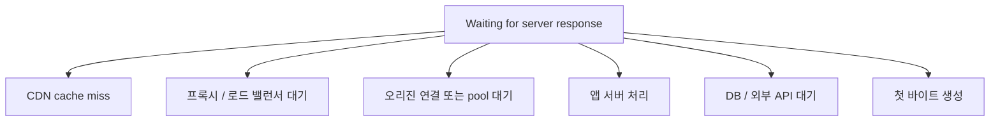
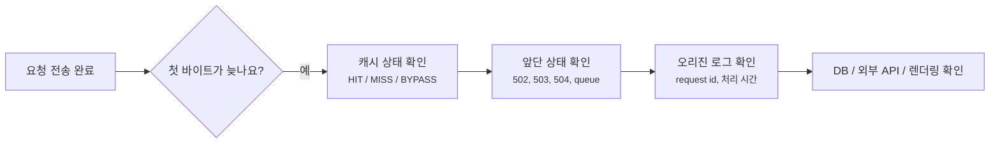
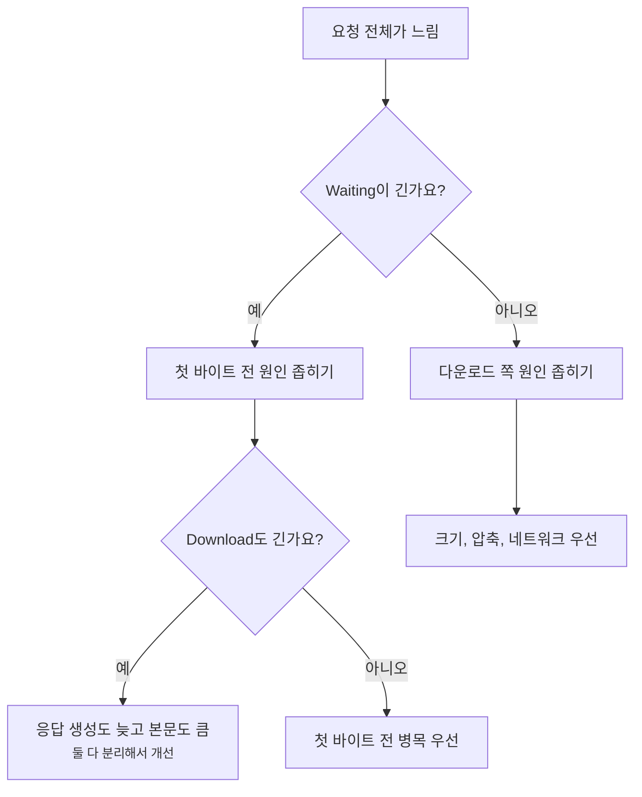
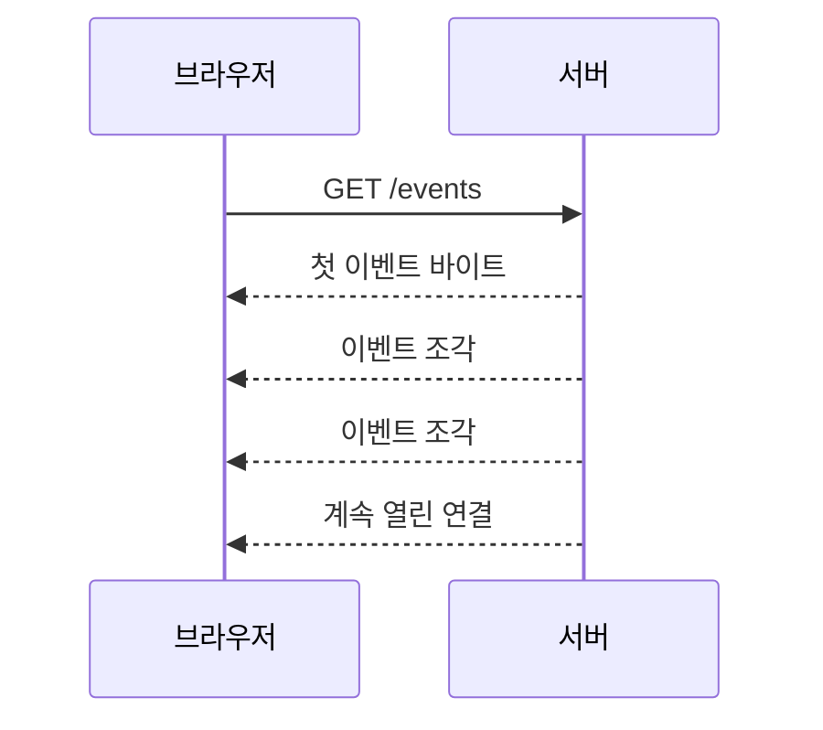

# TTFB와 Content Download는 어떻게 다르게 읽을까요?

> 요청이 2초 걸렸다고 해서 서버가 2초 동안 일한 건 아니에요. **첫 바이트를 기다린 시간과, 그 뒤 본문을 받은 시간은 다른 신호예요.**

[End-to-End Request Debugging](../basic/26-end-to-end-request-debugging.md){ data-preview }에서는 느린 요청 하나를 DNS, 연결, TLS, 프록시, 캐시, 오리진으로 나눠 읽는 큰 그림을 봤어요. 그리고 [브라우저 waterfall](./reading-browser-waterfall.md){ data-preview }에서는 `Waiting for server response`와 `Content Download`가 서로 다른 구간이라는 것도 봤죠.

근데요, 실제 운영 화면에서는 이런 식으로 한 줄만 보일 때가 많아요.

```text
GET /api/products   200   fetch   42 KB   1.24 s
```

이걸 보고 바로 이렇게 말하고 싶어져요.

> *"API가 1.24초나 걸렸으니 서버가 느리네요."*

그럴 수도 있어요. 하지만 아직은 몰라요.

- 첫 바이트가 늦게 왔나요?
- 첫 바이트는 빨랐는데 본문 다운로드가 길었나요?
- 압축된 크기는 작지만 압축 해제 뒤 본문이 컸나요?
- CDN은 바로 응답했는데 브라우저 쪽 네트워크가 느렸나요?
- 서버가 일부러 스트리밍하느라 오래 열린 요청인가요?

오늘은 이 질문을 하나로 줄여볼게요.

> *"이 요청은 첫 조각이 늦은 걸까요, 아니면 전체를 가져오는 데 오래 걸린 걸까요?"*

!!! note "이 글의 범위"
    여기서는 TTFB를 성능 점수처럼 외우기보다, 디버깅할 때 **첫 바이트 대기**와 **본문 다운로드**를 나눠 읽는 감각에 집중해요. 도구마다 정확한 측정 시작점은 조금 다를 수 있으니, 같은 도구 안에서 비교하는 습관이 중요해요.

---

## 식당에서 첫 음식이 늦은 것과 코스가 긴 것은 달라요

식당에 앉아서 주문했다고 해볼게요.

한 식당은 주문하고 20분 동안 아무것도 안 나와요. 그러다 첫 접시가 나오고, 나머지는 금방 끝나요.
다른 식당은 첫 접시는 1분 만에 나와요. 그런데 코스 요리가 계속 이어져서 전체 식사는 1시간이 걸려요.

둘 다 "오래 걸렸다"고 말할 수 있지만, 읽는 방식은 달라요.

| 식당 장면 | HTTP 요청 장면 |
|---|---|
| 주문을 넣음 | 요청을 보냄 |
| 첫 접시가 나오기 전까지 기다림 | 첫 바이트를 기다림, TTFB 감각 |
| 첫 접시가 나옴 | 응답의 첫 바이트가 도착함 |
| 나머지 코스가 이어짐 | 응답 본문을 다운로드함 |
| 계산까지 전체 시간 | 요청 전체 시간 |

그래서 느린 요청을 볼 때는 전체 시간 하나보다 아래 두 구간을 먼저 나눠요.


이 그림에서 `D`까지 오래 걸리면 **첫 바이트 대기 문제**에 가까워요. `D`에서 `E`까지 오래 걸리면 **본문 다운로드 문제**에 가까워요.

## 브라우저에서는 Waiting과 Content Download를 나눠 봐요

Chrome DevTools Network 패널에서 요청 하나를 누르고 Timing을 보면 이런 식의 구간이 보여요.

```text
Queueing                       4 ms
Stalled                        1 ms
DNS Lookup                     0 ms
Initial connection             0 ms
SSL                            0 ms
Request sent                   2 ms
Waiting for server response  820 ms
Content Download              18 ms
```

이 요청은 전체로 보면 약 `845 ms`예요. 하지만 핵심은 `Waiting for server response`가 `820 ms`이고, `Content Download`는 `18 ms`라는 점이에요.

처음에는 이렇게 읽으면 돼요.

| 브라우저 Timing | 먼저 묻는 질문 |
|---|---|
| `Request sent` | 요청 본문을 보내는 데 오래 걸렸나요? |
| `Waiting for server response` | 첫 바이트가 늦게 왔나요? |
| `Content Download` | 첫 바이트 이후 본문을 다 받는 데 오래 걸렸나요? |
| `Size` / `Transferred` | 실제로 받은 바이트가 큰가요? |
| `Status` / 응답 헤더 | 성공, 리다이렉트, 캐시, 프록시 신호가 무엇인가요? |

여기서 `Waiting for server response`는 브라우저가 첫 바이트를 기다린 시간이에요. 흔히 TTFB 감각과 연결해서 봐요. 다만 이 안에는 앱 코드 실행만 들어 있는 게 아니에요.



브라우저 밖에서는 하나의 긴 `Waiting`으로 보이지만, 안쪽에서는 여러 일이 섞였을 수 있어요. 그래서 `Waiting`이 길다는 건 좋은 출발점이지, 곧바로 "DB가 느리다"는 결론은 아니에요.

## curl에서는 누적 시간을 빼서 봐요

터미널에서는 [curl timing](./curl-verbose-and-timing.md){ data-preview }으로 비슷한 구간을 볼 수 있어요.

```bash
curl -sS -o /dev/null \
  -w 'pretransfer=%{time_pretransfer}
starttransfer=%{time_starttransfer}
total=%{time_total}
size=%{size_download}
speed=%{speed_download}
' \
  https://example.com/api/products
```

예를 들어 이런 값이 나왔다고 해볼게요.

```text
pretransfer=0.122000
starttransfer=0.945000
total=0.984000
size=43120
speed=50041
```

`time_starttransfer`는 시작부터 첫 바이트까지의 누적 시간이에요. 그래서 서버 응답 대기 감각을 보려면 `time_starttransfer - time_pretransfer`처럼 빼서 봐요.

| 보고 싶은 구간 | 계산 | 이 예시에서는 |
|---|---|---|
| 요청 준비 뒤 첫 바이트 대기 | `starttransfer - pretransfer` | 약 `823 ms` |
| 첫 바이트 뒤 다운로드 | `total - starttransfer` | 약 `39 ms` |
| 전체 시간 | `total` | 약 `984 ms` |

이 예시는 첫 바이트 쪽이 길고, 다운로드는 짧아요. 그래서 다음에 볼 곳은 파일 크기보다 **캐시 miss, 프록시 대기, 오리진 처리, DB, 외부 API** 쪽이에요.

반대로 이런 값이면 해석이 달라져요.

```text
pretransfer=0.118000
starttransfer=0.210000
total=3.460000
size=12840192
speed=3806412
```

첫 바이트는 약 `92 ms` 만에 왔어요. 그런데 전체 완료까지는 `3.46 s`예요. 이때는 서버가 첫 응답을 늦게 만든 문제가 아니라, **본문이 크거나 다운로드 경로가 느린 문제** 쪽으로 의심이 옮겨가요.

!!! warning "curl과 브라우저 숫자를 그대로 1:1 비교하면 안 돼요"
    브라우저는 쿠키, 캐시, Service Worker, 연결 재사용, HTTP/2/3 멀티플렉싱, 우선순위의 영향을 받아요. curl은 더 단순한 조건으로 요청할 수 있어요. 같은 URL이라도 두 도구의 조건을 맞추지 않으면 숫자가 달라질 수 있어요.

## TTFB가 길 때는 첫 바이트 앞쪽을 봐요

이런 Timing을 만났다고 해볼게요.

```text
Request sent                   1 ms
Waiting for server response 1850 ms
Content Download              12 ms
```

이 요청은 본문을 받는 데 오래 걸린 게 아니에요. 첫 바이트가 늦게 온 거예요.



먼저 볼 신호는 이런 것들이에요.

| 신호 | 왜 보나요? |
|---|---|
| `Status` | 성공인지, 앞단 오류인지, 리다이렉트인지 나눠요 |
| CDN cache status | `HIT`, `MISS`, `BYPASS`, `STALE`에 따라 경로가 달라져요 |
| `Age` | 캐시 사본인지, 방금 오리진에서 온 응답인지 감을 잡아요 |
| `Server-Timing` | 서버나 CDN이 내부 단계 시간을 알려주는지 봐요 |
| request id | 브라우저 요청과 서버 로그를 연결할 단서예요 |
| 오리진 로그 처리 시간 | 실제 앱 처리와 바깥에서 본 TTFB를 비교해요 |

예를 들어 브라우저에서 `Waiting`이 `1850 ms`인데 앱 로그에는 처리 시간이 `40 ms`라면, 앱 함수 자체보다 앞단 queue, 오리진 연결, CDN과 오리진 사이, 로그에 찍히기 전 구간을 의심해야 해요.

반대로 앱 로그도 `1800 ms`라면 이제 DB, 외부 API, 렌더링, lock, cold start 같은 안쪽 원인을 볼 차례예요.

## Content Download가 길 때는 첫 바이트 뒤쪽을 봐요

이번에는 이런 Timing이에요.

```text
Request sent                    1 ms
Waiting for server response    70 ms
Content Download             2400 ms
```

첫 바이트는 빨리 왔어요. 그런데 본문을 다 받는 데 오래 걸렸어요.

이때는 질문이 달라져요.

| 먼저 볼 것 | 묻는 질문 |
|---|---|
| `Size` / `Transferred` | 실제로 받은 데이터가 큰가요? |
| `Content-Encoding` | gzip, br, zstd 같은 압축이 적용됐나요? |
| `Content-Type` | 이미지, 영상, JSON, HTML 중 무엇인가요? |
| `Content-Length` | 전체 크기를 미리 알 수 있나요? |
| `Transfer-Encoding: chunked` | 조각으로 나눠 보내는 응답인가요? |
| Network throttling | 내가 느린 네트워크 조건으로 보고 있나요? |

예를 들어 큰 이미지나 JSON 응답이라면 `Content Download`가 긴 게 자연스러울 수 있어요.

```http
HTTP/2 200
Content-Type: application/json
Content-Encoding: br
Content-Length: 12840192
```

여기서는 오리진이 첫 바이트를 늦게 만든 것보다 **응답 자체가 크고, 사용자의 네트워크로 그 크기를 옮기는 데 시간이 걸린 것**에 가까워요. 다음 행동도 달라져야 해요. DB 쿼리를 먼저 뒤지기보다 페이지네이션, 필드 축소, 이미지 포맷, 압축, CDN 위치, lazy loading을 봐야 할 수 있어요.

## 둘 다 길면 경계부터 다시 잡아요

가끔은 둘 다 길어요.

```text
Waiting for server response 1300 ms
Content Download            1800 ms
```

이때는 "서버도 느리고 다운로드도 느리다"가 맞을 수 있어요. 하지만 그래도 순서를 잡아야 해요.



핵심은 한 번에 모든 걸 "느림"으로 묶지 않는 거예요. 첫 바이트 전과 후는 담당 팀, 로그, 해결책이 달라질 수 있어요.

| 긴 구간 | 자주 이어지는 확인 |
|---|---|
| `Waiting`만 김 | 캐시 miss, 앞단 queue, 오리진 처리, DB, 외부 API |
| `Content Download`만 김 | 응답 크기, 압축, 이미지/영상, 사용자 네트워크 |
| 둘 다 김 | 서버가 큰 응답을 늦게 만들고, 전송도 오래 걸리는 복합 문제 |
| 둘 다 짧은데 체감이 느림 | 렌더링, JavaScript 실행, 요청 의존성, 브라우저 main thread |

마지막 줄도 중요해요. 네트워크 요청이 빨리 끝났는데 화면이 늦게 보이면, 더 이상 Network waterfall만 볼 문제가 아닐 수 있어요.

## 스트리밍 응답은 일부러 다운로드가 길 수 있어요

`Content Download`가 길다고 항상 나쁜 건 아니에요.

예를 들어 Server-Sent Events, 긴 파일 다운로드, 동영상, 큰 로그 export, AI 응답 스트리밍처럼 **오래 열려 있는 게 의도인 응답**이 있어요.

```http
HTTP/2 200
Content-Type: text/event-stream
Cache-Control: no-cache
```

이런 요청은 첫 바이트가 빨리 오고, 그 뒤 연결이 오래 유지되는 게 정상일 수 있어요.



그래서 `Content Download`가 길면 먼저 응답의 성격을 봐야 해요. 문서 HTML이 8초 다운로드되는 것과, 이벤트 스트림이 8분 열려 있는 것은 전혀 다른 장면이에요.

## 잘못 읽기 쉬운 함정

### TTFB를 서버 코드 실행 시간으로 보기

TTFB 감각에는 요청이 서버 코드에 도착하기 전의 CDN, 프록시, queue, 오리진 연결, 캐시 miss가 섞일 수 있어요. 서버 코드 실행 시간과 같다고 단정하면 안 돼요.

### Content Download가 길면 서버가 늦게 만든다고 보기

첫 바이트는 이미 왔어요. 이 구간은 본문 크기, 압축, 네트워크, 스트리밍 방식과 더 가까울 수 있어요.

### TTFB가 빠르면 페이지가 빠르다고 보기

첫 바이트가 빠른 건 좋은 신호지만, 큰 JavaScript 다운로드, 느린 렌더링, 뒤늦은 API 요청 때문에 사용자는 여전히 느리게 느낄 수 있어요.

### 압축 전 크기와 전송 크기를 섞어 보기

브라우저는 전송된 크기와 리소스 크기를 다르게 보여줄 수 있어요. `Content-Encoding`이 있으면 네트워크로 받은 크기와 브라우저가 다루는 크기가 달라질 수 있어요.

### 스트리밍 요청을 일반 API처럼 평가하기

SSE, 파일 다운로드, 동영상, export, chunked 응답은 오래 열려 있는 것이 의도일 수 있어요. 이런 요청은 "언제 첫 바이트가 왔는지"와 "왜 계속 열려 있는지"를 따로 봐야 해요.

## 예시로 같이 읽어볼게요

### 1. API 첫 바이트가 늦은 경우

```text
Name                 Status   Type   Size    Time
/api/products        200      fetch  42 KB   1.02 s

Timing:
Request sent                   2 ms
Waiting for server response  980 ms
Content Download              38 ms
```

이건 다운로드보다 첫 바이트 대기가 길어요. 응답 헤더에서 cache status, request id, Server-Timing을 보고, 같은 request id로 오리진 로그를 찾는 쪽이 먼저예요.

### 2. 이미지 다운로드가 긴 경우

```text
Name                 Status   Type   Size      Time
hero.jpg             200      image  4.8 MB    3.30 s

Timing:
Waiting for server response   80 ms
Content Download            3200 ms
```

첫 바이트는 빠른 편이에요. 여기서는 이미지 크기, 포맷, 압축, CDN 위치, lazy loading, responsive image 설정을 봐야 해요.

### 3. HTML이 늦고 크기도 큰 경우

```text
Name                 Status   Type       Size      Time
document             200      document   1.6 MB    2.90 s

Timing:
Waiting for server response 1200 ms
Content Download            1600 ms
```

이건 두 문제가 같이 있을 수 있어요. 서버가 HTML을 늦게 만들고, 만들어진 HTML도 큽니다. 이때는 오리진 렌더링 시간과 HTML 크기 개선을 분리해서 봐야 해요.

### 4. 스트리밍 API가 오래 열린 경우

```text
Name                 Status   Type   Size      Time
/api/stream          200      fetch  18 KB     45.00 s

Timing:
Waiting for server response 120 ms
Content Download          44880 ms
```

일반 API라면 이상하지만, 스트리밍 응답이라면 정상일 수 있어요. 이때는 전체 시간이 길다는 사실보다 첫 이벤트가 빨리 왔는지, 연결이 의도대로 유지되는지, 중간에 끊기지 않는지를 봐야 해요.

## 자, 정리해볼까요?

!!! abstract "오늘 우리가 배운 것"
    - 전체 요청 시간이 길어도, 첫 바이트 전이 긴지 첫 바이트 뒤가 긴지에 따라 의미가 달라져요.
    - 브라우저에서는 `Waiting for server response`와 `Content Download`를 먼저 나눠 읽어요.
    - curl에서는 `time_starttransfer - time_pretransfer`와 `time_total - time_starttransfer`처럼 누적 시간을 빼서 구간을 봐요.
    - `Waiting`이 길면 캐시 miss, 앞단 대기, 오리진 처리, DB, 외부 API 같은 첫 바이트 전 원인을 좁혀요.
    - `Content Download`가 길면 응답 크기, 압축, 네트워크, 이미지/영상, 스트리밍 여부를 먼저 봐요.
    - TTFB는 서버 코드 실행 시간과 같지 않고, 다운로드 시간은 서버 처리 시간과 같지 않아요.

느린 요청을 볼 때 가장 먼저 할 일은 전체 시간을 탓하는 게 아니에요. **첫 바이트 전과 후를 갈라서, 다음에 볼 화면을 정확히 고르는 것**이에요.

## 이어서 보면 좋은 글

- [브라우저 waterfall은 어디부터 읽어야 할까요?](./reading-browser-waterfall.md){ data-preview } — Timing 탭의 다른 구간까지 함께 읽고 싶을 때 좋아요.
- [curl verbose와 timing은 어디부터 읽어야 할까요?](./curl-verbose-and-timing.md){ data-preview } — 같은 요청을 터미널 숫자로 쪼개 보는 방법을 이어서 볼 수 있어요.
- [Connection reuse, Keep-Alive, Pooling은 왜 같이 봐야 할까요?](./connection-reuse-keepalive-and-pooling.md){ data-preview } — `Waiting`이 길지만 앱 로그가 짧을 때 앞단과 오리진 사이 연결을 같이 볼 수 있어요.
- [CDN Cache Status 헤더는 어떻게 읽어야 할까요?](./cdn-cache-status-headers.md){ data-preview } — 첫 바이트 대기가 캐시 hit, miss, bypass와 어떻게 이어지는지 같이 읽어봐요.
