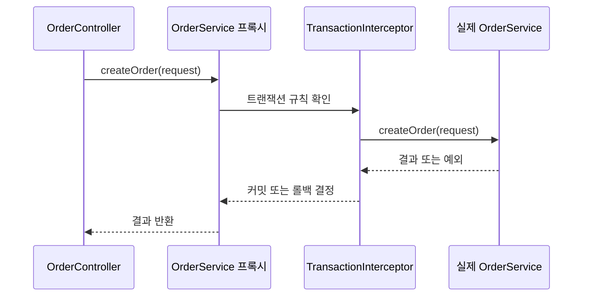
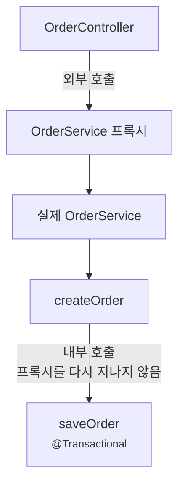
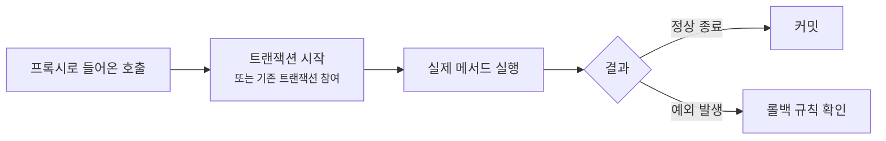
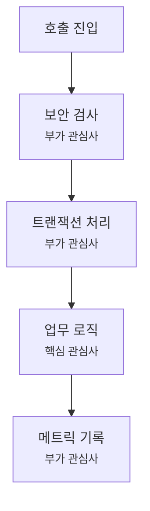

# AOP 프록시와 Annotation은 왜 기대와 다르게 동작할까요?

> `@Transactional`을 붙였는데, 왜 어떤 호출에서는 트랜잭션이 안 걸릴까요?

지난 글에서는 의존성 주입(dependency injection)을 실제 코드에서 읽어봤어요. 이제 우리는 이런 흐름을 알고 있죠.

1. 내가 만든 클래스가 빈(bean)으로 등록돼요.
2. ApplicationContext가 그 빈을 만들어요.
3. 필요한 다른 빈을 생성자에 넣어줘요.

그런데 Spring 코드를 읽다 보면 더 이상한 장면이 나와요.

```java
@Service
class OrderService {

    @Transactional
    void createOrder(OrderRequest request) {
        // 주문 저장
        // 결제 요청
    }
}
```

겉으로 보면 Annotation 하나를 붙였을 뿐이에요. 그런데 실제로는 데이터베이스 트랜잭션이 시작되고, 예외가 나면 롤백되고, 메서드가 끝나면 커밋돼요.

여기서 질문이 생겨요.

> "Annotation이 메서드를 실행하나요?"  
> "트랜잭션 시작 코드는 어디에 있나요?"  
> "같은 클래스 안에서 메서드를 호출하면 왜 안 먹는다고 하죠?"  
> "`private` 메서드에 붙이면 왜 기대한 대로 안 되죠?"

오늘은 Spring AOP와 프록시(proxy)를 볼게요. 목표는 AOP 용어를 많이 외우는 게 아니에요. **Annotation이 붙은 메서드를 누가 가로채는지**, **어떤 호출이 프록시를 통과하는지**, **어떤 호출은 그냥 Java 메서드 호출로 끝나는지**를 구분하는 거예요.

!!! note "이 글의 기준"
    이 글은 Spring Framework 공식 문서의 AOP 프록시, self-invocation, 선언적 트랜잭션(declarative transaction management), `@Transactional` 설명을 확인해 작성했어요. 여기서는 Spring Boot 앱에서 가장 자주 만나는 프록시 기반 AOP를 중심으로 설명할게요. AspectJ weaving처럼 바이트코드 수준으로 엮는 방식은 다른 글감이라, 이 글에서는 비교만 짧게 언급해요.

---

## 먼저 실패하기 쉬운 주문 코드를 볼게요

주문 서비스에 "주문 생성"과 "주문 저장" 메서드가 있다고 해볼게요.

```java
package com.example.order;

import org.springframework.stereotype.Service;
import org.springframework.transaction.annotation.Transactional;

@Service
class OrderService {

    void createOrder(OrderRequest request) {
        validate(request);
        saveOrder(request);
    }

    @Transactional
    void saveOrder(OrderRequest request) {
        // 주문 저장
        // 재고 차감
    }

    private void validate(OrderRequest request) {
        // 주문 검증
    }
}
```

처음 보면 `saveOrder(...)`에 `@Transactional`이 있으니, `createOrder(...)`에서 호출해도 트랜잭션이 걸릴 것 같아요.

하지만 프록시 기반 AOP에서는 기대와 다를 수 있어요. 이유는 `createOrder(...)`가 같은 객체 안의 `saveOrder(...)`를 직접 호출하기 때문이에요.

이 장면을 이해하려면 Annotation을 "버튼"처럼 보면 안 돼요. `@Transactional`은 메서드 안에 자동으로 트랜잭션 코드를 끼워 넣는 버튼이 아니에요. Spring이 시작할 때 이 정보를 보고, 해당 빈 앞에 프록시를 세울 수 있게 해주는 표시예요.

---

## 프록시는 진짜 객체 앞에 서 있는 대리 객체예요

프록시(proxy)는 진짜 객체 앞에 서서 호출을 먼저 받는 대리 객체예요.

컨트롤러가 `OrderService`를 주입받는다고 해볼게요.

```java
@RestController
class OrderController {

    private final OrderService orderService;

    OrderController(OrderService orderService) {
        this.orderService = orderService;
    }

    @PostMapping("/orders")
    void create(@RequestBody OrderRequest request) {
        orderService.createOrder(request);
    }
}
```

`OrderController`가 받은 객체는 우리가 생각한 `OrderService` 원본 객체일 수도 있지만, AOP가 필요한 경우에는 Spring이 만든 프록시일 수 있어요.



이 그림에서 핵심은 컨트롤러가 실제 서비스 객체를 바로 부르지 않는다는 점이에요. 호출이 프록시를 먼저 지나가면, 프록시가 "이 메서드에 트랜잭션을 적용해야 하나?"를 확인하고 실제 객체를 호출할 수 있어요.

처음에는 이렇게 잡으면 충분해요.

> AOP는 메서드 호출 앞뒤에 공통 동작을 붙이는 방식이고, Spring의 기본적인 AOP 동작은 프록시가 그 호출을 가로채면서 시작돼요.

여기서 공통 동작은 트랜잭션만이 아니에요. 보안 검사, 캐시 처리, 재시도, 로깅, 메트릭 기록도 비슷한 방식으로 붙을 수 있어요. 다만 이 글에서는 가장 많이 만나는 `@Transactional`을 중심으로 볼게요.

---

## Annotation은 실행 코드가 아니라 힌트에 가까워요

`@Transactional`을 보면 메서드 안에 무언가 들어간 것처럼 느껴져요.

```java
@Transactional
void saveOrder(OrderRequest request) {
    orderRepository.save(request.toOrder());
}
```

하지만 이 Annotation 자체가 `saveOrder(...)` 안에서 실행되는 건 아니에요. 조금 더 정확히 말하면, 이 Annotation은 Spring에게 이런 정보를 줘요.

> "이 메서드가 프록시를 통해 호출되면, 트랜잭션 규칙을 적용해 주세요."

그래서 실제 흐름은 대략 이렇게 나뉘어요.

| 개발자가 작성한 것 | Spring이 준비하는 것 |
|---|---|
| `@Transactional` 표시 | 트랜잭션을 적용할 메서드 정보 |
| `OrderService` 빈 | 필요하면 프록시로 감싼 빈 |
| `orderService.createOrder(...)` 호출 | 프록시를 통과하는 호출이면 트랜잭션 interceptor 실행 |
| 메서드 실행 중 예외 | rollback 규칙 확인 |
| 메서드 정상 종료 | commit 진행 |

이 구분이 중요해요. Annotation이 붙어 있다는 사실만으로 모든 호출이 자동으로 바뀌는 게 아니에요. **호출이 프록시를 지나가야** Spring이 앞뒤 동작을 붙일 수 있어요.

---

## self-invocation은 프록시를 우회해요

이제 처음 코드를 다시 볼게요.

```java
@Service
class OrderService {

    void createOrder(OrderRequest request) {
        validate(request);
        saveOrder(request);
    }

    @Transactional
    void saveOrder(OrderRequest request) {
        // 주문 저장
        // 재고 차감
    }
}
```

`OrderController`가 `createOrder(...)`를 호출할 때는 프록시를 지나갈 수 있어요. 그런데 `createOrder(...)` 안에서 `saveOrder(...)`를 부르는 순간은 다르죠.

그 호출은 이미 실제 `OrderService` 객체 안에 들어온 뒤에 일어나요. Java 입장에서는 그냥 `this.saveOrder(request)`에 가까운 내부 호출이에요.



이 그림에서 `createOrder(...)`까지는 프록시가 볼 수 있어요. 하지만 `createOrder(...)` 안에서 같은 객체의 `saveOrder(...)`를 부르는 장면은 프록시 바깥에서 새로 들어오는 호출이 아니에요.

이걸 self-invocation(자기 호출)이라고 불러요.

처음에는 이상해 보여도, 원리는 단순해요.

> 프록시는 문 앞에 서 있어요. 이미 방 안에 들어온 사람이 방 안에서 다른 책상을 찾아가는 움직임까지 문 앞 프록시가 다시 막아설 수는 없어요.

이 비유를 Spring으로 다시 옮기면 이렇습니다. 프록시 기반 AOP는 **빈 바깥에서 프록시를 통해 들어오는 메서드 호출**을 가로채요. 같은 객체 내부에서 일어나는 호출은 보통 가로채지 못해요.

---

## 해결은 "프록시를 억지로 부르기"보다 경계를 다시 잡는 거예요

self-invocation 문제를 보면 이런 생각이 들 수 있어요.

> "그럼 자기 자신의 프록시를 주입받아서 부르면 되나요?"

기술적으로 그런 방식이 가능할 때도 있어요. Spring 문서에도 자기 참조를 주입하거나 `AopContext.currentProxy()`를 쓰는 방식이 나오죠. 하지만 문서도 `AopContext.currentProxy()` 방식은 피하는 편이 좋다고 설명해요. 클래스가 Spring AOP에 강하게 묶이고, 코드가 왜 그렇게 생겼는지 읽기 어려워지기 때문이에요.

실무에서는 먼저 경계를 다시 보는 편이 좋아요.

### 1. 트랜잭션 경계를 외부 진입 메서드에 둬요

대부분의 서비스에서는 호출자가 실제로 쓰는 public 업무 메서드에 트랜잭션을 두는 편이 자연스러워요.

```java
@Service
class OrderService {

    @Transactional
    void createOrder(OrderRequest request) {
        validate(request);
        saveOrder(request);
    }

    private void saveOrder(OrderRequest request) {
        // 주문 저장
        // 재고 차감
    }
}
```

이 구조에서는 컨트롤러가 `createOrder(...)`를 호출할 때 프록시를 통과하고, 트랜잭션 안에서 검증과 저장이 함께 실행돼요.

좋은 질문은 "어느 작은 메서드에 Annotation을 붙일까?"가 아니라 "업무적으로 하나의 트랜잭션이어야 하는 경계가 어디인가?"예요.

### 2. 정말 다른 트랜잭션 경계라면 다른 빈으로 분리해요

어떤 작업은 의도적으로 별도 트랜잭션이어야 할 수 있어요. 예를 들어 주문 저장과 감사 로그 저장을 다른 경계로 다루고 싶다고 해볼게요.

```java
@Service
class OrderService {

    private final AuditService auditService;

    OrderService(AuditService auditService) {
        this.auditService = auditService;
    }

    @Transactional
    void createOrder(OrderRequest request) {
        // 주문 저장
        auditService.record("ORDER_CREATED");
    }
}
```

```java
@Service
class AuditService {

    @Transactional
    void record(String message) {
        // 감사 로그 저장
    }
}
```

이제 `OrderService`에서 `AuditService`로 넘어가는 호출은 다른 빈으로 향하는 외부 호출이에요. Spring이 `AuditService` 프록시를 세웠다면 그 경계를 가로챌 수 있어요.

물론 빈을 나누는 이유가 단지 "프록시를 타게 하려고"만이면 냄새가 날 수 있어요. 하지만 트랜잭션 경계, 책임 경계, 재사용 경계가 실제로 다르다면 분리는 자연스러운 선택이에요.

!!! warning "프록시를 우회하는 코드는 조용히 틀릴 수 있어요"
    self-invocation 문제는 앱 시작 실패처럼 크게 터지지 않을 수 있어요. 코드가 실행은 되는데 트랜잭션, 캐시, 보안, 재시도 같은 부가 동작만 빠질 수 있어서 더 위험해요.

---

## `private`, `final`, 내부 호출은 AOP 경계와 잘 맞지 않아요

프록시 기반 AOP를 이해하면 몇 가지 코드 리뷰 기준이 생겨요.

```java
@Service
class OrderService {

    @Transactional
    private void saveOrder(OrderRequest request) {
        // ...
    }
}
```

`private` 메서드는 외부 객체가 호출할 수 없어요. 그러면 프록시를 통해 "밖에서 들어오는 호출"을 만들 수 없어요. 따라서 이런 위치에 `@Transactional`을 붙이는 것은 대부분 기대한 의미가 아니에요.

`final`도 조심해야 해요.

```java
@Service
final class OrderService {

    @Transactional
    void createOrder(OrderRequest request) {
        // ...
    }
}
```

프록시를 만드는 방식에 따라 다르지만, 클래스 기반 프록시는 보통 대상 클래스를 상속해서 동작해요. `final` 클래스나 `final` 메서드는 상속이나 오버라이드가 막히기 때문에 AOP 적용에 제약이 생길 수 있어요.

그래서 Spring 서비스 코드에서는 보통 이런 기준으로 시작하는 게 안전해요.

| 코드 모양 | 읽는 방법 |
|---|---|
| 외부에서 호출되는 서비스 메서드에 `@Transactional` | 가장 흔하고 읽기 쉬운 경계예요 |
| 같은 클래스 내부에서 Annotation 붙은 메서드 호출 | self-invocation을 의심해요 |
| `private` 메서드에 `@Transactional` | 프록시가 호출을 가로채기 어려운 위치예요 |
| `final` 클래스 또는 `final` 메서드 | 프록시 방식에 따라 AOP 적용 제약을 확인해야 해요 |
| Annotation이 붙었는데 테스트에서는 기대와 다름 | 테스트가 Spring 컨텍스트와 프록시를 띄우는지 확인해요 |

이 표는 모든 버전과 모든 프록시 방식을 한 줄로 끝내려는 규칙표가 아니에요. 다만 초보자가 실무 코드를 볼 때 "이 Annotation이 실제 호출 경계에 있나?"를 먼저 묻게 해주는 체크리스트예요.

---

## JDK 동적 프록시와 CGLIB은 "어떤 껍데기를 만들까"의 차이예요

프록시라는 말이 나오면 곧바로 이런 질문도 생겨요.

> "프록시는 정확히 어떤 클래스로 만들어지나요?"

Spring AOP에서 자주 만나는 프록시 방식은 크게 두 가지예요.

| 방식 | 거칠게 말하면 | 주의할 점 |
|---|---|---|
| JDK 동적 프록시 | 인터페이스를 기준으로 프록시를 만들어요 | 인터페이스에 드러난 호출 경계를 중심으로 봐야 해요 |
| CGLIB 클래스 프록시 | 클래스를 상속한 프록시를 만들어요 | `final` 클래스나 `final` 메서드 같은 상속 제약을 조심해요 |

Spring Boot를 쓰면 이 선택을 매번 직접 만지는 경우는 많지 않아요. 중요한 건 "둘 중 무엇이 더 멋진가"가 아니에요.

실무에서 더 중요한 질문은 이거예요.

> "내가 기대한 부가 동작이 실제 호출 경계에서 프록시를 통과하나요?"

프록시 구현 방식은 그다음 확인 사항이에요. 디버깅 중에 실제 객체 타입을 찍어보면 클래스 이름에 프록시 흔적이 보이거나, 디버거에서 원본 객체 앞에 다른 객체가 서 있는 모양을 볼 수 있어요. 그때 "아, 이 빈은 원본을 바로 받은 게 아니라 프록시를 받은 거구나"라고 읽으면 돼요.

---

## 트랜잭션은 메서드 실행 앞뒤의 경계예요

`@Transactional`을 처음 배우면 이렇게 기억하기 쉬워요.

> "DB 작업을 묶어줘요."

맞는 말이에요. 하지만 실무에서는 한 문장을 더 붙여야 해요.

> "프록시를 통과한 메서드 호출의 앞뒤에서 트랜잭션을 시작하고 끝내요."



이 그림은 트랜잭션이 메서드 본문 안쪽 한 줄이 아니라, 메서드 호출을 감싸는 경계라는 점을 보여줘요. 그래서 경계가 어디에 있느냐가 중요해요.

예외 처리도 이 경계와 연결돼요.

```java
@Transactional
void createOrder(OrderRequest request) {
    orderRepository.save(request.toOrder());

    try {
        paymentClient.pay(request.payment());
    } catch (PaymentException ex) {
        // 그냥 로그만 남기고 삼켜버림
    }
}
```

이 코드는 "결제가 실패하면 주문 저장도 롤백되겠지"라고 기대하면 위험해요. 예외를 잡아서 밖으로 던지지 않으면, 프록시는 메서드가 정상 종료된 것처럼 볼 수 있어요. 그러면 트랜잭션 rollback 규칙이 기대와 다르게 적용될 수 있죠.

물론 실제 rollback 여부는 예외 종류, rollback 규칙, 트랜잭션 전파(propagation), 사용하는 데이터 접근 기술에 따라 달라져요. 이 글에서 전부 다루지는 않을게요. 지금은 이것만 잡으면 돼요.

> 트랜잭션은 Annotation이 붙은 줄이 아니라, 프록시가 볼 수 있는 메서드 호출 경계에서 결정돼요.

---

## AOP는 "공통 관심사"를 바깥 경계에 붙이는 도구예요

AOP(Aspect-Oriented Programming)는 관점 지향 프로그래밍이라고 불려요. 이름이 어렵지만, Spring Boot 앱에서는 먼저 이렇게 보면 좋아요.

> 여러 업무 코드에 반복해서 끼어드는 공통 동작을, 업무 코드 바깥의 호출 경계에 붙이는 방식.

예를 들어 주문 생성 코드에 이런 것들이 섞이면 금방 지저분해져요.

```java
void createOrder(OrderRequest request) {
    long start = System.nanoTime();
    securityChecker.check();
    transactionManager.begin();

    try {
        orderRepository.save(request.toOrder());
        transactionManager.commit();
    } catch (RuntimeException ex) {
        transactionManager.rollback();
        throw ex;
    } finally {
        metrics.record(System.nanoTime() - start);
    }
}
```

이 코드는 트랜잭션, 보안, 메트릭, 업무 로직이 한 메서드에 엉켜 있어요. Spring AOP는 이런 반복되는 부가 동작을 바깥으로 빼서, 업무 메서드 호출 앞뒤에 적용할 수 있게 해줘요.



이 그림에서 업무 로직은 가운데에 있어요. AOP는 주변에 붙는 부가 동작을 한곳에서 관리하게 해주지만, 그만큼 "어느 호출 경계에 붙었는지"를 정확히 봐야 해요.

!!! tip "AOP를 읽는 질문"
    Annotation을 보면 먼저 "이 Annotation은 어떤 부가 동작을 붙이나요?"를 묻고, 바로 이어서 "이 메서드 호출은 프록시를 통과하나요?"를 물어보세요.

---

## 테스트에서는 프록시가 있는 테스트인지 봐야 해요

의존성 주입 글에서 생성자 주입은 순수 Java 테스트를 쉽게 만든다고 했어요. 그 말은 여전히 맞아요.

하지만 AOP 동작을 검증할 때는 주의가 필요해요.

```java
OrderService orderService = new OrderService(orderRepository);
orderService.createOrder(request);
```

이렇게 직접 `new`로 만든 객체에는 Spring이 만든 프록시가 없어요. 그러면 `@Transactional`, 캐시, 보안 같은 AOP 기반 동작도 기대한 방식으로 붙지 않아요.

그래서 테스트 목적을 나눠야 해요.

| 테스트 목적 | 적절한 방향 |
|---|---|
| 순수 업무 규칙 확인 | 직접 `new`로 만들고 빠르게 테스트해요 |
| 트랜잭션 경계 확인 | Spring 테스트 컨텍스트에서 빈을 받아 테스트해요 |
| MVC 요청부터 서비스 호출까지 확인 | MVC slice 또는 통합 테스트를 선택해요 |
| DB 커밋, 롤백, 전파 확인 | 실제 트랜잭션 매니저와 데이터 접근 설정을 포함해요 |

테스트가 틀렸다는 뜻이 아니에요. **무엇을 증명하려는 테스트인지**가 달라지는 거예요. AOP 동작은 프록시와 컨텍스트가 있어야 관찰할 수 있어요.

---

## 코드 리뷰에서는 Annotation보다 호출 경계를 보세요

이제 Spring 서비스 코드에서 `@Transactional`, `@Cacheable`, `@Async`, 보안 Annotation을 보면 조금 다르게 읽을 수 있어요.

| 질문 | 왜 중요한가요? |
|---|---|
| 이 메서드는 다른 빈에서 호출되나요? | 프록시를 통과할 가능성을 봐요 |
| 같은 클래스 내부 호출인가요? | self-invocation으로 AOP가 빠질 수 있어요 |
| Annotation이 붙은 메서드가 실제 업무 경계인가요? | 너무 작은 helper에 붙이면 의도가 흐려져요 |
| 예외를 잡아서 삼키고 있나요? | 트랜잭션 rollback 기대와 달라질 수 있어요 |
| private/final 위치에 붙어 있나요? | 프록시 기반 AOP와 맞지 않을 수 있어요 |
| 테스트가 직접 `new`로 객체를 만들었나요? | AOP 동작은 검증하지 못할 수 있어요 |

Spring Boot를 처음 배울 때는 Annotation 이름이 먼저 보여요. 하지만 실무에서 문제를 찾을 때는 Annotation보다 호출 경계가 더 중요해져요.

> "붙어 있나?"보다 "그 호출이 어디를 지나가나?"를 보세요.

---

## 자, 정리해볼까요?

!!! abstract "오늘 우리가 배운 것"
    - Spring AOP의 기본적인 동작은 프록시가 메서드 호출을 먼저 받아 공통 동작을 앞뒤에 붙이는 흐름이에요.
    - `@Transactional` 같은 Annotation은 그 자체가 실행 코드라기보다, Spring이 프록시와 interceptor를 준비할 때 참고하는 정보에 가까워요.
    - 프록시 기반 AOP는 보통 빈 바깥에서 프록시를 통해 들어오는 호출을 가로채요.
    - 같은 클래스 안에서 Annotation 붙은 메서드를 부르는 self-invocation은 프록시를 우회할 수 있어요.
    - `private`, `final`, 직접 `new`로 만든 객체는 AOP 적용 경계와 맞지 않을 수 있으니 코드 리뷰와 테스트에서 따로 확인해야 해요.
    - 트랜잭션은 "DB 작업을 묶는다"에서 한 걸음 더 나아가, "프록시가 볼 수 있는 메서드 호출 경계의 앞뒤에서 시작하고 끝난다"로 이해해야 해요.

다음 글에서는 Spring Boot가 왜 스타터(starter)와 자동 설정(auto-configuration)으로 많은 설정을 대신 준비할 수 있는지 볼 거예요. 의존성 하나를 추가했을 뿐인데 왜 웹 서버, JSON 변환, 검증, 데이터 접근 설정이 따라오는지 이어서 살펴볼게요.

---

## 참고한 링크

- [Spring Framework Reference: Proxying Mechanisms](https://docs.spring.io/spring-framework/reference/core/aop/proxying.html)
- [Spring Framework Reference: Understanding AOP Proxies](https://docs.spring.io/spring-framework/reference/core/aop/proxying.html)
- [Spring Framework Reference: Declarative Transaction Management](https://docs.spring.io/spring-framework/reference/data-access/transaction/declarative.html)
- [Spring Framework Reference: Using @Transactional](https://docs.spring.io/spring-framework/reference/data-access/transaction/declarative/annotations.html)
- [Spring Framework Reference: Rolling Back a Declarative Transaction](https://docs.spring.io/spring-framework/reference/data-access/transaction/declarative/rolling-back.html)
