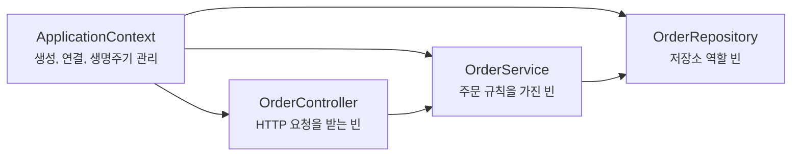
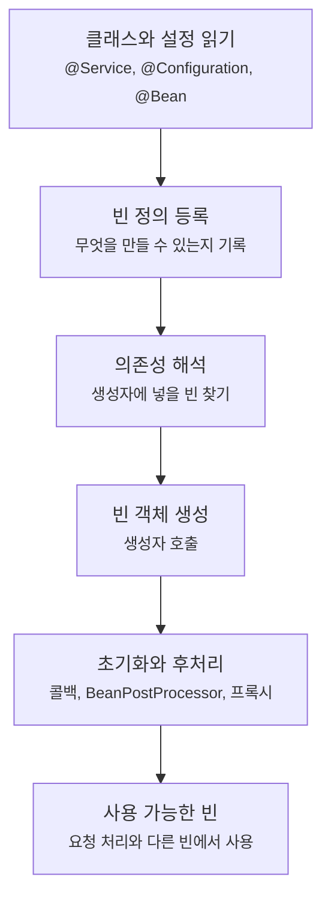
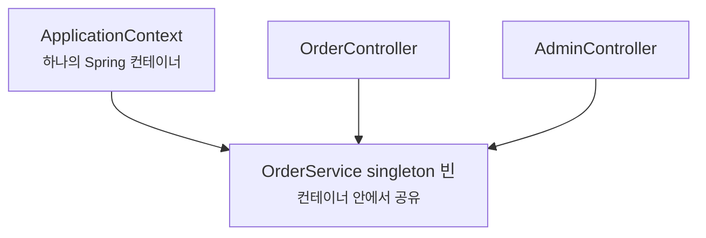
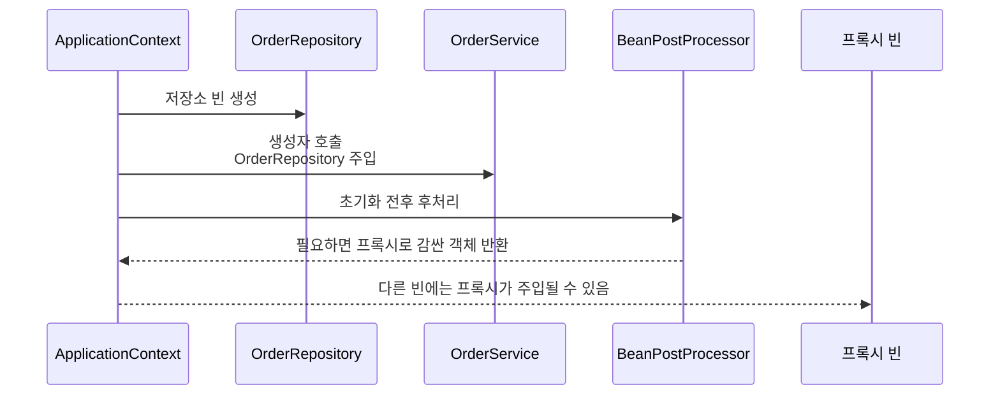

# ApplicationContext와 Bean은 왜 Spring이 소유한 객체일까요?

> `new`를 쓴 적이 없는데 객체가 있다면, 그 객체의 주인은 내 코드가 아니라 Spring 컨테이너일 수 있어요.

지난 글에서는 `SpringApplication.run(...)`이 환경을 준비하고 ApplicationContext를 만든다고 했어요. 그때 이런 표현이 지나갔죠.

> "컨테이너가 빈(bean)을 만들고 연결해요."

처음에는 이 말이 편하게 들려요. 그런데 실제 코드를 읽기 시작하면 금방 더 구체적인 질문이 생겨요.

> "빈이라는 게 그냥 객체랑 뭐가 다르지?"  
> "ApplicationContext는 정확히 뭘 들고 있지?"  
> "객체는 언제 만들어지고, 언제 사라지지?"  
> "왜 어떤 클래스는 주입되는데, 어떤 클래스는 못 찾는다고 할까?"

오늘은 이 질문을 따라가 볼게요. 목표는 ApplicationContext의 모든 내부 구현을 외우는 게 아니에요. Spring Boot 앱에서 **어떤 객체를 컨테이너가 소유하고**, **그 객체들이 어떤 순서로 준비되고**, **어느 경계에서 기대와 다르게 동작하는지**를 잡는 거예요.

!!! note "이 글의 기준"
    이 글은 Spring Boot 4.1.0 공식 문서와 Spring Framework 공식 문서의 빈(bean), 의존성 주입(dependency injection), scope, 생명주기 설명을 확인해 작성했어요. 개념 자체는 Spring Boot 전반에서 이어지는 이야기지만, 정확한 옵션이나 버전별 차이가 필요한 내용은 뒤 글에서 따로 다룰게요.

---

## 먼저 작은 주문 코드를 볼게요

주문 목록을 돌려주는 코드가 있다고 해볼게요.

```java
package com.example.order;

import org.springframework.stereotype.Repository;
import org.springframework.stereotype.Service;
import org.springframework.web.bind.annotation.GetMapping;
import org.springframework.web.bind.annotation.RestController;

@RestController
class OrderController {

    private final OrderService orderService;

    OrderController(OrderService orderService) {
        this.orderService = orderService;
    }

    @GetMapping("/orders")
    String orders() {
        return orderService.findOrders();
    }
}

@Service
class OrderService {

    private final OrderRepository orderRepository;

    OrderService(OrderRepository orderRepository) {
        this.orderRepository = orderRepository;
    }

    String findOrders() {
        return orderRepository.findAll();
    }
}

@Repository
class OrderRepository {

    String findAll() {
        return "orders";
    }
}
```

이 코드에는 이상한 점이 있어요.

`OrderController`는 `OrderService`가 필요하고, `OrderService`는 `OrderRepository`가 필요해요. 그런데 어디에도 이런 코드가 없어요.

```java
OrderRepository repository = new OrderRepository();
OrderService service = new OrderService(repository);
OrderController controller = new OrderController(service);
```

그래도 앱은 실행되고 요청도 처리돼요. 이유는 간단해요.

이 세 객체를 우리가 직접 만든 게 아니라, Spring 컨테이너가 만들고 연결했기 때문이에요.

여기서 Spring이 관리하는 객체를 빈(bean)이라고 불러요.

---

## 빈은 "그냥 객체"가 아니라 "컨테이너가 관리하는 객체"예요

Java에서 객체는 `new`로 만들 수도 있고, 라이브러리가 만들 수도 있고, 프레임워크가 만들 수도 있어요.

그중 Spring에서 말하는 빈(bean)은 조금 더 좁은 말이에요.

> Spring 컨테이너가 만들고, 이름과 정의를 알고 있고, 필요할 때 다른 객체에 연결할 수 있는 애플리케이션 객체.

그래서 모든 객체가 빈은 아니에요.

| 객체 | 보통 빈일까요? | 이유 |
|---|---:|---|
| `OrderController` | 예 | 요청을 받을 컨트롤러로 컨테이너가 관리해요 |
| `OrderService` | 예 | 여러 곳에서 쓰는 업무 규칙 객체로 관리해요 |
| `OrderRepository` | 예 | 저장소 역할 객체로 관리해요 |
| 요청 DTO | 보통 아니에요 | HTTP 요청마다 만들어지는 값 객체에 가까워요 |
| JPA Entity | 보통 아니에요 | Spring 빈이 아니라 JPA 영속성 컨텍스트가 다루는 도메인 객체예요 |
| `String`, `Long` 같은 값 | 보통 아니에요 | 값 자체가 업무 컴포넌트는 아니에요 |

처음에는 이 구분만 해도 많은 혼란이 줄어요.

Spring이 모든 객체를 대신 관리하는 게 아니에요. 컨트롤러, 서비스, 저장소, 설정 객체처럼 애플리케이션을 구성하는 주요 컴포넌트를 빈으로 관리하는 거예요.

!!! tip "빈인지 헷갈리면 이렇게 물어보세요"
    "이 객체를 Spring이 생성자에 넣어줄 수 있어야 하나요?", "이 객체의 생명주기를 컨테이너가 알아야 하나요?", "여러 곳에서 같은 역할로 재사용되는 애플리케이션 컴포넌트인가요?"에 가깝다면 빈 후보예요.

---

## ApplicationContext는 빈을 담는 실행 중 컨테이너예요

ApplicationContext는 Spring 애플리케이션에서 가장 자주 만나는 컨테이너예요.

단순히 객체를 담아두는 상자라고만 생각하면 조금 부족해요. ApplicationContext는 적어도 이런 일을 함께 해요.

| ApplicationContext가 하는 일 | 코드에서 보이는 장면 |
|---|---|
| 빈 정의를 모아요 | `@Service`, `@Repository`, `@Bean` 같은 정보를 읽어요 |
| 빈 객체를 만들어요 | 생성자를 호출하고 필요한 의존성을 준비해요 |
| 빈끼리 연결해요 | `OrderService(OrderRepository repository)`에 맞는 빈을 넣어요 |
| 초기화와 후처리를 거쳐요 | 라이프사이클 콜백, 프록시(proxy), 후처리기가 개입할 수 있어요 |
| 이벤트와 환경 정보도 제공해요 | 설정값, 프로필, 애플리케이션 이벤트를 다룰 수 있어요 |

처음에는 이렇게 잡으면 좋아요.

> ApplicationContext는 실행 중인 Spring 애플리케이션의 객체 그래프를 만들고 관리하는 컨테이너예요.

여기서 객체 그래프라는 말은 객체들이 서로 연결된 모양을 뜻해요.



이 그림에서 중요한 건 화살표가 두 종류라는 점이에요. ApplicationContext는 빈들을 만들고 관리하고, 실제 애플리케이션 코드는 컨트롤러에서 서비스, 서비스에서 저장소로 협력해요.

---

## 먼저 "빈 정의"가 있고, 그다음 "빈 객체"가 있어요

Spring을 처음 읽을 때 가장 많이 뭉개지는 구분이 있어요.

> 빈 정의(bean definition)와 실제 빈 객체는 같은 말이 아니에요.

빈 정의는 "무엇을 어떻게 만들 수 있는지"에 대한 설명이에요. 실제 객체는 그 설명을 바탕으로 만들어진 결과예요.

예를 들어 이 클래스가 있다고 해볼게요.

```java
package com.example.order;

import org.springframework.stereotype.Service;

@Service
class OrderService {

    private final OrderRepository orderRepository;

    OrderService(OrderRepository orderRepository) {
        this.orderRepository = orderRepository;
    }
}
```

Spring은 이 클래스를 보고 대략 이런 정보를 모아요.

| 빈 정의에 가까운 정보 | 예 |
|---|---|
| 어떤 클래스로 만들지 | `OrderService` |
| 이름은 무엇인지 | 보통 `orderService` |
| 필요한 생성자 인자는 무엇인지 | `OrderRepository` |
| scope는 무엇인지 | 기본값은 singleton |
| 초기화나 후처리가 필요한지 | 프록시, 라이프사이클 콜백 등 |

그리고 컨텍스트가 준비되는 과정에서 실제 `OrderService` 객체가 만들어져요.



이 순서를 알면 시작 실패 로그도 덜 무서워져요.

빈 정의를 등록하는 단계에서 실패했는지, 의존성을 찾는 단계에서 실패했는지, 객체를 만들다가 실패했는지, 초기화나 프록시 처리 중 실패했는지를 나눠볼 수 있기 때문이에요.

---

## 생성자 주입은 컨테이너에게 필요한 관계를 알려주는 방식이에요

앞 글에서 의존성 주입(dependency injection)을 봤어요. 오늘은 ApplicationContext 관점에서 다시 볼게요.

```java
@Service
class OrderService {

    private final OrderRepository orderRepository;

    OrderService(OrderRepository orderRepository) {
        this.orderRepository = orderRepository;
    }
}
```

이 생성자는 단순한 Java 문법이지만, Spring 컨테이너에게는 중요한 신호예요.

> "`OrderService`를 만들려면 `OrderRepository`가 필요해요."

컨테이너는 이 신호를 보고 등록된 빈들 중에서 `OrderRepository` 타입에 맞는 빈을 찾아요. 찾으면 생성자에 넣어서 `OrderService`를 만들고, 못 찾으면 시작 과정에서 실패해요.

그래서 이런 에러가 나올 수 있어요.

```text
No qualifying bean of type 'com.example.order.OrderRepository' available
```

이 메시지는 "Java 클래스가 없다"는 뜻이 아닐 수 있어요. 클래스 파일은 있어도, Spring 컨테이너가 그 클래스를 빈으로 등록하지 못했을 수 있어요.

반대로 같은 타입 후보가 여러 개라면 이런 방향으로 실패할 수 있어요.

```text
expected single matching bean but found 2
```

처음에는 이 두 질문으로 나눠보면 좋아요.

| 증상 | 먼저 물어볼 질문 |
|---|---|
| 필요한 빈이 없다고 함 | 이 클래스가 컴포넌트 스캔 범위 안에 있나요? `@Bean`으로 등록됐나요? 조건 때문에 빠졌나요? |
| 같은 타입 빈이 여러 개라고 함 | 어떤 빈을 기본으로 쓸지 정했나요? 이름, `@Primary`, `@Qualifier` 같은 선택 기준이 필요한가요? |

다음 글에서는 이 중 첫 번째 질문, 즉 컴포넌트 스캔과 빈 등록 방식을 더 자세히 볼 거예요.

---

## `@Bean`은 직접 만든 객체도 컨테이너 소유로 넘기는 방법이에요

빈은 꼭 `@Service` 같은 Annotation이 붙은 클래스에서만 나오는 건 아니에요.

직접 생성 로직이 필요한 객체는 설정 클래스에서 `@Bean` 메서드로 등록할 수 있어요.

```java
package com.example.order;

import java.time.Clock;

import org.springframework.context.annotation.Bean;
import org.springframework.context.annotation.Configuration;

@Configuration
class TimeConfig {

    @Bean
    Clock clock() {
        return Clock.systemUTC();
    }
}
```

이제 `Clock`도 Spring 컨테이너가 아는 빈이 돼요.

```java
@Service
class OrderService {

    private final Clock clock;

    OrderService(Clock clock) {
        this.clock = clock;
    }
}
```

여기서 중요한 건 `@Bean` 메서드가 단순한 유틸리티 메서드가 아니라는 점이에요.

Spring은 이 메서드가 돌려주는 객체를 컨테이너에 등록하고, 다른 빈의 의존성으로 사용할 수 있게 해요.

| 등록 방식 | 자주 쓰는 경우 |
|---|---|
| `@Component`, `@Service`, `@Repository`, `@Controller` | 내가 만든 애플리케이션 클래스가 역할을 드러낼 때 |
| `@Configuration` + `@Bean` | 외부 라이브러리 객체, 생성 로직이 필요한 객체, 설정값으로 조립해야 하는 객체 |

둘 중 어느 쪽이 더 좋다는 문제가 아니에요. 클래스 자체가 애플리케이션 역할을 가지면 컴포넌트 Annotation이 자연스럽고, 생성 과정을 코드로 표현해야 하면 `@Bean`이 자연스러워요.

---

## 기본 scope는 singleton이에요

Spring 빈은 scope를 가져요. scope는 그 빈 객체가 얼마나 오래, 어떤 범위에서 재사용되는지 정하는 기준이에요.

가장 기본은 singleton이에요.

Spring에서 singleton이라고 하면 "JVM 전체에 하나뿐인 객체"라는 뜻이 아니에요. 더 정확히는 **하나의 Spring 컨테이너 안에서 하나의 공유 인스턴스**라는 뜻이에요.



이 그림에서 `OrderController`와 `AdminController`가 같은 `OrderService` 빈을 사용할 수 있어요. 그래서 singleton 빈 안에 요청마다 달라지는 값을 필드로 저장하면 위험해져요. 여러 요청이 같은 객체를 함께 쓰기 때문이에요.

| scope | 처음 이해 |
|---|---|
| singleton | 컨테이너 안에서 하나의 인스턴스를 공유해요. 기본값이에요 |
| prototype | 컨테이너에 요청할 때마다 새 인스턴스를 만들어요 |
| request | 웹 요청 하나 동안만 유지돼요 |
| session | HTTP 세션 동안 유지돼요 |
| application | 웹 애플리케이션 범위에서 유지돼요 |

처음 Spring Boot 앱에서는 대부분 singleton 빈을 만나게 돼요. 컨트롤러, 서비스, 저장소가 보통 singleton으로 만들어지고 공유돼요.

!!! warning "singleton 빈에 요청 상태를 저장하지 마세요"
    `OrderService` 같은 singleton 빈의 필드에 `currentUserId`, `lastRequest`, `temporaryOrder` 같은 요청별 값을 저장하면 요청끼리 값이 섞일 수 있어요. 요청마다 달라지는 값은 메서드 파라미터, 지역 변수, 명시적인 요청/세션 scope, 또는 인증 컨텍스트처럼 목적에 맞는 경계를 써야 해요.

---

## prototype은 "항상 새 객체"지만 만능은 아니에요

prototype scope는 컨테이너에 요청할 때마다 새 객체를 만들어요.

처음에는 "그러면 요청마다 다른 상태를 넣고 싶을 때 prototype을 쓰면 되겠네?"라고 생각할 수 있어요.

근데요, 그렇게 단순하지 않아요.

singleton 빈이 prototype 빈을 생성자로 한 번 주입받으면 어떻게 될까요?

```java
@Service
class OrderService {

    private final OrderDraft draft;

    OrderService(OrderDraft draft) {
        this.draft = draft;
    }
}
```

`OrderService`가 singleton이라면, 생성자 주입은 `OrderService`가 만들어지는 시점에 한 번 일어나요. 그러면 `OrderDraft`가 prototype이어도 `OrderService` 안의 필드는 같은 인스턴스를 계속 들고 있을 수 있어요.

prototype은 "주입받은 곳에서 매번 자동으로 새로 바뀐다"가 아니에요. 컨테이너에 요청할 때 새로 만든다는 뜻이에요.

또 하나 중요한 차이가 있어요. prototype 빈은 생성과 초기화까지는 컨테이너가 도와주지만, singleton처럼 종료 시점의 소멸 콜백까지 자연스럽게 관리된다고 기대하면 안 돼요.

그래서 prototype은 생각보다 조심해서 써야 해요. 대부분의 웹 요청 상태는 메서드 지역 변수, 요청 객체, 세션, 데이터베이스 트랜잭션 경계 같은 더 명확한 구조로 표현하는 편이 낫습니다.

!!! note "처음에는 singleton을 기본으로 생각하세요"
    Spring Boot 애플리케이션의 서비스와 저장소는 대부분 상태 없는 singleton 빈으로 두는 편이 자연스러워요. scope를 바꾸고 싶다면 먼저 "왜 공유 인스턴스면 안 되는지", "그 상태의 진짜 생명주기는 무엇인지"를 물어보는 게 좋아요.

---

## 생명주기는 생성자 호출에서 끝나지 않아요

Java 객체만 보면 생성자가 호출되면 객체가 준비된 것처럼 느껴져요.

Spring 빈은 조금 더 긴 길을 지나요.

큰 흐름은 이래요.

| 단계 | 무슨 일이 일어날까요? |
|---|---|
| 빈 정의 등록 | 어떤 빈을 만들 수 있는지 컨테이너가 알아요 |
| 의존성 해석 | 생성자나 설정에 필요한 다른 빈을 찾아요 |
| 인스턴스 생성 | 생성자를 호출해 객체를 만들어요 |
| 의존성 주입 | 생성자, 설정 메서드 등을 통해 필요한 객체를 연결해요 |
| 초기화 콜백 | `@PostConstruct`, `InitializingBean`, custom init 메서드 등이 실행될 수 있어요 |
| 후처리 | BeanPostProcessor가 개입하고, 필요하면 프록시가 만들어질 수 있어요 |
| 사용 | 다른 빈이나 요청 처리 흐름에서 사용돼요 |
| 종료 | 컨텍스트가 닫힐 때 singleton 빈의 destroy 콜백이 실행될 수 있어요 |

여기서 후처리 단계가 중요해요.

예를 들어 AOP 기반 기능은 실제 객체를 그대로 쓰는 대신 프록시를 빈으로 노출할 수 있어요. 그래서 "내가 만든 클래스의 메서드가 호출된다"는 말만으로는 부족해질 때가 있어요. 실제 호출 경로에는 프록시가 끼어 있을 수 있으니까요.



이 그림은 모든 빈이 반드시 프록시가 된다는 뜻이 아니에요. 트랜잭션, 보안, 캐시처럼 메서드 주변 동작이 필요한 경우에는 후처리 과정에서 프록시가 관여할 수 있다는 점을 보여주는 그림이에요.

---

## 컨테이너 밖에서 만든 객체는 Spring 기능을 기대하기 어려워요

이제 중요한 경계가 보여요.

Spring이 관리하는 빈과, 내가 직접 `new`로 만든 객체는 같은 Java 객체처럼 보여도 Spring 입장에서는 다르게 취급돼요.

```java
class OrderController {

    private final OrderService orderService = new OrderService(new OrderRepository());
}
```

이렇게 직접 만들면 Spring 컨테이너가 그 객체의 생명주기를 모를 수 있어요. 의존성 주입, 후처리, 프록시, 설정 기반 조립 같은 Spring 기능도 기대하기 어려워져요.

물론 모든 `new`가 나쁜 건 아니에요.

값 객체, DTO, 도메인 객체, 테스트 안의 작은 객체는 직접 만들어도 자연스러울 때가 많아요. 문제는 컨테이너가 관리해야 할 서비스, 저장소, 설정성 객체를 몰래 직접 만드는 경우예요.

| 직접 만들어도 자연스러운 경우 | 빈으로 두는 편이 자연스러운 경우 |
|---|---|
| 요청 DTO, 응답 DTO | 컨트롤러 |
| 계산 중 잠깐 쓰는 값 객체 | 서비스 |
| 테스트용 임시 객체 | 저장소, 외부 클라이언트 래퍼 |
| JPA Entity | 설정 객체, 공통 인프라 객체 |

실무 코드 리뷰에서는 이런 냄새를 자주 봐요.

```java
@Service
class OrderService {

    private final PaymentClient paymentClient = new PaymentClient();
}
```

이 코드는 당장은 편해 보여요. 하지만 나중에 `PaymentClient`에 설정값, 타임아웃, 로깅, 테스트 대역, 재시도 정책이 필요해지면 곤란해져요.

더 나은 방향은 `PaymentClient`도 빈으로 등록하고 생성자로 받는 거예요.

```java
@Service
class OrderService {

    private final PaymentClient paymentClient;

    OrderService(PaymentClient paymentClient) {
        this.paymentClient = paymentClient;
    }
}
```

이렇게 하면 "어떤 결제 클라이언트를 쓸지"라는 결정이 클래스 안에 숨지 않고 컨테이너의 조립 과정으로 올라와요.

---

## ApplicationContext를 직접 꺼내 쓰는 건 보통 마지막 선택이에요

ApplicationContext는 빈을 꺼낼 수 있어요.

```java
OrderService orderService = applicationContext.getBean(OrderService.class);
```

그래서 처음에는 이런 생각이 들 수 있어요.

> "필요할 때마다 `getBean`으로 꺼내 쓰면 되는 거 아닌가?"

가능은 해요. 하지만 일반적인 업무 코드에서는 생성자 주입이 더 좋습니다.

`getBean`을 여기저기 쓰면 클래스가 자기에게 무엇이 필요한지 생성자로 드러내지 않아요. 의존성이 코드 중간에 숨어버리고, 테스트할 때도 어떤 대역을 넣어야 하는지 찾기 어려워져요.

| 방식 | 읽는 사람에게 보이는 것 |
|---|---|
| 생성자 주입 | 이 클래스가 시작부터 무엇을 필요로 하는지 보여요 |
| `applicationContext.getBean(...)` | 실행 중 어느 지점에서 무엇을 꺼내는지 찾아야 해요 |

물론 인프라 코드, 플러그인 구조, 동적 선택이 필요한 곳에서는 ApplicationContext를 직접 다루는 경우도 있어요. 하지만 컨트롤러와 서비스 같은 일반 업무 코드에서는 먼저 생성자 주입을 기준으로 생각하는 게 좋습니다.

!!! warning "ApplicationContext를 서비스 로케이터처럼 남용하지 마세요"
    `getBean` 호출이 업무 코드 곳곳에 퍼지면 Spring 컨테이너가 숨은 전역 객체처럼 변해요. 필요한 의존성은 생성자로 드러내고, 정말 동적으로 골라야 하는 경우에만 별도 설계로 다루는 편이 안전해요.

---

## 시작 실패를 ApplicationContext 관점으로 읽어볼게요

이제 에러를 하나 더 현실적으로 볼 수 있어요.

앱이 시작하다가 이렇게 실패했다고 해볼게요.

```text
Parameter 0 of constructor in com.example.order.OrderService required a bean of type
'com.example.order.OrderRepository' that could not be found.
```

이 메시지를 "Spring이 이상하다"로 읽으면 막막해요.

ApplicationContext 관점으로 읽으면 질문이 좁아져요.

1. `OrderService`는 빈으로 등록됐나요?
2. `OrderService` 생성자에는 `OrderRepository`가 필요하네요.
3. 그런데 컨테이너 안에 `OrderRepository` 빈 정의가 없거나 조건상 등록되지 않았네요.
4. 그러면 컴포넌트 스캔 범위, `@Repository`, `@Bean`, 조건부 등록을 확인해야겠네요.

반대로 이런 메시지가 보이면요.

```text
expected single matching bean but found 2: jdbcOrderRepository,jpaOrderRepository
```

질문이 달라져요.

1. 컨테이너가 후보를 못 찾은 게 아니에요.
2. 오히려 같은 타입 후보가 둘 이상 있어요.
3. 생성자 파라미터 하나에 무엇을 넣어야 할지 결정 기준이 부족해요.
4. 기본 후보를 정하거나, 이름이나 qualifier로 선택 기준을 드러내야 해요.

여기서 중요한 습관은 에러를 "빈 문제"로 뭉개지 않는 거예요.

> 없는 빈 문제인지, 많은 빈 문제인지, 만들다 실패한 문제인지, 만들고 나서 후처리하다 실패한 문제인지 나눠보세요.

이 구분이 되면 로그의 긴 문장 속에서도 봐야 할 줄이 줄어들어요.

---

## 실무에서는 "무엇을 빈으로 만들지"가 설계가 돼요

처음에는 `@Service`를 붙이면 되고, 안 되면 `@Component`를 붙이면 되는 것처럼 느껴질 수 있어요.

사실은 조금 더 설계적인 질문이에요.

> 이 객체의 생성과 연결을 Spring 컨테이너가 소유해야 할까요?

대부분의 Spring Boot 애플리케이션에서는 이렇게 나누면 무난해요.

| 역할 | 추천 방향 |
|---|---|
| 컨트롤러 | 빈으로 둬요. 요청 처리 진입점이에요 |
| 서비스 | 빈으로 둬요. 업무 규칙과 트랜잭션 경계가 자주 놓여요 |
| 저장소 | 빈으로 둬요. 데이터 접근 경계예요 |
| 외부 API 클라이언트 래퍼 | 빈으로 둬요. 설정, 타임아웃, 테스트 대역이 필요해져요 |
| 설정 객체 | `@Configuration`과 `@Bean`으로 드러내요 |
| DTO, command, response | 보통 빈으로 만들지 않아요. 요청이나 호출마다 생기는 값이에요 |
| Entity, VO | 보통 Spring 빈이 아니에요. 도메인 모델이나 영속성 모델이에요 |

이 기준은 나중에 테스트에도 영향을 줘요.

빈으로 둔 객체는 테스트 컨텍스트에서 주입하거나 대체할 수 있어요. 반대로 클래스 안에서 직접 만든 객체는 테스트에서 바꾸기 어려워요.

운영에서도 마찬가지예요. 빈으로 관리되는 인프라 객체는 설정값, 프로필, 조건부 등록, Actuator의 빈 확인 같은 도구와 연결되기 쉬워요. 컨테이너 밖에 숨어 있는 객체는 추적하기 어렵습니다.

---

## 오늘의 핵심 경계를 한 번에 놓아볼게요

ApplicationContext와 빈을 이해할 때는 아래 네 질문을 붙잡으면 좋아요.

| 질문 | 왜 중요할까요? |
|---|---|
| 이 객체는 Spring 빈인가요? | 컨테이너가 생성과 연결을 맡는지 결정돼요 |
| 이 빈은 어떻게 등록됐나요? | 컴포넌트 스캔인지, `@Bean`인지, 자동 설정인지 알 수 있어요 |
| 이 빈의 scope는 무엇인가요? | 공유 객체인지, 매번 새로 만드는 객체인지 달라져요 |
| 이 빈은 어떤 생명주기를 지나나요? | 초기화, 후처리, 프록시, 종료 콜백을 이해할 수 있어요 |

이 네 질문은 뒤 글들의 기초가 돼요.

컴포넌트 스캔 글에서는 "어떻게 등록됐나요?"를 더 깊게 볼 거예요. 의존성 주입 글에서는 "같은 타입이 여러 개일 때 무엇을 넣나요?"를 볼 거고요. AOP 글에서는 "후처리와 프록시가 실제 호출 경로를 어떻게 바꾸나요?"를 다시 열어볼 거예요.

---

## 자, 정리해볼까요?

!!! abstract "오늘 우리가 배운 것"
    - 빈(bean)은 그냥 Java 객체가 아니라 Spring 컨테이너가 만들고 관리하는 객체예요.
    - ApplicationContext는 빈 정의를 모으고, 실제 빈 객체를 만들고, 의존성을 연결하고, 생명주기를 관리하는 컨테이너예요.
    - 빈 정의와 실제 빈 객체는 달라요. 먼저 "무엇을 만들 수 있는지"를 등록하고, 그다음 객체 생성과 초기화가 이어져요.
    - 기본 scope는 singleton이에요. 이것은 컨테이너 안에서 하나의 인스턴스를 공유한다는 뜻이지, JVM 전체의 전역 객체라는 뜻은 아니에요.
    - prototype은 요청할 때마다 새로 만들지만, singleton 빈에 한 번 주입되면 매번 새로 바뀌는 마법이 아니에요.
    - 컨테이너 밖에서 직접 만든 객체에는 의존성 주입, 후처리, 프록시, 생명주기 관리 같은 Spring 기능을 기대하기 어려워요.
    - 실무에서는 "무엇을 빈으로 둘지"가 테스트, 설정, 운영 추적성까지 이어지는 설계 결정이 돼요.

다음 글에서는 "그럼 어떤 클래스가 빈으로 등록되는 걸까?"를 볼 거예요. 컴포넌트 스캔(component scan), `@Bean`, 조건부 등록이 어떻게 다른지, 그리고 왜 "분명 클래스를 만들었는데 Spring이 못 찾는다"는 일이 생기는지 이어서 살펴볼게요.

---

## 참고한 링크

- [Spring Boot Reference: Spring Beans and Dependency Injection](https://docs.spring.io/spring-boot/reference/using/spring-beans-and-dependency-injection.html)
- [Spring Framework Reference: The IoC Container](https://docs.spring.io/spring-framework/reference/core/beans.html)
- [Spring Framework Reference: Introduction to the Spring IoC Container and Beans](https://docs.spring.io/spring-framework/reference/core/beans/introduction.html)
- [Spring Framework Reference: Bean Scopes](https://docs.spring.io/spring-framework/reference/core/beans/factory-scopes.html)
- [Spring Framework Reference: Lifecycle Callbacks](https://docs.spring.io/spring-framework/reference/core/beans/factory-nature.html)
