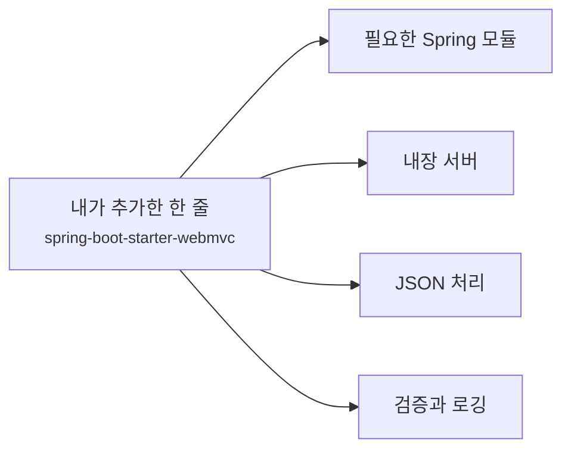
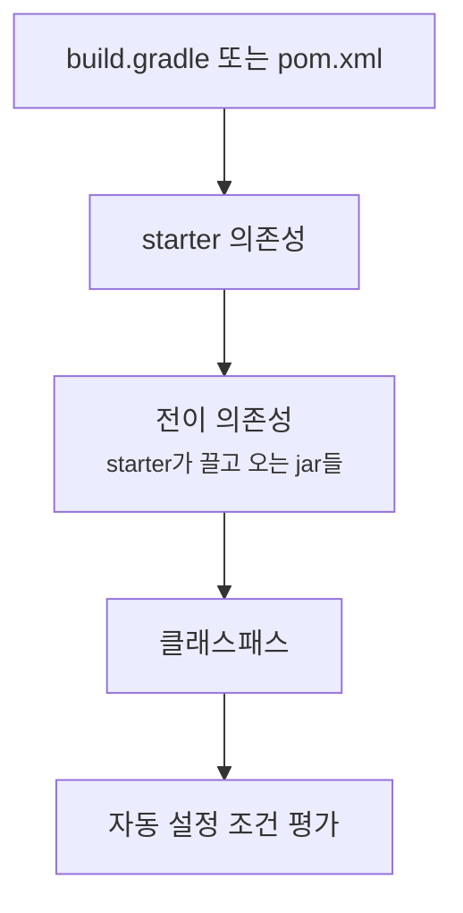
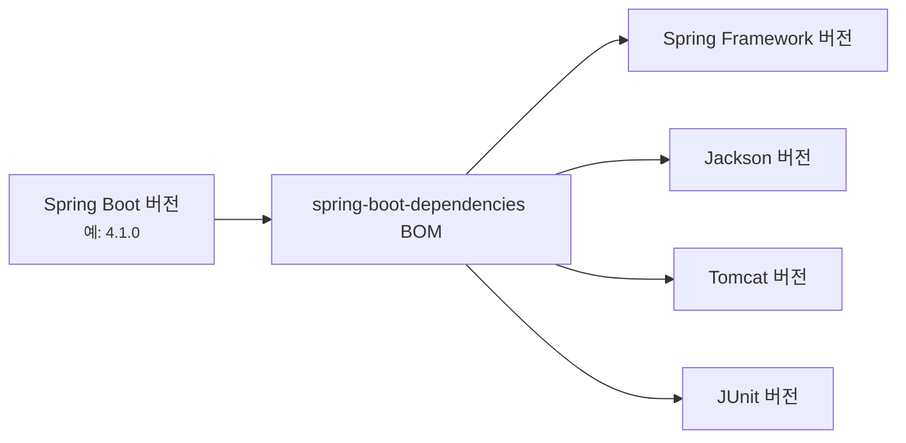
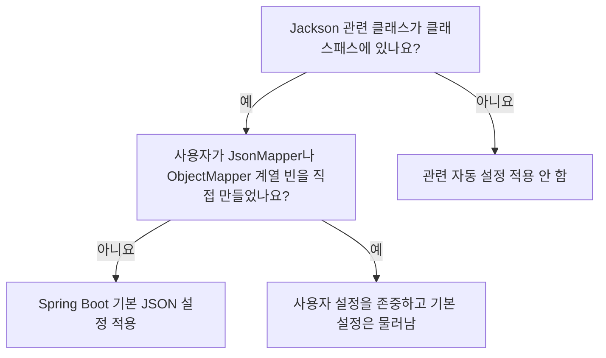
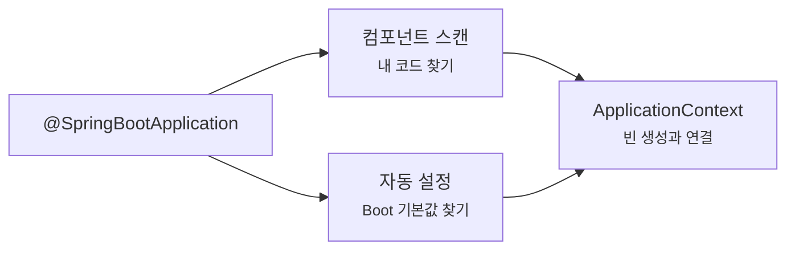
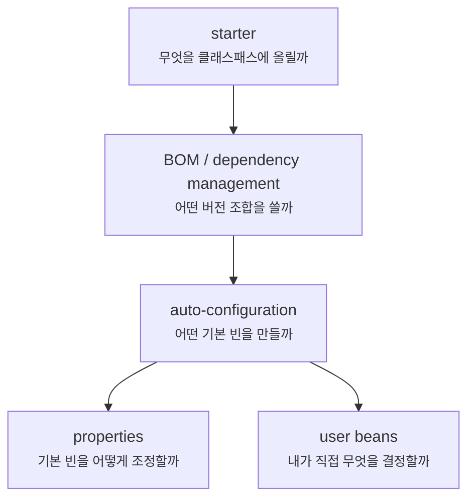
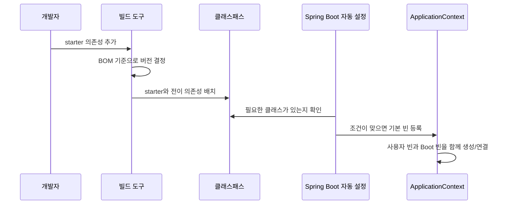

# 스타터와 자동 설정은 왜 버전과 설정을 대신 맞춰줄까요?

> `implementation "org.springframework.boot:spring-boot-starter-webmvc"` 한 줄을 넣었을 뿐인데, 왜 웹 서버와 JSON 변환과 MVC 설정이 같이 따라올까요?

지난 글에서는 AOP 프록시(proxy)를 봤어요. Annotation 하나가 실행 코드를 직접 만들어내는 게 아니라, Spring이 프록시와 interceptor를 준비하고 **호출 경계**에서 부가 동작을 붙인다는 이야기였죠.

이번에는 더 넓은 질문으로 넘어가볼게요.

처음 Spring Boot 프로젝트를 만들 때 이런 의존성을 자주 봐요.

```gradle
dependencies {
    implementation "org.springframework.boot:spring-boot-starter-webmvc"
    testImplementation "org.springframework.boot:spring-boot-starter-webmvc-test"
}
```

혹은 기존 Spring Boot 3.x 프로젝트나 오래된 글에서는 이런 이름을 더 많이 봤을 거예요.

```gradle
dependencies {
    implementation "org.springframework.boot:spring-boot-starter-web"
    testImplementation "org.springframework.boot:spring-boot-starter-test"
}
```

처음 보면 이상해요. 나는 "웹" 스타터 하나를 추가했을 뿐인데요. 실행하면 내장 서버가 뜨고, 요청 경로가 매핑되고, JSON 응답이 나가고, 검증 라이브러리와 로깅도 자연스럽게 붙어 있는 것처럼 보여요.

여기서 질문이 생겨요.

> "스타터(starter)는 라이브러리인가요, 설정인가요?"  
> "버전은 누가 맞춰주나요?"  
> "자동 설정(auto-configuration)은 어떤 기준으로 켜지고 꺼지나요?"  
> "내가 직접 만든 설정은 Spring Boot 기본 설정보다 우선하나요?"  
> "어떤 자동 설정이 적용됐는지는 어디서 확인하죠?"

오늘 목표는 "Spring Boot가 마법처럼 해준다"에서 멈추지 않는 거예요. **스타터는 필요한 의존성 묶음을 클래스패스에 올리고**, **의존성 관리는 호환되는 버전 조합을 잡아주고**, **자동 설정은 클래스패스와 빈과 프로퍼티 조건을 보고 기본 빈을 넣거나 물러난다**는 흐름을 잡아볼게요.

!!! note "이 글의 기준"
    이 글은 Spring Boot 4.1.0 공식 문서의 starter, dependency management, auto-configuration, condition evaluation report 설명을 확인해 작성했어요. 개념 자체는 Spring Boot 전반에서 이어지지만, 스타터 이름과 기본 라이브러리 조합은 버전에 따라 달라질 수 있어요. 새 프로젝트에서는 `start.spring.io`가 생성한 빌드 파일을 기준으로 확인하세요.

---

## 먼저 스타터 한 줄을 펼쳐볼게요

스타터(starter)는 보통 "기능 묶음을 시작하기 위한 의존성 모음"이라고 보면 돼요.

예를 들어 Spring MVC 웹 애플리케이션을 만들고 싶다고 해볼게요. 직접 모든 라이브러리를 하나씩 고른다면 이런 고민을 해야 해요.

- Spring MVC는 어떤 모듈이 필요할까요?
- 내장 서버는 Tomcat을 쓸까요, Jetty를 쓸까요?
- JSON 변환은 무엇을 넣어야 할까요?
- 검증은 어떤 Jakarta Validation 구현체가 필요할까요?
- 로깅은 어떤 조합이 맞을까요?
- 테스트에는 어떤 Spring 테스트 모듈과 JUnit 조합이 맞을까요?

스타터는 이 고민을 "자주 쓰는 조합"으로 묶어줘요.



이 그림에서 스타터는 직접 모든 기능을 실행하는 객체가 아니에요. 스타터는 필요한 jar들을 클래스패스(classpath)에 올리는 출발점이에요. 그 jar들이 올라오면 Spring Boot의 자동 설정이 "아, 이 앱은 MVC 웹 애플리케이션 쪽 설정이 필요하겠구나"라고 판단할 수 있어요.

그래서 스타터와 자동 설정은 역할이 달라요.

| 역할 | 하는 일 |
|---|---|
| 스타터(starter) | 자주 같이 쓰는 의존성 묶음을 프로젝트에 넣어요 |
| 의존성 관리(dependency management) | 그 의존성들의 버전 조합을 맞춰요 |
| 자동 설정(auto-configuration) | 클래스패스와 기존 빈과 설정값을 보고 기본 빈을 등록해요 |

처음에는 이 세 가지가 한꺼번에 움직이는 것처럼 보여요. 하지만 문제를 디버깅할 때는 나눠서 봐야 해요.

> 의존성이 없어서 안 되는 문제인지, 버전 조합이 깨진 문제인지, 자동 설정 조건이 맞지 않는 문제인지 구분해야 해요.

---

## 스타터는 "선택지"를 클래스패스에 올려요

Spring Boot 자동 설정은 클래스패스를 아주 중요하게 봐요.

클래스패스는 실행 중 애플리케이션이 사용할 수 있는 클래스와 라이브러리의 목록이라고 생각하면 돼요. 빌드 파일에 의존성을 추가하면, 그 의존성과 그 의존성이 끌고 온 다른 의존성들이 클래스패스에 올라와요.

웹 스타터를 넣으면 MVC, 서버, JSON 같은 클래스들이 보이기 시작해요. 데이터 JPA 스타터를 넣으면 JPA, Hibernate, Spring Data JPA 쪽 클래스들이 보이기 시작하죠. Actuator 스타터를 넣으면 운영 확인용 endpoint를 만들 수 있는 클래스들이 보이기 시작해요.



이 그림에서 중요한 건 자동 설정이 빌드 파일 텍스트를 직접 읽는 게 아니라는 점이에요. 실행 시점에 Spring Boot는 "현재 클래스패스에 어떤 클래스가 있나?"를 보고 여러 자동 설정 후보를 평가해요.

예를 들어 이런 식이에요.

| 클래스패스에서 보이는 것 | Spring Boot가 고려할 수 있는 일 |
|---|---|
| Spring MVC 관련 클래스 | MVC 요청 처리 설정 |
| Jackson 관련 클래스 | JSON mapper와 message converter 설정 |
| JDBC와 DataSource 관련 클래스 | 데이터베이스 연결 설정 |
| Actuator 관련 클래스 | health, info, metrics 같은 운영 endpoint 설정 |

물론 클래스가 있다고 무조건 다 켜지는 건 아니에요. 자동 설정은 보통 여러 조건을 함께 봐요.

---

## 버전은 스타터가 아니라 BOM이 크게 잡아줘요

스타터를 쓰면 버전을 거의 안 적게 돼요.

```gradle
dependencies {
    implementation "org.springframework.boot:spring-boot-starter-webmvc"
}
```

여기에는 `4.1.0` 같은 버전이 없죠. 그래서 처음에는 이런 생각이 들 수 있어요.

> "버전을 안 쓰면 최신 버전을 알아서 받나요?"

그렇지는 않아요. Spring Boot 프로젝트에서는 보통 Spring Boot Gradle plugin이나 Maven parent가 **Spring Boot가 관리하는 의존성 버전 표**를 가져와요. 이 표를 BOM(Bill of Materials)이라고 불러요.

BOM은 이름 그대로 "이 Spring Boot 버전에서는 이 라이브러리들을 이 버전 조합으로 쓰세요"라는 목록에 가까워요.



그래서 버전을 안 적는다는 말은 "아무 버전이나 받겠다"가 아니에요.

> Spring Boot가 검증한 버전 조합을 따르겠다는 뜻에 가까워요.

Maven에서는 Spring Boot starter parent를 쓰거나 BOM을 import하는 방식으로 버전 관리를 받을 수 있어요. Gradle에서는 Spring Boot plugin과 dependency management plugin 조합, 또는 Gradle의 platform 방식으로 BOM을 가져오는 흐름을 볼 수 있어요. 프로젝트마다 표기는 다를 수 있지만 핵심은 같아요.

| 빌드 파일에서 보이는 장면 | 읽는 법 |
|---|---|
| starter 의존성에 버전이 없음 | Boot가 관리하는 버전 표를 따른다는 뜻이에요 |
| 특정 라이브러리에 버전을 직접 적음 | Boot 기본 조합에서 벗어나는 선택일 수 있어요 |
| Boot 버전을 올림 | 관리되는 여러 라이브러리 버전도 함께 움직일 수 있어요 |
| 의존성 충돌이 남 | BOM 밖 버전 override나 다른 라이브러리의 전이 의존성을 확인해야 해요 |

실무에서는 이 점이 중요해져요. "보안 취약점 때문에 라이브러리 하나만 올리자"는 결정이 필요할 때도 있지만, 무심코 버전을 하나씩 박아 넣기 시작하면 Spring Boot가 맞춰둔 조합에서 벗어날 수 있어요.

!!! warning "버전을 직접 적는 건 의식적인 선택이어야 해요"
    스타터와 BOM을 쓰는 프로젝트에서 개별 의존성 버전을 직접 고정하면, 문제를 해결할 수도 있지만 검증된 조합을 깨뜨릴 수도 있어요. 꼭 필요한 override라면 이유, 영향 범위, 되돌릴 조건을 남기는 편이 좋아요.

---

## 자동 설정은 기본값을 "조건부로" 넣어요

이제 자동 설정(auto-configuration)을 볼게요.

자동 설정은 Spring Boot가 애플리케이션에 필요한 기본 빈(bean)과 설정을 조건에 따라 등록하는 방식이에요. 공식 문서의 핵심 표현을 우리 말로 옮기면 이래요.

> 추가한 jar 의존성을 바탕으로 Spring 애플리케이션을 자동으로 설정하려고 시도해요.

여기서 "시도한다"는 말이 중요해요. 자동 설정은 무조건 밀어붙이는 설정이 아니에요. 조건이 맞을 때 적용되고, 사용자가 직접 만든 설정이 있으면 물러나는 경우가 많아요.

대표적인 조건은 이런 것들이에요.

| 조건 종류 | 의미 |
|---|---|
| 클래스 조건 | 어떤 클래스가 클래스패스에 있을 때만 적용해요 |
| 빈 조건 | 특정 빈이 있거나 없을 때만 적용해요 |
| 프로퍼티 조건 | `application.yml` 같은 설정값이 특정 상태일 때만 적용해요 |
| 웹 애플리케이션 조건 | servlet 웹 앱인지, reactive 웹 앱인지에 따라 달라져요 |
| 리소스 조건 | 특정 파일이나 리소스가 있을 때 적용해요 |

예를 들어 JSON 처리를 생각해볼게요.



이 흐름은 정확한 클래스 이름보다 원리가 중요해요. Spring Boot는 "필요한 라이브러리가 있나?"를 보고, "사용자가 이미 직접 결정했나?"를 확인한 뒤, 빈틈이 있으면 기본값을 넣어요.

그래서 자동 설정을 이렇게 기억하면 좋아요.

> 자동 설정은 개발자 설정을 덮어쓰기 위한 힘이 아니라, 개발자가 아직 정하지 않은 기본값을 조건부로 채우는 장치예요.

---

## `@SpringBootApplication`은 자동 설정 입구도 열어요

우리가 매번 보는 `main` 클래스에는 보통 `@SpringBootApplication`이 붙어 있어요.

```java
package com.example.order;

import org.springframework.boot.SpringApplication;
import org.springframework.boot.autoconfigure.SpringBootApplication;

@SpringBootApplication
public class OrderApplication {

    public static void main(String[] args) {
        SpringApplication.run(OrderApplication.class, args);
    }
}
```

이 Annotation은 하나처럼 보이지만, Spring Boot 앱에서 중요한 세 가지 역할을 함께 잡아줘요.

| 포함된 역할 | 의미 |
|---|---|
| Spring Boot 설정 클래스 | 이 클래스가 애플리케이션의 주요 설정 진입점이에요 |
| 컴포넌트 스캔(component scan) | 현재 패키지와 하위 패키지에서 컴포넌트 후보를 찾아요 |
| 자동 설정(auto-configuration) | 클래스패스와 조건을 바탕으로 Boot 기본 설정을 적용해요 |

우리가 앞 글들에서 본 흐름이 여기서 만나요.



컴포넌트 스캔은 주로 **내가 작성한 클래스**를 찾아요. `@Controller`, `@Service`, `@Repository`, `@Component` 같은 후보들이죠.

자동 설정은 주로 **Spring Boot와 라이브러리가 제공하는 설정 후보**를 검토해요. "이 라이브러리가 있으니 기본 빈을 넣어도 되나?", "사용자가 이미 직접 만든 빈이 있나?", "이 프로퍼티가 켜져 있나?"를 보는 쪽이에요.

이 둘이 ApplicationContext 안에서 합쳐지기 때문에, 실행된 앱만 보면 전부 "빈"으로 보일 수 있어요. 하지만 출처를 나눠 읽으면 디버깅이 쉬워져요.

---

## 자동 설정은 내가 직접 정하면 물러날 수 있어요

Spring Boot가 자동 설정을 제공한다고 해서 개발자가 아무것도 바꿀 수 없다는 뜻은 아니에요. 오히려 자동 설정의 중요한 설계 방향은 "기본값은 주되, 사용자가 직접 정하면 물러난다"예요.

예를 들어 데이터베이스 연결을 생각해볼게요.

처음에는 Spring Boot가 클래스패스와 설정값을 보고 `DataSource`를 만들 수 있어요.

```yaml
spring:
  datasource:
    url: jdbc:postgresql://localhost:5432/order
    username: order
    password: secret
```

그런데 팀에서 특별한 커넥션 풀 설정이나 라우팅 데이터소스가 필요해져서 직접 빈을 만든다고 해볼게요.

```java
import javax.sql.DataSource;
import org.springframework.context.annotation.Bean;
import org.springframework.context.annotation.Configuration;

@Configuration
class DataSourceConfig {

    @Bean
    DataSource dataSource() {
        // 예시입니다. 실제 운영 설정은 커넥션 풀, 타임아웃, secret 관리까지 함께 봐야 해요.
        return customDataSource();
    }
}
```

이런 경우 많은 자동 설정은 `@ConditionalOnMissingBean` 같은 조건으로 "사용자가 이미 이 타입의 빈을 만들었으면 기본 빈은 만들지 않겠다"는 식으로 동작해요.

물론 모든 자동 설정이 같은 방식으로 물러나는 건 아니에요. 어떤 것은 customizer 빈을 받아 일부만 바꾸게 설계되어 있고, 어떤 것은 프로퍼티로 조정하게 되어 있고, 정말 필요할 때는 특정 자동 설정 클래스를 제외해야 할 수도 있어요.

그래서 커스터마이징은 보통 아래 순서로 생각하는 게 좋아요.

1. 먼저 `application.yml` 프로퍼티로 조정할 수 있는지 봐요.
2. 그다음 customizer나 callback 빈이 있는지 봐요.
3. 특정 빈을 직접 등록해서 기본 빈을 대체할 수 있는지 봐요.
4. 마지막으로 특정 자동 설정 exclude가 필요한지 검토해요.

!!! warning "exclude는 마지막에 가까운 선택이에요"
    자동 설정이 마음에 안 든다고 바로 exclude부터 하면, 함께 따라오던 편의 설정까지 사라질 수 있어요. 먼저 어떤 조건 때문에 적용됐는지 보고, 프로퍼티나 직접 빈 등록으로 필요한 부분만 바꿀 수 있는지 확인하세요.

---

## "왜 적용됐는지"는 조건 평가 리포트에서 봐요

자동 설정이 어려운 이유는 코드에 직접 보이지 않는 결정이 많기 때문이에요.

컨트롤러나 서비스는 내 파일 안에 있어요. 그런데 자동 설정은 Spring Boot 내부 jar에 있고, 조건에 따라 켜지거나 꺼져요. 그래서 문제를 만나면 이런 질문을 하게 돼요.

> "이 자동 설정은 왜 적용됐죠?"  
> "왜 내가 기대한 설정은 안 들어왔죠?"  
> "Spring Boot가 내 빈을 보고 물러난 건가요, 클래스가 없어서 빠진 건가요?"

이때 조건 평가 리포트(condition evaluation report)를 보면 돼요.

개발 중에는 앱을 `--debug`로 실행해서 콘솔에 조건 평가 결과를 볼 수 있어요.

```bash
./gradlew bootRun --args="--debug"
```

실행 가능한 jar라면 이렇게 볼 수 있어요.

```bash
java -jar build/libs/order-0.0.1-SNAPSHOT.jar --debug
```

Actuator를 쓰는 앱이라면 `/actuator/conditions` endpoint로 조건 평가 결과를 확인할 수도 있어요. 운영에서는 endpoint 노출 범위와 접근 권한을 조심해야 해요.

```bash
curl http://localhost:8080/actuator/conditions
```

리포트를 읽을 때는 전부 외우려고 하지 말고, 먼저 아래 세 묶음으로 보면 좋아요.

| 리포트에서 볼 것 | 의미 |
|---|---|
| positive matches | 조건이 맞아서 적용된 자동 설정이에요 |
| negative matches | 조건이 맞지 않아 빠진 자동 설정이에요 |
| unmatched reason | 빠진 이유예요. 클래스 없음, 빈 있음/없음, 프로퍼티 불일치 같은 단서가 나와요 |

예를 들어 "JPA 설정이 안 들어온다"면 먼저 이런 질문으로 좁혀요.

1. JPA 관련 starter가 클래스패스에 있나요?
2. 데이터베이스 드라이버가 있나요?
3. `DataSource`가 만들어졌나요?
4. 사용자가 만든 빈 때문에 기본 설정이 물러났나요?
5. 테스트 slice라서 전체 자동 설정이 아닌 일부만 뜬 건 아닌가요?

조건 평가 리포트는 이 질문에 답하는 지도예요. "Spring Boot가 왜 그랬는지"를 추측하지 않고, 어떤 조건이 맞고 틀렸는지 볼 수 있게 해줘요.

!!! tip "자동 설정 디버깅 순서"
    빌드 파일에서 starter를 확인하고, 클래스패스에 필요한 라이브러리가 있는지 보고, 조건 평가 리포트에서 positive/negative matches를 확인한 뒤, 마지막으로 내가 만든 빈이나 프로퍼티가 기본 설정을 바꿨는지 보세요.

---

## 스타터, 자동 설정, 프로퍼티는 서로 다른 손잡이예요

Spring Boot를 쓰다 보면 문제 해결 방식이 섞이기 쉬워요.

예를 들어 JSON 날짜 포맷이 마음에 들지 않는다고 해볼게요. 이때 선택지는 여러 가지예요.

- JSON 관련 starter나 모듈이 들어와 있는지 확인해요.
- Spring Boot가 제공하는 JSON 프로퍼티로 조정해요.
- customizer 빈을 만들어 일부 동작을 바꿔요.
- 정말 필요하면 mapper 빈을 직접 구성해요.

이 선택들은 같은 층이 아니에요.



이 그림에서 starter는 제일 앞에 있어요. 필요한 라이브러리를 넣지 않으면 자동 설정 후보 자체가 열리지 않을 수 있어요.

BOM은 버전 조합을 잡아요. 이상한 충돌이 나면 여기나 override를 봐야 해요.

자동 설정은 기본 빈을 만들어요. 하지만 프로퍼티나 사용자 빈에 따라 달라져요.

프로퍼티는 자동 설정이 만든 기본 빈을 조정하는 가장 흔한 방법이에요.

사용자 빈은 "이 부분은 기본값 말고 내가 직접 정하겠다"는 강한 신호가 될 수 있어요.

---

## 실무에서는 "Boot가 해줬다"를 더 구체적으로 말해야 해요

코드 리뷰나 장애 분석에서 이런 표현을 자주 만나요.

> "이건 Spring Boot가 자동으로 해줘요."

처음 설명할 때는 괜찮아요. 하지만 실무에서는 조금 더 구체적으로 말해야 해요.

| 흐린 표현 | 더 나은 표현 |
|---|---|
| Boot가 알아서 해줘요 | 이 starter가 관련 라이브러리를 클래스패스에 올려요 |
| 버전은 자동이에요 | Boot BOM이 관리하는 버전 조합을 따라요 |
| 설정은 자동이에요 | 자동 설정 클래스가 조건을 평가해서 기본 빈을 등록해요 |
| 내 설정이 먹었어요 | 사용자 빈이나 프로퍼티 때문에 Boot 기본 설정이 바뀌었어요 |
| 왜 안 되는지 모르겠어요 | 조건 평가 리포트에서 positive/negative matches를 확인해요 |

이렇게 말이 구체적이면 문제를 고치는 위치도 선명해져요.

- 빌드 파일을 고칠 문제인가요?
- Boot 버전이나 BOM을 볼 문제인가요?
- `application.yml` 프로퍼티를 볼 문제인가요?
- `@Bean` 설정을 볼 문제인가요?
- 자동 설정 조건을 볼 문제인가요?
- 테스트 컨텍스트가 너무 작게 뜬 문제인가요?

Spring Boot는 편의를 주지만, 편의가 책임을 없애지는 않아요. 오히려 편해진 만큼 "어느 층에서 결정됐는지"를 읽는 습관이 중요해져요.

---

## 테스트에서 자동 설정은 더 작게 뜰 수 있어요

자동 설정을 이해할 때 테스트도 조심해야 해요.

전체 앱을 띄우는 테스트에서는 많은 자동 설정이 함께 평가돼요.

```java
@SpringBootTest
class OrderApplicationTest {
}
```

반면 MVC controller만 가볍게 보려는 테스트 slice에서는 웹 계층에 필요한 일부 설정만 올라올 수 있어요.

```java
@WebMvcTest(OrderController.class)
class OrderControllerTest {
}
```

이 차이를 모르면 이런 일이 생겨요.

> "실행하면 되는데 테스트에서는 빈이 없다고 해요."  
> "테스트에서는 되는데 실제 앱에서는 다른 설정이 들어와요."

테스트 slice는 빠르고 유용하지만, 전체 ApplicationContext와 같은 세상이 아니에요. 자동 설정도 테스트 목적에 맞게 제한될 수 있어요.

그래서 테스트 실패를 볼 때는 "내 코드가 틀렸나?"만 묻지 말고, "이 테스트는 어떤 자동 설정과 빈만 포함하나?"를 같이 봐야 해요.

---

## 버전 차이는 스타터 이름에서 먼저 보일 수 있어요

Spring Boot 4.x 글을 읽다가 기존 3.x 프로젝트를 보면 스타터 이름이 다르게 보일 수 있어요.

| 4.x 기준 | 3.x에서 볼 수 있는 차이 | 독자가 지금 확인할 것 |
|---|---|---|
| 웹 기술별 starter 이름이 더 세분화되어 보일 수 있어요. 예를 들어 MVC 쪽에서는 `spring-boot-starter-webmvc`를 볼 수 있어요 | 기존 프로젝트와 많은 자료에서는 `spring-boot-starter-web`을 볼 수 있어요 | 새 프로젝트는 `start.spring.io`가 만든 빌드 파일을 기준으로 읽고, 기존 프로젝트는 사용 중인 Boot 버전의 공식 문서를 확인하세요 |
| Jackson 3이 4.x의 기본 방향이에요 | 3.x 프로젝트는 Jackson 2 기반 코드와 설정을 많이 갖고 있어요 | JSON mapper 설정이나 모듈 이름을 옮길 때는 Boot 4 문서를 기준으로 migration 차이를 확인하세요 |
| Boot 버전을 올리면 BOM의 관리 버전도 함께 바뀌어요 | 기존 프로젝트는 오래된 third-party override가 남아 있을 수 있어요 | `dependencyInsight`, Maven dependency tree 같은 도구로 실제 선택된 버전을 확인하세요 |

이 표의 목적은 모든 차이를 외우게 하려는 게 아니에요. 스타터와 BOM은 버전별로 실제 파일 모양에 영향을 줘요. 그래서 "예전에 봤던 이름과 다르다"는 이유만으로 틀렸다고 판단하면 안 돼요.

> 현재 프로젝트의 Spring Boot 버전, 생성된 빌드 파일, 공식 문서를 함께 보세요.

---

## 오늘의 흐름을 한 번에 놓아볼게요

처음 질문으로 돌아가볼게요.

> 스타터 하나를 넣었을 뿐인데 왜 많은 설정이 따라올까요?

전체 흐름은 이렇게 이어져요.



이 그림에서 Spring Boot는 빌드 도구와 ApplicationContext 사이를 잇는 것처럼 보여요. 빌드 도구가 의존성을 준비하고, Spring Boot가 그 클래스패스를 보고 자동 설정 후보를 평가하고, ApplicationContext가 최종 빈 그래프를 만들어요.

따라서 문제를 만났을 때도 같은 순서로 거슬러 올라가면 돼요.

1. starter가 들어왔나요?
2. 실제 선택된 버전이 맞나요?
3. 클래스패스에 필요한 클래스가 있나요?
4. 자동 설정 조건이 맞나요?
5. 사용자가 만든 빈이나 프로퍼티가 기본 설정을 바꿨나요?
6. 테스트라면 전체 컨텍스트가 아니라 slice 컨텍스트인가요?

---

## 자, 정리해볼까요?

!!! abstract "오늘 우리가 배운 것"
    - 스타터(starter)는 자주 함께 쓰는 의존성 묶음을 프로젝트에 올리는 출발점이에요.
    - 의존성 관리(dependency management)와 BOM은 Spring Boot 버전에 맞는 라이브러리 버전 조합을 잡아줘요.
    - 자동 설정(auto-configuration)은 클래스패스, 기존 빈, 프로퍼티, 웹 애플리케이션 종류 같은 조건을 보고 기본 빈을 등록해요.
    - 자동 설정은 무조건 덮어쓰는 설정이 아니라, 사용자가 직접 정한 빈이나 설정이 있으면 물러나는 경우가 많아요.
    - `--debug`와 Actuator의 `/actuator/conditions`는 어떤 자동 설정이 왜 적용됐고 왜 빠졌는지 확인하는 중요한 도구예요.
    - 실무에서는 "Boot가 알아서 해줬다"보다 "starter가 의존성을 넣었고, BOM이 버전을 맞췄고, 자동 설정이 조건을 통과해서 빈을 만들었다"라고 나눠 말하는 편이 문제 해결에 좋아요.

다음 글에서는 [`application.yml`, profile, 환경 변수, 설정 우선순위, secret 경계](configuration-properties-profiles-and-secrets.md)를 볼 거예요. 스타터와 자동 설정이 기본 틀을 준비했다면, 이제 우리는 어떤 값을 어디에 두고 어떻게 바꿔야 하는지 이어서 살펴볼게요.

---

## 참고한 링크

- [Spring Boot Reference: Auto-configuration](https://docs.spring.io/spring-boot/reference/using/auto-configuration.html)
- [Spring Boot Reference: Creating Your Own Auto-configuration](https://docs.spring.io/spring-boot/reference/features/developing-auto-configuration.html)
- [Spring Boot Reference: Spring Boot Starters](https://github.com/spring-projects/spring-boot/blob/v4.1.0/starter/README.adoc)
- [Spring Boot Gradle Plugin Reference: Managing Dependencies](https://docs.spring.io/spring-boot/gradle-plugin/managing-dependencies.html)
- [Spring Boot Actuator API: Conditions](https://docs.spring.io/spring-boot/api/rest/actuator/conditions.html)
- [Spring Boot Reference: JSON](https://docs.spring.io/spring-boot/reference/features/json.html)
