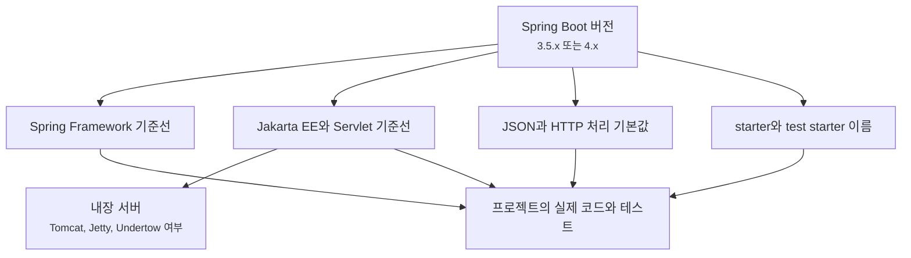
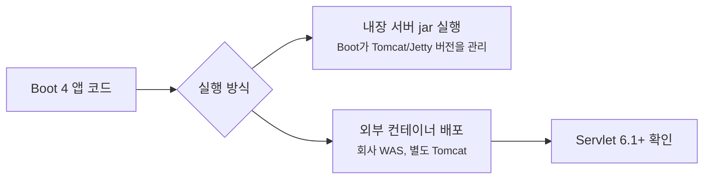
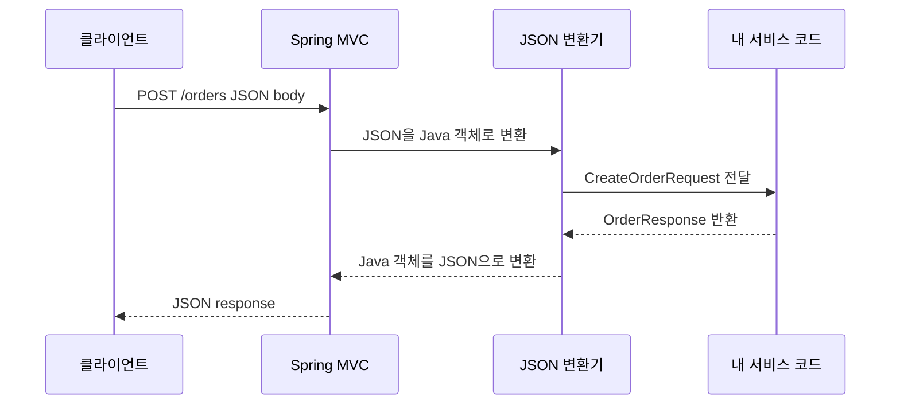
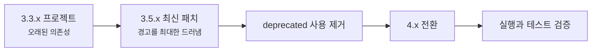

# Spring Boot 4와 3은 무엇이 달라졌을까요?

> `4.1.0`이랑 `3.5.15`는 숫자 하나 차이처럼 보이는데, 사실은 앱 밑바닥의 기준선이 같이 움직여요.

지난 글에서는 `application.yml`, profile, 환경 변수, Configuration Properties를 봤어요. 설정은 코드 밖에서 들어오고, Spring Boot는 여러 출처를 합쳐서 최종 Environment를 만든다는 이야기였죠.

이번에는 잠깐 길을 멈추고 버전 지도를 볼게요.

Spring Boot 글을 읽다 보면 이런 장면을 자주 만나요.

```gradle
plugins {
    id "java"
    id "org.springframework.boot" version "4.1.0"
}
```

혹은 기존 회사 프로젝트에서는 이런 버전을 볼 수도 있어요.

```gradle
plugins {
    id "java"
    id "org.springframework.boot" version "3.5.15"
}
```

처음에는 이렇게 생각하기 쉬워요.

> "4가 최신이고 3은 예전 버전인가요?"  
> "둘 다 Java 17이면 비슷한 거 아닌가요?"  
> "버전 숫자만 올리면 Spring Boot가 알아서 맞춰주겠죠?"  
> "왜 `javax`가 아니라 `jakarta`를 쓰라고 하죠?"  
> "왜 예전 `spring-boot-starter-web` 글과 새 `spring-boot-starter-webmvc` 글이 다르죠?"

오늘 목표는 세부 변경 목록을 전부 외우는 게 아니에요. **Spring Boot 버전은 단일 라이브러리 하나가 아니라 Spring Framework, Jakarta EE, Servlet 컨테이너, JSON, 테스트, starter 이름까지 묶어서 움직이는 기준선**이라는 감각을 잡는 거예요.

!!! note "이 글의 기준"
    이 글은 2026년 7월 1일 기준 Spring Boot 공식 문서에서 확인한 Spring Boot 4.1.0, 4.0 마이그레이션 가이드, 3.5.15 시스템 요구사항을 바탕으로 작성했어요. 패치 버전은 계속 바뀔 수 있으니 새 프로젝트나 마이그레이션에서는 사용 중인 버전의 공식 문서를 함께 확인하세요.

---

## 버전은 "윗줄 숫자"만 바꾸는 게 아니에요

Spring Boot 버전 하나를 올린다고 해볼게요.

```diff
 plugins {
-    id "org.springframework.boot" version "3.5.15"
+    id "org.springframework.boot" version "4.1.0"
 }
```

겉으로는 한 줄이에요. 하지만 이 한 줄은 Spring Boot가 관리하는 의존성 버전 표, 즉 BOM(Bill of Materials)을 바꿔요.

그래서 같이 움직이는 게 많아요.



이 그림에서 중요한 건 `Spring Boot 버전`만 바꿨는데 `프로젝트의 실제 코드와 테스트`가 영향을 받는다는 점이에요. 내 코드가 Spring Framework API를 직접 쓰고 있거나, Servlet API를 import하고 있거나, Jackson 설정을 만지고 있거나, 테스트 Annotation을 쓰고 있다면 Spring Boot 버전 변경은 내 코드 변경으로 이어질 수 있어요.

그래서 실무에서는 "Spring Boot를 올린다"를 이렇게 읽어야 해요.

> Spring Boot가 검증한 전체 조합을 새 기준선으로 갈아탄다.

이전 글에서 BOM을 봤죠. 버전 하나를 직접 고르는 게 아니라, Spring Boot가 맞춰둔 조합을 따른다는 이야기였어요. 마이그레이션도 같은 방식으로 읽으면 덜 헷갈려요.

---

## 4.x와 3.5.x를 한 장으로 보면 이래요

먼저 큰 지도를 볼게요. 숫자는 독자가 결정을 내려야 하는 축만 남겼어요.

| 확인할 축 | Spring Boot 4.x 기준 | Spring Boot 3.5.x에서 볼 수 있는 차이 | 지금 확인할 것 |
|---|---|---|---|
| Java | 최소 Java 17 이상 | 최소 Java 17 이상 | Java 숫자만으로는 4.x 준비 여부를 판단하지 말기 |
| Spring Framework | 7.x 계열 | 6.2.x 계열 | Framework API 직접 사용, deprecated API 사용 여부 |
| Jakarta EE / Servlet | Jakarta EE 11, Servlet 6.1 기준 | Servlet 6.0 계열의 내장 컨테이너, 3.x의 Jakarta 기반 | `jakarta.*` import, 배포 컨테이너 호환성 |
| 내장 서버 | Tomcat 11.0.x, Jetty 12.1.x 중심 | Tomcat 10.1, Jetty 12.0, Undertow 2.3 지원 | Undertow 사용 여부, 외부 WAS 배포 여부 |
| starter 구조 | 더 세분화된 starter와 test starter | 오래된 글에서는 `starter-web`, `starter-test` 중심 예제가 많음 | start.spring.io가 만든 의존성 이름을 기준으로 보기 |
| JSON | Jackson 3 방향이 기본 흐름 | Jackson 2 기반 프로젝트가 많음 | ObjectMapper customizer, JSON 테스트, 날짜/enum/unknown field 처리 |
| 테스트 | 기술별 test starter가 더 중요해짐 | `spring-boot-starter-test` 하나로 넓게 가져오는 예제가 많음 | MVC, Security, Data 테스트 의존성을 실제 기술별로 분리할지 |
| 마이그레이션 | 3.5.x 최신 패치에서 deprecated 경고를 먼저 줄인 뒤 4.x로 | 기존 3.x 운영 프로젝트가 많음 | 한 번에 버전만 올리지 말고 경고, 의존성, 테스트를 먼저 정리하기 |

이 표를 보고 "둘 다 Java 17이네?"에서 멈추면 위험해요. Java 최소 버전은 시작선일 뿐이에요. 실제 차이는 Spring Framework 7, Jakarta EE 11, Servlet 6.1, starter 모듈화, Jackson 3 같은 주변 기준선에서 나타나요.

!!! tip "버전 표를 읽을 때는 세 칸으로 나누세요"
    `내가 쓰는 코드`, `Spring Boot가 관리하는 의존성`, `실행 환경`을 따로 보세요. 빌드는 되는데 실행 서버가 안 맞거나, 실행은 되는데 JSON 테스트가 깨지는 일이 이 경계에서 생겨요.

---

## Java 17 이상이라고 해서 둘이 같은 세대는 아니에요

Spring Boot 3.x로 넘어올 때 이미 큰 변화가 있었어요. Java 17 이상, Spring Framework 6, `javax.*`에서 `jakarta.*`로 가는 흐름이 그때 많은 프로젝트를 한 번 흔들었죠.

그래서 Boot 3.5.x 프로젝트를 쓰고 있다면 이미 이런 코드를 많이 보고 있을 거예요.

```java
import jakarta.validation.Valid;
import jakarta.persistence.Entity;
import jakarta.servlet.http.HttpServletRequest;
```

Boot 4.x도 최소 Java 17 이상이에요. 그래서 겉으로는 이렇게 보일 수 있어요.

> "Java 버전은 그대로네? 그러면 쉬운 업그레이드 아닌가요?"

근데요, Java 최소 버전은 한 축일 뿐이에요. Boot 4.x는 Spring Framework 7.x, Jakarta EE 11, Servlet 6.1 기준으로 올라가요. 즉 "자바가 실행할 수 있느냐"와 "내 앱이 기대한 Spring/Jakarta API 조합이 맞느냐"는 다른 질문이에요.

비유하자면 이래요. 같은 운전면허로 운전할 수는 있지만, 차의 계기판과 도로 규칙과 정비 부품이 바뀐 상황에 가까워요. 면허증만 보고 "똑같다"고 말하면 실제 운행 중에 부딪히는 지점을 놓치게 돼요.

실무에서는 이런 순서로 확인하는 편이 좋아요.

```bash
java -version
./gradlew dependencies
./gradlew test
```

`java -version`은 시작 확인이에요. 하지만 진짜 마이그레이션 판단은 dependency tree와 test 결과에서 나와요. 어떤 라이브러리가 Boot BOM을 따르는지, 어떤 라이브러리는 버전을 직접 고정했는지, 어떤 테스트가 Spring Framework나 Jackson 변화에 민감한지를 봐야 해요.

---

## `javax`에서 `jakarta` 문제는 3.x에서 끝난 게 아니에요

많은 글에서 Spring Boot 3의 큰 변화로 `javax.*`에서 `jakarta.*` 전환을 말해요. 맞아요. Boot 2.x에서 3.x로 올릴 때는 이런 import가 대표적인 문제였어요.

```java
// 오래된 코드에서 볼 수 있는 모양
import javax.servlet.http.HttpServletRequest;
import javax.validation.Valid;
```

Boot 3.x 이상에서는 보통 이렇게 바뀌어야 해요.

```java
import jakarta.servlet.http.HttpServletRequest;
import jakarta.validation.Valid;
```

그럼 Boot 3.5.x를 이미 쓰는 프로젝트는 안심해도 될까요?

어느 정도는 맞아요. 애플리케이션 코드가 이미 `jakarta.*`로 넘어와 있을 가능성이 높거든요. 하지만 Boot 4.x에서는 Jakarta EE 11과 Servlet 6.1 기준선이 중요해져요. 그래서 문제는 import 이름만이 아니에요.

| 확인할 곳 | 왜 봐야 할까요? |
|---|---|
| 외부 servlet container | Boot 4 앱을 Servlet 6.1 미만 컨테이너에 올리면 기준이 안 맞을 수 있어요 |
| 오래된 필터, interceptor, servlet listener | Servlet API 세대 차이를 직접 맞닥뜨릴 수 있어요 |
| 사내 공통 라이브러리 | 공통 모듈이 오래된 `javax.*` 또는 낮은 Jakarta API에 묶여 있을 수 있어요 |
| third-party starter | Boot 4와 Spring Framework 7에 맞는 버전인지 확인해야 해요 |

특히 외부 Tomcat이나 회사 표준 WAS에 war로 배포하는 프로젝트라면 이 질문을 먼저 해야 해요.

> "내 앱만 Boot 4로 올리면 끝인가요, 아니면 앱을 받아주는 컨테이너도 Servlet 6.1 이상이어야 하나요?"

Spring Boot jar로 내장 Tomcat을 함께 띄우는 프로젝트라면 Boot가 관리하는 Tomcat 버전이 같이 움직여요. 반대로 외부 컨테이너에 배포한다면 그 컨테이너의 Servlet 지원 버전이 내 선택을 막을 수 있어요.



이 그림에서 jar 실행은 Boot가 더 많은 걸 같이 데려가요. 외부 컨테이너 배포는 내 앱 밖의 실행 환경이 기준선을 만족하는지 따로 확인해야 해요.

!!! warning "외부 컨테이너 배포는 버전 숫자만 보고 올리면 안 돼요"
    `bootJar`로 내장 서버를 함께 가져가는 프로젝트와, `war`로 외부 컨테이너에 올리는 프로젝트는 확인 지점이 달라요. 특히 Boot 4.x에서는 Servlet 6.1 기준을 배포 환경과 같이 봐야 해요.

---

## Undertow를 쓰고 있었다면 빨간불이에요

Spring Boot 3.5.x 문서에는 내장 servlet container로 Tomcat 10.1, Jetty 12.0, Undertow 2.3이 보여요. 그런데 Spring Boot 4.0 마이그레이션 가이드는 Undertow 지원이 빠졌다고 안내해요. 이유는 Boot 4의 Servlet 6.1 기준선과 Undertow 호환성 때문이에요.

이 말은 "Undertow가 나쁘다"가 아니에요. 지금 시점의 Boot 4 기준선과 맞지 않아서 Boot가 직접 제공하던 Undertow starter와 embedded server 지원이 사라졌다는 뜻이에요.

그래서 이런 의존성이 있다면 그냥 Boot 버전만 올리면 안 돼요.

```gradle
dependencies {
    implementation "org.springframework.boot:spring-boot-starter-undertow"
}
```

확인 순서는 단순해요.

| 현재 상태 | Boot 4로 갈 때 질문 |
|---|---|
| 기본 Tomcat 사용 | Boot 4가 관리하는 Tomcat 11 계열로 가도 되는지 |
| Jetty 사용 | Jetty 12.1 계열과 앱 코드, 배포 환경이 맞는지 |
| Undertow 사용 | Tomcat/Jetty로 옮길지, Boot 4 전환을 늦출지 |
| 외부 WAS 사용 | Servlet 6.1 이상을 제공하는지 |

서버는 앱의 가장 바깥 경계예요. 이 경계가 안 맞으면 컨트롤러, 서비스, repository까지 가기도 전에 실패할 수 있어요.

---

## starter 이름이 달라 보이면 "문서 세대"를 의심하세요

이전 글에서 Spring Boot 4.x 예제로 이런 의존성을 봤어요.

```gradle
dependencies {
    implementation "org.springframework.boot:spring-boot-starter-webmvc"
    testImplementation "org.springframework.boot:spring-boot-starter-webmvc-test"
}
```

그런데 검색 결과나 기존 프로젝트에서는 이런 모양을 더 자주 볼 수 있어요.

```gradle
dependencies {
    implementation "org.springframework.boot:spring-boot-starter-web"
    testImplementation "org.springframework.boot:spring-boot-starter-test"
}
```

처음 보면 헷갈려요.

> "둘 중 뭐가 맞는 거죠?"

답은 "사용 중인 Spring Boot 세대와 생성된 프로젝트 기준을 보세요"예요.

Spring Boot 4는 모듈 구조와 starter 구조가 더 세분화됐어요. 기술별 main starter와 test starter가 더 명확해졌고, 일부 기술은 예전처럼 third-party 의존성만 추가하면 되던 방식에서 Boot starter를 명시하는 쪽으로 바뀌었어요. 예를 들어 마이그레이션 가이드는 Flyway나 Liquibase도 관련 starter로 바꾸는 사례를 안내해요.

이 변화는 귀찮게 보일 수 있지만, 의도는 분명해요.

| 예전 감각 | Boot 4 쪽 감각 |
|---|---|
| 테스트는 일단 `spring-boot-starter-test` | 테스트하는 기술의 test starter를 명시 |
| 웹이면 `spring-boot-starter-web` | MVC, WebFlux, WebClient 같은 기술 경계를 더 분명히 |
| third-party 라이브러리를 넣으면 Boot가 알아서 도와줌 | Boot가 지원하는 기술 starter를 명시해야 하는 경우 증가 |

실무에서는 이게 test classpath 문제로 나타날 수 있어요. 예를 들어 Security 테스트를 하면서 예전처럼 `spring-security-test`만 직접 넣었는데, Boot 4의 test starter 구조와 맞지 않아 예상 밖의 누락이 생길 수 있어요.

!!! tip "새 글과 오래된 검색 결과가 다르면 start.spring.io를 기준으로 보세요"
    Spring Boot 의존성 이름은 세대별로 달라질 수 있어요. 새 프로젝트라면 공식 Initializr가 생성한 `build.gradle` 또는 `pom.xml`을 먼저 믿고, 오래된 블로그 글의 starter 이름은 사용 중인 Boot 버전에 맞게 읽어야 해요.

---

## Jackson 3는 JSON이 "그냥 문자열"이 아니라는 걸 드러내요

대부분의 API 서버에서 JSON은 너무 자연스럽게 보여요.

```java
record CreateOrderRequest(
        String productCode,
        int quantity
) {
}
```

컨트롤러가 request body를 받으면 Spring이 객체로 바꿔주고, 응답 객체를 return하면 JSON으로 나가죠.

```java
@PostMapping("/orders")
OrderResponse create(@RequestBody CreateOrderRequest request) {
    return orderService.create(request);
}
```

하지만 이 과정 뒤에는 JSON 라이브러리와 message converter가 있어요. Spring Boot 4는 Jackson 3 방향을 기본 흐름으로 가져가고, Boot 3.x 프로젝트에서는 Jackson 2 기반 설정과 테스트를 많이 보게 돼요.

그래서 Boot 4 전환에서 이런 부분을 확인해야 해요.

| 확인할 코드 | 왜 깨질 수 있을까요? |
|---|---|
| `ObjectMapper`를 직접 만드는 코드 | Boot 기본 설정을 덮어써서 module, date format, enum 처리 차이가 생길 수 있어요 |
| `Jackson2ObjectMapperBuilderCustomizer` 같은 customizer | Jackson 2 전용 이름과 API에 묶여 있을 수 있어요 |
| JSON 직렬화 테스트 | 필드 이름, 날짜 형식, unknown field 처리 기대가 달라질 수 있어요 |
| third-party 라이브러리 | 라이브러리가 Jackson 2 API에 직접 기대고 있을 수 있어요 |

처음에는 "JSON 테스트가 왜 깨져요? 비즈니스 로직은 그대로인데요?"라고 느낄 수 있어요. 하지만 JSON은 API 계약이에요. 필드가 빠지거나 날짜 표현이 달라지거나 enum 처리가 달라지면 클라이언트 입장에서는 다른 API가 돼요.



이 흐름에서 내 서비스 코드는 그대로여도 JSON 변환기가 바뀌면 입출력 계약이 흔들릴 수 있어요. 그래서 Boot 4 마이그레이션에서는 컨트롤러 테스트와 JSON slice 테스트를 가볍게 보면 안 돼요.

---

## deprecated 경고는 "나중에"가 아니라 다음 major의 예고예요

Spring Boot 4.0 마이그레이션 가이드는 3.5.x 최신 버전으로 먼저 올리고, deprecated API 사용을 정리하라고 안내해요.

왜 그럴까요?

3.x에서 deprecated였던 클래스, 메서드, 설정 property가 4.x에서 제거될 수 있기 때문이에요. 그러면 3.x에서는 노란 경고였던 것이 4.x에서는 컴파일 에러나 실행 실패가 돼요.

예를 들어 이런 흐름이에요.



이 순서를 건너뛰면 문제가 한꺼번에 터져요. Java API 문제, Spring Framework 문제, 설정 property 이름 변경, starter 이름 변경, JSON 차이, 테스트 의존성 차이가 한 PR에 섞일 수 있어요.

실무에서는 이게 리뷰하기 어려운 변경이 돼요.

| 방식 | 결과 |
|---|---|
| 3.5.x 최신 패치로 먼저 올림 | 3.x 안에서 해결할 수 있는 경고를 먼저 정리할 수 있어요 |
| deprecated 경고 제거 | 4.x에서 사라진 API 때문에 막힐 가능성을 줄여요 |
| dependency tree 정리 | Boot BOM 밖에서 직접 고정한 버전을 찾을 수 있어요 |
| 테스트를 먼저 튼튼하게 | 4.x 전환 뒤 무엇이 바뀌었는지 비교할 기준이 생겨요 |
| 한 번에 4.x로 점프 | 여러 종류의 실패가 섞여 원인을 찾기 어려워져요 |

!!! warning "마이그레이션 PR은 작게 쪼개는 게 좋아요"
    Boot 4 전환은 기능 개발 PR과 섞지 않는 편이 좋아요. 버전 기준선 변경, deprecated 제거, JSON 계약 변경, 테스트 의존성 변경이 섞이면 실패 원인을 분리하기 어려워요.

---

## 지금 프로젝트에서 무엇을 보면 될까요?

이 글을 읽고 바로 모든 release note를 외울 필요는 없어요. 대신 프로젝트에서 아래 다섯 군데를 보면 돼요.

### 1. 빌드 파일의 Boot 버전과 직접 고정한 의존성

```gradle
plugins {
    id "org.springframework.boot" version "3.5.15"
}

dependencies {
    implementation "org.springframework.boot:spring-boot-starter-web"
    implementation "com.fasterxml.jackson.datatype:jackson-datatype-jsr310:2.17.0"
}
```

위 예시에서 Boot starter는 BOM을 따를 가능성이 높아요. 하지만 Jackson 버전을 직접 적은 줄은 별도로 확인해야 해요. 꼭 나쁘다는 뜻은 아니에요. 다만 Boot가 관리하는 조합에서 벗어난 선택인지 봐야 한다는 뜻이에요.

### 2. `javax.*`와 오래된 Jakarta API import

```bash
rg "import javax\\." src
rg "jakarta\\.servlet" src
```

Boot 3.x 이상이라면 앱 코드의 `javax.*`는 대부분 정리되어 있어야 해요. Boot 4로 갈 때는 import 이름뿐 아니라 사용하는 API와 외부 컨테이너 기준선도 같이 봐야 해요.

### 3. 서버 선택

```bash
rg "undertow|tomcat|jetty" build.gradle pom.xml
```

Tomcat 기본값을 쓰는지, Jetty를 명시했는지, Undertow를 쓰고 있는지 먼저 확인하세요. 특히 Undertow가 있으면 Boot 4 전환 계획을 따로 세워야 해요.

### 4. JSON customizer와 테스트

```bash
rg "ObjectMapper|Jackson2|JsonTest|JsonMapper" src
```

API 계약이 있는 프로젝트라면 JSON 테스트는 마이그레이션의 안전망이에요. "응답이 대충 JSON으로 나온다"가 아니라 날짜, enum, null, unknown field, error response shape까지 확인해야 해요.

### 5. test starter와 slice test

```bash
rg "spring-boot-starter-test|spring-security-test|@WebMvcTest|@DataJpaTest" .
```

Boot 4 쪽 문서는 기술별 test starter를 더 분명히 보여줘요. MVC, WebFlux, Security, Data 같은 테스트가 어떤 의존성으로 돌아가는지 확인하세요.

---

## 처음 Spring Boot를 배우는 사람은 어느 버전을 보면 좋을까요?

새로 배우는 사람에게는 이렇게 권하고 싶어요.

> 새 프로젝트는 공식 Initializr가 제안하는 최신 안정 버전을 기준으로 시작하세요. 다만 회사나 강의, 책, 기존 프로젝트가 3.5.x라면 그 버전을 먼저 정확히 이해하는 것도 충분히 좋은 선택이에요.

중요한 건 "무조건 최신"이 아니에요. 중요한 건 내가 보고 있는 코드와 문서의 기준선을 맞추는 거예요.

| 상황 | 추천 읽기 |
|---|---|
| 새 토이 프로젝트를 만든다 | start.spring.io 최신 안정 버전 기준 |
| 회사 프로젝트가 3.5.x다 | 3.5.x 문서와 현재 코드 기준으로 학습 |
| 3.x에서 4.x로 올릴 예정이다 | 3.5.x 최신 패치, deprecated 제거, Boot 4 migration guide 순서 |
| 검색 결과가 서로 다르다 | 글 작성 시점과 Spring Boot major 버전을 먼저 확인 |

이 블로그의 앞으로 글은 Spring Boot 4.x를 기본 방향으로 두되, 3.x 프로젝트에서 자주 마주치는 차이는 필요한 곳에서 짚을 거예요. 그래서 예제의 starter 이름이나 Jackson 이야기가 검색 결과와 다르게 보이면 "어느 세대의 Boot를 기준으로 쓴 글인가?"를 먼저 물어보면 돼요.

---

## 참고한 링크

- [Spring Boot System Requirements](https://docs.spring.io/spring-boot/system-requirements.html)
- [Spring Boot 3.5 System Requirements](https://docs.spring.io/spring-boot/3.5/system-requirements.html)
- [Spring Boot 4.0 Migration Guide](https://github.com/spring-projects/spring-boot/wiki/Spring-Boot-4.0-Migration-Guide)
- [Spring Boot 3.5 Release Notes](https://github.com/spring-projects/spring-boot/wiki/Spring-Boot-3.5-Release-Notes)

## 자, 정리해볼까요?

!!! abstract "오늘 우리가 배운 것"
    - Spring Boot 버전은 라이브러리 하나가 아니라 Spring Framework, Jakarta EE, Servlet, JSON, starter, 테스트 조합을 함께 움직여요.
    - Boot 4.x와 3.5.x는 둘 다 Java 17 이상을 요구하지만, Spring Framework 7과 Jakarta EE 11, Servlet 6.1 기준선 때문에 실제 확인 지점이 달라져요.
    - Boot 4로 갈 때는 3.5.x 최신 패치에서 deprecated 경고와 직접 고정한 의존성을 먼저 정리하는 편이 좋아요.
    - Undertow, 외부 servlet container, Jackson customizer, test starter는 마이그레이션에서 특히 먼저 확인할 지점이에요.
    - 새 글이나 오래된 검색 결과를 볼 때는 "이 글은 어느 Spring Boot major 버전을 기준으로 쓰였나?"를 먼저 확인해야 해요.

다음 글부터는 다시 요청 흐름으로 들어갈 거예요. 브라우저가 `/orders`로 요청을 보냈을 때, DispatcherServlet이 어떻게 컨트롤러를 찾고, argument를 만들고, 응답을 JSON으로 쓰는지 Spring MVC의 한 요청 생명주기를 따라가볼게요.
