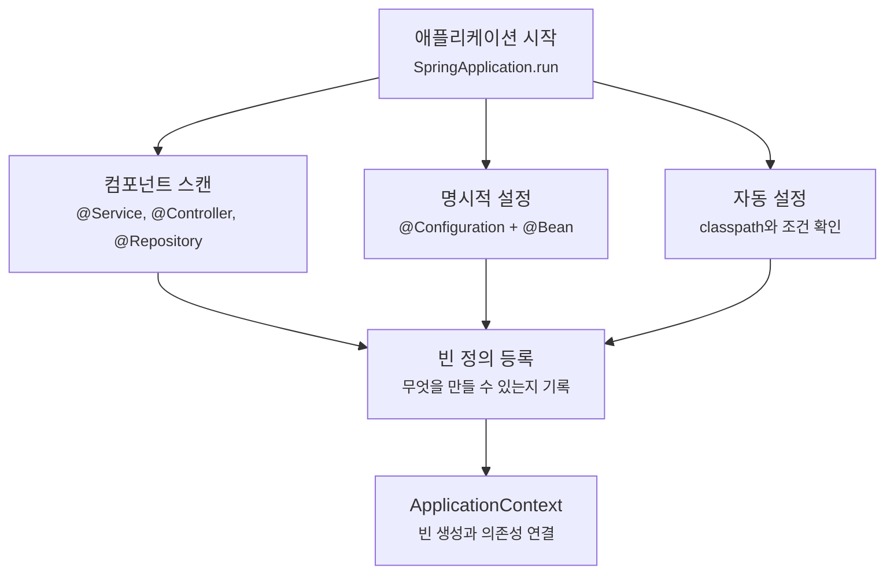
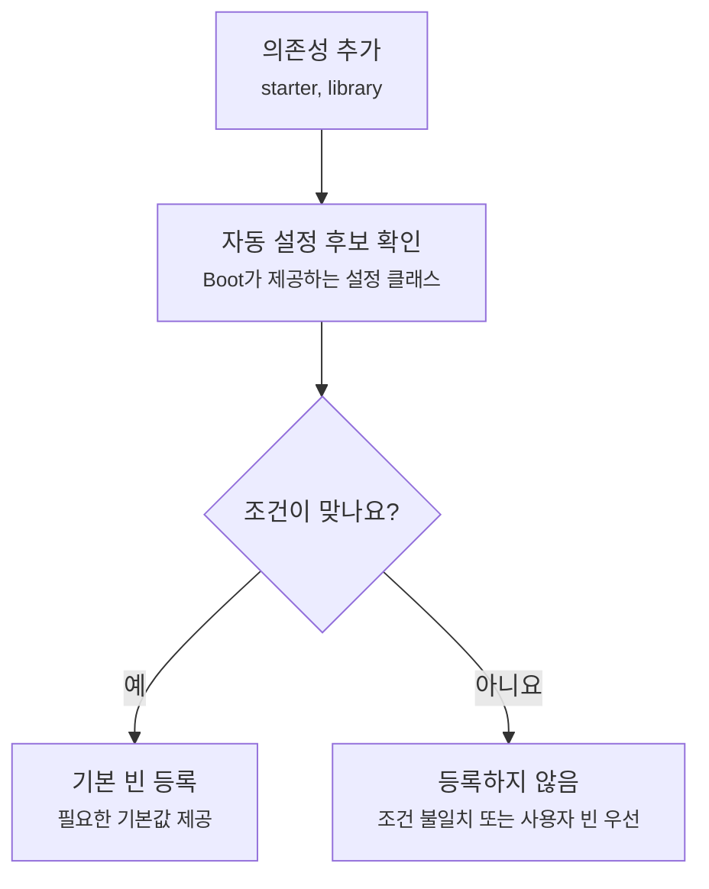

# 컴포넌트 스캔과 Bean 등록은 왜 가끔 내 클래스를 못 찾을까요?

> 클래스를 만들었다고 해서 Spring이 그 클래스를 자동으로 아는 건 아니에요.

지난 글에서는 ApplicationContext가 빈(bean)을 만들고 연결한다고 했어요. 그러면 자연스럽게 다음 질문이 생겨요.

> "그럼 어떤 클래스가 빈으로 등록되는 거지?"  
> "`@Service`를 붙였는데 왜 못 찾는다고 하지?"  
> "`@Bean`이랑 `@Component`는 뭐가 다른 거지?"  
> "자동 설정(auto-configuration)은 내가 만든 빈이랑 어떤 관계지?"

처음에는 "Annotation을 붙이면 되겠지" 정도로 넘어가기 쉬워요. 그런데 실제 프로젝트에서는 빈이 안 잡혀서 앱이 시작하지 않거나, 반대로 원하지 않은 빈이 잡혀서 테스트가 이상해지는 일이 자주 생겨요.

오늘은 이 지점을 볼게요.

목표는 모든 등록 방식을 외우는 게 아니에요. Spring Boot 앱에서 빈이 ApplicationContext에 들어오는 대표적인 길을 나누고, "Spring이 못 찾는다"는 말을 더 정확한 질문으로 바꾸는 거예요.

!!! note "이 글의 기준"
    이 글은 Spring Boot 4.1.0 공식 문서의 `@SpringBootApplication`, 코드 구조, 자동 설정 설명과 Spring Framework 공식 문서의 클래스패스 스캔(classpath scanning), `@Bean` 설명을 확인해 작성했어요. 컴포넌트 스캔과 빈 등록 개념은 Spring Boot 전반에서 이어지는 이야기지만, 정확한 조건 Annotation이나 자동 설정 작성 규칙은 뒤 글에서 더 깊게 다룰게요.

---

## 먼저 흔한 시작 실패부터 볼게요

주문 서비스가 결제 클라이언트를 필요로 한다고 해볼게요.

```java
package com.example.order;

import com.example.payment.PaymentClient;
import org.springframework.stereotype.Service;

@Service
class OrderService {

    private final PaymentClient paymentClient;

    OrderService(PaymentClient paymentClient) {
        this.paymentClient = paymentClient;
    }
}
```

그리고 결제 클라이언트도 컴포넌트로 표시했어요.

```java
package com.example.payment;

import org.springframework.stereotype.Component;

@Component
public class PaymentClient {
}
```

겉으로 보면 문제없어 보여요. `PaymentClient` 클래스도 있고, `@Component`도 붙어 있으니까요.

그런데 앱을 실행하면 이런 방향으로 실패할 수 있어요.

```text
Parameter 0 of constructor in com.example.order.OrderService required a bean of type
'com.example.payment.PaymentClient' that could not be found.
```

이 메시지는 "Java 클래스가 없다"는 뜻이 아니에요. 클래스는 있어요. 다만 Spring 컨테이너 안에 `PaymentClient` 빈이 등록되지 않았다는 뜻이에요.

여기서 질문을 바꿔야 해요.

> "클래스가 있나?"가 아니라, "그 클래스가 빈으로 등록되는 경로 안에 있나?"

---

## 빈이 들어오는 길은 하나가 아니에요

Spring Boot 애플리케이션에서 빈이 등록되는 대표적인 길은 세 가지예요.

| 등록 경로 | 개발자가 보는 코드 | 주로 쓰는 상황 |
|---|---|---|
| 컴포넌트 스캔(component scan) | `@Component`, `@Service`, `@Controller`, `@Repository` | 내가 만든 애플리케이션 클래스 |
| 명시적인 `@Bean` 메서드 | `@Configuration` 안의 `@Bean` | 외부 라이브러리 객체, 생성 과정이 필요한 객체 |
| 조건부 등록 | `@ConditionalOnMissingBean`, `@ConditionalOnClass` 등 | Spring Boot 자동 설정, 라이브러리 기본값 |

이 세 길은 모두 결과적으로 ApplicationContext에 빈 정의를 넣어요. 하지만 "어디서 찾는지", "누가 만들기로 결정하는지", "언제 물러나는지"가 달라요.



이 그림에서 핵심은 빈이 "한 방식"으로만 들어오지 않는다는 점이에요. 내가 만든 서비스는 스캔으로 들어오고, 외부 클라이언트는 `@Bean`으로 들어오고, Boot 기본값은 조건부 자동 설정으로 들어올 수 있어요.

---

## 컴포넌트 스캔은 "정해진 범위 안"에서만 찾아요

Spring Boot 프로젝트에는 보통 시작 클래스가 있어요.

```java
package com.example.order;

import org.springframework.boot.SpringApplication;
import org.springframework.boot.autoconfigure.SpringBootApplication;

@SpringBootApplication
public class OrderApplication {

    public static void main(String[] args) {
        SpringApplication.run(OrderApplication.class, args);
    }
}
```

`@SpringBootApplication`은 여러 기능을 한 번에 켜는 편의 Annotation이에요. 그중 하나가 컴포넌트 스캔이에요.

처음에는 이렇게 기억하면 좋아요.

> 시작 클래스가 있는 패키지와 그 아래 패키지에서 컴포넌트 후보를 찾아요.

예를 들어 시작 클래스가 `com.example.order`에 있으면 아래 구조는 자연스러워요.

```text
com.example.order
├── OrderApplication.java
├── controller
│   └── OrderController.java
├── service
│   └── OrderService.java
└── repository
    └── OrderRepository.java
```

`controller`, `service`, `repository`가 모두 `com.example.order` 아래에 있으니까 스캔 범위 안에 들어와요.

반대로 이런 구조는 조심해야 해요.

```text
com.example.order
└── OrderApplication.java

com.example.payment
└── PaymentClient.java
```

`PaymentClient`는 `com.example.order` 아래에 있지 않아요. 클래스가 있고 `@Component`가 붙어 있어도, 기본 스캔 범위 밖이면 빈으로 등록되지 않을 수 있어요.

그래서 보통은 시작 클래스를 더 위쪽 공통 패키지에 둬요.

```text
com.example
├── OrderApplication.java
├── order
│   ├── OrderController.java
│   └── OrderService.java
└── payment
    └── PaymentClient.java
```

이 구조에서는 `order`와 `payment`가 모두 `com.example` 아래에 있으니 훨씬 예측하기 쉬워요.

!!! tip "시작 클래스 위치는 설계 결정이에요"
    `OrderApplication` 같은 시작 클래스는 애플리케이션의 루트 패키지에 두는 편이 좋아요. 그래야 새 기능 패키지를 추가해도 컴포넌트 스캔 범위가 자연스럽게 따라와요.

---

## `@Service`와 `@Component`는 역할 표시이기도 해요

컴포넌트 스캔은 아무 클래스나 전부 빈으로 만들지 않아요. 후보가 되는 표시가 필요해요.

가장 기본은 `@Component`예요.

```java
package com.example.payment;

import org.springframework.stereotype.Component;

@Component
public class PaymentClient {
}
```

그리고 Spring에는 역할을 더 드러내는 Annotation들이 있어요.

| Annotation | 흔한 역할 |
|---|---|
| `@Controller` | Spring MVC 컨트롤러 |
| `@RestController` | JSON 응답을 주는 REST 컨트롤러 |
| `@Service` | 업무 규칙을 담는 서비스 |
| `@Repository` | 데이터 접근 계층 |
| `@Configuration` | 빈 설정을 담는 클래스 |

이 Annotation들은 단순한 장식이 아니에요. 컴포넌트 스캔의 후보가 되게 만들고, 동시에 읽는 사람에게 역할을 알려줘요.

예를 들어 `OrderService`에는 `@Component`를 붙여도 빈 등록은 될 수 있어요.

```java
@Component
class OrderService {
}
```

하지만 보통은 `@Service`가 더 낫죠.

```java
@Service
class OrderService {
}
```

둘 다 빈 후보가 될 수 있지만, `@Service`는 "이 클래스는 업무 규칙을 담는 곳이에요"라는 의도를 더 잘 보여줘요.

!!! note "처음에는 역할 Annotation을 기준으로 쓰세요"
    컨트롤러는 `@RestController`, 서비스는 `@Service`, 저장소는 `@Repository`처럼 역할을 드러내는 편이 좋아요. `@Component`는 역할 이름이 따로 맞지 않는 일반 컴포넌트에 쓰면 충분해요.

---

## `@Bean`은 "이 메서드 결과를 빈으로 등록해줘"라는 뜻이에요

컴포넌트 스캔은 내가 만든 클래스에 Annotation을 붙이는 방식이에요.

그런데 모든 객체에 `@Component`를 붙일 수 있는 건 아니에요. 예를 들어 Java 표준 라이브러리의 `Clock`을 애플리케이션에서 공통으로 쓰고 싶다고 해볼게요. `Clock` 클래스에 우리가 `@Component`를 붙일 수는 없죠.

이럴 때 `@Bean`을 쓸 수 있어요.

```java
package com.example.order;

import java.time.Clock;
import org.springframework.context.annotation.Bean;
import org.springframework.context.annotation.Configuration;

@Configuration
class TimeConfig {

    @Bean
    Clock clock() {
        return Clock.systemDefaultZone();
    }
}
```

이 코드는 이렇게 읽으면 돼요.

> `clock()` 메서드가 돌려주는 객체를 `clock`이라는 이름의 빈으로 등록해줘요.

이제 다른 빈은 `Clock`을 생성자로 받을 수 있어요.

```java
package com.example.order;

import java.time.Clock;
import java.time.LocalDate;
import org.springframework.stereotype.Service;

@Service
class OrderDeadlineService {

    private final Clock clock;

    OrderDeadlineService(Clock clock) {
        this.clock = clock;
    }

    LocalDate today() {
        return LocalDate.now(clock);
    }
}
```

여기서 `Clock` 자체는 `@Component`가 붙은 클래스가 아니에요. 하지만 `TimeConfig`의 `@Bean` 메서드가 빈 정의를 만들어줬기 때문에 컨테이너가 주입할 수 있어요.

---

## 컴포넌트 스캔과 `@Bean`은 책임이 달라요

둘 다 빈을 등록할 수 있으니 처음에는 아무거나 써도 되는 것처럼 보일 수 있어요.

하지만 설계 의도가 달라요.

| 질문 | 컴포넌트 스캔 | `@Bean` |
|---|---|---|
| 어디에 표시하나요? | 클래스 위 | 메서드 위 |
| 누가 객체를 만들까요? | 컨테이너가 생성자를 호출해요 | 메서드 본문이 객체를 만들어 돌려줘요 |
| 무엇에 어울리나요? | 내가 작성한 컨트롤러, 서비스, 저장소 | 외부 라이브러리 객체, 설정값이 필요한 객체 |
| 생성 로직은 어디에 있나요? | 클래스 생성자와 Spring 의존성 해석 | 설정 클래스의 메서드 안 |

예를 들어 `OrderService`는 보통 컴포넌트 스캔이 자연스러워요.

```java
@Service
class OrderService {
}
```

반대로 외부 API 클라이언트처럼 생성 과정에 URL, 타임아웃, 인증 정보가 들어가는 객체는 설정으로 드러내는 편이 좋을 수 있어요.

```java
@Configuration
class PaymentClientConfig {

    @Bean
    PaymentClient paymentClient(PaymentProperties properties) {
        return new PaymentClient(properties.baseUrl(), properties.timeout());
    }
}
```

이 코드는 예시예요. 중요한 건 `PaymentClient`를 만드는 결정이 서비스 안에 숨어 있지 않고, 설정 영역에 올라와 있다는 점이에요.

---

## 자동 설정은 조건을 보고 "기본 빈"을 넣어요

Spring Boot를 쓰면 내가 직접 등록하지 않았는데도 많은 빈이 준비돼요.

웹 스타터를 넣으면 웹 요청 처리에 필요한 기본 구성이 들어오고, 데이터 접근 스타터를 넣으면 관련 자동 설정이 후보로 올라와요.

이건 Spring Boot가 조건을 보고 기본 설정을 적용하기 때문이에요.



여기서 조건이라는 말이 중요해요.

자동 설정은 보통 "이 클래스가 클래스패스에 있나요?", "이미 사용자가 같은 역할의 빈을 등록했나요?", "이 프로퍼티가 켜져 있나요?" 같은 질문을 해요.

예를 들어 Boot의 자동 설정이나 라이브러리 설정에서는 이런 식의 조건을 자주 볼 수 있어요.

```java
@Bean
@ConditionalOnMissingBean
PaymentClient paymentClient(PaymentProperties properties) {
    return new PaymentClient(properties.baseUrl(), properties.timeout());
}
```

이 코드는 이런 의도에 가까워요.

> 사용자가 `PaymentClient` 빈을 직접 등록하지 않았다면 기본 `PaymentClient`를 만들어줘요.

그러면 사용자는 필요할 때 자기 빈을 등록해서 기본값을 바꿀 수 있어요.

```java
@Configuration
class MyPaymentConfig {

    @Bean
    PaymentClient paymentClient() {
        return new PaymentClient("https://payments.internal", Duration.ofSeconds(2));
    }
}
```

이런 구조 때문에 Spring Boot의 자동 설정은 "무조건 덮어쓰기"가 아니에요. 많은 경우 사용자가 명시적으로 등록한 빈을 우선하고, 비어 있는 자리에 기본값을 채워요.

!!! note "조건부 등록은 뒤에서 더 깊게 볼 거예요"
    지금은 자동 설정이 조건을 보고 빈을 등록한다는 감각만 잡으면 충분해요. 스타터, 의존성 관리, 조건 리포트, 사용자 빈으로 기본값을 바꾸는 흐름은 자동 설정 글에서 자세히 이어갈게요.

---

## "못 찾는다"는 말을 더 작게 쪼개볼게요

앱이 시작하지 않고 "빈을 찾을 수 없다"는 메시지가 나오면, 바로 Annotation을 더 붙이기 전에 원인을 나눠보는 게 좋아요.

| 증상 | 먼저 확인할 것 |
|---|---|
| 클래스에 `@Service`가 있는데 못 찾음 | 시작 클래스의 하위 패키지 안에 있는지 |
| `@Bean` 메서드를 만들었는데 못 찾음 | 그 설정 클래스가 스캔되거나 `@Import`됐는지 |
| 인터페이스 타입을 주입했는데 못 찾음 | 실제 구현체가 빈으로 등록됐는지 |
| 후보가 여러 개라 실패함 | `@Primary`, `@Qualifier`, 파라미터 이름 등 선택 기준이 있는지 |
| 로컬에서는 되는데 테스트에서 안 됨 | 테스트가 전체 컨텍스트인지, MVC/Data slice인지 |
| 특정 프로필에서만 안 됨 | `@Profile`, 설정값, 조건부 등록 때문에 빠진 건 아닌지 |
| 외부 라이브러리 객체를 주입하려는데 안 됨 | `@Bean`으로 직접 등록해야 하는 객체인지 |

예를 들어 아래 코드는 인터페이스만 보고는 빈을 만들 수 없어요.

```java
public interface PaymentClient {

    void pay(String orderId);
}
```

인터페이스는 계약이에요. 실제 객체가 되려면 구현체가 필요해요.

```java
package com.example.payment;

import org.springframework.stereotype.Component;

@Component
class HttpPaymentClient implements PaymentClient {

    @Override
    public void pay(String orderId) {
        // 외부 결제 API 호출
    }
}
```

이제 컨테이너는 `PaymentClient` 타입이 필요할 때 `HttpPaymentClient` 빈을 후보로 볼 수 있어요.

반대로 구현체가 둘이면 문제가 달라져요.

```java
@Component
class HttpPaymentClient implements PaymentClient {
}

@Component
class FakePaymentClient implements PaymentClient {
}
```

이제는 "없어서 실패"가 아니라 "둘 중 무엇을 넣을지 몰라서 실패"예요.

이때는 기본 후보를 정하거나, 주입 지점에서 어떤 구현체가 필요한지 드러내야 해요. 이 이야기는 다음 글의 의존성 주입에서 더 자세히 볼 거예요.

---

## `@ComponentScan`으로 범위를 넓히는 건 마지막에 가까워요

스캔 범위 밖 클래스가 문제라면 `@ComponentScan`으로 범위를 직접 지정할 수 있어요.

```java
@SpringBootApplication
@ComponentScan(basePackages = {"com.example.order", "com.example.payment"})
public class OrderApplication {
}
```

하지만 처음부터 이 방식으로 해결하려고 하면 프로젝트 구조가 흐려질 수 있어요.

보통은 먼저 패키지 구조를 정리하는 게 더 좋아요.

```text
com.example
├── OrderApplication.java
├── order
└── payment
```

이 구조라면 별도의 `@ComponentScan` 설정 없이도 읽는 사람이 범위를 예측할 수 있어요.

물론 예외는 있어요. 여러 모듈을 조립하는 애플리케이션, 외부 패키지의 컴포넌트를 의도적으로 포함해야 하는 구조, 프레임워크나 라이브러리 코드에서는 명시적인 스캔 범위가 필요할 수 있어요.

중요한 기준은 이거예요.

> 스캔 범위를 넓히기 전에, 시작 클래스 위치와 패키지 경계가 먼저 맞는지 보세요.

!!! warning "스캔 범위를 너무 넓히면 원하지 않은 빈도 들어와요"
    `com`처럼 너무 넓은 패키지를 스캔하거나, 테스트용 설정이 상위 패키지에 놓이면 의도하지 않은 클래스가 빈으로 잡힐 수 있어요. 빈이 안 잡히는 문제만큼, 너무 많이 잡히는 문제도 디버깅을 어렵게 만들어요.

---

## 실무에서는 등록 경로가 코드 리뷰 포인트가 돼요

빈 등록 방식은 단순 취향이 아니에요. 나중에 테스트, 설정, 운영 추적성까지 이어져요.

서비스 클래스에 필요한 객체를 직접 만들면 컨테이너가 볼 수 없어요.

```java
@Service
class OrderService {

    private final PaymentClient paymentClient = new PaymentClient();
}
```

이 코드는 테스트에서 `PaymentClient`를 바꾸기 어렵고, 설정값도 서비스 안에 숨어들기 쉬워요.

반대로 빈으로 등록하고 생성자로 받으면 관계가 드러나요.

```java
@Service
class OrderService {

    private final PaymentClient paymentClient;

    OrderService(PaymentClient paymentClient) {
        this.paymentClient = paymentClient;
    }
}
```

코드 리뷰에서는 이런 질문을 해볼 수 있어요.

| 질문 | 이유 |
|---|---|
| 이 클래스는 스캔으로 들어오는 게 자연스러운가요? | 애플리케이션 역할 클래스인지 확인해요 |
| 외부 객체를 `new`로 만들고 있지 않나요? | 설정, 테스트 대역, 생명주기 관리가 어려워질 수 있어요 |
| `@Bean` 설정 클래스는 스캔 범위 안에 있나요? | 설정을 만들었지만 컨테이너가 모를 수 있어요 |
| 같은 타입 후보가 늘어날 가능성이 있나요? | 나중에 주입 기준이 모호해질 수 있어요 |
| 조건부 등록이 숨어 있나요? | 프로필, 클래스패스, 사용자 빈 유무에 따라 결과가 달라질 수 있어요 |

이 질문들은 "Spring이 알아서 해주겠지"를 더 구체적인 설계 판단으로 바꿔줘요.

---

## 오늘의 핵심 경계를 한 번에 놓아볼게요

빈 등록을 읽을 때는 아래 순서로 보면 좋아요.


이 순서는 디버깅 질문이에요. 빈이 없다고 나오면 클래스 존재 여부에서 멈추지 말고, 등록 표시, 스캔 범위, 조건, 후보 선택까지 차례로 좁혀보세요.

---

## 자, 정리해볼까요?

!!! abstract "오늘 우리가 배운 것"
    - 클래스가 있다고 해서 자동으로 빈이 되는 건 아니에요. ApplicationContext에 등록되는 경로 안에 있어야 해요.
    - 컴포넌트 스캔(component scan)은 시작 클래스 패키지와 그 하위 패키지에서 `@Service`, `@Controller`, `@Repository`, `@Component` 같은 후보를 찾아요.
    - `@Bean`은 메서드가 돌려주는 객체를 빈으로 등록하는 방식이에요. 외부 라이브러리 객체나 생성 과정이 있는 객체에 잘 어울려요.
    - 자동 설정(auto-configuration)은 클래스패스, 기존 빈, 프로퍼티 같은 조건을 보고 기본 빈을 넣거나 물러나요.
    - "빈을 찾을 수 없다"는 말은 클래스가 없다는 뜻이 아닐 수 있어요. 스캔 범위 밖이거나, 설정 클래스가 등록되지 않았거나, 조건 때문에 빠졌을 수 있어요.
    - 실무에서는 빈 등록 방식이 패키지 구조, 테스트 대역, 설정 관리, 운영 추적성까지 이어지는 설계 포인트가 돼요.

다음 글에서는 "필요한 빈을 어떻게 넣어주는가"를 더 자세히 볼 거예요. 생성자 주입, 선택적 의존성, 같은 타입 후보가 여러 개일 때의 선택 기준, 그리고 순환 의존성이 왜 오래 가면 문제가 되는지 이어서 살펴볼게요.

---

## 참고한 링크

- [Spring Boot Reference: Using the @SpringBootApplication Annotation](https://docs.spring.io/spring-boot/reference/using/using-the-springbootapplication-annotation.html)
- [Spring Boot Reference: Structuring Your Code](https://docs.spring.io/spring-boot/reference/using/structuring-your-code.html)
- [Spring Boot Reference: Auto-configuration](https://docs.spring.io/spring-boot/reference/using/auto-configuration.html)
- [Spring Boot Reference: Creating Your Own Auto-configuration](https://docs.spring.io/spring-boot/reference/features/developing-auto-configuration.html)
- [Spring Framework Reference: Classpath Scanning and Managed Components](https://docs.spring.io/spring-framework/reference/core/beans/classpath-scanning.html)
- [Spring Framework Reference: Using the @Bean Annotation](https://docs.spring.io/spring-framework/reference/core/beans/java/bean-annotation.html)
