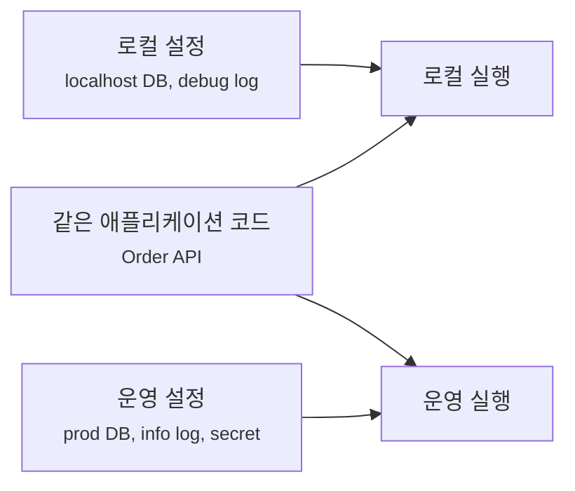
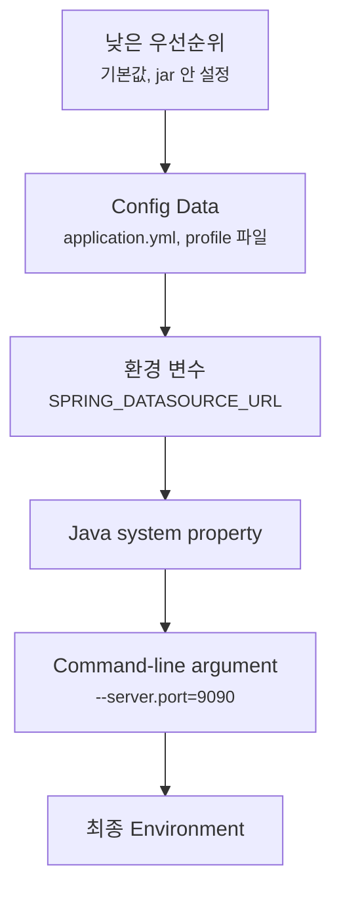
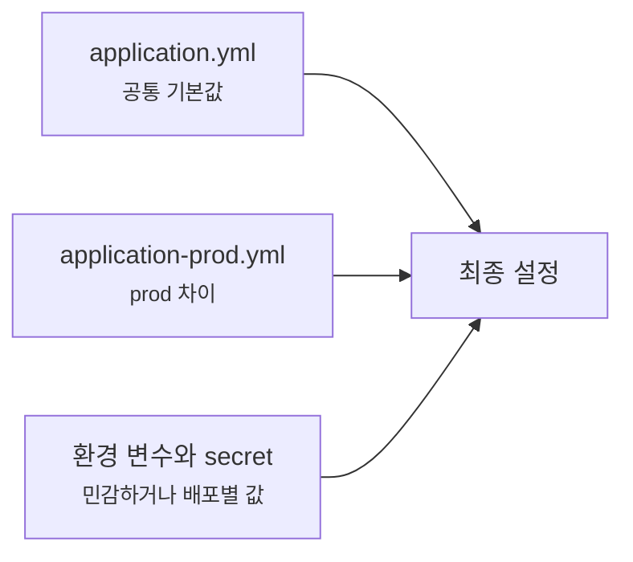
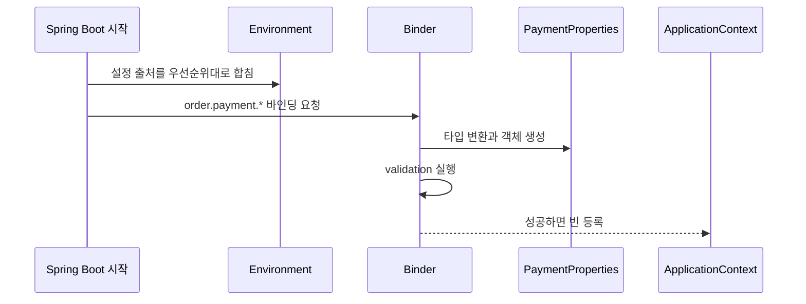
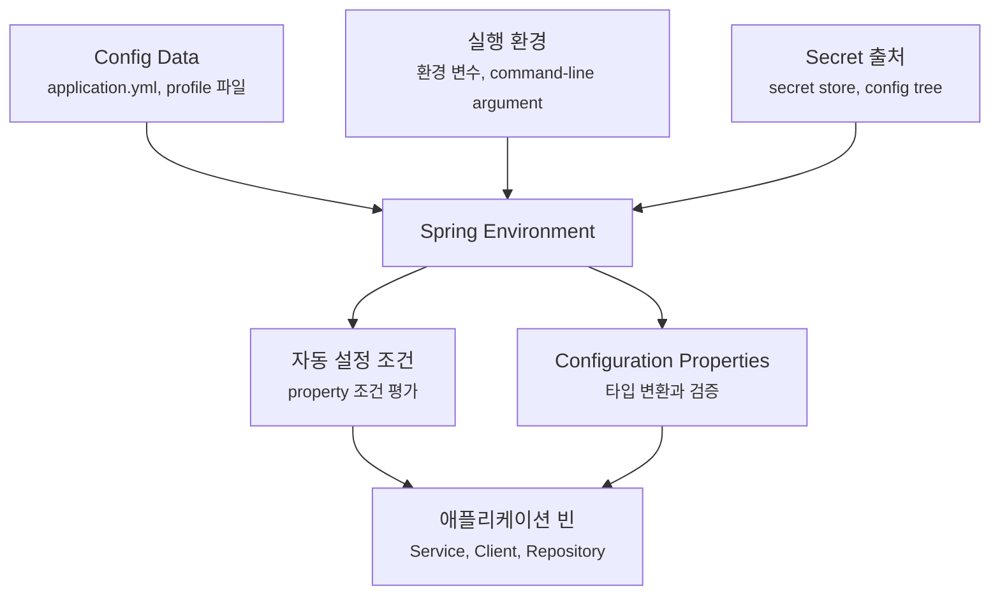

# application.yml과 profile은 설정을 어떻게 바꿔줄까요?

> 로컬에서는 잘 뜨던 앱이 운영 서버에서는 데이터베이스 주소만 바꿨는데 전혀 다른 앱처럼 동작할 때가 있어요.

지난 글에서는 starter와 자동 설정(auto-configuration)을 봤어요. 스타터가 의존성을 클래스패스에 올리고, Spring Boot가 그 상태를 보고 기본 빈(bean)을 조건부로 등록한다는 이야기였죠.

그런데 자동 설정은 혼자서 모든 결정을 끝내지 않아요. 실행할 때 읽은 설정값도 같이 봐요.

```yaml
server:
  port: 8080

spring:
  datasource:
    url: jdbc:postgresql://localhost:5432/order
    username: order
    password: local-password
```

처음에는 `application.yml`이 "설정 파일" 하나처럼 보여요. 하지만 Spring Boot 앱이 커지면 질문이 금방 늘어나요.

> "로컬, 테스트, 운영 설정은 어디서 나눠야 하죠?"  
> "환경 변수와 `application.yml`이 둘 다 있으면 누가 이기나요?"  
> "`SPRING_DATASOURCE_URL`은 어떻게 `spring.datasource.url`이 되나요?"  
> "문자열 설정을 매번 `@Value`로 읽어도 될까요?"  
> "비밀번호를 `application.yml`에 넣어도 되나요?"

오늘은 이 질문을 한 흐름으로 볼게요. **설정은 코드 밖에서 들어오고**, **여러 출처가 우선순위에 따라 합쳐지고**, **profile은 환경별 차이를 고르고**, **Configuration Properties는 흩어진 문자열을 타입 있는 객체로 묶고**, **secret은 소스 코드와 빌드 산출물 밖에 둬야 한다**는 흐름이에요.

!!! note "이 글의 기준"
    이 글은 Spring Boot 4.1.0 공식 문서의 Externalized Configuration, Config Data, Profiles, Type-safe Configuration Properties 설명을 확인해 작성했어요. 설정 파일 이름과 우선순위의 큰 원리는 오래 이어진 개념이지만, exact option이나 새 import 방식은 사용 중인 Spring Boot 버전의 공식 문서를 함께 확인하세요.

---

## 먼저 "설정"은 왜 코드 밖으로 빠질까요?

주문 API가 있다고 해볼게요. 로컬에서는 포트 `8080`으로 뜨고, 로컬 PostgreSQL에 붙으면 충분해요.

```yaml
server:
  port: 8080

spring:
  datasource:
    url: jdbc:postgresql://localhost:5432/order
    username: order
    password: local-password
```

그런데 같은 코드를 운영에 올리면 값이 달라져요.

| 설정 | 로컬 | 운영 |
|---|---|---|
| 서버 포트 | `8080` | 플랫폼이 내려준 포트 |
| 데이터베이스 주소 | 로컬 DB | 운영 DB |
| 로그 레벨 | 자세하게 | 필요한 범위만 |
| 외부 API 주소 | sandbox | production |
| 비밀번호와 토큰 | 개발용 값 | secret 저장소나 환경 변수 |

코드는 같아야 해요. 주문을 생성하고, 결제를 요청하고, 결과를 저장하는 애플리케이션 로직은 환경마다 달라지면 안 되죠.

달라지는 건 실행 환경이에요. 그래서 Spring Boot는 설정을 외부화(externalized configuration)해요. 애플리케이션 코드는 같은 jar로 배포하되, 실행할 때 들어오는 설정값으로 환경 차이를 흡수하는 방식이에요.



이 그림에서 바뀌는 것은 코드가 아니라 설정이에요. Spring Boot 설정을 잘 읽는다는 말은 "어떤 값이 최종적으로 들어왔는지"와 "그 값이 어디서 왔는지"를 추적할 수 있다는 뜻이에요.

---

## `application.yml`은 기본 설정의 출발점이에요

Spring Boot는 기본적으로 `application.properties`, `application.yml`, `application.yaml` 같은 이름의 Config Data를 읽어요.

YAML을 쓰면 계층 구조가 잘 보여서 이런 설정을 많이 보게 돼요.

```yaml
spring:
  application:
    name: order-api
  datasource:
    url: jdbc:postgresql://localhost:5432/order
    username: order
    password: local-password

order:
  payment:
    base-url: http://localhost:9000
    timeout: 3s
```

이 파일은 "기본값"을 담기에 좋아요. 로컬에서 바로 실행해도 되는 값, 모든 환경에 공통인 값, secret이 아닌 값이 들어갈 수 있어요.

하지만 여기서 조심해야 해요. `application.yml`은 보통 Git에 같이 올라가요. 그러면 이 파일에 들어간 값은 팀원, CI, 배포 산출물, 백업, 코드 리뷰 화면에 남을 수 있어요.

그래서 설정값을 두 종류로 나눠서 봐야 해요.

| 값의 성격 | 예시 | 둘 곳 |
|---|---|---|
| 공개돼도 큰 문제가 없는 기본값 | 앱 이름, 기본 timeout, 기능 flag 기본값 | `application.yml` |
| 환경마다 바뀌는 값 | DB 주소, 외부 API 주소, 로그 레벨 | profile 파일, 환경 변수, 배포 플랫폼 설정 |
| 노출되면 안 되는 값 | DB 비밀번호, API token, private key | secret store, 환경 변수, mounted secret, config tree |

처음에는 `application.yml` 하나로 시작해도 괜찮아요. 하지만 비밀번호, 토큰, 운영 DB 주소처럼 민감하거나 환경에 묶인 값은 처음부터 "나중에 옮기자"가 아니라 "여기에는 두지 않는다"로 잡는 편이 안전해요.

!!! warning "secret은 예제처럼 보여도 진짜 값이면 안 돼요"
    블로그나 문서의 `local-password`는 설명용 값이에요. 실제 운영 비밀번호, API key, token을 `application.yml`에 커밋하면 안 돼요. 한 번 Git에 들어간 secret은 파일에서 지워도 기록에 남을 수 있어요.

---

## 여러 설정 출처는 우선순위로 합쳐져요

Spring Boot는 설정을 한 곳에서만 읽지 않아요.

대표적으로 이런 출처가 있어요.

- jar 안에 들어간 `application.yml`
- jar 밖에 둔 `application.yml`
- profile 전용 파일인 `application-prod.yml`
- OS 환경 변수
- Java system property
- command-line argument
- 테스트에서 넣은 property

이 값들은 하나의 Environment로 합쳐져요. 같은 key가 여러 곳에 있으면 우선순위가 높은 쪽 값이 최종값이 돼요.



이 그림은 실무 감각을 잡기 위한 단순화예요. Spring Boot 공식 문서에는 더 많은 출처와 테스트 전용 우선순위가 정리돼 있어요. 지금은 이 정도만 기억해도 많은 문제를 풀 수 있어요.

> `application.yml`에 값이 있어도, 더 높은 우선순위의 환경 변수나 command-line argument가 있으면 최종값은 바뀔 수 있어요.

예를 들어 파일에는 이렇게 되어 있다고 해볼게요.

```yaml
server:
  port: 8080
```

실행할 때 이렇게 넘기면 command-line argument가 더 높은 우선순위로 들어와요.

```bash
java -jar order-api.jar --server.port=9090
```

그러면 실제 서버 포트는 `9090`이에요.

환경 변수도 자주 쓰죠.

```bash
export SPRING_DATASOURCE_URL=jdbc:postgresql://prod-db:5432/order
```

Spring Boot는 relaxed binding을 지원해요. 그래서 환경 변수의 `SPRING_DATASOURCE_URL` 같은 이름을 `spring.datasource.url` 같은 property 이름으로 맞춰 읽을 수 있어요. 운영 플랫폼에서는 이런 방식으로 jar 안의 기본 설정을 건드리지 않고 실행 환경만 바꾸는 일이 많아요.

!!! tip "설정 문제는 '파일에 뭐가 있나'보다 '최종값이 뭐였나'를 봐야 해요"
    `application.yml`만 열어보고 결론 내리면 놓칠 수 있어요. 환경 변수, 실행 인자, profile, 테스트 property가 더 높은 우선순위로 들어왔는지 함께 봐야 해요.

---

## profile은 환경별 차이를 고르는 이름표예요

profile은 "지금 어떤 환경 조각을 켤 것인가"를 고르는 이름표에 가까워요.

가장 흔한 모양은 파일을 나누는 방식이에요.

```text
src/main/resources/
├── application.yml
├── application-local.yml
└── application-prod.yml
```

기본 파일에는 공통값을 둬요.

```yaml
spring:
  application:
    name: order-api

order:
  payment:
    timeout: 3s
```

로컬 파일에는 로컬에서만 필요한 값을 둬요.

```yaml
# application-local.yml
spring:
  datasource:
    url: jdbc:postgresql://localhost:5432/order
    username: order

order:
  payment:
    base-url: http://localhost:9000
```

운영 파일에는 운영에서 달라지는 secret이 아닌 값을 둬요.

```yaml
# application-prod.yml
logging:
  level:
    com.example.order: INFO

order:
  payment:
    base-url: https://payment.example.com
```

그리고 실행할 때 active profile을 정해요.

```bash
java -jar order-api.jar --spring.profiles.active=prod
```

그러면 `application.yml`의 공통값 위에 `application-prod.yml` 값이 얹혀요. 같은 key가 있으면 profile 파일의 값이 이겨요.



이 그림에서 profile은 환경 전체를 복사하는 장치가 아니에요. 공통 설정은 공통 파일에 두고, 달라지는 부분만 profile 쪽에서 덮는 방식이에요.

profile을 너무 많이 만들면 오히려 추적이 어려워져요. `local`, `test`, `prod` 정도의 환경 축은 자연스럽지만, `prod-a`, `prod-b`, `prod-new`, `prod-temp`처럼 늘어나기 시작하면 설정이 코드보다 복잡해질 수 있어요.

!!! note "active profile은 보통 실행 환경에서 정하는 편이 좋아요"
    `spring.profiles.active`를 파일에 넣을 수도 있지만, 운영 배포에서는 환경 변수나 실행 인자로 정하는 편이 더 명확해요. "이 jar는 prod로 실행된다"는 결정은 코드 저장소보다 배포 환경의 책임에 가깝기 때문이에요.

---

## 한 파일 안에서 profile 문서를 나눌 수도 있어요

파일을 여러 개로 나누는 대신, YAML 문서를 `---`로 나누고 특정 profile에서만 켜지게 할 수도 있어요.

```yaml
order:
  payment:
    timeout: 3s

---
spring:
  config:
    activate:
      on-profile: local

order:
  payment:
    base-url: http://localhost:9000

---
spring:
  config:
    activate:
      on-profile: prod

order:
  payment:
    base-url: https://payment.example.com
```

`spring.config.activate.on-profile`은 "이 문서 조각은 어떤 profile일 때 포함할까?"를 말해요.

작은 프로젝트에서는 한 파일 안에서 차이를 보는 게 편할 수 있어요. 하지만 설정이 길어지면 profile별 파일이 더 읽기 쉬울 때가 많아요. 중요한 건 방식 자체가 아니라, 공통값과 환경별 차이를 섞어 읽기 어렵게 만들지 않는 거예요.

---

## `@Value`는 작게 읽을 때 편하지만, 설정 묶음에는 약해요

설정값 하나를 읽을 때는 `@Value`를 볼 수 있어요.

```java
import org.springframework.beans.factory.annotation.Value;
import org.springframework.stereotype.Service;

@Service
class PaymentClient {

    private final String baseUrl;

    PaymentClient(@Value("${order.payment.base-url}") String baseUrl) {
        this.baseUrl = baseUrl;
    }
}
```

이 코드는 간단해요. 하지만 설정이 늘어나면 금방 불편해져요.

```java
PaymentClient(
        @Value("${order.payment.base-url}") String baseUrl,
        @Value("${order.payment.timeout}") Duration timeout,
        @Value("${order.payment.retry.max-attempts}") int maxAttempts,
        @Value("${order.payment.retry.backoff}") Duration backoff) {
    // ...
}
```

이제 `PaymentClient` 생성자는 비즈니스 의존성과 설정 문자열이 섞여요. key를 잘못 적어도 컴파일러가 잡아주지 못하고, 여러 클래스가 같은 설정 key를 반복해서 알게 될 수도 있어요.

이럴 때 Configuration Properties를 쓰면 설정 묶음을 타입 있는 객체로 만들 수 있어요.

---

## Configuration Properties는 설정을 객체로 묶어요

예를 들어 결제 설정을 하나의 record로 묶어볼게요.

```java
package com.example.order.payment;

import java.time.Duration;
import org.springframework.boot.context.properties.ConfigurationProperties;

@ConfigurationProperties("order.payment")
public record PaymentProperties(
        String baseUrl,
        Duration timeout,
        Retry retry
) {

    public record Retry(
            int maxAttempts,
            Duration backoff
    ) {
    }
}
```

설정 파일은 이렇게 둘 수 있어요.

```yaml
order:
  payment:
    base-url: https://payment.example.com
    timeout: 3s
    retry:
      max-attempts: 3
      backoff: 200ms
```

Spring Boot는 `order.payment.base-url`을 `baseUrl`에, `order.payment.retry.max-attempts`를 `retry.maxAttempts`에 묶어줄 수 있어요. 이것도 relaxed binding 덕분에 kebab-case, camelCase, 환경 변수 이름 같은 차이를 유연하게 맞춰요.

다만 `@ConfigurationProperties` 타입은 빈으로 등록되어야 주입받을 수 있어요. 애플리케이션 클래스 근처에서 스캔을 켜는 방식이 흔해요.

```java
package com.example.order;

import org.springframework.boot.SpringApplication;
import org.springframework.boot.autoconfigure.SpringBootApplication;
import org.springframework.boot.context.properties.ConfigurationPropertiesScan;

@ConfigurationPropertiesScan
@SpringBootApplication
public class OrderApplication {

    public static void main(String[] args) {
        SpringApplication.run(OrderApplication.class, args);
    }
}
```

이제 서비스는 설정 key 문자열을 몰라도 돼요.

```java
package com.example.order.payment;

import java.time.Duration;
import org.springframework.stereotype.Service;

@Service
class PaymentClient {

    private final PaymentProperties properties;

    PaymentClient(PaymentProperties properties) {
        this.properties = properties;
    }

    void pay(String orderId, long amount) {
        String url = properties.baseUrl() + "/payments";
        Duration timeout = properties.timeout();
        // HTTP 요청 설정에 url과 timeout 사용
    }
}
```

이렇게 하면 책임이 나뉘어요.

| 코드 | 맡은 책임 |
|---|---|
| `application.yml` | 환경별 값을 제공해요 |
| `PaymentProperties` | 설정 구조와 타입을 표현해요 |
| `PaymentClient` | 설정을 사용해 결제 요청을 보내요 |

처음에는 `@Value`가 더 짧아 보일 수 있어요. 하지만 설정 묶음이 도메인 개념처럼 커지면 Configuration Properties가 읽기와 테스트에 더 유리해져요.

---

## 설정도 시작할 때 검증할 수 있어요

설정값이 틀리면 늦게 터지는 것보다 시작할 때 바로 실패하는 편이 나아요.

예를 들어 결제 API 주소가 비어 있거나 timeout이 음수라면, 첫 결제 요청이 들어온 뒤에 실패하는 것보다 애플리케이션 시작 단계에서 알려주는 게 낫죠.

Configuration Properties에 Jakarta Validation을 붙일 수 있어요.

```java
package com.example.order.payment;

import java.time.Duration;
import jakarta.validation.Valid;
import jakarta.validation.constraints.NotBlank;
import jakarta.validation.constraints.NotNull;
import jakarta.validation.constraints.Positive;
import org.springframework.boot.context.properties.ConfigurationProperties;
import org.springframework.validation.annotation.Validated;

@Validated
@ConfigurationProperties("order.payment")
public record PaymentProperties(
        @NotBlank String baseUrl,
        @NotNull Duration timeout,
        @Valid Retry retry
) {

    public record Retry(
            @Positive int maxAttempts,
            @NotNull Duration backoff
    ) {
    }
}
```

이제 설정이 비어 있거나 형식이 맞지 않으면 ApplicationContext를 만드는 과정에서 실패할 수 있어요. 이 실패는 불편한 게 아니라 좋은 신호예요. 잘못된 설정으로 앱이 떠서 운영 요청을 받는 것보다, 시작할 때 멈추고 원인을 보여주는 편이 안전해요.



이 그림에서 설정은 단순 문자열로 남지 않아요. Spring Boot가 Environment에서 값을 모으고, Binder가 타입 변환과 검증을 거쳐 설정 객체를 만들어요. 그래서 설정을 구조화할수록 "실행 중 어딘가에서 이상하게 실패"하는 일을 줄일 수 있어요.

---

## secret은 profile 파일이 아니라 실행 환경의 책임이에요

운영 설정에서 가장 위험한 값은 secret이에요.

예를 들어 이런 값들이요.

- 데이터베이스 비밀번호
- 외부 결제 API token
- JWT signing key
- OAuth client secret
- cloud access key

이 값들은 `application-prod.yml`에도 그대로 두지 않는 편이 좋아요. `prod`라는 이름이 붙었다고 해서 안전해지는 게 아니에요. 파일이 Git에 올라가거나, 이미지 안에 들어가거나, 로그와 빌드 artifact에 남으면 같은 문제가 생겨요.

대신 설정 파일에는 "어디서 받을지"만 남기는 식으로 둘 수 있어요.

```yaml
spring:
  datasource:
    url: ${DB_URL}
    username: ${DB_USERNAME}
    password: ${DB_PASSWORD}

order:
  payment:
    api-token: ${PAYMENT_API_TOKEN}
```

이 예시는 환경 변수에서 값을 받겠다는 뜻이에요. 실제 secret 값은 배포 플랫폼, CI/CD secret, 컨테이너 secret, Kubernetes Secret, Vault 같은 secret 저장소에 둬요.

Docker secret처럼 파일로 mount되는 값을 읽어야 할 때는 Spring Boot의 config tree import 방식도 선택지가 될 수 있어요.

```yaml
spring:
  config:
    import: "optional:configtree:/run/secrets/"
```

이 방식은 `/run/secrets/` 아래 파일들을 property처럼 읽게 해줘요. 예를 들어 `/run/secrets/db-password` 파일이 있으면 그 값을 설정으로 가져오는 식의 구성이 가능해요. 배포 플랫폼마다 이름과 mount 방식은 다르니, 여기서는 "Spring Boot가 파일로 mount된 secret을 설정 출처로 읽을 수 있다"는 점만 잡으면 충분해요.

!!! warning "환경 변수도 만능 금고는 아니에요"
    환경 변수는 파일 커밋보다 낫지만, 프로세스 목록, 진단 도구, 잘못된 로그 설정에 노출될 수 있어요. 운영에서는 플랫폼이 제공하는 secret 관리 방식과 접근 권한, rotation 정책까지 함께 봐야 해요.

---

## 설정 문제를 만났을 때는 이렇게 좁혀가요

설정 때문에 앱이 이상하게 움직일 때는 코드를 먼저 의심하기보다 최종 설정값의 경로를 따라가는 편이 빨라요.

예를 들어 운영에서 결제 API가 sandbox로 나간다고 해볼게요.

```yaml
order:
  payment:
    base-url: http://localhost:9000
```

이 값이 어디서 살아남았는지 확인해야 해요.

| 질문 | 확인할 곳 |
|---|---|
| active profile이 맞나요? | `spring.profiles.active`, 배포 환경 변수, 실행 인자 |
| profile 파일이 jar 안에 들어갔나요? | 빌드 산출물, resources 경로 |
| 더 높은 우선순위 값이 덮었나요? | 환경 변수, command-line argument |
| property 이름이 맞나요? | `order.payment.base-url`, `ORDER_PAYMENT_BASEURL` 같은 relaxed binding 이름 |
| Configuration Properties가 등록됐나요? | `@ConfigurationPropertiesScan`, `@EnableConfigurationProperties` |
| 검증이 빠졌나요? | `@Validated`, 제약 조건, validation 의존성 |
| secret placeholder가 비어 있나요? | 배포 secret 이름, mount 경로, CI/CD 설정 |

Actuator를 쓰는 프로젝트라면 `/actuator/env` endpoint가 설정 출처와 값을 확인하는 데 도움이 될 수 있어요. 다만 이 endpoint는 민감한 정보와 이어질 수 있으니 운영 노출 범위와 sanitizing 설정을 반드시 조심해야 해요.

!!! warning "운영에서 env endpoint를 가볍게 열면 안 돼요"
    설정 확인은 강력한 디버깅 도구지만, 동시에 secret 노출 사고의 입구가 될 수 있어요. 운영에서는 Actuator endpoint 노출, 인증, 네트워크 접근 범위, 값 마스킹을 함께 점검해야 해요.

---

## 오늘의 흐름을 한 번에 놓아볼게요

Spring Boot 설정은 파일 하나를 읽는 과정이 아니라, 여러 출처를 합쳐 최종 Environment를 만들고, 그 값을 자동 설정과 사용자 코드가 사용하는 흐름이에요.



이 그림에서 `application.yml`은 전체의 일부예요. 실제 실행값은 profile, 환경 변수, secret, command-line argument까지 합쳐진 Environment에서 결정돼요. 자동 설정도 그 값을 보고 켜지거나 꺼지고, 애플리케이션 코드도 설정 객체를 통해 그 값을 사용해요.

---

## 자, 정리해볼까요?

!!! abstract "오늘 우리가 배운 것"
    - Spring Boot 설정은 코드 밖에서 들어와 같은 애플리케이션을 여러 환경에서 다르게 실행하게 해줘요.
    - `application.yml`은 기본값을 담기 좋지만, secret이나 운영에 묶인 민감한 값은 커밋하면 안 돼요.
    - 여러 설정 출처는 우선순위에 따라 합쳐지고, 환경 변수와 command-line argument가 파일 값을 덮을 수 있어요.
    - profile은 공통 설정 위에 환경별 차이를 얹는 이름표예요.
    - `@Value`는 작은 값에는 편하지만, 설정 묶음은 Configuration Properties로 타입 있게 다루는 편이 좋아요.
    - 설정 검증은 앱을 늦게 망가뜨리는 대신 시작 단계에서 잘못된 값을 드러내게 해줘요.
    - secret은 profile 파일이 아니라 배포 환경, secret store, mounted secret 같은 실행 환경의 책임으로 다루는 편이 안전해요.

다음 글에서는 Spring Boot 4.x를 기준으로, 기존 3.x 프로젝트에서 실제로 마주칠 차이를 정리해볼 거예요. 개념보다 "지금 내 프로젝트에서 무엇을 확인해야 하는지"에 초점을 맞춰볼게요.

---

## 참고한 링크

- [Spring Boot Reference: Externalized Configuration](https://docs.spring.io/spring-boot/reference/features/external-config.html)
- [Spring Boot Reference: Profiles](https://docs.spring.io/spring-boot/reference/features/profiles.html)
- [Spring Boot Reference: Type-safe Configuration Properties](https://docs.spring.io/spring-boot/reference/features/external-config.html#features.external-config.typesafe-configuration-properties)
- [Spring Boot How-to: Properties and Configuration](https://docs.spring.io/spring-boot/how-to/properties-and-configuration.html)
- [Spring Boot Actuator API: Environment](https://docs.spring.io/spring-boot/api/rest/actuator/env.html)
