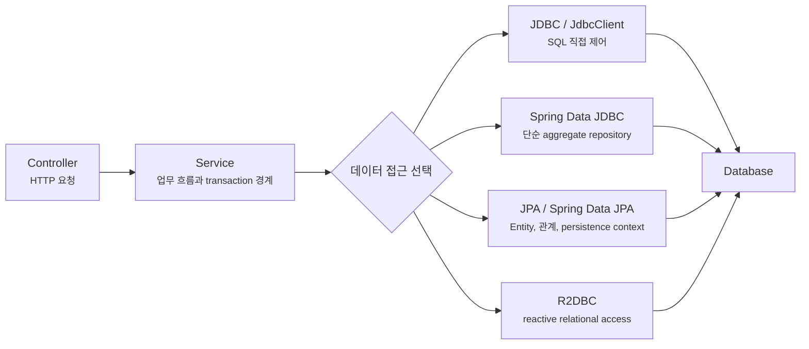
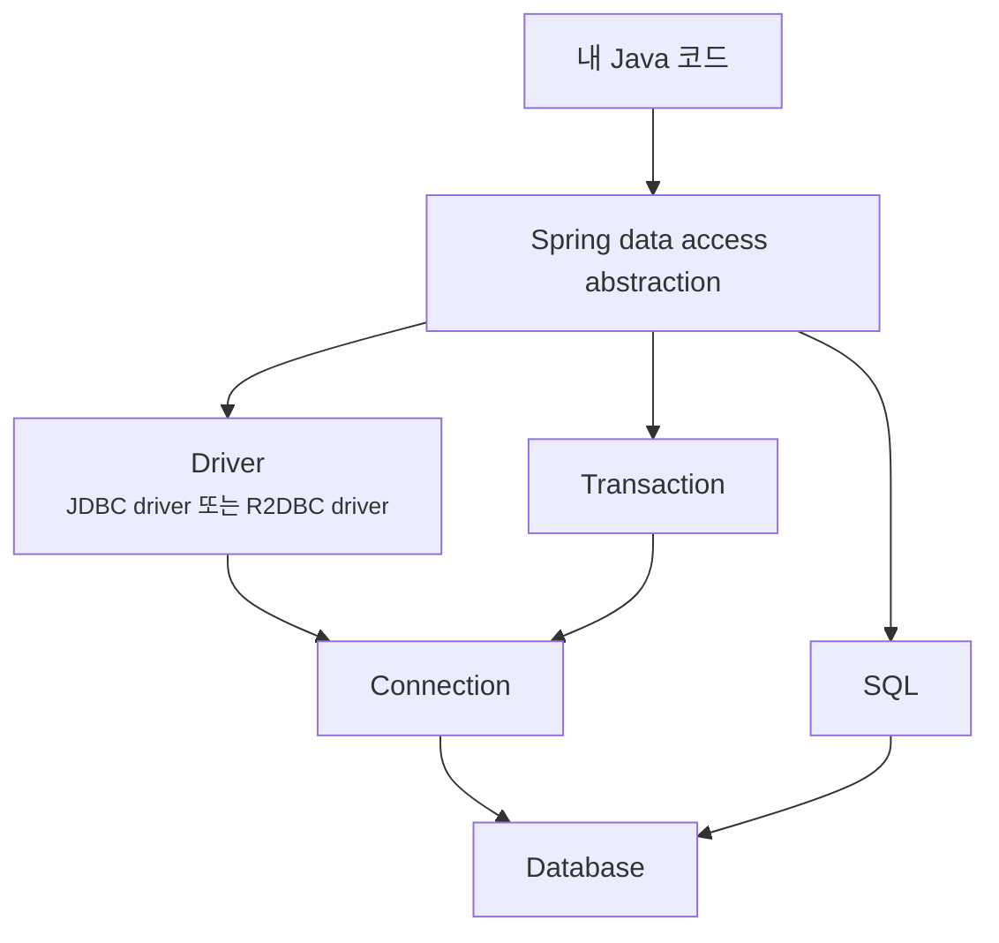
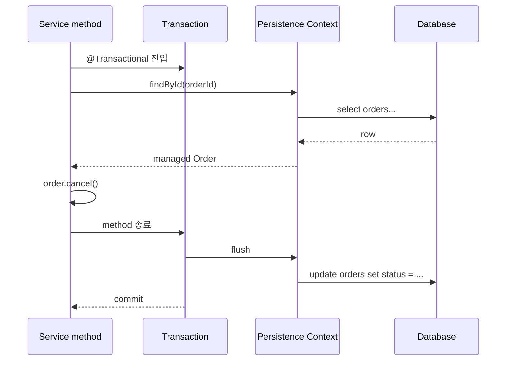
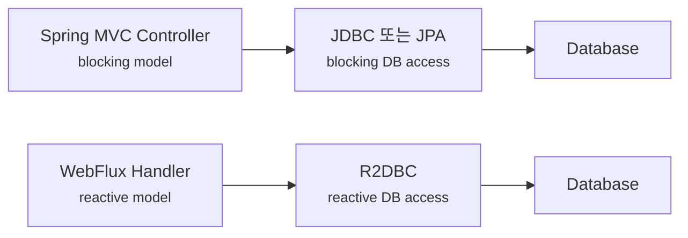

# 데이터 접근은 JDBC, JPA, R2DBC 중 무엇을 골라야 할까요?

> 테이블 하나만 읽고 싶었는데, 갑자기 JDBC, JPA, Repository, R2DBC가 한꺼번에 튀어나와요.

지난 글에서는 우리 Spring Boot 앱이 다른 서버를 호출할 때 `RestClient`, `WebClient`, HTTP Interface를 어떻게 고를지 봤어요. 오늘은 방향을 다시 안쪽으로 돌려볼게요. 이번에는 우리 앱이 **데이터베이스를 어떻게 읽고 쓸지**예요.

처음 데이터베이스를 붙이려고 하면 이런 질문을 자주 만나죠.

> "JPA가 제일 많이 쓰이니까 그냥 JPA로 가면 되나요?"  
> "JDBC는 옛날 방식 아닌가요?"  
> "Spring Data JDBC랑 JPA는 이름이 비슷한데 뭐가 달라요?"  
> "Repository interface를 만들면 SQL을 몰라도 되나요?"  
> "WebFlux를 쓰면 R2DBC도 같이 써야 하나요?"  
> "성능이 중요하면 JPA를 피해야 하나요?"

오늘은 기능 목록을 외우기보다 지도를 만들 거예요. **데이터 접근 기술은 최신순으로 고르는 게 아니라, 내가 다루는 데이터의 모양, SQL을 통제해야 하는 정도, transaction 경계, 애플리케이션의 실행 모델로 고르는 도구예요.**

!!! note "이 글의 기준"
    이 글은 Spring Boot 4.1.0 공식 문서의 SQL databases, Spring Framework 7.0.x의 JDBC/JdbcClient 문서, Spring Data JDBC/R2DBC와 Spring Data JPA 문서를 기준으로 작성했어요. 개념 선택 기준은 Spring Boot 3.x 프로젝트에서도 비슷하지만, starter 이름, Hibernate 버전, R2DBC driver 지원, 설정 속성은 사용 중인 버전 문서를 함께 확인하세요.

---

## 데이터 접근은 "DB 연결" 하나로 끝나지 않아요

Todo API에 데이터베이스를 붙인다고 해볼게요. 처음에는 이렇게 생각하기 쉬워요.

> "`todos` 테이블 만들고, 저장하고, 조회하면 끝 아닌가요?"

하지만 실제 코드에서는 바로 선택지가 갈라져요.

| 질문 | 선택을 바꾸는 이유 |
|---|---|
| SQL을 직접 쓰고 싶은가요? | 복잡한 join, 집계, 성능 튜닝은 SQL 모양을 직접 보는 편이 좋아요 |
| 객체 관계를 길게 따라가야 하나요? | 주문, 주문 항목, 회원, 배송지처럼 관계가 많은 모델은 JPA가 편할 수 있어요 |
| aggregate 단위로 단순하게 저장하면 되나요? | Spring Data JDBC는 persistence context 없이 repository 모델을 단순하게 유지해요 |
| 앱 전체가 reactive 흐름인가요? | WebFlux와 reactive driver까지 이어질 때 R2DBC가 의미 있어요 |
| transaction은 어디서 시작하고 끝나나요? | 데이터 접근 도구보다 service 경계가 먼저 중요해요 |
| 운영 중 쿼리를 추적해야 하나요? | 어떤 도구를 쓰든 SQL, connection, transaction, lock을 볼 수 있어야 해요 |

즉 데이터 접근 선택은 "어떤 라이브러리가 좋아요?"가 아니라 "우리 앱이 DB와 어떤 관계를 맺나요?"에 가까워요.



이 그림에서 중요한 건 service가 먼저 나온다는 점이에요. Controller가 바로 DB 도구를 잡는 게 아니라, 업무 흐름과 transaction 경계를 잡은 뒤 그 안에서 어떤 데이터 접근 방식을 쓸지 결정해요.

---

## 가장 낮은 공통분모는 SQL과 connection이에요

어떤 도구를 쓰든 결국 관계형 데이터베이스 앞에서는 SQL이 실행돼요. JPA를 쓰든, Spring Data repository를 쓰든, R2DBC를 쓰든 데이터베이스는 Java 객체가 아니라 SQL과 transaction, connection, lock으로 움직여요.

그래서 먼저 이 층을 잡아야 해요.



이 그림은 "JPA를 쓰면 SQL을 몰라도 된다"는 오해를 깨는 데 중요해요. 위쪽 abstraction은 코드를 편하게 만들 수 있지만, 아래쪽의 SQL, connection, transaction이 사라지지는 않아요.

실무에서 데이터 문제가 생기면 보통 아래 질문으로 내려가야 해요.

- 실제로 어떤 SQL이 나갔나요?
- 한 요청에서 쿼리가 몇 번 실행됐나요?
- transaction은 어디서 열리고 어디서 끝났나요?
- connection pool이 고갈되지는 않았나요?
- 느린 쿼리는 index 문제인가요, N+1 문제인가요, lock 대기인가요?

도구를 고를 때도 이 질문을 피하면 안 돼요. "코드가 짧아진다"와 "운영에서 원인을 찾기 쉽다"는 다른 기준이거든요.

---

## JDBC와 `JdbcClient`는 SQL을 코드의 중심에 둬요

JDBC는 Java가 관계형 데이터베이스와 이야기하는 가장 기본적인 API예요. 다만 순수 JDBC만 직접 쓰면 connection 열기, statement 만들기, result set 반복, 예외 처리, 자원 닫기 같은 반복 코드가 많아져요.

Spring Framework는 오래전부터 `JdbcTemplate`으로 그 반복을 줄여줬고, 최근 Spring Framework에서는 `JdbcClient`로 더 읽기 쉬운 fluent API를 제공해요.

```java
package com.example.todo;

import java.time.Instant;
import java.util.List;
import org.springframework.jdbc.core.simple.JdbcClient;
import org.springframework.stereotype.Repository;

@Repository
public class TodoJdbcRepository {

    private final JdbcClient jdbcClient;

    public TodoJdbcRepository(JdbcClient jdbcClient) {
        this.jdbcClient = jdbcClient;
    }

    public List<TodoRow> findAll() {
        return jdbcClient.sql("""
                select id, title, done, created_at
                from todos
                order by id desc
                """)
                .query((rs, rowNum) -> new TodoRow(
                        rs.getLong("id"),
                        rs.getString("title"),
                        rs.getBoolean("done"),
                        rs.getObject("created_at", Instant.class)
                ))
                .list();
    }
}
```

```java
package com.example.todo;

import java.time.Instant;

public record TodoRow(
        long id,
        String title,
        boolean done,
        Instant createdAt
) {
}
```

이 코드의 장점은 분명해요. SQL이 그대로 보여요. 어떤 table을 읽는지, 어떤 column을 가져오는지, 정렬이 무엇인지 코드에서 바로 보이죠.

JDBC와 `JdbcClient`는 이런 경우에 잘 맞아요.

| 상황 | 왜 잘 맞을까요? |
|---|---|
| SQL을 직접 통제해야 함 | join, 집계, window function, vendor-specific SQL을 숨기지 않아요 |
| 응답 전용 조회가 많음 | 화면이나 API response에 맞춘 query를 명확히 쓸 수 있어요 |
| 도메인 객체보다 row shape가 중요함 | Entity lifecycle보다 결과 row mapping이 핵심일 때 단순해요 |
| 성능 문제를 SQL부터 보고 싶음 | 실행 SQL을 코드와 맞춰 추적하기 쉬워요 |

반대로 모든 CRUD를 전부 손으로 쓰면 반복이 많아질 수 있어요. 단순 저장과 조회가 대부분인데 매번 `insert`, `update`, `select`를 직접 쓰면 repository 코드가 빠르게 길어져요.

!!! tip "JDBC는 낡아서 쓰는 게 아니에요"
    JDBC 계열은 SQL을 명시적으로 통제하고 싶을 때 여전히 강한 선택지예요. "새 프로젝트는 무조건 JPA"가 아니라, 쿼리 중심 문제인지 객체 관계 중심 문제인지 먼저 봐야 해요.

---

## Spring Data JDBC는 repository를 주지만 JPA처럼 행동하지 않아요

Spring Data JDBC는 이름 때문에 "JPA의 가벼운 버전"처럼 보일 수 있어요. 하지만 그렇게 보면 오해가 생겨요.

Spring Data JDBC는 Spring Data repository 모델을 JDBC 위에 올려줘요. interface를 만들면 기본적인 CRUD 구현을 Spring이 만들어줄 수 있어요.

```java
package com.example.todo;

import java.time.Instant;
import org.springframework.data.annotation.Id;
import org.springframework.data.relational.core.mapping.Table;

@Table("todos")
public class Todo {

    @Id
    private Long id;
    private String title;
    private boolean done;
    private Instant createdAt;

    // constructor, getters
}
```

```java
package com.example.todo;

import org.springframework.data.repository.ListCrudRepository;

public interface TodoRepository extends ListCrudRepository<Todo, Long> {
}
```

이제 `save`, `findById`, `findAll`, `deleteById` 같은 기본 동작을 직접 구현하지 않아도 돼요.

하지만 중요한 차이가 있어요. Spring Data JDBC는 JPA의 persistence context, lazy loading, dirty checking을 제공하려고 만든 도구가 아니에요. Entity 객체를 오래 붙잡고 변경 감지를 기대하는 모델이 아니라, aggregate를 명시적으로 저장하고 다시 읽는 단순한 모델에 가까워요.

| 기대 | Spring Data JDBC에서 다시 봐야 할 점 |
|---|---|
| 객체를 바꾸면 자동으로 update되겠지 | 변경 감지에 기대지 말고 저장 동작을 명시적으로 봐야 해요 |
| 관계는 필요할 때 lazy loading되겠지 | JPA식 lazy loading 모델이 아니에요 |
| 복잡한 객체 그래프를 자연스럽게 탐색하겠지 | aggregate 경계를 작게 잡는 편이 맞아요 |
| repository method 이름으로 모든 query를 해결하겠지 | 복잡한 query는 `@Query`나 별도 query 전략을 검토해야 해요 |

그래서 Spring Data JDBC는 이런 문제에 잘 맞아요.

- aggregate가 단순해요.
- SQL 데이터베이스를 쓰지만 JPA의 객체 그래프 모델은 부담스러워요.
- 기본 CRUD repository는 필요해요.
- DB 구조와 객체 구조를 너무 멀리 떨어뜨리고 싶지 않아요.

!!! warning "Spring Data JDBC를 JPA처럼 쓰려고 하면 어색해져요"
    둘 다 repository interface를 만들 수 있어서 비슷해 보이지만, runtime model이 달라요. lazy loading, persistence context, dirty checking을 기대한다면 JPA를 봐야 하고, 그런 기능이 오히려 부담이라면 Spring Data JDBC가 더 단순할 수 있어요.

---

## JPA는 객체 관계와 persistence context를 중심에 둬요

JPA(Java Persistence API)는 관계형 데이터베이스를 객체 모델로 다루기 위한 표준이에요. Spring Boot 프로젝트에서는 보통 Hibernate가 JPA provider로 함께 쓰이고, Spring Data JPA가 repository 구현을 줄여줘요.

가장 익숙한 코드는 이런 모양일 거예요.

```java
package com.example.order;

import jakarta.persistence.Entity;
import jakarta.persistence.GeneratedValue;
import jakarta.persistence.Id;
import jakarta.persistence.Table;

@Entity
@Table(name = "orders")
public class Order {

    @Id
    @GeneratedValue
    private Long id;

    private String status;

    protected Order() {
    }

    public Order(String status) {
        this.status = status;
    }

    public void cancel() {
        this.status = "CANCELED";
    }
}
```

```java
package com.example.order;

import org.springframework.data.jpa.repository.JpaRepository;

public interface OrderRepository extends JpaRepository<Order, Long> {
}
```

이제 service에서는 객체를 조회하고, 객체의 method를 호출하고, transaction이 끝날 때 변경이 DB에 반영되는 모델을 쓸 수 있어요.

```java
package com.example.order;

import org.springframework.stereotype.Service;
import org.springframework.transaction.annotation.Transactional;

@Service
public class OrderService {

    private final OrderRepository orderRepository;

    public OrderService(OrderRepository orderRepository) {
        this.orderRepository = orderRepository;
    }

    @Transactional
    public void cancel(long orderId) {
        Order order = orderRepository.findById(orderId)
                .orElseThrow(OrderNotFoundException::new);

        order.cancel();
    }
}
```

여기서 `orderRepository.save(order)`가 없는데도 변경이 반영될 수 있어요. 이게 JPA를 처음 만날 때 신기한 지점이에요. transaction 안에서 JPA가 관리하는 entity가 바뀌면, persistence context가 변경을 추적하고 flush 시점에 SQL을 만들 수 있어요.



이 그림의 핵심은 JPA가 단순히 repository method를 만들어주는 도구가 아니라는 점이에요. transaction 안에서 entity 상태를 관리하고, 변경을 SQL로 바꾸는 runtime model이 있어요.

JPA는 이런 문제에 잘 맞아요.

| 상황 | JPA가 주는 장점 |
|---|---|
| 도메인 객체가 행동을 가짐 | `order.cancel()`처럼 객체 method로 상태 변경을 표현하기 좋아요 |
| 관계가 있는 aggregate를 다룸 | 연관관계, cascade, fetch 전략을 설계할 수 있어요 |
| CRUD와 조건 조회가 많음 | Spring Data JPA repository가 반복 구현을 줄여줘요 |
| transaction 안에서 변경을 모아 반영함 | dirty checking과 flush가 코드 양을 줄여줄 수 있어요 |

하지만 JPA는 공짜가 아니에요. 추상화가 강한 만큼 경계도 알아야 해요.

| 흔한 함정 | 왜 생길까요? |
|---|---|
| N+1 query | 객체 관계를 따라가다 예상보다 많은 select가 나가요 |
| lazy loading 예외 | transaction 밖에서 지연 로딩이 필요한 관계를 열려고 해요 |
| save를 호출했는데 SQL이 바로 안 보임 | flush와 commit 시점을 이해해야 해요 |
| Entity를 API response로 바로 노출 | 내부 persistence model이 외부 API 계약이 돼요 |
| 복잡한 통계 query가 어색함 | 객체 그래프보다 SQL 결과 shape가 더 중요한 문제예요 |

!!! tip "JPA를 고른다는 건 SQL을 잊겠다는 뜻이 아니에요"
    JPA는 객체 모델을 중심으로 코드를 쓰게 해주지만, 운영에서 성능과 장애를 판단할 때는 결국 생성된 SQL을 봐야 해요. JPA를 잘 쓰는 사람은 Entity와 SQL을 둘 다 읽어요.

---

## Spring Data repository는 기술 이름이 아니라 공통 패턴이에요

여기서 헷갈리는 말이 하나 있어요. "Spring Data repository"예요.

처음에는 이렇게 생각하기 쉬워요.

> "Repository interface를 만들면 그게 JPA 아닌가요?"

아니에요. Spring Data는 여러 저장소 기술 위에 비슷한 repository 프로그래밍 모델을 제공하는 큰 프로젝트예요. JPA에도 repository가 있고, JDBC에도 repository가 있고, R2DBC에도 repository가 있어요.

| repository 종류 | 밑에서 움직이는 기술 |
|---|---|
| Spring Data JPA repository | JPA provider, 보통 Hibernate |
| Spring Data JDBC repository | JDBC와 Spring Data relational mapping |
| Spring Data R2DBC repository | R2DBC driver와 reactive relational mapping |
| Spring Data Redis repository | Redis |
| Spring Data MongoDB repository | MongoDB |

그래서 repository interface 모양만 보고 runtime behavior를 판단하면 위험해요.

```java
interface UserRepository extends Repository<User, Long> {
    User findByEmail(String email);
}
```

이 모양은 비슷해도, 뒤에서 JPA가 움직이는지, JDBC가 움직이는지, R2DBC가 움직이는지에 따라 transaction, loading, query execution, return type이 달라져요.

Spring Data repository의 장점은 반복 query 구현을 줄이고, method 이름이나 `@Query`로 의도를 모을 수 있다는 점이에요. 하지만 method 이름이 너무 길어지면 오히려 읽기 어려워져요.

```java
List<Order> findByStatusAndCreatedAtBetweenAndCustomerIdOrderByCreatedAtDesc(
        String status,
        Instant start,
        Instant end,
        Long customerId
);
```

이 정도가 되면 "repository가 편하다"보다 "query 의도를 다른 방식으로 드러내야 한다"는 신호일 수 있어요. JPA라면 `@Query`, Querydsl, Specification을 볼 수 있고, SQL 중심 조회라면 `JdbcClient`나 별도 query adapter가 더 읽기 쉬울 수도 있어요.

!!! warning "Repository가 SQL 이해를 면제해주지는 않아요"
    Spring Data가 query 구현을 만들어줄 수는 있지만, 어떤 SQL이 나가는지와 어떤 index가 필요한지는 여전히 개발자가 확인해야 해요.

---

## R2DBC는 "JPA의 reactive 버전"이 아니에요

R2DBC(Reactive Relational Database Connectivity)는 관계형 데이터베이스에 reactive 방식으로 접근하기 위한 API예요. JDBC가 blocking API라면, R2DBC는 reactive stream 흐름으로 결과를 다뤄요.

코드는 이런 느낌이에요.

```java
package com.example.todo;

import org.springframework.data.repository.reactive.ReactiveCrudRepository;
import reactor.core.publisher.Flux;
import reactor.core.publisher.Mono;

public interface ReactiveTodoRepository extends ReactiveCrudRepository<Todo, Long> {

    Flux<Todo> findByDone(boolean done);

    Mono<Todo> findByTitle(String title);
}
```

반환값이 `List<Todo>`나 `Optional<Todo>`가 아니라 `Flux<Todo>`, `Mono<Todo>`죠. 지난 글에서 `WebClient`를 볼 때와 같은 실행 모델이에요. "지금 값이 있다"가 아니라 "나중에 값이 흐를 수 있다"는 표현이에요.

R2DBC는 이런 경우에 검토할 수 있어요.

| 상황 | R2DBC를 검토할 이유 |
|---|---|
| WebFlux 앱으로 끝까지 reactive 흐름을 유지함 | HTTP부터 DB까지 blocking 없이 이어질 수 있어요 |
| 사용하는 DB와 driver가 R2DBC를 안정적으로 지원함 | driver 지원이 선택을 제한할 수 있어요 |
| 높은 동시성에서 thread를 붙잡지 않는 모델이 중요함 | waiting 시간이 많은 workload에서 장점이 생길 수 있어요 |
| 팀이 reactive 흐름을 운영할 준비가 있음 | debugging, transaction, backpressure 이해가 필요해요 |

반대로 Spring MVC 앱에서 단순히 "성능이 좋아 보인다"는 이유로 R2DBC를 넣으면 복잡도만 늘 수 있어요.



이 그림의 핵심은 R2DBC도 `WebClient`처럼 앱 전체의 실행 모델과 같이 봐야 한다는 점이에요. R2DBC 하나만 넣는다고 애플리케이션 전체가 reactive 장점을 얻지는 않아요.

!!! warning "R2DBC를 JPA처럼 기대하면 안 돼요"
    R2DBC는 reactive relational access이고, JPA의 persistence context나 lazy loading 모델을 그대로 reactive로 옮긴 도구가 아니에요. JPA가 필요한 문제와 R2DBC가 필요한 문제는 겹칠 수 있지만 같은 해법은 아니에요.

---

## 선택표로 보면 이렇게 정리할 수 있어요

처음 고를 때는 아래 표 정도로 시작하면 좋아요.

| 문제 모양 | 먼저 볼 선택지 | 이유 |
|---|---|---|
| 간단한 CRUD와 객체 중심 업무 규칙 | Spring Data JPA | repository, entity, transaction, dirty checking이 잘 맞을 수 있어요 |
| SQL shape를 직접 통제해야 하는 조회 | `JdbcClient` | SQL이 코드에 드러나고 결과 mapping을 명시할 수 있어요 |
| 단순 aggregate 저장, JPA lifecycle은 부담 | Spring Data JDBC | repository는 쓰되 persistence context 복잡도는 줄일 수 있어요 |
| WebFlux와 reactive DB driver까지 이어지는 앱 | Spring Data R2DBC | blocking DB access 없이 reactive pipeline을 유지할 수 있어요 |
| 복잡한 검색, 통계, 리포트 | `JdbcClient`, Querydsl, 전용 query layer | method name query만으로는 의도를 표현하기 어렵기 쉬워요 |
| 운영 중 SQL 튜닝이 핵심 | SQL이 잘 보이는 구조 | JPA를 써도 SQL 로그와 실행 계획을 같이 봐야 해요 |

하지만 실제 프로젝트는 한 가지 도구만 쓰지 않을 수도 있어요.

예를 들어 주문 서비스는 이렇게 나눌 수 있어요.

- 주문 생성과 상태 변경은 JPA entity로 다뤄요.
- 관리자 통계 화면은 `JdbcClient`로 SQL 조회를 명시해요.
- 외부 검색 시스템은 Elasticsearch를 따로 붙여요.
- 이벤트 처리나 cache는 Redis, Kafka 같은 다른 저장소와 메시징을 써요.

이 조합 자체는 이상하지 않아요. 다만 경계가 분명해야 해요. 한 service method 안에서 JPA entity 상태 변경과 raw SQL update가 섞이면 persistence context가 알고 있는 상태와 DB 실제 상태가 어긋날 수 있어요. 도구를 섞을수록 transaction, flush, cache, 조회 모델 경계를 더 분명히 해야 해요.

!!! tip "한 프로젝트에 하나만 써야 하는 건 아니에요"
    다만 첫 선택은 단순해야 해요. 핵심 쓰기 모델은 하나로 잡고, 특별히 SQL이 필요한 조회나 배치성 작업에 다른 도구를 붙이는 식이 유지보수하기 쉬워요.

---

## starter를 넣으면 무엇이 준비될까요?

Spring Boot에서는 보통 starter로 데이터 접근 도구를 시작해요.

```gradle
dependencies {
    implementation "org.springframework.boot:spring-boot-starter-data-jpa"
    runtimeOnly "org.postgresql:postgresql"
}
```

JPA를 쓰면 이런 조합을 자주 보게 돼요.

| 의존성 | 역할 |
|---|---|
| `spring-boot-starter-data-jpa` | Spring Data JPA, JPA 설정, Hibernate 통합을 준비해요 |
| DB driver | PostgreSQL, MySQL 같은 실제 DB와 연결해요 |
| `spring.datasource.*` 설정 | JDBC URL, username, password 같은 connection 정보를 줘요 |
| migration tool | Flyway나 Liquibase로 schema 변경을 관리할 수 있어요 |

JDBC 중심이라면 이런 쪽이죠.

```gradle
dependencies {
    implementation "org.springframework.boot:spring-boot-starter-jdbc"
    runtimeOnly "org.postgresql:postgresql"
}
```

Spring Data JDBC는 repository abstraction이 필요할 때 선택해요.

```gradle
dependencies {
    implementation "org.springframework.boot:spring-boot-starter-data-jdbc"
    runtimeOnly "org.postgresql:postgresql"
}
```

R2DBC는 JDBC driver가 아니라 R2DBC driver와 `spring.r2dbc.*` 설정이 필요해요.

```gradle
dependencies {
    implementation "org.springframework.boot:spring-boot-starter-data-r2dbc"
    runtimeOnly "org.postgresql:r2dbc-postgresql"
}
```

```yaml
spring:
  r2dbc:
    url: "r2dbc:postgresql://localhost/todo"
    username: "todo"
    password: "secret"
```

이 예시에서 중요한 건 starter 이름을 외우는 게 아니에요. **JDBC 계열은 `DataSource`와 JDBC driver, R2DBC 계열은 reactive connection factory와 R2DBC driver라는 실행 기반이 다르다**는 점이에요.

!!! warning "driver 의존성을 빠뜨리면 앱이 떠도 DB에 못 붙어요"
    starter는 Spring 쪽 자동 설정을 준비하지만, 실제 데이터베이스와 통신하는 driver는 별도로 필요할 수 있어요. PostgreSQL, MySQL, MariaDB, H2처럼 어떤 DB를 쓸지에 따라 runtime 의존성과 URL 모양을 같이 확인해야 해요.

---

## transaction 경계는 도구보다 먼저 설계해야 해요

데이터 접근을 고를 때 가장 자주 뒤늦게 만나는 문제가 transaction이에요.

주문 생성 흐름을 생각해볼게요.

1. 주문 row를 만들어요.
2. 주문 항목 row를 만들어요.
3. 재고를 줄여요.
4. 결제 요청을 보낼 준비 상태로 바꿔요.

이 중 2번에서 실패했다면 1번도 같이 되돌아가야 할 수 있어요. 이걸 "어느 repository를 쓰나요?"보다 먼저 정해야 해요.

```java
package com.example.order;

import org.springframework.stereotype.Service;
import org.springframework.transaction.annotation.Transactional;

@Service
public class OrderCommandService {

    private final OrderRepository orderRepository;
    private final StockRepository stockRepository;

    public OrderCommandService(OrderRepository orderRepository, StockRepository stockRepository) {
        this.orderRepository = orderRepository;
        this.stockRepository = stockRepository;
    }

    @Transactional
    public long placeOrder(PlaceOrderCommand command) {
        Order order = orderRepository.save(Order.create(command));
        stockRepository.decrease(command.productId(), command.quantity());
        return order.id();
    }
}
```

여기서 `@Transactional`은 "DB 작업을 묶어줘요"라고만 기억하면 반쪽이에요. 더 정확히는 service method 진입과 종료 사이에 transaction boundary를 만들고, 그 안에서 repository 호출들이 같은 작업 단위로 묶이게 하는 runtime 경계예요.

다음 편에서 transaction을 더 깊게 볼 예정이지만, 지금은 이것만 잡아도 좋아요.

| 질문 | 왜 먼저 정해야 할까요? |
|---|---|
| 한 요청에서 무엇이 같이 성공해야 하나요? | transaction 범위를 정해요 |
| 외부 API 호출을 transaction 안에서 할 건가요? | DB lock과 외부 지연이 엮일 수 있어요 |
| 읽기 전용 조회인가요? | read-only transaction, SQL 최적화, CQRS 분리를 검토할 수 있어요 |
| 실패하면 어떤 예외에서 rollback하나요? | checked exception, runtime exception, rollback rule을 이해해야 해요 |

!!! warning "외부 API 호출을 DB transaction 안에 오래 넣지 마세요"
    결제 API가 느려지는 동안 DB transaction과 lock이 오래 유지될 수 있어요. DB 변경과 외부 호출이 같이 필요한 흐름은 상태 machine, outbox, 보상 처리 같은 설계를 나중에 검토해야 해요.

---

## API DTO와 Entity는 같은 객체가 아니에요

REST API 글에서 DTO를 봤죠. 데이터베이스를 붙이면 이 경계가 더 중요해져요.

처음에는 이렇게 하고 싶어져요.

```java
@GetMapping("/orders/{id}")
public Order findOrder(@PathVariable long id) {
    return orderRepository.findById(id)
            .orElseThrow(OrderNotFoundException::new);
}
```

동작은 할 수 있어요. 하지만 API response가 JPA entity와 묶여버려요.

| Entity를 바로 응답으로 내보내면 | 생길 수 있는 문제 |
|---|---|
| 내부 field가 외부에 노출됨 | 감사 정보, 내부 상태, 관계 객체가 새어 나갈 수 있어요 |
| lazy loading이 JSON 직렬화 중 발생 | 예상치 못한 query나 예외가 생길 수 있어요 |
| DB 구조 변경이 API 변경이 됨 | 내부 리팩터링이 외부 breaking change가 돼요 |
| 순환 참조가 생길 수 있음 | 양방향 관계를 JSON으로 바꾸다 실패할 수 있어요 |

그래서 API 경계에서는 DTO를 따로 두는 편이 안전해요.

```java
package com.example.order.api;

public record OrderResponse(
        long id,
        String status,
        int totalPrice
) {
    public static OrderResponse from(Order order) {
        return new OrderResponse(
                order.id(),
                order.status(),
                order.totalPrice()
        );
    }
}
```

이건 "파일을 많이 만들자"는 규칙이 아니에요. API 계약과 persistence model이 다른 속도로 변한다는 사실을 코드에 반영하는 거예요.

---

## 실무에서는 이 냄새를 먼저 확인해요

데이터 접근 코드를 리뷰하거나 장애를 볼 때는 도구 이름보다 냄새가 먼저 보여요.

| 냄새 | 의심할 지점 |
|---|---|
| controller가 repository를 직접 호출함 | 업무 transaction 경계가 controller에 흩어질 수 있어요 |
| service method 하나가 너무 많은 repository를 만짐 | aggregate 경계나 use case 분리가 흐려졌을 수 있어요 |
| JPA entity를 JSON으로 바로 반환함 | API 계약과 persistence model이 섞였어요 |
| repository method 이름이 문장처럼 길어짐 | query 의도를 다른 방식으로 표현해야 할 수 있어요 |
| WebFlux 앱에서 JDBC/JPA blocking 호출을 그대로 사용함 | event loop blocking과 thread model 문제가 생길 수 있어요 |
| SQL 로그를 아무도 보지 않음 | 성능 문제를 추상화 위에서만 추측하게 돼요 |
| 테스트가 H2에서만 통과함 | 실제 DB dialect, constraint, transaction behavior가 다를 수 있어요 |

특히 "테스트는 되는데 운영 DB에서 실패해요"는 데이터 접근에서 흔해요. H2 같은 embedded DB는 빠르고 편하지만, PostgreSQL이나 MySQL의 실제 타입, index, constraint, lock, SQL 문법과 다를 수 있어요. 그래서 중요한 repository나 query는 실제 DB에 가까운 환경에서 검증해야 해요. 나중에 Testcontainers와 database migration 글에서 이 부분을 다시 볼 거예요.

---

## 그럼 Todo API 다음 단계는 무엇이 자연스러울까요?

앞에서 만든 Todo API는 아직 인메모리 저장소를 썼어요. 재시작하면 데이터가 사라지는 구조였죠.

다음에 DB를 붙인다면 선택은 이렇게 나눠볼 수 있어요.

| 목표 | 자연스러운 선택 |
|---|---|
| 처음 DB 연결과 CRUD를 가장 흔한 방식으로 익히기 | Spring Data JPA |
| SQL을 직접 보며 저장과 조회를 익히기 | `JdbcClient` |
| repository는 쓰되 JPA lifecycle을 피하기 | Spring Data JDBC |
| WebFlux Todo API로 reactive 흐름까지 유지하기 | R2DBC |

이 블로그의 다음 데이터 편은 JPA의 entity 상태와 persistence context를 볼 거예요. 이유는 단순해요. Spring Boot 실무 프로젝트에서 JPA를 많이 만나고, JPA는 처음에는 편하지만 나중에 N+1, lazy loading, dirty checking, transaction 경계 때문에 헷갈리는 지점이 많거든요.

하지만 오늘의 결론은 "JPA가 정답"이 아니에요.

> 데이터 접근 도구는 문제 모양에 맞춰 고르는 지도예요.  
> 그리고 어떤 도구를 쓰든 SQL, transaction, connection은 끝까지 따라와요.

---

## 참고한 링크

- [Spring Boot Reference Documentation: SQL Databases](https://docs.spring.io/spring-boot/reference/data/sql.html)
- [Spring Framework Reference Documentation: Data Access with JDBC](https://docs.spring.io/spring-framework/reference/data-access/jdbc.html)
- [Spring Framework Reference Documentation: Using the JDBC Core Classes](https://docs.spring.io/spring-framework/reference/data-access/jdbc/core.html)
- [Spring Data JDBC and R2DBC Reference Documentation](https://docs.spring.io/spring-data/relational/reference/index.html)
- [Spring Data JPA Reference Documentation](https://docs.spring.io/spring-data/jpa/reference/index.html)

---

## 자, 정리해볼까요?

!!! abstract "오늘 우리가 배운 것"
    - JDBC와 `JdbcClient`는 SQL을 직접 드러내고 통제하고 싶을 때 강한 선택지예요.
    - Spring Data JDBC는 repository 모델을 주지만 JPA의 persistence context나 lazy loading을 기대하는 도구가 아니에요.
    - JPA와 Spring Data JPA는 entity, 관계, dirty checking, persistence context를 중심으로 동작해요.
    - Spring Data repository는 여러 저장소 기술 위에 올라가는 공통 패턴이지, 그 자체가 JPA를 뜻하지는 않아요.
    - R2DBC는 reactive relational access이고, WebFlux와 reactive driver까지 이어지는 실행 모델에서 의미가 커져요.
    - 어떤 도구를 쓰든 SQL, connection, transaction, schema migration, 테스트 환경은 운영 품질을 좌우해요.

다음 글에서는 JPA를 더 가까이 볼게요. Entity가 언제 새 객체이고, 언제 관리되는 객체이고, 언제 DB row로 반영되는지, 그리고 persistence context와 dirty checking이 왜 편하면서도 위험한지 이어서 살펴볼 거예요.
